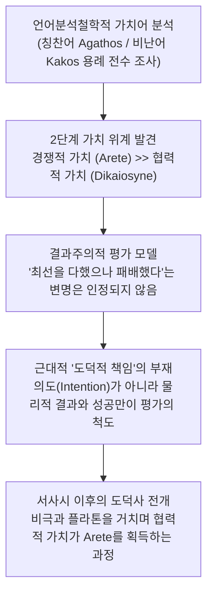

# 공적과 책임 (*Merit and Responsibility: A Study in Greek Values*)

> [!NOTE] 학술사적 의의 및 총평
> 아서 애드킨스의 『공적과 책임』(1960)은 호메로스 서사시부터 고전기 아테네 비극과 철학에 이르는 고대 그리스 윤리 가치관의 변천사를 다룬 20세기 고전학계의 가장 뜨거운 논쟁작입니다. 옥스퍼드 일상언어학파의 분석 방법을 문헌학에 결합하여 그리스 도덕 가치어를 **'경쟁적 가치(Competitive values)'**와 **'협력적 가치(Cooperative/Quiet values)'**로 엄격히 2분하고, 호메로스 사회에서는 전자의 절대적 압도로 인해 근대적 의미의 '도덕적 책임(Moral responsibility)'과 '의무' 개념이 존재할 수 없었다는 도발적 테제를 제시했습니다. 이 책은 이후 반세기 동안 호메로스 도덕성 논쟁의 표준적 기준점(Benchmark)이자 비판의 표적이 되었습니다.

---

## 1. 서지 정보 및 학술사적 맥락

- **저자**: 아서 윌리엄 호프 애드킨스 (Arthur William Hope Adkins, 1929–1996) — 옥스퍼드 대학교 및 시카고 대학교 서양고전학 및 철학 석좌교수.
- **출판 정보**: Clarendon Press: Oxford (1960, 380쪽).
- **연구 방법론**:
  - J. L. 오스틴(J. L. Austin)과 길버트 라일(Gilbert Ryle)의 옥스퍼드 일상언어학파 철학을 고대 그리스어 텍스트에 적용.
  - 가치 칭찬어(Terms of commendation: *agathos, arete, kalos*)와 가치 비난어(Terms of censure: *kakos, aischros*)의 문맥별 용례를 전수 조사하여, 언어가 규정하는 사회적 가치 위계를 객관적으로 도출.
- **핵심 문제의식**:
  - "왜 그리스인들은 칸트주의적 의미의 '순수한 도덕적 의무'나 '선한 의도에 따른 도덕적 면책'을 인정하지 않았는가?"
  - 애드킨스는 그 원인을 국가 사법 체계가 부재했던 호메로스 시대의 극단적인 생존 경쟁과 군사 귀족 사회 구조에서 찾았습니다.

---

## 2. 개념 전복 매트릭스 및 논증 계보도

### [호메로스 가치어의 2단계 위계 구조]

| 가치 범주 | 핵심 희랍어 어휘 | 사회적 기능 및 의미 | 평가 기준 및 성격 |
|:---|:---|:---|:---|
| **경쟁적 가치 (Competitive Values)** | **아가토스(*agathos*)**, **아레테(*arete*)**, **티메(*timê*)** | 군사적 용맹, 전투 승리, 부, 권력, 공동체 방어 역량 | **결과주의적 평가** (성공하면 도덕적 찬사, 실패하면 변명 없이 경멸) |
| **협력적/정적 가치 (Cooperative Values)** | **디카이오시네(*dikaiosyne*)**, **소프로시네(*sophrosyne*)**, **아이도스(*aidos*)** | 공정함, 절제, 타인 존중, 평화 유지, 계약 준수 | **2차적/종속적 가치** (경쟁적 가치와 충돌할 때 언제나 후순위로 밀림) |

### [Mermaid 논증 구조도]

---

## 3. 전 챕터별 정밀 독해 및 논증 단계 (호메로스 편 중심)

### 제1장: 서론 및 가치 용어의 분석틀 (*Introduction*)
- 도덕적 평가어의 작동 방식을 규명합니다. 사회가 어떤 행동을 칭찬하거나 비난할 때 사용하는 언어는 그 사회가 가장 절실하게 필요로 하는 가치를 반영합니다.
- 법원이나 경찰 같은 중앙 공권력이 없던 초기 그리스 사회에서, 한 가문(Oikos)과 공동체의 생존은 오직 전사들의 물리적 무력에 달려 있었습니다.

### 제2장: 호메로스의 가치 체계 (*Homeric Values*)
- **아가토스(Agathos)와 아레테(Aretē)의 본질**:
  - 'agathos'는 현대어의 '착한(good)'이 아니라, '전쟁에서 승리할 수 있는 유능함, 용기, 부, 가문'을 뜻합니다.
  - 전장에서 패배한 자는 "의도는 좋았다"거나 "최선을 다했다"고 변명할 수 없습니다. 패배는 곧 무능이며, 그는 즉각 비난어인 **'카코스(kakos, 나쁜/비천한 자)'**로 낙인찍힙니다.
- **아이스크론(Aischron)과 수치**:
  - 가장 수치스러운 것(Aischron)은 도덕적 악행이 아니라, 전쟁에서의 패배, 전리품의 상실, 신체적 무력함입니다.

### 제3장: 호메로스 사회에서의 책임과 불의 (*Responsibility and Injustice in Homer*)
- **디케([[concept-dike|Dike]])와 테미스([[concept-themis|Themis]])의 한계**:
  - 협력적 덕인 정의(Dike)는 경쟁적 덕인 아레테와 충돌할 때 힘을 잃습니다.
  - 『일리아스』 1권에서 아가멤논이 아킬레우스의 전리품을 빼앗은 것은 불의하지만, 아가멤논이 그리스 군단 전체의 최고 지휘관으로서 더 높은 아가토스(지위와 권력)를 지녔기 때문에 군사들은 이를 제지하지 못합니다.
  - 따라서 호메로스 영웅들의 갈등은 '정의와 불의의 싸움'이 아니라, **'서로 양보할 수 없는 두 아가토스의 경쟁적 티메([[concept-time|Timê]]) 충돌'**로 해석됩니다.

### 제4장~제14장: 서사시 이후 그리스 도덕관의 진화 (*From Hesiod to Aristotle*)
- 헤시오도스, 서정시, 비극(아이스퀼로스, 소포클레스, 에우리피데스), 소피스트, 그리고 플라톤과 아리스토텔레스에 이르기까지, 협력적 가치인 '정의'가 어떻게 점진적으로 최고의 덕(Arete)의 지위를 획득해 가는지를 추적합니다.

---

## 4. 문헌학적 어휘 사전 및 희랍어 개념 정밀 주해

1. **아가토스 (Agathos, ἀγαθός)**:
   - 본래 도덕적 선량함이 아니라, 탁월한 전사적 능력, 귀족적 혈통, 높은 사회적 지위와 번영을 포괄하는 최고 칭찬어.
2. **카코스 (Kakos, κακός)**:
   - 도덕적 사악함이 아니라, 비겁함, 나약함, 군사적 패배, 사회적 하층민의 비천함을 가리키는 최고 비난어.
3. **아레테 (Aretē, ἀρετή)**:
   - 전사로서의 탁월성, 무용(Courage), 전장에서의 기능적 유능함. 실패에 의해 즉각 상실되는 결과 중심의 덕.
4. **디카이오스 (Dikaios, δίκαιος)**:
   - 공정하고 관습적인 몫을 지키는 협력적 품성이지만, 아가토스의 권위와 충돌할 경우 강제력을 갖지 못함.

---

## 5. 핵심 원문 인용 및 심층 주석

### 인용 1: 아레테의 비도덕적·결과주의적 성격
> *"In Homer, arete is the excellence of a warrior. A man who fails in war cannot plead that he did his best; he has failed, and he is kakos. Intentions are irrelevant to arete."* (Chapter 2, p. 35)  
> **[주석]**: 애드킨스 테제의 핵심. 호메로스 사회에서 도덕적 평가는 행위자의 내면적 동기가 아니라 오직 외부로 드러난 성공과 실패라는 결과에 의해서만 결정됨을 단언함.

### 인용 2: 경쟁적 가치의 절대적 우위
> *"The competitive values are the most powerful in Homeric society. The quiet virtues of justice and moderation are recognized, but they must always give way when a man's arete and timē are at stake."* (Chapter 3, p. 54)  
> **[주석]**: 정의나 절제 같은 협력적 가치가 존재하지 않은 것은 아니지만, 명예와 무용이라는 경쟁적 가치 앞에서는 언제나 무력하게 굴복할 수밖에 없었던 아르카익 사회의 가치 위계를 지적함.

---

## 6. 서사시 전편 정밀 에피소드 매핑 테이블

| 서사시 권·행 번호 | 다루는 사건 및 인물 | 애드킨스의 언어분석적 해석 |
|:---|:---|:---|
| ***Il.* 1.148–171** | **아킬레우스와 아가멤논의 충돌** | 아가멤논은 군사적 서열에 따른 티메를, 아킬레우스는 전투력에 따른 아레테를 주장함. 협력적 규범(Dike)이 두 귀족의 경쟁적 명예 충돌을 중재하지 못하는 전형적 사례. |
| ***Il.* 2.211–277** | **테르시테스의 비난과 오디세우스의 응징** | 하층민 테르시테스가 아가멤논의 탐욕을 정당하게 비판했음에도, 그가 '카코스(무능한 자)'라는 이유로 매질을 당하고 군사들의 비웃음을 사는 장면은 신분과 무력이 정의를 압도함을 입증. |
| ***Il.* 6.441–446** | **헥토르의 출전 결의** | 헥토르는 가족과 조국의 안녕보다 "언제나 트로이아인들의 맨 앞줄에서 싸우는 아가토스(Arete)"가 되어야 한다는 경쟁적 명예의 압박에 굴복함. |
| ***Il.* 23.535–615** | **전차경주 상 배분 논쟁** | 아킬레우스가 꼴찌로 들어온 에우멜로스가 '가장 훌륭한 자(Agathos)'라는 이유로 2등 상을 주려 하자 안틸로코스가 반발하는 장면은, 영웅의 본질적 지위와 실제 경기 결과 사이의 긴장을 노정함. |

---

## 7. 학술 논쟁사 및 비판적 공방

> [!WARNING] 반세기 동안 이어진 '애드킨스 논쟁'의 전개
- **A. A. 롱의 반박 ([[long-1970-morals-and-values|A. A. Long, 1970, *JHS*]])**:
  - 롱 교수는 논문 「호메로스의 도덕과 가치」(*Morals and Values in Homer*)에서 애드킨스의 '경쟁적 vs 협력적' 2분법이 칸트주의적 편견에 기반한 도식적 왜곡이라고 비판함.
  - 호메로스 윤리의 본질을 2분법이 아닌 **'적절성의 기준(Standard of Appropriateness)'**과 과도/결핍의 통제로 재정립함.
- **휴 로이드-존스의 비판 ([[lloyd-jones-1971-justice-of-zeus|Hugh Lloyd-Jones, 1971]])**:
  - 『제우스의 정의』에서 애드킨스가 칸트주의적 편견에 사로잡혀, 서사시 전편에 흐르는 제우스의 도덕적 질서와 종교적 정의([[concept-dike|Dike]])의 강제력을 완전히 무시했다고 맹비판함.
- **C. J. 로우의 비판 (C. J. Rowe, 1973)**:
  - 『The Cambridge History of Classical Literature』 등에서 애드킨스가 고대 텍스트의 다채로운 도덕적 뉘앙스를 현대 법률적 책임 개념의 틀에 억지로 끼워 맞췄음을 지적함.
- **버나드 윌리엄스의 극복 ([[williams-1993-shame-and-necessity|Bernard Williams, 1993]])**:
  - 애드킨스의 '호메로스 시대 책임 개념 결여론'은 고대인의 성숙한 행위 인과성 파악 능력을 오해한 것이며, 호메로스 영웅들은 결과에 대한 깊은 책임을 온전히 인식하고 있었다고 논파함.

---

## 8. 연구 질문 및 세미나 토론 쟁점

1. **2분법의 타당성 검토**: 현대 사회의 자본주의적 경쟁 가치와 비교할 때, 애드킨스가 제시한 '경쟁적 가치'와 '협력적 가치'의 대립 모델은 고대 아르카익 귀족 사회의 특수성을 설명하는 데 얼마나 유효한가?
2. **테르시테스 에피소드의 재해석**: 『일리아스』 2권의 테르시테스 처벌은 애드킨스의 주장처럼 협력적 정의의 완전한 패배인가, 아니면 군사적 위기 상황에서 지휘 체계를 유지하기 위한 불가피한 조치였는가?
3. **칸트적 도덕관의 극복**: 애드킨스가 결함으로 지적한 '의도 중심 책임의 부재'는, 현대 윤리학(예: 결과주의나 덕 윤리)의 관점에서 볼 때 오히려 행위의 현실적 파급력을 중시하는 성숙한 현실주의로 재평가될 수 있는가?

---

## 관련 항목

- [[homeric-ethics-literature-review]]
- [[long-1970-morals-and-values]]
- [[scott-1980-aidos-and-nemesis]]
- [[concept-arete|Arete]]
- [[concept-time|Timê]]
- [[concept-dike|Dike]]
- [[concept-aidos|Aidos]]
- [[concept-nemesis|Nemesis]]
- [[concept-themis|Themis]]
- [[williams-1993-shame-and-necessity]]
- [[cairns-1993-aidos]]
- [[lloyd-jones-1971-justice-of-zeus]]
- [[snell-1946-discovery-of-mind]]
- [[dodds-1951-greeks-and-irrational]]
