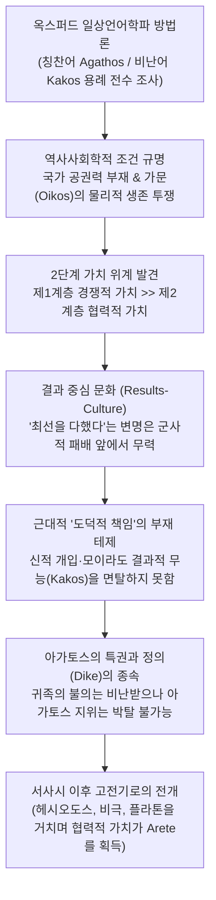

# 공적과 책임 (*Merit and Responsibility: A Study in Greek Values*)

> [!NOTE] 학술사적 의의 및 총평
> 아서 W. H. 애드킨스(Arthur W. H. Adkins)의 『공적과 책임』(Merit and Responsibility: A Study in Greek Values, 1960)은 호메로스 서사시부터 고전기 아테네 비극과 철학에 이르는 고대 그리스 윤리 가치관의 변천사를 다룬 20세기 서양고전학계의 가장 뜨거운 논쟁작입니다. 옥스퍼드 일상언어학파(J. L. Austin, Gilbert Ryle)의 분석철학적 방법론을 고대 그리스어 문헌학에 결합하여 그리스 도덕 가치어를 ‘경쟁적 가치(Competitive values)’와 ‘협력적/정적 가치(Cooperative/Quiet values)’로 엄격히 2분하고, 호메로스 사회에서는 전자의 절대적 압도로 인해 근대적 의미의 '도덕적 책임(Moral responsibility)'과 '의무' 개념이 구조적으로 주변화될 수밖에 없었다는 도발적 테제를 제시했습니다. 이 책은 출간 직후부터 A. A. Long, Hugh Lloyd-Jones, Bernard Williams, Douglas Cairns, Margalit Finkelberg 등 쟁쟁한 학자들의 격렬한 반박과 수정을 촉발하며, 지난 반세기 동안 고대 그리스 윤리학 연구의 필수 불가결한 기준점(Benchmark)이자 거대한 비판적 분수령으로 기능해 왔습니다.

---

## 1. 서지 정보 및 지성사적 배경

### 1.1 서지 정보 및 연구 방법론

- **저자**: 아서 윌리엄 호프 애드킨스 (Arthur William Hope Adkins, 1929–1996)
  - 영국 옥스퍼드 대학교 머튼 칼리지(Merton College)에서 수학.
  - 옥스퍼드 대학교, 리딩 대학교(University of Reading)를 거쳐 미국 시카고 대학교(University of Chicago) 서양고전학 및 철학 석좌교수(Edward L. Ryerson Distinguished Service Professor) 역임.
- **출판 정보**: Clarendon Press: Oxford (1960), viii + 380쪽. (Oxford University Press).
- **연구 방법론**:
  - **옥스퍼드 일상언어학파(Ordinary Language Philosophy)의 문헌학적 이식**: J. L. 오스틴(J. L. Austin)과 길버트 라일(Gilbert Ryle)의 언어 행위 및 일상 언어 분석틀을 고대 그리스 텍스트에 체계적으로 적용했습니다.
  - **가치어의 기능주의적 전수 조사**: 최고 칭찬어(Terms of highest commendation: *agathos, arete, kalos*)와 최고 비난어(Terms of highest censure: *kakos, aischros*)의 실제 문맥별 용례를 분석하여, 도덕적 언어가 행위자에게 행사하는 사회적 제재(Sanctions)와 유인가(Incentives)의 위계를 객관적으로 도출했습니다.

### 1.2 지성사적 맥락: 칸트주의적 편견 비판과 패러다임 전복

서양 근대 윤리학은 임마누엘 칸트(Immanuel Kant)의 의무론적 모델에 깊이 각인되어 있습니다:
- 행위자의 내면적 '선의지(Good Will)', 도덕적 의무감, 그리고 "의무는 능력을 함축한다('Ought' implies 'can')"는 원칙이 도덕적 책임의 전제 조건으로 여겨집니다.
- 어떤 행위자가 최선을 다했으나(he did his best) 불가항력적 외적 강제나 예측 불가능한 사고로 실패했을 때, 근대적 도덕관은 그에게 도덕적 책임을 면제(Exculpation)해 줍니다.

애드킨스는 현대 학자들의 이러한 직관을 꼬집어 "우리 모두는 칸트주의자다(We are all Kantians now)"라고 선언하며 논의를 시작합니다:
- 현대 서구 학자들은 자신도 모르게 칸트주의적 도덕 범주를 호메로스 텍스트에 투사하여, 호메로스 영웅들도 당연히 '의도'에 따라 책임을 평가받았을 것이라고 지레짐작했습니다.
- 그러나 애드킨스는 호메로스 서사시의 가치 체계가 근대적 의미의 '순수한 도덕적 의무'나 '의도 중심의 면책'을 원천적으로 인정하지 않는 전혀 다른 구조 위에 서 있다고 역설했습니다.

### 1.3 사회역사적 조건: 국가 사법 공권력 부재와 오이코스(Oikos)의 생존 투쟁

애드킨스가 제시하는 호메로스 가치 체계의 근본 토대는 원초적인 사회 구조적 불안정성입니다:
- **중앙 공권력의 부재**: 호메로스 세계에는 경찰, 국가 사법 재판소, 법률, 상비군이 존재하지 않습니다.
- **오이코스([[concept-oikos|Oikos]], 가문·씨족)의 자력구제**: 한 가문과 공동체의 안전, 식량, 여성, 가축은 오직 외부 침략자를 물리적으로 격퇴할 수 있는 군사 귀족, 즉 **아가토스**(ἀγαθός, *agathós*)의 완력과 전사적 탁월성(**아레테**, ἀρετή, *aretḗ*)에 전적으로 의존합니다.
- **결과주의적 평가의 필연성**: 적대적 부족이나 도적 떼가 침략해 왔을 때, "비록 패배했으나 최선을 다했다"는 변명은 가문의 몰살과 노예화를 막아주지 못합니다. 오직 '실제적인 승리와 방어'라는 물리적 결과만이 의미를 가집니다. 따라서 호메로스 사회에서 도덕적 언어는 '의도'가 아니라 '물리적 성공과 실패'에 독점적으로 결속될 수밖에 없었습니다.

---

## 2. 개념 전복 매트릭스 및 Mermaid 논증 계보도

### 2.1 호메로스 가치어의 2단계 위계 구조 (Two-Tier Value System)

애드킨스는 호메로스 사회의 가치어를 상호 화해하기 어려운 두 개의 위계 계층으로 엄격히 구분합니다:

| 가치 범주 | 그리스어 실제형 | 학술 전사 | 핵심 한국어 표제어 | 사회적 기능 및 적용 영역 | 평가 기준 및 제재 방식 |
|:---|:---|:---|:---|:---|:---|
| **제1계층: 경쟁적 가치**<br/>(Competitive Values) | ἀγαθός<br/>ἀρετή<br/>τιμή<br/>κακός<br/>αἰσχρός | *agathós*<br/>*aretḗ*<br/>*timḗ*<br/>*kakós*<br/>*aiskhrós* | **아가토스**<br/>**아레테**<br/>**티메**<br/>**카코스**<br/>**아이스크론** | 전장 승리, 가문 수호, 부·권력 획득, 적 섬멸, 공동체 물리적 방어 | **결과주의적 평가 (Results-culture)**<br/>성공하면 최고의 찬사, 실패하면 변명 없이 비난과 경멸 귀속 |
| **제2계층: 협력적/정적 가치**<br/>(Cooperative / Quiet Values) | δικαιοσύνη<br/>σώφρων<br/>αἰδώς<br/>θέμις<br/>φιλότης | *dikaiosúnē*<br/>*sṓphrōn*<br/>*aidṓs*<br/>*thémis*<br/>*philótēs* | **디카이오시네**<br/>**소프론**<br/>**아이도스**<br/>**테미스**<br/>**필로테스** | 공정한 분배, 계약 준수, 절제, 손님 환대, 친족·동맹 존중, 평화 유지 | **2차적·종속적 평가**<br/>경쟁적 가치와 충돌할 때 무력하게 후순위로 밀림. 위반해도 아가토스 지위 유지 |

### 2.2 개념 대조 매트릭스: 근대 도덕관 vs 호메로스 애드킨스 모델

| 분석 층위 | 근대 칸트주의적 도덕 모델 (Kantian Morality) | 호메로스 영웅 윤리 (Adkins 1960 모델) |
|:---|:---|:---|
| **핵심 평가 기준** | 내면적 동기, 선의지, 도덕적 의무 준수 여부 | 외적인 물리적 성공(Success)과 실질적 결과 |
| **실패 시 면책 여부** | "최선을 다했으나 불가항력이었다"면 도덕적 면책 | 어떤 변명도 무효. 실패는 곧 무능이자 **카코스** 전락 |
| **신적 개입의 효과** | 외적 강제이므로 인간의 책임을 경감하는 근거 | 신이 개입했더라도 행위의 파멸적 결과는 온전히 전사에게 귀속 |
| **최고 찬사어의 성격** | '선한(Good)', '정의로운(Just)' 등 도덕적 품성어 | '유능한(Capable)', '용맹한(Brave)', '부유한(Wealthy)' 등 군사적 성공어 |
| **최고 비난어의 성격** | '사악한(Wicked)', '부도덕한(Immoral)' | '쓸모없는(Useless)', '비겁한(Cowardly)', '실패한(Failed)' |
| **정의(Dike)의 위상** | 타협할 수 없는 절대적 범주이자 제1덕목 | 아가토스의 명예(Timê) 앞에서는 언제든 희생되는 2차적 편의 |
| **사회적 제재 수단** | 내면의 죄의식(Guilt)과 법률적 처벌 | 동료 귀족들의 외적 조롱, 멸시, 수치(Shame) |

### 2.3 Mermaid 논증 계보도



---

## 3. 전 챕터별 정밀 독해 및 논증 단계 전수 분석

### 제1장: 도덕적 책임과 그리스 도덕 사상 (Moral Responsibility and Greek Moral Thought, pp. 1–9)

- **일상언어학적 분석틀과 가치 평가어의 구속력**:
  - 사회가 인간의 행동을 통제하고 권장하는 가장 강력한 수단은 법률 이전에 '언어'입니다. 특정 행위에 부여되는 최고 칭찬어(Commendation)와 최고 비난어(Censure)의 배치가 사회적 가치 체계의 뼈대를 형성합니다.
  - 근대 사회에서 가장 강력한 칭찬어는 도덕적 의미의 '선한(Good)'이며, 가장 무거운 비난어는 '사악한(Wicked)' 혹은 '도덕적으로 잘못된(Morally wrong)'입니다. 근대인에게 비도덕성은 그 어떤 기능적 유능함으로도 상쇄되지 않는 절대적 오점입니다.
- **칸트적 전제의 해체와 '의무'의 한계**:
  - 근대 윤리학은 "당신은 그것을 해야만 했다(You ought to have done it)"라는 말이 오직 "당신이 그것을 할 수 있었을 때(You could have done it)"에만 성립한다고 봅니다. 즉 행위자의 물리적 통제 범위를 벗어난 사건에 대해서는 도덕적 비난을 가하지 않는 것이 상식입니다.
  - 그러나 고대 그리스어 텍스트를 면밀히 분석하면, 그리스인들은 행위자가 통제할 수 없었던 외부적 강제나 운명적 실수에 대해서도 가차 없이 가치 평가 절하를 내렸음이 확인됩니다.
- **사법 체계의 부재와 도덕적 책임의 주변화**:
  - 근대적 의미의 '도덕적 책임'이란 법적 처벌과 구별되는 내면적 양심의 몫입니다. 그러나 중앙 집권적 사법 기관이나 성문법이 없던 초기 그리스에서는 공적 비난과 사회적 평판이 곧 법이자 윤리였습니다.
  - 따라서 호메로스 시대에 인간의 행위를 규율한 것은 내면적 동기의 순수성이 아니라, 그 행위가 가문과 공동체에 가져온 객관적 손익 결과였습니다.

---

### 제2장: 호메로스: 자유의지와 강제 (Homer: Free Will and Compulsion, pp. 10–29)

#### A. 서론 및 인간적 강제 (Human Compulsion, p. 10)
- 전쟁에서 포로로 잡혀 노예가 된 자는 자신의 의지와 무관하게 물리적 강제를 겪은 피해자입니다. 근대적 관점에서 그는 동정받아야 할 무고한 인간입니다.
- 그러나 호메로스 세계에서 노예는 신체적 자유뿐만 아니라 자신의 인격적 탁월성 자체를 상실한 자로 간주됩니다.
- 『오뒷세이아』 17권 322–323행에서 에우마이오스는 다음과 같이 말합니다:
  - "멀리 보시는 제우스께서는 인간에게 노예의 날이 닥치는 순간, 그의 아레테([[concept-arete|Arete]]) 절반을 앗아가 버리신다."
  - 여기서 노예화라는 외적 강제는 동정의 사유가 될 수는 있어도, 그가 '카코스'로 전락하는 것을 막아주지 못합니다. 그는 강제당했기 때문에 이제 열등한 인간이 된 것입니다.

#### B. 원인으로서의 신들 (The Gods as Cause, pp. 11–17)
- **(i) 호메로스 신들의 본질**:
  - 올림포스의 신들은 도덕적 의무를 집행하는 정의로운 심판관이 아니라, 인간보다 압도적으로 강한 물리적 힘을 지닌 변덕스러운 불멸자들입니다. 신들은 인간의 '선함'에 반응하기보다 자신의 호불호, 제물의 양, 혈통적 친분, 혹은 개인적 모욕감에 따라 움직입니다.
- **(ii) 호메로스 신앙의 효과**:
  - 전장에서 영웅의 창이 빗나가거나 갑작스러운 공포에 사로잡혀 후퇴할 때, 시인은 신(아폴론, 아레스, 아테나)이 개입하여 영웅의 마음을 홀렸거나 무기를 빗나가게 했다고 설명합니다.
  - 그러나 이러한 '신적 원인 작용'은 영웅을 결과적 패배의 수치로부터 면책(Exculpate)해주지 못합니다. 동료들은 "신이 그를 방해했다"는 사실을 인정할지언정, 후퇴한 전사를 여전히 전선의 패배자로 취급합니다. 신이 원인이었다는 사실은 도덕적 변명이 아니라, 단지 '패배라는 객관적 참사'를 설명하는 우주론적 사실 진술에 불과합니다.

#### C. 모이라 (Moira, pp. 17–23)
- **(i) 믿음의 본질**:
  - **모이라**([[concept-moira|Moira]])는 도덕적 섭리(Providence)가 아니라, 우주적 질서 내에서 각 존재에게 할당된 '물리적 한계'이자 '피할 수 없는 몫(Allotment)'입니다. 영웅의 수명, 죽음의 순간, 운명적 파멸은 모이라에 의해 냉혹하게 결정되어 있습니다.
- **(ii) 믿음의 효과**:
  - 어떤 영웅이 모이라에 의해 죽음에 이른다고 해서, 그 죽음이 패배가 아니게 되는 것은 아닙니다. 헥토르는 자신의 모이라를 예감하면서도 결코 비겁하게 물러설 수 없습니다. 운명이 패배를 강제할지라도 패배는 여전히 쓰라린 굴욕이며, 영웅은 모이라의 강제 속에서도 오직 마지막 순간까지 싸움으로써 자신의 아레테를 입증해야만 합니다.

#### D. 호메로스적 입장의 위험성 (Possible Dangers of the Homeric Position, pp. 23–29)
- 애드킨스는 호메로스적 결과주의가 안고 있는 치명적인 가혹함을 지적합니다:
  - 인간의 모든 노력과 의도가 외적인 신적 개입과 모이라에 의해 언제든 좌절될 수 있음에도 불구하고, 사회는 오직 최종적인 결과(성공과 실패)만을 보고 개인을 칭찬하거나 경멸합니다.
  - 이는 인간 행위자에게 극심한 실존적 불안을 야기하며, 영웅들로 하여금 자신의 명예([[concept-time|Timê]])를 지키기 위해 극도로 방어적이고 공격적인 태도를 취하게 만듭니다.

---

### 제3장: 호메로스: 착오와 도덕적 과오 (Homer: Mistake and Moral Error, pp. 30–60)

#### A. 가장 중요한 자질: 아가토스와 그의 아레테 (The Agathos and his Arete, pp. 31–35)
- **아가토스(ἀγαθός, *agathós*)의 비도덕적 성격**:
  - 아가토스는 결코 근대어의 '선한 사람(Good person)'이 아닙니다. 이 단어는 고귀한 가문 출신이며, 막대한 재산과 군사를 거느리고, 전장에서 적을 도륙하여 공동체를 지켜낼 수 있는 '유능한 전사 귀족'을 뜻합니다.
- **아레테(ἀρετή, *aretḗ*)의 본질**:
  - 아레테는 인격적 온유함이나 자비심이 아니라, '전투적 용맹과 물리적 탁월성(Warrior prowess)'입니다.
  - 전장에서 실패한 자는 "최선을 다했다"고 항변할 수 없습니다. 패배는 곧 무능이며, 그는 즉각 최고 비난어인 ‘**카코스(κακός, *kakós*; 비천하고 쓸모없는 자)**’로 전락합니다.
- **아이스크론(αἰσχρός, *aiskhrós*)의 공포**:
  - 가장 수치스러운 것(*aischron*)은 도덕적 죄악이 아니라, 전쟁에서의 패배, 무기의 상실, 도망치는 행위, 적에게 전리품을 빼앗기는 굴욕입니다.

#### B. 아레테 기준의 사회적 정당화 (The Justification of the Arete-Standard, pp. 35–40)
- 왜 호메로스 사회는 경쟁적 아레테를 모든 가치의 최정점에 두었는가?
- 애드킨스는 이것이 단순한 야만성의 소치가 아니라, 당시 사회의 냉혹한 현실적 필요에서 비롯된 것임을 밝힙니다:
  - 성벽 바깥의 세계는 약육강식의 전쟁터였습니다. 한 마을이나 가문이 약탈당할 때, 정의나 법은 아무런 방어막이 되어주지 못합니다.
  - 가문의 처자식이 노예로 끌려가지 않고 생존할 수 있는 유일한 보루는, 칼을 쥐고 선두에 서서 적의 목을 베는 아가토스의 완력뿐입니다.
  - 따라서 공동체 구성원 전체는 아가토스가 제멋대로 굴고 거만하더라도, 그의 무력이 보장하는 집단적 안전을 위해 그에게 최고의 찬사와 특권을 부여할 수밖에 없었습니다.

#### C. 여성의 아레테 (Women's Arete in the Homeric Poems, pp. 40–46)
- 호메로스 사회에서 여성은 전장에 나갈 수 없으므로, 남성 전사와 동일한 경쟁적 아레테를 가질 수 없습니다.
- 여성의 아레테는 철저히 오이코스 내부의 기능적 유용성으로 규정됩니다:
  - 『오뒷세이아』의 페넬로페가 보여주듯, 여성의 아레테는 뛰어난 가사 관리 능력, 절제, 정절, 그리고 아름다운 직조 기술(*erga*)에 국한됩니다.
  - 이는 남성 가장의 오이코스를 온전히 보존하고 번영시키는 데 기여하는 종속적 탁월성입니다.

#### D. 아레테와 협력적 탁월성의 관계 (Arete and the Co-operative Excellences, pp. 46–48)
- 정의(**디카이오시네**, *dikaiosúnē*), 절제(**소프로시네**, *sōphrosúnē*), 타인 존중(**아이도스**, *aidṓs*) 같은 협력적 덕목들도 호메로스 사회에서 유용한 덕목으로 인정받았습니다.
- 그러나 이 협력적 가치들은 경쟁적 가치와 충돌할 때 언제나 무력하게 패배했습니다:
  - 아가토스가 다른 영웅의 재물을 빼앗거나 불의를 저질렀을 때, 사람들은 그것이 온당치 못하다고 수군거릴 수는 있어도, 그 이유로 그가 '카코스'가 되는 것은 아닙니다.
  - 그는 여전히 강력하고 두려운 '아가토스'이며, 아무도 그를 면전에서 사회적으로 매장할 수 없습니다.

#### E. 호메로스에서의 설득적 정의 (Persuasive Definitions in Homer, pp. 48–49)
- 애드킨스는 『일리아스』 23권 파트로클로스 장례 경기 전차 경주 에피소드를 '가치 용어의 설득적 정의(Persuasive Definition)'가 출현하는 결정적 장면으로 분석합니다:
  - 경기 중 사고로 꼴찌로 결승선을 통과한 에우멜로스를 보고, 아킬레우스는 "가장 훌륭한 자(aristos)가 꼴찌로 들어왔으니 그에게 2등 상을 주자"고 제안합니다 (*Il.* 23.536–538). 아킬레우스는 신분적·선험적 아가토스의 논리를 경기에 적용한 것입니다.
  - 이에 2등으로 들어온 안틸로코스가 격렬히 항의합니다. 안틸로코스는 에우멜로스가 아무리 훌륭할지라도 상은 실제 경주 결과에 따라 주어져야 한다고 맞섭니다 (*Il.* 23.543–554).
  - 이는 '선천적 신분과 위세로서의 아가토스'와 '실제 행위의 성과로서의 아레테' 사이의 균열을 보여주는 최초의 징후입니다.

#### F. 결과와 사회적 제재: 사회의 요구 vs 아가토스의 권리 (pp. 49–60)
- 사회는 아가토스에게 최전선에 서서 목숨을 바쳐 싸울 것을 요구하지만, 아가토스는 자신의 명예(Timê)가 모욕당하면 언제든 전열을 이탈할 자유를 가집니다.
- 『일리아스』 1권에서 아가멤논에게 모욕당한 아킬레우스가 참전을 거부하고 막사로 물러났을 때, 그리스 군대는 파멸적 위기에 처하지만 아킬레우스를 강제할 법적 수단이 없습니다.
- 공동체는 아가토스를 처벌할 수 없으며, 오직 탄원(Hikesia)과 막대한 배상(Apoina, Dora)을 통해 그의 상처 입은 티메를 달래는 수밖에 없습니다.

---

### 제4장: '정의': 호메로스에서 5세기까지 (Justice: Homer to the Fifth Century, pp. 61–85)

#### A. 문제 제기 (The Problem, p. 61)
- 어떻게 협력적 가치인 '정의(**디케**, δίκη, *díkē*)'가 아르카익기와 고전기를 거치며 경쟁적 탁월성인 아레테를 제치고 그리스 도덕의 최고 정점으로 등극할 수 있었는가?

#### B. 정의와 신들 (Justice and the Gods, pp. 62–70)
- **(i) 비도덕적 신들(Non-moral Gods, p. 62)**:
  - 『일리아스』의 신들은 인간의 도덕적 정의에 관심이 없습니다. 아가멤논이 조약을 깨거나 트로이아인들이 맹세를 어겨도, 신들은 정의 그 자체 때문이 아니라 자신에게 바쳐진 제물과 개인적 원한에 따라 움직입니다.
- **(ii) 도덕적 신들의 맹아(Moral Gods, p. 65)**:
  - 『오뒷세이아』 1권에서 제우스는 인간들이 스스로의 방자함(**아타스탈리아**, atasthalia)으로 파멸을 자초해 놓고 신들을 탓한다고 한탄합니다.
  - 『일리아스』 16권 384–392행의 유명한 '가을 폭우 직유'에서 제우스는 굽은 판결을 내리는 불의한 인간들에게 분노하여 홍수를 내립니다.
  - 그러나 애드킨스는 이러한 구절들이 호메로스 서사시 전체의 지배적 세계관이라기보다는, 서사시 말기에 침투한 새로운 도덕적 신앙의 편린에 불과하다고 봅니다.

#### C. 정의와 아레테: 호메로스와 헤시오도스의 단절 (Justice and Arete, pp. 70–85)
- 헤시오도스의 『일과 날』(*Erga et Hemerai*)에 이르러 비로소 결정적인 윤리적 전복이 일어납니다:
  - 귀족 전사가 아닌 힘없는 농민의 처지에서, 아가토스의 완력은 보호막이 아니라 '선물을 삼키는 탐욕스러운 귀족들'의 폭력으로 경험됩니다.
  - 헤시오도스는 제우스의 눈이 불의를 감시하고 있으며, 정의를 지키는 자만이 궁극적으로 번영한다는 신앙을 설파함으로써 '정의(Dike)'를 생존과 성공을 위한 최고의 실용적 탁월성으로 격상시켰습니다.

---

### 제5장: '오염' ('Pollution', pp. 86–115)

- **호메로스 서사시에서의 종교적 오염(미아스마, Miasma) 부재**:
  - 기원전 5세기 비극(예: 소포클레스의 『오이디푸스 왕』)에서는 살인이 도시 전체를 파멸로 몰고 가는 무시무시한 종교적 오염(**미아스마**, μίασμα)을 발생시킵니다.
  - 그러나 호메로스 서사시에는 살인으로 인한 종교적 오염 개념이 완전히 결여되어 있습니다.
- **세속적·물질적 해결 방식: 포이네(Poine)와 자발적 망명**:
  - 호메로스 세계에서 살인은 신들에 대한 죄악이 아니라, 피해자 가문(Oikos)의 노동력과 무력을 훼손한 '사적 침해'일 뿐입니다.
  - 이 문제는 지극히 실용적이고 세속적인 방식으로 해결됩니다:
    1. **포이네(ποινή, *poinḗ*)**: 가해자가 피해자 유족에게 소, 말, 청동 등 물질적 살인 배상금을 지불하고 유족이 이를 수락하면 모든 갈등이 종결됩니다 (*Il.* 9.632–636).
    2. **자발적 망명**: 배상금 합의가 이루어지지 않을 경우, 가해자는 유족의 피의 복수를 피해 다른 나라로 도망쳐 다른 아가토스의 막사에 탄원자(Hiketês)로 몸을 의탁하면 그만입니다. 그를 받아들인 도시는 그 어떤 종교적 오염도 두려워하지 않습니다.
  - 애드킨스는 이를 통해 호메로스 사회의 도덕이 종교적 금기나 신성한 죄의식이 아니라, 철저히 세속적인 명예와 보상의 논리로 굴러갔음을 최종 증명합니다.

---

## 4. 문헌학적 어휘 사전 및 희랍어 개념 정밀 주해

```
transliteration_system: homeric-oriented-v1
```

| 그리스어 실제형 | 학술 전사 | 표준 표제어 | 품사 | 애드킨스(1960)의 문맥적 정의 및 기능 분석 |
|:---|:---|:---|:---|:---|
| ἀγαθός | *agathós* | **아가토스** (Agathos) | 형용사 | 도덕적 선량함이 아닌, 귀족적 혈통, 막강한 군사력, 부, 가문 수호 역량을 포괄하는 최고 칭찬어. 전쟁에서 실패하면 즉각 박탈됨. |
| ἀρετή | *aretḗ* | **아레테** (Arete) | 명사 | 전사로서의 기능적 탁월성, 무용(Courage), 적을 격퇴하는 완력. '의도'와 무관하게 오직 외적인 성공을 통해서만 입증되는 경쟁적 덕. |
| κακός | *kakós* | **카코스** (Kakos) | 형용사 | 도덕적 사악함이 아닌, 전장에서 도망치거나 패배한 자, 노예, 신체적·군사적 무능력자를 가리키는 최고 비난어. |
| αἰσχρός | *aiskhrós* | **아이스크론** (Aischron) | 형용사 | 가장 수치스럽고 혐오스러운 상태. 비도덕적 악행이 아니라 패배, 굴욕, 약탈당함, 실패를 의미함. |
| τιμή | *timḗ* | **티메** (Timê) | 명사 | 전리품(Geras), 영지(Temenos), 상석으로 가시화되는 영웅의 객관적 사회적 몫과 명예. 침해당했을 때 죽음을 불사한 분노를 유발함. |
| δίκαιος | *díkaios* | **디카이오스** (Dikaios) | 형용사 | 관습적인 몫을 존중하고 공정하게 행동하는 품성. 그러나 아가토스의 경쟁적 이익과 충돌할 때 강제력을 상실함. |
| αἰδώς | *aidṓs* | **아이도스** (Aidos) | 명사 | 타인의 시선, 동료 귀족들의 조롱과 경멸에 대한 외적 두려움 및 수치심. 영웅을 사선으로 내모는 핵심 사회적 통제 기제. |
| μοῖρα | *moîra* | **모이라** (Moira) | 명사 | 인간에게 할당된 피할 수 없는 물리적 운명의 몫. 신적 강제일지라도 패배의 수치로부터 인간을 면책해주지 못함. |
| ἄτη | *átē* | **아테** (Ate) | 명사 | 신이 인간의 눈을 멀게 하여 파멸적 오판을 내리게 만드는 일시적 광기. 아가멤논이 19권에서 책임을 외주화하는 변명으로 사용. |
| ποινή | *poinḗ* | **포이네** (Poine) | 명사 | 살인 피해자 가문에 지불하는 물질적 배상금. 종교적 오염(Miasma) 없이 세속적으로 분쟁을 종결하는 장치. |

---

## 5. 핵심 원문 인용 및 심층 주석

### 인용 1: 결과 중심 문화와 칸트주의 비판 (Ch. 1, p. 2)

- *"We are all Kantians now, so far as thinking that 'moral responsibility' is central to any discussion of merit and blame... But in Homer, the question 'Could he help it?' is simply not asked. The question is 'Did he succeed or fail?'"* (Chapter 1, p. 2)
- **[주석]**: 애드킨스 테제의 근본 공리. 현대 윤리학은 행위자가 통제할 수 없었던 일에 대해 책임을 묻지 않지만, 호메로스 사회는 행위자가 어쩔 수 없었던 외적 강제나 신적 방해를 겪었더라도 오직 '성공했는가, 실패했는가'라는 결과만을 유일한 평가 척도로 삼았음을 선언합니다.

### 인용 2: 아레테의 전사적 성격과 변명 불가능성 (Ch. 3, p. 35)

- *"In Homer, arete is the excellence of a warrior. A man who fails in war cannot plead that he did his best; he has failed, and he is kakos. Intentions are irrelevant to arete."* (Chapter 3, p. 35)
- **[주석]**: 호메로스 영웅 사회에서 아레테가 순수하게 결과주의적이고 기능적인 탁월성이었음을 명쾌하게 요약합니다. 전선의 붕괴 앞에서 "선의를 가지고 최선을 다했다"는 내면적 주관성은 아무런 가치도 인정받지 못하며, 실패자는 가차 없이 비난어인 '카코스'로 낙인찍힙니다.

### 인용 3: 중앙 사법 권력 부재와 아가토스 기준의 정당화 (Ch. 3, p. 36)

- *"The arete-standard is justified by the needs of the society. In a world with no centralized government and no police force, the existence of the family depends on the prowess of the head of the oikos. If he fails, his family is sold into slavery. Society cannot afford to commend good intentions; it must demand success."* (Chapter 3, p. 36)
- **[주석]**: 애드킨스가 가치 체계의 배후에 놓인 역사사회학적 필연성을 규명한 핵심 대목. 국가와 법률이 없는 극한의 약육강식 환경에서 가문의 몰살을 막아주는 것은 오직 가장의 무력뿐이므로, 사회 전체가 아가토스의 전사적 성공을 도덕적 선함보다 상위에 둘 수밖에 없었음을 논증합니다.

### 인용 4: 호메로스 신들의 비도덕성과 책임의 외주화 (Ch. 2, p. 14)

- *"The Homeric gods are not guardians of morality; they are powerful beings who intervene in human affairs for their own purposes... When Agamemnon blames Zeus and Ate for his folly, he is not seeking moral acquittal in our sense; he is explaining a disaster."* (Chapter 2, p. 14)
- **[주석]**: 아가멤논이 『일리아스』 19권에서 자신의 잘못을 제우스와 아테의 탓으로 돌리는 행위는 근대적인 '도덕적 무죄 주장'이 아니라, 재앙의 객관적 원인을 외재화하여 체면을 세우는 수사학적 장치였음을 밝힙니다.

### 인용 5: 살인의 비종교적 성격과 미아스마의 부재 (Ch. 5, p. 88)

- *"In Homer homicide is not an offense against the gods, nor does it create pollution (miasma). It is a private wrong done to the family of the dead man, which can be settled by the payment of a poine or by flight."* (Chapter 5, p. 88)
- **[주석]**: 고전기 아테네 비극과 달리 서사시 시대에는 살인이 종교적 불경(Asebeia)이나 오염으로 취급되지 않았으며, 오직 피해자 가문과의 물질적 배상(Poine)이나 망명으로 종결되는 철저히 세속적인 손해 배상 문제였음을 실증합니다.

---

## 6. 서사시 전편 정밀 에피소드 매핑 테이블

| 서사시 권·행 | 다루는 사건 및 인물 | 애드킨스(1960)의 언어분석적·결과주의적 해석 | 후속 학술 연구의 비판 및 재해석 |
|:---|:---|:---|:---|
| ***Il.* 1.148–171** | **아킬레우스와 아가멤논의 충돌** | 두 최상위 아가토스 간의 경쟁적 티메 충돌. 사법적 중재 기구가 없으므로 군 통솔권(아가멤논)과 전투력(아킬레우스)의 우열 다툼은 파멸적 분열로 치달음. | 롱(1970)과 핀켈버그(1998): 단순한 힘겨루기가 아니라, 전리품 분배의 공정성 규범(Dike)과 위계적 질서의 정당성을 둘러싼 규범적 충돌. |
| ***Il.* 2.211–277** | **테르시테스의 비난과 체벌** | 하층민 테르시테스의 비판이 내용상 정당했음에도, 그가 무력이 없는 '카코스'라는 이유로 오디세우스에게 매질당하고 군사들의 비웃음을 삼. | 포스틀스웨이트(1998): 전제적 폭력의 고발이며, 군대 내부의 반귀족적 긴장과 발언권([[concept-parrhesia\|Parrhesia]])의 맹아를 노정함. |
| ***Il.* 6.441–446** | **헥토르와 안드로마케의 작별** | 헥토르는 아내에 대한 연민보다 트로이아 백성들에 대한 아이도스(Aidos, 수치심)와 "항상 맨 앞줄에서 싸워야 한다"는 아레테의 명령에 굴복함. | 케언스(1993): 아이도스는 단순한 외적 평판에 대한 공포가 아니라, 조국 방어라는 도덕적 책무를 온전히 내면화한 고결한 의무감. |
| ***Il.* 9.314–429** | **아킬레우스의 사절단 거부** | 아가멤논의 막대한 선물 공세는 아킬레우스의 아레테를 돈으로 굴복시키려는 시도임. 아킬레우스는 결과주의적 보상 체계 자체에 실존적 회의를 품음. | 윌리엄스(1993): 아킬레우스는 영웅 사회의 도덕 언어 자체가 지닌 한계를 꿰뚫어 보고 독자적인 가치 기준을 모색하는 성숙한 주체. |
| ***Il.* 16.684–691** | **파트로클로스의 성벽 돌진** | 파트로클로스가 아킬레우스의 경고를 잊고 아테(Ate)에 눈이 멀어 성벽으로 돌진하다 전사함. 최선의 용맹을 떨쳤으나 결과적 파멸로 귀결됨. | 케언스(2012): 아테는 일상적 무책임이 아니라 인간 인지의 비극적 한계이며, 파트로클로스는 전우 구원이라는 도덕적 열정에 휩쓸린 것. |
| ***Il.* 19.86–138** | **아가멤논의 아테 사과 연설** | 아가멤논은 자신의 잘못을 제우스, 모이라, 에리뉘스, 아테의 탓으로 돌림. 신적 강제를 핑계로 도덕적 책임을 외주화하고 체면을 유지함. | 윌리엄스(1993) 및 케언스(2012): 아가멤논은 책임을 회피한 것이 아니라 사건의 초자연적 원인을 설명한 뒤 막대한 배상을 온전히 지불함. |
| ***Il.* 22.99–130** | **헥토르의 출전 독백** | 폴리다마스의 충고를 무시하여 군대를 전멸시킨 헥토르는, 성벽 안으로 들어가면 쏟아질 비난을 견디지 못하고 확실한 죽음(아킬레우스)을 향해 출전함. | 도즈(1951) 및 애드킨스: 전형적인 수치 문화(Shame-culture)의 압박. 실패한 지도자가 감당해야 할 사회적 조롱의 공포. |
| ***Il.* 23.535–615** | **전차경주 상 배분 논쟁** | 꼴찌 에우멜로스에게 2등상을 주려는 아킬레우스(신분적 아가토스)와 실제 경주 결과를 주장하는 안틸로코스의 대립. '설득적 정의'의 출현. | 핀켈버그(1998): 티메(신분적 분배)와 아레테(실천적 성과) 사이의 구조적 모순이 표면화된 상징적 사건. |
| ***Il.* 23.884–897** | **창던지기 시합 무혈 우승** | 아가멤논이 시합을 치르지도 않고 최고 권력자라는 이유로 1등상을 수여받음. 애드킨스의 '경쟁 모델'을 정면으로 배반하는 장면. | 핀켈버그(1998): 호메로스 사회가 경쟁적 사회가 아니라 세습된 귀족적 위계에 기초한 '분배적 사회'임을 입증하는 결정적 증거. |
| ***Od.* 1.32–43** | **제우스의 서두 연설** | 제우스는 아이기스토스가 경고를 무시하고 방자함(Atasthalia)으로 운명을 넘어선 파멸을 자초했다고 한탄함. 도덕적 인과응보의 맹아. | 로이드-존스(1971): 『오뒷세이아』뿐 아니라 호메로스 서사시 전편에 흐르는 '제우스의 정의(Dike)'가 실재함을 보여주는 핵심 텍스트. |
| ***Od.* 14.56–61** | **에우마이오스의 환대** | 돼지치기 에우마이오스는 거지를 환대하며 모든 나그네와 거지는 제우스께서 보내신 자들이라고 선언함. 협력적 덕목(크세니아)의 실천. | 롱(1970) 및 스콧(1982): 하층민조차 지키는 확고한 환대의 규범(Themis)은 경쟁적 아레테와 무관하게 사회를 지탱하는 보편적 도덕률임. |
| ***Od.* 22.1–40** | **구혼자 학살** | 오디세우스가 귀환하여 가문을 유린한 구혼자들을 가차 없이 몰살함. 가문의 안전과 명예를 지키기 위한 아가토스의 완력 행사. | 애드킨스: 중앙 정부가 없는 사회에서 오이코스를 지키는 유일한 길은 잔혹할 정도의 물리적 응징뿐임을 보여주는 결과주의적 정의의 극치. |

---

## 7. 학술 논쟁사 및 비판적 공방

> [!WARNING] 반세기 동안 이어진 '애드킨스 테제' 비판의 전개
> 애드킨스의 도발적인 이분법 모델은 출간 이후 수많은 고전학자들의 거센 반론에 직면했습니다. 비판자들은 애드킨스가 고대 텍스트를 지나치게 단순화하여, 서사시 전편에 편재하는 협력적 가치의 강제력과 고대 그리스인들의 온전한 도덕적 주체성을 탈색시켰다고 비판했습니다.

### 7.1 A. A. 롱의 비판: '적절성의 기준(Standard of Appropriateness)' (Long 1970)

- **논문**: A. A. Long, 「호메로스의 도덕과 가치」(*Morals and Values in Homer*, *JHS* 90, 1970).
- **비판 요지**:
  - **인위적 2분법의 허구성**: 롱은 애드킨스의 '경쟁적 가치 vs 협력적 가치' 구분이 칸트주의적 편견에 사로잡힌 현대적 조작이라고 비판했습니다. 호메로스 사회에서 손님 접대(크세니아), 동맹 보호, 친족 부양은 협력적 행위이면서 동시에 영웅의 지위와 명예(Timê)가 직결된 행위였습니다.
  - **아가토스의 비판 가능성**: 애드킨스는 아가토스가 도덕적 비난을 받지 않는다고 주장했으나, 텍스트에서 아가토스들은 도를 넘은 행위를 할 때 '아에이케스(ἀεικής, *aeikḗs*; 어울리지 않는, 부당한)'라는 거센 비난과 신적 분노(**네메시스**, *némesis*)를 받았습니다 (*Il.* 24.50 아폴론의 아킬레우스 비난).
  - **적절성의 기준**: 호메로스 윤리의 본질은 2분법이 아니라, 각자의 사회적 역할과 상황에 부합하는 ‘**적절성의 기준(Standard of Appropriateness)**’ 아래 결핍(비겁)과 과도(오만, 훼손)를 동시에 통제하는 통합적 규범 체계였습니다.

### 7.2 휴 로이드-존스의 비판: '제우스의 정의' (Lloyd-Jones 1971)

- **저작**: Hugh Lloyd-Jones, 『제우스의 정의』(*The Justice of Zeus*, 1971).
- **비판 요지**:
  - **종교적·신학적 질서의 복원**: 로이드-존스는 애드킨스가 올림포스 신들의 도덕적 기능을 지나치게 격하시켰다고 맹비판했습니다.
  - **디케(Dike)의 보편성**: 『일리아스』에서도 제우스는 트로이아인들의 맹약 파기(4권)를 응징하고, 파트로클로스의 성벽 돌진을 제어하며, 사적 복수의 한계를 감시합니다. 제우스의 정의는 서사시 전체의 숨은 동력이었으며, 호메로스 영웅들은 신들의 도덕적 심판을 깊이 두려워했습니다.

### 7.3 버나드 윌리엄스의 극복: 원초적 인과성과 온전한 행위주체성 (Williams 1993)

- **저작**: Bernard Williams, 『수치와 필연성』(*Shame and Necessity*, 1993).
- **비판 요지**:
  - **진보주의적 오류(Progressivist Fallacy) 비판**: 윌리엄스는 스넬(Snell), 도즈(Dodds), 애드킨스로 이어지는 학자군이 고대 그리스인을 "칸트적 자유의지와 통합된 자아가 결여된 원시인"으로 취급하는 서구 중심적 진보주의 편견에 빠졌다고 비판했습니다.
  - **행위주체성(Agency)의 복원**: 호메로스 영웅들은 자신이 행한 일의 물리적·사회적 인과성을 온전히 이해하고 있었으며, 외부적 강제나 신적 충동 속에서도 자신의 행위 결과를 회피하지 않고 온몸으로 떠안는 성숙한 행위주체들이었습니다.

### 7.4 더글러스 케언스의 비판: 아이도스의 내면성과 아테의 비전형성 (Cairns 1993, 2012)

- **저작/논문**: Douglas L. Cairns, 『아이도스』(*Aidōs: The Psychology and Ethics of Honour and Shame in Ancient Greek Literature*, 1993); 「호메로스 서사시에서의 아테」(*Atē in the Homeric Poems*, 2012).
- **비판 요지**:
  - **아이도스([[concept-aidos|Aidos]])의 내면성**: 애드킨스는 아이도스를 군사적 실패에 대한 외적 조롱의 두려움으로 축소했으나, 케언스는 아이도스가 타인의 권리를 존중하고 사회적 금기를 넘지 않도록 스스로를 억제하는 고도의 '내면화된 도덕 심리(Inhibited morality)'였음을 문헌학적으로 입증했습니다.
  - **아테([[concept-ate|Ate]])의 예외성**: 아가멤논의 19권 변명은 일상적인 책임 회피 공식이 아니라, 통제 불가능한 치명적 실수를 저질렀을 때에만 동원되는 극히 비전형적인 사후 정당화 장치였습니다.

### 7.5 마르갈리트 핀켈버그의 전복: '분배적 가치'로서의 티메 (Finkelberg 1998)

- **논문**: Margalit Finkelberg, 「호메로스에게서의 티메와 아레테」(*Timē and Aretē in Homer*, *CQ* 48, 1998).
- **비판 요지**:
  - **경쟁 모델 자체의 파산**: 핀켈버그는 애드킨스가 상정한 '경쟁적 가치'라는 전제 자체를 해체했습니다. 그리스 아곤(Agōn)의 본질은 동등자 간의 상호 탁월성 추구(Mutual emulation)와 참여 자체(Participation as such)의 규범입니다.
  - **분배적 가치로서의 티메**: 서사시의 유일한 티메 공식구인 '에모레 티메스'(*émmore timês*, ἔμμορε τιμῆς, "명예를 배당받았다")가 보여주듯, 명예는 경쟁으로 빼앗는 것이 아니라 출신과 부에 따라 주어지는 ‘**분배적 가치(Distributive value)**’였습니다.
  - **창던지기 무혈 우승의 증거**: 제23권 창던지기 시합에서 아가멤논이 창을 던지지도 않고 1등상을 받은 사건은, 호메로스 사회가 실시간 경쟁 사회가 아니라 고정된 신분적 위계 질서 사회였음을 명백히 입증합니다.

### 7.6 메리 스콧의 실증: 비경쟁적 태도와 협력 가치의 실효성 (Scott 1979–1982)

- **연구**: Mary Scott (1979 연민과 파토스, 1980 아이도스와 네메시스, 1981 가치 어휘, 1982 필로테스와 크세니아).
- **비판 요지**:
  - 스콧은 호메로스 어휘 전수 조사를 통해, **엘레오스**([[concept-eleos|Eleos]], 연민), **아이도스**(Aidos), **필로테스**(Philotes, 우애), **크세니아**([[concept-xenia|Xenia]], 환대) 같은 비경쟁적 태도들이 전사 사회 내부의 폭력성을 통제하고 사회적 결속을 유지하는 실효적 구속력을 발휘했음을 증명했습니다.

---

## 8. 연구 질문 및 세미나 토론 쟁점

1. **결과 중심 문화(Results-culture)의 역사적 타당성**:
   - 중앙 공권력이 전무했던 기원전 8세기 지중해 아르카익 사회에서, 애드킨스가 분석한 '결과주의적 평가 모델'은 공동체의 생존을 보장하기 위한 가장 합리적인 제도적 적응이었는가, 아니면 귀족 시인들이 구축한 문학적 과장(Epic exaggeration)에 불과한가?
2. **테르시테스 에피소드의 다층적 함의**:
   - 『일리아스』 2권의 테르시테스 체벌 장면은 애드킨스의 주장처럼 협력적 정의(Dike)가 귀족의 무력(Agathos) 앞에 완전히 무력화된 증거인가, 아니면 전선의 붕괴를 막기 위해 군사 규율을 확립하려는 지휘관의 불가피한 통수권 행사였는가?
3. **칸트주의적 '의도' 대 호메로스적 '결과'의 윤리학적 재평가**:
   - 애드킨스는 호메로스 윤리를 칸트적 기준에 비추어 '결함이 있는 원시적 도덕'으로 보았습니다. 그러나 현대 윤리학의 덕 윤리(Virtue Ethics)나 결과주의(Consequentialism)의 관점에서 볼 때, 내면적 의도보다 행위가 타인과 공동체에 미친 실제 물리적 파급력을 중시하는 호메로스적 책임관이 오히려 더 성숙한 현실주의적 책무 의식으로 재해석될 여지는 없는가?
4. **티메와 아레테의 구조적 충돌**:
   - 핀켈버그(1998)의 지적처럼, 『일리아스』 9권과 16권에서 아킬레우스가 겪는 실존적 비극은 애드킨스가 주장한 두 가치의 조화로운 추구가 아니라, '막사에서 쉬면서도 극대화되는 분배적 티메'와 '전열에 서서 싸우지 않음으로써 무화되는 실천적 아레테' 사이의 구조적 파탄으로 설명하는 것이 서사적으로 더 정합적인가?

---

## 관련 항목

- [[analysis-homeric-ethics-literature-review]]
- [[long-1970-morals-and-values]]
- [[lloyd-jones-1971-justice-of-zeus]]
- [[williams-1993-shame-and-necessity]]
- [[cairns-1993-aidos]]
- [[cairns-2012-ate-in-homeric-poems]]
- [[finkelberg-1998-time-and-arete]]
- [[scott-1979-pity-and-pathos]]
- [[scott-1980-aidos-and-nemesis]]
- [[scott-1981-some-greek-terms]]
- [[scott-1982-philos-philotes-xenia]]
- [[concept-arete|Arete]]
- [[concept-agathos|Agathos]]
- [[concept-time|Timê]]
- [[concept-dike|Dike]]
- [[concept-aidos|Aidos]]
- [[concept-nemesis|Nemesis]]
- [[concept-themis|Themis]]
- [[concept-moira|Moira]]
- [[concept-ate|Ate]]
- [[concept-eleos|Eleos]]
- [[concept-xenia|Xenia]]
- [[snell-1946-discovery-of-mind]]
- [[dodds-1951-greeks-and-irrational]]
- [[macintyre-1981-after-virtue-ch10]]
