# 인도유럽 제도 어휘집 2 — 권력, 법, 종교 (*Le Vocabulaire des institutions indo-européennes*, Tome 2)

> [!NOTE] 학술사적 의의 및 총평
> 프랑스의 언어학자이자 비교문헌학의 거두 에밀 벤베니스트(Émile Benveniste, 1902–1976)의 주저 『인도유럽 제도 어휘집』(*Le Vocabulaire des institutions indo-européennes*, 1969) 제2권은 고대 인도유럽어의 세 주요 사회 제도인 '권력(Pouvoir)', '법(Droit)', '종교(Religion)'를 지탱하는 핵심 어휘군을 비교언어학적 엄밀성과 문헌학적 심도로 해명한 고전입니다. 벤베니스트는 19세기 비교문법의 단순 어원 환원론이나 피상적 심리학적 해석을 극복하고, 어휘의 형태론적 결합 관계, 어근의 기능적 분화, 서사시적 화맥을 유기적으로 통합하였습니다. 특히 호메로스 서사시의 군주권(와낙스와 바실레우스, 크라이네인), 명예 체계(게라스와 티메의 제도적 분리), 사법 구조(테미스와 디케의 씨족 내외적 분화), 종교적 성스러움(히에로스의 동적 생명력과 호시오스의 탈성화)에 대한 그의 규명은 고대 그리스 서사시 연구의 근본적 문헌학적 토대를 제공합니다.

---

## 1. 서지 정보 및 학술사적 맥락

- **저자**: 에밀 벤베니스트 (Émile Benveniste, 1902–1976) — 콜레주 드 프랑스 비교문법 석좌교수, 인도유럽비교언어학 및 일반언어학의 거장.
- **출판 정보**: *Le Vocabulaire des institutions indo-européennes*, Tome 2: *Pouvoir, droit, religion*, Paris: Les Éditions de Minuit, 1969 (ISBN: 2-7073-0066-7, 279 pp., Jean Lallot의 색인 및 요약 수록).
- **연구 방법론**:
  - 음운 법칙에 국한된 비교문법을 넘어, 사회적·종교적 제도의 형성과 작동을 어휘 형태론과 문맥 구조를 통해 규명하는 '제도어휘학(Institutionslinguistik)'.
  - 인도-이란어(베다 산스크리트, 아베스타, 고대 페르시아어), 고대 그리스어(호메로스 및 미케네 선문자 B), 이탈리아어파(라틴어, 오스크어, 움브리아어), 켈트어파(고대 아일랜드어, 갈리아어), 게르만어파(고딕어, 고대영어, 고대고지독일어), 발트-슬라브어파, 히타이트어의 광범위한 교차 검증.
- **핵심 문제의식**:
  - 고대 인도유럽 공통조어 단계에서 권력, 법, 종교를 나타내는 단일한 추상 명사가 부재했던 이유는 무엇인가?
  - 호메로스 서사시의 핵심 개념들은 어떻게 구체적 신체 동작, 제의적 실천, 사회적 위계 속에서 발생하였는가?
  - 군주의 통치권, 사법적 정의, 맹세와 저주, 제물 봉헌과 탄원은 어떤 언어학적 메커니즘을 통해 상호 규정되는가?

---

## 2. 권력·법·종교의 3부 구조 및 개념 매트릭스

```mermaid
graph TD
    subgraph Tome2["인도유럽 제도 어휘집 제2권"]
        L1["제1부: 왕권과 그 특권들<br/>(La royauté et ses privilèges)"]
        L2["제2부: 법<br/>(Le droit)"]
        L3["제3부: 종교<br/>(La religion)"]
    end

    L1 --> L1A["왕권의 본질: Rex vs Wanax / Basileus"]
    L1 --> L1B["주권적 비준: Krainein (신의 끄덕임)"]
    L1 --> L1C["명예의 분화: Geras (전리품 몫) vs Time (신적 품위)"]
    L1 --> L1D["승리의 부적: Kudos vs 불멸의 명성 Kleos"]
    L1 --> L1E["지배와 군대: Demos (정주민) vs Laos (무장 전사)"]

    L2 --> L2A["씨족 내부법: Themis (*dhe-, 정립된 관습)"]
    L2 --> L2B["씨족 간 사법: Dike (*deik-, 올곧은 선 긋기)"]
    L2 --> L2C["조절과 처방: *med- (위기 수습의 척도)"]
    L2 --> L2D["맹세의 물리성: Horkos (저주의 물질 담지체)"]
    L2 --> L2E["시각 증인: Histor (직접 두 눈으로 본 자)"]

    L3 --> L3A["성스러움의 이원성: Hieros (충만) vs Hagios (금기)"]
    L3 --> L3B["탈성화 의례: Hosios (인간에게 허용된 영역)"]
    L3 --> L3C["헌주의 분화: Sponde (안전 담보) vs Leibo (분노 진무)"]
    L3 --> L3D["공적 자부와 서원: Eukhesthai (신 앞의 자기 보증)"]
    L3 --> L3E["탄원의 신체성: Hiketes (무릎 도달) & Litai (배상 탄원)"]
```

---

## 3. 부별 정밀 분석 및 호메로스 서사시적 해제

### 제1부: 왕권과 그 특권들 (Livre 1: La royauté et ses privilèges, pp. 1–95)

#### 1. 고대 왕권의 공간적 분화: *rex*와 그리스 군주권
- **경계 획정자로서의 *rex***:
  - 인도유럽 조어 어근 `*H3reǵ-`("곧게 뻗다, 선을 긋다")는 이탈리아-켈트(라틴어 *rēx*, 아일랜드어 *rī*)와 인도-이란(산스크리트어 *rāj-*)의 양 극단에만 보존됩니다.
  - 라틴어 관용구 '레게레 피네스(*regere fines*)'의 원뜻은 영토 통치가 아니라 성(聖)과 속(俗), 안과 밖의 경계를 직선으로 긋는 제의적 행위입니다. *rex*는 세속 군주가 아니라 법의 규칙(*regula*)과 올바름(*rectus*)을 선포하는 제의적 사제였습니다.
- **그리스의 군주권 분화**:
  - 미케네 선문자 B 점토판의 `wa-na-ka`(*wanaks*)는 궁전 경제의 정점에 선 절대 군주였으나, `qa-si-re-u`(*gʷasileus*)는 지역 장인 집단이나 촌락의 우두머리에 불과했습니다.
  - 호메로스 서사시에서 *wanax*는 지배 대상을 반드시 속격으로 거느리는 절대적 자격(*wanax andrōn* 아가멤논)이자 신들에게만 배타적으로 부여되는 칭호인 반면, *basileus*는 한 도시에 여러 명이 공존하는 귀족 신분으로서 비교급(*basileuteros*)과 최상급(*basileutatos*)이 자유롭게 형성됩니다.
- **홀(skēptron)의 기원**:
  - 동사 스켑토(*skēptō*, "온 무게를 싣고 기대다")에서 파생된 도구명사로서 본래 '보행자의 지팡이'이자 '전령의 신임장'입니다. 제우스로부터 유래한 홀(*Il.* 2.100–108)은 왕이 스스로 신이 아니라 제우스의 말씀을 지상에 대변하도록 공인받은 전령이자 대리자임을 시각적으로 증명합니다.

#### 2. 왕의 권위와 동사 크라이네인(krainein)의 본질
- **머리(kara)와 신적 고개 끄덕임(nutus)**:
  - 전통 어원학은 머리(*kara*)에서 유래한 동사 크라이네인(*krainō*)을 프랑스어 *chef*에서 *achever*가 도출되듯 '완수하다'로 오역해 왔습니다. 그러나 그리스어에서 머리는 언제나 시작과 원리를 뜻합니다.
  - 벤베니스트는 *krainein*이 신이나 군주가 고개를 끄덕여(*kataneuein*, 라틴어 *adnuo*, *nutus*) 타인의 기도나 기획에 ‘**법적 효력/집행력(force exécutoire)**’을 부여하는 위에서 아래로의 주권적 비준 행위임을 규명했습니다.
- **호메로스 용례의 재해석**:
  - *Il.* 1.41, 504: "내 소원을 비준하시어 실현되게 하소서(*tode moi krēēnon eeldōr*)."
  - *Il.* 9.100–102: 네스토르는 아가멤논에게 타인의 말(*epos*)조차 공동체를 위한 것이라면 군주로서 비준(*krēēnai*)해야 할 의무가 있다고 설파합니다.
  - *Il.* 9.310: 사절단에 대한 아킬레우스의 결정적 선언: "내가 결정/비준하는 바(*kraneōn*) 그대로 완수될(*tetelesmenon estai*) 것이다." 아킬레우스는 아가멤논의 비준권을 자신이 독자적으로 회수하여 스스로 주권자가 되었음을 천명한 것입니다.

#### 3. 명예의 분화: 게라스(geras) 대 티메(timē)
- **오스트호프 민간어원설의 완전 반박**:
  - 오스트호프(1906)는 *Il.* 4.323의 공식구 "이것이 노인들의 게라스이다"(*tò gàr géras estì geróntōn*)를 근거로 *geras*가 노인(*gerōn*)의 명예라고 주장했으나, 벤베니스트는 서사시에서 "이것이 죽은 자들의 게라스이다"(*tò gàr géras estì thanóntōn*, *Il.* 16.457 등)가 무려 6회 등장함을 밝혀 노인 기원설을 분쇄했습니다. 노령(*gēras*)은 장모음 *ē*를 지니며 육체적 노쇠를 가리킬 뿐 명예의 의미가 없습니다.
- **게라스와 티메의 제도적 대립**:
  - **게라스(geras)**: 전사 공동체가 전리품(크뤼세이스, 브리세이스)과 연회 고기에서 군주/영웅에게 비정기적으로 헌정하는 ‘**물질적 특권 몫(part d'honneur)**’이자 최상의 고기 부위인 등심(*nōta*)입니다.
  - **티메(timē)**: 제우스와 운명(*moira*)에 의해 태초에 위계적으로 할당된 ‘**영구적 신적 품위**’입니다 (*Il.* 15.189 크로노스 세 아들의 분배).
  - *일리아스* 1권의 비극: 아가멤논은 자신의 게라스를 잃어 무특권 상태(*agerastos*)로 전락할 수치에 직면하여 아킬레우스의 게라스를 빼앗았고, 아킬레우스는 존재 근거인 명예를 침탈당해 아티모스(*atimos*)가 되었습니다. 인간이 준 게라스와 신이 준 티메의 제도적 충돌입니다.

#### 4. 쿠도스(kudos)의 주술적 실체성 대 클레오스(kleos)
- **승리의 마법적 부적(talisman de suprématie)**:
  - 인간의 입을 통해 전파되는 불멸의 명성인 클레오스(*kleos*)와 달리, 쿠도스(*kudos*)는 복수형과 수식 형용사를 거부하며 오직 신(제우스, 아폴론, 아테나)만이 소유하다가 특정 영웅에게 일시적으로 주입하는 불가항력적 승리의 효능입니다.
  - 제우스의 번개 징표나 활시위를 끊는 기적으로 그 이동이 인지되며, 고대교회슬라브어 추도(*čudo*, "기적, 마법")와 동일 어근(`*kʷeu-`, 초자연적 힘을 인지하다)에서 유래했습니다.

#### 5. 군대와 백성의 이원성: 라오스(laos) 대 데모스(dēmos)
- **라오스(laos)**: 군주를 인격적으로 따르는 아카이아-아이올리스계의 무장 성인 전사 공동체이며, 미케네의 군사령관 라와게타스(`ra-wa-ke-ta`) 및 공공 봉사를 뜻하는 레이투르기아(*leitourgia* < *lēïton* < *lāwiton*)의 기원입니다. '백성의 목자(*poimēn laōn*)'는 오직 라오스만을 거느립니다.
- **데모스(dēmos)**: 도리아계 방언 지층에 속하는 영토적 정주민 공동체입니다.

---

### 제2부: 법 (Livre 2: Le droit, pp. 96–177)

#### 1. 테미스(Themis) 대 디케(Dike): 씨족 내부법 대 대외 사법

| 비교 항목 | 테미스 (Themis / Themistes) | 디케 (Dikē / Dikai) |
|:---|:---|:---|
| **어원 및 근원 심상** | `*dʰē-` (창조적으로 정립하다, 놓다) | `*deik-` (가리키다, 말로써 보여주다) |
| **사회공간적 관할권** | **씨족 내부법 (Droit familial)** | **씨족 간 대외 사법 (Droit interfamilial)** |
| **작동 원리** | 가문·오이코스 내부에서 신들이 전수한 영속적 선례 | 상이한 씨족 간 분쟁 시 판관이 긋는 올곧은 경계 |
| **집행 주체** | 홀을 든 가부장적 군주(basileus) | 판례 정형구를 보존하는 파수꾼(dikaspolos) |
| **서사시 증거** | 키클롭스의 무규범(*Od.* 9), 에우마이오스의 환대(*Od.* 14) | 아킬레우스 방패 살인 배상금 재판(*Il.* 18.497–508) |
| **라틴어 대응** | 파스 (*fas*, 비인칭적 신성법) | 이우스 (*ius*, 절차적 구두 사법 공식) |

- **아킬레우스 방패 재판 장면의 어학적 해제 (*Il.* 18.497–508)**:
  - 살인 배상금(*poinē*)을 둘러싸고 두 씨족이 대립할 때, 석조 원진에 앉은 원로들은 가장 올곧은 판결을 말하는 자(*dikēn ithyntata eipoi*)에게 두 달란트의 금을 수여합니다.
  - 그리스어 *dikēn eipein*은 라틴어 *ius dicere*와 정확히 일치하며, 판결이 비뚤어짐 없는 직선(*ithys*)을 긋는 행위임을 보여줍니다.

#### 2. 메드(*med-) 어근과 적극적 통치술
- 수동적 계측을 뜻하는 `*mē-`(라틴어 *metior*, 달 *mensis*)와 달리, `*med-`(라틴어 *modus*, *medeor*, 오스크어 최고 사법관 *meddix*, 그리스어 *medomai*, *medōn*)는 질서가 무너진 비상 국면에서 권위자가 전통적으로 검증된 방책을 통해 사태를 표준으로 되돌리는 ‘**적극적 조절·처방(modération)**’입니다. 호메로스의 *mēdea eidōs*는 이러한 실천적 통치 지혜를 체현한 지도자입니다.

#### 3. 호르코스(Horkos)의 물질성과 선제적 시련재판(Ordalie anticipée)
- **저주의 물리적 담지체**:
  - 호르코스는 추상적 언어가 아니라, 위반 시 맹세자를 즉각 파멸시키는 마력이 장전된 구체적 물질(스튁스 강물, 아킬레우스의 왕홀, 희생 동물)입니다.
  - 동사 옴뉘미(*omnymi*)는 인도-이란어 `*am-`("움켜쥐다, 꽉 붙잡다")에서 유래하여 신성한 담지체를 물리적으로 만지는 행위에서 출발했습니다.
- **시각 증인 히스토르(histor)**:
  - 맹세 공식 "이제 먼저 제우스가 보라!(*Idetō nyn Zeus prōta...*, *Il.* 19.258)"는 청각 중심의 로마(*Audi Juppiter*)와 달리, 절대적 판결권을 지닌 시각적 목격자(*histor* < `*weid-`)의 현존을 호출하는 그리스 고유의 사법 메커니즘입니다.

---

### 제3부: 종교 (Livre 3: La religion, pp. 178–279)

#### 1. 성스러움의 이원성과 호시오스(hosios)의 탈성화
- **충만함과 금기의 대립**:
  - 긍정적 측면: 신적 생명력의 충만한 유입인 히에로스(*hieros*, 베다 *iṣirá-*, 아베스타 *spənta*, 고딕어 *hails*). 호메로스에서 제우스의 숨결을 받은 전차(*Il.* 17.464), 데메테르의 바람이 부는 타작마당(*Il.* 5.499), 펄떡이는 물고기(*Il.* 16.407)에 깃든 역동적 활력.
  - 부정적 측면: 신에게 봉헌되어 세속의 접근이 차단된 금기인 하기오스(*hagios*, *hazomai*, 라틴어 *sacer*, *sanctus*).
- **호시오스(hosios)와 호시에(hosiē)**:
  - 신의 법이 인간에게 허락한 양도 영역입니다. 『헤르메스 찬가』(130행)의 *hosiē kreō̂n* 분석을 통해, 벤베니스트는 이것이 “**신에게 바쳐진 신성한 고기(*hieros*)를 인간이 먹을 수 있도록 세속화하는 탈성화(Désacralisation) 행위**”임을 입증했습니다.

#### 2. 헌주의 분화: 스폰데(spondē) 대 레이보(leibō)
- **스폰데(spondē)**: 히타이트어 *iśpant-*, 라틴어 *spondeo*와 동원어로, 위험한 모험에 직면한 자가 무사귀환과 안전을 약속받기 위해 바치는 ‘**안전의 헌주(offrande de sécurité)**’이며 평화 조약(*spondai*)의 기원입니다 (*Il.* 16.227 아킬레우스의 헌주).
- **레이보(leibō / loibē)**: 극소량의 물방울을 떨어뜨려 신이나 괴물의 임박한 분노를 진무하는 아포트로파이익 제의입니다 (*Il.* 7.481, *Od.* 9.349 폴리페모스에게 바친 포도주).

#### 3. 에우코마이(eukhesthai)의 공적 자부와 방패 재판의 재해석
- 나약한 기도가 아니라, 신과 인간 공동체 앞에서 자신의 존재·혈통·명예를 천명하고 전 존재를 담보로 거는 ‘**장엄한 공적 선언(se porter garant solennellement)**’입니다.
- *Il.* 18.499–500의 재판: 벤베니스트는 이를 단순한 지불 여부의 사실 다툼이 아니라, “**살인자는 피의 배상금(*poinē*) 전액을 치르겠다고 공적으로 서약하고(*eúkheto*), 유족은 배상금을 거부하고 살인자의 피(동해보복)를 요구하며 버티는(*anaíneto*)**” 고대 형사법의 근본적 생사 대립으로 해명했습니다.

#### 4. 탄원의 신체성: 히케테스(hiketēs)와 리타이(Litai)
- **히케테스(hiketēs)**: 동사 히코(*hī́kō*, 도달하다)의 행위자 명사로서, 전장에서 적의 치명타를 피하기 위해 달려와 적의 무릎에 물리적으로 손을 얹은 자(*goúnath' hikánomai*, *Il.* 21.65 뤼카온)라는 구체적 신체 행동에서 유래했습니다.
- **리타이(Litai)**: *Il.* 9권 포이닉스 연설 속 절뚝거리는 참회의 신들은 단순한 기도가 아니라 과오에 대한 배상금(*poinē*)을 제안하며 신벌을 면제받고자 하는 공식적 속죄 탄원(*prière de réparation*)입니다. 이를 오만하게 거절하는 자는 가혹한 2차 아테(*Atē*)의 파멸을 맞게 됩니다.

---

## 4. 핵심 학술 테제 및 영향사 매트릭스

| 분석 주제 | 기존 통설 및 한계 | 벤베니스트(1969)의 혁신적 규명 | 호메로스 서사시 핵심 증거 |
|:---|:---|:---|:---|
| **왕권과 주권** | 왕은 물리적 힘으로 군림하는 전제자 | 신성한 경계 획정자(*rex*)이자 언어에 법적 효력을 비준(*krainein*)하는 주권자 | *Il.* 2.100–108 (홀 전승) *Il.* 9.310 (아킬레우스 주권 선언) |
| **명예의 구조** | 게라스는 노인의 명예, 티메는 단순 명성 | 게라스는 전사단이 바치는 전리품/고기 특권 몫, 티메는 신적 위계 지분 | *Il.* 1.118–120 (게라스 박탈) *Il.* 16.457 (죽은 자들의 게라스) |
| **쿠도스(kudos)** | 클레오스와 동의어인 '영광/명성' | 신이 영웅에게 일시 주입하는 승리의 마법 부적 (슬라브어 *čudo* 동원) | *Il.* 8.140, 170 (제우스 번개 징표) *Il.* 23.400 (전차 경주 승리) |
| **법과 정의** | 테미스는 신의 법, 디케는 인간의 법 | 테미스는 가문 내부 규범, 디케는 씨족 간 분쟁 시 판관이 긋는 판결 선 | *Od.* 9.106–115 (키클롭스) *Il.* 18.497–508 (방패 재판) |
| **맹세(horkos)** | 입으로 읊는 추상적 도덕 서약 | 위반자를 파멸시키는 저주의 물질 담지체와 신체적 접촉 | *Il.* 3.298–301 (포도주 뇌수 저주) *Il.* 19.258 (시각 증인 히스토르) |
| **성스러움과 탄원** | 정적인 성역 및 단순한 구걸 읍소 | 동적 충만(*hieros*)과 탈성화(*hosios*), 무릎에 신체적으로 도달한 자(*hiketēs*) | *Il.* 16.407 (물고기 활력) *Il.* 21.65 (뤼카온의 무릎 접촉) |

---

## 5. 지식베이스 내 연관 문서 교차 참조

- **개념 문서**:
  - `[[concept-geras|게라스 (Geras)]]` — 전리품 분배 및 오스트호프 반박 테제 완벽 수용.
  - `[[concept-time|티메 (Timē)]]` — 신적 분배와 게라스와의 위계 구조 통합.
  - `[[concept-themis|테미스 (Themis)]]` — 씨족 내부법 및 *dʰē-* 어근의 정립성 정초.
  - `[[concept-dike|디케 (Dike)]]` — 대외 사법과 *deik-* 어근의 판결 언명성 수록.
  - `[[concept-horkos|호르코스 (Horkos)]]` — 물질적 담지체와 선제적 시련재판 이론 확립.
  - `[[concept-hikesia|히케시아 (Hikesia)]]` — 동사 *hī́kō*의 무릎 도달과 신체 접촉 의례 정립.
  - `[[concept-ate|아테 (Ate)]]` — 포이닉스의 리타이(Litai) 우화 및 배상 탄원 분석 연계.
- **엔티티 문서**:
  - `[[entity-agamemnon|아가멤논]]` — *wanax andrōn* 칭호의 절대성 및 게라스 박탈의 제도사적 파탄.
  - `[[entity-achilles|아킬레우스]]` — *krainein* 선언을 통한 독자적 주권 회수 및 *atimos* 위기 극복.

---

## 관련 항목

- [[concept-time|티메 (Timē)]]
- [[concept-geras|게라스 (Geras)]]
- [[concept-themis|테미스 (Themis)]]
- [[concept-dike|디케 (Dike)]]
- [[concept-horkos|호르코스 (Horkos)]]
- [[concept-hikesia|히케시아 (Hikesia)]]
- [[concept-ate|아테 (Ate)]]
- [[entity-agamemnon|아가멤논]]
- [[entity-achilles|아킬레우스]]
- [[riedinger-1976-la-time-chez-homere|장클로드 리댕제 (1976), 호메로스에게서의 티메]]
- [[vleminck-1982-institutional-aspect-of-time|세르주 플레밍크 (1982), 어원학의 관점에서 본 호메로스 티메의 제도적 측면]]
- [[lloyd-jones-1971-justice-of-zeus|휴 로이드-존스 (1971), 제우스의 정의]]
