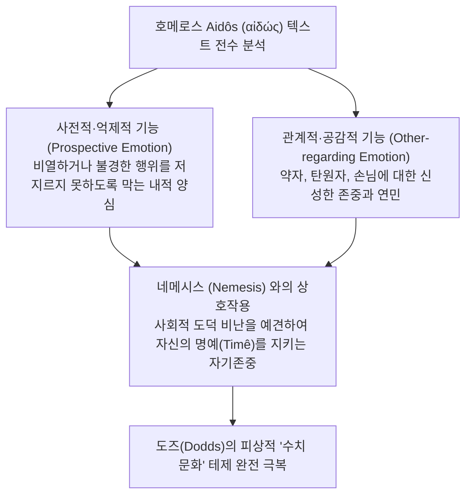

# 아이도스 (*Aidos: The Psychology and Ethics of Honour and Shame in Ancient Greek Literature*)

> [!NOTE] 학술사적 의의 및 총평
> 더글러스 케언스의 『아이도스』(1993)는 고대 그리스 문학 및 사상사에서 '도덕 감정(Moral Emotion)' 연구의 최고봉을 이루는 기념비적 정전입니다. 호메로스 서사시 전편에 등장하는 모든 **아이도스(Aidos) 및 관련 어휘들의 용례를 엄밀한 문헌학적 기법으로 전수 조사**하고 이를 현대 정서 심리학과 결합함으로써, **아이도스가 단순한 외적 체면이나 사후적 수치심이 아니라, 행위자의 내적 양심, 사전적 자기 억제(Inhibition), 그리고 약자와 타인에 대한 숭고한 경외와 공감(Empathy)을 포괄하는 고차원적 도덕 감정**임을 완벽히 실증했습니다.

---

## 1. 서지 정보 및 학술사적 맥락

- **저자**: 더글러스 L. 케언스 (Douglas L. Cairns) — 에든버러 대학교 서양고전학 석좌교수, 영국 학술원(British Academy) 회원, 고대 그리스 정서사(History of Emotions) 연구의 세계적 권위자.
- **출판 정보**: Clarendon Press: Oxford (1993, 448쪽).
- **연구 방법론**:
  - 서사시(호메로스), 비극(아이스퀼로스, 소포클레스, 에우리피데스), 산문(플라톤, 아리스토텔레스, 웅변가들)에 이르는 방대한 고대 텍스트의 어휘론적 전수 분석.
  - 인류학적 수치 문화론의 한계를 현대 인지정서이론(Cognitive Theory of Emotions)으로 극복.
- **출간 이전의 지배적 학설 (비판 대상)**:
  - **E. R. 도즈([[dodds-1951-greeks-and-irrational|E. R. Dodds, 1951]])**: 루스 베네딕트의 도식을 빌려 호메로스 사회를 '외적 평판 중심의 수치 문화'로 규정하고, 서구 기독교적 '죄책 문화'보다 도덕적으로 열등하다고 간주.
  - **A. W. H. 애드킨스([[adkins-1960-merit-and-responsibility|A. W. H. Adkins, 1960]])**: 아이도스를 군사적 실패에 대한 외적 두려움에 불과한 것으로 축소.

---

## 2. 개념 전복 매트릭스 및 논증 계보도

### [기존 수치 문화론 vs 케언스의 도덕 감정 모델]

| 비교 범주 | 도즈(Dodds) 및 애드킨스(Adkins) | 케언스(Douglas Cairns)의 실증적 모델 |
|:---|:---|:---|
| **시간적 방향성** | 이미 저지른 실수에 대한 **사후적 반응 (Retrospective)** | 잘못된 행위를 사전에 차단하는 **사전 억제적 브레이크 (Prospective/Inhibitory)** |
| **도덕적 지향성** | 타인의 비난과 경멸을 피하려는 이기적 체면 | **타인의 권리와 처지에 대한 공감적 배려 및 경외 (Reverence/Empathy)** |
| **사회적 메커니즘** | 군중심리적 압박에 대한 수동적 굴복 | 공동체의 정당한 분노(**네메시스, Nemesis**)와의 유기적 상호작용 및 내면화 |
| **적용 대상** | 오직 동등한 귀족 전사들 사이의 경쟁 | **약자, 탄원자(Hiketês), 이방인(Xenos), 부모, 노인**에 대한 종교-윤리적 보호 |

### [Mermaid 논증 구조도]

---

## 3. 호메로스 서사시 편 정밀 독해 및 논증 단계

### 제1장: 호메로스 서사시의 아이도스와 명예 (*Aidôs and Honour in Homer*)
- **개념의 다층성 규명**:
  - 'aidōs'는 한 가지 고정된 의미가 아니라, **'수치(Shame), 두려움(Fear), 존경(Respect), 경외(Reverence), 절제(Modesty)'**를 아우르는 복합 감정 체계입니다.
  - 전사는 단순히 남들에게 비난받을까 봐 두려워하는 것이 아니라, 자신이 지켜온 명예([[concept-time|Timê]])와 품위를 스스로 더럽히지 않기 위해 아이도스를 발휘합니다 (자기 존중, Self-respect).

### 제2장: 사회적 관계 속의 아이도스 (*Aidôs in Social Relations*)
1. **전우애와 군사적 규범**:
   - 전선이 무너질 때 장수들이 "아이도스를 가슴에 품어라!"라고 외치는 것은, 전우를 배신하고 도망치는 비겁함을 막는 **군사 윤리의 도덕적 억제력**입니다.
2. **탄원(Hikesia)과 크세니아([[concept-xenia|Xenia]])**:
   - 나보다 무력한 처지에 놓인 이방인이나 탄원자가 무릎을 꿇고 애원할 때, 그를 해치지 않고 환대하도록 강제하는 심리적 힘이 바로 아이도스입니다.
   - 아이도스를 무시하는 자는 제우스 크세니오스(Zeus Xenios)와 제우스 히케시오스(Zeus Hikesios)의 신벌(Nemesis)을 받습니다.
3. **가족과 공동체**:
   - 부모에 대한 공경, 여성의 정절, 노인에 대한 예우 등 공동체의 기본 질서를 지탱하는 윤리적 기초로 작동합니다.

---

## 4. 문헌학적 어휘 사전 및 희랍어 개념 정밀 주해

1. **아이도스 (Aidōs, αἰδώς)**:
   - 명사. 부끄러움, 수치심, 경외감, 자기 억제, 도덕적 자책. 행위자가 자신의 도덕적 한계를 자각할 때 일어나는 억제적 감정.
2. **아이데오마이 (Aideomai, αἰδέομαι)**:
   - 동사. ~를 두려워하다, ~를 존경하다, 부끄러워하다, 탄원을 받아들이다.
3. **네메시스 (Nemesis, νέμεσις)**:
   - 명사. 도덕적 한계를 넘은 부당한 행위에 대해 공동체 구성원이나 신들이 품는 정당한 도덕적 분노와 비난.
4. **오피스 (Opis, ὄπις)**:
   - 명사. 신들의 감시와 신성한 보복에 대한 두려움.
5. **세보마이 (Sebomai, σέβομαι)**:
   - 동사. 신성한 대상이나 신을 경외하고 숭배하다.

---

## 5. 핵심 원문 인용 및 심층 주석

### 인용 1: 아이도스의 사전적 억제 기능에 대하여
> *"Aidōs is predominantly a prospective and inhibitory emotion; it looks forward to the consequences of an action and inhibits the agent from crossing the boundaries of acceptable behaviour."* (Chapter 1, p. 44)  
> **[주석]**: 아이도스가 과거의 과오에 대한 후회에 그치는 것이 아니라, 미래의 비도덕적 행위를 사전에 가로막는 능동적 도덕 나침반임을 증명함.

### 인용 2: 타인에 대한 공감과 약자 보호에 대하여
> *"Aidōs is not merely self-regarding; it is profoundly other-regarding. It involves recognizing the status, claims, and vulnerability of others, especially suppliants, strangers, and the helpless."* (Chapter 2, p. 81)  
> **[주석]**: 호메로스 윤리가 이기적인 귀족 전사의 명예욕에 갇혀 있지 않고, 약자에 대한 종교적 연민과 도덕적 보호 의무로 확장되어 있음을 밝힘.

---

## 6. 서사시 전편 정밀 에피소드 매핑 테이블

| 서사시 권·행 번호 | 다루는 사건 및 인물 | 케언스의 문헌학적·정서사적 해석 |
|:---|:---|:---|
| ***Il.* 1.22–23** | **아폴론 사제 크뤼세스의 탄원** | 아카이오이 군사들이 "사제를 존중하고(Aideisthai) 몸값을 받으라"고 외침. 아이도스가 종교적 권위와 신성한 탄원을 인정하는 의무로 작동. |
| ***Il.* 5.529–532** | **아가멤논의 전열 정비 연설** | "친구들이여, 대장부가 되어 가슴속에 아이도스를 품어라! 서로를 부끄러워하는(Aideomenoi) 자들은 전장에서 더 많이 살아남는다." 전우에 대한 신뢰와 생존의 유대감. |
| ***Il.* 15.657–666** | **네스토르의 눈물의 호소** | "친구들이여, 가슴속에 아이도스를 품고 다른 사람들의 비난(Nemesis)을 두려워하시오! 각자의 아내와 자식, 재산과 부모를 생각하시오!" 가족과 공동체에 대한 총체적 도덕 의무 호소. |
| ***Il.* 22.105** | **성문 앞 헥토르의 고백** | "내가 풀뤼다마스의 충고를 듣지 않아 군대를 망쳤으니, 트로이아의 남녀들을 대하기 부끄럽구나(Aideomai)." 리더로서의 정책 실패에 대한 뼈아픈 도덕적 자책. |
| ***Il.* 24.503** | **프리아모스의 숭고한 탄원** | "아킬레우스여, 신들을 두려워하고(Deisantes) 나를 존중하시오(Aidēsat)!" 원수 사이의 증오를 넘어 인간 실존의 비극성 앞에 도덕적 경외를 요구하는 절정. |
| ***Od.* 2.64–66** | **텔레마코스의 민회 호소** | 이타카 시민들에게 "이웃들의 비난(Nemesis)을 부끄러워하라(Aidesthete)"고 촉구하며, 방관자들의 도덕적 나태를 질타함. |

---

## 7. 학술 논쟁사 및 비판적 공방

> [!TIP] 학술사적 기여 및 수용
- **도즈의 수치 문화론에 대한 결정타**:
  - 케언스의 방대한 텍스트 전수 조사는 서양고전학계에서 도즈의 '단순 수치 문화' 가설을 완전히 종식시키는 결정적 학술적 근거가 되었습니다.
- **버나드 윌리엄스와의 상호 보완**:
  - 같은 해(1993) 출간된 버나드 윌리엄스의 철학적 저작 『수치심과 필연성』과 완벽한 학문적 쌍벽을 이루며, 윌리엄스의 철학적 직관을 언어학적으로 완벽히 뒷받침했습니다.
- **스콧(Scott 1980) 및 베르데니우스(Verdenius 1945)의 계승과 비판**:
  - 스콧이 아이도스의 단일 본질(감정적 위축)을 규명한 것을 인정하면서도, 케언스는 아이도스가 단순한 소극적 억제를 넘어 타인의 명예와 권리를 적극 존중하는 능동적 도덕 정서로 확장됨을 정밀 논증했습니다.
- **현대 정서사(History of Emotions)의 개척**:
  - 데이비드 콘스탄(David Konstan), 윌리엄 해리스(William Harris) 등 현대 고대 정서사 연구자들에게 방법론적 표준 모델을 제공했습니다.

---

## 8. 연구 질문 및 세미나 토론 쟁점

1. **아이도스와 네메시스의 상호 균형**: 서사시에서 한 인물의 아이도스는 타인의 네메시스(비난)가 존재하지 않는 고립된 상황에서도 온전히 작동할 수 있는가?
2. **도덕적 억제력의 붕괴**: 『일리아스』 21권에서 아킬레우스가 탄원하는 뤼카온을 거부하고 살해할 때, 아킬레우스의 내면에서 아이도스가 마비된 심리적·서사적 원인은 무엇인가?
3. **그리스어 Aidōs의 현대적 번역어 문제**: Aidōs를 현대 한국어나 영어로 번역할 때 '수치심(Shame)'이라는 단일어로 번역함으로써 발생하는 의미론적 왜곡은 무엇이며, 이를 어떻게 보완해야 하는가?

---

## 관련 항목

- [[homeric-ethics-literature-review]]
- [[concept-aidos|Aidos]]
- [[concept-nemesis|Nemesis]]
- [[concept-time|Timê]]
- [[concept-arete|Arete]]
- [[concept-xenia|Xenia]]
- [[concept-themis|Themis]]
- [[scott-1980-aidos-and-nemesis]]
- [[williams-1993-shame-and-necessity]]
- [[long-1970-morals-and-values]]
- [[dodds-1951-greeks-and-irrational]]
- [[adkins-1960-merit-and-responsibility]]
- [[redfield-1975-nature-and-culture]]
- [[zanker-1994-heart-of-achilles]]
