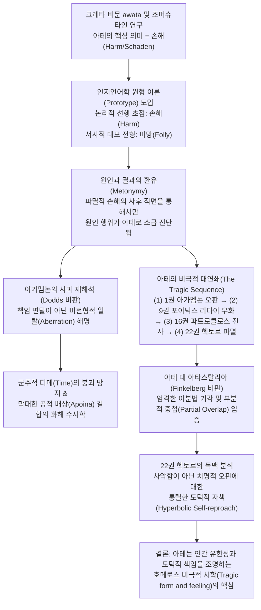

# 호메로스 서사시에서의 아테 (*Atē in the Homeric Poems* )

> [!NOTE] 학술사적 의의 및 총평
> 더글러스 케언스(Douglas Cairns)의 2012년 기념비적 연구 논문 「호메로스 서사시에서의 아테」(*Atē in the Homeric Poems*, *PLLS* 15)는 E. R. 도즈(Dodds 1951)의 심리학적 '투사/책임 면탈' 가설과 마르갈리트 핀켈버그(Finkelberg 1995)의 '아테 대 아타스탈리아' 기계적 이분법을 동시에 극복하고, 호메로스 서사시의 행위주체성과 비극적 시학을 재정립한 결정적 문헌이다. 케언스는 조머슈타인(Sommerstein)의 어원학적 통찰을 수용하여 아테의 근본 의미가 객관적 '손해·파멸(Harm/Schaden)'임을 밝히는 한편, 인지언어학 원형 이론(Prototype Theory)을 적용해 '객관적 재앙'이 논리적으로 선행하는 초점 의미(Focal meaning)이며 '주관적 판단 착오(Folly/Delusion)'는 원인-결과의 환유(Metonymy)를 통해 형성된 서사적 전형(Best example)임을 증명한다. 나아가 아가멤논의 공식 사과는 수치 문화의 핑계가 아니라 군주적 명예(Timē)를 보존하면서 공적 배상(Apoina)을 수용하는 '비전형적 일탈(Aberration)'의 화해 수사학임을 논증하며, 『일리아스』 제22권 헥토르의 통렬한 독백을 통해 아테와 아타스탈리아가 상호 배타적 대립물이 아니라 유책한 과오의 지평에서 부분적으로 중첩됨을 밝혀낸다.

---

## 1. 서지 정보 및 학술사적 배경

### 1.1 서지 정보 및 연구 방법론

- **저자**: 더글러스 케언스 (Douglas Cairns) — 영국 에든버러 대학교(University of Edinburgh) 고전학 석좌교수. 고대 그리스의 정서사(History of Emotions), 감정 이론, 인지비평 및 호메로스·비극 윤리학 분야의 세계적 권위자.
- **출판 정보**: *Papers of the Langford Latin Seminar*, Vol. 15: *Greek and Roman Poetry; The City of Rome*, edited by Francis Cairns, Oxbow Books (2012), pp. 1–52. (헌정: 고대 그리스 종교 및 시학 연구자 아가테 손턴 추모, *Agathe Thornton in memoriam*).
- **연구 대상 및 범위**: 『일리아스』 및 『오뒷세이아』 전편에 등장하는 명사 **아테**(ἄτη) 및 동사 **아아오**(ἀάω), 형용사 **아테로스**(ἀτηρός), 관련 어휘군(**아타스탈리아**·**휘브리스**·**네피오스**) 전수 용례 실증 분석.
- **연구 방법론**:
  - **귀납적·총체론적 어의론(Holistic and Inductive Semantics)**: 텍스트의 층위를 자의적으로 분할하는 발달론적 선입견(Seiler, Müller 등)을 배제하고, 현존 호메로스 코퍼스 전체의 어휘 사용을 귀납적으로 전수 조사.
  - **인지언어학 및 철학적 범주 이론(Prototype Theory & Focal Meaning)**: 조지 레이코프(George Lakoff)의 원형 이론과 아리스토텔레스의 '하나를 지향하는 다의성(ὁμονυμία πρὸς ἕν, G. E. L. Owen의 focal meaning, J. L. Austin의 primary nuclear sense)'을 결합한 의미 확장 메커니즘 분석.
  - **화용론적 서사 수사학(Pragmatic Rhetoric & Speech-Act Analysis)**: 등장인물들의 발화(Speech) 상황, 청중, 사회적 지위, 배상 협상 및 정서적 자기 거리두기(Self-distancing) 기능 해명.

### 1.2 학술사적 배경: 도즈 1951과 핀켈버그 1995의 한계

고대 그리스 사상사 및 호메로스 연구사에서 아테(Atē)는 인간의 비합리적 충동과 신적 개입의 관계를 설명하는 핵심 화두였습니다:

1. **도즈(E. R. Dodds, 1951)의 심리학적 투사론(Projection)과 수치 문화 테제**:
   - 도즈는 『그리스인들과 비합리적인 것』(*The Greeks and the Irrational*) 제1장에서 『일리아스』 19권 아가멤논의 사과 연설을 논의의 출발점으로 삼았습니다.
   - 도즈에 따르면, 호메로스 영웅들은 자신의 통상적 자아와 일치하지 않는 비합리적 충동이나 치명적 오판을 경험할 때, 이를 내적 성격의 결함으로 인정하지 못하고 외부의 초자연적 힘(제우스, 모이라, 에리뉘스가 던진 '아테') 탓으로 돌려 책임을 면탈(Exculpation)하려 했습니다.
   - 도즈는 이를 죄책감을 내면화하지 못하고 외적 평판에만 얽매이는 전형적인 '수치 문화(Shame culture)'의 무의식적 투사 기제로 해석했습니다.
2. **조머슈타인(Alan Sommerstein, 2013/forthcoming)의 '손해(Harm)' 어원론**:
   - 조머슈타인은 아이스킬로스 비극의 아테를 분석하며, 호메로스 이전의 가장 오래된 크레타 법률 비문(IC iv.72 등)에서 명사 *awata*가 '손해(Harm, Damage, Loss)'이자 이에 대한 '사법적 배상금/벌금'으로 쓰였음에 주목했습니다.
   - 그는 아테의 본래 의미가 '정신적 눈멂(Folly)'이 아니라 객관적 '손해(Schaden)'이며, 이것이 일상어에서 시가 언어로 유입되었다고 주장했습니다.
3. **핀켈버그(Margalit Finkelberg, 1995)의 이분법 모델**:
   - 핀켈버그는 논문 「오뒷세우스와 영웅이라는 유」에서 아테와 **아타스탈리아**(Atasthalia)를 기계적으로 양분했습니다.
   - 그녀에 따르면 아테는 '외적(신적) 원인에 의한 비의도적 착오'로서 행위자의 도덕적 유책성을 수반하지 않는 반면, 아타스탈리아는 '인간의 내적 탐욕과 사악함에 기인한 의도적 죄악'으로서 전적인 파멸의 책임을 지는 개념입니다. 나아가 『일리아스』는 아테의 비극이고, 『오뒷세이아』는 아타스탈리아의 교훈극이라는 장르적 분할을 제안했습니다.

### 1.3 케언스의 차별화된 문제의식

케언스는 조머슈타인의 '손해(Harm)' 중심설을 전폭 수용하면서도, 호메로스 텍스트에서 압도적으로 우세한 '판단 착오/눈멂(Folly)'의 용례를 단순한 파생적 왜곡으로 치부하지 않습니다. 케언스는 다음과 같은 근본 질문을 던집니다:
- 왜 호메로스 서사시에서는 객관적 손해보다 주관적 판단 착오가 더 두드러진 원형(Prototype)으로 기능하는가?
- 아가멤논은 정말로 도즈의 주장처럼 신들에게 책임을 전가하여 면탈하려 했는가?
- 『일리아스』 22권에서 결코 사악하지 않은 헥토르가 왜 자신의 파멸을 "내 자신의 아타스탈리아이"라고 자책했는가?

---

## 2. 개념 대조 매트릭스 및 논증 구조도

### 2.1 기존 학설(Dodds / Finkelberg) vs 케언스(Cairns 2012) 모델 비교

| 분석 항목 | 도즈 (Dodds 1951) / 핀켈버그 (Finkelberg 1995) | 더글러스 케언스 (Cairns 2012) 대안 모델 |
|:---|:---|:---|
| **아테의 의미론적 핵** | 주관적 정신 마비, 비합리적 충동(Verblendung) | 객관적 '**손해·파멸**(Harm/Schaden)'이 논리적 선행 초점 의미 |
| **의미의 확장 기제** | 신적 마비에서 세속적 과오로의 의미 퇴행/혼용 | **원형 이론**(Prototype) 및 원인-결과의 **환유**(Metonymy) |
| **아가멤논의 19권 연설** | 외적 투사를 통한 무책임한 책임 면탈(Plea of non-responsibility) | 군주적 위상([[concept-time\|티메]])을 보존하며 공적 배상([[concept-apoina\|아포이나]])을 감당하는 **화해 수사학** |
| **신적 원인과 인간 책임** | 신이 원인이면 인간은 책임이 없다는 배타적 면책론 | 신적 개입과 인간의 완전한 인과적·도덕적 책임의 **양립론**(Double Motivation) |
| **아테 vs 아타스탈리아** | 상호 배타적 이분법 (비의도적 외적 착오 vs 의도적 내적 죄악) | '재앙으로 이어지는 유책한 과오' 지평에서의 **부분적 중첩**(Partial Overlap) |
| **헥토르의 22권 독백** | 예외적 변칙 또는 후대 전승의 모순적 삽입 | 치명적 오판에 대한 최고 수위의 **과장된 도덕적 자책**(Hyperbolic Self-reproach) |
| **서사시 전체의 플롯** | 단편적인 신화적 사건들의 집합 | 1권에서 22권으로 이어지는 장대한 **비극적 아테의 연쇄**(Tragic Sequence) |

### 2.2 Mermaid 논증 계보도

---

## 3. 논문의 4대 핵심 테제 정밀 분석

### 제1테제: 아테의 이중 원형 구조 — 객관적 손해의 선행성과 주관적 판단 착오의 환유 (pp. 1–10)

케언스는 언어학적·철학적 방법론을 통해 아테의 의미 체계를 정밀 분석합니다:

- **초점 의미(Focal Meaning)로서의 손해(Harm)**:
  - 크레타 비문의 *awata* 및 헤쉬키오스(Hesychius) 사전의 글로서들(*a(w)askein*, *a(w)assein* = '해치다')은 아테의 고유 의미가 '손해, 손실, 피해'였음을 입증합니다.
  - 서사시의 동사 **아아오**(ἀάω, *aáō*)의 실제 용례에서도 이러한 손해의 성격이 선명히 드러납니다. 예컨대 『오뒷세이아』 21권 293–304행에서 안티노오스는 켄타우로스 에우리티온이 술에 취해 난동을 부린 일화를 전하며, 술이 사람의 감각을 상하게 하고(*trōei*, *bláptei*) 정신을 해쳤다(*phrénas âsen*)고 표현합니다.
  - 아리스토텔레스가 논의한 '하나를 지향하는 다의성(ὁμονυμία πρὸς ἕν)' 개념처럼, 아테의 모든 다양한 용례는 '손해(Harm)'라는 단 하나의 중심 개념으로 수렴됩니다.
- **대표적 전형(Best Example)으로서의 판단 착오(Folly)와 환유적 메커니즘**:
  - 그러나 호메로스 서사시에서 실제로 가장 빈번하게 체감되는 아테는 외적 재난 자체가 아니라 인간 내면의 '판단 착오, 지적 눈멂, 미망'입니다.
  - 케언스는 레이코프의 인지언어학 모델을 빌려, 아테의 의미 구조에 **두 가지 원형 효과**(Two prototype effects)가 작동하고 있다고 설명합니다.
  - 객관적 '손해(Harm)'는 논리적으로 선행하는 **초점 의미**이며, 주관적 '판단 착오(Folly)'는 호메로스 시학에서 가장 두드러지게 형상화된 **대표 전형**입니다.
  - 이 두 차원은 분리된 이의어(Homonym)가 아니라 **원인과 결과의 환유**(Cause-effect metonymy)로 단단히 결속되어 있습니다. 인간은 자신이 어리석은 결정을 내리는 순간에는 그것이 아테인 줄 알지 못하며, 오직 그 결정이 돌이킬 수 없는 파멸적 손해(Harm)를 초래했을 때 사후적으로(retrospectively) "내가 아테에 빠졌었구나(*aasámēn*)"라고 진단하기 때문입니다.

### 제2테제: 도즈의 책임 면탈 가설 비판 — 비전형적 일탈과 화해의 수사학 (pp. 37–46)

케언스는 도즈(1951)가 호메로스 인간관의 결함으로 지목한 『일리아스』 19권 아가멤논의 사과 연설(*Il.* 19.86–138)을 정면으로 재해석합니다:

- **완전한 인과적·도덕적 책임의 수용**:
  - 도즈는 아가멤논이 "원인은 내가 아니라 제우스와 모이라, 에리뉘스이다"(*Il.* 19.86–88)라고 말한 것을 자신의 유책성을 부인하는 면책의 탄원(Plea of non-responsibility)으로 단정했습니다.
  - 그러나 케언스는 아가멤논이 제9권의 사적 참회(*Il.* 9.115–120: "내가 아테에 빠졌음을 나 스스로도 부인하지 않는다")와 제19권의 공적 집회 모두에서 거대한 규모의 보상금([[concept-apoina\|아포이나]])과 화해를 약속하고 있음에 주목합니다. 만일 아가멤논이 진정으로 책임을 면탈하려 했다면, 어째서 막대한 물질적 배상을 자청하겠습니까?
  - 호메로스 사회에서 신적 개입(신이 아테를 던짐)과 인간 행위자의 사법적 배상 책임은 완벽히 양립합니다.
- **비전형적 일탈(Aberration)의 해명**:
  - 아가멤논이 아테를 거론한 진정한 의도는 도덕적 책임의 회피가 아니라 행위의 '비전형성'을 설명하기 위함입니다.
  - 사회심리학의 귀인 이론(Attribution Theory)에 따르면, 사람들은 타인의 과오는 내적 성격 결함으로 돌리면서도 자신의 과오는 외적 상황이나 일시적 착오로 돌리려는 경향이 있습니다. 아가멤논은 "그 행동은 나의 평소 성격이나 의도에서 나온 전형적인 모습이 아니라, 신적 마비로 인한 일시적이고 재앙적인 일탈이었다"고 청중을 설득하는 것입니다.
- **군주적 티메 보존과 공적 화해의 수사학**:
  - 최고 사령관 아가멤논이 공개 집회에서 전군이 보는 가운데 자신의 통솔력과 인격이 근본적으로 열등하고 사악하다고 자인할 수는 없습니다. 그렇게 되면 군주로서의 명예([[concept-time\|티메]])가 영구히 파멸하기 때문입니다.
  - 따라서 신화적 아테의 불가항력성(제우스마저 속아 넘어간 헤라클레스 탄생 설화)을 원용함으로써, 자신의 군주적 권위를 보존하면서도 아킬레우스에게 공식적인 체면을 세워주고 막대한 배상을 안겨주는 화해의 사회적 수사학(Reconciliation rhetoric)을 완성한 것입니다.

### 제3테제: 호메로스 비극성을 직조하는 장대한 '아테의 연쇄' (pp. 47–58)

케언스는 아테가 단발적인 에피소드의 변명이 아니라, 『일리아스』 전편을 관통하는 비극적 구조(Tragic form and feeling)의 골격임을 규명합니다:

- **제1권에서 제9권으로: 오판에서 자책으로**:
  - 제1권에서 아가멤논이 아킬레우스의 전리품을 빼앗은 것은 아킬레우스의 시각에서 명백한 오판이자 아테였습니다.
  - 제9권에 이르러 그리스군이 궤멸 직전에 몰리자 아가멤논은 원로들 앞에서 자신의 '아테의 목록(*emàs átas*)'을 공식 인정합니다.
- **제9권 포이닉스의 '리타이(Litai) 우화'와 2차 아테의 경고**:
  - 포이닉스는 아테가 발이 빨라 대지를 질주하며 인간을 해치고, 기도의 여신들인 **리타이**(Litai)가 그 뒤를 절룩거리며 쫓아간다고 노래합니다(*Il.* 9.502–514).
  - 포이닉스의 핵심 경고는, 상처를 입은 피해자(아킬레우스)가 가해자의 정당한 탄원과 배상을 오만하게 거절할 경우, 거절자 자신에게 또 다른 아테가 닥쳐 가혹한 응징을 받게 된다는 점입니다.
- **제16권과 제18권: 아킬레우스의 과오와 파트로클로스의 전사**:
  - 아킬레우스는 아가멤논의 사절단을 거절함으로써 포이닉스가 경고한 2차 아테의 덫에 빠집니다.
  - 제16권에서 아킬레우스는 파트로클로스에게 배들을 구원하되 트로이 성벽으로는 진격하지 말라고 경고하지만, 파트로클로스는 승리에 도취한 아테에 빠져 성벽으로 돌진하다가 아폴론의 일격을 받고 헥토르에게 전사합니다(*Il.* 16.684–691).
  - 제18권에서 아킬레우스는 전우의 죽음 앞에서 "나는 대지의 쓸모없는 짐이었다"고 울부짖으며 자신의 완고함이 초래한 아테의 파국을 실존적으로 자각합니다.
- **제22권: 헥토르의 치명적 파멸**:
  - 아테의 거대한 연쇄는 마침내 트로이의 수호자 헥토르에게로 이어집니다.

### 제4테제: 아테와 아타스탈리아의 의미론적 부분 중첩 — 헥토르의 독백 (pp. 59–82)

케언스는 핀켈버그(1995)의 엄격한 이분법을 비판하고 두 개념의 역동적 관계를 규명합니다:

- 『**일리아스**』 22권 99–130행 헥토르의 독백 분석:
  - 헥토르는 성벽 밖에서 홀로 아킬레우스를 기다리며, 폴뤼다마스의 현명한 야간 퇴각 권고를 묵살했던 지난밤의 오판을 돌아봅니다.
  - 그는 성문 안으로 피신하면 폴뤼다마스가 자신에게 비난을 씌울 것이 두렵다며 고백합니다: "내 자신의 아타스탈리아이로 백성을 멸망시켰다(*ōlesa laòn atasthalíēisin emêisin*, 104–105행)."
- **도덕적 유책성의 과장된 자책(Hyperbolic Self-reproach)**:
  - 헥토르는 『오뒷세이아』의 오만한 구혼자들이나 오뒷세우스의 어리석은 부하들처럼 규범을 고의로 파괴하는 사악한 성품(Atasthalos)의 인물이 결코 아닙니다.
  - 헥토르가 통상적으로 패륜적 범죄에 쓰이는 **아타스탈리아**(Atasthalia)라는 단어를 스스로에게 적용한 것은, 전우와 조국을 파멸로 몰고 간 지휘관으로서의 치명적 판단 착오에 대해 스스로에게 극도로 가혹한 도덕적 규탄(Hyperbolic self-reproach)을 내리고 있기 때문입니다.
- **두 개념의 차이와 부분적 중첩(Partial Overlap)**:
  - **아테(Atē)**: '판단 착오와 그로 인한 파멸적 재앙(Disastrous error)'에 의미론적 방점이 있습니다.
  - **아타스탈리아(Atasthalia)**: '규범을 알면서도 위반한 도덕적 비난 가능성(Moral culpability)'에 방점이 있습니다.
  - 따라서 두 개념은 상호 배타적인 것이 아니라, '재앙을 낳은 유책한 과오'라는 공통 지대에서 긴밀히 맞물립니다.
  - 고대 그리스의 민간 어원설(Popular etymology)이 아타스탈리아를 "아테 속에서 만발함(τὸ τῇ ἄτῃ θάλλειν)"으로 풀이했던 것 역시 두 개념이 당시 그리스인들의 심상 속에서 깊이 상호작용하고 있었음을 보여줍니다.

---

## 4. 원문 인용 및 정밀 문헌학적 주석

### 4.1 『일리아스』 19권 86–88, 137–138행: 아가멤논의 공적 연설

- **번역**: "원인은 내가 아니라, 제우스와 모이라, 그리고 어둠 속을 걷는 에리뉘스이다. 그들이 민회에서 내 마음에 사나운 아테를 던졌다."
- **원문**: *ἐγὼ δ’ οὐκ αἴτιός εἰμι, / ἀλλὰ Ζεὺς καὶ Μοῖρα καὶ ἠεροφοῖτις Ἐρινύς, / οἵ τέ μοι εἰν ἀγορῇ φρεσὶν ἔμβαλον ἄγριον ἄτην·*
- **학술 전사**: *egṑ d’ ouk aítiós eimi, / allà Zeùs kaì Moîra kaì ēerophoîtis Erinús, / hoí té moi ein agorē̂i phresìn émbalon ágrion átēn;* (_Il._ 19.86–88)
  - **[주석]**: 아가멤논의 발화는 책임을 회피하기 위한 사적 핑계가 아니라, 초자연적 원인에 대한 보고이자 청중과 아킬레우스에게 화해의 명분을 제공하는 공적 연설입니다.

- **번역**: "하지만 내가 미망에 빠져 제우스께서 내 분별력을 빼앗으셨으니, 나는 다시 화해하기를 바라며 헤아릴 수 없는 배상을 하겠소."
- **원문**: *ἀλλ’ ἐπεὶ ἀασάμην καί μευ φρένας ἐξέλετο Ζεύς, / ἂψ ἐθέλω ἀρέσαι, δόμεναί τ’ ἀπερείσι’ ἄποινα·*
- **학술 전사**: *all’ epeì aasámēn kaí meu phrénas ekséleto Zeús, / àps ethélō arésai, dómenaí t’ apereísi’ ápoina;* (_Il._ 19.137–138)
  - **[주석]**: 동사 *aasámēn*(1인칭 과거 중간태)과 결합된 *dómenai apereísi' ápoina*(배상금 지불)는 아가멤논이 자신의 과오에 대해 완전한 인과적·사법적 책임을 지고 있음을 입증합니다.

### 4.2 『일리아스』 9권 505–507행: 포이닉스의 리타이 우화

- **번역**: "아테는 강하고 발이 빨라, 모든 기도의 여신들을 훌쩍 앞질러 온 땅 위를 내달리며 사람들을 해치고, 기도의 여신들은 그 뒤에서 상처를 고친다."
- **원문**: *ἡ δ’ Ἄτη σθεναρή τε καὶ ἀρτίπος, οὕνεκα πάσας / πολλὸν ὑπεκπροθέει, φθάνει δέ τε πᾶσαν ἐπ’ αἶαν / βλάπτουσ’ ἀνθρώπους· αἳ δ’ ἐξακέονται ὀπίσσω.*
- **학술 전사**: *hē d’ Átē sthenarḗ te kaì artípos, hoúneka pásas / pollòn hupekprothéei, phthánei dé te pâsan ep’ aîan / bláptous’ anthrṓpous; haì d’ eksakéontai opíssō.* (_Il._ 9.505–507)
  - **[주석]**: 분사 *bláptousa*(해치며)는 아테의 원형적 의미가 객관적 '손해(Harm)'에 기초하고 있음을 여실히 증명합니다.

### 4.3 『일리아스』 22권 104–105행: 헥토르의 통렬한 독백

- **번역**: "이제 내 자신의 아타스탈리아이로 백성을 멸망시켰으니, 트로이아의 사나이들과 옷자락을 끄는 여인들을 마주하기가 부끄럽구나."
- **원문**: *νῦν δ’ ἐπεὶ ὤλεσα λαὸν ἀτασθαλίῃσιν ἐμῇσιν, / αἰδέομαι Τρῶας καὶ Τρῳάδας ἑλκεσιπέπλους,*
- **학술 전사**: *nûn d’ epeì ṓlesa laòn atasthalíēisin emē̂isin, / aidéomai Trō̂as kaì Trōiádas helkesipéplous,* (_Il._ 22.104–105)
  - **[주석]**: 헥토르가 *atasthalíēisin emē̂isin*(내 자신의 아타스탈리아이로)이라고 말하며 느끼는 **아이도스**([[concept-aidos|Aidos]])는, 그가 비도덕적 악인이 아니라 도덕적 의무를 완수하지 못한 고결한 영웅의 극단적 자기비판을 체현하고 있음을 보여줍니다.

## 5. 학술적 평가 및 후대 수용사

- **호메로스 행위주체성 논쟁의 완성**: 케언스의 본 연구는 스넬(Snell)과 도즈(Dodds), 애드킨스(Adkins)로 이어지던 20세기 중반의 '원시적이고 파편화된 자아관'을 완전히 청산하고, 호메로스 영웅들이 신적 개입과 인간 자율성이 정교하게 조화된 완전한 도덕적 행위주체(Responsible moral agents)였음을 최종적으로 확립했습니다.
- **인지문헌학(Cognitive Philology)의 모범**: 레이코프의 인지언어학 이론을 고전 고대 텍스트 분석에 성공적으로 결합함으로써, 개념의 다의성을 자의적인 발달 단계로 쪼개지 않고도 단일한 의미망 속에서 유기적으로 설명할 수 있는 탁월한 방법론적 전형을 제시했습니다.
- **아르카익기 윤리학으로의 가교**: 호메로스 텍스트에서 맹아를 보인 아테와 아타스탈리아, 휘브리스([[concept-hybris|Hybris]]), 코로스(Koros)의 상호작용은 후대 솔론, 테오그니스 및 아테네 비극 시인들에게 계승되어 고대 그리스 비극적 인과응보 사상의 핵심 문법으로 자리 잡았습니다.

---

## 관련 항목

- **상위 분류**: [[wiki/index|위키 색인]], [[analysis-concept-source-matrix|개념과 문헌 매트릭스]]
- **핵심 연관 개념**:
  - [[concept-ate|아테 (Ate)]] — 신들이 내린 일시적 판단 마비와 치명적 과오 및 파멸의 연쇄
  - [[concept-atasthalia|아타스탈리아 (Atasthalia)]] — 무모한 오만과 규범 위반의 유책한 죄악
  - [[concept-time|티메 (Time)]] — 신적 배당과 인정 경제의 가치 체계
  - [[concept-moira|모이라 (Moira)]] — 인간과 신 모두를 구속하는 배당된 몫과 운명
  - [[concept-aidos|아이도스 (Aidos)]] — 수치심, 경외, 자기억제
  - [[concept-hybris|휘브리스 (Hybris)]] — 선을 넘는 오만과 타인에 대한 능욕
- **핵심 연관 인물**:
  - [[entity-agamemnon|아가멤논 (Agamemnon)]] — 최고 사령관의 군주적 오판과 아테의 공적 화해 수사학
  - [[entity-hector|헥토르 (Hector)]] — 오판에 대한 통렬한 자책(아타스탈리아이)과 조국의 파멸을 짊어진 영웅
  - [[entity-achilles|아킬레우스 (Achilles)]] — 사절단 거절과 2차 아테의 비극적 연쇄를 겪는 중심 영웅
  - [[entity-patroclus|파트로클로스 (Patroclus)]] — 승리에 취해 한계를 넘었다가 전사한 영웅
- **관련 연구 문헌**:
  - [[cairns-1993-aidos|더글러스 케언스 (1993), 아이도스]] — 케언스의 초기 대표작이자 그리스 수치심 윤리 연구
  - [[dodds-1951-greeks-and-irrational|E. R. 도즈 (1951), 그리스인들과 비합리적인 것]] — 아테의 투사 및 수치 문화 테제
  - [[finkelberg-1995-odysseus-and-genus-hero|마르갈리트 핀켈버그 (1995), 오뒷세우스와 영웅이라는 유]] — 아테 대 아타스탈리아 이분법 논문
  - [[lloyd-jones-1971-justice-of-zeus|휴 로이드-존스 (1971), 제우스의 정의]] — 이중 동기화와 도덕적 우주 질서
