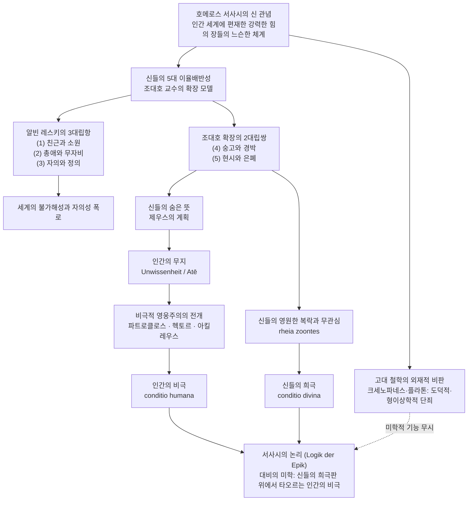

# 일리아스의 신들 (*Die Götter in der Ilias*)

> [!NOTE] 학술사적 의의 및 총평
> 조대호 교수의 논문 「일리아스의 신들」(2007)은 크세노파네스와 플라톤 이래 2,500년간 이어진 '철학과 시문학의 오래된 불화'에서 호메로스 신인동형설에 가해진 도덕적·형이상학적 비판을 미학적·시학적 지평에서 근원적으로 반박한 기념비적 연구입니다. 저자는 알빈 레스키(Albin Lesky)가 제시한 신들의 3대 이율배반성(친근/소원, 총애/무자비, 자의/정의)을 넘어서, '숭고함과 경박함(Erhabenheit und Leichtsinnigkeit)' 및 '현시와 은폐(Offenbarung und Verborgenheit)'라는 두 가지 결정적 대립쌍을 추가하여 5대 대립 체계를 완성했습니다. 이를 통해 신들의 자의적·희극적 행태와 숨겨진 의지가 비극적 영웅들(파트로클로스, 헥토르, 아킬레우스)의 무지(Unwissenheit)와 맞물려 파국을 완성하는 서사적 메커니즘을 규명했습니다. 궁극적으로 신적인 조건(conditio divina)이라는 눈부시고 냉혹한 배경판 위에서만 가사적 인간의 조건(conditio humana)의 비극성이 비로소 온전한 윤곽을 드러낸다는 '서사시의 논리(Logik der Epik)'를 정립했습니다.

---

## 1. 서지 정보 및 학술사적 맥락

- **저자**: 조대호 (Cho Dae-Ho) — 연세대학교 철학과 교수. 서울대학교 철학과 학사 및 석사, 독일 하이델베르크 대학교 철학박사(Dr. phil.). 아리스토텔레스의 형이상학, 자연철학 및 고대 그리스 철학·문학의 국내 최고 권위자. 한국서양고전학회 회장 역임. 저서로 『아리스토텔레스의 자연철학』, 『카오스와 로고스』, 『고대 그리스 사상의 원풍경』 등이 있습니다.
- **출판 정보**: 『인문논총』(Journal of Humanities), 서울대학교 인문학연구원, 제58집, 2007년 12월, pp. 117–150.
- **연구 방법론**:
  - 고전문헌학적 원전 주해와 고대 그리스 철학적 개념 분석의 엄밀한 결합.
  - 서사시학(Epic Poetics) 및 미학적 기능주의: 신들의 성격을 교의적 신앙이나 추상적 형이상학이 아닌 서사시 전체의 파토스적 구조를 지탱하는 '시적 장치(Götterapparat)'로 분석.
  - 대립쌍 분석(Antinomic Pair Analysis): 레스키(Lesky)의 종교학적 이율배반성을 문학적 숭고·희극 및 인식론적 개시·은폐의 대립축으로 체계화.
  - 존재론적 대비: 불멸의 신적 조건(*conditio divina*)과 가사적 인간 조건(*conditio humana*)의 상호 조명.
- **학술사적 계보 및 주요 학설과의 대화**:
  - **고대 철학의 시문학 비판에 대한 도전**: 크세노파네스(DK 21 B 11), 플라톤(『국가』 2–3권, 10권), 아리스토텔레스(『형이상학』 997b)의 신인동형설 비판이 서사시의 시학적 자율성을 무시한 외재적 비판임을 논증.
  - **알빈 레스키(Albin Lesky)의 이율배반성 계승 및 확장**: 레스키의 "인간 존재 전체가 내맡겨져 있는 강력한 힘의 장들이 이루는 느슨한 체계"라는 테제를 출발점으로 삼아, 레스키가 간과한 숭고/경박, 개시/은폐의 축을 독창적으로 증축.
  - **헤르만 프렝켈(Hermann Fränkel)의 초기 그리스 사상론 수용**: 프렝켈의 "시대의 논리(Logik der Epoche)" 개념을 "서사시의 논리(Logik der Epik)"로 변용하여 호메로스 시학의 내적 정당성 확보.
  - **빌헬름 쿨만(Wolfgang Kullmann)과의 문헌학적 조응**: 쿨만의 『일리아스에서 신들의 작용』(*Das Wirken der Götter in der Ilias*, 1956) 및 제우스의 지혜 연구를 비판적으로 종합.

---

## 2. 핵심 테제 매트릭스 및 개념 구조도

### [핵심 테제 매트릭스: 호메로스 신들의 5대 이율배반성 체계]

| 대립쌍 범주 | 대립항 A (개입과 긍정) | 대립항 B (초월과 부정) | 텍스트 대표 전거 | 서사적·미학적 기능 |
|:---|:---|:---|:---|:---|
| **친근과 소원** (*Nähe und Distanz*) | 사랑하는 영웅에 대한 지극한 보살핌과 친밀한 개입 | 건널 수 없는 존재론적 심연과 냉혹한 타자성 | *Il.* 5.799ff (아테네의 격려) *Il.* 5.440ff (아폴론의 일갈) *Il.* 21.462ff (나뭇잎 비유) | 영웅에게 신적 고양감을 부여하는 동시에, 불멸과 가사의 넘을 수 없는 한계를 각인함 |
| **총애와 무자비** (*Huld und Grausamkeit*) | 어머니가 아기에게서 파리를 쫓듯 베푸는 온정 | 거역하거나 무력한 인간을 향한 가혹한 징벌과 협박 | *Il.* 4.130ff (메넬라오스를 구하는 아테네) *Il.* 3.414ff (헬레네를 겁박하는 아프로디테) | 신의 호의가 결코 인간의 도덕적 권리가 아니며, 절대적 공포의 지배 아래 있음을 폭로 |
| **자의와 정의** (*Willkür und Recht*) | 부정과 폭력을 응징하는 우주적 질서의 수호자 | 사적 복수와 편애를 위해 도시들을 제물로 삼는 파괴자 | *Il.* 16.385ff (제우스의 폭우 비유) *Il.* 4.51ff (헤라와 제우스의 거래) | 고전 철학의 '정의로운 신' 관념을 배반하며, 세계에 편재한 불가해하고 맹목적인 파괴력을 형상화 |
| **숭고와 경박** (*Erhabenheit und Leichtsinnigkeit*) | 천지를 뒤흔들고 하계를 공포에 빠뜨리는 압도적 위엄 | 인간의 도륙 앞에서 벌어지는 걷잡을 수 없는 폭소와 소동 | *Il.* 20.56ff (신들의 전투, 롱기누스의 숭고) *Il.* 1.599ff (신들의 폭소) *Il.* 21.410ff (신들의 난투극) | 인간의 비극을 한낱 구경거리로 치부하는 신들의 초연함을 드러내어 비극의 무게를 배가함 |
| **현시와 은폐** (*Offenbarung und Verborgenheit*) | 신체적 표징과 신현을 통해 직접 개시되는 신의 뜻 | 변신, 거짓 꿈, 내적 고무를 통해 인간의 눈을 가리는 기만 | *Il.* 1.193ff (아테네의 신현) *Il.* 2.1ff (아가멤논의 거짓 꿈) *Il.* 16.685ff (파트로클로스를 홀리는 제우스) | 인간의 무지(Atē)를 조작하여 파국을 완성하며, 비극적 영웅주의의 필연적 덫을 형성함 |

---

### [Mermaid 개념 및 서사 논증 구조도]

---

## 3. 섹션별 정밀 분석

### 제1절: 호메로스의 신들 — '철학과 시문학 사이의 오래된 불화' (pp. 119–121)

- **인간의 형상을 닮은 신들의 충격**:
  - 창세기의 야훼가 자신의 형상을 따라 인간을 창조했다면, 그리스의 서사시인들은 인간의 형상을 따라 신들을 창조했습니다. 헤로도토스(2.53)가 증언하듯, 호메로스와 헤시오도스는 그리스인들에게 신들의 계보와 명예, 생김새를 정초해 준 원천이었습니다.
  - 그러나 『일리아스』의 신들은 전지전능하거나 거룩한 존재가 아니라 웃고 울고, 속이고 속이며, 질투하고 주먹다짐을 벌이는 철저히 의인화된 존재들입니다.
- **고전기 철학의 맹렬한 단죄**:
  - 크세노파네스(DK 21 B 11)는 호메로스와 헤시오도스가 인간들 사이에서조차 손가락질받는 도둑질, 간음, 사기 행위를 신들에게 돌렸다고 규탄했습니다. 크세노파네스는 생겨나지도 사라지지도 않으며, 육체적 노고 없이 마음의 생각만으로 모든 것을 흔드는 비인격적·초월적 유일신 관념을 대안으로 제시했습니다.
  - 플라톤은 『국가』(379a–380c, 388e, 607b)에서 신은 오직 선한 존재이며 결코 악이나 불행의 원인이 될 수 없고, 변신하거나 거짓말을 하지 않으며, 웃음에 사로잡혀서도 안 된다는 엄격한 신학적 검열을 단행했습니다.
  - 아리스토텔레스(『형이상학』 997b) 역시 신인동형설을 두고 "영원한 인간들을 만들어낸 것에 불과하다"고 비판했습니다.
- **조대호의 비판적 전회 — 미학적 기능의 복원**:
  - 철학자들의 이러한 비판은 서사시 안에서 인간적인 신들이 수행하는 **문학적·미학적 기능**(Poetic Function)을 완전히 무시한 일면적 단죄에 불과합니다.
  - 호메로스의 신들을 추상적 형이상학이나 도덕의 잣대로 재단하기에 앞서, 시인이 왜 하필 이토록 결함투성이인 신들을 서사적 중심 장치로 끌어들였는지를 해명하는 것이 문헌학적·철학적 과제입니다.

---

### 제2절: 호메로스의 신들의 양면성 (pp. 121–132)

#### 1. 신들의 이율배반성 (pp. 121–124)
- **알빈 레스키(Lesky)의 3대 대립항 분석**:
  - 호메로스의 신들은 인간과 완전히 격리되어 한가롭게 자족하는 에피쿠로스의 신들이 아니며, 인간의 실존을 낱낱이 옭아매는 "강력한 힘의 장들이 이루는 느슨한 체계"입니다.
  - **친근과 소원**: 아테네는 부상당한 디오메데스 곁에 다가와 다정하게 꾸짖으며 힘을 북돋우고(5.799ff), 아프로디테는 아들 아이네이아스를 품에 안아 전장에서 구출합니다(5.311ff). 그러나 바로 그 장면에서 아폴론은 디오메데스를 향해 엄중히 경고합니다:
    - "튀데우스의 아들이여, 조심하고 물러가라. 그대는 자신을 감히 신들과 같다고 생각지 말아라. 불사신들과 대지 위를 걷는 인간들은 결코 같은 종족이 아니니라." (*Il.* 5.440–442)
    - 아폴론은 포세이돈과의 싸움을 거부하며 인간을 "계절에 따라 무성했다가 시들어 떨어지는 나뭇잎"(*Il.* 21.462ff)에 비유하며 차가운 거리를 유지합니다.
  - **총애와 무자비**: 아테네는 잠자는 아기에게서 파리를 쫓는 어머니의 손길처럼 메넬라오스에게 날아오는 화살을 빗겨가게 만듭니다(*Il.* 4.130ff). 그러나 3권에서 헬레네가 파리스의 침실로 가기를 거부하자, 노파로 변신했던 아프로디테는 즉각 무시무시한 본색을 드러내며 헬레네를 파멸시키겠다고 협박합니다(*Il.* 3.414–417).
  - **자의와 정의**: 『일리아스』에는 부정한 판결을 내리는 자들에게 제우스가 폭우의 재앙을 내린다는 비유(*Il.* 16.385ff)처럼 정의로운 신의 관념이 없지 않습니다. 그러나 작품 전체를 지배하는 것은 정의의 수호자가 아니라 자의적인 파괴자로서의 면모입니다. 4권에서 제우스와 헤라의 타협 장면은 그 극치입니다. 헤라는 트로이아를 멸망시키기 위해 자신이 가장 아끼는 세 도시인 아르고스, 스파르타, 미케네를 제우스가 언제든 파괴해도 좋다고 기꺼이 내어줍니다(*Il.* 4.51–54). 여기에는 일말의 도덕적 정의도 존재하지 않으며, 오직 맹목적인 복수심과 자의적 권력의 야합만이 존재합니다.

#### 2. 신들의 숭고와 경박 (pp. 124–128)
- **롱기누스적 숭고의 실현**:
  - 20권의 신들의 전쟁(Theomachia)에서 제우스는 천상에서 뇌우를 내리치고, 포세이돈은 삼지창으로 대지를 찢어 이데 산의 등성이와 트로이아의 함선들을 통째로 뒤흔듭니다. 하계의 지배자 하데스는 자신의 곰팡내 나는 끔찍한 거처가 천하에 드러날까 두려워 옥좌에서 비명을 지르며 뛰어오릅니다(*Il.* 20.56ff).
  - 위-롱기누스(Pseudo-Longinus, 『숭고에 관하여』 9.6)가 정확히 포착했듯, 이 장면은 인간의 감각 지평을 압도하는 '초인간적 거대함(hyperphya)'을 통해 절대적 숭고를 구현합니다.
- **신들의 파안대소와 희극적 전락**:
  - 그러나 이 숭고한 존재들은 곧바로 가장 저열한 경박함의 극단으로 미끄러집니다. 1권 말미, 테티스의 청원으로 부부싸움을 벌이던 제우스와 헤라 사이에 전운이 감돌자, 절뚝발이 대장장이 신 헤파이스토스가 헐레벌떡 술잔을 나르며 화해를 주선합니다. 이 우스꽝스러운 광경을 보고 올림포스의 신들은 "그칠 줄 모르는 폭소(asbestos gelōs)"를 터뜨립니다(*Il.* 1.599–600).
  - 플라톤(『국가』 388e)은 신들이 웃음에 굴복하는 이 장면을 불경의 극치로 단죄했습니다. 지상에서는 아폴론의 역병 화살에 병사들이 죽어가고, 제우스의 밀약으로 아카이아 군대의 도륙이 막 시작되려는 참혹한 순간에, 신들은 술자리의 흥이 깨지는 것을 막기 위해 폭소를 터뜨립니다.
  - 이 웃음은 신들을 격하시키는 것이 아니라, 인간의 생사고락 따위는 안중에도 없는 신들의 초월적이고 잔인한 무관심을 적나라하게 폭로합니다. 신들에게 인간의 비극은 심각한 고뇌의 대상이 아니라 한바탕 웃어넘길 구경거리이자 유희에 불과합니다.
  - 5권에서 디오메데스의 창에 찔려 피를 흘리며 징징대는 아프로디테(*Il.* 5.428)와 21권에서 아테네의 돌팔매에 맞아 뻗어버린 아레스(*Il.* 21.410ff)의 꼴불견은 숭고와 경박이 종이 한 장 차이로 공존하는 호메로스 판테온의 희극성을 웅변합니다.

#### 3. 신들의 현시와 은폐 (pp. 129–132)
- **신현(Epiphany)과 변신의 다채로움**:
  - 신들은 아킬레우스의 머리채를 잡아채는 아테네(*Il.* 1.193ff)처럼 본모습을 온전히 드러내기도 하고, 노파(아프로디테), 전령(아테네), 파수꾼 폴리테스(이리스) 등의 인간 모습으로 변신하여 접근하기도 합니다.
  - 영웅들은 때로 신들의 비범한 신체적 표징(아프로디테의 눈부신 목과 가슴, 포세이돈의 독특한 발걸음)이나 조짐(새점, 뱀을 문 독수리)을 통해 신의 임재를 알아차립니다.
- **기만과 숨은 의지의 은폐**:
  - 그러나 호메로스 서사의 가장 치명적인 전환점들은 신들의 '의도적 은폐와 기만'에서 촉발됩니다.
  - 제우스는 아가멤논에게 승리를 약속하는 '거짓 꿈(oulon oneiron)'을 보내 파멸적 총공격을 감행하게 만듭니다(*Il.* 2.1ff).
  - 가장 비극적인 사례는 파트로클로스의 출진입니다(*Il.* 16.685ff). 파트로클로스가 아킬레우스의 경고("함선만 구하고 돌아오라")를 잊고 트로이 성벽으로 무모하게 돌진할 때, 시인은 그를 "마음의 눈이 멀어버린 바보"라고 한탄하면서도, 그 배후에 "인간의 지혜보다 언제나 강력한 제우스의 지혜(*Dios kreissōn noos*)"가 도사리고 있음을 폭로합니다. 제우스가 파트로클로스의 가슴에 맹목적 용기를 불어넣어 그를 죽음으로 몰아넣고, 이를 통해 아킬레우스의 복귀를 강제하려는 숨은 계획을 꾸몄기 때문입니다. 파트로클로스는 죽음의 문턱에 도달해서야 비로소 자신을 죽인 진정한 원수가 헥토르가 아니라 신들이었음을 깨닫습니다(*Il.* 16.844).

---

### 제3절: 비극적 영웅주의, 인간의 무지, 신들의 숨은 뜻 (pp. 133–139)

- **명예(Timē)를 향한 인정투쟁과 가사성의 결합**:
  - 영웅들의 싸움은 단순한 생존을 위한 동물적 투쟁이 아닙니다. 그것은 타인과 공동체로부터 존재 가치를 공인받기 위한 고결한 '인정투쟁(Anerkennungskampf)'입니다. 펠레우스가 아들 아킬레우스에게 내린 훈계는 모든 영웅들의 정언명령입니다:
    - "항상 으뜸이 되고 남보다 뛰어나거라." (*Il.* 11.784)
  - 올림포스의 신들도 명예를 두고 다투지만, 신들의 싸움에는 생사가 걸려 있지 않습니다. 반면 지상의 인간들은 오직 '죽음(가사성)'을 담보로 걸어야만 명예를 쟁취할 수 있습니다. 따라서 '명예를 주는 싸움(*kydianeira machē*)'은 필연적으로 '눈물 젖은 싸움(*dakryoeis polemos*)'이 됩니다.
- **신들에의 의존과 자유의 역설적 공존**:
  - 영웅들은 신들의 꼭두각시가 아닙니다. 아킬레우스에게는 아테네의 권고를 들을지 말지 결정할 내적 자유가 있습니다.
  - 그러나 사건의 궁극적 귀결은 언제나 신들의 계획대로 수렴됩니다. 여기서 영웅에게 허용된 마지막 자유는 무엇인가? 그것은 바로 “**자신에게 예정된 비극적 운명을 피하지 않고 자발적으로 껴안는 실존적 결단의 자유**”(H. Rupe)입니다.
- **비극을 완성하는 인간의 무지 삼중주**:
  - **파트로클로스**: 동료들 사이에서 탁월한 지혜를 지닌 것으로 칭송받았으나, 제우스가 자신의 죽음을 디딤돌 삼아 아킬레우스를 복귀시키려 한다는 숨은 뜻을 알지 못한 채 돌진하다 전사했습니다.
  - **헥토르**: 조국의 수호자로서 영웅적 의지에 불탔으나, 풀뤼다마스가 12권과 18권에서 거듭 제시한 현명한 후퇴 권고를 '과욕(hybris)'으로 일축했습니다. 제우스가 자신에게 일시적으로 베푼 승리와 영예가 실은 아킬레우스의 복수를 극대화하기 위한 미끼이자 자신의 파멸을 예비하는 덫이었음을 꿈에도 몰랐습니다.
  - **아킬레우스**: 아가멤논에 대한 맹목적 분노에 사로잡혀 동료들의 파멸을 방관하고 제우스에게 명예 회복만을 탄원했습니다. 그러나 그 명예 회복의 대가가 자신의 분신과도 같은 파트로클로스의 참혹한 죽음이라는 제우스의 숨은 뜻을 전혀 알지 못했습니다(*Il.* 17.404ff). 친구를 잃고서야 복수를 위해 출진하지만, 헥토르를 죽임으로써 자신의 요절 운명 또한 가언적 조건에서 정언적 필연으로 확정되고 맙니다.

---

### 제4절: 인간의 비극과 신들의 희극 (pp. 139–144)

- **아리스토텔레스적 하마르티아(Hamartia)의 선취**:
  - 『일리아스』의 파국은 악인의 범죄가 아니라, 상황에 제약된 고결한 영웅들의 인지적 판단착오(Hamartia)와 맹목적 의지에서 비롯됩니다.
- **신들의 희극배우적 행태와 부조화의 역설**:
  - 아테네 비극과 달리, 『일리아스』의 신들은 숭고한 심판자가 아니라 주먹다짐하고 질투하며 폭소를 터뜨리는 희극배우처럼 행동합니다.
  - 왜 시인은 이 무겁고 어두운 비극적 파토스 한가운데에 경박하고 우스꽝스러운 신들의 희극을 나란히 배치했는가?
- **고전 철학의 인과적 동종성 공리(Axiom of Causal Homogeneity) 파기**:
  - 플라톤과 아리스토텔레스는 "뜨거운 것은 뜨거운 것에서만 나오고, 선한 것은 선한 원인에서만 나온다"는 인과적 동종성을 신학의 근본 공리로 삼았습니다.
  - 그러나 호메로스 서사시에서는 슬픔과 고통을 전혀 모르는 복된 신들(*rheia zōontes*, *makares theoi*)로부터 인간의 가장 처절하고 비참한 고통이 발원합니다. 신들은 슬픔을 겪지 않기 때문에 인간의 파멸을 아무런 가책 없이 유희와 스펙터클로 소비합니다.
- **24권: 분노의 연민 속 정화와 두 세계의 심연**:
  - 자식을 잃은 늙은 적장 프리아모스가 원수 아킬레우스의 손에 입을 맞추고, 두 사람은 함께 눈물을 흘립니다. C. M. 보라(Bowra)의 표현대로 "분노는 연민 속에서 정화됩니다."
  - 아킬레우스는 '제우스의 두 개의 항아리' 비유를 들며 인간의 실존적 조건을 선언합니다:
    - "그렇게 신들은 비참한 인간들의 운명을 정해 놓았지요. 괴로워하며 살아가도록 말이오, 하나 그분들 자신은 슬픔을 모르지요." (*Il.* 24.525–526)
- **서사시의 논리 (Logik der Epik) — conditio divina와 conditio humana**:
  - 헤르만 프렝켈은 "인간의 고통은 양면적 세계의 한쪽 절반부 안에서만 연출되며, 인간은 오직 신적인 세계를 배경으로 해서만 합당한 자리를 배당받는다"고 갈파했습니다.
  - 조대호 교수는 이를 '서사시의 논리'로 정식화합니다. 신들의 영원한 광명과 유희(*conditio divina*)라는 차가운 배경판이 존재할 때에만, 무지 속에서 죽어가는 필멸자 인간의 유한성과 비극성(*conditio humana*)이 최고의 미학적 광채를 발하며 드러납니다. 신들의 희극은 인간의 비극을 비추는 가장 잔인하고 정밀한 거울입니다.

---

### 제5절: 맺음말 — 세계와 인간에 대한 서사적 설명 (pp. 144–145)

- 호메로스의 신들은 형이상학적 본체도, 도덕적 이상도, 원시 종교의 단순한 투영도 아닙니다.
- 그것은 인간의 의지와 통제를 완전히 벗어난 채 실존을 짓누르는 불가해한 현실의 힘들을 시적으로 형상화한 '신적 기제(Götterapparat)'입니다.
- 시인은 신들의 은폐성과 희극성을 통해 인간의 무지와 무력을 극한까지 밀어붙임으로써, 고전기 철학의 추상적 사유와는 다른 차원의 독창적인 ‘**세계와 인간에 대한 서사적 설명(Epische Erklärung)**’을 완성했습니다.

---

## 4. 호메로스 위키 핵심 개념들과의 연계 분석

- **[[concept-ate|아테 (Atē, 파멸적 미혹)]]**:
  - 논문에서 조대호 교수가 규명한 '인간의 무지(Unwissenheit)'는 정확히 호메로스적 아테의 구조와 일치합니다.
  - 제우스의 숨은 뜻(*Dios pykinos noos*)은 영웅들에게 인식론적 장막으로 작용하며, 파트로클로스와 헥토르의 눈을 멀게 하여 파멸로 내몹니다. 영웅들은 자신의 이성적 결단으로 진격한다고 믿지만, 실은 신들이 불어넣은 맹목적 충동(Atē)에 사로잡혀 있습니다.
- **[[concept-moira|모이라 (Moira, 분여된 운명)]]**:
  - 아킬레우스의 운명은 초기에 두 갈래 길(단명과 영광 vs 장수와 무명)이라는 가언적(조건적) 형태로 주어집니다(*Il.* 9.410ff).
  - 그러나 친구의 죽음과 제우스의 숨은 뜻에 대한 무지가 맞물리면서, 이 가언적 모이라는 피할 수 없는 단 하나의 정언적 필연으로 굳어집니다. 조대호의 분석은 모이라가 고정된 결정론이 아니라 인간의 무지와 신의 숨은 의지가 충돌하는 서사적 과정 속에서 완성됨을 보여줍니다.
- **[[concept-time|티메 (Timē, 명예와 위상)]]**:
  - 논문은 영웅들의 행동 동기를 '생존투쟁'과 엄격히 구별되는 '인정투쟁'으로 정식화합니다.
  - 신들도 티메를 추구하지만 그들에게는 불멸성으로 인해 생사의 위험이 없습니다. 오직 죽음을 무릅써야만 하는 인간 영웅들만이 필멸성을 대가로 참된 티메와 클레오스(Kleos)를 성취할 수 있으며, 이것이 신과 동물의 중간자로서의 인간의 특권적 비극성입니다.
- **[[concept-eleos|엘레오스 (Eleos, 실존적 연민)]]**:
  - 24권 프리아모스와 아킬레우스의 만남은 논문의 클라이맥스입니다.
  - 슬픔을 모르는 신들의 세계와 대비하여, 같은 비참함을 공유하는 필멸자들 사이에서만 피어나는 상호 연민(Eleos)은 아킬레우스의 초인간적 분노(Menis)를 해체하고 그를 비로소 인간 공동체의 조건(*conditio humana*)으로 귀환시킵니다.
- **[[concept-hybris|휘브리스 (Hybris, 오만과 한계 초월)]]**:
  - 헥토르가 풀뤼다마스의 현명한 충고와 새점을 묵살하고 함선 앞 공격을 고집하는 행위는 전형적인 휘브리스로 분석됩니다. 조대호 교수는 이 휘브리스가 악의에서 나온 것이 아니라, 제우스의 기만적 총애에 취해 신의 숨은 뜻을 파악하지 못한 영웅적 무지의 필연적 산물임을 입증합니다.
- **[[concept-menis|메니스 (Mēnis, 우주적 분노)]]**:
  - 『일리아스』의 시작(분노)과 끝(장례)을 관통하는 파토스적 기조입니다. 아킬레우스의 메니스는 제우스의 밀약과 결합하여 수많은 영웅들을 하데스로 보냈으나, 결국 그 대가로 자신의 분신을 잃고 인간의 유한한 한계를 자각하는 비극적 인식으로 귀결됩니다.

---

## 5. 비판적 검토 및 현대 호메로스 연구사에서의 독창적 기여

### 1. 시문학-철학 불화에 대한 문학적·미학적 복권
- 크세노파네스와 플라톤 이래 서구 철학은 호메로스의 신들을 부도덕하고 비이성적인 신인동형설의 잔재로 경시해 왔습니다. 조대호 교수는 이러한 철학적 비판이 서사시의 장르적 본질과 미학적 자율성을 망각한 외재적 폭력임을 명쾌하게 밝혔습니다.
- 호메로스는 신학을 구축하려 한 것이 아니라, 인간 실존의 비극성을 가장 극명하게 드러내기 위해 의도적으로 '결함 있고 희극적인 신들'을 배치했습니다.

### 2. 알빈 레스키(Lesky) 체계의 획기적 확장: 3대립항에서 5대립쌍으로
- 기존 호메로스 종교 연구에서 알빈 레스키(1961/1971)의 이율배반성 연구(친근/소원, 총애/무자비, 자의/정의)는 고전적 정설로 통했습니다.
- 조대호 교수는 여기에 '숭고함과 경박함' 및 '현시와 은폐'라는 2대 대립쌍을 새롭게 결합하여 5대 대립 체계를 확립했습니다.
- 특히 '숭고와 경박'의 병치는 신들의 행태가 왜 지엄한 운명의 주재자이면서 동시에 한심한 희극배우여야만 하는지를 해명했고, '현시와 은폐'는 영웅들의 주관적 자유와 객관적 파멸 사이의 인식론적 단절을 완벽하게 설명해 냈습니다.

### 3. 현대 서구 고전문헌학 거두들과의 학술적 대화
- **재스퍼 그리핀**(Jasper Griffin, 1980)의 『호메로스 서사시의 삶과 죽음』(*Homer on Life and Death*)이 신들을 인간의 고통을 즐기는 '냉혹한 관객'으로 포착한 통찰을 수용하면서, 이를 하이데거적·아리스토텔레스적 존재론(conditio humana 대 conditio divina)의 차원으로 심화시켰습니다.
- **제임스 레드필드**([[redfield-1975-nature-and-culture|James Redfield 1975]])가 주목한 영웅의 '오류(Error)'와 사회적 비극 구조를, 조대호 교수는 '제우스의 지혜에 대한 인간의 무지'라는 인식론적 층위로 정밀화했습니다.
- **빌헬름 쿨만**(Wolfgang Kullmann 1956)의 '신들의 개입 방식' 연구를 넘어서, 신들의 개입이 지닌 궁극적 목표가 인간 영웅의 자발적 비극성을 추출해 내는 데 있음을 논증했습니다.

### 4. 서사적 설명(Epische Erklärung)의 철학적 가치 천명
- 호메로스 서사시는 자연철학의 원소론이나 고전기 철학의 형상이론과는 전혀 다른 방식으로 세계를 설명합니다.
- 그것은 논리적 논증이 아니라, '초인간적이고 자의적인 힘들의 장'과 '그 힘에 내맡겨진 무지한 인간의 고투'를 서사적으로 병치하여 보여주는 방식입니다. 조대호 교수는 이를 '세계와 인간에 대한 서사적 설명'으로 명명하며, 호메로스 서사시가 철학 이전의 미성숙한 단계가 아니라 인간 실존의 진실을 포착하는 독자적이고 완결된 인식 체계임을 훌륭하게 입증했습니다.

---

## 관련 항목

- **연구자 및 원전 소스**:
  - [[kearns-2006-gods-in-homeric-epics|에밀리 컨스 (2006), 호메로스 서사시의 신들]] — 역사적 제의와 서사적 양식화의 괴리 및 신-인간 성별 비대칭성 분석
  - [[minchin-2019-homeric-religion|엘리자베스 민친 (2019), 호메로스의 종교]] — 제의의 시학적 압축, 상호성 원리 및 관람자로서의 신
  - [[lloyd-jones-1971-justice-of-zeus|휴 로이드-존스 (1971), 제우스의 정의]] — 일리아스 판테온의 도덕적 정의 수호 기능 옹호론
  - [[redfield-1975-nature-and-culture|제임스 레드필드 (1975), 자연과 문화: 일리아스의 헥토르 비극]] — 공동체 수호자 헥토르의 영웅적 오류와 비극적 몰락
  - [[snell-1946-discovery-of-mind|브루노 스넬 (1946), 정신의 발견]] — 초기 그리스인의 자아 인식과 신적 개입의 관계
  - [[lee-junseok-2018-wrath-and-pity|이준석 (2018), 분노의 서사시, 연민의 서사시 일리아스]] — 아킬레우스의 메니스에서 엘레오스로의 정화 과정
- **핵심 개념**:
  - [[concept-ate|아테 (Atē)]] — 인간의 눈을 멀게 하는 신적 미혹과 파멸
  - [[concept-moira|모이라 (Moira)]] — 가언적 운명에서 정언적 운명으로 응고되는 실존적 몫
  - [[concept-time|티메 (Timē)]] — 가사성을 담보로 획득하는 인간 영웅들의 인정투쟁 목표
  - [[concept-eleos|엘레오스 (Eleos)]] — 필멸자들 사이의 연대와 분노의 치유
  - [[concept-hybris|휘브리스 (Hybris)]] — 신의 숨은 뜻에 대한 무지에서 비롯된 영웅적 과욕
  - [[concept-menis|메니스 (Mēnis)]] — 서사시의 파토스를 지배하는 신적 분노
- **서사 인물 및 엔티티**:
  - [[entity-achilles|아킬레우스]] — 명예와 친구의 죽음 사이에서 가언적 운명을 정언적 죽음으로 완성한 비극적 영웅
  - [[entity-hector|헥토르]] — 신의 기만적 총애 속에서 조국과 명예를 지키려다 파멸한 트로이아의 보루
  - [[entity-zeus|제우스]] — 인간의 지혜를 초월하는 냉혹한 계책(Dios kreissōn noos)으로 운명을 주재하는 올림포스의 주권자
