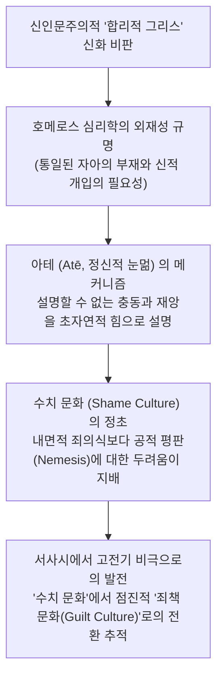

# 그리스인들과 비합리적인 것 (*The Greeks and the Irrational*)

> [!NOTE] 학술사적 의의 및 총평
> E. R. 도즈의 『그리스인들과 비합리적인 것』(1951)은 20세기 서양고전학계의 패러다임을 바꾼 혁명적 저작입니다. 18세기 빙켈만(Winckelmann) 이래 서구 지성사를 지배하던 "고대 그리스는 티 없는 순수 이성과 고요한 위대함의 합리적 문명이었다"는 계몽주의적 이상화를 깨뜨리고, 사회인류학(루스 베네딕트의 문화 패턴)과 프로이트 정신분석학을 도입하여 그리스 문화 저변에 흐르는 비합리적 충동, 주술, 집단적 불안, 신적 개입, 그리고 **아테**(ἄτη, *átē*; 관용명 Ate, 정신적 눈멂)의 심리학을 최초로 엄밀하게 해명했습니다.

---

## 1. 서지 정보 및 학술사적 맥락

- **저자**: 에릭 로버트슨 도즈 (Eric Robertson Dodds, 1893–1979) — 아일랜드 태생의 고전문헌학자, 옥스퍼드 대학교 그리스어 레기우스 석좌교수(Gilbert Murray의 후임).
- **출판 정보**: University of California Press (1951, Sather Classical Lectures 제25권, 327쪽).
- **연구 방법론**:
  - 고전문헌학적 텍스트 독해에 사회인류학(Ruth Benedict, Margaret Mead)과 정신분석학(Sigmund Freud)적 모델을 융합.
  - 종교사(History of Religion)와 비교신화학적 통찰을 통해 그리스 서사시와 비극의 심층 심리를 분석.
- **출간 당시의 학술적 충격**:
  - '합리주의의 요람'으로 칭송받던 고대 그리스에 주술적 공포, 종교적 불안, 샤머니즘적 요소가 만연했음을 폭로함으로써 현대 고대 심리학 연구의 새 지평을 엶.

---

## 2. 개념 전복 매트릭스 및 논증 계보도

### [기존 고전주의적 신화 vs 도즈의 인류학적 심리 모델]

| 분석 층위 | 전통적 고전주의 (18~19세기 신인문주의) | E. R. 도즈의 혁신적 분석 (*The Greeks and the Irrational*) |
|:---|:---|:---|
| **그리스 정신관** | 순수한 이성(Logos)과 조화, 균형의 합리주의 | 비합리적 공포, 무의식적 충동, 신적 광기가 교차하는 긴장의 장 |
| **사회적 윤리 유형** | 보편적 도덕법칙과 내면적 죄책감 | 타인의 비난과 사회적 평판에 종속된 ‘**수치 문화(Shame Culture)**’ |
| **신적 개입의 성격** | 단순한 문학적 장식이나 시적 수사 | 설명할 수 없는 심리적 충동을 외부 투사하는 ‘**심리적 외주화**’ |
| **인간의 실수와 과오** | 의지박약이나 지적 판단 미숙 | 신들이 인간의 마음에 직접 불어넣는 치명적 눈멂, ‘**아테([[concept-ate\|Ate]])**’ |

### [Mermaid 논증 구조도]

---

## 3. 제1장 "아가멤논의 변명(Agamemnon's Apology)" 정밀 독해

### 1.텍스트 분석 대상: 『일리아스』 19권 86~138행
- 트로이 전쟁 최고의 지휘관 아가멤논이 아킬레우스에게 공식 사과하면서 다음과 같이 외치는 장면:
  - *"나는 책임이 없다! 원인은 제우스와 모이라, 그리고 어둠 속을 걷는 에리뉘스이다. 그들이 민회에서 내 마음에 사나운 아테(Ate)를 던졌다!"* (*Il.* 19.86–89)

### 2.도즈의 심리학적·인류학적 해제
- **단순한 거짓말이 아닌 진정한 신앙의 고백**:
  - 근대 독자들은 아가멤논의 말을 '비겁한 핑계'로 치부하기 쉽지만, 도즈는 이것이 호메로스 시대 인간의 진실한 내적 경험을 표현한 것이라고 논증합니다.
  - 뛰어난 능력과 높은 지위를 가진 영웅이 도저히 상식적으로 이해할 수 없는 치명적인 오판(아킬레우스 모욕)을 저질렀을 때, 고대 그리스인은 이를 평소의 자아(Self)가 아닌 **외적인 비인칭적 힘(Daimon/Ate)에 의한 정신적 마비**로만 설명할 수 있었습니다.
- **심리적 사건의 외주화** (Psychic Intervention):
  - 인간 내부에서 일어나는 갑작스러운 감정의 격앙(Menos), 용기, 혹은 파멸적 충동은 자아의 결단이 아니라 신이 외부에서 인간의 가슴(Thymos)에 '불어넣은 것'으로 지각되었습니다.
- **수치 문화와 배상의 결합**:
  - 아가멤논은 원인을 아테로 돌리면서도, 그 행위가 초래한 사회적 결과에 대해서는 즉각 막대한 전리품 배상(Apoina)을 지불합니다. 이는 수치 문화에서 공적 명예를 회복하는 표준적 절차였습니다.

---

## 4. 문헌학적 어휘 사전 및 희랍어 개념 정밀 주해

1. **아테** (ἄτη, *átē*; 관용명 Ate):
   - 명사. 정신적 눈멂, 미망, 신들이 내린 일시적 광기. 판단력을 마비시켜 스스로 파멸을 초래하게 만드는 초자연적 힘.
2. **메노스** (μένος, *ménos*; 관용명 Menos):
   - 명사. 신들이 전사의 가슴이나 사지에 불어넣어 주는 초인적 활력, 전투 열기, 맹렬한 기세.
3. **다이몬** (δαίμων, *daímōn*; 관용명 Daimon):
   - 명사. 특정한 개별 올림포스 신이 아니라, 인간의 운명과 심리에 불시에 개입하여 길흉을 가져오는 비인칭적이고 불가해한 신적 위력.
4. **리타이** (Λιταί, *Litaí*; 관용명 Litai):
   - 명사. '기도와 탄원의 여신들'. 아테의 뒤를 절름발이로 따라가며 아테가 초래한 상처와 파멸을 치유하고 용서를 구하는 의인화된 도덕적 힘 (*Il.* 9.502).

---

## 5. 핵심 원문 인용 및 심층 주석

### 인용 1: 아테와 호메로스 인간의 심리에 대하여
- *"Homeric man has no unified concept of personality; his unexplained impulses and sudden disasters of judgement are attributed to a mysterious daemon, to Atē sent by the gods."* (Chapter 1, p. 17)
- **[주석]**: 호메로스 인간이 자신의 이해할 수 없는 행동의 원인을 신적 개입으로 외부화하는 심리적 기제를 명쾌하게 요약함.

### 인용 2: 수치 문화의 도덕적 압력에 대하여
- *"In a shame culture, the highest moral value is not the enjoyment of a quiet conscience, but the possession of timē, public esteem. The greatest good is to be praised, and the ultimate horror is public contempt (nemesis)."* (Chapter 2, p. 28)
- **[주석]**: 호메로스 영웅들이 왜 내면적 죄책감보다 동료 전사들과 사회의 공개적 비난(Nemesis)에 목숨을 걸고 반응했는지를 인류학적으로 규명함.

---

## 6. 서사시 전편 정밀 에피소드 매핑 테이블

| 서사시 권·행 번호 | 다루는 사건 및 인물 | 도즈의 심리학적·인류학적 해석 |
|:---|:---|:---|
| ***Il.* 1.412** | **아킬레우스의 아가멤논 비판** | 아가멤논이 아테에 빠져 최고의 아카이오이 전사를 알아보지 못하고 군대를 파멸로 몰아넣었다고 규탄함. |
| ***Il.* 5.124–132** | **디오메데스에게 주입된 메노스** | 아테나가 디오메데스의 가슴에 아버지 튀데우스의 두려움 없는 메노스(Menos)를 불어넣어 신들과도 싸울 수 있게 만드는 심리적 외주화의 전형. |
| ***Il.* 9.502–514** | **포이닉스의 리타이(Litai) 우화** | 아테는 발이 빠르고 강하여 인간을 먼저 파멸시키고, 기도의 여신들(Litai)은 절름발이로 뒤따라오며 용서를 구한다는 호메로스 윤리학 최고의 도덕적 비유. |
| ***Il.* 19.86–138** | **아가멤논의 공식 변명** | 자신의 파멸적 결정을 신적 개입(Atē, Moira, Erinys)으로 설명하는 호메로스 심리학의 결정적 원천 텍스트. |

---

## 7. 학술 논쟁사 및 비판적 공방

> [!WARNING] 도즈의 '수치 문화론'에 대한 비판과 현대적 극복
- **버나드 윌리엄스**([[williams-1993-shame-and-necessity|Bernard Williams, 1993]]):
  - 도즈의 '수치 문화 vs 죄책 문화' 도식은 기독교적 편향에 불과하며, 호메로스의 수치심(Aidos)은 '내면화된 타자'를 지닌 고차원적 도덕 감정임을 입증함.
- **더글러스 케언스**([[cairns-1993-aidos|Douglas Cairns, 1993]]):
  - 케언스는 문헌학적 전수 조사를 통해 그리스 문학에서 수치(Shame)와 죄책(Guilt)이 결코 배타적인 두 단계가 아니었음을 밝힘.
- **도즈의 불멸의 기여**:
  - 이러한 후속 비판에도 불구하고, 고전학 연구에 심리학과 인류학을 융합하여 서사시의 비합리적 심연을 파헤친 도즈의 통찰은 오늘날에도 대체 불가능한 고전으로 추앙받음.

---

## 8. 연구 질문 및 세미나 토론 쟁점

1. **신적 개입과 심리적 실재**: 호메로스 서사시에서 신이 메노스나 아테를 주입하는 장면은 고대인의 '실제 심리적 체험'이었는가, 아니면 당대의 서사적 표현 관습(Poetic convention)이었는가?
2. **아가멤논 변명의 윤리적 성격**: 아가멤논이 자신의 죄를 아테 탓으로 돌리면서도 거대한 배상을 지불한 것은, 현대 형법의 '원인에 있어서 자유로운 행위'나 '무과실 책임' 이론과 어떻게 비교될 수 있는가?

---

## 관련 항목
- [[analysis-homeric-ethics-literature-review]]
- [[concept-ate|Ate]]
- [[concept-aidos|Aidos]]
- [[concept-moira|Moira]]
- [[concept-menis|Menis]]
- [[concept-themis|Themis]]
- [[williams-1993-shame-and-necessity]]
- [[cairns-1993-aidos]]
- [[snell-1946-discovery-of-mind]]
- [[shay-1994-achilles-in-vietnam]]
