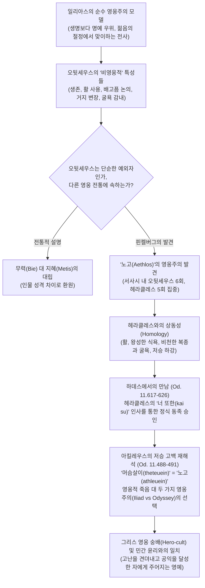

# 오뒷세우스와 영웅이라는 유 (*Odysseus and the Genus 'Hero'* )

> [!NOTE] 학술사적 의의 및 총평
> 텔아비브 대학교의 고전문헌학자 마르갈리트 핀켈버그(Margalit Finkelberg)의 1995년 논문 「오뒷세우스와 영웅이라는 유(Odysseus and the Genus 'Hero')」(『Greece & Rome』 제42권 제1호)는 호메로스 서사시 비평사에서 오뒷세우스의 영웅적 본질과 고대 그리스 영웅 관념의 원형을 규명한 전환점적 연구입니다. 저자는 기존 학계가 아킬레우스와 오디세우스의 차이를 단순한 '무력(bie) 대 지혜(metis)'의 대립으로 축소하거나 오디세우스를 일리아스적 영웅 규범에서 벗어난 '비영웅적 예외자'로 취급해 온 관행을 근본적으로 비판합니다.
>
> 핀켈버그는 문헌학적 어휘 분석을 통해 오디세우스의 생애를 규정하는 핵심 범주가 바로 헤라클레스의 열두 과업에 적용되는 '노고(aethlos/athlos)'임을 밝혀냅니다. 서사시 전체에서 aethlos가 개별 영웅의 생애 전체에 체계적으로 귀속되는 인물은 오직 오디세우스와 헤라클레스 둘뿐입니다. 따라서 오디세우스는 예외적 일탈자가 아니라, 혹독한 시련과 굴욕을 겪으며 공동체와 인류를 위한 과업을 완수하는 '노고의 영웅(Hero of Labours)'이라는 그리스 신화 고유의 유(genus)에 속합니다. 나아가 저승에서 아킬레우스가 머슴(thes)으로 사는 편이 낫다고 고백한 장면(Od. 11.488–491)은 '영웅적 죽음 대 비겁한 생존'의 갈등이 아니라, '전장에서의 요절을 통한 영웅주의'와 '인간적 고난을 견뎌내는 노고의 영웅주의'라는 두 영웅주의 양식 간의 중대한 가치 선택임을 입증합니다.

---

## 1. 서지 정보 및 학술사적 배경

- **저자**: 마르갈리트 핀켈버그 (Margalit Finkelberg, 1947– ) — 텔아비브 대학교 서양고전학 명예교수, 이스라엘 과학·인문학 한림원 회원, 『The Homeric Encyclopedia』(3권, 2011) 편집위원장, 『The Birth of Literary Fiction in Ancient Greece』(1998) 저자.
- **출판 정보**: 『Greece & Rome』, Second Series, Vol. 42, No. 1 (April 1995), pp. 1–14 (Cambridge University Press).
- **연구 방법론**:
  - 호메로스 서사시 전편 및 아르카익·고전기 문헌 코퍼스 내 어휘 용례 분석: 특히 ἆθλος(*aethlos*/*athlos*), ἀθλεύω(*athleuō*), θητεύω(*thēteuō*), πολύτλας(*polutlas*).
  - 서사시 내부의 영웅 표상과 고대 그리스 영웅 숭배(Hero-cult) 제의 실천의 종교학적·인류학적 비교.
  - 서사시 플롯 구조와 아르카익 비가(미므네르모스, 테오그니스), 비극(소포클레스, 에우리피데스), 핀다로스 승전가, 헬레니즘 사료(디오도로스 시쿨로스), 고전기 철학(프로디코스) 간의 지성사적 연속성 고찰.
- **학술사적 대립 구도 및 문제의식**:
  - **일리아스 중심적 영웅주의 규범의 독점성 비판**:
    - 근대 호메로스 비평(J. Griffin 1980, S. L. Schein 1984, M. W. Edwards 1987)은 '영웅'의 개념을 오직 『[[일리아스]]』 전사들의 규범, 즉 생명보다 명예([[concept-time|Time]])와 영광([[concept-kleos|Kleos]])을 앞세우고 가장 빛나는 젊음의 절정에서 전사하는 '**아름다운 죽음**'(*kalos thanatos*)으로만 규정해 옴.
    - 이에 따라 『[[오뒷세이아]]』의 주인공 오디세우스는 늙어서 살아남고, 활을 쏘며, 배고픔을 논하고, 거지로 변장하는 등 전형적인 '비영웅적(unheroic)' 특성을 지닌 이질적 존재로 간주됨.
  - **무력**(Bie) **대 지혜**([[concept-metis|Metis]]) **이분법의 한계 극복**:
    - 고대 주석가들부터 그레고리 나기(Gregory Nagy 1979)에 이르기까지 아킬레우스와 오디세우스의 대조는 대개 '무력(βίη, *biē*)' 대 '꾀(μῆτις, *mētis*)'의 대립으로 설명되어 왔음.
    - 그러나 핀켈버그는 W. B. 스탠퍼드(W. B. Stanford 1963)의 고전적 연구(『The Ulysses Theme』)를 발전시켜, 오디세우스의 본질이 단순한 꾀나 지략에 머무르지 않고 영웅적 규범 전반에 걸친 총체적 편차(음식에 대한 관심, 활의 사용, 굴욕과 타협의 감내, πολύτλας 에피텟)에 기초함을 포착함.
  - **그리스 종교와 영웅 숭배(Hero-cult)의 역설 해명**:
    - 발터 부르케르트(Walter Burkert 1985)가 지적했듯, 역사적 그리스 영웅 제의에서 '전쟁터에서 전사한 전몰자'가 개인 영웅으로 숭배받는 일은 규칙이 아니라 극히 드문 예외였음. 오히려 신화와 제의에서 숭배받은 영웅들은 헤라클레스, 테세우스, 이아손 등 헤아릴 수 없는 시련과 고난을 완수한 영웅들이었음.
    - 핀켈버그는 『[[오뒷세이아]]』의 영웅 모델이 후대의 변질이나 비영웅적 타협이 아니라, 그리스 민간 종교와 영웅 제의의 핵심 원형인 '노고의 영웅' 전통을 가장 충실하게 구현하고 있음을 입증하고자 함.

---

## 2. 개념 대조 매트릭스 및 논증 계보도

### [일리아스형 영웅주의 vs 오뒷세이아형 영웅주의 비교 매트릭스]

| 비교 층위 | 일리아스형 순수 영웅주의 (*Iliadic Heroism*) | 오뒷세이아형 노고 영웅주의 (*Odyssean Heroism*) | 문헌학적·개념적 근거 |
|:---|:---|:---|:---|
| **영웅의 정의** | 생명보다 명예를 상위에 두고, 젊음의 절정에서 전사하는 자 | 모진 노고와 굴욕을 견뎌내며 살아남아 귀환과 질서를 회복하는 자 | *Il.* 12.322–328 (사르페돈의 연설) vs *Od.* 1.16–19 (서시) |
| **핵심 생애 경험** | 전장에서의 단기적이고 폭발적인 결전과 장렬한 전사 | 노고(ἆθλος, *aethlos*), 방랑, 인내, 신분 박탈과 굴욕 | *aethlos* 용례: 일리아스 전사 0회 vs 오디세우스 6회 |
| **삶과 죽음의 선택** | 짧고 영광스러운 삶 vs 길고 무명한 삶 (아킬레우스의 선택) | 필멸의 인간적 삶(노고와 고통 수락) vs 신적 불사(칼립소 제안 거절) | *Il.* 9.410–416 vs *Od.* 5.202–224 |
| **육체와 인간 조건** | 육체적 한계 부정, 음식·배고픔 경시 (아킬레우스의 금식 고집) | 산문적 인간성 수용, 위장(γαστήρ, *gastēr*)의 물질적 필연성 인정 | *Il.* 19.154–237 (식사에 관한 아킬레우스-오디세우스 논쟁) |
| **대표 무기** | 귀족 전사의 상징인 근접전 무기 '창(δόρυ)' | 생존과 전략, 원거리 제압의 무기 '활(τόξον)' | 일리아스 전사들의 활 폄하 vs 오디세우스의 활 (*Od.* 21권) |
| **핵심 수식어(에피텟)** | 발이 빠른(*podas okys*), 도시를 파괴하는(*ptoliporthos*) | 많은 고난을 견뎌낸(πολύτλας, *polutlas*), 지략이 풍부한(*polymetis*) | 운율상 *polutlas dios Achilleus* 가능함에도 아킬레우스에 미적용 |
| **신화적 원형(Genus)** | 트로이아 전몰 전사군 (아킬레우스, 헥토르, 사르페돈) | 괴수를 퇴치하고 과업을 수행하는 자 (헤라클레스, 페르세우스, 테세우스) | 전장에서 전사하지 않고 고난을 돌파한 영웅군 |
| **저승 하강(Katabasis)** | 사자(죽은 자)로서 하데스 영구 거류 | 산 자로서 하데스에 내려가 과업을 완수하고 지상으로 귀환 | 헤라클레스와의 조우 및 정식 영웅 승인 (*Od.* 11.617–626) |
| **역사적 제의(Hero-cult)** | 전몰자 공동 매장(Demosion Sema) 전통 (개인 제의 예외적) | 고난을 통과하여 불멸·신성화를 획득하는 민간 영웅 제의 원형 | 부르케르트의 영웅 제의론, 디오도로스 시쿨로스(1.2.4) |

### [Mermaid 논증 구조도]

---

## 3. 논문의 핵심 테제 및 섹션별 정밀 분석

### 제1절: 일리아스의 순수 영웅주의 모델과 죽음의 우선성 (pp. 1–3)

- **순수하고 단순한 영웅 규범**:
  - 『[[일리아스]]』가 전개하는 영웅 관념은 명쾌하고 단순합니다: "영웅이란 생명 그 자체보다 명예([[concept-time|Time]])와 영광([[concept-kleos|Kleos]])을 더 높이 평가하며, 인생의 절정기(prime of life)에 전장에서 죽음을 맞이하는 자이다."
- **아킬레우스와 헥토르의 숙명적 선택**:
  - 아킬레우스는 9권에서 짧고 영광스러운 삶과 길고 무명한 삶 사이에서 고뇌하지만(*Il.* 9.410–416), 테티스로부터 헥토르의 죽음 직후 자신의 죽음이 뒤따른다는 경고를 받고도 파트로클로스의 복수를 위해 주저 없이 죽음을 선택합니다(*Il.* 18.94–126).
  - 헥토르 역시 생명보다 명예를 선택하여 성벽 안으로 피신하라는 부모의 간청을 뿌리치고 홀로 성벽 밖에 남아 아킬레우스의 손에 최후를 맞이합니다(*Il.* 22.90–130).
  - 시모에이시오스(*Il.* 4.473–489)나 리카온(*Il.* 21.34–114)과 같은 수많은 단역 전사들 또한 전쟁터에서 명성을 얻기 위해 자원하여 죽음을 맞이함으로써 이 규범을 입증합니다.
- **사르페돈의 연설 (*Il.* 12.322–328)에 나타난 전사 윤리의 정수**:
  - 사르페돈이 글라우코스에게 전하는 유명한 연설은 일리아스 영웅주의의 존재론적 정식을 보여줍니다:
    - 만약 이 전투를 피하여 영원히 늙지도 않고 죽지도 않는 불사자(ἀγήρω τ’ ἀθανάτω τε)가 될 수 있다면 전방에서 싸우지도, 남을 전쟁터로 내몰지도 않을 것입니다.
    - 그러나 인간에게는 피할 수 없는 수만 가지 죽음의 운명(κῆρες θανάτοιο)이 둘러싸고 있기에, 다른 이에게 영광을 주든 스스로 영광을 쟁취하든 앞으로 나아가야 합니다.
    - 즉, 필멸성이라는 한계 속에서 죽음을 선취하여 불멸의 명성으로 승화시키는 것만이 일리아스 영웅의 존재 이유입니다.
- **오뒷세우스의 이질성**:
  - 『[[오뒷세이아]]』의 오디세우스는 이 구조에 들어맞지 않습니다. 오디세우스가 살아남은 것은 비겁함 때문이 아니며(11.401–413의 혈투가 증명하듯), 삶의 정황 자체가 그를 전통적 영웅 규범으로는 대응할 수 없는 완전히 다른 실존적 경험 속으로 몰아넣었기 때문입니다.

### 제2절: 오뒷세우스의 예외성과 '노고(Labours/Athloi)'의 영웅주의 (pp. 3–5)

- **W. B. 스탠퍼드의 발견과 영웅 규범으로부터의 체계적 이탈**:
  - 고대 주석가 이래로 오디세우스의 이질성은 대개 '지혜([[concept-metis|Metis]]) 대 무력(Bie)'으로 설명되어 왔으나, 스탠퍼드는 오디세우스가 거의 모든 영웅적 특징에서 표준 규범으로부터 체계적으로 일탈해 있음을 입증했습니다:
    1. **음식과 배(γαστήρ, *gastēr*)에 대한 관심**: 서사시 전체에서 음식의 필요성과 배고픔의 위력을 공개적으로 논의하는 유일한 영웅입니다. 『일리아스』 19권(19.154–237)에서 아킬레우스가 식사를 거부하고 즉각적인 출전을 고집할 때, 오디세우스는 병사들이 굶주린 상태에서는 싸울 수 없다며 식사의 절대적 필요성을 현실적으로 역설합니다.
    2. **무기의 선택**: 다른 주요 아카이아 장수들이 귀족적 근접 무기인 창을 표준 무기로 사용하는 반면, 오디세우스는 '비영웅적'으로 취급되던 활(τόξον)을 다룹니다(10권 돌론 야습 및 『오뒷세이아』 전편).
    3. '**많이 견뎌낸 자**'(πολύτλας, *polutlas*)와 굴욕의 감내: 아킬레우스나 아이아스였다면 결코 용납하지 않았을 굴욕적 경험—세 차례에 걸친 거지 변장, 숫양의 배 밑에 매달려 탈출하기, 자신의 궁전에서 구혼자들에게 모욕당하기—을 자발적으로 감내합니다.
- '**노고**'(ἆθλος, *aethlos*)의 문헌학적 의미 분석:
  - 『오뒷세이아』에서 오디세우스의 생애 경험은 총 6회에 걸쳐 ἆθλος(*aethlos*)라는 단어로 규정됩니다(*Od.* 1.18; 4.170, 241; 23.248, 261, 350).
  - 고대 그리스어에서 ἆθλος는 두 가지 의미, 즉 **(1) 운동 경기**(athletic contest; certamen, ludus)와 **(2) 고난·노고·시련**(labour; aerumna, labor, contentio)을 갖습니다. 현대 사전(LSJ)은 이를 '투쟁(struggle)'이라는 모호한 개념으로 뭉뚱그려 형용사 ἄθλιος(*athlios*, '비참한', '불쌍한')와의 어원적 친연성을 간과했습니다.
  - 『일리아스』 24.732–734에서 안드로마케가 아스티아낙스의 비참한 노예 노동을 묘사할 때 쓴 ἀθλεύων(*athleuōn*)이나, 7.452–453에서 포세이돈이 라오메돈 밑에서 트로이아 성벽을 쌓았던 고역을 묘사할 때 쓴 ἀθλήσαντε(*athlēsante*)는 단순한 경쟁이 아니라 '비천한 복종과 생존을 위한 고통스러운 노역'을 가리킵니다.
- **오뒷세우스와 헤라클레스의 상동성**(Homology):
  - 호메로스 서사시 전편에서 ἆθλος 및 동계어가 '노고'의 의미로 개별 영웅의 생애에 체계적으로 적용되는 인물은 오직 **오디세우스**(6회)와 **헤라클레스**(5회) 둘뿐입니다.
  - 헤라클레스 역시 일리아스적 영웅 규범으로는 설명될 수 없습니다:
    - 아티카 희극과 사티로스극에 등장하는 대식가·주당의 면모(음식에 대한 현실적 집착).
    - 활을 영구적 무기로 소지.
    - 에우리스테우스 밑에서의 굴욕적 복종과 뤼디아 여왕 옴팔레의 노예 생활 등 온갖 타협과 굴욕을 견뎌낸 '많이 견뎌낸 자(πολύτλας)'의 원형.
- **하데스에서의 만남 (*Od.* 11.617–626)의 상징성**:
  - 저승 하강(Katabasis)은 두 영웅이 공유하는 가장 위험하고 결정적인 과업(aethlos)입니다.
  - 헤라클레스는 오디세우스를 마주하자마자 다음과 같이 외칩니다:
    - "라에르테스의 아들이자 제우스의 혈통인 지략이 뛰어난 오디세우스여! 아, 가련한 자여, **너 또한(καὶ σύ, *kai su*)** 내가 태양의 빛 아래에서 겪었던 것과 같은 쓰라린 운명을 지고 가는구나!"
    - 이 강렬한 '너 또한(*kai su*)'이라는 호칭은 헤라클레스가 오디세우스를 자신과 완벽히 동일한 '노고의 영웅(Hero of Labours)'이라는 유(genus)로 공식 인정한 선언입니다.
  - 이 유에는 페르세우스, 이아손, 벨레로폰, 테세우스 등 괴수를 물리치고 험난한 과업을 수행했으나 전장에서 죽지 않은 그리스 신화의 거대한 영웅군 전체가 포함됩니다.

### 제3절: 저승에서의 아킬레우스(Od. 11.488–491)의 재해석 (pp. 10–12)

- **아킬레우스의 충격적 답변**:
  - 오디세우스는 저승에서 아킬레우스의 망령을 만나 그가 살아있을 때 신처럼 존경받았고 죽어서도 망자들의 통치자이므로 가장 복받은 자(μάκαρτατος)라고 위로합니다.
  - 그러나 아킬레우스는 이를 일축하며 유명한 선언을 남깁니다:
    - "내게 죽음에 대해 그럴싸하게 말하지 마시오, 영광스러운 오디세우스여! 나는 세상을 떠난 모든 사자들을 다스리느니, 차라리 땅 위에서 몫의 땅도 없고 생계도 넉넉지 못한 가난한 사람 밑에서 머슴살이(θητευέμεν, *thēteuémen*)를 하고 싶소!"
- **θητεύειν**(*thēteuein*)**의 어휘적 분석과 핀켈버그의 혁신적 통찰**:
  - 재스퍼 그리핀(Jasper Griffin 1987)을 비롯한 전통적 비평가들은 이 장면을 『일리아스』의 화려한 영웅주의에 대한 『오뒷세이아』의 냉소적 조롱이자, 죽음의 냉혹한 실재 앞에서 영웅주의를 포기한 생존자의 비영웅적 선택으로 해석해 왔습니다.
  - 그러나 핀켈버그는 아킬레우스가 사용한 동사 **θητεύειν**(*thēteuein*, '머슴살이하다')에 주목합니다:
    - 이 단어는 『일리아스』 21.444에서 포세이돈과 아폴론이 라오메돈 밑에서 겪은 노역을 묘사할 때 사용되었으며, 7.453에서 ἀθλεῖν(*athlein*, '노고를 치르다')과 정확한 동의어로 기능했습니다.
    - 남의 밑에서 머슴으로 일하는 비천한 노동은 헤라클레스가 에우리스테우스 밑에서 겪었던 복종과 직결되는 노고(aethlos)의 전형적 모티브입니다.
  - 따라서 아킬레우스의 고백은 '영웅적 죽음 대 비영웅적 삶'의 대립이 아니라, '**서로 다른 두 가지 영웅주의 양식 간의 선택**'입니다.
  - 『일리아스』의 아킬레우스가 전장에서의 조기 전사와 불멸의 명성([[concept-kleos|Kleos]])을 선택했다면, 저승에서 죽음의 무의미함을 직시한 『오뒷세이아』의 아킬레우스는 오디세우스와 헤라클레스가 체현하는 '**노고를 견뎌내는 삶의 영웅주의**'를 선택하고 있는 것입니다.

### 제4절: 고대 그리스 민간 신앙과 영웅 숭배(Hero-cult) 전통의 조화 (pp. 5–10, 12–14)

- **영웅 숭배(Hero-cult)의 실제 기준과 전몰자 문제**:
  - 현대 학계(L. R. Farnell, W. Burkert)는 흑색 제물, 야간 제사, 도살 시 목을 아래로 향하게 하는 크토니오스적 의례로 영웅 제의를 규정합니다.
  - 그러나 발터 부르케르트가 지적했듯, 그리스 종교사에서 **전투에서 전사한 자가 영웅 숭배를 받는 것은 극히 예외적인 일**이었습니다. 전몰자는 헤로도토스의 텔로스(Tellus) 이야기나 마라톤·플라타이아이 전몰자처럼 대개 전장에 공동 매장(Demosion Sema)되어 집단적 추모를 받았을 뿐, 개별 영웅으로 신격화되지 않았습니다.
- **아르카익 민간 윤리에서 요절(Early Death)의 이중적 의미**:
  - 그리스 민간 사유에서 요절은 영웅적 승리가 아니라 오히려 삶의 비참함을 피하기 위한 신적 축복으로 간주되기도 했습니다:
    - 테오그니스(Theog. 1013–1014): "노고(aethlon)를 겪지 않고 어두운 하데스의 집으로 내려가는 자야말로 복되고 운 좋으며 행복한 자이다."
    - 미므네르모스(Mimn. fr. 2): 죽음의 운명(keres)에는 '가증스러운 노화'와 '죽음'의 두 가지가 있으며, 제우스가 주는 온갖 슬픔을 피하기 위해서는 차라리 일찍 죽는 편이 낫습니다.
    - 클레오비스와 비톤(Hdt. 1.31): 헤라 여신이 효심 깊은 두 청년에게 내린 최고의 신적 축복은 신전에서 잠든 채 젊은 나이에 평온하게 숨을 거두는 것이었습니다.
    - 아킬레우스의 두 항아리 비유(*Il.* 24.525–533): 인간의 삶은 고통과 재앙이 본질이며, 펠레우스와 프리아모스처럼 장수하는 것은 재앙의 연장일 뿐입니다.
- **고난의 수용과 숭고한 성취로의 승화**:
  - 그러나 그리스 정신은 고통을 비관하여 자살하거나 수동적으로 굴복하는 것을 단호히 배격했습니다:
    - 에우리피데스의 『헤라클레스』(1349–1360): 광기로 처자식을 죽인 헤라클레스는 자살이야말로 비겁한 행위이며, 운명의 일격을 견뎌내지 못하는 자는 적의 무기도 견뎌내지 못할 것이라 선언하며 살아남기를 택합니다.
    - 바킬리데스(Epinician 5.150–152): 저승에서 멜레아그로스의 비극을 들은 헤라클레스는 인간에게는 태어나지 않는 것이 최선이지만, 이미 태어난 이상 비탄에 빠져있기보다 행동할 수 있는 바를 도모해야 한다고 역설합니다.
    - 소포클레스의 『필록테테스』(1422): 신격화된 헤라클레스는 절망에 빠진 필록테테스에게 "이러한 고통으로부터 영광스러운 삶을 쟁취하라(*ek tôn pónōn tônde kléa thésthai bíon*)"고 명령합니다.
    - 소포클레스의 『콜로노스의 오이디푸스』(563–564): 테세우스는 오이디푸스가 평생 겪은 거대한 고통을 자신이 겪은 것과 같은 종류의 '노고(ponoi)'로 인정하며, 오이디푸스는 그 고통을 완수함으로써 아테네를 지키는 복된 영웅(olbios)으로 승화됩니다.
- **오뒷세우스의 궁극적 과업(Telos)과 불멸의 보상**:
  - 디오도로스 시쿨로스(1.2.4)가 정리했듯, 그리스인들에게 영웅성이란 "필멸의 노고를 치르고 불멸의 명성을 얻는 것(*thnētôn pónōn antikatalláksasthai tḕn athánaton eúkleian*)"이었습니다.
  - 프로디코스의 유명한 우화 『헤라클레스의 선택』(Xen. *Mem.* 2.1.28)에서 '미덕(Virtue)'은 신들이 노고와 노력(*áneu pónou kaì epimeleías*) 없이는 어떤 좋은 것도 주지 않으며, 친구와 폴리스, 그리스 전체를 위해 봉사할 때 최고의 행복(olbos)이 주어진다고 가르칩니다.
  - 오디세우스는 칼립소가 제안한 신적 불사를 거절하고 고난으로 가득 찬 필멸의 인간 조건을 스스로 선택했습니다(*Od.* 5.202–224).
  - 귀향 후 구혼자들을 물리치고 아내와 재결합한 직후에도 오디세우스는 페넬로페에게 아직 모든 노고의 끝에 도달하지 못했다고 말합니다(*Od.* 23.248–250). 그는 테이레시아스의 예언대로 바다를 모르는 내륙 사람들을 찾아 노를 메고 떠나 포세이돈과 화해하는 마지막 공적 과업을 완수해야 합니다(*Od.* 11.134–137).
  - 오디세우스는 이 마지막 문명화 과업을 완수한 뒤에야 평화로운 고향에서 윤택한 노년(γῆρας λιπαρόν)을 누리고, 바다로부터 오는 온화한 죽음(θάνατος ἐξ ἁλὸς ἀβληχρός)을 맞이하여 백성들의 축복 속에 생을 마감할 것입니다. 이 약속은 『오뒷세이아』가 그리스 민간의 영웅 숭배 및 고난을 통과한 성취의 에토스를 치밀하게 반영하고 있음을 보여줍니다.

---

## 4. 호메로스 원문 및 전승 비교 인용구

- **번역**: "벗이여, 만약 우리가 이 전쟁을 피하여 영원히 늙지도 않고 죽지도 않는 존재가 될 수만 있다면, 나 자신도 앞장서서 싸우지 않을 것이며 그대를 영광을 주는 전투로 내보내지도 않을 것이오. 하지만 보시오, 죽음의 운명 수만 가지가 우리를 에워싸고 있고 필멸의 인간은 이를 피할 수도 달아날 수도 없으니, 앞으로 나아갑시다. 우리가 남에게 영광을 주든, 남이 우리에게 영광을 주든 간에!"
- **원문**: *ὦ πέπον, εἰ μὲν γὰρ πόλεμον περὶ τόνδε φυγόντε / αἰεὶ δὴ μέλλοιμεν ἀγήρω τ’ ἀθανάτω τε / ἔσσεσθ’, οὔτε κεν αὐτὸς ἐνὶ πρώτοισι μαχοίμην / οὔτε κέ σε στέλλοιμι μάχην ἐς κυδιάνειραν· / νῦν δ’—ἔμπης γὰρ κῆρες ἐφεστᾶσιν θανάτοιο / μυρίαι, ἃς οὐκ ἔστι φυγεῖν βροτὸν οὐδ’ ὑπαλύξαι— / ἴομεν, ἠέ τῳ εὖχος ὀρέξομεν, ἠέ τις ἡμῖν.*
- **학술 전사**: *ô pépon, ei mèn gàr pólemon perì tónde phygónte / aieì dḕ mélloimen agḗrō t’ athanátō te / éssesth’, oúte ken autòs enì prṓtoisi makhoímēn / oúte ké se stélloimi mákhēn es kydiáneiran; / nŷn d’—émpēs gàr kêres ephestâsin thanátoio / myríai, hàs ouk ésti phygeîn brotòn oud’ hypalýksai— / íomen, ēé tōi eûkhos oréksomen, ēé tis hēmîn.* (*Il.* 12.322–328)
  - **[주석]**: 사르페돈이 글라우코스에게 전하는 일리아스형 순수 영웅주의의 핵심 정식. 인간의 필멸성이 역설적으로 전장에서의 전사를 통한 영원한 영광 추구의 유일한 도덕적 정당성이 됨을 선언함.

- **번역**: "라에르테스의 아들이자 제우스의 혈통인 지략이 뛰어난 오디세우스여! 아, 가련한 자여, 너 또한 내가 태양의 빛 아래에서 겪었던 것과 같은 쓰라린 운명을 지고 가는구나!"
- **원문**: *διογενὲς Λαερτιάδη, πολυμήχαν’ Ὀδυσσεῦ, / ἆ δείλ’, ἦ τινὰ καὶ σὺ κακὸν μόρον ἡγηλάζεις, / ὅν περ ἐγὼν ὀχέεσκον ὑπ’ αὐγὰς ἠελίοιο.*
- **학술 전사**: *diogenès Laertiádē, polymḗkhan’ Odysseû, / â deíl’, ê tinà kaì sỳ kakòn móron hēgēlázeis, / hón per egṑn okhéeskon hyp’ augàs ēelíoio.* (*Od.* 11.617–619)
  - **[주석]**: 저승에서 헤라클레스가 오디세우스에게 건네는 첫 인사. "너 또한(καὶ σύ)"이라는 호격을 통해 오디세우스를 자신과 동일한 '노고의 영웅'이라는 종(species)으로 공식 승인하는 상징적 대목.

- **번역**: "나는 크로노스의 아들 제우스의 자식이었으나 측량할 수 없는 고난을 겪었노라. 나보다 훨씬 못한 자에게 굴복당하여, 그 자가 내게 혹독한 노고(aethlous)들을 부과하였기 때문이니라."
- **원문**: *Ζηνὸς μὲν πάϊς ἦα Κρονίονος, αὐτὰρ ὀϊζὺν / εἶχον ἀπειρεσίην· χαλεποῖσι γὰρ ἀνδρὶ δέδμητο / πολλὸν χείρονι, ὁ δέ μοι χαλεποὺς ἐπετέλλετ’ ἀέθλους.*
- **학술 전사**: *Zēnòs mèn páïs êa Kroníonos, autàr oïzỳn / eîkhon apeiresíēn; khalepoîsi gàr andrì dédmēto / pollòn kheíroni, ho dé moi khalepoùs epetéllēt’ aéthlous.* (*Od.* 11.620–622)
  - **[주석]**: 헤라클레스가 자신의 생애를 회고하는 구절. 영웅적 위업이 열등한 자(에우리스테우스) 밑에서 겪는 비천한 복종과 굴욕적인 노고(ἆθλοι)를 통과하여 달성되었음을 명시함.

- **번역**: "죽음에 대해 내게 그럴싸하게 말하지 마시오, 영광스러운 오디세우스여! 나는 세상을 떠난 모든 사자들을 다스리느니 차라리 지상에서 몫의 땅도 없고 생계도 넉넉지 못한 사람 밑에서 머슴살이(theteuemen)를 하고 싶소이다."
- **원문**: *μὴ δή μοι θάνατόν γε παραύδα, φαίδιμ’ Ὀδυσσεῦ. / βουλοίμην κ’ ἐπάρουρος ἐὼν θητευέμεν ἄλλῳ, / ἀνδρὶ παρ’ ἀκλήρῳ, ᾧ μὴ βίοτος πολὺς εἴη, / ἢ πᾶσιν νεκύεσσι καταφθιμένοισιν ἀνάσσειν.*
- **학술 전사**: *mḕ dḗ moi thánatón ge paraúda, phaídim’ Odysseû. / bouloímēn k’ epárouros eṑn thēteuémen állōi, / andrì par’ aklḗrōi, hō̂i mḕ bíotos polùs eíē, / ē̂ pâsin nekýessi kataphthiménoisin anássein.* (*Od.* 11.488–491)
  - **[주석]**: 아킬레우스의 저승 선언. 여기서 머슴살이를 뜻하는 θητευέμεν은 ἀθλεύειν(노고를 치르다)의 동의어로서, 일리아스적 영웅의 요절보다 오디세우스적 '노고를 견뎌내는 삶'을 지향하는 두 영웅주의 사이의 가치 전도를 표현함.

- **번역**: "부인이여, 우리는 아직 모든 노고(aethlon)의 끝에 도달하지 못하였소. 앞으로도 끝없는 노고, 길고도 힘겨운 노고가 남아 있으니, 내가 반드시 모두 완수해야만 하오."
- **원문**: *ὦ γύναι, οὐ γάρ πω πάντων πείρατ’ ἀέθλων / ἤλθομεν, ἀλλ’ ἔτ’ ὄπισθεν ἀμέτρητος πόνος ἔσται, / πολλὸς καὶ χαλεπός, τὸν ἐμὲ χρὴ πάντα τελέσσαι.*
- **학술 전사**: *ô gýnai, ou gár pō pántōn peírat’ aéthlōn / hḗlthomen, all’ ét’ ópisthen amétrētos pónos éstai, / pollòs kaì khalepós, tòn emè khrḕ pánta teléssai.* (*Od.* 23.248–250)
  - **[주석]**: 구혼자 살육과 부부 재회 직후 오디세우스가 페넬로페에게 건네는 말. 오디세우스의 영웅적 정체성이 단순한 방랑의 종결이 아니라 평생에 걸친 '노고(ἆθλος)'의 완수에 있음을 확증함.

- **번역**: "필멸의 노고(ponon)를 치르는 대가로 불멸의 명성(athanaton eukleian)을 얻는 것은 참으로 탁월한 일이다. 헤라클레스의 경우, 그가 인간들 사이에 머무는 동안 인류에게 은혜를 베풀고 불멸성을 얻기 위하여 거대하고 끊임없는 노고와 위험을 기꺼이 감내했다는 것은 널리 인정받는 사실이다."
- **원문**: *θνητῶν πόνων ἀντικαταλλάξασθαι τὴν ἀθάνατον εὔκλειαν ... ἐνδῦναι μεγάλους καὶ συνεχεῖς πόνους καὶ κινδύνους ἑκουσίως, ἵνα τὸ γένος τῶν ἀνθρώπων εὐεργετήσας τύχῃ τῆς ἀθανασίας.*
- **학술 전사**: *thnētôn pónōn antikatalláksasthai tḕn athánaton eúkleian ... endŷnai megálous kaì sunekheîs pónous kaì kindýnous hekousíōs, hína tò génos tôn anthrṓpōn euergetḗsas týkhēi tês athanasías.* (Diodorus Siculus 1.2.4)
  - **[주석]**: 헬레니즘 역사가 디오도로스 시쿨로스가 정립한 그리스 영웅주의의 본질. 전장 전몰이 아닌 고난 감내와 인류에 대한 기여(euergesia)를 통한 불멸성 획득의 메커니즘을 요약함.

---

## 5. 호메로스 위키 연계 및 연구사적 함의

- **[[entity-odysseus|오디세우스]]의 존재론적 위상 재정립**:
  - 오디세우스는 아킬레우스 모델에 비추어 볼 때의 결함 있는 영웅이나 단순한 '꾀돌이'가 아닙니다. 그는 혹독한 고난을 견뎌내고 인간 조건을 수락하며, 공동체와 문명 질서를 복원하는 '노고의 영웅(Hero of Labours)'의 완전한 구현체입니다.
- **[[entity-achilles|아킬레우스]]의 비극성과 저승 에피소드의 재발견**:
  - 아킬레우스의 하데스 발언은 전사 윤리의 완전한 파탄이나 허무주의적 환멸이 아닙니다. 일리아스 전편을 통해 '아름다운 죽음'의 극치를 살았던 아킬레우스가 저승의 냉엄한 무화(nihil)를 겪은 뒤, 오디세우스가 대변하는 '삶의 노고를 감내하는 또 다른 영웅주의'의 존엄성을 사후에 인정한 사상적 성찰로 해석되어야 합니다.
- **[[concept-kleos|클레오스(Kleos)]]와 [[concept-nostos|노스토스(Nostos)]]의 상보성**:
  - 『일리아스』에서 명성(Kleos)은 귀향(Nostos)의 포기를 대가로 얻어지는 것이었으나(*Il.* 9.412–416), 『오뒷세이아』에서는 귀향 자체가 수많은 노고(aethloi)를 돌파한 영웅에게 주어지는 최고의 승리이자 독자적인 클레오스의 원천이 됩니다.
- **[[concept-metis|메티스(Metis)]]와 πολύτλα스(*polutlas*)의 유기적 결합**:
  - 오디세우스의 지략(Metis)은 고립된 기교가 아니라, 가혹한 시련과 굴욕 속에서 목숨을 보전하고 최종 과업을 달성하기 위해 자신을 낮추는 '인내(polutlas)'와 불가분하게 결합되어 작동합니다.
- **그리스 윤리학 및 철학사적 계보 형성**:
  - 핀켈버그의 분석은 호메로스 서사시가 어떻게 소크라테스(『변명』 22a에서 자신의 철학적 방랑을 헤라클레스적 노고로 묘사), 안티스테네스, 견유학파(Cynics), 스토아학파(Stoics)로 이어지는 고대 윤리학의 모태가 되었는지를 밝혀줍니다. 철학자들의 이상적 영웅이 아킬레우스가 아닌 헤라클레스와 오디세우스였던 이유는 바로 이들이 체현한 자제력, 굴욕의 감내, 공익을 위한 헌신이라는 노고의 윤리 때문이었습니다.

---

## 관련 항목

- [[analysis-homeric-ethics-literature-review]]
- [[analysis-concept-source-matrix]]
- [[entity-odysseus|오디세우스 (Odysseus)]]
- [[entity-achilles|아킬레우스 (Achilles)]]
- [[entity-hector|헥토르 (Hector)]]
- [[concept-kleos|클레오스 (Kleos)]]
- [[concept-nostos|노스토스 (Nostos)]]
- [[concept-metis|메티스 (Metis)]]
- [[concept-arete|아레테 (Arete)]]
- [[concept-time|티메 (Time)]]
- [[vernant-1989-belle-mort]]
- [[nagy-1979-best-of-achaeans]]
- [[lee-junseok-2016-odyssey-humanity]]
- [[일리아스]]
- [[오뒷세이아]]
