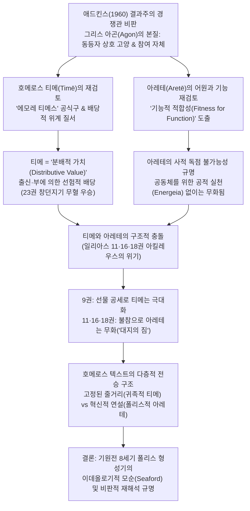
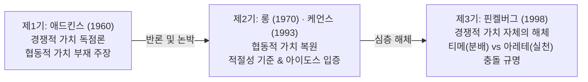

# 호메로스에게서의 티메와 아레테 (*Timē and Aretē in Homer* )

> [!NOTE] 학술사적 의의 및 총평
> 마르갈리트 핀켈버그(Margalit Finkelberg)의 1998년 논문 「호메로스에게서의 티메와 아레테」(*Timē and Aretē in Homer*, *The Classical Quarterly* 48)는 아서 애드킨스(A. W. H. Adkins, 1960) 이래 영미 고전학계를 지배해 온 '경쟁적 가치 대 협동적 가치' 2분법 모델의 전제를 가장 심층에서 논박한 기념비적 전환점이다. A. A. Long, H. Lloyd-Jones, D. L. Cairns 등 기존 비판자들은 호메로스 서사시에 협동적·도덕적 가치(xenia, aidos, dike)가 편재함을 입증하는 데 주력했으나, 애드킨스가 호메로스 사회의 핵심 동력으로 규정한 '경쟁적 가치(Timē와 Aretē)' 자체의 타당성은 의심하지 않았다. 핀켈버그는 그리스 경기(Athletic contest)의 본질인 '동등자 간 상호 탁월성 추구(Mutual emulation)'와 '참여 자체'의 규범을 조명하며, 호메로스 서사시의 명예(Timē)가 경쟁으로 쟁취되는 것이 아니라 선험적 위계에 따라 주어지는 '분배적 가치(Distributive value)'임을 밝혀낸다. 나아가 탁월성(Aretē)은 사적으로 독점될 수 없고 공동체를 위한 행위(Energeia)로만 실재할 수 있음을 규명하여, 『일리아스』 11·16·18권에서 아킬레우스가 겪는 실존적 위기가 바로 '분배적 티메의 극대화'와 '실천적 아레테의 무화' 사이의 구조적 충돌임을 입증한다. 이 연구는 호메로스 텍스트가 단일한 역사적 사회의 반영이 아니라, 기원전 8세기 폴리스 형성기 시인이 전통적 귀족주의 서사(Plot)를 새로운 시민적 연대 규범(Speeches)으로 재해석하며 발생한 '이데올로기적 모순'의 산물임을 해명한다.

---

## 1. 서지 정보 및 학술사적 배경

### 1.1 서지 정보 및 연구 방법론

- **저자**: 마르갈리트 핀켈버그 (Margalit Finkelberg) — 이스라엘 텔아비브 대학교(Tel Aviv University) 고전학 석좌교수. 고대 그리스 문학의 발흥사, 호메로스 구술 시학(Oral Poetics), 언어학적 인공어(Kunstsprache) 및 서사시 전승사 분야의 세계적 석학.
- **출판 정보**: *The Classical Quarterly*, New Series, Vol. 48, No. 1 (1998), pp. 14–28. (Cambridge University Press on behalf of The Classical Association, DOI: 10.1093/cq/48.1.14).
- **연구 대상 및 범위**: 『일리아스』 전체의 명예 갈등, 제9권 아킬레우스의 연설, 제11권 네스토르의 질책, 제16권 파트로클로스의 탄식, 제18권 아킬레우스의 자책, 제23권 장례 경기 및 호메로스 어휘·공식구 전수 분석.
- **연구 방법론**:
  - 그리스 문화 고유의 '아곤(Agōn, 경기)' 제도와 동등자 간 상호 탁월성 추구(Mutual emulation) 개념의 역사적 복원.
  - 호메로스 정형구(Formulaic diction) 전수 조사: 유일한 티메 공식구인 '에모레 티메스'(*émmore timês*, ἔμμορε τιμῆς) 및 아레테 공식구의 통사론적·어원론적 실증 분석.
  - 구술 서사시의 다층적 텍스트 편년론(Snodgrass의 복합체론, Osborne의 가치 수용론, Seaford의 이데올로기적 모순론)을 결합한 융합 문헌학.

### 1.2 학술사적 배경: 애드킨스 1960 모델과 롱 1970의 비판

고대 그리스 윤리학 연구사에서 호메로스 가치 체계의 성격을 규정하려는 시도는 20세기 중반 이후 두 축을 중심으로 전개되었습니다:

1. **도즈(E. R. Dodds, 1951)의 수치 문화 대 죄의식 문화**:
   - 도즈는 『그리스인들과 비합리적인 것』(*The Greeks and the Irrational*)에서 호메로스 사회를 타인의 시선과 공적 평판이 행위를 규율하는 대표적인 **수치 문화**(Shame-culture)로 규정했습니다.
2. **애드킨스(A. W. H. Adkins, 1960)의 경쟁적 가치 독점론**:
   - 애드킨스는 『공적과 책임』(*Merit and Responsibility*)에서 도즈의 논의를 확장하여, 호메로스 가치 체계를 ‘**경쟁적 가치(Competitive values)**’와 ‘**협동적/조용한 가치(Cooperative/quiet values)**’로 엄격히 양분했습니다.
   - 애드킨스에 따르면, 원시적이고 불안정한 호메로스 사회에서 공동체의 생존은 오직 전장에서의 승리와 물리적 성공에 달려 있었으므로, 성공과 실패만을 칭찬과 비난의 척도로 삼는 '경쟁적 가치'(*agathos, arete*)가 다른 모든 가치를 압도했습니다.
   - 반면 정의(*dike*), 절제(*sophrosyne*), 상호부조 같은 '협동적 가치'는 무력한 2차적 가치에 불과했으며, 협동적 가치가 도덕의 중심으로 부상한 것은 기원전 5세기 아테네 민주정 시대에 이르러서였다고 주장했습니다.
   - 이 애드킨스의 이분법은 알래스데어 매킨타이어(A. MacIntyre, 1984 『덕의 상실』) 등 현대 윤리학자들에게도 비판 없이 수용되며 정설처럼 통용되었습니다.
3. **롱(A. A. Long, 1970)을 위시한 1차 비판 운동**:
   - 앤서니 롱(A. A. Long 1970, 「호메로스의 도덕과 가치」)은 애드킨스가 고대 서사시에 근대 칸트주의적 '도덕적 의무'와 '책임'의 잣대를 투사했다고 날카롭게 비판했습니다.
   - 롱은 호메로스 영웅들이 군사적 동맹, 크세니아([[concept-xenia|Xenia]]), 친족에 대한 책무, 타인의 명예 존중 등 광범위한 협동적 의무에 묶여 있었으며, 이를 어길 경우 신적 분노와 사회적 비난을 받았음을 문헌학적으로 증명했습니다.
   - 이후 휴 로이드-존스(H. Lloyd-Jones 1971), 버나드 윌리엄스(B. Williams 1993), 더글러스 케언스(D. L. Cairns 1993), 그레이엄 잰커(G. Zanker 1994) 등이 가세하여 호메로스 사회에서 '협동적 가치'의 강력한 현존을 입증했습니다.

### 1.3 핀켈버그의 문제의식과 차별성

기존의 모든 반론은 "호메로스에게 협동적 가치가 결여되어 있다"는 애드킨스의 주장을 논박하는 데만 몰두했을 뿐, 애드킨스가 호메로스 윤리의 핵으로 규정한 ‘**경쟁적 가치'(*competitive values*)의 본질 자체**’는 의문시하지 않았습니다. 이는 베르너 예거(W. Jaeger 1965 『파이데이아』)와 M. I. 핀리(M. I. Finley 1954/1978 『오디세우스의 세계』)가 그려낸 "모든 영웅이 서로를 능가하기 위해 치열하게 경쟁하는 배타적 귀족 사회"라는 권위 있는 도식과 일치했기 때문입니다.

핀켈버그는 바로 이 합의 지점에 정면으로 도전합니다. 핀켈버그는 두 가지 근본적인 물음을 제기합니다:
- 호메로스의 중심 가치로 여겨져 온 **티메**(Timē)와 **아레테**(Aretē)는 과연 고대 그리스인들이 이해한 진정한 의미의 '경쟁적 가치'인가?
- 『일리아스』 서사 내에서 티메와 아레테는 과연 애드킨스의 가설처럼 조화롭게 공존하는가, 아니면 서로를 파괴하는 모순 관계에 있는가?

---

## 2. 개념 대조 매트릭스 및 논증 계보도

### 2.1 애드킨스 모델 vs 핀켈버그 모델 비교 매트릭스

| 분석 층위 | 애드킨스 (Adkins 1960) 모델 | 핀켈버그 (Finkelberg 1998) 대안 모델 |
|:---|:---|:---|
| **경쟁(Competition)의 본질** | 결과주의적 성공(Success) 최우선. 성공한 자에게만 찬사, 실패한 자에게는 비난 귀속 | **동등자 간 상호 탁월성 추구**(Mutual emulation of equals) 및 **참여 자체**(Participation as such)의 자격 |
| **사회적 전제 조건** | 상대를 압도하고 배제하려는 배타적 승자 독식 | **사회적 동등성**(Social equality) 필수. 노예나 절대 군주는 경쟁 대상이 아니므로 배제됨 |
| **티메([[concept-time\|Timē]])의 성격** | 치열한 전장과 시합에서 상대를 꺾고 쟁취하는 배타적 '**경쟁적 가치**' | 세습된 신분과 지위에 따라 선험적으로 할당받는 '**분배적 가치**'(Distributive value) |
| **티메의 결정 요인** | 개인의 실시간 군사적 업적과 무공 성과 | 탄생(Birth)과 부(Wealth)에 기초한 고정된 귀족적 위계 질서 |
| **아레테([[concept-arete\|Arete]])의 본질** | 적을 살상하고 승리하는 물리적 용맹(Prowess/Courage) | 존재의 본래 목적에 부합하는 '**기능적 적합성**'(Fitness for function) |
| **아레테의 실천 영역** | 사적 자부심으로 향유 가능한 개인의 내면적/영웅적 속성 | **사적 독점 불가능**. 오직 공동체를 위한 공적 실천(**에네르게이아**)을 통해서만 실재함 |
| **가치 간의 정합성** | 티메와 아레테는 최고의 영웅적 성공을 향해 완벽히 일치·조화됨 | 티메(분배적 위상)와 아레테(실천적 탁월성)는 **상호 양립 불가능한 구조적 충돌**을 일으킴 |
| **텍스트의 역사적 성격** | 단일한 초기 영웅 사회/암흑기의 일관된 도덕 보고서 | 수백 년 구술 전승의 합성물(Amalgam)이자, 기원전 8세기 폴리스 형성기의 **이데올로기적 모순** 반영 |

### 2.2 Mermaid 논증 구조도

---

## 3. 논문의 핵심 테제 및 섹션별 정밀 분석

### 제1절: 그리스 경쟁(Athletic contest)의 본질과 호메로스적 전장의 현실 (pp. 14–19)

#### 1. 애드킨스의 결과주의적 경쟁 정의 비판
애드킨스는 경쟁적 가치를 "어떤 사회에서든 성공이 가장 중요한 활동들이 존재하며, 여기서는 실제로 성공하거나 실패한 자들에게만 칭찬이나 비난이 유보된다"고 정의했습니다. 그러나 핀켈버그는 이 정의가 고대 그리스인들 자신이 이해했던 경쟁의 결정적 특징들을 전적으로 무시하고 있다고 지적합니다. 그리스인들의 경쟁 의식이 가장 순수하게 구현된 제도인 **운동 경기**(Athletic contest)를 살펴보면 다음 두 가지 핵심 요소가 드러납니다:

- **동등자 간의 상호 탁월성 추구(Mutual emulation of equals)**:
  - 그리스인들에게 경쟁이란 상대를 파괴하는 것이 아니라, 사회적 동등자들끼리 서로를 자극하여 인간이 도달할 수 있는 최고의 완성, 즉 시인들이 노래한 '**탁월성의 정점**'(ἄκρον ἀρετῆς, *ákron aretês*)에 도달하는 유일한 경로였습니다.
  - 플루타르코스는 『펠로피다스전』(19.4)에서 보이오티아 테베의 **신성대**(Sacred Band)를 논하며 이를 완벽히 설명했습니다:
    - 말이 혼자 달릴 때보다 한 쌍으로 마차를 끌 때 더 활기차게 달리는 것은 공기를 가르기가 더 쉬워서가 아니라, 서로 겨루면서 생기는 에뮬레이션(경쟁심)이 그들의 용기를 불태우기 때문입니다. 마찬가지로 용감한 전사들이 서로를 자극하여 고귀한 행동을 이끌어낼 때 공통의 대의에 가장 유용하고 결연해집니다.
  - 플라톤 역시 『향연』(*Symp.* 182bc)에서 동성 간의 우애, 철학, 체육(Gymnastics)이 덕의 완성으로 이끌며, 바로 그 상호 고양의 결속력 때문에 참주들이 가장 두려워하는 요소라고 지적했습니다.
  - 따라서 경쟁적 상호작용은 오직 **사회적 동등자들**(Social equals) 사이에서만 성립할 수 있습니다. 노예는 물론이고, 대등한 상대를 가질 수 없는 절대적 1인 통치자(참주) 역시 경쟁 상황에 참여할 수 없으므로 아레테를 청구할 자격이 원천 박탈됩니다.

- **참여 자체(Participation as such)의 절대적 가치**:
  - 그리스 경기에서는 승리 못지않게 '시합에 참여하는 것 자체'가 필수적이었습니다. 핀다로스는 올림피아와 피티아 제전에 출전하지 못한 테네도스의 아리스타고라스를 노래한 『네메아 제11가』(29–32행)에서, 참여하지 않은 자는 아무리 능력이 뛰어나도 '**아가토이**'(ἀγαθοί, 훌륭한 자들)의 반열에서 탈락한다고 선언했습니다.
  - 아리스토텔레스 역시 『니코마코스 윤리학』(1.8 1099a3–7)에서 인간의 삶을 올림피아 제전에 비유하며 이를 확증했습니다: "올림피아 제전에서 면류관을 쓰는 자는 가장 아름답고 강한 자가 아니라 '경기에 참가하여 겨루는 자'들이다. 마찬가지로 삶에서도 고귀하고 좋은 것들을 쟁취하는 자는 오직 '행위하는 자'들이다." (이 격언은 훗날 피에르 드 쿠베르탱의 올림픽 모토인 "올림픽에서 가장 중요한 것은 승리하는 것이 아니라 참여하는 것이다"로 계승되었습니다).

#### 2. 호메로스 명예(Timē)의 비경쟁적·분배적 실재
그렇다면 호메로스 서사시의 현실은 이러한 '경쟁적 가치'에 부합하는가? 핀리(M. I. Finley)는 명예가 본질적으로 배타적이거나 위계적이어서 모든 사람이 동등한 명예를 누릴 수 없으므로 호메로스 영웅들이 서로를 능가하기 위해 치열하게 경쟁했다고 보았습니다. 그러나 핀켈버그는 서사시 내에서 티메가 분배되는 실제 방식을 통해 이를 전면 반박합니다:

- **티메의 외적·물질적 성격과 수동성**:
  - 재스퍼 그리핀(Jasper Griffin, 1980)이 지적했듯, 호메로스 서사시에서 명예는 고기 상석의 부위, 선물, 영지([[concept-temenos|Temenos]]), 전리품 배당([[concept-geras|Geras]]) 같은 외적 징표와 분리될 수 없습니다.
  - 아리스토텔레스가 명예(Timē)를 탁월성(Aretē)보다 열등한 것으로 보며 "명예는 그것을 받는 자보다 그것을 베푸는 자에게 달려 있다"(*EN* 1.5 1095b23–24)고 갈파했듯이, 호메로스의 티메는 본질적으로 객관적 ‘**지위(Status)**’이자 ‘**위세(Prestige)**’입니다.
- **정형구 증거: '에모레 티메스'(*émmore timês*)**:
  - 호메로스 텍스트에서 명사 티메가 등장하는 유일한 고정 공식구는 ‘**에모레 티메스**’(ἔμμορε τιμῆς, *émmore timês*, "그/그녀는 명예의 몫을 배당받았다")입니다 (*Il.* 1.278, 15.189; *Od.* 5.335 등). 완료형 동사 *émmore*는 오직 이 공식구 문맥에서만 나타나며, 명예가 공정한 경쟁으로 획득되는 것이 아니라 운명의 몫(*moira*)처럼 사전에 배정되는 것임을 웅변합니다. 따라서 티메는 경쟁적 가치가 아니라 ‘**분배적 가치(Distributive value)**’입니다.
- **불균등한 분배와 아가멤논의 특권**:
  - 아킬레우스는 제9권에서 자신이 함선 12척으로 바다를 건너 11개 도시를 육로로 함락하여 모든 보물을 바쳤으나, 함선 곁을 떠나지 않은 아가멤논이 대부분을 독차지하고 부하들에게는 쥐꼬리만큼 나누어 주었다고 절규합니다 (*Il.* 9.328–333; 1.165–168).
- **제23권 장례 경기의 결정적 증거: 무혈 우승과 고정된 위계**:
  - 애드킨스는 파트로클로스의 장례 경기(23권) 전차 경주에서 꼴찌로 들어온 에우멜로스에게 아킬레우스가 '가장 훌륭한 자(*aristos*)'라는 이유로 1등 상을 주려 하고, 3위로 들어온 메넬라오스가 안틸로코스보다 신분상 '더 낫다'는 이유로 2등 상을 받는 장면을 보며 "가치의 절망적 뒤엉킴(a hopeless tangle of values)"이라고 탄식했습니다.
  - 그러나 핀켈버그는 애드킨스가 고의로 누락한 장례 경기의 최종 종목인 **창던지기 시합**(*Il.* 23.884–897)을 제시합니다:
    - 아가멤논과 메리오네스가 창던지기를 위해 일어서자, 아킬레우스는 "아트레우스의 아들이여, 우리는 그대가 완력과 창던지기에서 모든 이들 가운데 얼마나 최고의 영웅인지 알고 있소"라며 아가멤논에게 **시합을 치르지도 않고 1등 상을 수여**합니다. 아가멤논은 창을 한 번도 던지지 않고 무혈 우승을 거둡니다.
    - 손가락 하나 까딱하지 않고 시합을 이길 수 있는 사회를 어떻게 '경쟁적 가치의 구현체'라고 부를 수 있겠는가?
  - 호메로스 영웅들의 서열은 사전에 고정되어 있습니다. 아이아스는 아무리 전장에서 눈부신 무공을 세워도 영원히 2위에 머물러야 하며, 아킬레우스는 막사에서 아무것도 하지 않아도 여전히 '아카이아 최고의 영웅'입니다. 영웅이 진정으로 경쟁하는 유일한 무대는 오직 적군과의 1:1 결투(Single combat)뿐입니다.

#### 3. 노블레스 오블리주와 수치 문화
호메로스 영웅들을 사선으로 내모는 진정한 동력은 경쟁심이 아니라, 높은 신분에 따르는 사회적 책무인 **노블레스 오블리주**(Noblesse oblige)입니다:
- 사르페돈은 제12권(310–321행)에서 글라우코스에게 왜 자신들이 뤼키아에서 상석, 기름진 고기, 가득 찬 술잔, 광대한 영지를 누리는지 상기시킵니다. 그것은 남들을 이기기 위함이 아니라, 왕으로서 백성들의 기대에 부응하여 최전선에 서서 싸워야 할 의무 때문입니다.
- 헥토르가 아내의 눈물 어린 만류에도 불구하고, 또 군대가 궤멸한 뒤 확실한 죽음이 기다리는 아킬레우스와의 결투로 나아가는 까닭은 경쟁적 승리가 아니라, 트로이아 백성들에 대한 **아이도스**([[concept-aidos|Aidos]], 수치심) 때문입니다 (*Il.* 6.442, 22.105).
- 따라서 호메로스 사회는 애드킨스의 '경쟁 가치 사회'가 아니라, 신분적 지위에 따른 책무와 평판을 중시하는 도즈의 **수치 문화**(Shame-culture)로 규정하는 것이 훨씬 정확합니다.

---

### 제2절: 아레테(Aretē)의 어원 및 본질: '기능적 적합성(Fitness for function)'과 사적 독점 불가능성 (pp. 19–21)

#### 1. 호메로스적 격언의 허상과 에벨링 사전 분석
호메로스 윤리를 경쟁적으로 규정할 때 가장 자주 인용되는 구절은 펠레우스가 아킬레우스에게, 히폴로코스가 글라우코스에게 주었다는 유명한 가훈입니다:
- "언제나 최고가 되고 타인들보다 뛰어나라"(*aièn aristeúein kaì hypeírokhon émmenai állōn*, *Il.* 6.208, 11.784).

그러나 핀켈버그는 실제 호메로스 텍스트에서 **아레테**(Aretē)라는 단어가 사용되는 용례를 전수 조사하면 전혀 다른 양상이 드러난다고 지적합니다.
- 에벨링(Ebeling)의 『호메로스 사전』(*Lexicon Homericum*)에 등재된 아레테의 의미 범주는 다음과 같습니다:
  1. 탁월함, 수위(praestantia, principatus)
  2. 용기, 강인함(fortitudo)
  3. 일등, 최우선(primae)
  4. 성공, 번영(successus, salus, res secundae)
  5. 도덕적 덕, 인격적 고결함(virtus, morum probitas)
- 놀랍게도 에벨링이 제시한 5번(도덕적 덕)의 용례는 서사시 전체에서 단 1회, 즉 『오뒷세이아』 17권 322–323행("노예가 되는 날이 오면 천둥 치시는 제우스께서 그 사람의 아레테의 절반을 앗아가 버린다")뿐입니다. 호메로스에게서 아레테가 보편적인 '도덕적 덕'으로 쓰이는 경우는 극히 드뭅니다.

#### 2. '기능적 적합성(Fitness for function)'으로서의 아레테
호메로스 정형구에서 아레테는 주로 '온갖 종류의 아레테'(*pantoíās aretês*, παντοίας ἀρετῆς)라는 표현이나 구체적 특성들과 병렬되어 나타납니다:
- **말의 아레테**: 발빠름(Swiftness of foot)
- **토양의 아레테**: 비옥함(Fertility)
- **여성의 아레테**: 훌륭한 가사 능력 및 절개(Good housewife)
- **노예의 아레테**: 주인에 대한 충성심(Loyalty to master)
- **전사의 아레테**: 용기와 전투력(Bravery in war)

이 모든 용례를 관통하는 단 하나의 본질은 바로 ‘**기능적 적합성(Fitness for function)**’, 즉 특정 인간, 동물, 사물이 주어진 순간에 수행하도록 요구받는 고유한 기능을 얼마나 훌륭하게 완수하는가입니다.

#### 3. 폴리스적 인간관과의 결정적 차이
- **기원전 8세기 이후 폴리스(Polis) 체제**:
  - 도시국가의 대두와 함께 자유민 남성의 기능은 '시민(Polites)'으로서의 기능으로 수렴되었습니다.
  - 아리스토텔레스가 인간을 '**정치적 동물**(zōon politikon)'로 정의했을 때, 인간의 아레테는 바로 이 시민적 기능을 훌륭히 수행하는 도덕적·정치적 덕을 의미하게 되었습니다. 폴리스에서는 개인의 실천적 성취(Aretē)에 비례하여 명예(Timē)가 분배되어야 한다는 원칙이 수립되었습니다.
- **호메로스 서사시의 귀족 사회**:
  - 반면 호메로스 서사시에서 아레테는 신체적 힘이나 아름다움처럼 탄생과 부에 의해 선천적으로 주어지는 귀족적 혈통과 가문, 즉 ‘**가문/혈통(Breeding)**’에 가깝습니다.
  - 롱(A. A. Long 1970)이 밝혔듯, 아레테에 대응하는 형용사 **아가토스**([[concept-agathos|Agathos]]) 역시 도덕적 탁월성이 아니라 높은 사회적 신분을 지칭합니다.
  - 호메로스 사회에서는 개인의 성취(Aretē)가 명예를 낳는 것이 아니라, 신분과 위계(Timē)가 선험적으로 주어져 있었습니다. 따라서 경쟁적 가치를 호메로스 윤리의 중심에 놓는 것은 후대 폴리스의 가치관을 서사시에 투사한 **시대착오**(Anachronism)입니다.

---

### 제3절: 네스토르의 질책(Il. 11.762–763)과 파트로클로스의 탄식(Il. 16.29–35) (pp. 21–24)

#### 1. 제11권의 전황 악화와 네스토르의 결정적 발언
『일리아스』 제1권에서 제우스가 테티스에게 아킬레우스의 명예를 되찾아주겠다고 약속했으나, 실제 전장에서 아카이아 군대의 치명적 위기는 제11권에 이르러서야 본격화됩니다. 아가멤논, 디오메데스, 오디세우스 등 최정예 영웅들이 줄줄이 부상을 입고 전선을 이탈합니다. 함선에서 이를 지켜보던 아킬레우스는 네스토르가 싣고 가는 부상병의 신원을 확인하기 위해 파트로클로스를 보냅니다:
- "파트로클로스는 막사 안에서 그 말을 듣고 군신 아레스와도 같은 모습으로 나왔으니, 이것이 그의 파멸의 시작이었다"(*kakoû dé hoi pélen arkhḗ*, *Il.* 11.603–604).

네스토르는 파트로클로스에게 자신의 젊은 시절 영웅적 무공을 길게 늘어놓은 뒤, 아킬레우스의 태도를 준열히 꾸짖습니다:
- “**아킬레우스는 홀로 자신의 탁월함(아레테)을 누릴 것이오(*oîos tês aretês aponḗsetai*). 군대가 다 망하고 난 뒤에야 그가 오래도록 눈물 흘릴 것이라 생각하오.**” (*Il.* 11.762–764).

여기서 네스토르가 사용한 '아레테'는 단순한 전장의 용기(Prowess/Courage)로 번역될 수 없습니다. K. J. 도버(K. J. Dover, 1974)가 통찰했듯이, 궁지에 몰렸을 때 목숨을 걸고 싸우는 단순한 용기(Andreia, Tharsos, Alkē)와 달리, 진정한 아레테는 “**더 큰 시야를 가지고 타인을 위해, 혹은 자신이 속한 공동체 전체를 위해 목숨을 거는 의지(the will to take a larger view and risk life in fighting for others)**”를 포함합니다.

#### 2. 제16권 파트로클로스의 탄식과 통사론적 동의어
제16권 서두에서 울면서 돌아온 파트로클로스는 네스토르의 말을 그대로 이어받아 아킬레우스를 규탄합니다:
- “**먼 훗날 태어날 자인들 그대에게서 무슨 득을 보겠소(*tí seu állos onḗsetai opsígonós per*), 그대가 아르고스인들을 수치스러운 파멸에서 구하지 않는다면?**” (*Il.* 16.31–32).

핀켈버그는 두 구절의 완벽한 **통사론적 병행성**(Syntactic parallelism)에 주목합니다:
- 네스토르: *oîos tês aretês aponḗsetai* (동사 *aponḗsetai* + 소유격 *tês aretês*)
- 파트로클로스: *tí seu állos onḗsetai opsígonós per* (동사 *onḗsetai* + 소유격 *seu*)
- 동사 **오니나마이**((ἀπ)ονίναμαι, ~에서 이익을 얻다, 누리다)가 두 경우 모두 소유격과 결합하여 사용되었습니다.
- “**누군가의 아레테에서 득을 보다**”라는 표현과 “**그 사람에게서 득을 보다**”라는 표현은 완벽한 기능적 동의어입니다. 이는 아레테가 한 인격의 존재론적 정체성의 핵(The core of person's identity)을 이루고 있음을 증명합니다.

#### 3. 사적 독점 불가능성과 아레테의 무화(Annihilation)
아킬레우스는 제16권 97–100행에서 "모든 트로이아인과 아르고스인이 죽고 오직 우리 둘만이 살아남아 트로이아의 거룩한 성벽을 무너뜨릴 수 있다면!"이라는 극단적 개인주의를 표출합니다.
그러나 핀켈버그는 반문합니다: **아레테를 사적으로 소유하고 공동체를 위해 발휘하기를 거부할 때 그 아레테에는 무슨 일이 일어나는가?**
- 『일리아스』의 서사 전개는 명백한 답을 제공합니다: **그런 경우 아레테는 아예 소멸(Ceases to exist)합니다.**
- 제18권에서 파트로클로스의 전사 소식을 들은 아킬레우스는 처절한 자기인식에 도달합니다:
  - "나는 파트로클로스에게도 수많은 다른 전우들에게도 구원의 빛이 되지 못하고, 전쟁에서는 청동 갑옷을 입은 아카이아인들 가운데 그 누구에게도 뒤지지 않는 자이면서, 이렇듯 함선 곁에 앉아 **대지의 쓸모없는 짐**(ἐτώσιον ἄχθος ἀρούρης)이 되었구나." (*Il.* 18.104–106).
- 네스토르의 "홀로 자신의 아레테를 누린다", 파트로클로스의 "아무도 그대에게서 득을 보지 못한다", 아킬레우스 자신의 "대지의 쓸모없는 짐이 되었다"는 동일한 귀결을 가리킵니다: **아레테를 혼자서만 간직하려 한 결과, 아킬레우스는 자신의 아레테를 무화(Annihilated)시켰고, 최고 전사로서의 존재 이유 자체를 상실했습니다.**

#### 4. 철학적 선취: 플라톤과 아리스토텔레스
이 장면의 실존적 깊이는 고전기 철학자들에게 깊은 영감을 주었습니다:
- **플라톤 『소크라테스의 변명』(28cd)**:
  - 소크라테스는 법정에서 자신의 행동을 변호하며 『일리아스』 18권의 아킬레우스를 인용합니다. 소크라테스는 죽음의 위협 앞에서도 물러서지 않고, '비열한 자(*kakos*)'로 사는 것, 즉 자신의 지적·도덕적 아레테를 포기하고 침묵하는 것은 삶의 가치가 없다고 선언합니다.
- **아리스토텔레스 『니코마코스 윤리학』(1.8 1098b30–1099a7)**:
  - 아리스토텔레스는 덕을 단순한 '상태나 소유(Possession, *ktēsis / hexis*)'로 볼 것인가, 아니면 '사용이나 활동(Activity, *chrēsis / energeia*)'으로 볼 것인가를 엄격히 구분합니다.
  - 덕의 상태는 잠자는 자처럼 아무런 좋은 결과를 낳지 못해도 존재할 수 있지만, 활동하는 자는 반드시 훌륭하게 행위할 수밖에 없습니다.
  - 네스토르의 질책은 바로 아리스토텔레스의 **에네르게이아(ἐνέργεια, 현실태/활동)** 개념을 정확히 선취한 것입니다. 아레테는 발휘되지 않으면 잠재태에 머무는 것이 아니라, 존재 자체를 상실합니다.

---

### 제4절: 티메(Timē)와 아레테(Aretē)의 구조적 충돌 (pp. 24–25)

#### 1. 제9권의 역설: 티메의 극대화와 아레테의 추락
네스토르가 "펠레우스는 아들 아킬레우스에게 언제나 최고가 되고 타인들보다 뛰어나라고 훈계했다"(*Il.* 11.784)고 상기시켰을 때, 네스토르의 함의는 명백합니다: 아킬레우스는 아버지의 가훈을 따르지 않았다는 것입니다. 그는 행동하지 않음으로써 아레테를 실현하는 데 철저히 실패했습니다.

여기서 『일리아스』 전체를 관통하는 거대한 역설이 폭로됩니다:
- 제9권에서 아가멤논이 사절단을 통해 제안한 보상 목록은 천문학적이었습니다(황금 10달란트, 가마솥 20개, 말 12필, 레스보스 여인 7명, 브리세이스 반환, 트로이 함락 시 막대한 보물, 아가멤논의 사위 자격 및 비옥한 7개 도시 증여).
- **티메(분배적 가치)의 관점**: 아킬레우스가 막사에 주저앉아 전혀 싸우지 않았음에도 불구하고, 그의 티메는 손상되기는커녕 **서사시 역사상 전례 없는 최고치로 극대화**되었습니다!
- **아레테(기능적 실천)의 관점**: 그러나 전장에 참여하여 동등자들과 경쟁하지 않고 공동체를 구하지 않음으로써, 그의 아레테는 **완전한 영(0)으로 추락**하여 '대지의 쓸모없는 짐'으로 전락했습니다.

#### 2. 화해 불가능한 이율배반
애드킨스처럼 티메와 아레테를 동일한 '경쟁적 가치'의 동의어로 취급하는 것은 치명적인 오류입니다:
- 아무런 행동도 하지 않고 가만히 앉아서 최고의 명예(티메)를 상납받는 자는 결코 실천을 통해서만 증명되는 아레테의 소유자가 될 수 없습니다 (*EN* 1.5 1095b26–30 참조).
- 따라서 『일리아스』 11·16·18권에서 분출하는 **아레테의 추구**와, 서사시 나머지 부분 전체를 지배하는 **티메의 추구**는 **구조적으로 상호 배타적이며 양립 불가능**(Mutually irreconcilable)합니다.
- 이 두 가치가 하나의 서사시 안에 공존한다는 사실은, 호메로스 서사시의 역사적 전승 층위(Historical background)를 분석하지 않고는 결코 해명될 수 없습니다.

---

### 제5절: 호메로스 서사시의 '이데올로기적 모순'(Seaford)과 전승층(Kunstsprache, Osborne) (pp. 25–28)

#### 1. 호메로스 사회의 역사적 층위 논쟁
현대 고전학계에서 호메로스 사회의 역사적 배경에 대한 평가는 급격한 패러다임 전환을 겪었습니다:
- 슐리만의 발굴 이후 유행했던 **미케네 청동기 문명 반영론**은 선문자 B의 해독과 구술 공식구의 유연성 연구로 완전히 폐기되었습니다.
- 핀리(M. I. Finley)가 제안한 **암흑기(기원전 1100–800년) 사회론** 역시 이언 모리스(Ian Morris)와 쿠르트 라플라우프(Kurt Raaflaub)의 지적처럼, 구술 전승이 200년 전의 사회를 화석처럼 보존할 수 없다는 비판에 직면했습니다.
- 프리츠 그슈니처(F. Gschnitzer)와 리처드 시포드(R. Seaford) 등 현대 학자들은 서사시의 역사적 배경을 시인이 활동했던 **기원전 8세기, 즉 초기 폴리스 형성기**(Early stage of state-formation)로 비정합니다.

#### 2. 스노드그래스의 '합성물(Amalgam)' 테제와 언어학적 유비
그러나 서사시의 모든 내용이 기원전 8세기의 일관된 역사적 사회를 반영한다고 볼 수는 없습니다:
- A. M. 스노드그래스(A. M. Snodgrass, 1974)는 서사시 내에 모순되는 사회 제도들이 병존함을 지적하며, 호메로스 텍스트가 단일한 역사적 사회의 반영이 아니라 수백 년에 걸친 구술 전승의 ‘**합성물(Amalgam)**’이라고 주장했습니다.
- 도로시아 그레이(Dorothea Gray, 1947)가 입증했듯이, 호메로스의 언어는 여러 시대와 방언이 뒤섞인 **인공어**(Kunstsprache)이며, 영웅들의 무기 묘사는 청동기 방패와 철기 칼 등 서로 다른 시대의 군사 기술이 불가능하게 결합되어 있습니다.
- 로빈 오즈번(Robin Osborne, 1996)은 "서사시의 물질세계와 제도가 비역사적 복합체라면, 서사시가 탐구하는 가치 체계 역시 당대 청중의 가치와 공명하고 이를 조명해야 한다"고 지적했습니다.

#### 3. 시포드의 '이데올로기적 모순'과 핀켈버그의 해법
리처드 시포드(Richard Seaford, 1994)는 호메로스 서사시가 체현하는 핵심 갈등을 ‘**이데올로기적 모순(Ideological contradiction)**’으로 규정했습니다:
- “**귀족적 개인주의는 한편으로는 공동체에 사활적으로 필수적이면서, 다른 한편으로는 공동체에 의해 통제되어야 할 위험이다.**”

핀켈버그는 이 통찰을 구술 시학의 본질과 결합하여 한 걸음 더 진전시킵니다:
- **고정된 줄거리(Traditional Plot)**:
  - 영웅 시대의 전통 신화는 대중에게 역사적 진실로 확고히 각인되어 있었으므로 시인이 마음대로 바꿀 수 없었습니다(트로이아의 패망, 아킬레우스의 분노와 철수, 헥토르의 죽음 등). 이 줄거리는 과거 암흑기 귀족들의 배타적 '분배적 티메 질서'를 보존하고 있습니다.
- **혁신적인 연설(Inventive Speeches)**:
  - 반면 등장인물들의 직접 화법 연설은 전통에 고정되지 않고 시인의 개성적인 어휘 혁신과 당대적 문제의식이 자유롭게 분출하는 장이었습니다 (G. P. Shipp, J. Griffin 등의 연구).
- **기원전 8세기 시인의 비판적 재해석**:
  - 따라서 호메로스 서사시는 전통적인 줄거리와 시인 자신의 당대적 시각이라는 ‘**이중의 관점(Two perspectives)**’을 동시에 전달합니다.
  - 제14권 364–369행에서 변장한 포세이돈은 아킬레우스가 없어도 "우리 서로가 서로를 지켜준다면(ἀμυνέμεν ἀλλήλοισιν, *amynémen allḗloisin*)" 승리할 수 있다고 병사들을 독려합니다. 제3권 8–9행에서 아카이아 군대는 "서로를 도우려는 일념으로(ἀλεξέμεναι μεμαῶτες ἀλλήλοισιν)" 침묵 속에 전진합니다. 이는 호메로스 전사들의 개인주의가 아니라 티르타이오스(Tyrtaeus)가 찬양한 **중장보병 팔랑크스(Hoplite phalanx)의 집단적 연대 정신**에 가깝습니다.
  - 결론적으로, 『일리아스』의 핵심 장면인 제11·16·18권에서 네스토르와 파트로클로스의 입을 빌려 아킬레우스의 행동을 비판한 것은, **기원전 8세기 폴리스 형성기의 시인이 부상하는 시민적 아레테(공동체를 위한 공적 실천)의 기준을 적용하여, 전통 서사시의 귀족적 티메 추구를 비판적으로 재해석(Overall reinterpretation)하려 시도한 결과**입니다.

---

## 4. 호메로스 원문 및 전승 비교 인용구

### 4.1 네스토르의 질책: 사적 아레테 향유의 모순 (*Il.* 11.762–764)

- **번역**: "내가 인간들 사이에 있었을 때 바로 그런 사람이었지. 하지만 아킬레우스는 홀로 자신의 탁월함(아레테)을 누릴 것이오. 군대가 망하고 난 뒤에야 그가 오래도록 눈물 흘릴 것이라 생각하오."
- **원문**: "ὡς ἔον, εἴ ποτ’ ἔον γε, μετ’ ἀνδράσιν· αὐτὰρ Ἀχιλλεὺς οἶος τῆς ἀρετῆς ἀπονήσεται· ἦ τέ μιν οἴω πολλὰ μετακλαύσεσθαι, ἐπεί κ’ ἀπὸ λαὸς ὄληται."
- **학술 전사**: *hōs éon, eí pot’ éon ge, met’ andrásin; autàr Akhilleùs oîos tês aretês aponḗsetai; ê té min oíō pollà metaklaúsesthai, epeí k’ apò laòs ólētai.*
- **[주석]**: 네스토르는 '홀로 누린다'(*oîos aponḗsetai*)라는 표현을 통해 아레테가 본질적으로 사적 소유물이 될 수 없음을 역설합니다. 공동체가 궤멸한 상태에서 홀로 보존한 무용은 아무런 가치도 낳지 못합니다.

### 4.2 파트로클로스의 탄식: 인격과 아레테의 기능적 동일성 (*Il.* 16.29–32)

- **번역**: "그러나 아킬레우스여, 그대는 다루기가 불가능하구려. 그대가 품고 있는 그런 분노에 내가 사로잡히지 않기를! 파멸적인 자부심이여, 그대가 아르고스인들을 수치스러운 파멸에서 구하지 않는다면, 먼 훗날 태어날 자인들 그대에게서 무슨 득을 보겠소?"
- **원문**: "αἰνοπαθῆ· μὴ ἐμέ γ’ οὖν οὗτός γε λάβοι χόλος, ὃν σὺ φυλάσσεις, αἰναρέτη· τί σευ ἄλλος ὀνήσεται ὀψίγονός περ, αἴ κε μὴ Ἀργείοισιν ἀεικέα λοιγὸν ἀμύνῃς;"
- **학술 전사**: *ainopathê; mḕ emé g’ oûn hoûtós ge láboi khólos, hòn sù phylásseis, ainarétē; tí seu állos onḗsetai opsígonós per, aí ke mḕ Argeíoisi aeikéa loigòn amýnēis;*
- **[주석]**: 네스토르의 구절(*tês aretês aponḗsetai*)과 파트로클로스의 구절(*tí seu állos onḗsetai*)은 완전한 통사론적 동의어로 기능합니다. 타인과 후대에 유익을 주지 못하는 영웅은 실존적 존재 이유(*raison d'être*)를 상실합니다.

### 4.3 아킬레우스의 처절한 자책: 대지의 쓸모없는 짐 (*Il.* 18.104–106)

- **번역**: "이제 나는 사랑하는 고향 땅으로 돌아가지 못할 것이며, 파트로클로스에게도 고결한 헥토르에게 쓰러져간 수많은 전우에게도 구원의 빛이 되지 못하고, 전쟁에서는 청동 갑옷을 입은 아카이아인들 가운데 그 누구에게도 뒤지지 않는 자이면서, 이렇듯 함선 곁에 앉아 대지의 쓸모없는 짐이 되었구나."
- **원문**: "ἀλλ’ ἧμαι παρὰ νηυσὶν ἐτώσιον ἄχθος ἀρούρης, τοῖος ἐὼν οἷος οὔ τις Ἀχαιῶν χαλκοχιτώνων ἐν πολέμῳ· ἀγορῇ δέ τ’ ἀμείνονές εἰσι καὶ ἄλλοι."
- **학술 전사**: *all’ hêmai parà nēusìn etṓsion ákhthos aroúrēs, toîos eṑn hoîos oú tis Akhaiôn khalkokhitṓnōn en polémōi; agorêi dé t’ ameínonés eisi kaì álloi.*
- **[주석]**: 전투력에서 타의 추종을 불허하는 최고 영웅(*toîos eṑn hoîos oú tis*)이라 할지라도, 동료를 구원하는 실천(행위)을 하지 않는 순간 존재론적 무(無)인 '대지의 쓸모없는 짐'(*etṓsion ákhthos aroúrēs*)으로 전락한다는 고백입니다.

### 4.4 동등한 몫과 동등한 명예에 대한 환멸 (*Il.* 9.318–319)

- **번역**: "진지에 머무는 자에게도 격렬히 싸우는 자에게도 똑같은 몫이 돌아오며, 비겁자나 용사나 동등한 명예(티메)를 받는다."
- **원문**: "ἴση μοῖρα μένοντι, καὶ εἰ μάλα τις πολεμίζοι· ἐν δὲ ἰῇ τιμῇ ἠμὲν κακὸς ἠδὲ καὶ ἐσθλός."
- **학술 전사**: *ísē moîra ménonti, kaì ei mála tis polemízoi; en dè iêi timêi ēmèn kakòs ēdè kaì esthlós.*
- **[주석]**: 아킬레우스는 명예(Timē)가 공적과 무공에 비례하지 않고 군주 아가멤논의 자의적 분배와 신분 위계에 따라 주어지는 현실의 모순을 고발합니다.

### 4.5 창던지기 시합에서 아가멤논의 무혈 우승 (*Il.* 23.890–894)

- **번역**: "아트레우스의 아들이여, 우리는 그대가 모든 이들보다 얼마나 뛰어난지, 창던지기의 완력에서 그대가 얼마나 최고인지 잘 알고 있소. 그러니 이 솥은 그대의 상으로 취하여 속이 빈 함선으로 가져가시오."
- **원문**: "Ἀτρεΐδη, ἴδμεν γὰρ ὅσον προβέβηκας ἁπάντων ἠδ’ ὅσσον σθένεΐ τε καὶ ἤμασι φέρτατός ἐσσι, τοὔνεκα τοῦτο μὲν ἄεθλον ἔχων κοίλας ἐπὶ νῆας"
- **학술 전사**: *Atreḯdē, ídmen gàr hóson probébēkas hapántōn ēd’ hósson sthéneḯ te kaì ḗmasi phértatós essi, toúneka toûto mèn áethlon ékhōn koílas epì nêas*
- **[주석]**: 시합을 시작하기도 전에 신분상의 최고자라는 선험적 이유로 1등 상을 배정받는 이 장면은, 호메로스의 티메가 실력 경쟁의 결과가 아니라 세습된 지위의 확인임을 가장 극명하게 보여줍니다.

### 4.6 사르페돈의 노블레스 오블리주와 배당된 지위 (*Il.* 12.310–315)

- **번역**: "글라우코스여, 어찌하여 우리 두 사람은 뤼키아에서 높은 자리와 고기와 잔으로 가장 높은 존경을 받고, 신들처럼 우러러보임을 받으며, 크산토스 강가에 기름진 포도밭과 밀밭의 넓은 영지를 차지하고 있는가? 그러므로 우리는 지금 뤼키아인들의 전열 맨 앞에 서서 타오르는 전투를 마주해야 하네."
- **원문**: "Γλαῦκε, τίη δὴ νῶϊ τετιμήμεσθα μάλιστα ἕδρῃ τε κρέασίν τε ἰδὲ πλείoις δεπάεσσιν ἐν Λυκίῃ, πάντες δὲ θεοὺς ὣς εἰσορόωσι, καὶ τέμενος νεμόμεσθα μέγα Ξάνθοιο παρ’ ὄχθας, καλὸν φυταλιῆς καὶ ἀρούρης πυροφόροιο; τὼ νῦν χρὴ Λυκίοισι μέτα πρώτοισιν ἐόντας"
- **학술 전사**: *Glaûke, tíē dḕ nôï tetimḗmestha málista hédrēi te kréasín te idè pleíois depáessin en Lykíēi, pántes dè theoùs hṑs eisoróōsi, kaì témenos nemómestha méga Xánthoio par’ ókhthas, kalòn phytaliês kaì aroúrēs pyrophóroio; tṑ nûn khrḕ Lykíoisi méta prṓtoisin eóntas*
- **[주석]**: 사르페돈의 참전 동기는 경쟁적 승리의 갈망이 아니라, 공동체로부터 이미 분배받은 특권(Timē)에 상응하는 의무를 완수하려는 사회계약적 책임감입니다.

---

## 5. 호메로스 위키 연계 및 연구사적 함의

### 5.1 호메로스 윤리학 3단계 학술 논쟁의 종결자

마르갈리트 핀켈버그의 1998년 논문은 고전학계의 호메로스 윤리학 논쟁에서 결정적인 제3의 도약을 이룩했습니다:

1. **제1기 (애드킨스 1960)**: 칸트적 도덕관에 입각하여 호메로스 사회를 배타적이고 결과주의적인 '경쟁적 가치'만의 세계로 규정함.
2. **제2기 (롱 1970, 케언스 1993, 윌리엄스 1993)**: 서사시 내에 '협동적 가치'와 사회적 수치심, 상호부조의 규범이 엄존함을 입증하여 애드킨스의 결함론을 분쇄함. 그러나 '경쟁적 가치' 자체의 지배력은 온존시킴.
3. **제3기 (핀켈버그 1998)**: 그리스 고유의 경쟁 개념을 통해 애드킨스가 상정한 '경쟁적 가치'의 허구성을 폭로함. 명예([[concept-time|Timē]])는 경쟁이 아닌 '분배'의 산물이며, 탁월성([[concept-arete|Arete]])은 사유화될 수 없는 '공적 실천'임을 밝힘으로써, 아킬레우스의 비극을 '두 가치 간의 내적 모순'이자 '기원전 8세기 폴리스적 가치에 의한 전통 서사의 비판적 재해석'으로 완결함.

### 5.2 핵심 위키 개념들과의 교차 분석망

- **[[concept-time|티메 (Timē)]]**:
  - 핀켈버그는 티메가 결코 경쟁적 승패로 획득되는 내면적 자부심이 아니라, 탄생과 부, 신분적 서열에 따라 사전에 몫으로 주어지는 **분배적 가치**(Distributive value)이자 외적 지위(Status)임을 확립했습니다.
  - 이는 장클로드 리댕제([[riedinger-1976-la-time-chez-homere|Riedinger 1976]])의 객관적 사회 질서 테제와 직결되며, 제9권에서 아킬레우스의 티메가 물질적 보상 제안으로 극대화되는 역설을 설명하는 열쇠가 됩니다.
- **[[concept-arete|아레테 (Arete)]]**:
  - 아레테는 사적 소유물(Ktēsis/Hexis)이 아니라 공동체를 향한 현실적 기능 수행(**에네르게이아**)으로만 존립할 수 있습니다.
  - 홀로 막사에서 누리는 아레테는 아레테의 부재이자 자기 파멸을 초래합니다. 이는 호메로스 서사시가 훗날 아리스토텔레스 덕론의 핵심 구분을 서사적으로 선취하고 있음을 증명합니다.
- **[[concept-agathos|아가토스 (Agathos)]]**:
  - 호메로스에게서 *agathos*는 도덕적 선함이 아니라 귀족적 신분(Breeding)을 나타내며, 시합에 참여하는 행위 자체를 통해 끊임없이 입증되어야 하는 역동적 범주입니다.
- **[[concept-aidos|아이도스 (Aidos)]]**:
  - 영웅들을 전장으로 이끄는 궁극적 동력은 경쟁심이 아니라 지위에 따르는 공적 평판과 책무를 다하지 못했을 때 발생하는 수치심(Aidos)입니다. 이는 더글러스 케언스([[cairns-1993-aidos|Cairns 1993]]) 및 버나드 윌리엄스([[williams-1993-shame-and-necessity|Williams 1993]])의 수치 문화 복원론과 완벽한 일치를 이룹니다.

---

## 관련 항목

- **핵심 개념**:
  - [[concept-time|티메 (Time)]] — 선험적 신분과 위계에 따라 할당되는 분배적 가치
  - [[concept-arete|아레테 (Arete)]] — 사적 독점이 불가능한 기능적 적합성과 공적 실천 탁월성
  - [[concept-agathos|아가토스 (Agathos)]] — 귀족적 혈통과 신분적 탁월자의 지위
  - [[concept-aidos|아이도스 (Aidos)]] — 사회적 책무와 노블레스 오블리주를 규율하는 수치심
  - [[concept-geras|게라스 (Geras)]] — 티메를 가시적으로 증명하는 명예로운 전리품
  - [[concept-moira|모이라 (Moira)]] — 우주와 인간 사회의 몫과 배당 질서
  - [[concept-kleos|클레오스 (Kleos)]] — 사후 불멸의 명성과 전장에서 쟁취하는 영광
  - [[concept-xenia|크세니아 (Xenia)]] — 손님 환대와 상호부조의 협동적 규범
  - [[concept-menis|메니스 (Menis)]] — 분배 질서 파괴에 맞선 아킬레우스의 우주적 분노

- **핵심 인물**:
  - [[entity-achilles|아킬레우스 (Achilles)]] — 분배적 티메의 극대화 속에서 실천적 아레테를 상실하고 '대지의 짐'으로 전락한 비극적 영웅
  - [[entity-agamemnon|아가멤논 (Agamemnon)]] — 선험적 최고 군주로서 시합 없이도 1등 상을 받는 분배적 티메의 체현자
  - [[entity-nestor|네스토르 (Nestor)]] — 아킬레우스의 사적 아레테 독점을 질책하며 아리스토텔레스적 에네르게이아를 선취한 원로
  - [[entity-patroclus|파트로클로스 (Patroclus)]] — 아킬레우스의 정체성 그 자체인 아레테를 공적으로 실현하려다 희생된 전우
  - [[entity-hector|헥토르 (Hector)]] — 경쟁적 승리가 아니라 공동체에 대한 아이도스(수치심)로 결투에 나선 트로이아 총사령관
  - [[entity-sarpedon|사르페돈 (Sarpedon)]] — 최고의 물질적 배당에 상응하는 노블레스 오블리주를 선언한 뤼키아의 군주

- **연관 학술 문헌**:
  - [[adkins-1960-merit-and-responsibility|A. W. H. 애드킨스 (1960), 공적과 책임]] — 핀켈버그가 정면으로 비판한 경쟁적 가치 2분법 모델
  - [[long-1970-morals-and-values|A. A. 롱 (1970), 호메로스의 도덕과 가치]] — 애드킨스 비판의 효시이자 적절성 기준을 제시한 논문
  - [[cairns-1993-aidos|더글러스 케언스 (1993), 아이도스]] — 호메로스 도덕심리학과 수치심의 억제 구조 분석
  - [[dodds-1951-greeks-and-irrational|E. R. 도즈 (1951), 그리스인들과 비합리적인 것]] — 호메로스 수치 문화(Shame-culture) 이론의 정초
  - [[riedinger-1976-la-time-chez-homere|장클로드 리댕제 (1976), 호메로스에게서의 티메]] — 티메가 객관적 사회 질서임을 밝혀 핀켈버그 모델을 선취한 연구
  - [[williams-1993-shame-and-necessity|버나드 윌리엄스 (1993), 수치심과 필연성]] — 칸트주의적 편견을 넘어 호메로스적 인간관과 행위성을 복원한 철학적 고찰
  - [[zanker-1994-heart-of-achilles|그레이엄 잰커 (1994), 아킬레우스의 마음]] — 아킬레우스의 윤리적 변모와 파트로클로스 전사 전후의 도덕적 전환 분석
