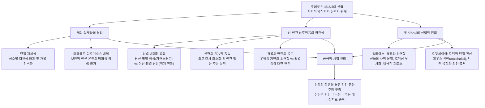

# 호메로스 서사시의 신들 (*The Gods in the Homeric Epics*)

> [!NOTE] 학술사적 의의 및 총평
> 에밀리 컨스(Emily Kearns)의 논문 「호메로스 서사시의 신들」(The Gods in the Homeric Epics, 2006)은 케임브리지 대학교 출판부의 호메로스 안내서(The Cambridge Companion to Homer) 제5장으로 발표된 권위 있는 총론입니다. 컨스는 역사적 그리스 제의(Cult)에서의 국지적·다원적 신격과 서사시 안에서 극도로 개별화된 단일 인격 신들의 근본적 괴리를 규명하고, 데메테르와 디오뉘소스가 일리아스에서 배제된 시학적 필연성을 통찰했습니다. 또한 신과 인간의 성적 결합에서 나타나는 성별 비대칭성(남신-여간 인간 결합의 용인 대 여신-남간 인간 결합의 위계 전복), 그리고 일리아스의 초연하고 분열된 신들에서 오뒷세이아의 도덕적 단일 전선으로의 신학적 전환을 명쾌하게 밝혔습니다. 궁극적으로 시인이 만족스러운 신학을 희생시켜 가면서까지 인간의 영웅적 고투와 비극적 파토스를 극대화하기 위해 신들을 서사적 대비 장치로 종속시켰음을 논증했습니다.

---

## 1. 서지 정보 및 학술사적 맥락

- **저자**: 에밀리 컨스 (Emily Kearns) — 옥스퍼드 대학교 세인트 힐다스 칼리지 고전문헌학 연구원 및 강사, 고대 그리스 종교 및 아티카 영웅 숭배 연구의 세계적 권위자(*The Cult of Heroes in Ancient Attica*, *Ancient Greek Religion: A Sourcebook* 등 저술).
- **출판 정보**: Robert Fowler (ed.), *The Cambridge Companion to Homer*, Cambridge University Press, 2004 (online 2006), Chapter 5, pp. 59–73.
- **연구 방법론**:
  - 역사적 제의(Historical Cult)와 서사시적 양식화(Epic Stylization)의 문헌학적·종교사적 비교 분석.
  - 서사학(Narratology): 시인의 전지적 시점(Omniscient Perspective)과 신적 인과성(Causation), 이중 동기화(Double Motivation)의 서사적 기능 분석.
  - 비교신화학 및 젠더적 위계 분석: 신-인간 성적 결합의 비대칭성과 영웅 혈통의 존재론적 긴장 규명.
  - 두 서사시 간의 신학 비교: *일리아스*의 당파적·경쟁적 판테온과 *오뒷세이아*의 도덕화된 단일 판테온의 비교.
- **학술사적 계보 및 주요 학설과의 대화**:
  - **이중 동기화 이론 계승**: 알빈 레스키(Albin Lesky 1961), E. R. 도즈([[dodds-1951-greeks-and-irrational|Dodds 1951]]), M. M. 윌콕(Willcock 1970)의 이중 동기화 및 과잉결정(Over-determination) 테제를 수용.
  - **종교사적 배경**: 발터 부르케르트(Walter Burkert 1985)의 그리스 종교론 및 아레스-아프로디테 간통가 분석(Burkert 1960)과의 긴밀한 연계.
  - **문학적 실재론 대 대립설**: 재스퍼 그리핀(Jasper Griffin 1980)의 '신들의 실재성' 옹호론, 마크 에믈린-존스(Emlyn-Jones 1992)와 이를 비판적으로 보는 차가라키스(Tsagarakis 1977), 에릅제(Erbse 1986)의 논쟁을 중재.
  - **정의(Dike)와 신정론 논쟁**: 휴 로이드-존스([[lloyd-jones-1971-justice-of-zeus|Lloyd-Jones 1971/1983]])의 '제우스의 정의' 테제와 윈터바텀(Winterbottom 1989), 야마가타 나오코(Naoko Yamagata 1994)의 서사시 도덕론 비판적 종합.

---

## 2. 핵심 테제 매트릭스 및 개념 구조도

### [핵심 테제 매트릭스]

| 분석 층위 | 역사적 종교 제의 (Cult Practice) | 호메로스 서사시의 형상화 (Epic Presentation) | 시학적·서사적 의의 |
|:---|:---|:---|:---|
| **신들의 개체성** | 지역 성소별 다원적 신격 ("이곳의 아폴론", "저곳의 아폴론") | 유일무이하고 명확히 규정된 단일 개체 ("두 명의 아폴론은 없다") | 영웅들과 대등한 서사적 행위자(Equipollent Characters) 구축 |
| **판테온 구성** | 데메테르·디오뉘소스 등 풍요·농경·입무 제의의 중심성 | 데메테르·디오뉘소스 철저 배제, 올림포스 전사·귀족 신 중심 | 전 인류의 보편적 은인은 전쟁의 당파적 편들기(Partisanship)가 불가능함 |
| **공간성과 신체** | 편재하는 신적 권능, 초월적 임재 신앙 | 전차·비행 등 초고속 이동하나 공간적 제약 및 인지 한계 노출 | 인간화된 한계를 부여하여 신들의 부재를 통한 서사 전개 공간 확보 |
| **신-인간 결합** | 신화적 조상 전승, 신비주의적 합일 | 남신-인간 여성 결합(허용) 대 여신-인간 남성 결합(위계 전복 금기) | 테티스-펠레우스 결합의 역설과 아킬레우스의 비극적 독보성 창출 |
| **신들의 도덕성** | 정의와 보은의 수호자, 정기적 제의의 대상 | 일리아스: 사적 편애와 명예 다툼, 경멸과 연민 / 오뒷세이아: 도덕적 단일 전선 | 일리아스는 신학을 희생시켜 영웅 비극 부각, 오뒷세이아는 도덕 질서 회복 |

### [Mermaid 개념 구조도]

---

## 3. 섹션별 정밀 분석

### 제1절: 서사적 인과성과 시인의 전지적 시점 (pp. 59–60)
- **문학 요약 파티 게임의 역설**:
  - 현대의 파티 게임처럼 호메로스 서사시에서 신들의 역할을 전부 제거하고 줄거리만 요약한다 해도, 아킬레우스의 분노로 인한 파국이나 오디세우스의 20년 방랑이라는 골격 자체는 설명 가능합니다. 그러나 이는 원작의 본질적 정신(spirit)과 정면으로 충돌합니다.
  - 서사시 자체의 총괄적 요약은 신들의 행위를 사건의 궁극적 동인으로 규정합니다. "제우스의 뜻이 이루어졌도다"(*Il.* 1.5), "신이 그들에게서 귀향의 날을 빼앗았도다"(*Od.* 1.9), "어느 신이 그들을 다투게 하였는가?"(*Il.* 1.8). 투키디데스 이전까지 신적 개입이 배제된 지속적 역사 서사는 존재하지 않았습니다.
- **이중 동기화(Double Motivation)와 책임**:
  - 신이 사건을 일으킨다는 인과관념이 인간의 책임을 완전히 면제하는 것은 아닙니다. 동일한 사건이 신적 원인과 인간적 동기 양쪽 모두에 의해 동시에 결정되는 '과잉결정(Over-determination)' 구조가 호메로스 서사의 기본 틀입니다.
- **시인의 대담한 전지적 시점**:
  - 헤로도토스의 추상적인 '신적인 것(the divine)'과 달리 호메로스의 신들은 인간 행위자와 완전히 대등한 자격으로 서사에 개입하는 구체적 인격들입니다.
  - 시인은 인간이 결코 알 수 없는 신들의 내밀한 회의와 대화를 생생하게 기술합니다. 예컨대 *오뒷세이아* 12권에서 헬리오스가 제우스에게 오디세우스 부하들의 처벌을 요구하는 장면을 오디세우스가 1인칭으로 서술할 때, 시인은 급히 "나중에 칼립소에게 들었고 칼립소는 헤르메스에게 들었다"(*Od.* 12.374–390)는 해설을 끼워 넣습니다. 이는 시인이 뮤즈를 매개로 신들의 영역을 직접 꿰뚫어보는 전지적 시점을 주장하고 있음을 보여줍니다.

### 제2절: 일리아스의 신들: 누구이며 어디에 있는가? (pp. 60–63)
- **올림포스 신들의 사회와 거처의 다원성**:
  - 1권에서 아폴론, 아테나, 헤라, 제우스, 헤파이토스가 등장하며, 이들은 올림포스에 거처를 둔 하나의 사회를 형성합니다. 테티스처럼 바다 깊은 곳에 살면서 올림포스를 방문하는 신도 있고, 포세이돈은 바다의 군주이면서도 올림포스에서 상당한 시간을 보냅니다.
  - 하데스와 페르세포네는 지하세계에만 머물며 전면에 등장하지 않습니다. 지하세계는 영웅들의 최종 목적지일 뿐 결코 직접 탐구되지 않으며, 타르타로스가 열리면 다른 신들조차 전율합니다(*Il.* 20.62–65).
- **데메테르와 디오뉘소스가 배제된 시학적 이유**:
  - 두 신은 서사시 본문에서 언급되므로 당시 청중에게 결코 낯선 신들이 아니었습니다. 그럼에도 서사의 중심 행동에서 철저히 배제된 이유는, 이들의 본질적 성격이 서사시의 전쟁 줄거리와 양립할 수 없었기 때문입니다.
  - 헤라, 아테나, 포세이돈은 특정 도시의 수호신(poliouchoi)이며, 아폴론과 아르테미스는 소아시아 본토와 강한 유대를 가집니다. 따라서 이들은 특정 인간 공동체를 편애하며 당파성(Partisanship)을 띠고 싸울 수 있습니다.
  - 반면 데메테르와 디오뉘소스는 농경과 포도재배의 혜택을 전 인류에게 전파하는 '보편적 인류의 은인(benefactors of humanity in general)'입니다. 이들이 트로이아 편이나 아카이아 편을 들도록 만드는 것은 이들의 신적 본질 자체를 파괴하는 일이 되므로, 시인은 이들을 서사에서 배제했습니다.
- **단일 개체성(Individual) 대 제의적 다원성**:
  - 실제 그리스 제의에서는 특정 성소의 신("이곳의 아폴론", "저곳의 아폴론" - 인도 힌두교의 데비 여신, 에게해의 성모 마리아 비유)처럼 지역마다 서로 다른 특성과 전승을 지닌 다원적 신격으로 숭배되었습니다.
  - 그러나 *일리아스*의 판테온은 아가멤논이나 디오메데스처럼 명확히 규정된 유일무이한 단일 개체들입니다. "두 명의 아킬레우스가 존재할 수 없듯, 두 명의 아폴론도 존재할 수 없습니다."
- **신들의 공간성과 신체적 한계**:
  - 신들은 아이티오피아인들의 제사에 집단으로 참석하거나 지상 전장에 직접 개입합니다. 제우스는 이다산 꼭대기에 제단과 성소(temenos)를 두고 전장을 관망합니다(*Il.* 8.47–48).
  - 신들은 생각의 속도만큼 빠르게 이동하거나(*Il.* 15.79–83) 전차를 타고 바다와 하늘을 날아다니지만, 동시에 공간적 제약을 받습니다. 제우스가 아이티오피아에 가 있는 동안에는 테티스도 그를 만날 수 없으며, 제우스는 헤라의 유혹에 빠지거나(*Il.* 14.159–355) 트라키아와 뮈시아를 관찰하느라 트로이아 전장에서 눈을 뗍니다(*Il.* 13.3–6). 신들은 동시에 여러 곳에 온전히 집중하지 못하는 인간적 한계를 노출합니다.

### 제3절: 신과 인간의 상호작용: 의례, 신현, 성적 결합 (pp. 63–67)
- **두 가지 소통 양식과 롱기누스의 통찰**:
  - (1) 일상적 제의 통로: 기도, 희생제사, 꿈, 신탁 점술(manteia).
  - (2) 환상적·인간적 방식: 신-인간 간의 성적 결합, 부모-자식 관계.
  - 신현(Epiphany)은 이 둘의 중간에 위치합니다. 역사 시대 그리스인들도 신현을 경험했으나, 호메로스 영웅들처럼 일상적으로 신과 대화하지는 못했습니다. "호메로스는 인간을 신으로 만들고, 신을 인간으로 만들었다"는 롱기누스(*Subl.* 9.7)의 통찰이 정확히 들어맞습니다.
- **제사와 기도의 상호성(*do ut des*)**:
  - 영웅들의 기도는 실제 그리스인들의 기도 방식과 동일합니다. 과거에 바친 제물을 상기시키고 미래의 제물을 약속합니다. 헥토르가 제우스의 총애를 받는 결정적 이유는 제단을 비우지 않고 풍성한 제물을 바쳤기 때문입니다(*Il.* 24.66–70).
  - 그러나 서사시는 전쟁이라는 비일상적 상황을 다루므로, 폴리스의 정기적 축제 제의는 묘사되지 않으며 오직 위급하고 화려한 대규모 제사만이 등장합니다.
- **신현(Epiphany)의 기능적 종속성**:
  - 신들은 인간의 모습으로 변장하여 나타나거나 직접 본모습을 드러냅니다. 아테나가 아킬레우스에게 나타날 때(*Il.* 1.199–200), 신체적 묘사는 "그녀의 무서운 눈이 빛났다"는 단 한 줄로 극도로 축약됩니다.
  - 호메로스 찬가(예: *데메테르 찬가* 275–280)에서 여신의 신현이 눈부신 광채, 향기, 아름다운 머리채 등 경외감을 자아내는 신체적 세부 묘사로 가득 차 있는 것과 극명한 대조를 이룹니다. 서사시에서 신현의 초점은 신의 외모가 아니라, '인간 행위의 전환(아킬레우스로 하여금 아가멤논을 죽이지 못하게 억제함)'이라는 서사적 기능에 철저히 종속되어 있습니다.
- **신-인간 성적 결합의 성별 비대칭성(Gender Asymmetry)**:
  - 남신과 필멸 여성의 결합: 헤르메스와 폴리멜레(*Il.* 16.180–191, 에우도로스 탄생), 제우스와 라오다메이아(*Il.* 6.198–199, 사르페돈 탄생) 등은 서사시에서 전혀 문제시되지 않고 자연스럽게 수용됩니다.
  - 여신과 필멸 남성의 결합: 고대 그리스적 성 관념에서 성관계는 남성에 의한 여성의 지배를 함의합니다. 따라서 불멸의 여신이 필멸의 인간 남성과 결합하는 것은 '우주적 위계 질서의 위험한 전복(subvert the proper order of things)'으로 간주됩니다.
  - 이 때문에 칼립소는 남신들이 여신의 인간 연인을 질투하여 파멸시킨다고 격렬히 항의하며(*Od.* 5.118–129), 불멸의 바다 여신 테티스는 필멸자 펠레우스와의 결혼을 극도로 굴욕스러워하며 꺼렸고 결국 그를 떠났습니다(*Il.* 18.432–434). 아킬레우스가 지닌 독보적 탁월성과 비극성은 바로 이 드물고 모순된 결합의 산물입니다.
- **신들의 감정: 당파적 경쟁, 경멸과 연민**:
  - 신들에게 인간들의 전쟁은 자신들의 우월성을 겨루는 경쟁의 장입니다. 그러나 갈등이 위험 수위에 도달하면, 신들은 "한낱 필멸의 인간들 따위로 우리가 다툴 가치가 없다"(*Il.* 1.573–576, 21.462–467)며 초연한 태도로 돌아섭니다.
  - 이 경멸에 가까운 초연함은 '연민(Pity)'에 의해 완화됩니다. 제우스는 필멸의 인간 조건 전체에 대해 연민을 표하며("비록 필멸자이나 나는 그들을 돌보노라", *Il.* 20.21), 헥토르의 시신이 훼손당할 때 아카이아 편 신들을 제외한 모든 신이 연민을 느낍니다(*Il.* 24.23–26). 이러한 경멸과 연민은 힘과 영속성의 절대적 우월감에서 비롯된 것이며, 도덕적 정의는 *일리아스* 신들의 주된 관심사가 아닙니다.

### 제4절: 오뒷세이아의 신들: 서사시 간의 신학적 전환 (pp. 67–69)
- **신들의 축소와 톤 다운**:
  - *일리아스*의 다채롭고 격렬한 신들의 갈등은 *오뒷세이아*에서 크게 완화됩니다. 활동하는 주요 신은 제우스, 아테나, 포세이돈으로 축소되며, 환상적·마법적 요소는 올림포스가 아니라 오디세우스가 표류하는 하위 올림포스 세계(키르케, 세이렌, 칼립소 등)로 이전됩니다.
  - 올림포스 내부의 파괴적 내분은 회피됩니다. 포세이돈이 부재할 때 아테나가 활동을 개시하며, 두 신의 직접적 충돌은 서사적으로 차단됩니다.
- **성격적 연속성과 도덕화된 단일 전선**:
  - 신과 인간의 성격적 연속성: 아테나가 오디세우스를 편애하는 이유가 명시적으로 제시됩니다. 오디세우스가 여신 자신처럼 지혜롭고 꾀가 많기 때문입니다(*Od.* 13.296–299).
  - **도덕적 관심의 전면화**: *일리아스*에서 신의 징벌에 대한 기대는 피해 당사자인 메넬라오스나 아가멤논의 입에서나 간헐적으로 나올 뿐이지만, *오뒷세이아*는 인간의 고통이 스스로의 방자한 죄과(atasthaliai)에서 비롯된다는 제우스의 프로그램적 선언(*Od.* 1.32–43)으로 문을 엽니다.
  - 서사시 후반부에서 포세이돈은 완전히 퇴장하고, 신들은 제우스와 아테나를 필두로 오디세우스의 왕권 복권과 구혼자 징벌을 지지하는 '도덕적 단일 전선(united front on a moral basis)'을 구축합니다. 구혼자 살육은 단순한 사적 복수가 아니라, 불의한 자들을 벌하고 의인을 회복시키는 신적 도덕 질서의 집행입니다.

### 제5절: 에픽과 종교 사이의 호메로스의 신들 (pp. 69–73)
- **헤로도토스의 증언과 믿음의 문제**:
  - 헤로도토스는 호메로스와 헤시오도스가 그리스인들에게 신통기를 만들어주고 신들의 명칭, 직분, 외모를 규정했다고 증언했습니다(Hdt. 2.53.2).
  - "그리스인들은 이 신화 속 신들을 정말로 믿었는가?" 신에 대한 모든 인간의 언어는 본질적으로 '은유(Metaphor)'입니다. 호메로스는 하늘을 나는 전차 같은 신적 은유를 극단적으로 문자화(Literalization)하고 서사적 갈등을 위해 발전시켰습니다.
- **크세노파네스의 비판과 알레고리 해석의 한계**:
  - 신들의 파렴치한 다툼과 간통을 문자 그대로 받아들일 경우 심각한 종교적 불경이 발생합니다. 크세노파네스는 호메로스와 헤시오도스가 인간들의 온갖 수치스러운 죄악(도둑질, 간통, 기만)을 신들에게 덮어씌웠다고 격렬히 비난했습니다(21 B11 DK).
  - 헬레니즘 시대 이후 스토아학파 등은 이를 방어하기 위해 호메로스의 신들을 자연 현상(헤라=공기, 헤파이토스=불)이나 심리·윤리적 덕목(아테나=지혜)으로 환원하는 '알레고리적 해석'을 도입했습니다. 그러나 이는 서사시 전체를 수수께끼 암호문으로 전락시켜 "시를 희생하여 신들을 구원하려는" 왜곡을 낳았습니다.
- **결론: 신학의 희생 위에 세워진 인간 영웅주의**:
  - 호메로스 서사시는 정반대의 길을 걸었습니다. 서사시는 "타당하고 만족스러운 신학적 대우를 희생시키면서까지 인간의 영웅주의, 영광, 그리고 비극적 고통을 추구했습니다(pursue their vision of human heroism, glory and suffering at the expense of a plausible and satisfying treatment of the divine)."
  - 신들은 인간보다 훨씬 강하지만("theoi de te pherteroi andrōn", *Il.* 21.264), 이야기의 진정한 중심은 신이 아니라 필멸의 한계 속에서 피 흘리며 고투하는 인간입니다. 신들은 이 인간의 비극적 위대함을 선명하게 부각하기 위한 서사적 거울이자 대비 장치로 기능합니다.

---

## 4. 주요 원문 인용 및 정밀 주석

- **번역**: "비록 필멸자일지라도 나는 그들이 파멸해 가는 것을 돌보노라."
- **원문**: *μέλουσί μοι ὀλλύμενοί περ*
- **학술 전사**: *mélousí moi ollúmenoí per* (*Il.* 20.21)
  - **[주석]**: 신들의 전장 개입을 허용하면서 제우스가 털어놓는 독백. 신들의 우월성에 기반한 초연함과 인간의 필멸적 조건에 대한 연민(Pity)이 공존하는 호메로스 최고신의 독특한 양면성을 드러냄.

- **번역**: "그녀는 뒤에 서서 펠레우스의 아들의 금빛 머리채를 쥐었으니, 그에게만 나타났고 다른 이들은 아무도 보지 못하였더라. 아킬레우스는 깜짝 놀라 뒤돌아보았고, 곧바로 팔라스 아테나를 알아보았으니, 그녀의 무서운 두 눈이 번쩍였기 때문이라."
- **원문**: *στῆ δ’ ὄπιθεν, ξανθῆς δὲ κόμης ἕλε Πηλεΐωνα / οἴῳ φαινομένη· τῶν δ’ ἄλλων οὔ τις ὁρᾶτο· / θάμβησεν δ’ Ἀχιλεύς, μετὰ δ’ ἐτράπετ’, αὐτί카 δ’ ἔγνω / Παλλάδ’ Ἀθηναίην· δεινὼ δέ οἱ ὄσσε φάανθεν.*
- **학술 전사**: *stê d’ ópithen, xanthês dè kómēs héle Pēleḯōna / oíōi phainoménē; tôn d’ állōn oú tis horâto; / thámbēsen d’ Akhileús, metà d’ Etrápet’, autíka d’ Égnō / Pallád’ Athēnaíēn; deinṑ dé hoi ósse pháanthen.* (*Il.* 1.197–200)
  - **[주석]**: 아킬레우스에게 나타난 아테나의 신현. 호메로스 서사시는 신의 외모나 신성한 아름다움을 장황하게 묘사하지 않고 오직 눈의 번뜩임만 제시한 채, 아가멤논을 베려는 칼을 거두게 만드는 인간 행동의 심리적·서사적 전환에 집중함.

- **번역**: "참으로 신들은 인간들보다 훨씬 더 강하시도다."
- **원문**: *θεοὶ δέ τε φέρτεροι ἀνδρῶν*
- **학술 전사**: *theoì dé te phérteroi andrôn* (*Il.* 21.264)
  - **[주석]**: 크산토스 강물의 맹렬한 공격에 휩쓸린 아킬레우스의 절규. 인간 영웅이 아무리 탁월하다 할지라도 신과의 근본적 존재론적 위계와 한계를 넘어설 수 없음을 확증함.

- **번역**: "아, 슬프도다! 필멸의 인간들이 신들을 얼마나 탓하는가! 그들은 재앙이 우리에게서 온다고 말하지만, 실상은 그들 스스로 자신들의 방자한 죄과(atasthaliai)로 인하여 정해진 몫 이상의 고통을 겪는 것을!"
- **원문**: *ὢ πόποι, οἷον δή νυ θεοὺς βροτοὶ αἰτιόωνται· / ἐξ ἡμέων γάρ φασι κάκ’ ἔμμεναι, οἳ δὲ καὶ αὐτοὶ / σφῇσιν ἀτασθαλίῃσιν ὑπὲρ μόρον ἄλγε’ ἔχουσιν*
- **학술 전사**: *ô pópoi, hoîon dḗ nu theoùs brotoì aitióōntai; / ex hēméōn gár phasi kák’ émmenai, hoì dè kaì autoì / sphêisin atasthalíēisin hypèr móron álge’ ékhousin* (*Od.* 1.32–34)
  - **[주석]**: *오뒷세이아*의 신학적 패러다임을 여는 제우스의 강령적 선언. 신들의 사적 변덕과 운명의 비극을 다룬 *일리아스*와 달리, 인간의 죄과(atasthaliai)에 대한 응보와 도덕적 책임주의가 서사시의 새로운 축으로 정립되었음을 입증함.

---

## 5. 지식베이스 내 연관 개념 및 엔티티 교차 참조

- **[[concept-time|티메 (Timê)]]**: 제사를 통한 신들의 명예 배당, 신들 간의 당파적 명예 경쟁, 헥토르 제사에 대한 제우스의 보은.
- **[[concept-ate|아테 (Atē)]]**: *일리아스*의 신적 미망(Atē)과 *오뒷세이아*의 도덕화된 죄과인 아타스탈리아이(*atasthaliai*)의 신학적 비교. 폴리다마스의 징조를 무시한 헥토르의 망집.
- **[[concept-eleos|엘레오스 (Eleos)]]**: 신들의 인간에 대한 경멸적 초연함과 공존하는 연민(*Il.* 20.21), 헥토르 시신에 대한 신들의 집단 연민(*Il.* 24.23–26).
- **[[concept-xenia|크세니아 (Xenia)]]**: 제우스 크세니오스의 환대 질서 보증 및 *오뒷세이아*에서 구혼자들의 환대 침해에 맞선 신들의 도덕적 단일 전선.
- **[[concept-menis|메니스 (Menis)]]**: 신적 인과성의 촉발점("어느 신이 그들을 다투게 하였는가?")이자 우주 질서를 흔드는 아킬레우스의 분노.
- **[[minchin-2019-homeric-religion|민친 (2019)]]**: 제의의 시학적 양식화와 신-인간 상호성 분석에 대한 상호보완적 총론 문헌.
- **[[lloyd-jones-1971-justice-of-zeus|로이드-존스 (1971)]]**: 초기 서사시에서의 제우스의 정의(Dike) 및 신정론 논쟁과의 대비.

---

## 관련 항목

- [[overview|서사시 개요]]
- [[wiki/index|위키 색인]]
- [[analysis-concept-source-matrix|개념과 문헌 매트릭스]]
- [[minchin-2019-homeric-religion|호메로스의 종교 (Minchin 2019)]]
- [[concept-time|티메 (Time)]]
- [[concept-ate|아테 (Ate)]]
- [[concept-eleos|엘레오스와 오익토스 (Eleos & Oiktos)]]
- [[concept-xenia|크세니아 (Xenia)]]
