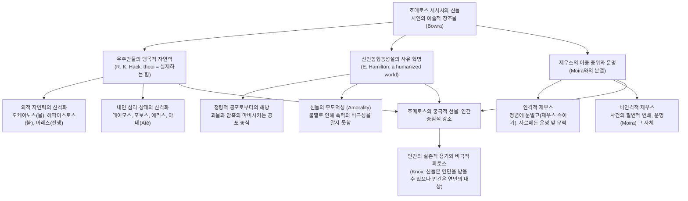

# 일리아스에 나타난 호메로스의 신들 (*Homeric Gods in Ilias*)

> [!NOTE] 학술사적 의의 및 총평
> 김한 교수의 논문 「『일리아스』에 나타난 호메로스의 신들」(Homeric Gods in Ilias, 2013)은 서양 고전문학 및 고전 르네상스 영문학의 시각에서 호메로스 서사시에 등장하는 신들의 본질과 서사적 기능을 다각도로 규명한 국내 영문학계의 대표적 원천 연구입니다. 저자는 호메로스의 신들이 역사적 종교의 숭배 대상이기 이전에 시인의 서술 목적(narrative goals)에 복무하도록 창안된 "즐겁고 유쾌한 예술적 창조물"(C. M. Bowra)이자, 인간이 통제할 수 없는 우주 내의 맹목적인 자연력과 인과적 힘(R. K. Hack)의 현현임을 밝힙니다. 특히 올림포스 최고신 제우스의 형상 속에 '정념과 무지에 휩싸여 운명에 굴복하는 의인화된 인격신'과 '사건의 필연적 연쇄를 주관하는 초월적·비인격적 운명'이라는 상반된 층위가 공존함을 논증했습니다. 궁극적으로 신들의 도덕적 무관심과 잔혹한 초연성을 필멸하는 영웅들의 실존적 고투와 대비시킴으로써, 호메로스가 서양 정신사에 남긴 최대의 유산이 바로 '인간중심적 세계관(A Humanized World)'과 필멸의 인간에 대한 숭고한 연민(Eleos)의 발견이었음을 설득력 있게 역설합니다.

---

## 1. 서지 정보 및 학술사적 맥락

- **저자**: 김한 (Han Kim) — 동국대학교 영어영문학부 명예교수. 서양 고전문학, 고전 르네상스 영문학, 호메로스 서사시의 지성사적 수용사 연구자.
- **출판 정보**: 『영어권문화연구』(Studies in English Culture), 제6권 제1호, 2013년 6월, pp. 107–131. (사단법인 한국영어권문화사학회)
- **연구 방법론**:
  - 서양 고전문학 비평 및 비교문화사적 접근: 고대 그리스 사회에서 호메로스 서사시가 수행한 파이데이아(Paideia, 교육)와 문화적 원류로서의 기능 분석.
  - 그리스 종교철학 및 지성사적 사유 추적: 소크라테스 이전 철학자 탈레스(Thales)의 자연학에서 시작하여 이오니아 자연철학, 크세노파네스, 플라톤, 에피쿠로스로 이어지는 '신(테오스, theos)' 관념의 변천사 분석 (R. K. Hack 1931의 철학사 연구 원용).
  - 서사학적·문학적 기능주의 비평: 신들을 종교적 도그마가 아닌 시인의 서술 목적(narrative goals)과 예술적 구성(artistic invention)의 산물로 파악 (C. M. Bowra 1961, Bernard Knox 1980 수용).
  - 인본주의(Humanism)적 가치 분석: 신인동형동성설(Anthropomorphism)이 정령 신앙의 마비시키는 공포로부터 고대 인간을 해방시킨 지성사적 혁명임을 규명 (Edith Hamilton 1942 수용).
- **학술사적 계보 및 주요 학설과의 대화**:
  - **극단적 두 학설의 비판적 종합**:
    - 에두아르트 마이어(Eduard Meyer)의 '철두철미 신성모독적(durchaus profan)' 서사시 규정(크세노파네스와 플라톤의 호메로스 비판 계보)과, 헤로도토스(Hdt. 2.53)의 '그리스인의 종교 교과서 및 신학자' 규정이라는 양극단의 대립을 검토. 김한은 C. M. 보라의 명제를 빌려 호메로스의 신들이 종교적 실체이기 전에 "시인들의 유쾌하고 즐거운 예술적 발명품"임을 천명하여 문학적 자율성을 옹호.
  - **영미 인본주의 서사 비평 계승**:
    - 버나드 녹스(Bernard Knox, 1980)의 '인간중심적 강조(anthropocentric emphasis)'와 '신들의 도덕성 결여 대 인간의 비극적 숭고함' 테제를 전면 수용.
    - 에디스 해밀턴(Edith Hamilton, 1942)의 '인간화된 세계(a humanized world)' 개념을 통해 그리스 신화의 세계사적 전환점 포착.
  - **그리스 철학사와의 접목**:
    - 로이 케네스 해크(Roy Kenneth Hack, 1931, *God in Greek Philosophy to the Times of Socrates*)의 연구에 크게 힘입어, 우주 만물의 살아있는 힘이자 인과적 실체로서의 '테오이(theoi)' 개념을 정립.

---

## 2. 핵심 테제 매트릭스 및 개념 구조도

### [핵심 테제 매트릭스]

| 분석 층위 | 전통적·표면적 인식 | 김한(2013)의 논증 및 핵심 테제 | 서사적·지성사적 의의 |
|:---|:---|:---|:---|
| **신들의 정체성** | 숭배 대상인 종교적 신격 또는 교조적 신학 체계 | 시인의 서술 목적에 부합하도록 창안된 "즐거운 예술적 창조물"(Bowra) | 종교적 도그마에서 벗어난 문학적 자율성과 서사적 극적 긴장 확보 |
| **신인동형설의 본질** | 원시적 의인화 또는 신성모독적 타락 | 우주와 인간 삶 속에서 작용하는 "통제 불가능한 맹목적 자연력과 실재적 힘"의 인격화 | 미지의 공포와 원시 정령 신앙으로부터 인간을 해방시킨 사유의 혁명(Hamilton) |
| **제우스와 운명(Moira)** | 전능한 최고신과 운명의 완전한 일치 | 인격적 제우스(정념·무지의 노리개, 운명에 굴복)와 비인격적 제우스(운명 그 자체)의 이중 구조 | 신학적 일관성 결여가 아닌, 시인의 서사 목적에 따른 다의적 '제우스들'의 공존 |
| **신들의 도덕성** | 정의와 도덕의 초월적 수호자 | 도덕성으로부터 완전히 자유로우며 무도덕(Amoral)함. 신들의 힘은 인간 관점에서 악할 수 있음 | 신정론적 변호의 실패를 인간 자신의 어리석음([[concept-ate\|Atē]]/atasthaliai)으로 전가하는 단초 형성 |
| **서사의 궁극적 중심** | 신들의 초월적 권능과 전지전능함 | 신들의 불멸적 초연함과 대비되는 필멸의 인간(전사)의 실존적 용기와 비극성 | 진정한 경탄과 연민([[concept-eleos\|Eleos]])의 대상을 신이 아닌 인간으로 정립하는 인본주의 완성 |

### [Mermaid 개념 및 논증 구조도]

---

## 3. 섹션별 정밀 분석

### 제1절: 서양문화의 원류로서의 서사시와 '신들'이라는 난제 (pp. 107–109)
- **파이데이아(Paideia)와 서양 고전문학의 창시**:
  - 호메로스는 그리스 문학의 창시자이자 서양 고전문학의 원류입니다. 서사시는 고대 그리스 사회에서 교육 실천과 방법론의 핵심 교재였으며, 음유시인들의 구술 암송(chant)과 범아테네 축제(Panathenaia) 낭송을 통해 전승되었습니다.
  - 그리스 비극의 소재를 제공하는 원천이었으며, 아리스토텔레스는 호메로스를 '가장 비극적인 시인'으로 상찬했습니다(*Poetics* 1448b).
  - 서양 고전 전통의 형성: 구약성서가 팔레스타인에서 수행한 역할을 그리스에서 담당했으며(Bernard Knox 14), 베르길리우스의 『아이네이스』, 단테의 『신곡』, 제임스 조이스의 『율리시스』로 이어지는 서양 문학 수용사의 원형입니다. 르네 샤르(René Char)는 호메로스를 "상류와 하류로 동시에 움직이면서 우리에게 인간과 신들의 나라를 온전히 보여주는 자"로 평가했습니다.
- **현대 독자의 접근성 장벽**:
  - 현대 독자에게 2,800여 년 전의 서사시는 낯선 문화적 배경을 지닙니다. 특히 『일리아스』 전편에서 "언제나 등장하는 인물들(ever-present characters)"인 올림포스 신들의 행동 양태는 작품 이해의 커다란 걸림돌이 됩니다.
  - 이 신들은 독자적인 실재인가, 인간 성격에 대한 메타포(Mary Lefkowitz 2003)인가, 아니면 시인의 서술 목적에 복무하는 문학적 창조물인가라는 근본적 물음이 제기됩니다.

### 제2절: 신들로 가득 차 있는 세계 — 탈레스와 이오니아 자연학의 신성 (pp. 109–111)
- **탈레스의 명제와 신(Theos)의 의미**:
  - 최초의 철학자 탈레스(Thales)는 "모든 것은 신들로 가득 차 있으며 살아 있다(πάντα πλήρη θεῶν εἶναι)"고 선언했습니다(R. K. Hack 11 재인용).
  - 고대 그리스 사유에서 '신(테오스, theos)'이라는 개념은 초자연적 인격신에 국한되지 않고, 우주 만물 속에 내재하는 살아있는 원초적 실체와 인과적 힘 전체를 포괄합니다.
- **세속성과 신성의 공존**:
  - 이오니아 학파의 합리적 과학 사유가 고도로 세속적이었다 할지라도, 신성은 이오니아의 세계 도식에서 결코 추방된 적이 없습니다.
  - 호라티우스의 시구처럼 신성은 "그럼에도 불구하고 계속해서 되돌아옵니다(*tamen usque recurret*)". 사람들이 아무리 내쫓으려 해도 되돌아오는 길을 찾아내는 자연의 힘과 같습니다. 호메로스는 이러한 신성의 실재성을 입증하는 최초의 가장 위대한 문학적 증인입니다.

### 제3절: 호메로스의 신 이해 — 시적 창조물과 운명의 긴장 (pp. 111–122)
- **1. 극단적 두 학설의 비판과 문학적 자율성 (pp. 111–114)**:
  - (1) **반종교적·세속주의적 해석**: 호메로스와 이오니아 정신을 철저히 세속적인 것으로 보며, 호메로스의 신들은 변함없는 숭배 대상이기를 그쳤다고 파악합니다. 에두아르트 마이어(Eduard Meyer)는 호메로스를 "철두철미 신성모독적(durchaus profan)"이라 규정했으며, 이는 크세노파네스와 플라톤의 비판으로 이어집니다.
  - (2) **종교 교사·신학자 해석**: 호메로스가 전문 신학자로서 교과서를 썼다는 견해입니다. 헤로도토스(Hdt. 2.53)는 호메로스와 헤시오도스가 그리스인들에게 신통기를 지어주고 신들의 명칭과 고유한 명예(티메)를 배정했다고 증언했습니다.
  - **김한의 비판적 평가**: 헤로도토스의 주장은 헤시오도스에게나 온전히 들어맞습니다. 호메로스가 신들에 관해 말한 것은 "틈틈이 지나치는 김에 말한 것들(obiter dicta)"에 불과합니다. C. M. 보라(Bowra 1961)의 통찰대로, 호메로스의 신들은 종교적 교조 이전에 시인들이 탄생시킨 "하나의 즐겁고 유쾌한 예술적 창조물(a delightful, gay invention of poets)"이며, 시인의 나레이티브 목적(narrative goals)에 복무하는 예술적 장치입니다.
- **2. 비인격적 운명(Moira)과 제우스의 이중성 (pp. 114–117)**:
  - 운명/숙명(Moira)은 사건의 연속을 지배하는 비인격적이고 변경 불가능한 힘입니다. 제단도 없고 기도도 드려지지 않으며, 인간의 죽음의 불가피성에 대한 철학적 성찰의 결과입니다.
  - 신이 강력할수록 운명과의 조화가 밀접해야 하지만, 호메로스는 이 조화의 균열을 선명하게 보여줍니다.
    - 제우스는 아들 사르페돈을 죽음의 운명에서 구출하고 싶어 연민을 느끼지만, 헤라의 꾸짖음에 부딪혀 결국 포기합니다(*Il.* 16.431–461).
    - 『일리아스』 14권 "제우스 속이기(Dios Apate)" 장면: 헤라는 암브로시아와 향기로운 기름으로 치장하고(*Il.* 14.169–186), 아프로디테에게서 애정과 욕망이 담긴 매혹의 띠를 빌리며(*Il.* 14.215–217), 잠의 신 휩노스에게 카리스 파시테에를 아내로 주겠다고 매수합니다. 헤라의 유혹에 빠진 제우스는 자신의 화려한 연애 편력을 늘어놓으며 황금 구름 속에서 잠에 빠집니다(*Il.* 14.347–351).
  - 맹목적 정념과 무지의 노리개인 이 인격적 제우스의 의지를 과연 운명과 동일시할 수 있는가? 김한은 "제우스라는 이름으로 불리는 일련의 여러 신들"이 병존한다고 해석합니다(R. K. Hack 24; 플루타르코스).
    - 사르페돈을 위해 슬퍼하는 '인격적 제우스'는 혈족과 애정의 맥락에서 운명에 종속됩니다.
    - 반면 사건들의 필연적 연쇄를 지배하는 '비인격적 제우스'는 인간적 고통 저 너머에 초연히 존재하는 운명 그 자체입니다.
- **3. 자연력과 추상적 개념의 신격화 (pp. 117–120)**:
  - 오케아노스는 세계를 둘러싼 강으로서 모든 신들의 "존재의 근원"이자 아버지이며(*Il.* 14.201, 21.196), 테티스(테튀스)는 신들의 유모이자 어머니입니다.
  - 21권 크산토스 강의 범람과 헤파이스토스의 불의 격돌(*Il.* 21.328–382)은 거대한 자연의 힘들이 신격화되어 생동하는 전형입니다.
  - 인간 내면과 사회적 상태의 신격화: 공포(포보스), 전율(데이모스), 불화(엔뇨), 투쟁(에리스), 파멸을 부르는 미망([[concept-ate|아테]]), 간구(리타이), 우아(카리테스), 소문(오사), 정의(테미스).
  - 길버트 머레이(Gilbert Murray 1925)가 논증했듯, 고대인들에게 이들은 사후적 추상 관념이 아닙니다. 현대 과학자가 '전기'의 효과를 관찰하여 전기를 인식하듯, 고대 그리스인들은 인간을 압도하는 실재적 힘(powers)을 직접 체험하고 신으로 인식했습니다.
- **4. 신들의 무도덕성(Amorality)과 신정론의 딜레마 (pp. 120–122)**:
  - 신의 본질은 '살아있는 힘(living force)'이며, 도덕적 완성은 신성의 필수 속성이 아닙니다. 인간의 관점에서 신들의 힘은 다분히 폭력적이고 악합니다.
  - 5권 아레스의 부상 장면: 디오메데스에게 창을 맞고 만 명의 전사처럼 비명을 지르며 제우스에게 아테나의 난폭함을 징징대는 아레스(*Il.* 5.872)를 향해, 제우스는 "알로프로살로스(ἀλλοπρόσαλλος, 변덕쟁이 배신자)"라 부르며 싸움질만 좋아하는 자라고 조롱합니다(*Il.* 5.889).
  - 에피쿠로스의 통찰(정혜신 2003 인용): 신들은 완전 자족적이므로 인간 세상의 도덕이나 정의 문제로 고심하지 않으며, 선인에게 보상을 주거나 악인을 벌하지 않습니다.
  - 신들이 악의 인과적 책임에서 벗어날 수 있는 유일한 길은 '악을 인간 자신의 어리석음([[concept-ate|Atē]])에 돌리는 방식'이었으나, 호메로스 역시 신정론의 궁극적 모순을 완전히 해결하지는 못했습니다.

### 제4절: 나오며 — 인간중심적 강조와 그리스의 기적 (pp. 123–124)
- **도덕성의 인간성과 죽음을 직면하는 용기**:
  - 신들은 맹목적인 자연의 힘을 대변하며 도덕성과는 무관합니다. 설령 도덕성을 알더라도 신들은 도덕성에서 완전히 자유롭습니다.
  - 신들은 폭력적이지만 불멸하기 때문에 폭력의 궁극적 결과인 죽음을 알지 못합니다. 죽음을 직면하는 용기는 오직 필멸의 인간만이 지닌 고유한 미덕입니다.
- **경탄과 연민의 전도 (Bernard Knox 1980)**:
  - 신들은 공포나 웃음을 자아낼 수는 있지만, 결코 우리의 '연민([[concept-eleos|Eleos]])'을 받을 수 없습니다. 휘몰아치는 돌풍이나 중력에 대해 연민을 느낄 수 없는 것과 같습니다.
  - 서사시의 진정한 경탄과 연민의 대상은 제신들이 아니라, 필멸의 비극적 운명 속에서 피 흘리며 싸우는 인간(아킬레우스, 헥토르)입니다.
- **인간중심적 세계(A Humanized World)와 그리스의 기적 (Edith Hamilton 1942)**:
  - 신들을 인간의 모습으로 그릴 수 있었던 것은 세계 인류사에서 거대한 사유의 혁명이었습니다.
  - 이 사유는 대지와 바다에 우글거리던 정령들과 미지의 괴물들이 주던 마비시키는 원시적 공포로부터 인간을 해방시켰습니다.
  - 호메로스의 무대 위에 신들은 언제나 등장하지만(ever-present characters), 시인의 궁극적 관심은 처음부터 끝까지 인간이었습니다. 호메로스가 서양 정신(Western mind)에 남긴 최대의 기여는 바로 이 '인간중심적 강조(anthropocentric emphasis)'입니다.

---

## 4. 주요 텍스트 인용 및 정밀 주석

- **번역**: "그 방으로 들어가 그녀는 번쩍이는 문짝을 닫았다. 그러고 나서 그녀는 암브로시아로 매력적인 몸에서 때를 말끔히 씻어 낸 다음 신들만이 쓰는 부드럽고 향기 그윽한 올리브 기름을 몸에 듬뿍 발랐다."
- **원문**: *ἔνθ’ ἥ γ’ εἰσελθοῦσα θύρας ἐπέθηκε φαεινάς. / ἀμβροσίῃ μὲν πρῶτον ἀπὸ χροὸς ἱμερόεντος / λύματα πάντα κάθηρεν, ἀλείψα토 δὲ λίπ’ ἐلاίῳ / ἀμβροσίῳ ἑδανῷ, τό ῥά οἱ τεθυωμένον ἦεν·*
- **학술 전사**: *énth’ hḗ g’ eiselthoûsa thúras epéthēke phaeinás. / ambrosíēi mèn prôton apò khroòs himeróentos / lúmata pánta káthēren, aleípsato dè líp’ elaíōi / ambrosíōi hedanôi, tó rhá hoi tethuōménon êen;* (*Il.* 14.169–172)
  - **[주석]**: 제우스를 유혹하여 트로이아 전장에서 눈을 돌리게 하려는 헤라의 관능적 몸치장. 불멸의 여신이 필멸의 인간을 돕기 위해 신적 향유와 장신구로 스스로를 무장하는 희극적이면서도 치밀한 서사적 장치.

- **번역**: "아버지 제우스여! 이런 난폭한 행위들을 보면서도 도대체 아무런 분노도 느끼지 않으십니까?"
- **원문**: *Ζεῦ πάτερ, οὐ νεμεσίζῃ ὁρῶν τάδε καρτερὰ ἔργα;*
- **학술 전사**: *Zeû páter, ou nemesízēi horôn táde karterà érga;* (*Il.* 5.872)
  - **[주석]**: 디오메데스의 창에 찔린 전쟁의 신 아레스가 올림포스로 도망쳐 제우스에게 올리는 하소연. 신들의 전쟁 개입이 빚어낸 자기모순과 볼품없는 패배의 비애를 역설적으로 폭로함.

- **번역**: "이 배신자여! 내 곁에 앉아서 징징대지 마라! 너는 올림포스에 사는 신들 가운데 내게 가장 역겨운 자니라. 너는 언제나 싸움질과 전쟁과 전투만을 좋아하기 때문이니라."
- **원문**: *μή τί μοι, ἀλλοπρόσαλλε, παρεζόμενος μινύριζε. / ἔχθιστος δέ μοί ἐσσι θεῶν, οἳ Ὄλυμπον ἔχουσιν· / αἰεὶ γάρ τοι ἔρις τε φίλη πόλεμοί τε μάχαι τε·*
- **학술 전사**: *mḗ tí moi, alloprósalle, parezómenos minúrize. / ékhthistos dé moí essi theôn, hoì Ólumpon ékhousin; / aieì gár toi éris te phílē pólemoí te mákhai te;* (*Il.* 5.889–891)
  - **[주석]**: 아레스를 꾸짖는 제우스의 비정한 조롱. 제우스는 아레스를 '알로프로살로스(ἀλλοπρόσαλλος, 변덕스러운 배신자)'로 규정하며 신들 간의 폭력과 투쟁이 도덕적 의무가 아니라 한갓된 혐오의 대상임을 드러냄.

- **번역**: "그러자 그들 밑에서 신성한 대지가 이슬을 머금은 클로버며 크로커스며 히아신스 같은 싱그러운 새 풀들을 부드럽고 두텁게 돋아나게 했으므로 이것이 그들을 땅에서 높이 들어 올려 주었다."
- **원문**: *τοῖσι δ’ ὑπὸ χθὼν δῖα φύεν νεοθηλέα ποίην, / λωτόν θ’ ἑρσήεντα ἰδὲ κρόκον ἠδ’ ὑάκινθον / πυκνὸν καὶ μαλακόν, ὃς ἀπὸ χθονὸς ὑψόσ’ ἔεργε.*
- **학술 전사**: *toîsi d’ hypò khthṑn dîa phúen neothēléa poíēn, / lōtón th’ hersēenta idé krókon ēd’ huákinthon / puknòn kaì malakón, hòs apò khthonòs huyhós’ éerge.* (*Il.* 14.347–349)
  - **[주석]**: 제우스와 헤라의 성적 결합 순간 자연이 보이는 신성한 반응(히에로스 가모스, Hieros Gamos). 신들의 정념이 우주 자연의 생명력과 직접 결합되어 있음을 보여주는 장대한 자연 묘사.

---

## 5. 지식베이스 내 연관 개념 및 엔티티 교차 참조

- **[[concept-moira|모이라 (Moira)]]**: 논문의 핵심 분석 대상. 제우스조차 뛰어넘지 못하는 사건의 비인격적 연쇄이자 죽음의 불가피성. 사르페돈의 죽음 앞에서의 제우스의 고뇌(*Il.* 16.431–461)와 '인격적 제우스 대 비인격적 운명'의 이중 구조.
- **[[concept-time|티메 (Timê)]]**: 신들의 행동을 추동하는 핵심 동기. 신들은 인간 사회의 도덕적 정의가 아니라 자신들에게 바쳐지는 명예의 배당과 제사의 몫(Knisē)에 반응함.
- **[[concept-ate|아테 (Atē)]]**: 파멸을 초래하는 신격화된 어리석음. 호메로스가 신들의 악행과 파괴적 충동을 인간의 미망으로 외화하여 신정론적 책임을 전가하려 했던 서사적 기제.
- **[[concept-menis|메니스 (Menis)]]**: 아킬레우스의 신적 분노와 그로 인한 전쟁의 파국. 신들의 당파적 개입과 아테나의 개입(*Il.* 1.197–200)을 통해 통어되는 영웅적 정념의 원형.
- **[[concept-eleos|엘레오스 (Eleos)]]**: 신들에게는 부재하고 오직 필멸의 인간에게만 허락된 숭고한 연민. 신들은 불멸하기에 연민을 누릴 수 없으나, 아킬레우스와 프리아모스의 만남(*Il.* 24권)처럼 죽음을 직면하는 인간들 사이에서 비극적 연민이 완성됨.
- **[[concept-xenia|크세니아 (Xenia)]]**: 친절한 손님 접대의 수호자로서의 제우스 크세니오스(Zeus Xeinios)와 아르카디아의 야만적 제우스 간의 기능적 분열.
- **[[kearns-2006-gods-in-homeric-epics|컨스 (2006)]]**: 제의적 다원성과 서사시적 개체성의 분리, 신들의 당파성과 인간 영웅주의를 위한 신학의 희생 테제와의 상호보완적 비교.
- **[[minchin-2019-homeric-religion|민친 (2019)]]**: 구술 서사시의 시학적 양식화(Poetic Stylization), 제사와 기도의 상호성(*do ut des*), 초연한 관객(Spectator)으로서의 신 테제와의 종합적 대화.

---

## 6. 비판적 검토 및 학술사적 평가

### 1. 동일 저자의 2019년 후속 연구와의 사유 발전 계보
- **2019년 후속 논문과의 연속성과 심화**:
  - 김한 교수는 2019년 후속 논문 「호메로스의 신들, 제우스, 모이라이(운명)와 기독교 성서의 하나님」을 통해 2013년 논문에서 제기한 논점들을 비교종교철학적 지평으로 확장했습니다.
  - 2013년 논문이 『일리아스』 텍스트 내에서 신들의 문학적 창조성(Bowra), 맹목적 자연력의 신격화(Hack), 그리고 '인간중심적 세계'의 인본주의적 발견(Knox, Hamilton)에 주력했다면,
  - 2019년 논문은 제3장에서 탐구된 '인격적 제우스와 비인격적 운명(Moira)의 분열'을 기독교 성서의 전능하고 초월적인 유일신(야훼)의 섭리 및 주권 개념과 직접 대조했습니다.
  - 호메로스의 제우스가 사르페돈의 죽음 앞에서 무력하고 헤라의 유혹에 눈멀며 운명과 분열되는 한계를 보인 반면, 성서의 신은 운명 자체를 자신의 주권 아래 포섭하는 인격적 창조주라는 점에서, 2013년 논문에서 포착된 '신들의 한계와 인간의 실존적 부각'이 서양 종교·철학사 전반에서 어떤 구조적 위치를 점하는지 심화 규명했습니다.

### 2. 국내외 고전문헌학 및 종교학 연구와의 다각도 비판적 대조
- **영미 인본주의 서사 비평의 충실한 계승과 국내 수용**:
  - 김한 교수의 논문은 C. M. 보라(1961), 버나드 녹스(1980), 에디스 해밀턴(1942), R. K. 해크(1931) 등 20세기 영미권 고전문학 및 종교철학의 권위 있는 비평 전통을 한국 학계에 유려하고 체계적으로 도입했습니다.
  - 특히 신들을 종교적 신앙의 대상에 가두지 않고, 자연의 맹목적 힘에 맞서 죽음의 필연성을 응시하는 인간의 비극적 숭고함과 연민([[concept-eleos|Eleos]])을 부각시킨 점은 재스퍼 그리핀(Jasper Griffin 1980)의 '신들의 실재성과 인간 비극' 테제와도 깊이 공명합니다.
- **에밀리 컨스(Kearns 2006) 및 엘리자베스 민친(Minchin 2019)과의 문헌학적 쟁점**:
  - **(1) 제의(Cult) 실재와 서사시적 양식화의 인식 차이**:
    - 김한은 호메로스의 신들을 주로 '시인의 유쾌한 예술적 창조물(Bowra)'이자 '통제할 수 없는 자연력의 은유'로 환원하는 문학주의적 태도를 취합니다.
    - 반면 미케네 선형 B 문자와 종교사적 실재를 다룬 현대 문헌학(Kearns 2006; Minchin 2019)은 호메로스의 신들이 실제 그리스인들의 제의적 실천(동물 제사 Thysia, 기도, 상호성 *do ut des*)과 긴밀히 결속되어 있으며, 시인이 이를 구술 서사의 구성적 편의와 비극적 파토스를 위해 '선택적으로 양식화(Poetic Stylization)'한 것임을 입증했습니다. 즉 신들은 허구적 발명품에 그치지 않고 역사적 신앙의 시학적 재편입니다.
  - **(2) 자연 알레고리론 환원의 한계**:
    - 김한은 헤파이스토스를 '불', 아레스를 '전쟁'으로 환원하는 고대적 자연력 신격화 모델(R. K. Hack)을 적극 지지하지만, 에밀리 컨스(2006)가 지적했듯 호메로스의 신들은 결코 단순한 자연 알레고리로 환원되지 않는 '유일무이한 서사적 행위자(Equipollent Characters)'로서의 고유한 개체성을 누립니다.
  - **(3) 이중 동기화(Double Motivation)의 정밀성**:
    - 김한은 신의 개입을 주로 외적 자연력이나 심리적 상태의 신격화로 서술했으나, 현대 문헌학(E. R. 도즈 1951, 알빈 레스키 1961, 민친 2019)은 인간의 주체적 결단과 신적 충동이 동시에 100% 작용하는 '과잉결정(Over-determination)'의 고유한 서사 문법으로 정밀 분석합니다.
- **국내 고전문헌학 연구 지형 내에서의 위상**:
  - 천병희 교수의 『일리아스』 완역본(2007) 출간 이후 국내에서 고전 원전에 대한 학술적 관심이 성숙하던 시기에, 영문학계의 시각에서 호메로스 서사시가 서양 인본주의(Humanism)와 근대 서사 문학에 미친 영감의 원천을 규명한 귀중한 연구입니다.
  - 희랍어 원전의 세밀한 언어학적 분석보다는 영미권 앤솔로지와 주석서에 의존한 분과적 한계가 존재하지만, 호메로스의 신인동형설이 정령적 공포로부터 인간을 해방시키고 인간 중심의 세계를 연 '사유의 혁명'이었음을 밝힌 통찰은 지성사적으로 탁월한 학술적·교육적 가치를 지닙니다.

---

## 관련 항목

- [[overview|서사시 개요]]
- [[wiki/index|위키 색인]]
- [[analysis-concept-source-matrix|개념과 문헌 매트릭스]]
- [[kearns-2006-gods-in-homeric-epics|호메로스 서사시의 신들 (Kearns 2006)]]
- [[minchin-2019-homeric-religion|호메로스의 종교 (Minchin 2019)]]
- [[concept-moira|모이라 (Moira)]]
- [[concept-time|티메 (Time)]]
- [[concept-ate|아테 (Ate)]]
- [[concept-eleos|엘레오스와 오익토스 (Eleos & Oiktos)]]
- [[concept-menis|메니스 (Menis)]]
- [[concept-xenia|크세니아 (Xenia)]]
