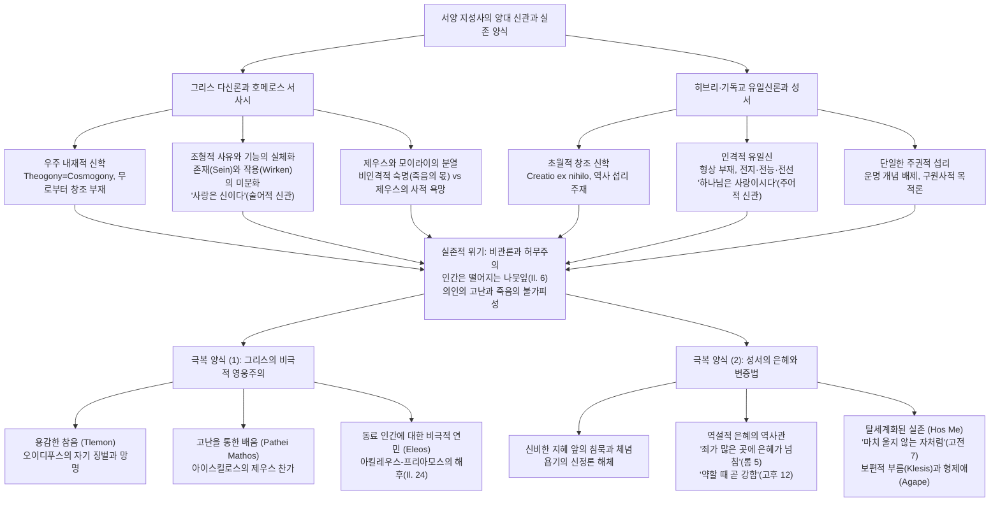

# 호메로스의 신들, 제우스, 모이라이와 성서의 하나님 (*Homeric gods, Zeus & Moirae vs. God*)

> [!NOTE] 학술사적 의의 및 총평
> 김한 교수의 논문 「호메로스의 신들, 제우스, 모이라이(운명)와 성서의 하나님」(영어영문학 65(4), 2019)은 서양 정신사의 양대 원류인 헬레니즘(호메로스 서사시)과 헤브라이즘(구·신약 성서)의 신관(神觀), 운명관, 인간학을 고전문헌학·비교종교학·실존주의 신학의 융합 지평에서 정밀하게 비교 대조한 역작입니다. 저자는 호메로스의 신들이 세계를 초월한 창조자가 아니라 우주 내재적 질서이자 현상 그 자체의 신격화라는 존재론적 특성을 규명하고, 존재(Sein)와 작용(Wirken)의 미분화에서 기인하는 그리스 특유의 조형적·시각적 사유 방식을 헤르만 클라인크네히트의 술어 전도 명제("하나님은 사랑이다" 대 "사랑은 신이다")를 통해 탁월하게 논증했습니다. 나아가 최고신 제우스와 운명의 신 모이라이(Moirae) 사이의 복잡한 긴장(사르페돈의 죽음과 제우스의 기만)을 분석하여 인격적 신의 의지와 비인격적 숙명의 분열을 입증했습니다. 궁극적으로 고대 세계를 지배한 심연의 허무주의와 비관론에 맞서 호메로스-그리스 비극이 '운명을 짊어지는 인간의 비극적 영웅주의와 연민'으로 응답한 반면, 성서적 전통은 '신비한 섭리 앞의 경건한 체념(욥기), 바울의 종말론적 변증법(약함 속의 강함, 호스 메 태도), 그리고 조건 없는 신의 부름(Klesis)'을 통해 실존적 구원을 획득했음을 체계적으로 밝혔습니다.

---

## 1. 서지 정보 및 학술사적 맥락

- **저자**: 김한 (Han Kim) — 동국대학교 영어영문학 명예교수. 셰익스피어 및 고전 르네상스 비극, 호메로스 구술 시학, 고대 그리스 신화 및 종교문학 연구의 권위자. 저서로 『그럼에도 불구하고: 셰익스피어의 인간과 세상이야기』(2011), 주요 논문으로 「비극으로서의 『욥기』 다시 읽기」(2011), 「『일리아스』에 나타난 호메로스의 신들」(2013), 「호메로스의 시 세계고찰: 『일리아스』를 중심으로」(2013) 등이 있습니다.
- **출판 정보**: 한국영어영문학회, 『영어영문학』(English Language and Literature), 제65권 제4호 (2019년 겨울호), pp. 683–714. DOI: `10.15794/jell.2019.65.4.007`. (2019년 5월 25일 한국중세근세영문학회 봄 정기학술대회 발표 논문 "Homeric gods, Zeus & Moirae (Fate) vs. God"을 대폭 수정·보완).
- **연구 방법론**:
  - **비교종교학(Comparative Religion) 및 존재론적 분석**: 고대 근동 및 그리스-로마 다신론(Polytheism)과 히브리-기독교 유일신론(Monotheism)의 신적 초월성·내재성, 창조성, 도덕성 비교.
  - **고전문헌학(Classical Philology) 및 서사학(Narratology)**: *일리아스*와 *오뒷세이아*의 원문 분석, 신현(Epiphany)과 인과성의 이중 구조(신적 작용과 인간 행위의 중첩), 핀다로스·헤시오도스·비극 시인들(아이스킬로스, 소포클레스, 유리피데스)의 문헌학적 교차 검증.
  - **신약학 및 실존주의 해석학(Bultmannian Existential Hermeneutics)**: 루돌프 불트만(Rudolf Bultmann)의 신약 신학 및 양식사적 분석을 원용하여, 고대 비관론과 성서적 종말론·변증법적 역사이해(*Entscheidung*, *Kairós*)를 대비.
- **학술사적 계보 및 주요 학설과의 대화**:
  - **예술적 허구설 대 종교적 실재론**: 길버트 머레이(Gilbert Murray)와 C. M. 보우라(C. M. Bowra 1961)의 "신들은 시인들이 창조한 유쾌한 허구(delightful, gay invention)"라는 심미주의적 견해를 비판적으로 검토하고, W. F. 오토(Walter F. Otto 1954)와 H. 슈레이드(H. Schrade 1952)의 종교 현상학적 실재론을 수용하여, 호메로스 신들의 배후에 놓인 민간 신앙과 폴리스 제의의 실재성을 복원.
  - **이중 동기화와 시각적 조형 사고**: M. M. 윌콕(M. M. Willcock 1978)의 파리스-아폴론 활쏘기 분석 및 이리스-폴리테스 신현 분석을 계승하여, 고대 그리스인 특유의 '존재(Sein)와 작용(Wirken)의 미분화'와 '눈에 보이는 형태를 통한 세계 파악(플라톤의 이데아론적 원형)'을 체계화.
  - **신 개념(Theos)의 언어학적·철학적 규명**: 신약성서신학사전(TDNT)의 헤르만 클라인크네히트(Hermann Kleinknecht 1957)의 *Theos* 어의 분석과 로이 케네스 헤크(Roy Kenneth Hack 1931)의 소크라테스 이전 그리스 철학 신관을 바탕으로 그리스 다신론의 본질 규명.
  - **운명과 신정론 논쟁**: 알빈 레스키(Albin Lesky 1961), E. R. 도즈([[dodds-1951-greeks-and-irrational|Dodds 1951]]), 휴 로이드-존스([[lloyd-jones-1971-justice-of-zeus|Lloyd-Jones 1971]])로 이어지는 호메로스 서사시의 운명([[concept-moira|Moira]])과 정의([[concept-dike|Dike]]) 문제에 대해, 비인격적 숙명과 제우스 의지 간의 불일치를 논증.

---

## 2. 핵심 테제 매트릭스 및 개념 구조도

### [핵심 테제 매트릭스: 호메로스의 제우스·모이라이 vs 성서의 하나님]

| 비교 범주 | 호메로스 서사시 (그리스 다신교·영웅주의) | 기독교 성서 (히브리·신약 유일신교) | 비교종교학적·철학적 함의 |
|:---|:---|:---|:---|
| **신론적 존재론** | **우주 내재적 존재 (Immanent)** 우주와 함께 탄생(Theogony=Cosmogony). 세계의 일부이자 질서·형식. 무로부터의 창조 아님. | **절대적 초월자 (Transcendent)** 우주 이전 자존. 무로부터의 창조(*Creatio ex nihilo*). 세계 밖에 거하며 섭리로 주재. | 그리스 신은 세계 속화(Profanation)의 결과; 성서의 하나님은 거룩한 타자(Totaliter Aliter). |
| **신적 형태와 속성** | **극대화된 의인론 (Anthropomorphic)** 구체적 신체와 결함(헤파이토스의 절뚝거림, 신들의 간통·탐욕). 불멸과 영원한 젊음(*athanatos*)을 지닌 인간. | **비가시적 영 (Incorporeal Spirit)** 형상 우상화 엄금. 전지(Omniscient), 전능(Omnipotent), 전선(Omnibenevolent). 구체적 성격 대신 절대적 거룩함. | 그리스 신은 '영원한 인간'(아리스토텔레스); 성서의 신은 인간 척도를 무한히 초월하는 주권자. |
| **신 개념의 언어 구조** | **술어적 실재 ("사랑은 신이다")** 압도적 현실·감정·기능(전쟁=아레스, 사랑=아프로디테, 공포, 질투, 우정의 재회)에 신격을 부여. | **주어적 본체 ("하나님은 사랑이시다")** 신만이 유일한 주어이며 사랑·공의·생명은 그분의 본질적 속성으로 도출됨(요일 4:16). | 클라인크네히트의 정명(正名) 전도: 그리스적 신성은 현실의 극화된 양태일 뿐임. |
| **운명(Moira)과의 관계** | **제우스와 모이라이의 긴장·분열** 제우스는 운명의 집행자이나 사르페돈 구출 실패(*Il.* 16), 헤라의 유혹(*Il.* 14)에 빠짐. 비인격적 숙명이 상위에 군림. | **하나님의 절대적 섭리(Providence)** 독립된 운명 개념 전무. 모든 피조계의 고통과 역사는 하나님의 목적론적 구원 경륜 아래 종속됨. | 그리스 영웅은 비인격적 숙명에 희생됨; 성서의 인간은 하나님의 인격적 뜻 앞에 결단함. |
| **인간학(Anthropology)** | **우주(Kosmos) 내의 종족(Gattung)** 자연의 순환에 예속된 유한자(나뭇잎의 비유, *Il.* 6). 탁월성(Arete)과 경쟁(Agon)을 통해 신성을 모방. | **역사(History) 속의 결단자** 하나님의 형상(*Imago Dei*)으로 창조됨. 죄인으로서 신 앞에 단독자로 서며, 이웃 사랑(Agape)의 연대를 형성. | 그리스는 우주적 미학·경쟁 중심; 성서는 인격적 역사·은혜·윤리 중심. |
| **허무주의와 비관론 극복** | **비극적 영웅주의와 연민(Eleos)** 피할 수 없는 운명을 용감히 견딤(*tlemon*). 아킬레우스와 프리아모스의 눈물(*Il.* 24). 인간적 존엄의 확인. | **종말론적 신앙과 은혜의 변증법** 약함 속의 강함(고후 12). '마치 아닌 것처럼'(*hos me*) 살아가는 탈세계화. 신의 무조건적 부름(Klesis). | 비극적 파토스를 통한 자기 완성 대 은혜와 부활 소망을 통한 구원. |

### [Mermaid 개념 및 논증 구조도]

---

## 3. 섹션별 정밀 분석

### 제1절: 호메로스의 신이해와 존재론적 기반 (pp. 684–691)

#### 1. 초월신과 내재신의 대비: 속화된 신들의 판테온
- **절대적 초월 대 우주 내재성**:
  - 기독교의 유일신(God)은 절대자로서 전지·전능·전선하며, 세계의 일부를 이루지 않고 세상 밖에서 섭리(Providence)합니다. 신약에서 신은 결코 지상 사건에 희극적으로 휘말리지 않으며 예수라는 중보자를 통해 역사합니다.
  - 반면 호메로스의 신들은 절대자도 초월신도 아닙니다. 헤파이토스는 상체와 하체의 불균형으로 절뚝거리며 걸어 신들의 폭소를 자아내고(*Il.* 1.598–600), 최고신 제우스조차 다른 신의 영역을 침범할 때 강력한 반발에 직면합니다. 해가 뜨고 지는 현상도 태양신 헬리오스가 천궁을 전차로 달리는 구체적 노고에 의존합니다.
- **창조신앙의 결여와 신성의 속화(Profanation)**:
  - 그리스 신들은 세계를 '무로부터 창조(*creatio ex nihilo*)'한 것이 아니라 세계가 형성되는 과정에서 태어났습니다. 즉 신통기(Theogony)가 곧 우주발생기(Cosmogony)입니다.
  - 고대 그리스인들은 무수한 신들을 세계에 제공함으로써 세계를 성스럽게 만들기보다, 신적인 것을 철저히 세계의 일부로 편입시켜 오히려 신들을 '속화'시켰습니다. 이 신들의 윤리성은 인간의 모범이 되기는커녕 인간들의 파렴치한 다툼과 범죄를 그대로 반복합니다.

#### 2. 존재(Sein)와 작용(Wirken)의 미분화와 조형적 사유
- **신격의 양면성: 개체성과 원초적 힘의 공존**:
  - (1) 올림포스 주요 신들처럼 뚜렷하게 의인화된 독립 개체.
  - (2) 바람, 잠(Hypnos), 증오(Eris)처럼 인격신과 거리가 먼 무형의 기능·작용 그 자체가 신으로 간주되는 경우.
- **조형미술가적 세계관과 플라톤의 이데아**:
  - 근대 존재론은 '존재(Sein)'와 '작용(Wirken)'을 엄격히 구분하지만, 호메로스적 사고에서는 존재를 말하면서 동시에 기능과 작용을 의미합니다. 이는 그리스인들이 조형미술가처럼 눈에 보이는 가시적 형태(Eidos, Idea)를 통해 세계를 파악했기 때문입니다.
- **문헌학적 논증 사례**:
  - **리타이(Litai)와 아테(Atē)의 조형화**(*Il.* 9.502–504): 추상적 행위인 '애원/기도'는 주름지고 다리를 저는 초라한 여인들(리타이)로, 인간의 눈을 멀게 하는 파멸적 망집인 '아테'는 강하고 날쌘 여신으로 생생하게 의인화되어 대조됩니다.
  - **파리스와 아폴론의 공동 사격**(*Il.* 22.359–360; Willcock 1978): 아킬레우스가 파리스와 아폴론의 화살에 맞아 죽었다는 서술은 파리스의 탁월한 궁술(기능)을 아폴론이라는 신적 개체로 이중 투사한 것입니다.
  - **이리스(Iris)와 폴리테스(Polites)**(*Il.* 2.780ff): 트로이의 파수꾼 폴리테스가 전황을 알릴 자리에 전령의 신 이리스가 폴리테스의 형상으로 나타납니다. 이는 서사적 군더더기가 아니라, 개전의 엄중한 무게를 담아내기 위해 인간 폴리테스를 '순수한 전령의 신적 화신'으로 고양시킨 형이상학적 압축입니다.
  - **자아와 타자 경계의 유동성**: 아가멤논은 자신의 과오를 아테 여신의 탓으로 돌리면서도(*Il.* 19.86ff) 스스로 전적인 배상 책임을 집니다. 시인 자신도 자신의 노래가 스스로 지은 것이라면서 동시에 무사이 여신이 가르쳐 준 것이라 선언합니다(*Il.* 1.1; *Od.* 22.337).

---

### 제2절: 제우스와 모이라이(Zeus & Moirae)의 권력 관계 (pp. 691–693)

#### 1. 인격신 제우스와 비인격적 숙명
- 헤시오도스에게서 제우스는 혼돈과 무형의 괴물들을 제압하고 이성적 질서를 확립한 인격신입니다. 호메로스에서도 제우스는 최고의 권능자이나, 호메로스의 세계에는 다양한 신들(*theoi*)이 떼를 지어 존재하며, 이 신들의 집합적 통일체는 '다이몬(daimon)' 혹은 '숙명(Moira)'과 호환됩니다.
- 숙명(Moira)은 사물의 본성과 '죽음의 불가피성'에 대한 사색에서 도출된 비인격적이고 변경 불가능한 인과율입니다.

#### 2. 제우스와 운명의 조화와 좌절: 두 가지 결정적 사건
- **사르페돈의 죽음과 제우스의 눈물**(*Il.* 16.431–461):
  - 제우스는 아들 사르페돈이 파트로클로스의 손에 죽을 운명에 처하자, 운명을 뒤바꾸어 그를 살리고자 고뇌합니다.
  - 이에 헤라는 만약 제우스가 정해진 몫(mora)을 깨뜨린다면 다른 모든 신도 지상의 자기 자식들을 살리려 들 것이며 올림포스의 질서가 붕괴할 것이라 경고합니다. 제우스는 결국 뜻을 꺾고 피눈물을 흘리며 사르페돈의 죽음을 방임합니다. 제우스의 인격적 부성애는 냉혹한 숙명의 법칙 앞에 무력하게 굴복합니다.
- **제우스의 기만(Dios Apate)**(*Il.* 14.153–353):
  - 헤라는 아프로디테의 띠와 잠의 신 힙노스의 조력을 받아 이다산에서 제우스를 유혹합니다. 제우스는 맹목적인 성적 욕망에 사로잡혀 자신의 과거 연애 목록을 줄줄이 나열하며 헤라에게 굴복합니다.
  - 이 장면의 제우스는 우주의 섭리나 숙명과 동일시될 수 없는, 한낱 맹목적 정념의 노리개로 전락합니다.
- **헤크(R. K. Hack)의 제우스 이원론**:
  - 호메로스 텍스트에서 '제우스'는 다의적으로 사용됩니다. 하나의 제우스는 운명에 종속되어 울부짖는 인간적인 인격신이며, 또 다른 제우스는 우주적 사건의 연쇄 그 자체인 '비인격적 최고 운명'입니다. 호메로스의 신관은 단일한 체계가 아니라 극도로 탄력적이고 다층적인 모순을 내포합니다.

---

### 제3절: 그리스의 신(Theos) 개념 개관 (pp. 693–697)

#### 1. 술어적 신관과 클라인크네히트의 전도 명제
- **신(Theos)의 범주적 확장**:
  - 그리스인들에게 *Theos*는 단일한 유일신 인격이 아니라, 현실에서 경험되는 가장 강력하고 지속적인 힘들의 총체였습니다.
  - 질투(Phthonos)는 악한 신이며, 에우리피데스는 "친구들과의 재회"를 신이라 불렀고(*Hel.* 560), 아이스킬로스는 "행복"이야말로 인간에게 신이라고 칭송했습니다(*Cho.* 60). 플라톤은 우주(Kosmos) 자체를 신이라 규정했습니다(*Tim.* 34a–b).
- **요한일서 4:16과의 결정적 대조**:
  - 성서(요일 4:16)가 `"하나님은 사랑이시다"`(ὁ θεὸς ἀγάπη ἐστίν)라고 선포할 때, 주어는 절대자 하나님이며 사랑은 신의 본성입니다.
  - 반면 그리스적 사유는 정반대로 `"사랑은 신이다"`(ὁ ἔρως θεός ἐστιν)라고 표현합니다. 현실의 생생한 힘(사랑, 공포, 승리, 죽음)이 주어이며, 신(Theos)은 이를 형용하는 술어(Predicate)에 불과합니다.
- **인간의 신격화와 영웅 숭배**:
  - 탁월한 기능과 역량을 발휘하는 영웅은 '신과 같은 자'(*theoeikelos*, *isotheos*)로 불렸고, 이는 헬레니즘 군주 숭배와 로마 황제 숭배로 이어졌습니다. 인간이 탁월성을 통해 신이 될 수 있다는 사상은 순수하게 그리스적인 귀결입니다.

#### 2. 그리스 신의 본질적 내용: 영원한 인간들
- **신과 인간의 동질적 기원**:
  - 핀다로스의 *네메아 찬가* 6편 1–5행이 선언하듯, "신들도 인간들도 같은 족속이며 한 어머니(가이아)로부터 태어났습니다." 단지 인간은 무력하고 청동 하늘 아래 살지 못할 뿐, 정신과 육체의 위대성에서 신들과 필적합니다.
- **죽지 않음(Athanatos)과 안락한 삶**:
  - 그리스 신의 영원성은 시작 없는 영원이 아니라 '죽지 않음'과 '영원한 젊음'을 뜻합니다.
  - 신들은 인간의 고난 저 너머에서 힘들이지 않고 안락하게 사는 '행복한 자들'(*rheia zōontes*, *Il.* 6.138)입니다. 에피쿠로스가 간파했듯, 신들은 인간의 고통이나 정의에 간섭하느라 자신들의 평정(Ataraxia)을 깨뜨리지 않습니다.
  - 아리스토텔레스가 명파했듯이, 그리스의 신들은 본질적으로 `"영원한 인간들"`(*Metaph.* 997b)에 불과합니다.

---

### 제4절: 허무주의와 비관론의 대두 (pp. 697–700)

#### 1. 고대 세계의 보편적 비관론과 성서적 위기
- **창세기 3장의 실낙원과 창조 신앙의 긴장**:
  - 창세기 3장의 저주(해산의 고통, 땀 흘리는 노동, 흙으로의 환원)는 현 세계의 비참함을 선언하지만, 이는 창세기 1장의 "보시기에 심히 좋았더라"는 창조 찬양과 공존합니다.
- **응보 신앙의 붕괴와 욥기·전도서의 폭발**:
  - "의인은 복을 받고 악인은 벌을 받는다"는 전통적 인과응보 신앙은 역사적 고난 앞에서 붕괴합니다.
  - **전도서**: "헛되고 헛되니 모든 것이 헛되도다"(*Eccl.* 1:2). 해 아래 새것이 없으며 의인이 악인의 대우를 받는 허무 속에 남는 것은 일상의 소박한 체념적 향유뿐입니다.
  - **욥기**: 무죄한 의인의 처절한 고난. 욥기는 비관론에 머물지 않고, 인간의 경제적·합리적 척도를 조소하며 야생 동물과 자연을 먹이시는 하나님의 압도적인 초월적 지혜(욥 38–41장) 앞에서 침묵하는 '경건한 체념'으로 귀결됩니다.

#### 2. 그리스 문학의 존재론적 허무의식
- **나뭇잎의 비유**(*Il.* 6.146–149): 글라우코스는 인간의 세대를 바람에 날아가는 나뭇잎에 비유하며 인간 실존의 무상함을 통찰합니다.
- **비극 시인들의 탄식**:
  - 소포클레스의 *아이아스*(125행): "우리는 모두 한 뭉치의 물거품, 한낮의 그림자일 뿐이다."
  - 소포클레스의 *콜로누스의 오이디푸스*(1224–1226행): "태어나지 않는 것이 가장 좋고, 태어났다면 왔던 곳으로 가능한 한 빨리 돌아가는 것이 차선의 행복이다."

---

### 제5절: 두 세계의 극복 양상 대조: 비극적 영웅주의 대 은혜의 변증법 (pp. 700–710)

#### 1. 그리스적 극복: 비극적 영웅주의와 연민(Eleos)
- **오이디푸스의 영웅적 참음(Tlemon)**:
  - 오이디푸스는 가혹한 운명의 덫에 걸려 파멸하지만, 자살로 도피하지 않고 스스로 두 눈을 찔러 멀게 한 뒤 추방의 형벌을 떠맡습니다. 테오그니스의 시구처럼 "참을 수 없는 것까지 용감하게 참아 내는" 영웅적 태도를 통해, 인간을 박살내는 운명 속에서 인간의 내면적 위대함과 고귀함을 이끌어 냅니다(실러의 '운명의 변증법').
- **아이스킬로스의 제우스 찬가와 고난을 통한 배움(Pathei Mathos)**:
  - *아가멤논*(160–183행)의 합창은 제우스가 인간을 의로운 길로 인도하며 "고난을 통해 배움을 얻게 한다"고 찬양합니다. 제우스의 엄격한 정의는 현존재의 비극적 역설을 지배하는 엄숙한 은총입니다.
- **아킬레우스의 변모: 영웅주의의 허무와 연민의 연대**:
  - *오뒷세이아* 11권(488–491행)에서 지하세계의 아킬레우스는 오디세우스에게 "사자들의 왕이 되느니 지상에서 이름 없는 가난한 자의 머슴이 되겠다"며 죽은 자의 영예([[concept-kleos|Kleos]])의 절대적 허무를 고백합니다.
  - *일리아스* 24권에서 아킬레우스는 아들의 시신을 찾으러 온 적장 프리아모스를 맞아 함께 통곡합니다. 아킬레우스는 적국의 노왕에게서 자신의 늙은 아버지를 보고, 노왕은 자식을 죽인 원수에게서 필멸의 운명을 짊어진 동료 인간을 봅니다. 최고의 전리품과 불멸의 명성을 추구하던 영웅이 인간 실존의 허무를 깨닫고 '동료 인간에 대한 비극적 연민([[concept-eleos|Eleos]])'으로 나아감으로써 서사시는 숭고한 인간적 화해로 종결됩니다.

#### 2. 성서적·기독교적 극복: 바울의 목적론적 역사관과 탈세계화
- **예수의 선포**: 세상 도피가 아니라 창조주 하나님의 돌보심(공중의 새와 들의 백합화)을 신뢰하며, 지금 여기에서 사랑의 계명을 철저히 결단하는 삶.
- **바울의 목적론적 역사이해**:
  - 아담의 불순종으로 사망이 지배했으나, 죄의 세계시는 은혜의 지배를 위한 준비였습니다. "죄가 많은 곳에 은혜가 더욱 넘쳤도다"(롬 5:20).
  - 바울 자신의 육체의 가시: "내 은혜가 네게 족하도다. 이는 내 능력이 약한 데서 온전하여짐이라... 내가 약할 그 때에 곧 강함이라"(고후 12:9–10).
- **호스 메**(*hos mē*)의 변증법적 태도 ('**마치 아닌 것처럼**', 고전 7:29–31):
  - "우는 자들은 울지 않는 자 같이 하며, 기쁜 자들은 기쁘지 않은 자 같이 하며, 매매하는 자들은 없는 자 같이 하며, 세상 물건을 쓰는 자들은 다 쓰지 못하는 자 같이 하라. 이 세상의 외형은 지나감이니라."
  - 이는 금욕주의적 세계 거부가 아니라, 세상 속에 살면서도 세상의 가치에 얽매이지 않는 '내면적 탈세계화(Entweltlichung)'의 자유입니다.

#### 3. 결론적 인간학 대조: 우주적 종족 대 역사적 결단자
- **그리스적 인간학**: 우주(Kosmos)라는 전체 조화 속에서 이성(*nous*)을 공유하는 '종족(Gattung)'으로 파악. 공동체는 탁월성을 다투는 '경쟁(Agōn)'과 학문적 대화를 통해 형성.
- **성서적 인간학**: 구체적 역사 속에서 하나님의 요구와 심판과 은혜에 직면하여 매 순간 결단(*Entscheidung*)하는 단독자. 공동체는 경쟁이 아니라 자기를 내어주는 '사랑(Agape)'과 이웃 섬김을 통해 구현.
- **보편적 평등과 하나님의 부름(Klēsis)**:
  - 혈통적 선민사상의 해체: 세례 요한과 바울을 통해 유대인과 헬라인의 차별이 철폐됨(갈 3:28; 롬 10:12).
  - 아담에게 던져진 심판의 물음 `"아담아, 네가 어디 있느냐?"`(창 3:9)는 그리스도 안에서 모든 죄인을 값없이 의롭다 칭하시는 구원과 은혜의 부름으로 역전됩니다.

---

## 4. 주요 원문 인용 및 비교 주석

- **번역**: "사람들도, 신들도 한 족속에서 나왔고, 사람과 신들은 한 어머니로부터 태어났다. 그러나 배분된 힘의 격차로 인해 우리가 갈라져 있고, 우리는 아무것도 아닌 존재인데 비해, 튼튼한 청동 하늘이 신들의 집을 영원히 안전하게 지켜주고 있구나. 그럼에도 불구하고 저 불멸의 존재들과 닮은 우리는, 정신과 육체의 위대성에 있어서, 감성에서든 본성에서든 어느 점에서든 신들과 필적할 만하도다."
- **원문**: *ἓν ἀνδρῶν, ἓν θεῶν γένος· ἐκ μιᾶς δὲ πνέομεν / ματρὸς ἀμφότεροι· διείργει δὲ πᾶσα κεκριμένα / δύναμις, ὡς τὸ μὲν οὐδέν, ὁ δὲ χάλκεος ἀσφαλὲς αἰὲν ἕδος / μένει οὐρανός. ἀλλά τι προσφέρομεν ἔμπαν ἢ μέγαν / νόον ἤτοι φύσιν ἀθανάτοις*
- **학술 전사**: *hèn andrôn, hèn theôn génos; ek miâs dè pnéomen / matròs amphóteroi; dieírgei dè pâsa kekriména / dýnamis, hōs tò mèn oudén, ho dè khálkeos asphalès aièn hédos / ménei ouranós. allá ti prosphéromen émpan ē̂ mégan / nóon ḗtoi phýsin athanátois* (Pindar, *Nemean* 6.1–5)
  - **[주석]**: 신과 인간의 존재론적 동질성(한 어머니 가이아의 후손)과 힘의 비대칭성을 동시에 확증하는 그리스 종교사상의 핵심 문헌. 성서의 창조주-피조물 절대 단절과 대비됨.

- **번역**: "인간의 세대들은 마치 숲속의 나뭇잎 같도다. 보라, 바람이 이것들을 쓸어가면 다른 것들은 봄날에 새싹을 내나니, 인간의 세대들도 이와 같으니 한 세대가 나면 전 세대는 사라지는도다."
- **원문**: *οἵη περ φύλλων γενεή, τοίη δὲ καὶ ἀνδρῶν. / φύλλα τὰ μέν τ’ ἄνεμος χαμάδις χέει, ἄλλα δέ θ’ ὕλη / τηλεθόωσα φύει, ἔαρος δ’ ἐπιγίγνεται ὥρη· / ὣς ἀνδρῶν γενεὴ ἣ μὲν φύει ἣ δ’ ἀπολήγει.*
- **학술 전사**: *hoíē per phýllōn geneḗ, toíē dè kaì andrôn. / phýlla tà mén t’ ánemos khamádis khéei, álla dé th’ hýlē / tēlethóōsa phýei, éaros d’ epigígnetai hṓrē; / hō̂s andrôn geneḕ hḕ mèn phýei hḕ d’ apolḗgei.* (*Il.* 6.146–149)
  - **[주석]**: 글라우코스가 디오메데스에게 건네는 말. 아르카익기 그리스 문학 전체를 관통하는 자연 순환적 허무주의와 인간 실존의 덧없음을 상징하는 최고의 직유.

- **번역**: "사죄(애원)의 여신들은 위대한 제우스의 따님들이지만, 주름진 얼굴에 다리를 절며 눈길은 옆으로 돌리고 아테(미망)의 뒤를 따르고 있다. 시름이 가득한 채. 그러나 아테는 강하고 발이 빨라 모든 애원의 여신들을 훌쩍 앞질러 온 대지 위를 달리며 인간들에게 해를 끼치나니, 여신들은 그 뒤를 따르며 치유하도다."
- **원문**: *καὶ γάρ τε Λιταί εἰσι Διὸς κοῦραι μεγάλοιο / χωλαί τε ῥυσαί τε παραβλῶπές τ’ ὀφθαλμώ, / αἵ ῥά τε καὶ μετόπισθ’ Ἄτης ἀλέγουσι κιοῦσαι. / ἣ δ’ Ἄτη σθεναρή τε καὶ ἄρτιπος, οὕνεκα πάσας / πολλὸν ὑπεκπροθέει, φθάνει δέ τε πᾶσαν ἐπ’ αἶαν / βλάπτουσ’ ἀνθρώπους· αἳ δ’ ἐξακέονται ὀπίσσω.*
- **학술 전사**: *kaì gár te Litaí eisi Diòs koûrai megáloio / khōlaí te rhysaí te parablôpés t’ ophthalmṓ, / haí rhá te kaì metópisth’ Átēs alégousi kioûsai. / hḕ d’ Átē sthenarḗ te kaì ártipos, hoúneka pásas / pollòn hypekprothéei, phthánei dé te pâsan ep’ aîan / bláptous’ anthrṓpous; haì d’ exakéontai opíssō.* (*Il.* 9.502–507)
  - **[주석]**: 포이닉스가 아킬레우스에게 건네는 훈계. 추상적 심리 상태인 잘못(Atē)과 회개/탄원(Litai)이 그리스 특유의 조형적 상상력을 통해 대조적 신체 형태를 지닌 독립 개체로 완벽하게 의인화된 전형적 전거.

- **번역**: "죽음에 대해 나에게 그럴싸하게 말하지 마시오, 영광스런 오디세우스여! 나는 세상을 떠난 모든 사자들을 통치하느니 차라리 지상에서 머슴이 되어 재산도 많지 않은 가난한 사람 밑에서 품이라도 팔고 싶소이다."
- **원문**: *μὴ δή μοι θάνατόν γε παραύδα, φαίδιμ’ Ὀδυσσεῦ. / βουλοίμην κ’ ἐπάρουρος ἐὼν θητευέμεν ἄλλῳ, / ἀνδρὶ παρ’ ἀκλήρῳ, ᾧ μὴ βίοτος πολὺς εἴη, / ἢ πᾶσιν νεκύεσσι καταφθιμένοισιν ἀνάσσειν.*
- **학술 전사**: *mḕ dḗ moi thánatón ge paraúda, phaídim’ Odysseû. / bouloímēn k’ epárouros eṑn thēteuémen állōi, / andrì par’ aklḗrōi, hō̂i mḕ bíotos polùs eíē, / ē̂ pâsin nekýessi kataphthiménoisin anássein.* (*Od.* 11.488–491)
  - **[주석]**: 하데스에서 아킬레우스가 행한 고백. 서사시 전반을 지배하던 '불멸의 명성([[concept-kleos|Kleos]])'의 허구성을 폭로하고 생명 그 자체의 절대적 존귀함과 죽음의 비극성을 드러냄.

- **번역**: "우리는 사랑 안에서 이것을 아노라, 하나님은 사랑이심이라." / "오 신들이여, 참으로 친구들을 서로 알아보는 것도 신이로다."
- **원문**: *ὁ θεὸς ἀγάπη ἐστίν* (1 John 4:8) / *ὦ θεοί· θεὸς γὰρ καὶ τὸ γιγνώσκειν φίλους* (Euripides, *Helen* 560)
- **학술 전사**: *ho theòs agápē estín* / *ô theoí; theòs gàr kaì tò gignṓskein phílous*
  - **[주석]**: 클라인크네히트가 정립한 주어-술어 전도 명제. 기독교는 하나님을 본체적 주어로 삼아 사랑을 그 본성으로 규정하는 반면, 그리스 비극은 실존적 경험과 감정의 격정을 주어로 삼아 그것을 신(Theos)이라는 술어로 추켜세움.

- **번역**: "그리스도 예수 안에 있는 자들에게는 결코 정죄함이 없나니... 유대인이나 헬라인이나 차별이 없음이라."
- **원문**: *οὐκ ἔνι Ἰουδαῖος οὐδὲ Ἕλλην, οὐκ ἔνι δοῦλος οὐδὲ ἐλεύθερος, οὐκ ἔνι ἄρσεν καὶ θῆλυ· πάντες γὰρ ὑμεῖς εἷς ἐστε ἐν Χριστῷ Ἰησοῦ.*
- **학술 전사**: *ouk éni Ioudaîos oudè Hḗllēn, ouk éni doûlos oudè eleútheros, ouk éni ársen kaì thêly; pántes gàr hymeîs heîs este en Khristō̂i Iēsoû.* (Galatians 3:28)
  - **[주석]**: 그리스 비극이 혈통과 민족의 비극적 테두리 안에서 영웅적 고투를 묘사한 것과 달리, 바울은 은혜와 부름(Klēsis)을 통해 고대 세계의 모든 인종적·사회적·성별 위계를 해체하고 보편적 인간 평등을 선언함.

---

## 5. 지식베이스 내 핵심 개념들과의 연계 분석

- **[[concept-moira|모이라 (Moira)]]**:
  - 호메로스 서사시에서 모이라는 단순한 제우스의 뜻이 아니라 신들조차 거스를 수 없는 우주적·존재론적 분배(몫)입니다. 사르페돈의 죽음 앞에서 제우스가 보여준 무력감과 한계는 비인격적 숙명이 올림포스의 최고 주권자보다 상위에 군림함을 확증합니다. 성서의 하나님이 운명을 초월하여 역사의 모든 고난을 자신의 구원 경륜 아래 섭리하는 것과 날카롭게 대조됩니다.
- **[[concept-time|티메 (Timê)]]**:
  - 그리스 신들과 영웅들의 행동 동기는 명예와 존경(Timê)의 획득입니다. 아킬레우스의 분노([[concept-menis|Menis]]) 역시 아가멤논에 의한 티메 침해에서 출발했습니다. 그러나 *오뒷세이아* 11권의 아킬레우스 고백과 *일리아스* 24권의 프리아모스 해후는 현세적 티메 추구의 궁극적 허무성을 자각하고 실존적 연민으로 전환되는 계기를 제공합니다.
- **[[concept-ate|아테 (Atē)]]**:
  - *일리아스* 9권의 리타이-아테 우화와 19권 아가멤논의 변명에서 보듯, 아테는 인간의 판단력을 마비시키는 신적 미망이자 눈먼 오만입니다. 그리스 사유는 아테라는 기능적 작용을 독립된 신격으로 조형화함으로써 책임의 외재화와 내면적 인정을 동시에 수행합니다. 이는 성서의 '죄(Hamartia/Sin)'가 하나님의 계명에 대한 전인격적 반역이자 불순종으로 규정되는 것과 비교됩니다.
- **[[concept-dike|디케 (Dike)]]**:
  - *일리아스*의 제우스는 정의(Dike)의 수호자라기보다 사적 편애와 정념에 휘둘리는 군주로 묘사되지만, 아이스킬로스의 *아가멤논*에 이르면 "고난을 통한 배움(*pathei mathos*)"을 부과하는 우주적 정의의 집행자로 고양됩니다. 그러나 이 정의는 공동체와 우주 질서의 보존에 초점이 맞추어져 있어, 성서의 인격적이고 긍휼에 찬 의(Tsedeq/Dikaiosyne)와 구별됩니다.
- **[[concept-eleos|엘레오스 (Eleos)]]**:
  - 호메로스 영웅주의의 진정한 절정은 무자비한 살육이 아니라 필멸의 인간 조건을 공유하는 자들 사이의 연민(Eleos)입니다. 아킬레우스와 프리아모스가 함께 흘린 눈물은 운명의 폭력 앞에 선 유한자들의 연대이며, 성서의 아가페(Agape) 사랑과 기능적으로 상통하면서도 비극적 허무의 정조를 띱니다.

---

## 6. 비판적 검토 및 학술사적 평가

### 1. 로이드-존스(Lloyd-Jones)의 제우스 정의론과의 긴장
- 휴 로이드-존스([[lloyd-jones-1971-justice-of-zeus|Lloyd-Jones 1971]])는 *일리아스* 초기부터 제우스가 도덕적 정의(Dike)를 일관되게 주재하고 있었다고 주장했습니다.
- 그러나 김한(2019)은 사르페돈의 비극적 죽음(*Il.* 16)과 이다산에서의 제우스의 기만(*Il.* 14)을 제시함으로써, 호메로스의 제우스가 도덕적 의지나 단일한 정의의 원리로 환원될 수 없음을 효과적으로 논증합니다. 제우스의 의지는 인격적 욕망과 비인격적 숙명 사이에서 끊임없이 분열하며, 이는 로이드-존스의 일관된 신정론 모델에 강력한 문헌학적 반론을 제기합니다.

### 2. E. R. 도즈(Dodds)의 과잉결정과 현대 인지적 해석
- 도즈([[dodds-1951-greeks-and-irrational|Dodds 1951]])가 규명한 '신적 충동과 인간 의지의 이중 동기화(Double Motivation)' 테제는 김한의 논문에서 '존재(Sein)와 작용(Wirken)의 미분화'라는 존재론적 지평으로 확장됩니다.
- 윌콕(Willcock)의 파리스-아폴론 활쏘기와 이리스-폴리테스 망보기 분석은, 그리스인들이 심리적·기능적 탁월성을 가시적 형상(Form)으로 구체화하려 했던 '조형미술적 사유(Plastic thinking)'의 소산임을 명쾌하게 입증합니다.

### 3. 실존주의 철학 및 사상사와의 교차점 (키르케고르, 니체, 불트만)
- **니체의 아폴론적·디오뉘소스적 비극관**: 니체가 『비극의 탄생』에서 통찰했듯, 그리스인들은 삶의 끔찍한 공포와 허무(실레노스의 지혜: "가장 좋은 것은 태어나지 않는 것")를 직시하고, 이를 올림포스의 찬란한 조형적 가상(아폴론)과 비극적 영웅주의를 통해 극복했습니다. 김한의 분석은 오이디푸스의 참음과 아킬레우스의 연민이 바로 이러한 영웅적 긍정의 정점임을 보여줍니다.
- **키르케고르와 불트만의 단독자**: 성서의 인간이 '신 앞의 단독자'로서 결단하고, 죄와 절망 속에서 하나님의 은혜로 구원받는 과정은 키르케고르적 실존과 불트만의 탈세계화(*Entweltlichung*) 개념으로 정밀하게 포착됩니다.
- **학술적 한계 및 남겨진 과제**:
  - 본 논문은 바울 서신과 불트만주의 신약학의 프레임워크에 크게 의존하고 있어, 구약성서 내부의 다양한 신관(예: 야훼의 초기 민족신적 성격, 전쟁신 야훼 체바오트, 성서 신인동형설)과 호메로스 판테온 사이의 역사적 유사성에 대한 비교가 다소 축약된 경향이 있습니다. 향후 고대 근동(Ancient Near East)의 우가리트·히타이트 문헌과 호메로스-히브리 종교의 3자 비교 연구로 보완될 여지가 있습니다.

---

## 관련 항목

- [[overview|서사시 개요]]
- [[wiki/index|위키 색인]]
- [[analysis-concept-source-matrix|개념과 문헌 매트릭스]]
- [[kearns-2006-gods-in-homeric-epics|호메로스 서사시의 신들 (Kearns 2006)]]
- [[minchin-2019-homeric-religion|호메로스의 종교 (Minchin 2019)]]
- [[lloyd-jones-1971-justice-of-zeus|제우스의 정의 (Lloyd-Jones 1971)]]
- [[dodds-1951-greeks-and-irrational|그리스인들과 비합리성 (Dodds 1951)]]
- [[concept-moira|모이라 (Moira)]]
- [[concept-time|티메 (Time)]]
- [[concept-ate|아테 (Ate)]]
- [[concept-dike|디케 (Dike)]]
- [[concept-eleos|엘레오스와 오익토스 (Eleos & Oiktos)]]
- [[concept-kleos|클레오스 (Kleos)]]
