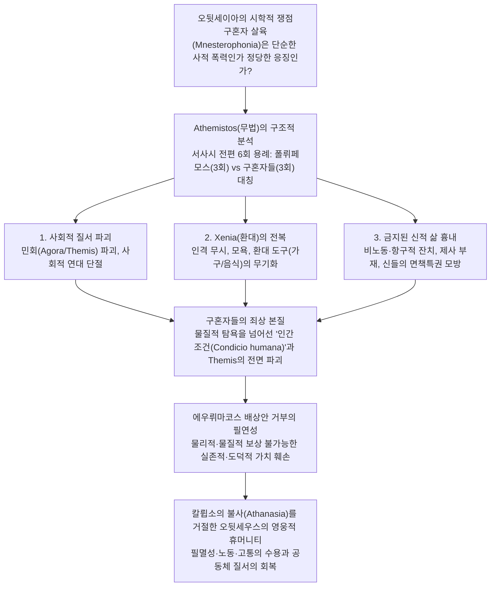

# 호메로스의 휴머니티 - 『오뒷세이아』의 구혼자 살육을 중심으로 (*Heroic Vengeance and Homeric Humanity*)

> [!NOTE] 학술사적 의의 및 총평
> 이준석 연구원의 2016년 논문 「호메로스의 휴머니티 - 『오뒷세이아』의 구혼자 살육을 중심으로 -」(『가톨릭철학』 제27호)는 『오뒷세이아』 후반부의 중심 사건인 **구혼자 살육(Mnesterophonia)**의 윤리학적 본질을 문헌학적으로 해명한 기념비적 논문입니다. 저자는 현대 비평계의 구혼자 동정론(Whitman, Buchan, Zingg, Halverson, Felson-Rubin 등)이 영웅의 복수를 단순한 야만적 폭력이나 사적 보복으로 격하시킨 오류를 비판합니다.
>
> 텍스트 분석을 통해 **'무법(*athemistos*)'**이라는 핵심 형용사가 서사시 전체에서 오직 **폴뤼페모스(3회)**와 **구혼자들(3회)**에게만 3회씩 대칭적으로 쓰였음을 실증하고, 구혼자들이 저지른 죄상의 본질이 단순한 재산·왕권 탐욕이 아니라 **'사회적 고립, 타인 경시와 Xenia 전복, 황금시대 흉내를 통한 신적 면책특권 추구, 즉 인간 조건(condicio humana)과 테미스(Themis)의 전면적 파괴'**에 있음을 규명합니다. 따라서 오뒷세우스의 구혼자 살육은 칼륍소의 불사(Athanasia)를 거절하고 유한한 인간 조건을 수락한 영웅이 인간 사회의 질서를 회복하기 위해 수행한 불가피한 가치 투쟁임을 입증합니다.

---

## 1. 서지 정보 및 지성사적 맥락

- **저자**: 이준석 (Lee, Joon Seok) — 서울대학교 서양고전학 협동과정 (현재 한국방송통신대학교 교수).
- **출판 정보**: 『가톨릭철학』 제27호 (2016년 10월), pp. 5–34. (한국가톨릭철학회, DOI: `10.16895/cathp.2016.27.1.005`).
- **연구 방법론**:
  - 서사시 내 *themis* 및 부정 형용사 *athemistos*의 전수 조사(총 6회 용례 분석).
  - 민담(Folktale) 모티브와 대서사시 플롯의 문학 구조적 준별.
  - 퀴클롭스 에피소드(9권)와 이타카 궁전 에피소드(1~2권, 17~22권)의 구조주의적·문화인류학적 비교 분석.
- **지성사적 대립 구도**:
  - **현대 비평가들의 구혼자 옹호론 및 영웅 야만성론 비판**:
    - **C. 휘트먼(Whitman 1958) & M. 뷰컨(Buchan 2004)**: 오뒷세우스의 복수를 도덕적 정당성을 빙자한 피비린내 나는 폭력의 광기(*orgy of violence*)로 격하.
    - **R. 칭(Zingg 2005)**: 구혼자들은 아무도 죽이지 않은 젊은 귀족들이며, 오뒷세우스는 간헐적 폭발성 장애에 따른 맹목적 분노(*blinder Jähzorn*)로 살육을 자행했다고 주장.
    - **M. J. 올든(Alden 1987) & J. 핼버슨(Halverson 1985)**: 오디세우스의 사망이 추정되는 상황에서 구혼 행위는 합법적 오락이며, 음식 축내기 등은 배상 가능한 경범죄에 불과하다고 변호.
    - **N. 펠슨-루빈(Felson-Rubin 1994)**: 구혼자들의 내재적 인간성을 옹호하고 페넬로페에게 스톡홀름 증후군을 적용하려는 시도.
  - **독일·영미 고전문헌학의 정통적 해석 계승 및 독창적 종합**:
    - **U. 횔셔(Hölscher 1989)**: 민담과 달리 서사시는 악당의 죽음에 대한 도덕적 정당화(*moralische Rechtfertigung*)가 필수적임을 강조한 명제 계승.
    - **P. 비달-나케(Vidal-Naquet 1981, 1991)**: 황금시대의 '비노동(non-travail)'과 인간 조건의 대립 구조 원용.
    - **N. 오스틴(Austin 1975)** & **J. 레드필드(Redfield 1983)**: 퀴클롭스의 반사회성과 구혼자들의 초문화적 잔치(*hyper-cultural continuous feast*) 분석 접목.

---

## 2. 개념 비교 매트릭스 및 논증 계보도

### [폴뤼페모스(Polyphemus)와 구혼자들(Suitors)의 구조적 대비 매트릭스]

| 비교 층위 | 폴뤼페모스 (퀴클롭스족) | 이타카의 구혼자들 (안티노오스, 에우뤼마코스 등) |
|:---|:---|:---|
| **어휘적 표지** | **무법(*athemistos*, ἀθέμιστος)** 3회 귀속 (_Od._ 9.106, 9.189, 9.428) | **무법(*athemistos*)** 3회 귀속 (_Od._ 17.363, 18.141, 20.287) — **서사시 총 6회 전수 양분** |
| **사회적 고립과 회의 부재** | - 아고라(회의장)와 테미스의 전무 (_Od._ 9.112)<br/>- 동굴 속 개별 단절, 상호 무관심과 연대 불능 (_Od._ 9.113–115, 9.401–412) | - 20년간 민회 부재 (_Od._ 2.26–27)<br/>- 2권 민회 소집 시 텔레마코스·멘토르·할리테르시스 조롱 및 강제 해산 (_Od._ 2.242–252)<br/>- 백성들을 개체화·고립화시켜 사회를 해체 |
| **타인 경시와 인격 무시** | - 손님의 정체와 이름에 대한 무관심 (_Od._ 9.252–280)<br/>- 오디세우스의 '무인(*outis*)' 트릭에 맹목적으로 걸려듦 (_Od._ 9.366–367) | - 나그네를 '재앙, 부랑자, 대지의 짐'으로 부르며 인격 박탈 (_Od._ 17.446, 20.375–379)<br/>- 예언자 테오클뤼메노스, 하인 이로스(아르나이오스)의 본래 이름과 정체 무시 |
| **손님 환대([[concept-xenia|Xenia]])의 전복** | - 질문 순서 위반 (음식 제공 전 취조, _Od._ 9.252)<br/>- 반어적 접대선물: '맨 나중에 잡아먹기' (_Od._ 9.369–370)<br/>- 동료들을 포식하고 포세이돈에게 파멸 탄원 | - 멘테스(아테네)를 문간에 방치하고 향락 몰두 (_Od._ 1.102–155)<br/>- 거지 오디세우스와 이로스의 결투를 유희화 (_Od._ 18.34–41)<br/>- 편안함을 주어야 할 가구(발판)와 음식물을 흉기로 투척 (_Od._ 17.458–463) |
| **황금시대 모방 (비노동과 잔치)** | 신들이 베풀어준 자연적 풍요(*locus amoenus*) 속에서 자생적 작물 향유, 농경 부재 (_Od._ 9.106–111) | 타인(백성, 하인)에 대한 가혹한 노동 강요와 수탈을 통해 인위적으로 영구적 잔치 향유 (_Od._ 2.127–128, 20.118–119) |
| **불경(不敬)과 제우스 무시** | 제우스 크세니오스 탄원에 대해 "우리가 신들보다 강하다"며 공개적 능멸 (_Od._ 9.273–276) | 제우스 크세니오스의 이름을 지우고 익명의 신으로 격하 (_Od._ 17.446), 신들에게 단 한 번도 제사를 바치지 않음 |
| **신적 면책특권 모방과 배상 시도** | 신들의 경고를 무시하고 맹목 속에 살다가 눈을 잃음 | 아레스-아프로디테 간통 신화(_Od._ 8.344–358)처럼 타인의 오이코스 파괴 후 물질적 배상(소 20마리, 황금)으로 면책 시도 (_Od._ 22.55–64) |
| **대결의 본질** | 야만(Nature)과 문명(Culture)의 충돌 | **인간 조건(Condicio humana/Themis)을 파괴하는 자들과 수락하는 자의 가치 충돌** |

### [Mermaid 논증 구조도]



---

## 3. 논문의 핵심 테제 및 섹션별 정밀 분석

### 제1장: 구혼자 살육 (pp. 5–10)
- **제1.1절: 민담과 서사시**:
  - 장기 부재 후 귀향하여 아내를 되찾고 구혼자들을 응징하는 모티브는 전 세계적 민담의 원형임.
  - 그러나 민담에서는 악당의 처벌이 별도의 도덕적 설명 없이 자명하게 수용되는 반면, 호메로스의 대서사시에서는 살육을 정당화하는 치밀한 플롯과 도덕적 근거(*moralische Rechtfertigung*, Hölscher 1989)가 필수적으로 요구됨.
- **제1.2절: 복수의 정당성 문제**:
  - 기존 학계는 사회질서, 종교, 가문 회복, 오만([[concept-hybris|Hybris]]), 텔레마코스 살해 기도 등의 이유로 처벌의 정당성을 논해왔으나, 현대 비평가들(Whitman, Buchan, Zingg, Alden, Halverson, Felson-Rubin)은 구혼자들의 죄에 비해 살육이 과도한 폭력이라며 오디세우스를 비판함.
- **제1.3절: 왜 오뒷세우스는 타협을 거절하는가**:
  - 서시에서 제우스는 인간이 자신의 못된 짓으로 정해진 몫 이상의 고통을 자초한다고 선언함(_Od._ 1.32–34). 구혼자 살육이 사적 폭력이라면 제우스의 정의는 무의미해짐.
  - 살육 직전 에우뤼마코스는 축낸 재산 전액 배상과 각자 소 20마리 값, 청동과 황금을 얹어주겠다는 파격적 경제적 타협안을 제시함(_Od._ 22.55–64). 이를 수용하면 구혼자 가문들의 경제적 기반을 무너뜨리고 오디세우스의 오이코스를 복원할 수 있음에도, 오디세우스는 이를 일축하고 전원 살육을 감행함.
  - 이는 구혼자들의 죄가 물리적으로 회복할 수 없는 **'인간 가치와 테미스([[concept-themis|Themis]])의 전면적 파괴'**에 이르렀기 때문임.

### 제2장: 폴뤼페모스와 구혼자들 (pp. 10–26)
- **제2.1절: 무법 (Themis와 Athemistos)**:
  - 오디세우스는 불충한 하녀들을 보고 분노를 삭이며 폴뤼페모스의 동굴에서 겪은 고통을 상기함(_Od._ 20.18–19). 두 사건은 내적으로 결합되어 있음.
  - **테미스([[concept-themis|Themis]])**: 가족(부자, 부부), 이웃, 손님 접대, 제사, 신에 대한 경외 등 인간 관계 전반의 윤리적 가치를 판단하는 근본 기준.
  - **아테미스토스(*athemistos*, ἀθέμιστος, 무법한/테미스가 없는)**: 서사시 전체에서 정확히 6번 쓰이며, 폴뤼페모스에게 3번(_Od._ 9.106, 9.189, 9.428), 구혼자들에게 3번(_Od._ 17.363, 18.141, 20.287) 양분되어 사용됨. 두 존재는 본질적으로 동일한 반(反)인간적 무법성을 공유함.
- **제2.2절: 사회적 고립 (Agora의 부재)**:
  - 퀴클롭스 사회는 회의장(Agora)과 법(Themis)이 없고 각자 동굴에 단절되어 상호 연대할 능력이 없음(_Od._ 9.112–115, 9.401–412).
  - 이타카 역시 오디세우스 부재 20년간 민회가 열리지 않음(_Od._ 2.26–27). 2권에서 텔레마코스가 소집한 민회에서 구혼자들(안티노오스, 에우뤼마코스, 레오크리토스)은 제우스와 테미스를 모욕하고 민회를 폭력적으로 강제 해산시킴(_Od._ 2.242–252). 이타카인들은 퀴클롭스들처럼 상호 연대 없이 고립된 방관자로 전락함.
- **제2.3절: 타인에 대한 경시와 크세니아([[concept-xenia|Xenia]])의 파괴**:
  - 폴뤼페모스는 손님의 이름에 무관심하고, 음식 대접 전에 취조하며(_Od._ 9.252), '나중에 잡아먹겠다'는 반어적 접대선물을 줌(_Od._ 9.369–370).
  - 구혼자들은 나그네를 '부랑자, 먹보, 대지의 짐'으로 부르며 인격을 박탈함(_Od._ 20.375–379). 예언자 테오클뤼메노스를 무시하고, 아르나이오스를 '이로스'라는 조롱 섞인 별명으로만 부름.
  - 멘테스(아테네)를 문간에 방치하고(_Od._ 1.102–155), 이로스와 오디세우스의 싸움을 유희거리로 만들며(_Od._ 18.34–41), 손님을 편안하게 해야 할 발판(가구)과 소 발굽(음식)을 무기로 던져 폭행함(_Od._ 17.458–463, 20.287–302).
- **제2.4절: 운명을 넘어 (황금시대와 신과 같은 삶의 흉내)**:
  - **황금시대 모방**: 퀴클롭스는 자연적 로쿠스 아모에누스(_locus amoenus_, _Od._ 9.106–111)에서 노동 없이 살아가지만, 구혼자들은 남들에게 노동을 강요하고 수탈함으로써 인위적 황금시대(비노동과 매일의 잔치)를 영위함(_Od._ 2.127–128, 14.193–195, Vidal-Naquet 1981).
  - **불경(不敬)과 제사 부재**: 풍요에 젖어 결핍을 모르는 자들은 신을 필요로 하지 않음. 폴뤼페모스가 제우스 크세니오스를 공개 능멸했듯(_Od._ 9.273–276), 구혼자들은 제우스 크세니오스의 이름을 지우고 익명의 신으로 폄하하며(_Od._ 17.446), 서사시 전체에서 신들에게 단 한 번도 제사를 바치지 않음.
  - **신과 같은 삶과 면책특권 모방**: 구혼자들의 진짜 목적은 왕권이나 결혼 자체가 아니라, 신들처럼 걱정 없고 수월한 삶(*rheidia zôontes*, _Od._ 6.46, 1.159–160)을 영구히 지속하는 것임.
  - **에우뤼마코스 배상안의 신화적 배경**: 8권 아레스-아프로디테 간통 신화에서 포세이돈이 배상금을 보증하여 신들이 '그치지 않는 웃음'으로 무마되듯(_Od._ 8.344–358), 에우뤼마코스는 인간의 결혼 파괴를 신들의 면책특권 방식으로 해결하려 함. 인간 세계에서 이는 통용될 수 없는 신성모독적 위선임.

### 제3장: 맺음말 (pp. 26–29)
- **오뒷세우스의 결단**: 5권에서 칼륍소의 불사(Athanasia) 제안을 거절하고 고통과 늙음, 죽음이 지배하는 인간의 현실 세계로 돌아오기를 선택함(_Od._ 5.202–224).
- **호메로스의 휴머니티(Humanity)**:
  - 인간의 조건(**콘디키오 후마나, *condicio humana***)이란 유한성, 노동, 고통, 죽음을 피할 수 없다는 자각임.
  - 구혼자들은 인간의 한계를 부정하고 테미스를 파괴하며 신처럼 살고자 퇴행한 자들이며, 오디세우스는 인간 조건을 영웅적으로 수락한 자임.
  - 따라서 구혼자 살육은 단순한 복수가 아니라, 파괴된 인간 가치와 테미스를 회복하기 위한 불가피한 문명사적 가치 투쟁임. 호메로스의 휴머니티는 죽음과 필멸성의 각성을 통해 정의됨.

---

## 4. 문헌학적 어휘 사전 및 희랍어 개념 주해

- **테미스 (Themis, θέμις)**: 전해 내려온 관습, 도리, 마땅히 행해야 할 바. 가족 관계, 손님 환대, 제사, 신에 대한 경외 등 인간 사회의 질서를 지탱하는 도덕적·제도적 근본 원리.
- **아테미스토스 (Athemistos, ἀθέμιστος)**: 무법한, 테미스가 결여된. 『오뒷세이아』 전편에서 정확히 6번 쓰이며 폴뤼페모스(3회)와 구혼자들(3회)에게만 한정된 핵심 고발 어휘.
- **크세니아 (Xenia, ξενία)**: 낯선 이방인과 나그네를 환대하여 친구로 변화시키는 신성한 손님-주인 규범. 제우스 크세니오스(Zeus Xenios)가 직접 수호함.
- **아타나시아 (Athanasia, ἀθανασία)**: 불사(不死). 신들의 고유 속성. 칼륍소가 오디세우스에게 제안했으나 오디세우스가 인간 조건으로 귀환하기 위해 거절함.
- **콘디키오 후마나 (Condicio humana)**: 인간의 조건. 필멸성, 노동의 의무, 상실과 고통을 떠안아야 하는 유한한 인간 실존의 본질.
- **로쿠스 아모에누스 (Locus amoenus)**: 마법적 풍요가 넘치는 이상적 낙원. 퀴클롭스의 땅처럼 노동 없이 만물이 자라나는 공간.

---

## 5. 서사시 에피소드 정밀 매핑 테이블

| 권·행 번호 | 핵심 서사 사건 | 논문의 분석 및 폴뤼페모스-구혼자 대비 구조 |
|:---|:---|:---|
| _Od._ 1.32–34 | 제우스의 서시 선언 | 인간이 자신의 못된 짓으로 정해진 몫 이상의 고통을 자초함 (구혼자 처벌의 도덕적 정당성) |
| _Od._ 1.102–155 | 멘테스(아테네)의 궁전 방문 | 손님을 문간에 방치하고 자기 향락에 몰두하는 구혼자들의 최초의 [[concept-xenia|Xenia]] 전복 |
| _Od._ 1.159–160 | 텔레마코스의 탄식 | 남의 살림을 벌도 받지 않고 먹어치우며 신들처럼 걱정 없이 살아가는 구혼자들의 행태 고발 |
| _Od._ 2.26–27 | 20년 만의 민회 소집 | 이타카 사회의 20년간 회의 부재 = 퀴클롭스 사회의 회의장(Agora) 부재와 동일 |
| _Od._ 2.242–252 | 레오크리토스의 민회 강제 해산 | 테미스 여신과 제우스의 권위를 무시하고 사회적 소통과 연대를 파괴하는 구혼자들 |
| _Od._ 5.202–224 | 칼륍소의 불사(Athanasia) 제안 거절 | 고통과 죽음이 있는 현실 인간 세계로의 귀환을 선택하는 오디세우스의 영웅적 인간 조건 수락 |
| _Od._ 6.46 | 올림포스 신들의 삶 묘사 | 걱정 없이 날마다 즐거운 삶을 누리는 신들의 존재 방식 (*rheidia zôontes*) |
| _Od._ 8.344–358 | 데모도코스의 아레스-아프로디테 노래 | 신들의 간통과 포세이돈의 배상금 보증 → 신들의 면책특권을 인간 세계에 적용하려는 에우뤼마코스의 위선과 대비 |
| _Od._ 9.106–115 | 퀴클롭스 사회 묘사 | *athemistos* 첫 용례, 회의와 테미스의 부재, 동굴 속 개체화 및 단절 |
| _Od._ 9.252–276 | 폴뤼페모스의 오디세우스 심문 | 식사 전 질문, 제우스 크세니오스 능멸 ("우리가 신들보다 강하다") |
| _Od._ 9.366–370 | 오디세우스의 '무인(*outis*)' 트릭 | 타인 정체에 무관심한 폴뤼페모스의 맹목과 '맨 나중에 잡아먹겠다'는 반어적 접대선물 |
| _Od._ 17.446, 17.458–463 | 안티노오스의 거지 폭행 | 제우스 크세니오스를 익명화하고 손님에게 안락을 주어야 할 발판을 던져 폭행 |
| _Od._ 18.34–41 | 이로스와 오디세우스의 결투 조장 | 손님의 안전을 지켜야 할 주인이 손님 간의 유혈 결투를 유쾌한 잔치 오락으로 삼음 |
| _Od._ 20.18–19 | 오디세우스의 인내 독백 | 불충한 하녀들을 보며 폴뤼페모스 동굴의 고통을 상기하고 복수를 결심함 (두 사건의 내적 연결) |
| _Od._ 22.55–64 | 에우뤼마코스의 물질적 배상 제안 | 소 20마리와 황금 배상안 일축 → 인간 가치와 테미스 파괴는 물질로 청산 불가능 |
| _Od._ 22.389 | 구혼자 108명의 시체 무더기 | 참혹한 살육의 현장에서 드러나는 역설적 휴머니티 (인간 삶과 테미스 질서의 완전한 복원) |

---

## 6. 학술 논쟁 및 비판적 지형도

### [구혼자 살육의 성격을 둘러싼 학술 대립 지형도]

```
[구혼자 옹호론 및 영웅 야만성론 (Modern Revisionists)]
Whitman (1958) / Buchan (2004) / Zingg (2005) / Halverson (1985) / Alden (1987) / Felson-Rubin (1994)
- 구혼자들은 살인도 하지 않은 젊은 귀족들이며 배상 가능한 경범죄에 불과함
- 오디세우스의 살육은 간헐적 폭발 장애 및 도덕적 정당성을 빙자한 피비린내 나는 폭력의 광기(Orgy of violence)
                  vs
[테미스 파괴와 우주적 응징론 (Traditional & Structural Philology)]
Hölscher (1989) / Rutherford (1986, 1992) / Vidal-Naquet (1981) / Austin (1975) / 이준석 (2016)
- 서사시 플롯상 도덕적 정당화(Moralische Rechtfertigung)는 필수불가결함
- athemitos 6회 전수 분석: 구혼자들은 폴뤼페모스처럼 테미스와 민회를 파괴한 무법자들
- 신들의 불로무노동과 면책특권을 흉내 내며 인간 조건(Condicio humana)을 유린함
- 물질적 배상 거부는 인간 가치의 훼손을 청산하기 위한 필연적 조치
- 구혼자 살육은 파괴된 인간 삶과 공동체 테미스를 회복하는 영웅적 휴머니티의 발현
```

---

## 7. 연구 질문 및 토론 쟁점

1. **아테미스토스(Athemistos)의 대칭 구조**: 서사시 전체에서 오직 폴뤼페모스(3회)와 구혼자들(3회)에게만 이 단어가 사용되었다는 문헌학적 사실은, 호메로스가 이타카의 궁전 상황을 괴물의 동굴과 동일한 '문명 붕괴의 위기'로 설정했음을 어떻게 증명하는가?
2. **에우뤼마코스 배상안 거절의 윤리학**: 에우뤼마코스의 막대한 경제적 배상 제안을 거절하고 살육을 선택한 오디세우스의 결단은, 근대적 공리주의/형벌론과 고대 호메로스식 테미스([[concept-themis|Themis]])/오이코스 정의관 사이에 어떤 본질적 차이가 있음을 보여주는가?
3. **불사(Athanasia) 거절과 휴머니티**: 칼륍소의 불사 제안을 거절한 5권의 선택과 구혼자들을 몰살시킨 22권의 결투는 '인간 조건(Condicio humana)의 수락과 수호'라는 관점에서 어떻게 하나의 철학적 일관성으로 묶이는가?

---

## ## 관련 항목

- [[lee-junseok-2024-iliad-jeongam]]
- [[lee-junseok-2018-wrath-and-pity]]
- [[lloyd-jones-1971-justice-of-zeus]]
- [[redfield-1975-nature-and-culture]]
- [[cairns-1993-aidos]]
- [[homeric-ethics-literature-review]]
- [[concept-themis|Themis]]
- [[concept-xenia|Xenia]]
- [[concept-dike|Dike]]
- [[concept-aidos|Aidos]]
- [[concept-nemesis|Nemesis]]
- [[concept-moira|Moira]]
- [[concept-hybris|Hybris]]
- [[entity-odysseus|오디세우스]]
- [[entity-zeus|제우스]]
