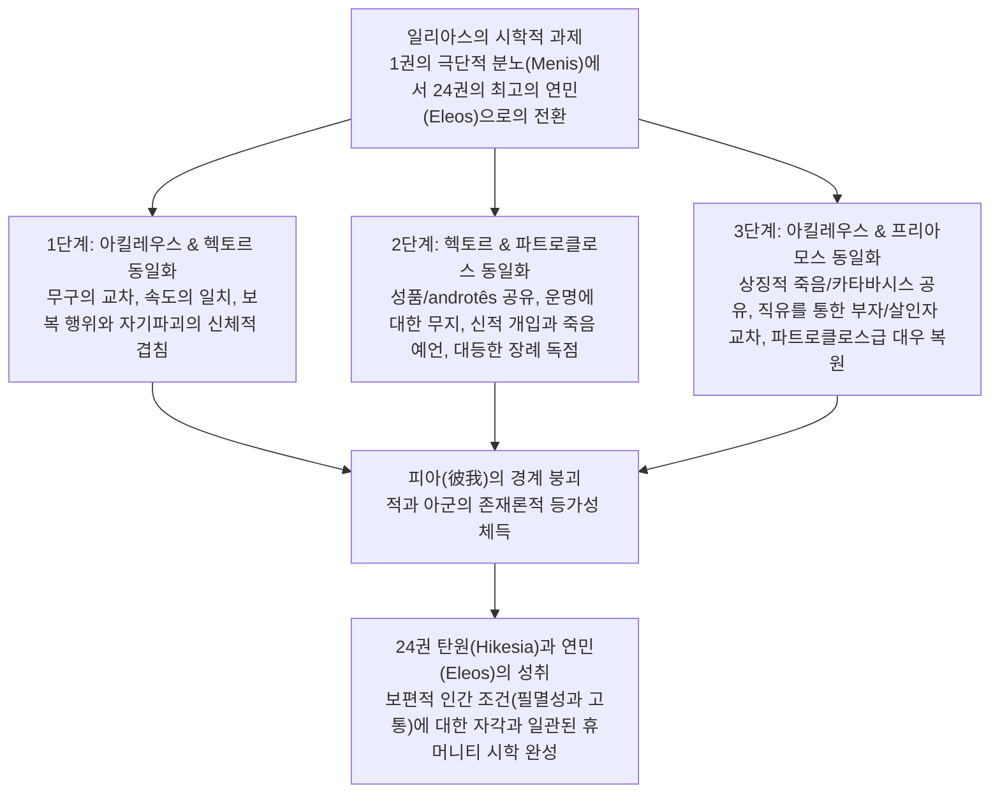

# 분노의 서사시, 연민의 서사시 『일리아스』 (*The Iliad, the Poem of Wrath and Pity*)

> [!NOTE] 학술사적 의의 및 총평
> 이준석 교수의 2018년 논문 「분노의 서사시, 연민의 서사시 『일리아스』」(『가톨릭철학』 제31호)는 『일리아스』의 서사적 통일성과 시학의 핵심이 **분노([[Menis]])**에서 **동정심/연민([[Eleos]])**으로의 질적 전이에 있음을 논증한 한국 고전문헌학계의 대표적 연구입니다. 저자는 아킬레우스의 정서 전환이 우연하거나 급작스러운 단절이 아니라, **아킬레우스-헥토르**, **헥토르-파트로클로스**, **아킬레우스-프리아모스** 사이에 치밀하게 배치된 **'피아(彼我)를 허무는 3단계 상호 동일화(Identification)'** 구조를 통해 준비되었음을 텍스트 실증으로 입증합니다. 이를 통해 19세기 분석론(Wolf, Lachmann, Wilamowitz)의 다중저자설(24권 편집자 첨가론)과 현대 구송시학(Lord, Foley)의 기계적 유형 장면론을 넘어서는 단일 시인의 일관된 '인간성(휴머니티)의 시학'을 정립합니다.

---

## 1. 서지 정보 및 지성사적 맥락

- **저자**: 이준석 (Lee, Joon Seok) — 한국방송통신대학교 교수, 서양고전학(호메로스 서사시 및 고대 그리스 도덕철학) 전문 연구자.
- **출판 정보**: 『가톨릭철학』 제31호 (2018년 10월), pp. 35–57. (한국가톨릭철학회, DOI: `10.16895/cathp.2018.31.1.035`).
- **연구 방법론**:
  - 『일리아스』 전 24권에 걸친 정서 궤적, 무구 묘사, 전투 및 결투 장면, 죽음 직전의 예언 공식구, 애도 및 장례 의례의 구조적·어휘적 비교 분석.
  - 호메로스 시학의 내적 정합성에 기반한 문학적·철학적 해석학.
- **지성사적 대립 구도**:
  - **19세기 분석론(Analysis) 비판**: F. A. 볼프(Wolf 1795), K. 라흐만(Lachmann 1874), U. 폰 빌라모비츠-묄렌도르프(Wilamowitz 1916), P. 폰 데어 뮐(von der Mühll 1952) 등 분노로 시작해 연민으로 끝나는 서사 구조를 이해하지 못하고 '2개의 분노 시 + 무능한 후대 편집자의 24권 에필로그 덧붙임'으로 규정한 다중저자론을 문헌학적으로 반박.
  - **현대 구송시학(Oral Poetics) 비판 및 한계 지적**: A. B. 로드(Lord 1995), J. M. 폴리(Foley 1999, 2002) 등 남슬라브 구전 서사시와의 기계적 비교를 통해 무장 장면이나 전개 순서를 '전형적 패턴(선과 악의 대결, 타지 출정)'으로만 환원하려는 시각 비판. 호메로스는 적 진영(헥토르)의 무장에도 동일한 파토스를 부여하고 양편을 동등한 무게로 다룸으로써 전통적 구송 패턴을 초월함.
  - **통일론(Unitarianism) 및 파토스/동정심 연구의 계승·심화**: W. 부르케르트(Burkert 1955), C. W. 매클라우드(Macleod 1982), J. 그리핀(Griffin 1976, 1980), R. B. 러더퍼드(Rutherford 2001), G. W. 모스트(Most 2003) 등의 동정심/비극성 연구를 '3단계 동일화 메커니즘'으로 체계화.

---

## 2. 핵심 테제 및 3단계 동일화 매트릭스

### [아킬레우스 중심 3단계 동일화(Identification) 매트릭스]

| 동일화 쌍 | 서사적 계기 및 장면 | 주요 메커니즘 및 텍스트 증거 | 시학적·윤리학적 함의 |
|:---|:---|:---|:---|
| **1. 아킬레우스 & 헥토르** | 17~22권 결투 및 시신 모욕 | - **죽음 상징 무장**: 아킬레우스의 옛 불멸 무구를 입은 헥토르(_Il._ 17.201–208) vs 방패에 새겨진 삶의 부고를 안고 싸우는 아킬레우스(_Il._ 18.478–608)<br/>- **추격자와 도망자**: '발 빠른' 두 영웅의 성벽 3회 질주(_Il._ 22.131–208)<br/>- **보복과 자기파괴**: 헥토르의 발꿈치 관통(_Il._ 22.395–405) vs 파리스 화살의 치명 부위, 엎드려진 헥토르 시신(_Il._ 22.24–25) vs 먼지에 뒹굴며 얼굴을 파묻은 아킬레우스(_Il._ 23.225, 24.10) | 자신이 또 다른 자신을 추격하여 죽이는 형국. 적에 대한 살육이 곧 자기 파멸과 동일선상에 놓임 |
| **2. 헥토르 & 파트로클로스** | 16~17권, 22권 죽음과 장례 | - **성품과 어휘 독점**: 다정함과 상냥함, 전사적 '남자다움(*androtês*)' 어휘의 서사시 내 유일한 공유(_Il._ 16.857, 22.363, 24.6)<br/>- **임박한 운명에 대한 무지**: 샤데발트의 *unwissend todbefangene*(_Il._ 16.46–47, 18.305–309)<br/>- **닮은 죽음**: 신적 개입에 의한 치명타(아폴론 vs 아테네), 숨 거두기 직전 상대의 죽음 예언(_Il._ 16.843–854, 22.355–360)<br/>- **아킬레우스 무구 착용**: 둘 다 아킬레우스 갑옷을 입고 전사<br/>- **대등한 장례 독점**: 서사시에서 유일하게 세부 묘사된 개인 장례, 아킬레우스가 부여한 12일 임시 휴전(_Il._ 24.656–672) | 가장 사랑하는 벗과 그 벗을 죽인 원수에게 동등한 명예와 장례를 부여. 두 죽음의 존재론적 등가성 확립 |
| **3. 아킬레우스 & 프리아모스** | 24권 야간 막사 대면과 탄원 | - **상징적 죽음 공유**: 먼지/분뇨 뒹굴기, 금식(Sitos 거부), 프리아모스의 적진 침투는 산 자의 저승 여행(**카타바시스, Catabasis**)과 헤르메스의 호위(_Il._ 24.331이하)<br/>- **직유를 통한 상실 교차**: 자식을 잃고 뼈를 태우는 아비의 모습으로 직유된 아킬레우스(_Il._ 23.222–225) vs 맹목적 살인 후 도피한 자로 직유된 프리아모스=파트로클로스(_Il._ 24.480–484, 23.85–90)<br/>- **파트로클로스와 프리아모스의 등가 대우**: 독대 의논, 청에 대한 절대적 확약(_Il._ 23.95–96, 24.669–670), 9권 잠자리의 회복(포이닉스·파트로클로스 → 프리아모스, _Il._ 24.673–678) | 원수와 적의 아버지가 가장 사랑하는 벗이자 아버지와 같은 존재로 치환됨. 분노가 보편적 필멸성에 대한 연민으로 승화 |

### [Mermaid 논증 구조도]



---

## 3. 논문의 핵심 테제 및 섹션별 정밀 분석

### 제1장: 들어가는 말 (pp. 35–37)
- **아킬레우스의 비범성과 정서의 위력**: 아킬레우스의 위대함은 무력 이전에 그의 강력한 '정서'에 있음. 그의 분노 하나로 서사시 전체의 틀이 형성됨.
- **분노의 2단계 맹렬한 전환**: 1차 분노는 아가멤논을 향해 희랍군을 전멸 위기로 몰아넣고, 2차 분노는 파트로클로스의 죽음으로 헥토르를 향해 폭발함.
- **분노를 잠재우는 연민의 궤적**: 영웅시의 일반적 문법과 달리 보복과 응징으로 끝나지 않고 연민으로 귀결됨. 1권 자기연민 매몰 → 16권 파트로클로스에 대한 첫 동정심(16.5) → 23권 전우들에게로 확산 → 24권 원수의 아버지 프리아모스에게로의 최고조 확장.

### 제2장: 아킬레우스와 헥토르 (pp. 37–43)
- **제2.1절: 죽음을 상징하는 무장**:
  - 제우스의 계획(_Il._ 15.59–71)에서 살해자 아킬레우스와 피살자 헥토르는 질적 차이가 없음. 헥토르를 죽이는 것은 곧 자신의 죽음을 앞당기는 행위임.
  - 헥토르가 파트로클로스에게서 벗겨 입은 아킬레우스의 불멸의 무장(_Il._ 17.201–208)은 그의 목숨 값이며 임박한 죽음의 확정임.
  - 헤파이스토스가 제작한 새 무구, 특히 방패(_Il._ 18.478–608)는 아킬레우스가 전쟁으로 인해 영원히 누리지 못하고 잃어버리게 될 일상적 인간 삶 전체(자연, 결혼식, 재판, 농경, 축제)의 목록이며, 그 자체로 **'아킬레우스의 부고(訃告)'**임. 아킬레우스는 자신의 부고를 안고 전장에 나섬.
- **제2.2절: 추격자와 도망자**:
  - '발 빠른(podas ôkys)' 아킬레우스와 그에게 쫓기는 헥토르가 트로이아 성벽을 3바퀴 질주하는 장면(_Il._ 22.131이하)은 평화 시절과의 비극적 대조이자 두 영웅의 속도 동일화임. 헥토르 역시 아킬레우스만큼 빠르며 요절할 자임.
  - 헥토르가 아킬레우스의 갑옷을 입고 있으므로, 관객들의 시선에서는 '자신이 또 다른 자신을 추격하여 죽이는' 형국임.
- **제2.3절: 이어지는 보복과 자기파괴**:
  - 헥토르의 발꿈치를 뚫어 전차에 매다는 모욕(_Il._ 22.395–405)은 아킬레우스 자신이 파리스의 화살을 맞고 죽을 치명적 급소('아킬레스건')와 일치함.
  - 파트로클로스를 화장하던 밤, 아킬레우스가 통곡하며 땅바닥을 기어다니고(_Il._ 23.225) 얼굴을 파묻고 엎드리는 동작(_Il._ 24.10)은 진흙탕에 얼굴이 바닥을 향해 내팽개쳐진 헥토르의 시신 모습(_Il._ 22.24–25, 24.16–18)과 신체적 동일화를 이룸.

### 제3장: 헥토르와 파트로클로스 (pp. 43–47)
- **전사적 특성과 성품의 공유**:
  - 전장에서 독특하게도 다정하고 상냥한 성품을 지님(_Il._ 17.204, 19.287–300 vs 6.390–493, 24.771이하).
  - 영웅의 전사적 특성을 가리키는 **'남자다움(*androtês*, ἀνδρότης)'**이라는 희랍어 단어가 서사시 전체에서 오직 헥토르와 파트로클로스 두 사람의 죽음 장면에만 독점 사용됨(_Il._ 16.857, 22.363, 24.6).
- **제3.1절: 임박한 운명을 알지 못하는 자들**:
  - 아킬레우스는 요절할 운명을 알고 죽을 준비가 된 자(*der wissend todbereite*)인 반면, 헥토르와 파트로클로스는 자신의 죽음을 모른 채 파멸로 돌진하는 자(*der unwissend todbefangene*)임(Schadewaldt 1959).
  - 파트로클로스는 동료에 대한 연민으로 출전을 간청하나 실상은 '죽음의 여신을 애원한 꼴'이 되었고(_Il._ 16.46–47), 헥토르는 아킬레우스를 이길 수 있다는 헛된 희망을 품음(_Il._ 18.305–309, 22.109–130).
- **제3.2절: 서로를 닮은 죽음**:
  - 신의 개입으로 치명타를 맞음(파트로클로스: 아폴론의 무장 해제 / 헥토르: 데이포보스로 변장한 아테네의 기만).
  - 숨을 거두기 직전 승자에게 임박한 죽음을 예언함(강대진의 '시인의 보상과 균형' 테제: 패자가 예언을 통해 승자의 현재 승리를 임박한 죽음으로 전환시킴).
  - 똑같이 아킬레우스의 갑옷을 입고 전사함.
  - 두 사람의 죽음 배경에는 모두 아킬레우스의 결정이 놓여 있음.
- **제3.3절: 죽음 이후의 대등한 장례**:
  - 『일리아스』에서 개인 장례가 상세히 묘사되는 인물은 오직 파트로클로스(23권)와 헥토르(24권)뿐임.
  - 아킬레우스는 파트로클로스의 장례를 치른 후, 24권에서 프리아모스에게 헥토르의 장례를 위해 12일간의 임시 휴전을 자진 제안함(_Il._ 24.656–672). 이는 전투 재개 날 자신의 죽음을 맞이하겠다는 결단이며, 사랑하는 벗과 원수에게 동등한 명예를 부여한 것임.

### 제4장: 아킬레우스와 프리아모스, 그리고 파트로클로스 (pp. 47–51)
- **제4.1절: 상징적인 죽음의 공유**:
  - 파트로클로스를 잃은 아킬레우스의 먼지 뒹굴기와 금식 = 헥토르를 잃은 프리아모스의 분뇨 더미 뒹굴기와 금식(_Il._ 22.412–429, 24.637–639).
  - 프리아모스의 한밤중 아킬레우스 막사 잠입은 목숨을 건 일종의 **'저승 여행(카타바시스, Catabasis)'**임(De Jauregui 2011). 망자를 저승으로 인도하는 헤르메스가 산 사람을 호위하는 유일한 장면(_Il._ 24.331이하).
- **제4.2절: 서로의 상실을 품고 만나다 (직유의 마법)**:
  - 23권 아킬레우스의 통곡 직유: 젊은 아들을 잃고 뼈를 태우는 '참담한 아비'의 모습(_Il._ 23.222–225) → 헥토르를 잃은 프리아모스의 고통을 환기시킴.
  - 24권 프리아모스의 탄원 직유: 맹목에 휩싸여 살인을 저지르고 타향 부잣집으로 도피한 자(_Il._ 24.480–484) → 어릴 적 살인을 저지르고 펠레우스 집으로 도피해 온 '파트로클로스'의 과거(_Il._ 23.85–90)와 정확히 겹침.
  - 두 사람은 한 지붕 아래서 각자 자신의 가장 뼈아픈 상실(펠레우스, 파트로클로스, 헥토르)을 품고 함께 통곡함(_Il._ 24.507–514).
- **제4.3절: 프리아모스와 파트로클로스의 치환**:
  - 소망의 일치: 파트로클로스를 안고 울고 싶은 아킬레우스의 소망 = 헥토르를 안고 울 수 있다면 죽어도 좋다는 프리아모스의 소망.
  - 아킬레우스의 태도 일치: 파트로클로스의 영혼에게 "네 말대로 다 이루어주마"(_Il._ 23.95–96) 확약 = 프리아모스에게 "요구하신 동안 전쟁을 막아두겠다"(_Il._ 24.669–670) 확약.
  - 9권 사절단 장면 잠자리의 복원: 포이닉스(아버지)와 파트로클로스(벗)와 함께 잠들었던 아킬레우스가, 파트로클로스 전사 후 불면과 악몽에 시달리다가, 24권에서 프리아모스를 막사에 뉘이고 비로소 정상적인 수면을 되찾음(_Il._ 24.673–678). 프리아모스는 아킬레우스에게 아버지이자 사랑하는 벗의 자리를 대체함.

### 제5장: 맺는 말 (pp. 51–54)
- **시학적 결론**: 분노에서 연민으로의 전환은 다층적인 상호 동일화 과정을 통해 치밀하게 기획된 단일 시인의 위대한 예술적 성취임.
- **학설 비판 총괄**:
  - 분석론의 '2개 분노 시 + 24권 편집자 가필설'은 호메로스의 유기적 시학을 보지 못한 맹목임.
  - 구송시학의 슬라브 서사시 비교 모델은 양 진영을 동등한 비극적 무게로 다루는 호메로스의 '동정심과 보상/균형의 시학'을 설명하지 못함.

---

## 4. 문헌학적 어휘 사전 및 희랍어 개념 주해

- **메니스 (Mênis, μῆ니스)**: 우주적 질서와 존재론적 명예가 침해되었을 때 발생하는 파괴적 분노. 1권의 아가멤논을 향한 분노에서 18권 이후 헥토르를 향한 살육전으로 전환됨.
- **엘레오스 (Eleos, ἔλεος)**: 타인의 비극적 고통에 직면하여 느끼는 동정심과 연민. 아킬레우스의 인간성 회복과 서사시 결말의 정서적 도달점.
- **안드로테스 (Androtês, ἀνδρότης)**: 용맹, 기백, 전사적 남자다움. 서사시 전체에서 오직 파트로클로스와 헥토르의 죽음 장면에만 제한적으로 쓰인 공식 어휘.
- **포다스 오퀴스 (Podas ôkys, πόδας ὠκύς / ποδάρκης)**: '발 빠른'. 아킬레우스의 대표 공식 형용사이나, 22권 성벽 추격전에서 헥토르와 아킬레우스 모두에게 부여된 속도와 요절 운명의 동일화 표지.
- **카타바시스 (Catabasis, κατάβασις)**: 저승으로의 하강/여행. 24권 프리아모스의 야간 적진 침투와 헤르메스의 호위는 산 자가 감행한 상징적 저승 여행의 구조를 띰.
- **스폰다이 (Spondai, σπονδαί)**: 헌주 및 조약/휴전. 24권 아킬레우스가 헥토르의 장례를 위해 프리아모스에게 베푼 12일간의 한시적 정전.

---

## 5. 서사시 에피소드 정밀 매핑 테이블

| 권·행 번호 | 핵심 서사 사건 | 논문의 분석 및 상호 동일화 메커니즘 |
|:---|:---|:---|
| _Il._ 15.59–71 | 제우스의 계획 선언 | 살해자 아킬레우스와 피살자 헥토르의 운명적 동등성(제우스 계획의 단계들) |
| _Il._ 16.46–47 | 파트로클로스의 출전 간청 | 운명을 알지 못한 채 죽음을 애원한 파트로클로스 (*unwissend todbefangene*) |
| _Il._ 16.843–854 | 파트로클로스의 전사 | 아폴론의 개입, 아킬레우스 갑옷 착용, 헥토르의 죽음에 대한 예언 |
| _Il._ 17.201–208 | 헥토르의 아킬레우스 갑옷 착용 | 제우스의 탄식, 아킬레우스 무구 착용과 헥토르 요절 운명의 확정 |
| _Il._ 18.88–93 | 아킬레우스의 복수와 죽음 결단 | 헥토르 살육과 자기 파멸을 동일선상에 놓는 아킬레우스의 실존적 선택 |
| _Il._ 18.478–608 | 헤파이스토스의 방패 제작 | 잃어버린 인간 삶 전체의 묘사이자 '아킬레우스의 부고(訃告)' |
| _Il._ 22.131–208 | 트로이아 성벽 3바퀴 추격전 | '발 빠른' 두 영웅의 속도 일치, 자신이 또 다른 자신을 추격하는 형국 |
| _Il._ 22.355–360 | 헥토르의 전사 | 아테네의 기만, 헥토르의 아킬레우스 죽음 예언 (시인의 보상과 균형) |
| _Il._ 22.395–405 | 헥토르 발꿈치 관통 및 능욕 | 파리스 화살이 적중할 아킬레우스 자신의 치명 급소와의 신체적 동일화 |
| _Il._ 23.85–90 | 파트로클로스 유년기 회상 | 주사위 놀이 중 살인을 저지르고 펠레우스 집으로 도피한 파트로클로스 |
| _Il._ 23.222–225 | 파트로클로스 화장 직유 | 아들의 뼈를 태우는 '참담한 아비' 아킬레우스 ↔ 프리아모스의 고통 연동 |
| _Il._ 24.10, 24.16–18 | 흙먼지에 얼굴을 파묻은 아킬레우스 | 바닥에 엎어진 헥토르 시신과의 세부 몸동작 동일화 |
| _Il._ 24.480–484 | 프리아모스 막사 진입 직유 | 살인을 저지르고 타향 부잣집으로 도피한 자 ↔ 파트로클로스의 과거 환기 |
| _Il._ 24.507–518 | 아킬레우스와 프리아모스의 통곡 | 서로의 상실(아버지/벗/자식)을 품고 흘리는 보편적 연민의 눈물 |
| _Il._ 24.656–672 | 12일 장례 휴전 제안 | 벗 파트로클로스와 원수 헥토르에게 동등한 명예와 장례 보장 |
| _Il._ 24.673–678 | 아킬레우스의 정상적 수면 복원 | 9권 포이닉스·파트로클로스의 자리를 프리아모스가 채움으로써 정서적 완결 |

---

## 6. 학술 논쟁 및 비판적 지형도

### [일리아스 통일성과 24권 해석을 둘러싼 학술 대립]

```
[19세기 분석론 (Analysis)]
F. A. Wolf (1795) / K. Lachmann (1874) / U. von Wilamowitz (1916)
- 아가멤논 분노 시 + 헥토르 분노 시의 기계적 결합
- 24권 연민 에피소드는 무능한 후대 편집자의 덧붙임
                  vs
[현대 구송시학 (Oral Poetics)]
A. B. Lord (1995) / J. M. Foley (1999, 2002)
- 남슬라브 전통 서사시의 유형 장면(Type-scenes)과 동일
- 영웅 무장 = 타지 출정과 적 응징의 공식 패턴
                  vs
[호메로스 시학과 3단계 동일화 (이준석 2018 / Macleod / Griffin)]
- 분노에서 연민으로의 전환은 3단계 동일화(Achilles-Hector-Patroclus-Priam)로 치밀하게 기획됨
- 적(헥토르)에게도 동등한 파토스와 무장 의미 부여
- 단일 시인의 일관된 인간성(휴머니티)의 시학 입증
```

---

## 7. 연구 질문 및 토론 쟁점

1. **방패 묘사와 영웅의 부고**: 18권 헤파이스토스의 방패에 새겨진 평화와 노동의 세계를 '아킬레우스의 부고(Obituary)'로 해석하는 관점은 영웅의 죽음 선택과 필멸성 자각에 어떤 해석학적 깊이를 더하는가?
2. **패자의 예언과 시인의 균형**: 파트로클로스와 헥토르가 죽음 직전 상대방 승자의 파멸을 예언하는 공식구는 호메로스가 승자와 패자를 도덕적·비극적 동등선상에 놓기 위해 고안한 '보상(Compensation)' 장치인가?
3. **프리아모스와 파트로클로스의 치환**: 24권에서 아킬레우스가 프리아모스를 대하는 태도(확약, 독대, 수면 복원)가 파트로클로스를 대하는 태도와 완벽히 겹친다는 점은, 호메로스 윤리학이 사적 애착을 넘어 '타자의 고통에 대한 보편적 연민'으로 도약했음을 어떻게 증명하는가?

---

## ## 관련 항목

- [[lee-junseok-2024-iliad-jeongam]]
- [[lee-junseok-2016-odyssey-humanity]]
- [[zanker-1994-heart-of-achilles]]
- [[redfield-1975-nature-and-culture]]
- [[vernant-1989-belle-mort]]
- [[shay-1994-achilles-in-vietnam]]
- [[homeric-ethics-literature-review]]
- [[Menis]]
- [[Hikesia]]
- [[Eleos]]
- [[Aidos]]
- [[Moira]]
- [[아킬레우스]]
- [[헥토르]]
