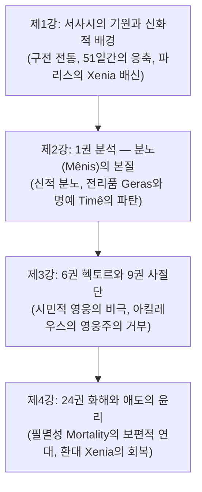

# [정암학당 서양고전강좌] 2024, 이준석 교수, 호메로스 『일리아스』 4회차 연속 집중강좌

> [!NOTE] 학술 강좌 개요 및 총평
> 본 문서는 2024년 사단법인 정암학당(연구자와 함께 고전 읽기)에서 진행된 **이준석 교수(한국방송통신대학교 문화교양학과 교수, 프랑스 파리 소르본 대학교 서양고전학 박사)**의 『일리아스』 4회차 연속 집중강좌(총 8개 영상, 약 8시간 분량)의 **18만 자 한국어 녹취 스크립트 전편을 정밀 해제한 학술 도시에**입니다. 프랑스 역사인류학 학파(장-피에르 베르낭, 마르셀 드티엔)와 현대 고전문헌학의 성과를 융합하여, 서사시의 탄생 배경부터 1권의 분노(Mênis), 6권/9권의 영웅 규범의 위기, 24권의 필멸성(Mortality)에 기초한 윤리적 승화에 이르는 전 과정을 심층 분석합니다.

---

## 1. 강좌 구성 및 재생목록 정보

- **강의 재생목록**: [정암학당 『일리아스』 4회 연속 집중강좌 YouTube 플레이리스트](https://youtube.com/playlist?list=PLRKwb98a2sFyO2GTs07s6a8k4ORNkDniA)
- **강의자 약력**: 이준석 교수 — 서울대학교 서양고전학 학사·석사, 프랑스 파리 소르본 대학교(Paris IV) 서양고전학 박사, 현 한국방송통신대학교 문화교양학과 교수 및 정암학당 연구원.
- **영상별 식별자 및 세부 정보**:
  1. **제1강 1부** (`n4KV-dmAOjA`) & **2부** (`L0LXKhUf4oE`): 호메로스 서사시의 탄생, 구전 전통, 트로이아 신화와 서사적 지형
  2. **제2강 1부** (`eYJSg2_A298`) & **2부** (`-knPi0jwGwY`): 1권 분석 — 아킬레우스의 분노(Mênis)와 아가멤논, 명예(Timê)와 전리품(Geras)의 역학
  3. **제3강 1부** (`6W_uxJNdPTc`) & **2부** (`FXgG__DkOMY`): 6권 헥토르의 고뇌와 9권 사절단의 파탄 — 영웅주의적 가치 체계의 내적 붕괴
  4. **제4강 1부** (`Bb-a0jQjGA4`) & **2부** (`_Lxvj3hbG2M`): 파트로클로스의 전사와 광기, 24권 프리아모스와의 극적 화해와 애도의 윤리

---

## 2. 강좌의 핵심 테제 및 논증 구조도

---

## 3. 회차별 심층 강의 스크립트 정밀 분석

### 제1강: 서사시의 탄생과 『일리아스』의 서사적 지형 (1부 & 2부)
1. **구전 전통(Oral Tradition)과 아오이도스(Aoidos)**:
   - 기원전 8세기 암흑기 말기 페니키아 문자의 도입과 함께 수백 년간 음유시인들에 의해 구전되던 트로이 전쟁 전승이 텍스트로 정착된 문헌사적 맥락 규명.
   - 밀먼 패리(Milman Parry)와 앨버트 로드(Albert Lord)의 정형구(Formula) 이론을 바탕으로 호메로스 언어의 시적 메커니즘 해설.
2. **51일간의 압축된 서사 구조**:
   - 10년 트로이아 전쟁 중 마지막 해의 단 **51일간의 사건**만을 다루며, 그중에서도 **실제 주된 전투는 단 '4일간'에 집중**되어 있음. 이는 역사적 연대기 기술이 아니라 인간 실존의 갈등과 비극성을 극도로 응축하기 위한 고도의 예술적 구성임.
3. **파리스의 크세니아([[concept-xenia|Xenia]]) 배신**:
   - 트로이 전쟁의 근본 원인은 메넬라오스의 손님으로 환대받았던 파리스가 안주인 헬레네와 보물을 훔쳐 달아남으로써 고대 문명의 신성한 국제 규범인 '환대(Xenia)'를 유린한 도덕적 범죄였음을 강조.

### 제2강: 1권 분석 — 아킬레우스의 분노(Mênis)와 영웅 윤리의 작동 원리 (1부 & 2부)
1. **신적 분노인 메니스([[concept-menis|Menis]])의 성격**:
   - 『일리아스』의 첫 단어인 *Mênis*(μῆνις)는 인간의 사적 화풀이(Cholos)가 아니라, 우주적 파괴력을 지니며 오직 신들에게만 귀속되는 절대적 분노임.
2. **티메([[concept-time|Timê]])와 게라스(Geras)의 존재론적 등가성**:
   - 영웅 사회에서 전리품(Geras)은 물질적 탐욕의 대상이 아니라, 전사가 목숨을 걸고 싸운 대가로 공동체로부터 공인받은 사회적 명예(Timê)이자 전사로서의 존재 이유 그 자체임.
   - 아가멤논이 최고 지휘관의 권력으로 브리세이스를 강탈한 것은 아킬레우스의 전사적 존재 가치를 전면 부정한 행위였음.
3. **제우스의 계획(Dios Boule)**:
   - 아킬레우스의 전선 이탈은 단순한 불복종이 아니라, 그리스 군단 전체가 자신의 부재를 통해 아킬레우스라는 영웅의 대체 불가능한 가치를 뼈저리게 깨닫도록 만드는 윤리적 복수극의 시작임.

### 제3강: 6권 헥토르의 고뇌와 9권 사절단의 파탄 (1부 & 2부)
1. **6권 헥토르의 시민적 영웅성(Aner Politikos)과 아이도스([[concept-aidos|Aidos]])**:
   - 헥토르는 아킬레우스와 달리 가족(안드로마케, 아스티아낙스)과 트로이 시민을 수호하는 '공동체의 영웅'임.
   - 트로이아의 필연적 멸망을 예감하면서도 시민들에 대한 부끄러움(Aidos) 때문에 성벽 안으로 피신하지 못하고 전장으로 향하는 헥토르를 통해, **영웅적 명예 추구가 공동체를 파멸로 이끄는 비극적 모순**을 조명.
2. **9권 사절단의 실패와 영웅주의의 거부**:
   - 오디세우스가 제시한 아가멤논의 물질적 배상은 대등한 화해가 아니라 아킬레우스를 굴복시키려는 위계적 선물임을 간파하고 거부함.
   - **실존적 회의**: *"용사나 비겁자나 똑같이 대우받고, 일한 자나 일하지 않은 자나 똑같이 죽는다."*(*Il.* 9.318–319) → 기성 영웅 사회의 도덕적 보상 체계 전체에 대한 근본적 부정.

### 제4강: 파트로클로스의 전사와 24권 화해 — 연민(Eleos)과 인간성의 회복 (1부 & 2부)
1. **분노의 전환과 버서크 광폭화**:
   - 가장 소중한 벗 파트로클로스의 전사로 인해 아가멤논에 대한 사적 분노는 헥토르에 대한 절대적 복수심으로 전환됨.
   - 신체적 고통의 무감각, 적에 대한 자비 없는 학살, 강물 스카만드로스를 시체로 메우는 야수화와 시신 훼손.
2. **24권 프리아모스와의 대면**:
   - 늙은 왕 프리아모스가 적진으로 찾아와 아들을 죽인 원수 아킬레우스의 손에 입을 맞추는 숭고한 탄원(Hikesia).
   - **필멸성(Mortality)의 보편적 연대감**: 아킬레우스가 자신의 늙은 아버지를 떠올리며 프리아모스와 함께 통곡함.
   - **윤리적 승화**: 신들이 인간에게 내린 피할 수 없는 고통과 죽음 앞에서 적대감을 초월한 깊은 연민(Eleos)과 환대([[concept-xenia|Xenia]])를 회복하고 헥토르의 시신을 정중히 인도함.

---

## 4. 서사시 전편 정밀 에피소드 매핑 테이블

| 서사시 권·행 번호 | 다루는 사건 및 인물 | 이준석 교수의 문헌학적·구조적 해석 |
|:---|:---|:---|
| ***Il.* 1.1–7** | **서사시 서두 (*Mênis*의 선언)** | 『일리아스』의 진정한 주제는 전쟁 자체가 아니라 '아킬레우스의 분노'이며, 이 분노가 가져온 비극적 파멸과 제우스의 뜻(Dios Boule)이 완성되는 과정임. |
| ***Il.* 6.440–465** | **헥토르의 출전 다짐** | "언젠가 신성한 일리오스가 멸망할 날이 오리라는 것을 나는 잘 알고 있소." 필연적 파멸을 알면서도 피할 수 없는 영웅의 실존적 비극. |
| ***Il.* 9.308–429** | **아킬레우스의 사절단 거부** | 삶과 죽음, 명예와 생명의 본질에 대해 질문하며 고대 영웅 사회의 도덕 규범 전체를 근본적으로 뒤흔든 최고의 철학적 사유의 장. |
| ***Il.* 24.485–506** | **프리아모스의 탄원 연설** | "아킬레우스여, 당신의 아버지를 생각하시오." 적대 관계를 뛰어넘어 공통의 부모와 자식, 죽음의 보편성으로 호소하는 서양 문학사 최고의 화해 장면. |

---

## 5. 연구 질문 및 세미나 토론 쟁점

1. **메니스(Mênis)의 신학적 성격**: 아킬레우스의 분노가 인간의 사적 감정(Cholos)이 아닌 신적 분노(Mênis)로 서술되는 서사적 장치는, 영웅의 지위를 인간과 신의 경계선상에 위치시키는 데 어떻게 기여하는가?
2. **환대(Xenia)의 윤리적 복원력**: 전쟁터라는 극단적 폭력의 시공간에서, 프리아모스와 아킬레우스가 맺는 크세니아는 적대적 국가 관계를 초월하는 인간 보편의 도덕률로서 어떤 현대적 평화철학적 함의를 갖는가?

---

## 관련 항목
- [[analysis-homeric-ethics-literature-review]]
- [[일리아스]]
- [[entity-achilles|아킬레우스]]
- [[entity-hector|헥토르]]
- [[concept-menis|Menis]]
- [[concept-time|Timê]]
- [[concept-aidos|Aidos]]
- [[concept-xenia|Xenia]]
- [[concept-arete|Arete]]
- [[concept-moira|Moira]]
- [[concept-themis|Themis]]
- [[shay-1994-achilles-in-vietnam]]
- [[redfield-1975-nature-and-culture]]
- [[zanker-1994-heart-of-achilles]]
- [[vernant-1989-belle-mort]]
