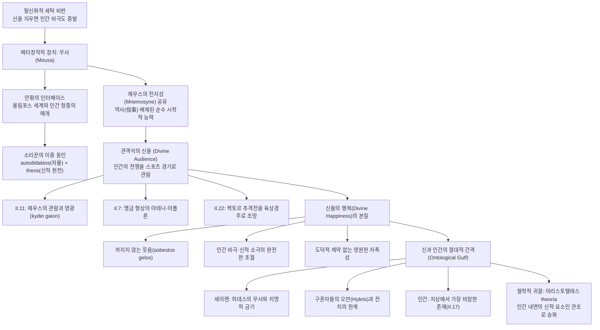

# 호메로스의 신들 — 관객석의 신들 (*Homeric Gods as Divine Audience*)

> [!NOTE] 학술사적 의의 및 총평
> 고대 그리스 철학 및 서양고전학의 태두 이태수 교수의 논문 「호메로스의 신들 — 관객석의 신들」(인문논총 77(1), 2020)은 현대 문학비평 및 대중문화(영화 트로이 등)에서 만연한 '탈신화적 세탁(Demythologizing Whitewash)'의 위험성을 고발하고, 호메로스 서사시에서 신들의 존재가 갖는 근본적인 존재론적·시학적 기능을 규명한 기념비적 역작입니다. 저자는 여신 무사(Mousa)를 작품 내부의 신적 세계와 외부의 인간 청중을 잇는 유일한 '메타창작적 인터페이스(Metapoetic Interface)'로 정립하고, 제우스의 기억(Mnemosyne)에서 비롯된 전지적 시야가 어떻게 서사적 노래로 번역되는지 추적합니다. 나아가 올림포스 신들이 인간의 참혹한 전쟁과 고통을 마치 스포츠 경기처럼 감상하며 '꺼지지 않는 웃음(asbestos gelos)'을 터뜨리는 장면들을 치밀하게 분석하여, 신적 행복(Divine Happiness)의 본질이 '인간의 고통을 안전한 관객석에서 심미적으로 관조하는 초연함'에 있음을 입증합니다. 이는 구약성서 창세기의 창조주 하나님이 보여주는 피조물에 대한 사랑 및 참여와 극명한 대비를 이루며, 인간이 신과의 절대적 간격(Ontological Gulf)을 인식할 때 비로소 자신의 비참함과 숭고한 영웅적 윤리를 자각하게 된다는 호메로스 인본주의의 정수를 밝혀냈습니다.

---

## 1. 서지 정보 및 학술사적 맥락

- **저자**: 이태수 (李泰洙, Lee Tae-Soo) — 전 서울대학교 철학과 교수, 대한민국학술원 회원, 고대 그리스 철학 및 서양고전학의 권위자. 독일 괴팅겐 대학교에서 귄터 파치히(Günther Patzig) 교수의 지도로 철학박사 학위를 취득하였으며, 아리스토텔레스 논리학·존재론, 헬레니즘 회의주의, 고대 서사시 시학 연구를 이끌었음.
- **출판 정보**: 『인문논총』(Journal of Humanities), 서울대학교 인문학연구원, 제77권 제1호, 2020년 2월 28일, pp. 15–39 (DOI: 10.17326/jhsnu.77.1.202002.15).
- **연구 방법론**:
  - 고전자료의 정밀한 문헌학적 독해(Philological Exegesis): 그리스어 원문 구절(*Il.* 1.1-2, 1.601-605, 11.80-83, 21.387-390, 22.157-166, *Od.* 1.1-2, 8.325, 22.347-348 등)의 어휘·형태론·통사론적 정밀 분석.
  - 서사학 및 메타시학(Metapoetics): 시인(aoidos)과 신(Mousa)의 관계, 작품 내적 발화와 외적 청중 간의 층위 분석(Irene de Jong의 초점화 이론 연계).
  - 존재론 및 철학적 신학(Philosophical Theology): 신적 행복(Divine Happiness), 필멸성(Mortality)과 불멸성(Immortality)의 대비, 아리스토텔레스의 관조(*theoria*) 개념과의 계보학적 연계.
  - 비교종교사적 조망: 헤브라이즘(창세기 1장의 창조주 하나님)과 헬레니즘(올림포스의 관객 신들)의 세계관 대비.
- **학술사적 계보 및 주요 학설과의 대화**:
  - **탈신화적 환원주의 비판**: 호메로스의 신들을 단순한 내면 심리(아테나 = 이성적 숙고, 용맹 불어넣음 = 심리적 흥분)로 치부하는 현대적 합리주의 경향을 '번안(Adaptation)'으로 규정하고 비판.
  - **행위자성(Agency) 논쟁의 재정립**: 브루노 스넬(Bruno Snell 1974)의 '신적 결정론 및 인간 꼭두각시설'을 극복하고, 버나드 윌리엄스(Bernard Williams 1993, *Shame and Necessity*)와 알빈 레스키(Albin Lesky 1961)의 이중 동인(Double Agency / Dual Causation) 모델을 소리꾼 페미오스의 자기 이해에 적용.
  - **관객으로서의 신(Divine Audience) 연구 계승 및 심화**: 재스퍼 그리핀(Jasper Griffin 1978, 1980)의 선구적 논의와 트래비스 마이어스(Travis Myers 2019, *Homer’s Divine Audience*), 제니 스트라우스 클레이(Jenny Strauss Clay 2011, *Homer’s Trojan Theater*)의 공간·시각 연구를 수용하되, 이를 '신적 행복론'이라는 철학적 차원으로 승화시킴.

---

## 2. 핵심 테제 매트릭스 및 개념·논증 구조도

### [핵심 테제 매트릭스]

| 분석 층위 | 현대적 탈신화화 / 상식적 편견 | 호메로스 텍스트의 본질적 실재 | 이태수(2020)의 독창적 통찰 |
|:---|:---|:---|:---|
| **신들의 존재론적 위상** | 서사적 장식물, 내면 심리의 외적 투사, 삭제 가능한 잉여 장치 (영화 트로이 모델) | 인간 행위자와 병렬하는 실재적 행위자이자 궁극적 인과성의 원천 | 신들을 지우면 '인간의 고통과 비극성' 자체가 증발함. 신은 인간을 비추는 절대적 대조면 |
| **무사(Mousa)의 역할** | 시인의 주관적 '영감(Inspiration)'에 대한 의례적·관용적 표현 | 제우스의 전지적 기억을 보존한 여신, 유일하게 작품 안팎을 넘나드는 존재 | 시인과 청중, 신적 세계를 잇는 '메타창작적 인터페이스'. 인간에게 신적 시야를 일시 대여함 |
| **소리꾼의 자의식** | 신의 수동적 발성기관(괴뢰)이거나, 혹은 완전히 자율적인 창작자 | "혼자 배웠으나 신이 마음에 곡을 심어주었다"(*Od.* 22.347)는 이중 동인 | 신적 전지와 인간적 기교의 공존. 무사의 정보를 시인의 재량으로 초점화하는 예술적 자율성 |
| **전쟁과 인간의 고통** | 신들의 정의(Dike) 집행 과정, 죄에 대한 징벌, 섭리적 훈련 | 목숨을 건 참극, 죽이고 죽임당하는 참상의 연쇄 | 신들에게 전쟁은 '초대형 스포츠/검투사 경기' 스펙터클. 잔혹한 유희의 대상 |
| **신들의 행복 (Divine Happiness)** | 도덕적 완성, 우주적 정의의 성취에서 오는 평정심 | 불멸성과 무고통에 안주하여 터뜨리는 '꺼지지 않는 웃음(*asbestos gelos*)' | 인간의 비극과 고통을 노래/스펙터클로 감상하면서도 자신의 안전을 확신하는 관객의 순수한 쾌락 |
| **신적 노래와 인간의 한계** | 누구나 자유롭게 향유할 수 있는 미적 유희 | 직접 들으면 파멸하는 치명적 금기 (세이렌 = 하데스의 무사) | 무사의 원초적 노래는 인간을 파멸시킴(세멜레 모티프). 시인을 통해 감쇄된 짧은 잔치만 허용됨 |
| **신관의 문명사적 대비** | 신은 세계를 사랑하고 인간의 구원을 도모하는 선한 존재 | 올림포스 신들은 인간의 비참함을 무대 삼아 영원한 축제를 누리는 냉혹한 관객 | 창세기 1장 31절("보시기에 심히 좋았더라")과 대비되는 '관객 신들의 냉담한 잔혹성'과 존재론적 간격 |

### [Mermaid 개념 및 논증 구조도]

---

## 3. 섹션별 정밀 분석

### 제1절: 탈신화적 세탁의 유혹과 한계 (pp. 16–22)
- **영화 <트로이>(2004)와 현대 합리주의의 맹점**:
  - 할리우드 영화 <트로이>는 신들의 역할을 전면 삭제했습니다. 현대 독자들에게 신들의 등장은 비합리적이고 껄끄러운 요소로 여겨지기 때문에, 이러한 '탈신화적 세탁'은 매력적으로 보입니다.
  - 실제로 신들을 지워도 서사의 외적 줄거리(아킬레우스의 분노, 트로이아 함락)는 성립합니다. 그러나 이는 호메로스 서사시의 본질적 정신(spirit)을 파괴합니다.
  - 신들을 제거하면 호메로스가 전하고자 했던 가장 근본적인 메시지, 즉 '신들과의 극명한 대비를 통해 드러나는 인간 존재의 유한성과 비극성'이 완전히 소멸하기 때문입니다.
- **심리학적 내재화(Internalization)의 오류**:
  - 아테나가 칼을 뽑으려는 아킬레우스의 머리채를 잡는 장면(*Il.* 1.190ff)을 '아킬레우스 내면의 이성적 숙고'로 환원하거나, 신이 용맹(*menos*, *tharsos*)을 불어넣는(*empneuein*, *emballein*) 것을 단순한 '심리적 열기'로 치부하는 해석은 고대인의 경험 세계를 왜곡하는 현대적 '번안(adaptation)'에 불과합니다.
- **브루노 스넬(Snell) 대 버나드 윌리엄스(Williams)**:
  - 브루노 스넬(1974)은 호메로스적 인간에게 자율적 영혼이나 결단 능력이 없으며 오직 신의 조종을 받는 피동적 꼭두각시(puppet)에 불과하다고 보았습니다.
  - 반면 버나드 윌리엄스(1993)와 알빈 레스키(1961)는 호메로스 서사시의 인간이 능동적인 행동의 주체이며, 하나의 행동에 인간과 신이 동시에 주체로 기능하는 '이중 동인(Double Agency / Dual Causation)' 구조를 가진다고 논증했습니다.
  - 소리꾼 페미오스의 발언은 이를 완벽하게 증명합니다:
    - *"나는 혼자 배웠지요. 신이 내 마음에 갖가지 곡을 심어주었지요."* (*Od.* 22.347-348)
      - **[원문]**: αὐτοδίδακτος δ᾽ εἰμί, θεὸς δέ μοι ἐν φρεσὶν οἴμας / παν토ίας ἐνέφυσεν.
      - **[주석]**: 페미오스는 자신의 주체적 학습(*autodidaktos*)과 신적 원천(*theos*)을 모순 없이 병치합니다. 인간의 기교와 신의 영감은 상호 배제적이지 않고 중첩됩니다.

### 제2절: 메타창작적 인터페이스로서의 무사(Mousa) (pp. 22–26)
- **작품 안팎을 넘나드는 유일한 존재**:
  - 만신전의 지배자 제우스를 포함한 올림포스의 모든 신들은 '작품 세계 내부'에만 머물러 있습니다. 스스로 작품 밖으로 나와 청중에게 자신을 알릴 수 있는 신은 단 한 명도 없습니다.
  - 오직 무사(Mousa)만이 서시(Invocation)를 통해 작품 내부의 신적 세계와 작품 외부의 인간 청중 세계를 잇는 '인터페이스(Interface)' 역할을 수행합니다.
- **기억(Mnemosyne)의 전승과 전지적 시야**:
  - 무사는 제우스가 기억의 여신 므네모쉬네와 결합하여 낳은 아홉 딸들입니다(Hesiod, *Theog.* 52-54). 따라서 무사는 제우스가 머릿속에 저장하고 있는 우주와 역사에 관한 전지적 앎을 그대로 물려받았습니다.
  - 세상 모든 곳에서 일어나는 사건을 직접 목도하고 기억하는 것은 오직 제우스만이 가능한 신적 전지성입니다. 소리꾼이 지어낸 거짓이 아닌 참된(*authentic*) 이야기를 전할 수 있는 근거는 바로 무사를 통해 제우스의 목격 증언을 전달받기 때문입니다.
- **무사의 무력성(無力性)과 시학적 직무**:
  - 무사가 제우스와 동일한 전지적 앎을 공유하면서도 제우스의 권력 독점과 충돌하지 않는 이유는, 무사가 그 앎을 바탕으로 세상사에 개입(역사, 役事)하지 않기 때문입니다.
  - 무사는 앎을 권력 행사의 수단이 아니라 오직 '남에게 노래해주는 직무'로만 사용합니다. 이 한가해 보이는 직무 덕분에 인간은 호메로스 서사시를 통해 '신적인 시야'를 일시적으로 향유할 수 있게 됩니다.

### 제3절: 세 가지 무사 에피소드와 서사시의 기본 기조 (pp. 24–27)
작품 내부에서 무사가 직접 언급되거나 등장하는 사례는 단 세 번뿐이며, 이는 호메로스의 고도의 메타창작적(metapoetic) 설계를 드러냅니다:

1. **타미뤼스(Thamyris)의 파멸 (*Il.* 2.594-600)**:
   - 선박 카탈로그에 삽입된 일화로, 자신의 노래 실력이 무사를 능가한다고 오만을 부린 트라키아의 소리꾼 타미뤼스를 무사들이 눈멀게 하고 신적인 노래 능력을 빼앗아 불구로 만듭니다.
   - **시학적 함축**: 신적 영역에 도전하는 인간 예술가의 한계와 신적 권위의 절대성을 경고합니다.
2. **아킬레우스 장례식의 애도 (*Od.* 24.60-61)**:
   - 지하세계에서 아가멤논이 회상하는 아킬레우스의 장례식에서, 어머니 테티스와 함께 9명의 무사가 강림하여 아름다운 화음으로 장송곡을 부릅니다.
   - **시학적 함축**: 제우스의 공식 사절로서 최고의 영웅에 대해 "하늘도 울었다"는 신적 경의를 표명합니다.
3. **올림포스의 연회와 꺼지지 않는 웃음 (*Il.* 1.601-605)**:
   - 제우스와 헤라의 격렬한 부부싸움으로 올림포스가 일촉즉발의 위기에 처하자, 헤파이스토스가 절름발이 걸음으로 술을 따르며 분위기를 반전시킵니다.
   - 올림포스의 복된 신들에게서 '꺼지지 않는 웃음(*asbestos gelos*)'이 터져 나오고, 아폴론의 뤼라 연주에 맞추어 무사들이 교대로 아름다운 노래를 부릅니다.
   - **서사시 전체의 기본 기조**:
     - *"이제부터 땅 위에는 큰 싸움판이 벌어져 수많은 인간들이 처참한 죽임을 당하는 불행의 폭풍이 불어닥칠 것이고, 그것과 상관없이 그것을 내려다보는 신들은 여전히 즐거운 잔치를 벌이며 행복하게 지낼 것이다. 이 극명한 대조가 일리아스의 전 작품을 관통하는 기본 구성 원리이다."* (p. 26)

### 제4절: 관객석의 신들과 스포츠 경기 관람 (pp. 27–32)
호메로스는 신들이 인간의 전쟁을 마치 '초대형 스포츠 경기'나 '검투사 시합'을 관람하듯 즐기는 모습을 충격적으로 묘사합니다:

- **홀로 영광을 즐기며 학살을 관람하는 제우스 (*Il.* 11.80-83)**:
  - *"그러나 아버지는 그들을 모르는 채 내버려 두고, 그들에게서 멀찌감치 떨어져 스스로의 영광을 즐기며 앉아 있었다. 트로이아인들의 도시와 아카이아인들의 함선들 그리고 청동의 번쩍임과 죽이고 죽임을 당하는 자들을 내려다보면서."*
  - **[원문]**: τῶν μὲν ἄρ᾽ οὐκ ἀλέγιζε πατήρ, ὃ δὲ νόσφι λιασθεὶς / τῶν ἄλλων ἀπάνευθε καθέζε토 κύδεϊ γαίων / εἰσορόων Τρώων τε πόλιν καὶ νῆας Ἀχαιῶν / χαλ코ῦ τε στεροπήν, ὀλλύντάς τ᾽ ὀλλυμένους τε.
  - **[해석]**: 제우스는 인간들의 살육전에서 멀찌감치 떨어져 자신의 영광을 뽐내며(*kydei gaion*) '죽이고 죽임당하는 자들(*ollyntas t' ollymenous te*)'을 관람합니다. 인간의 종교적 외경감의 대상이 지닌 냉혹한 관객성이 적나라하게 드러납니다.
- **테오마키아(신들의 전쟁)를 보며 웃는 제우스 (*Il.* 21.387-390)**:
  - 지상에서 신들이 서로 편을 갈라 격돌하자 천지가 진동합니다. 제우스는 올림포스에 앉아 이 소리를 들으며 "신들이 투쟁으로 맞붙는 것을 보고 마음속으로 즐거워 웃었습니다(*egelasse de hoi philon hetor gethosyne*)".
- **맹금 형상의 아테나와 아폴론 (*Il.* 7.58-62)**:
  - 아테나와 아폴론은 독수리(*aigypioisi*) 형상으로 참나무 가지에 앉아 헥토르와 아이아스의 결투를 지켜봅니다. 시인은 그들이 "사람들을 즐기며(*andrasi terpominoi*)" 앉아 있었다고 서술합니다.
  - 전사들이 빽빽하게 밀집한 대열을 맹금의 눈으로 즐기는 모습은, 곧 쏟아져 나올 시체 더미를 기다리는 독수리를 연상시키는 전율적인 묘사입니다.
- **헥토르와 아킬레우스의 결투: 육상 경주 비유 (*Il.* 22.157-166)**:
  - 헥토르가 도망치고 아킬레우스가 추격하는 목숨을 건 질주는 트로이아 성벽 주위를 도는 마차/육상 경주에 비유됩니다.
  - 이 장면에 트로이아 성벽 위에서 절규하는 부모와 백성들의 시점은 배제되고, 오직 "신들은 모두 그들을 보고 있었다(*theoi d' es pantes horonto*)"는 올림포스 관객석의 시점만이 지배합니다.
  - 여인들의 평화로운 빨래터가 경주로의 반환점처럼 스쳐 지나가는 대조는 오직 초연한 신의 관점에서만 포착될 수 있는 비극적 아이러니입니다.

### 제5절: 신들의 행복(Divine Happiness)과 비극·소극의 초월 (pp. 32–34)
- **도덕적 비대칭성과 아레스-아프로디테 불륜가 (*Od.* 8.266-369)**:
  - 신들은 인간에게 윤리 준수를 요구하지만, 그들 자신은 인간의 도덕 규범에 구속되지 않습니다.
  - 데모도코스가 부르는 아레스와 아프로디테의 불륜가에서 헤파이스토스의 그물에 걸린 두 신을 보며 올림포스의 신들은 또다시 '꺼지지 않는 웃음(*asbestos gelos*)'을 터뜨립니다.
  - 인간에게 배우자의 불륜은 가문과 삶을 파괴하는 거대한 비극(오디세우스와 구혼자들, 아가멤논의 피살)이지만, 불사의 신들에게는 죽음도, 실질적 손해도 없기에 그저 배꼽을 잡는 '소극(Farce)'에 불과합니다.
- **신적 행복의 절대적 자족성**:
  - 제우스의 선언: *"지상에서 숨 쉬고 기어 다니는 모든 것들 중 인간보다 더 비참한 존재는 없다."* (*Il.* 17.445-446)
  - 인간은 비참함 속에서 고통을 꿋꿋하게 견디는 비극적 윤리를 구축합니다.
  - 반면 신들은 인간의 비극을 보며 눈물을 흘리거나 동정할 수는 있어도, 관객이 TV 드라마를 보듯 자신의 안전이 보장되어 있음을 알기에 마음 깊은 곳의 행복은 털끝만큼도 손상되지 않습니다.
  - *"신들은 본질적으로 행복한 존재들이므로 그들이 듣는 무사의 노래의 내용이 무엇이든 애당초부터 거기에는 그들의 행복을 깨뜨릴 것이 아무것도 없다... 바로 인간의 괴로움을 노래로 듣는 것이 신적인 행복의 요체를 이룬다."* (pp. 15, 34)

### 제6절: 무사의 노래의 치명성과 인간의 실존적 한계 (pp. 34–36)
- **세이렌(Seirenes): 하데스의 무사**:
  - 무사의 노래를 인간이 '직접' 듣는 것은 불가능하며 치명적입니다. 제우스의 본모습을 직접 본 세멜레가 타죽었듯이, 신적 즐거움의 원형을 마주한 인간은 자멸합니다.
  - 세이렌은 청해진 적도 없이 일방적으로 노래를 들려주는 "하데스의 무사"입니다. 그 노래를 직접 들은 인간은 귀향과 생명 유지를 망각한 채 뼈무덤이 되어 죽어갑니다.
  - 따라서 인간에게 무사의 노래는 반드시 소리꾼(aoidos)이라는 인간적 필터를 통해 '안전하게 눅여진(attenuated)' 형태로만 허용됩니다.
- **잔치와 노동의 변증법**:
  - 인간에게 잔치와 노래는 고단한 노동과 사투의 삶 '가장자리'에서 잠깐 누리는 짧은 여유입니다.
  - 인생 전체를 신처럼 매일 잔치와 노래로 채우려 한 이타케의 구혼자들은 인간의 한계를 망각한 오만(*hybris*)의 대가로 몰살당했습니다.
  - 파이아키아인들은 신들과 가까운 저승/명계적 존재이기에 매일 잔치와 데모도코스의 노래를 즐겨도 무방하지만, 필멸의 인간으로 살아가기로 결단한 오디세우스는 그 유혹을 뿌리치고 험난한 귀향길을 택합니다.

### 제7절: 창세기와의 대비 및 아리스토텔레스적 관조(Theoria) (pp. 16, 36)
- **창세기 1장 31절과의 극적 대비**:
  - 저자는 논문의 제사(Epigraph)로 창세기 1장 31절(*"하나님이 지으신 그 모든 것들을 보시니 보시기에 심히 좋았더라"*)을 제시합니다.
  - 구약성서의 하나님은 창조의 선함(Goodness)과 질서를 바라보며 기뻐하고, 인간의 고통과 역사에 직접 참여하여 심판하고 구원하는 '사랑과 언약의 주체'입니다.
  - 반면 호메로스의 올림포스 신들은 자신이 지배하는 세계에서 피조물인 인간들이 벌이는 처절한 살육과 고통을 마치 스포츠 경기처럼 내려다보며 '꺼지지 않는 웃음'을 터뜨리는 '냉혹한 관객'입니다.
- **아리스토텔레스 『니코마코스 윤리학』 10권으로의 승화**:
  - 아리스토텔레스는 인간의 참된 행복이 세계의 참모습을 있는 그대로 바라보는 '관조적 삶(*theoria*)'에 있으며, 이것이야말로 인간 내면에 깃든 가장 '신적인 요소'라고 규정했습니다.
  - 이태수 교수는 아리스토텔레스의 이러한 철학적 관조론이 바로 호메로스 서사시가 제시한 '관객석에서 세계를 내려다보는 신들의 모습'의 철학적 산문 버전이라고 통찰합니다.

---

## 4. 호메로스 위키 핵심 개념들과의 연계 분석

- **[[concept-time|티메 (Timê)]]**:
  - 신들의 티메는 인간의 숭배와 제물에서 비롯되지만, 그 본질은 인간 위에 군림하는 초월적 위상에 있습니다.
  - *Il.* 11.80-83에서 제우스가 인간의 살육을 내려다보며 홀로 영광을 뽐내는(*kydei gaion*) 모습은, 신들의 티메가 인간의 도덕적 정의가 아니라 '압도적인 힘의 우위와 불멸성'에서 확인됨을 보여줍니다.
- **[[concept-moira|모이라 (Moira)]]**:
  - 신들은 모이라(운명)의 집행자이자 증인입니다. 헥토르와 아킬레우스의 결투(*Il.* 22)에서 신들이 관객석에 도열한 것은, 필멸자의 정해진 몫(Moira)이 완수되는 파국의 순간을 우주적 스펙터클로 관람하기 위함입니다.
- **[[concept-eleos|엘레오스 (Eleos)]]**:
  - 신들도 때로는 인간의 비극에 연민(Eleos)을 느끼고 눈물을 흘립니다(제우스가 사르페돈과 헥토르를 보며 슬퍼하듯).
  - 그러나 저자가 강조하듯, 신들의 엘레오스는 인간의 그것과 근본적으로 다릅니다. 신들의 연민은 관객이 극중 인물에게 느끼는 일시적 감정 이입일 뿐, 자신의 불멸성과 행복을 위협하지 않는 '안전한 슬픔'에 불과합니다.
- **[[concept-ate|아테 (Atē)]]**:
  - 아가멤논이 아킬레우스에게 사과하며 자신의 파멸적 실책의 원인(*aitios*)을 제우스와 모이라, 그리고 아테(*Il.* 19.85ff)로 돌리는 장면은 '이중 동인'의 전형입니다.
  - 신들은 인간에게 아테(미망)를 씌워 비극적 파멸로 몰아넣음으로써, 관객석에서 감상할 비극의 무대를 조성합니다.
- **[[concept-hybris|휘브리스 (Hybris)]]**:
  - 인간이 신의 영역인 '영원한 잔치와 관조'를 탐하는 순간 그것은 휘브리스(오만)가 됩니다.
  - 타미뤼스의 실명, 이타케 구혼자들의 몰살은 모두 인간의 한계를 넘어 신적인 무사의 영역을 침범하려 한 자들에게 내려진 가혹한 징벌입니다.

---

## 5. 비판적 검토 및 현대 호메로스 연구사에서의 독창적 기여

### [현대 주요 학자들과의 학술적 비교]

| 학자 | 주요 저작 및 테제 | 이태수(2020)의 독창적 비판 및 심화 |
|:---|:---|:---|
| **재스퍼 그리핀 (Jasper Griffin, 1978, 1980)** | *The Divine Audience*: 신들을 비극적 파토스를 고양시키는 관객으로 규정 | 그리핀의 문학적 관객론을 수용하되, 이를 헤시오도스적 '무사-기억(Mnemosyne)'의 메타시학과 '신적 행복론'이라는 철학적 존재론으로 심화 |
| **제니 스트라우스 클레이 (Jenny S. Clay, 2011)** | *Homer’s Trojan Theater*: 올림포스를 지상 전쟁을 조망하는 극장 공간으로 분석 | 공간적 시각 이론에 머물지 않고, 신들의 관람 행위가 지닌 '도덕적 무감각성과 잔혹성'을 파헤쳐 신-인간 간격의 윤리학 도출 |
| **에밀리 컨스 (Emily Kearns, 2006)** | *The Gods in Homeric Epics*: 시학을 위해 신학을 희생시킴. 신들의 초연함과 영웅 비극의 대비 | 컨스가 지적한 신-인간 대조를 적극 지지하며, '무사의 노래의 치명성(세이렌 모티프)'과 '탈신화적 세탁 비판'이라는 인식론적 무기를 추가 |
| **엘리자베스 민친 (Elizabeth Minchin, 2019)** | *Homeric Religion*: 신들을 관객(Spectators)이자 행위자(Agents)로 파악 | 민친의 서사학적 이중 역할을 수용하며, 아리스토텔레스 *theoria* 및 창세기 1장과의 비교를 통해 서구 지성사적 비교철학의 지평으로 확장 |
| **윌리엄 앨런 (William Allan, 2006)** | 올림포스 신들의 도덕적 사법관 기능과 우주적 정의(*Dike*) 강조 | 아레스-아프로디테 불륜가에 대한 앨런의 과도한 도덕적 해석을 논박. 신들에게 불륜은 단지 웃음을 자아내는 소극(Farce)일 뿐임을 입증 |

### [학술사적 독창적 기여]
1. **메타창작적 인터페이스로서의 무사 재발견**:
   - 무사를 단순한 관용적 수사나 시적 영감이 아닌, 제우스의 전지성을 인간에게 대여하는 유일한 '작품 안팎의 통로'로 규명하여 구술 시학과 신학의 접점을 정초했습니다.
2. **신적 행복의 잔혹성 규명**:
   - 신들의 행복이 인간의 고통을 노래로 듣고 바라보는 데 있다는 역설을 파헤침으로써, 헬레니즘 판테온의 본질이 '심미화된 잔혹성'에 있음을 철학적으로 논증했습니다.
3. **인본주의적 비극론의 완성**:
   - 신들의 잔혹하고 영원한 관객성이야말로 역설적으로 필멸의 한계 속에서 서로를 불쌍히 여기며 싸우는 인간의 존엄성과 비극적 아름다움을 완성하는 필수불가결한 대조면임을 밝혔습니다.

---

## 관련 항목

- [[overview|서사시 개요]]
- [[wiki/index|위키 색인]]
- [[analysis-concept-source-matrix|개념과 문헌 매트릭스]]
- [[kearns-2006-gods-in-homeric-epics|Emily Kearns (2006), 호메로스 서사시의 신들]]
- [[minchin-2019-homeric-religion|Elizabeth Minchin (2019), 호메로스의 종교: 신들과 시인]]
- [[dodds-1951-greeks-and-irrational|E. R. Dodds (1951), 그리스인들과 비합리]]
- [[lloyd-jones-1971-justice-of-zeus|Hugh Lloyd-Jones (1971), 제우스의 정의]]
- [[concept-time|티메 (Timê)]]
- [[concept-moira|모이라 (Moira)]]
- [[concept-eleos|엘레오스 (Eleos)]]
- [[concept-ate|아테 (Atē)]]
- [[concept-hybris|휘브리스 (Hybris)]]
- [[concept-xenia|크세니아 (Xenia)]]
- [[entity-zeus|제우스 (Zeus)]]
- [[entity-achilles|아킬레우스 (Achilles)]]
- [[entity-hector|헥토르 (Hector)]]
