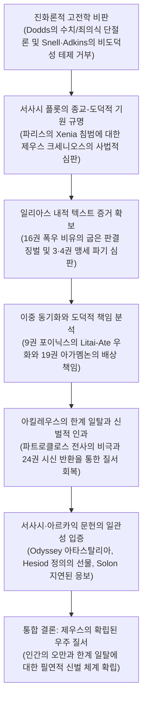

# 제우스의 정의 (*The Justice of Zeus*)

> [!NOTE] 학술사적 의의 및 총평
> 옥스퍼드 대학교 그리스어 레기우스 석좌교수 휴 로이드-존스(Sir Hugh Lloyd-Jones)의 기념비적 저작 『제우스의 정의』(The Justice of Zeus, 1971)는 19세기 이래 서양고전학계를 지배해온 진화론적·진보주의적 편견을 근본적으로 뒤엎은 현대 고전학의 결정적 이정표입니다. E. R. 도즈, B. 스넬, A. W. H. 애드킨스 등 20세기 중반의 지배적 학자들은 『일리아스』의 세계를 순수한 수치 문화이자 힘과 명예의 경쟁만 난무하는 전(前)도덕적 단계로 규정하고, 『오뒷세이아』와 헤시오도스, 그리고 아르카익기를 거치면서 비로소 죄의식과 도덕적 정의(Dike)가 발명되었다고 보았습니다. 로이드-존스는 호메로스 서사시 본문의 전체 플롯, 제도적 어휘, 신화적 인과율, 그리고 초기 서정시와 비극에 이르는 전승을 치밀하게 분석하여, 호메로스 초기 서사시부터 이미 제우스의 정의가 우주 질서와 인간 사회를 통어하는 일관되고 확고한 도덕 원리로 작동하고 있었음을 실증했습니다.

---

## 1. 서지 정보 및 학술사적 맥락

- **저자**: 휴 로이드-존스 (Sir Peter Hugh Jefferd Lloyd-Jones, 1922–2009)
  - 20세기 후반 영국의 대표적 헬레니스트.
  - 옥스퍼드 대학교 크라이스트 처치 칼리지 그리스어 레기우스 석좌교수(Regius Professor of Greek, 1960–1989).
  - 영국 학술원 회원(FBA).
  - 고대 그리스 서사시와 비극(특히 아이스퀼로스와 소포클레스) 및 그리스 종교사·도덕사 연구의 세계적 권위자.
- **출판 정보**:
  - University of California Press (1971년 초판, Sather Classical Lectures 제41권, 230쪽; 1983년 제2판).
  - 1969년 버클리 캘리포니아 대학교에서 행한 제50주년 세이더 고전 강좌(Sather Classical Lectures)를 대폭 확장하고 방대한 문헌학적 주석을 보강하여 출간됨.
- **핵심 문제의식과 연구 테제**:
  - (1) 『일리아스』와 초기 서사시는 정말로 신들의 도덕적 정의(Dike)가 배제된 채 순수한 완력과 명예 경쟁만 지배하는 사회인가?
  - (2) 『일리아스』와 『오뒷세이아』 사이에는 역사적·도덕적 단절이 존재하는가, 아니면 서사적 장르와 플롯의 차이에 따른 표현의 변주인가?
  - (3) 인간의 행동에 신적 원인(Ate 등)이 개입할 때 고대 영웅들은 도덕적 책임을 면제받았는가, 아니면 '이중 동기화'를 통해 완전한 책임을 졌는가?
  - (4) 아르카익 그리스의 깊은 실존적 비관주의(인간 유한성과 덧없음)는 제우스의 정의 신앙과 어떻게 모순 없이 공존하였는가?
- **학술사적 대결 구도와 진화론적 학설 비판**:
  - **에릭 도즈**([[dodds-1951-greeks-and-irrational|E. R. Dodds 1951]]): 현대 인류학(루스 베네딕트)의 범주를 차용하여 호메로스 사회를 협소한 '수치 문화(shame-culture)'로 한정하고, 『일리아스』의 제우스는 분배적 정의와 무관하며 『오뒷세이아』 1권의 제우스 연설에 이르러서야 비로소 '죄의식 문화(guilt-culture)'로의 역사적 이행이 시작되었다는 단절적 진화론을 주장함. 로이드-존스는 도즈의 제2장 제목("수치 문화에서 죄의식 문화로") 자체가 그리스 문화가 기원전 5세기 이후에도 여전히 수치 문화를 근간으로 유지했다는 사실을 은폐한다고 비판하며, 두 문화 요소는 역사적 선후 관계가 아니라 모든 인간 사회에 필연적으로 공존하는 양면임을 논증함.
  - **브루노 스넬**([[snell-1946-discovery-of-mind|Bruno Snell 1946]])과 **헤르만 프렝켈**(Hermann Fränkel): 어휘주의적 분석에 치우쳐 호메로스 영웅들에게는 통합된 자아(psychic whole)나 의지(will) 개념이 결여되어 있으며, 인간의 마음은 신적 충동과 자의적 힘들이 충돌하는 전장(battleground of arbitrary forces)에 불과하다고 봄. 로이드-존스는 근대적 '자유 의지' 개념의 부재가 곧 결단과 책임 능력의 부재를 뜻하지 않음을 지적하며, 호메로스 인물들이 온전한 도덕적 분별과 행위 책임을 지니고 있음을 밝힘.
  - **아서 애드킨스**([[adkins-1960-merit-and-responsibility|A. W. H. Adkins 1960]]): 전장에서의 군사적 성공 중심인 '경쟁적 덕(competitive virtues/agathos)'이 사회적 협동과 정의(quiet virtues/dikaios)를 완전히 압도하여 호메로스 사회에서는 불의에 대한 도덕적 비난이 성립할 수 없었다는 제로섬 결과주의 윤리 모델을 제시함. 로이드-존스는 애드킨스가 어휘의 사전적 정의에 얽매여 서사시 전체의 도덕적 질서와 상호 의무를 간과했다고 비판함.
  - **베르너 예거**(Werner Jaeger, *Paideia*): 호메로스 귀족 사회에서는 계급적 탁월성(Arete)만 존재했고 도덕적 디케(Dike)는 헤시오도스와 솔론의 폴리스 형성기에야 비로소 자각되었다고 본 역사주의 발전론을 비판함.
  - **피에르 샹트렌**(Pierre Chantraine)과 **데니스 페이지**(Denys Page): 『일리아스』 16권의 제우스 폭우 비유(16.384–393)나 9권 포이닉스의 '기도(Litai)와 아테(Ate)' 우화를 서사시 본문과 모순되는 '헤시오도스풍의 후대 삽입구(interpolation)'로 배제한 분리주의적 분석학파(Analytic school)의 인위적 텍스트 절단을 비판함.
- **연구 방법론 및 이론적 토대**:
  - **통합적 문헌학(Unitary Philology)과 플롯 중심주의**: 고립된 도덕 어휘 목록이나 빈도 통계에 매몰되지 않고, 트로이아 전쟁의 발발 원인부터 아킬레우스의 분노, 화해에 이르는 서사시 전체의 극적 구조와 행동 인과율을 총체적으로 파악함.
  - **이중 동기화(Double Motivation)의 정립**: 알빈 레스키([[lesky-1961-divine-and-human|Albin Lesky 1961]])의 정식을 발전시켜, 신적 작용(Ate 등)의 개입이 인간 행위자의 심리적 충동을 설명할 뿐 세속적 배상 책임과 도덕적 책임을 결코 면제하지 않음을 입증함.
  - **종교적 티메(Timē)와 우주적 디케(Dike)의 연속성**: 신들의 고유한 권역과 명예([[concept-time|Time]])를 침범당했을 때 발동하는 신벌이라는 보편적 종교 법칙으로부터, 만물의 질서를 통어하는 제우스의 보편적 정의가 태동했음을 실증함.
  - **지중해 문화인류학과의 대화**: 줄리언 피트-리버스(Julian Pitt-Rivers)와 J. K. 캠벨(J. K. Campbell)의 지중해 명예·수치 연구를 원용하여, 모든 명예 문화는 공동체적 충성(loyalty)과 금지선 위반에 대한 죄의식을 내재적으로 포함하고 있음을 역설함.
  - **후대 학계에 미친 파급력**: 로이드-존스의 일관성 테제는 버나드 윌리엄스([[williams-1993-shame-and-necessity|Bernard Williams 1993]])의 『수치와 필연성』과 더글러스 케언스([[cairns-1993-aidos|Douglas Cairns 1993]])의 『아이도스』 연구로 직접 이어지며 20세기 후반 고대 윤리학의 패러다임 전환을 이끎.

---

## 2. 개념 전복 매트릭스 및 논증 계보도

### [기존 진화론적 견해 vs 로이드-존스의 복원 모델]

| 분석 층위 | 기존 진화론적 견해 (Dodds, Snell, Adkins, Page, Jaeger) | 로이드-존스의 복원 모델 (*The Justice of Zeus*) |
|:---|:---|:---|
| 『**일리아스**』 **의 정의** | 정의([[concept-dike\|Dike]]) 관념 부재, 전사의 무력과 명예 경쟁만 지배함 | **트로이아 전쟁 전체가 환대(Xenia) 파괴에 대한 제우스의 사법적 집행** |
| **신들의 도덕성** | 신들은 변덕스럽고 인간 윤리에 무관심하며 힘의 승자만 편듦 | 제우스는 테미스테스(Themistes)를 수호하고 부정한 판결을 징벌하는 정의의 주관자 |
| **인간 자아와 책임** | 통합된 자아가 없어 신적 충동(Ate)에 휘둘리는 무책임한 꼭두각시 | **이중 동기화**: 신적 충동 속에서도 인간은 자신의 행위에 완전한 배상 책임을 짐 |
| **서사시 간의 관계** | 『일리아스』(비도덕적)와 『오뒷세이아』(도덕적) 사이의 역사적 단절 | **제우스의 정의 질서의 연속성**: 서사 장르와 플롯의 차이에 따른 표현 변주일 뿐임 |
| **도덕적 덕목의 위계** | 경쟁적 덕(agathos)의 절대적 우위, 협동적 덕(dikaios)의 무력화 | 협동과 충성, 신성한 한계의 준수 없이는 어떠한 명예와 사회 질서도 존립 불가 |
| **수치와 죄의식** | 수치 문화에서 죄의식 문화로의 단선적 역사 진보 (Dodds) | 모든 인간 사회는 수치와 죄의식(금지선 위반에 대한 자각)을 불가분하게 공유함 |
| **디케(Dike)의 본질** | 협소한 절차적 판결 또는 아르카익기에 이르러 발명된 추상 개념 | **우주 만물이 각자의 몫(Moira)을 지키게 하는 제우스의 확립된 질서** |
| **지연된 응보의 원리** | 아르카익 솔론 시대에야 발명된 신정론적 변명 기제 | 호메로스 서사시 맹세 파기 에피소드(Il. 4권)부터 이미 확립된 핵심 법칙 |

### [Mermaid 논증 구조도]

---

## 3. 전 챕터별 정밀 독해 및 논증 단계

### 제1장: 일리아스 (*The Iliad*, pp. 1–27)

#### §1. 테미스(Themis)와 디케(Dike)의 기원 및 사법적 성격 (pp. 1–9)
- **제도적 어휘의 기원과 왕권의 정당성**:
  - 디케([[concept-dike|Dike]])는 인도유럽어 어근 *deik-(경계를 가리키다, 제시하다)에서 유래하여 재판관의 판결이나 분쟁 당사자의 권리 주장을 의미합니다. 이는 '올곧은 판결(straight)'과 '굽은 판결(crooked)'로 대립합니다.
  - 지상의 왕들은 제우스로부터 신성한 홀(sceptre)과 함께 테미스테스([[concept-themis|Themistes]], 전통 규범과 관습 판례)를 수여받아 백성들 사이에 디케를 집행합니다(*Il.* 2.205–206, 9.98–99).
  - 아킬레우스 방패의 재판 장면(*Il.* 18.497–508)에서 원로들은 왕홀을 들고 가장 올곧은 판결을 내린 자에게 금 두 달란트를 수여하기 위해 경쟁합니다.
  - 하계에서 미노스 왕이 수행하는 재판(*Od.* 11.568–571) 역시 사후 도덕 심판이 아니라 지상에서처럼 망자들 간의 소송을 조정하는 군주권의 행사입니다. 고대 그리스인들에게 왕의 재판은 상호적 정의("그가 행한 대로 그가 당한다면 올곧은 디케가 이루어지리라")를 실현하는 것이었습니다.
  - 호메로스 정형구에서 왕은 '디케를 집행하는 왕(dikaiopolos basileus)'으로 칭송되며, 정의로운 인간(dikaioi anthropoi)은 나그네를 환대하고 신을 두려워하는 자로 규정됩니다.
- 『**일리아스**』 **16권 제우스의 폭우 비유 (*Il.* 16.384–393)**:
  - 파트로클로스가 트로이아군을 추격하는 격렬한 양상은, 광장에서 폭력으로 굽은 판결(skolias themistas)을 내리고 정의(Dike)를 쫓아내며 신들의 시선을 무시하는 인간들에게 제우스가 격노하여 쏟아붓는 가을 폭풍우에 비유됩니다.
  - 샹트렌과 분석학파는 이를 유일한 예외이자 헤시오도스풍 삽입구로 치부했으나, 로이드-존스는 이 구절이 왕권의 기원이자 정의의 최종 보증인인 제우스의 원초적 속성을 완벽하게 대변하는 서사시의 핵심 유기적 텍스트임을 논증합니다.

#### §2. 트로이아 전쟁의 도덕적 기원과 맹세 파기 (pp. 9–14)
- **크세니아(Xenia) 침해와 전쟁의 근본 동기**:
  - 트로이아 전쟁은 무의미한 약탈전이 아닙니다. 파리스가 메넬라오스의 환대([[concept-xenia|Xenia]])를 배신하고 주인의 아내 헬레네와 재물을 훔쳐 달아난 불의에 대해, 환대의 수호신 **제우스 크세니오스**(Zeus Xenios)가 내리는 필연적 신벌입니다.
  - 메넬라오스의 결투 전 기도(*Il.* 3.351–354: "제우스 주시여, 내게 악을 행한 자를 벌하게 하소서... 후대의 사람들도 환대를 베푼 주인을 해치기를 두려워하게 하소서")와 피산드로스를 처단할 때 외치는 절규(*Il.* 13.620–639)는 트로이아인들이 제우스 크세니오스의 노여움을 두려워하지 않았기에 파멸할 것임을 분명히 증언합니다.
- **헬레네의 참회와 아프로디테의 강요**:
  - 3권에서 프리아모스는 성벽 위에서 헬레네에게 "네 탓이 아니라 전쟁을 일으킨 신들의 탓이다"(*Il.* 3.164)라며 인간적 위로를 건네지만, 헬레네 자신은 스스로를 부끄러워하며 후회합니다.
  - 아프로디테가 노파로 변장하여 파리스의 침실로 갈 것을 강요할 때, 헬레네는 치욕에 저항하지만 여신의 위협에 굴복합니다. 이는 신적 충동이 인간의 정념을 압도하는 비극적 과정을 보여주며, 인간 행위자가 그 죄책감을 결코 지우지 못함을 보여줍니다.
- **맹세(Horkos) 의례와 판다로스의 배반 (*Il.* 3–4권)**:
  - 3권에서 아가멤논과 프리아모스는 제우스, 태양신, 강들의 신, 지하에서 맹세를 어긴 자를 벌하는 신들을 증인으로 삼아 피를 나누는 거룩한 맹세([[concept-horkos|Horkos]])를 거행합니다.
  - 판다로스가 아테나의 부추김과 자신의 어리석음으로 화살을 쏘아 휴전 맹세를 깨뜨린 순간, 트로이아의 운명은 도덕적으로 봉인됩니다.
- **아가멤논의 지연된 정의 선언 (*Il.* 4.160–168)**:
  - 아가멤논은 올림포스의 제우스가 당장은 징벌하지 않더라도 늦게나마(opse) 무거운 대가(자신과 처자식, 도시 전체의 파멸)를 치르게 할 것이며, 트로이아의 멸망은 확정되었다고 선언합니다. 이는 제우스의 정의가 즉각적이지 않더라도 결코 소멸하지 않는다는 고대 그리스 신정론의 원형을 보여줍니다.

#### §3. 9권 사절단, 아가멤논의 배상 인정과 포이닉스의 우화 (pp. 14–20)
- **아가멤논의 아테 인정과 배상 제안**:
  - 9권에서 아가멤논은 자신이 광기([[concept-ate|Ate]])에 사로잡혀 분별을 잃었음을 솔직히 인정하고, 일곱 개의 세발솥, 열 달란트의 황금, 스무 개의 솥, 열두 필의 명마, 레스보스 여인들과 브리세이스 반환, 트로이아 함락 후의 막대한 전리품과 일곱 도시, 사위의 지위를 약속하며 사절단을 파견합니다.
- **포이닉스의 리타이-아테 우화 (*Il.* 9.502–514)**:
  - 포이닉스는 제우스의 딸들인 **리타이**(Litai, 기도와 참회의 여신들)가 발을 절고 눈을 흘기며 아테(Ate, 파멸적 망상)의 뒤를 따라다닌다고 설명합니다. 상처 입은 자가 사죄하러 온 리타이를 존중하고 용서하면 축복을 받지만, 참회를 매정하게 거절하면 리타이가 아버지 제우스에게 호소하여 거절자 자신에게 아테가 닥쳐 비싼 대가를 치르게 만듭니다.
- **멜레아그로스 패러다임과 아킬레우스의 과도함**:
  - 포이닉스는 선물을 거절하다 뒤늦게 출전하여 명예와 보상을 모두 잃어버린 멜레아그로스의 신화(*Il.* 9.529–599)를 들어 경고합니다.
  - 오디세우스의 정교한 정치적 제안, 포이닉스의 신화적·부자적 훈계, 아이아스의 동료애 호소에도 불구하고 아킬레우스가 배상을 일축한 것은, 정당한 권리 주장을 넘어선 과도한 분노(cholos)이자 화해의 규범을 위반한 파괴적 오만입니다. 아킬레우스는 영웅 사회의 호혜적 보상 체계 자체를 거부함으로써 비극적 파국을 자초합니다.

#### §4. 아킬레우스의 한계 일탈과 파트로클로스 전사의 신벌적 인과 (pp. 20–24)
- **파트로클로스의 출전과 비극적 대가**:
  - 아킬레우스는 자신의 사적 명예([[concept-time|Time]])만을 극대화하기 위해 파트로클로스에게 아카이아 함선만 구하고 성벽으로 진격하지 말라고 지시하지만(*Il.* 16.80–96), 전황의 소용돌이 속에서 파트로클로스는 전사합니다.
  - 아킬레우스는 안틸로코스로부터 비보를 듣고 재를 뒤집어쓰며, 자신의 분노와 완고함이 불러온 비극적 책임을 절감합니다(*Il.* 18.98–104). 그는 신들과 인간 사이에서 다툼(eris)과 분노(cholos)가 사라지기를 탄식합니다(*Il.* 18.107–110).
- **헥토르 시신 모욕에 대한 올림포스의 진노 (*Il.* 24.39–54)**:
  - 아킬레우스가 헥토르의 시신을 매일 전차에 매달아 끌고 다니자, 아폴론은 그가 인간으로서 지녀야 할 수치심([[concept-aidos|Aidos]])과 연민([[concept-eleos|Eleos]])을 짓밟고 먹이를 노리는 사자처럼 야만스러워졌다고 올림포스 신들 앞에서 엄중히 비판합니다. 다른 인간들은 형제나 자식을 잃어도 견디는 마음(tletos thymos)으로 슬픔을 그치지만, 아킬레우스는 분수를 넘어 신들의 노여움을 사고 있다는 것입니다.
- **제우스의 개입과 우주적 질서 회복**:
  - 제우스는 테티스와 이리스를 보내 아킬레우스에게 시신을 몸값을 받고 돌려주도록 엄명합니다. 프리아모스와의 눈물 어린 해후에서 아킬레우스는 제우스의 두 항아리 비유(*Il.* 24.527–551)를 들려주며, 인간의 유한성과 제우스가 부과한 가혹한 실존의 질서(Moira)를 겸허히 수용합니다.

#### §5. 19권 아가멤논의 변명, 이중 동기화와 죄의식 문화의 공존 (pp. 24–27)
- **헤라클레스 탄생 신화와 이중 동기화**:
  - 19권에서 아가멤논은 "내가 아니라 제우스와 모이라([[concept-moira|Moira]]), 어둠 속을 걷는 에리뉘스가 내 마음에 아테를 던졌다"고 호소하며, 헤라의 계략에 속아 에우뤼스테우스에게 주권을 빼앗겼던 제우스 자신의 아테 신화(*Il.* 19.95–133)를 인용합니다.
  - 스넬 등은 이를 비겁한 책임 전가로 보았으나, 로이드-존스는 신적 원인 부여가 영웅의 체면을 세워주는 전통적 화법일 뿐 실질적인 도덕적·사회적 책임을 조금도 면제하지 않음을 입증합니다. 아가멤논은 자신의 과오를 인정하고 약속한 막대한 배상금을 군대 전체 앞에서 즉시 지불합니다.
- **합리적 결단과 도덕적 의지 (Snell 비판)**:
  - 오디세우스가 적진에 홀로 포위되었을 때 자신의 가슴(thymos)과 대화하며 "도망치는 것은 비겁하지만 홀로 잡히는 것은 더 큰 불행이다... 그러나 용감한 자는 버텨서야 한다"고 결단하는 장면(*Il.* 11.404–410)은, 호메로스 영웅들이 신적 힘의 맹목적 전장이 아니라 고도의 합리적 숙고와 도덕적 결단을 수행함을 완벽히 입증합니다.
- **수치 문화와 죄의식 문화의 본질적 융합**:
  - 도즈의 이분법을 해체하며, 로이드-존스는 공동체의 존속을 위해 충성(loyalty)을 요구하고 규범 위반에 죄책감을 느끼는 메커니즘은 호메로스 사회에서도 이미 확고했다고 논증합니다. 제우스는 우주의 확립된 질서(Dike)를 방어하며, 인간이 자신의 분수를 넘어 오만([[concept-hybris|Hybris]])을 부릴 때 필연적으로 신벌(Tisis)을 내립니다.

---

### 제2장: 오뒷세이아, 헤시오도스, 초기 서정시 (*The Odyssey: Hesiod: Early Lyric*, pp. 28–54)

#### §1. 오뒷세이아의 신정론과 아타스탈리아 (pp. 28–32)
- 『**오뒷세이아**』 **1권 제우스의 연설 (*Od.* 1.32–43)**:
  - 제우스는 신들의 회의에서 인간들이 온갖 재앙을 신들의 탓으로 돌리지만, 사실은 자신들의 무분별한 방자함(**아타스탈리아**, atasthalia)으로 정해진 몫(Moira) 이상의 파멸을 자초한다고 선언합니다. 헤르메스의 명백한 경고를 무시하고 아가멤논을 살해했다가 오레스테스에게 처단당한 아이기스토스가 그 본보기입니다.
  - 태양신 헬리오스의 소들을 도살해 잡아먹은 오디세우스의 전우들(*Od.* 1.7–9, 12.397–419) 역시 테이레시아스와 키르케의 거듭된 경고를 무시하고 자신의 아타스탈리아로 제우스의 폭풍에 휘말려 목숨을 잃었습니다.
- **도즈의 '프로그램적 선언' 테제 비판**:
  - 도즈는 이 구절을 서사시 종교의 역사적 진보로 보았으나, 로이드-존스는 이것이 『일리아스』와 『오뒷세이아』의 서사적 목표와 플롯의 차이에서 비롯된 변주일 뿐이라고 반박합니다.
  - 『일리아스』가 선악이 복합적으로 얽힌 고도의 비극적 서사시(헨리 제임스의 소설에 필적하는 도덕적 복잡성)인 반면, 『오뒷세이아』는 권선징악의 결말을 지향하는 민담적 구조(서부극 영화와 같은 선악의 명확성)를 취하고 있어 도덕적 인과율이 더 투명하게 전면에 부각된 것입니다.

#### §2. 구혼자 처벌의 정당성과 크세니아·아레테의 보상 (pp. 32–35)
- **구혼자들의 죄악과 환대 규범 침해**:
  - 구혼자들은 오디세우스의 오이코스([[concept-oikos|Oikos]]) 재산을 강탈하고, 낯선 나그네와 걸인으로 변장한 주인을 모욕하며, 할리테르세스와 테오클뤼메노스의 예언적 경고를 조롱합니다. 이는 나그네와 탄원자의 보호자인 제우스 크세니오스와 제우스 히케테시오스(Zeus Hiketesios)의 티메를 정면으로 짓밟은 죄악입니다. 걸인에게도 걸인의 신들과 에리뉘스가 있습니다(*Od.* 17.475).
  - 반면 충직한 돼지치기 에우마이오스는 "걸인과 나그네는 모두 제우스에게서 온다"(*Od.* 14.56–58)라며 환대의 의무를 철저히 지킵니다. 신들은 때로 낯선 나그네의 모습으로 인간의 도시를 찾아와 오만(hybris)과 좋은 질서(eunomia)를 지켜봅니다(*Od.* 17.485–487).
- **암피노모스 에피소드와 인간의 무상함**:
  - 오디세우스는 변장한 상태에서 비교적 온건한 구혼자 암피노모스에게 "대지가 기르는 것 중 인간보다 연약한 것은 없다"(*Od.* 18.130–142)는 유명한 철학적 훈계를 전하며 파멸을 피하라고 권고합니다. 그러나 암피노모스는 동료들의 사악함에 얽매여 떠나지 못하고 결국 아테나의 섭리 아래 처벌을 받습니다.
- **인내(Tlemosyne)와 정당한 신벌 (Tisis)**:
  - 오디세우스의 승리는 단순한 무력의 우위가 아니라 신들을 경외하며 온갖 치욕을 견뎌낸 인내(tlao/tlemon)와 탁월성(Arete)에 대한 신적 응답입니다.
  - 22권의 구혼자 학살 직후, 오디세우스는 유모 에우리클레이아에게 "죽은 자들 위에서 승리를 뽐내는 것은 불경한 일이다"(*Od.* 22.411–416)라고 경고하며, 이 학살이 사적 복수가 아닌 신벌(Tisis)의 집행임을 명시합니다.

#### §3. 헤시오도스의 신통기와 일과 날 (pp. 35–37)
- 『**신통기**』 **(*Theogony*)의 신화적 계보**:
  - 제우스는 괴물 티포에우스를 제압하여 올림포스 통치권을 확립한 직후 테미스([[concept-themis|Themis]])와 결합하여 **디케**(Dike, 정의), **에우노미아**(Eunomia, 좋은 질서), **에이레네**(Eirene, 평화)의 세 호라이(Horai) 여신을 낳습니다(*Theog.* 901–903). 이는 제우스의 패권이 맹목적 물리력이 아니라 법률과 정의에 의해 정당화됨을 선포하는 신화적 선언입니다.
- 『**일과 날**』 **(*Works and Days*)과 정의의 선물**:
  - 가난한 농민 시인 헤시오도스는 '뇌물을 삼키는 바실레우스들(basileis dorophagoi)'을 규탄하며, 매와 나이팅게일의 우화(*Op.* 202–218)를 통해 힘이 곧 정의라는 논리는 짐승의 법칙일 뿐이라고 선언합니다.
  - 제우스가 파견한 3만 명의 불멸의 감시관들이 인간의 불의를 감시하며, 제우스의 딸 디케는 불의한 판결을 받을 때마다 아버지의 무릎에 앉아 인간의 사악함을 고발합니다. 제우스는 짐승들에게는 서로를 물어뜯는 약육강식을 주었으나, 인간에게는 번영을 보장하는 최고의 축복인 **정의의 선물**(gift of justice)을 주셨음을 역설합니다(*Op.* 276–280).

#### §4. 초기 서정시의 지속성과 비관주의의 공존 (pp. 37–54)
- **아르킬로코스의 인내와 신정론적 우화**:
  - 아르킬로코스의 방패 유기(Fr. 5 West)와 마음을 향한 독백(Fr. 128 West: "마음아, 마음아... 고통 속에서 꿋꿋이 견뎌라")은 호메로스적 영웅주의에 대한 반역이 아니라, 가혹한 전장 실존 속에서 살아남기 위한 실천적 인내(tlemosyne)의 표현입니다.
  - 여우와 독수리의 우화(Fr. 172–181 West)에서도 우정을 배신하고 새끼를 해친 독수리는 제우스의 불벼락으로 징벌받으며, 제우스가 맹세와 정의의 감시자임이 확인됩니다.
- **솔론의 지연된 응보 (*Fr.* 13 West)**:
  - 아테네의 입법자 솔론은 무사이 여신들에게 올바른 부를 청원하며, 아테(Ate)와 불의로 얻은 부는 오래가지 못한다고 노래합니다. 제우스의 응보는 봄바람이 구름을 흩뜨리듯 마침내 불어닥쳐, 당대에 벌을 피하더라도 자손 대에 이르러 반드시 신벌을 내린다고 확언합니다.
- **테오그니스, 시모니데스, 핀다로스의 도덕관**:
  - 테오그니스는 귀족적 질서의 동요 속에서도 절제(**소프로쉬네**, sophrosyne)와 불의에 대한 경계를 강조합니다.
  - 시모니데스는 스코파스 찬가(Fr. 542 PMG)에서 인간이 완전한 선을 유지하기는 불가능하며 오직 신만이 그러한 특권을 지닌다고 노래하여 호메로스적 인간 유한성을 재확인합니다.
  - 핀다로스 역시 '노모스 바실레우스(Nomos Basileus)'(*Fr.* 169a S-M)를 통해 헤라클레스가 괴물들을 처단한 것은 법과 정의의 수호였음을 밝힙니다.
- **델포이적 비관주의와 정의의 결합**:
  - "인간에게 가장 좋은 것은 태어나지 않는 것, 태어났다면 속히 죽는 것"(헤로도토스 1.31의 클레오비스와 비톤 설화, 트로포니오스와 아가메데스 설화)이라는 아르카익기의 짙은 실존적 비관주의는 결코 신적 정의와 모순되지 않습니다. 인간의 삶이 덧없고 연약하기에 더욱 신의 분노를 피하는 절제와 정의가 절대적으로 요청되는 것입니다.

---

## 4. 핵심 원문 인용 및 심층 주석

다음 인용구들은 휴 로이드-존스가 1장과 2장에서 진화론적 고전학의 편견을 논파하고 제우스의 정의의 일관성을 논증하기 위해 제시한 결정적 핵심 대목들입니다.

### 인용 1: 제우스의 우주적 질서와 디케의 본질에 대하여
- *"He defends the established order (dike) by punishing mortals whose injustices disturb it, and at the same time by sternly repressing any attempt of men to rise above the humble place where they belong. If according to Achilles Zeus gives some men good and evil mixed and others unmixed evil, that is a mark not of his injustice but rather of his justice. What is just for mortals is not necessarily what mortals want. In the Iliad the plan of Zeus is accomplished; the actions of gods and men all finally conduce to the fulfilment of his will."* (Chapter 1, p. 27)
- **[주석]**: 로이드-존스의 일관성 테제를 압축한 결론부입니다. 디케는 인간의 주관적 복락을 채워주는 안락한 도구가 아니라, 인간이 자신의 분수를 지키고 우주의 확립된 위계 질서를 유지하도록 강제하는 제우스의 객관적 통치 원리임을 천명합니다.

### 인용 2: 이중 동기화와 인간 책임의 양립성에 대하여
- *"It is important to observe that when a human action, whether right or wrong, is put down to the action of a god, that does not mean that the human actor is not held to be responsible for his decisions. Agamemnon can to some extent mitigate his shame at having caused a disaster by his quarrel with Achilles, but that does not cause him to deny responsibility and withdraw his offer of compensation; Achilles knows that his obstinacy was due to ate sent by Zeus, but none the less feels responsible for the death of Patroclus. In each instance, also, the divinely motivated act can also be fully motivated in human terms; the part played by the god can always be subtracted without making nonsense of the action."* (Chapter 1, p. 10)
- **[주석]**: 스넬과 프렝켈의 '무책임한 원시인' 테제를 명쾌하게 해체한 대목입니다. 신적 원인(Ate)의 개입은 심리적·초자연적 차원의 설명일 뿐, 인간 사회에서의 실질적 배상 책임과 윤리적 자각을 조금도 훼손하지 않는 '이중 동기화'의 원리를 확립합니다.

### 인용 3: 일리아스와 오뒷세이아의 도덕관 비교에 대하여
- *"In the Odyssey, moral issues are infinitely simpler; not only during the adventures narrated by Odysseus, with their marked element of folktale, but even in Ithaca, where daily life is depicted with such great naturalism, good and bad and right and wrong are separated almost as clearly as in a Western film. ... It seems most unsafe to conclude that the comparative moral simplicity of the Odyssey is due simply to ethical progress made by the Greek world in the interval between the composition of the two poems. The truth is that the Odyssey is not an epic poem of the same kind as the Iliad."* (Chapter 2, pp. 31–32)
- **[주석]**: 두 서사시의 윤리적 톤 차이를 역사적 '도덕적 진보'로 해석하던 100년 묵은 고전학계의 오류를 서사 장르론과 플롯의 상이성(복합적 비극 vs 선악 이분법적 권선징악)으로 교정합니다.

### 인용 4: 헤시오도스와 제우스의 정의의 선물에 대하여
- *"Zeus has no special partiality for men, but according to Hesiod he has given them the gift of justice, so that they do not live in a state of permanent war with one another, as beasts do. ... He causes the just to prosper and he punishes the unjust, sending thirty thousand immortal watchers to observe their actions and chastening those of whom his daughter Justice makes complaint."* (Chapter 2, p. 35)
- **[주석]**: 헤시오도스의 정의론이 호메로스와의 단절이 아니라, 농민의 시각에서 제우스의 정의를 법률적·사회적 징벌의 형태로 구체화하고 심화시킨 연속선상의 산물임을 보여줍니다.

### 인용 5: 아르카익기 실존적 비관주의와 신적 정의의 공존에 대하여
- *"That the best fortune for mortals is not to have been born, and the next best is to die as soon as possible is a common thought in early Greece; we find it in Theognis, in Pindar, and again in Sophocles. ... But there is no reason why a belief in divine justice should not accompany a pessimistic view of human life, and we have seen that the combination of the two was in fact characteristic of the thinking of the archaic age."* (Chapter 2, p. 53)
- **[주석]**: 근대 합리주의 학자들이 흔히 범하는 오해, 즉 '비관주의는 신적 정의의 부재를 의미한다'는 선입견을 논파하고, 그리스 종교에서 가혹한 인간 조건의 자각이야말로 제우스의 정의를 경외하게 만드는 실존적 토대였음을 밝힙니다.

---

## 5. 서사시 및 초기 문헌 정밀 에피소드 매핑 테이블

| 서사시 권·행 번호 / 문헌 | 다루는 사건 및 텍스트 맥락 | 로이드-존스의 정의론적 논증 및 학술적 함의 |
|:---|:---|:---|
| ***Il.* 1.503–530** | **테티스의 탄원과 제우스의 섭리 승인** | 아킬레우스의 상처 입은 명예를 갚아주기 위한 테티스의 간청. 제우스의 고개 끄덕임(Kataneuo)은 신적 계획(Boule)의 시작이며 우주적 정의 회복의 출발점. |
| ***Il.* 3.276–301 & 4.157–168** | **아가멤논과 프리아모스의 맹세 및 판다로스의 배신** | 제우스와 복수의 신들을 증인 삼아 맺은 신성한 휴전 맹세(Horkos). 판다로스가 이를 어기자 아가멤논은 제우스가 늦게라도(opse) 트로이아를 철저히 징벌할 것이라 단언함(지연된 정의). |
| ***Il.* 6.146–149** | **글라우코스의 나뭇잎 비유** | 인간의 세대를 떨어지는 나뭇잎에 비유하는 실존적 유한성 인식. 영웅주의적 투쟁 이면에 내재된 호메로스 특유의 비관론적 세계관. |
| ***Il.* 9.496–514** | **포이닉스의 리타이-아테 우화** | 제우스의 딸들인 리타이(Litai)의 간청을 거절하는 자는 더 큰 아테(Ate)의 신벌을 받게 됨. 아킬레우스의 과도한 분노와 배상 거절이 도덕적 일탈임을 입증하는 규범적 근거. |
| ***Il.* 11.404–410** | **포위된 오디세우스의 합리적 결단 독백** | 적진 한가운데 홀로 남겨진 오디세우스가 자신의 thymos와 대화하며 비겁한 후퇴와 불명예를 거부하고 전선에 맞서기로 결단함. 호메로스 영웅의 의지적 자율성 입증. |
| ***Il.* 13.620–639** | **피산드로스를 처단하는 메넬라오스의 일갈** | 트로이아인들이 손님을 대접한 주인의 아내를 훔쳐 달아나고도 제우스 크세니오스의 준엄한 분노를 두려워하지 않았음을 고발하며, 트로이아의 필망을 선언함. |
| ***Il.* 16.384–393** | **제우스의 가을 폭우 비유** | 부정한 판결로 정의([[concept-dike\|Dike]])를 왜곡하고 신들을 무시한 자들에게 제우스가 폭풍우를 내려 심판함. 『일리아스』에서 제우스가 사법적 정의의 수호자임을 보여주는 결정적 증거. |
| ***Il.* 18.107–110** | **아킬레우스의 다툼과 분노에 대한 회한** | 파트로클로스의 죽음 이후 다툼(eris)과 분노(cholos)가 신들과 인간 사이에서 영원히 사라지기를 탄식함. 영웅적 자의식의 비극적 각성과 도덕적 통찰. |
| ***Il.* 18.497–508** | **아킬레우스 방패의 재판 장면** | 도시의 광장에서 살인 배상금을 둘러싸고 열린 재판. 장로들이 왕홀을 들고 가장 올곧은 디케를 제시하기 위해 판결을 겨루는 호메로스 사법 제도의 시각적 전형. |
| ***Il.* 19.86–138** | **아가멤논의 아테 변명과 배상 지급** | "제우스와 모이라, 에리뉘스가 내게 아테를 내렸다"는 고백. 신적 충동의 개입(이중 동기화) 속에서도 아가멤논은 자신의 사회적·도덕적 책임을 인정하고 막대한 배상을 치름. |
| ***Il.* 24.39–54 & 527–551** | **아폴론의 규탄과 제우스의 두 항아리 비유** | 아킬레우스의 헥토르 시신 모욕은 아이도스([[concept-aidos\|Aidos]])와 자비의 상실로 신들의 노여움을 삼. 제우스가 정한 인간의 유한한 몫(Moira)과 실존적 질서를 수용하며 화해가 완성됨. |
| ***Od.* 1.32–43** | **제우스의 올림포스 회의 연설** | 아이기스토스의 파멸을 예로 들며 인간들이 방자함(Atasthalia)으로 운명 이상의 고통을 자초함을 선언. 신적 정의와 인간 책임의 명확한 연계. |
| ***Od.* 9.106–115 & 269–278** | **퀴클롭스의 무법성과 제우스 크세니오스 모독** | 테미스테스도 디케도 없이 폭력으로 살아가는 퀴클롭스 폴리페모스가 제우스 크세니오스를 모독하다 눈이 멀게 됨. 디케 부재 상태에 대한 징벌. |
| ***Od.* 12.397–419** | **태양신의 소 도살과 제우스의 폭풍 징벌** | 신들의 경고를 무시하고 헬리오스의 소를 도살한 동료들의 배가 제우스의 벼락으로 난파됨. 아타스탈리아에 대한 즉각적 신벌의 실례. |
| ***Od.* 14.56–58 & 17.483–487** | **에우마이오스의 환대와 변장한 신들의 순찰** | 모든 나그네와 걸인은 제우스의 보호 아래 있으며, 신들은 때로 변장하고 지상을 순찰함. 구혼자들의 만행에 대한 종교적 경고와 환대 윤리의 실천. |
| ***Od.* 18.130–142** | **암피노모스를 향한 오디세우스의 실존적 훈계** | 인간의 덧없음과 신들이 보내는 운명에 대한 순응을 설파하며 구혼자들의 만행에서 벗어나기를 권고하는 호메로스적 지혜의 정수. |
| ***Od.* 22.35–41 & 411–416** | **구혼자 학살과 에우리클레이아 훈계** | 구혼자들의 파멸은 신들을 두려워하지 않고 환대([[concept-xenia\|Xenia]])를 짓밟은 자들에 대한 제우스의 응보(Tisis). 오디세우스는 죽은 자들 앞에서 승리를 뽐내는 것을 불경으로 금지함. |
| **Hesiod, *Theog.* 901–903** | **제우스와 테미스의 결합** | 제우스가 테미스와 결합하여 낳은 디케(정의), 에우노미아(질서), 에이레네(평화). 올림포스 최고신의 권력이 물리적 폭력이 아닌 도덕적 법률 질서에 근거함을 상징. |
| **Hesiod, *Op.* 213–285** | **뇌물 받는 재판관들과 정의의 선물** | 제우스의 3만 감시관과 옥좌 곁의 디케. 동물에게는 약육강식을, 인간에게는 번영을 보장하는 최고의 선물로서의 디케를 부여하셨음을 선포함. |
| **Solon, *Fr.* 13 West** | **솔론의 기도시: 제우스의 지연된 응보** | 불의로 얻은 부는 오래가지 못하며 제우스의 징벌은 봄바람처럼 마침내 닥침. 당대에 벌을 피하더라도 자손 대에 이르러 반드시 값을 치르게 됨. |
| **Pindar, *Fr.* 169a S-M** | **노모스 바실레우스 (Nomos Basileus)** | 법(Nomos)은 만물의 왕으로서 가장 큰 폭력을 정의로 바꿈. 게리오네스와 디오메데스 같은 무법적 괴물들을 응징하는 헤라클레스의 행위는 우주적 정의의 수호임. |

---

## 관련 항목

- [[analysis-homeric-ethics-literature-review]]
- [[kim-han-2019-gods-zeus-moira-and-god]]
- [[riedinger-1976-la-time-chez-homere]]
- [[adkins-1960-merit-and-responsibility]]
- [[snell-1946-discovery-of-mind]]
- [[dodds-1951-greeks-and-irrational]]
- [[williams-1993-shame-and-necessity]]
- [[cairns-1993-aidos]]
- [[concept-dike|Dike]]
- [[concept-themis|Themis]]
- [[concept-xenia|Xenia]]
- [[concept-moira|Moira]]
- [[concept-ate|Ate]]
- [[concept-time|Time]]
- [[concept-hybris|Hybris]]
- [[concept-horkos|Horkos]]
