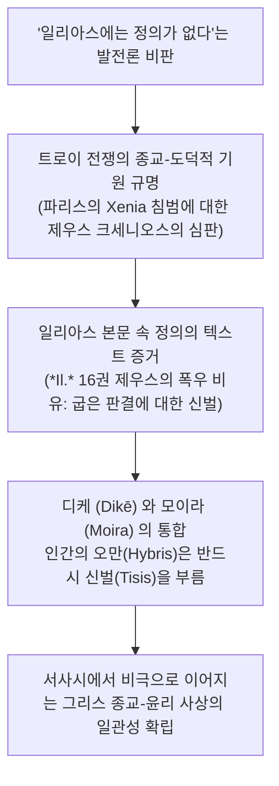

# 제우스의 정의 (*The Justice of Zeus*)

> [!NOTE] 학술사적 의의 및 총평
> 옥스퍼드 대학교 그리스어 레기우스 석좌교수 휴 로이드-존스의 대표작 『제우스의 정의』(1971)는 서양고전학계의 오랜 '진화론적 편견'을 타파한 결정적 저작입니다. 19세기 이래 학계는 "『일리아스』에는 정의(Dikē) 개념이 없으며 순수한 무력과 명예만 존재하고, 『오뒷세이아』와 헤시오도스에 이르러서야 도덕적 정의가 발명되었다"고 믿어왔습니다. 로이드-존스는 호메로스 서사시부터 아르킬로코스, 솔론, 그리고 아이스퀼로스와 소포클레스의 비극에 이르는 방대한 텍스트를 치밀하게 재검토하여, **호메로스 초기 서사시부터 이미 '제우스의 정의(Dike)'가 우주와 인간 사회를 다스리는 일관되고 확고한 도덕 원리로 작동하고 있었음**을 논증했습니다.

---

## 1. 서지 정보 및 학술사적 맥락

- **저자**: 휴 로이드-존스 (Sir Peter Hugh Jefferd Lloyd-Jones, 1922–2009) — 20세기 영국의 대표적 헬레니스트, 옥스퍼드 대학교 그리스어 레기우스 석좌교수, 영국 학술원 회원.
- **출판 정보**: University of California Press (1971, Sather Classical Lectures 제41권, 230쪽; 1983년 제2판).
- **비판 대상**:
  - **브루노 스넬([[snell-1946-discovery-of-mind|Snell, 1946]])**과 **아서 애드킨스([[adkins-1960-merit-and-responsibility|Adkins, 1960]])**: 『일리아스』의 종교를 도덕과 무관한 원시적 힘의 숭배로 폄하한 진보주의적 발전론자들.
  - **베르너 예거(Werner Jaeger, *Paideia*)**: 정의 개념이 아르카익 귀족 사회 이후에야 비로소 등장했다고 본 견해.

---

## 2. 개념 전복 매트릭스 및 논증 계보도

### [기존 발전론적 고전학 vs 로이드-존스의 일관성 모델]

| 비교 범주 | 기존 진화론적 견해 (Snell, Adkins, Jaeger) | 로이드-존스의 복원 모델 (*The Justice of Zeus*) |
|:---|:---|:---|
| **『일리아스』의 정의** | 정의([[concept-dike|Dike]]) 개념 부재, 전사의 무력과 명예만 존재 | **트로이 멸망의 전 과정이 파리스의 불의에 대한 제우스의 응징** |
| **신들의 도덕성** | 신들은 인간의 도덕에 무관심하며 변덕스럽게 행동함 | 제우스는 우주적 균형과 맹세, 환대([[concept-xenia|Xenia]])를 수호하는 정의의 주관자 |
| **서사시 간의 관계** | 『일리아스』(비도덕적)와 『오뒷세이아』(도덕적)의 단절 | 두 서사시를 관통하는 **제우스의 도덕적 질서의 일관된 연속성** |
| **디케(Dikē)의 본질** | 인간 법정의 협소한 절차적 규칙 | **우주 만물이 각자의 몫(Moira)을 유지하게 하는 신성한 균형 원리** |

### [Mermaid 논증 구조도]

---

## 3. 전 챕터별 정밀 독해 및 논증 단계 (호메로스 편 중심)

### 제1장: 호메로스의 정의 (*Homer*)
1. **트로이아 전쟁의 도덕적 원인**:
   - 트로이의 함락은 단순한 군사적 정복이 아닙니다. 파리스가 메넬라오스의 환대([[concept-xenia|Xenia]])를 배신하고 헬레네를 납치한 불경죄에 대해, 환대의 수호신 **제우스 크세니오스(Zeus Xenios)**가 내리는 필연적인 종교적 심판입니다.
2. **『일리아스』 16권의 결정적 증거**:
   - 호메로스는 폭풍우 묘사(*Il.* 16.384–393)에서 *"광장에서 굽은 판결을 내리고 정의(Dike)를 쫓아내는 자들에게 제우스가 노하여 대지에 파멸의 비를 쏟아붓는다"*고 명시합니다. 이는 『일리아스』 시인이 신들의 도덕적 심판을 명확히 인식하고 있었음을 입증합니다.
3. **『오뒷세이아』와의 연속성**:
   - 『오뒷세이아』 1권 서두에서 제우스가 "인간들이 자신의 방자함(Atasthalia)으로 파멸을 자초한다"고 선언하는 것은 새로운 도덕관의 등장이 아니라, 『일리아스』에 이미 내재했던 제우스의 정의관을 직접적으로 재확인한 것입니다.

### 제2장~제6장: 헤시오도스에서 비극까지 (*Hesiod to Sophocles*)
- 헤시오도스의 『일과 날』, 솔론의 정치시, 아이스퀼로스의 『오레스테이아』, 소포클레스 비극에 이르기까지, 그리스 문명 전체를 관통하는 핵심 줄기는 '새로운 도덕의 발명'이 아니라 '호메로스적 제우스의 정의에 대한 지속적인 심화와 변주'임을 밝힙니다.

---

## 4. 핵심 원문 인용 및 심층 주석

### 인용 1: 제우스의 정의의 일관성에 대하여
- *"From the very beginning of Greek literature, in the Iliad as well as the Odyssey, Zeus is the guardian of justice. The fall of Troy is not a triumph of blind force; it is the execution of Zeus's decree against the transgressors of the laws of hospitality."* (Chapter 1, p. 5)
- **[주석]**: 서양고전학계의 100년 묵은 진보주의적 편견을 단번에 뒤엎은 핵심 선언.

### 인용 2: 디케의 우주적 성격에 대하여
- *"Dikē in Homer is the established order of the universe, the allotted share (moira) of gods and men. Whoever transgresses this boundary commits hybris and inevitably invites the retributive wrath of Zeus."* (Chapter 1, p. 27)
- **[주석]**: 디케가 근대적 의미의 협소한 법률 규칙을 넘어 우주적 질서와 균형의 원리임을 명시함.

---

## 5. 서사시 전편 정밀 에피소드 매핑 테이블

| 서사시 권·행 번호 | 다루는 사건 및 인물 | 로이드-존스의 정의론적 해석 |
|:---|:---|:---|
| ***Il.* 3.276–301** | **아가멤논과 프리아모스의 맹세** | 제우스와 태양신, 대지, 지하의 신들을 증인으로 삼아 맹세(Horkos)를 맺고, 이를 깨뜨리는 자는 뇌수가 쏟아져 멸망할 것이라 선언하는 신성한 사법 의례. |
| ***Il.* 4.157–168** | **판다로스의 배신에 대한 아가멤논의 확신** | 트로이군이 맹세를 깨뜨리자 아가멤논은 "올림포스의 제우스가 당장은 벌하지 않더라도 언젠가는 반드시 큰 대가를 치르게 할 것이며, 트로이는 필망한다"고 정의의 실현을 확언함. |
| ***Il.* 16.384–393** | **제우스의 폭우 비유** | 부정한 판결로 정의([[concept-dike|Dike]])를 왜곡한 인간들에게 제우스가 분노하여 홍수를 내린다는 구절. 『일리아스』의 신들이 도덕과 직결되어 있음을 보여주는 결정적 증거. |
| ***Od.* 1.32–43** | **제우스의 신들의 회의 연설** | 아이기스토스가 경고를 무시하고 방자함(Atasthalia)으로 파멸한 사건을 언급하며, 신적 정의의 공정성과 인간 책임의 결합을 선포함. |
| ***Od.* 22.35–41** | **구혼자들을 향한 오디세우스의 일갈** | "신들을 두려워하지 않고 인간의 비난을 무시한 너희에게 이제 죽음의 올가미가 씌워졌다!" 정의와 응보(Tisis)의 완성. |

---

## ## 관련 항목

- [[homeric-ethics-literature-review]]
- [[concept-dike|Dike]]
- [[concept-themis|Themis]]
- [[concept-xenia|Xenia]]
- [[concept-moira|Moira]]
- [[concept-ate|Ate]]
- [[adkins-1960-merit-and-responsibility]]
- [[williams-1993-shame-and-necessity]]
- [[cairns-1993-aidos]]
