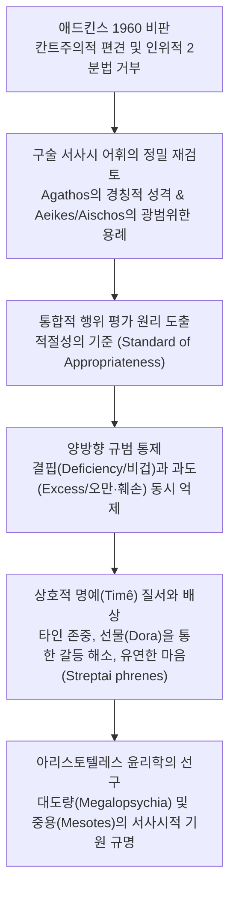

# 호메로스의 도덕과 가치 (*Morals and Values in Homer*)

> [!NOTE] 학술사적 의의 및 총평
> 앤서니 A. 롱(A. A. Long)의 1970년 논문 「호메로스의 도덕과 가치」(*Morals and Values in Homer*, *JHS* 90)는 아서 애드킨스(A. W. H. Adkins)의 획기적 저작 『공적과 책임』(1960)이 제시한 '경쟁적 가치 대 협력적 가치' 2분법 모델의 한계를 문헌학적·철학적으로 정밀 타격한 기념비적 반론입니다. 롱은 애드킨스가 고대 서사시에 현대 칸트주의적 '의무'와 '도덕적 책임'의 잣대를 투사했다고 비판하며, 호메로스 윤리의 본질을 2분법적 대립이 아닌 ‘**적절성의 기준(Standard of Appropriateness)**’과 ‘**과도함(Excess) 및 결핍(Deficiency)의 통제**’라는 통합적 규범 체계로 재정의했습니다. 이 논문은 이후 로이드-존스(1971), 케언스(1993), 윌리엄스(1993)로 이어지는 호메로스 도덕심리학 복원 운동의 결정적 분수령이 되었습니다.

---

## 1. 서지 정보 및 학술사적 맥락

- **저자**: 앤서니 아서 롱 (Anthony Arthur Long, 1940– ) — 버클리 캘리포니아 대학교(UC Berkeley) 고전학 및 철학 석좌교수, 헬레니즘 철학과 고대 윤리학의 세계적 권위자.
- **출판 정보**: *The Journal of Hellenic Studies*, Vol. 90 (1970), pp. 121–139. (The Society for the Promotion of Hellenic Studies / Cambridge University Press, DOI: 10.2307/629758).
- **연구 방법론**:
  - 서사시 텍스트 내 가치 평가어(*agathos, arete, aischron, aischos, aeikês, elencheiê, timê*)의 실제 문맥 및 구술 서사시 공식구(Formulaic diction) 전수 분석.
  - 일상언어학적 분석철학의 엄밀성을 유지하면서도, 구술 시학의 장르적 관습과 서사적 맥락(Plot requirements)을 결합한 통합적 문헌학.
- **핵심 문제의식**:
  - 애드킨스의 "우리 모두는 칸트주의자다(We are all Kantians now)"라는 전제가 고대 윤리 텍스트 분석에 가져온 왜곡을 어떻게 극복할 것인가?
  - 호메로스 텍스트에서 '협력적 행동'과 '타인 존중'은 정말로 '경쟁적 탁월성' 앞에 무력한 2차적 가치에 불과했는가?
  - 호메로스 사회를 관통하는 진정한 행위 평가의 통합 원리는 무엇인가?

---

## 2. 개념 전복 매트릭스 및 논증 계보도

### [애드킨스 모델 vs 롱 모델 비교 매트릭스]

| 분석 층위 | 애드킨스 (Adkins 1960) 모델 | 롱 (Long 1970) 비판 및 대안 모델 |
|:---|:---|:---|
| **도덕관의 기본 전제** | 칸트적 의무론(Kantian duty) 기준에 따른 고대 그리스 도덕의 결함론 | 고대 그리스 고유의 행위 평가 원리 및 구술 서사시 내적 논리 중시 |
| **가치어의 구조** | 경쟁적 가치(*agathos/arete*) vs 협력적/정적 가치(*dikaios/sophron*)의 엄격한 2분법 | 단일한 ‘**적절성의 기준(Standard of Appropriateness)**’ 아래 과도와 결핍을 평가하는 다층적 연속체 |
| **아가토스(*agathos*)의 기능** | 어떤 도덕적 비난도 무력화하는 절대적 도덕 찬사어이자 승리자 찬양 | 귀족 신분과 탁월성을 가리키는 기술적(Descriptive)·경칭적 어휘. 과도한 악행 시 비난(*nemesis*)을 면치 못함 |
| **비난어의 적용 범위** | *aischron*, *elencheiê*는 오직 전쟁 실패 등 경쟁적 영역에만 적용됨 | *aischron*은 서사시 전체에 2회만 등장. *aeikês*(불합당한), *aischos*, *nemesis*는 협력 위반 및 오만(*hybris*)에도 강력 적용 |
| **책임과 의도**(Intention) | 의도 불인정, 오직 물리적 결과(Success/Failure)만이 유일한 가치 | '도덕적 의지'는 아닐지라도 ‘**최선을 다해 노력함(Trying one's best)**’에 대한 정당한 평가와 정상 참작 인정 |
| **티메(*timê*)의 성격** | 오직 배타적이고 이기적인 개인의 경쟁적 우월성 추구 | 상호적이고 위계적인 사회적 가치. 타인(동맹, 손님, 신)의 *timê*를 존중해야 자신의 *timê*가 보존됨 |
| **성품의 유연성** | 굴복하지 않는 완고함이 전사의 미덕 | ‘**설득에 열려 있는 유연한 마음(streptai phrenes esthlôn)**’이야말로 진정한 고귀한 자(*esthlos*)의 덕목 |

### [Mermaid 논증 구조도]

---

## 3. 논문의 핵심 테제 및 섹션별 정밀 분석

### 제1절: 호메로스 '사회', 평가 언어 및 애드킨스 비판 (pp. 121–123)
- **칸트주의적 잣대 비판**: 애드킨스는 "우리 모두는 칸트주의자다"라며 의무와 순수한 도덕적 책임을 중심에 두지만, 고대 그리스 문헌을 칸트적 범주로 재단하는 것은 부당함.
- **오이코스 환원주의 비판**: 호메로스 서사시는 실제 아르카익 사회의 오이코스(Oikos) 필요를 그대로 복사한 사회학적 보고서가 아니라, 영웅적 아레테를 이상화한 문학적 텍스트임. 따라서 서사시 내적 논리(Internal logic of the poems)를 통해 윤리를 해석해야 함.
- **경쟁적/협력적 2분법의 허구성**: 호메로스 텍스트에서 크세니아([[concept-xenia|Xenia]]), 신들에 대한 제사, 전우 구원, 향연 등은 협력적 행동이면서 동시에 영웅의 지위와 경쟁적 명예([[concept-time|Timê]])가 걸린 행위임.

### 제2절: 경쟁과 협력의 상호 침투 (pp. 123–126)
- **글라우코스의 헥토르 비난** (*Il.* 17.142ff.):
  - 사르페돈의 시신을 지키지 못하고 물러선 헥토르를 글라우코스가 질책할 때, 이는 단순한 군사적 무능 비판이 아니라 손님-친구 관계(*xenos*)이자 동맹(*hetairos*)에 대한 도덕적 의무를 배신했다는 비난임.
- **동기와 노력(Trying)의 중요성**:
  - 호메로스 영웅들은 무조건적 결과만을 요구받지 않음. 헥토르는 "신이 개입하면 용사도 물러설 수밖에 없다"며 비겁한 의도가 없었음을 변호함(*Il.* 17.175).
  - 오디세우스와 포세이돈은 전사들에게 "승리하라"가 아니라 "최선을 다해 노력하고 물러서지 말라"고 촉구함(*Il.* 2.298, 13.232ff., 13.786ff.).
- **친족 의무와 에우마이오스의 환대**:
  - 데이포보스는 아이네이아스에게 매제 알카토오스의 시신을 수습하라고 호소하며 친족애의 의무를 일깨움(*Il.* 13.459ff.).
  - 돼지치기 에우마이오스가 거지 차림의 오디세우스를 사냥개들로부터 구한 것은(*Od.* 14.37ff.) 단순한 오이코스 보존 본능이 아니라 손님을 보호해야 할 주인의 마땅한 도덕적 의무(*themis*)임.

### 제3절: 아가토스(*agathos*)의 한계와 비판 가능성 (pp. 126–129)
- **아가토스의 기술적(Descriptive) 성격**:
  - 구비문학적 수식어(Formulaic epithets)로서 *agathos*나 *aristos*는 구혼자들에게도 쓰이듯(*Od.* 1.245) 귀족적 신분을 가리키는 경우가 많음.
  - 따라서 어떤 인물이 *agathos*로 불린다고 해서 그의 모든 악행이 자동 정당화되는 것은 아님.
- **네스토르의 아가멤논 중재** (*Il.* 1.275ff.):
  - 네스토르는 "그대가 비록 훌륭할지라도(agathos per eôn) 처녀를 빼앗지 말라"고 간청함. 이는 아가토스의 지위가 군대 전체의 결정과 아킬레우스의 정당한 권리를 짓밟을 근거가 되지 못함을 명시함.
- **아폴론의 아킬레우스 비난** (*Il.* 24.50ff.):
  - 아폴론은 헥토르 시신을 능욕하는 아킬레우스를 향해 "그가 비록 훌륭할지라도(agathôi per eonti) 우리가 그에게 분노(*nemesis*)하지 않도록 조심해야 한다"고 경고함.
  - 아킬레우스의 잔혹한 행위는 "더 훌륭하지도 더 낫지도 않은 일(*ou mên hoi to ge kallion oude t' ameinon*)"로서 명백한 도덕적 지탄을 받음.

### 제4절: 행위 평가어의 실제 운용: 결핍과 과도의 통제 (pp. 129–135)
- **비난어의 문헌학적 빈도 조사**:
  - 애드킨스가 경쟁적 실패의 핵심 비난어로 지목한 *aischron*(아이스크론)은 서사시 전체에서 단 2회(*Il.* 2.119, 2.298)만 등장함.
  - 반면 '어울리지 않는/합당하지 않은'을 뜻하는 **아에이케스**(ἀεικής, *aeikḗs*)는 광범위하게 쓰이며, 클리타임네스트라의 남편 살해, 구혼자들의 만행, 아킬레우스의 시신 훼손(ἀεικέα ἔργα, *aeikéa érga*) 등 과도한 불의를 단죄하는 핵심어로 기능함.
- **구혼자들과 파리스에 대한 비난**:
  - 아테나는 구혼자들의 만행을 보며 신중한 자(*pinutos*)라면 누구나 격분(*nemesis*)할 **수치스러운 행위**(*aischea polla*)라고 규정함(*Od.* 1.228–229).
  - 텔레마코스는 아고라에서 구혼자들에게 수치심을 알라고 촉구하며(*Od.* 2.85ff.), 안티노오스는 이를 자신들에 대한 수치(*aischos*) 부여로 정확히 이해함.
  - 헬레네와 파리스의 간통 및 무책임 역시 트로이아인들의 수치(*katêpheiê, aischos*)로 지탄받음(*Il.* 3.46ff., 6.349ff.).
- **고귀한 자의 유연한 마음** (*streptai phrenes esthlôn*):
  - 진정으로 고귀한 자(*esthlos*)는 타인의 탄원과 정당한 설득에 마음을 돌릴 줄 아는 유연성을 지님(*Il.* 15.203, 9.497, 13.115). 완고한 독선은 영웅의 미덕이 아니라 파멸의 전조임.

### 제5절: 적절성의 기준 (*The Standard of Appropriateness*) (pp. 135–139)
- **통합적 행위 평가 공식구들**:
  - **카타 모이란(κατὰ μοῖραν, *katà moîran*, 순리에 맞게) / 우 카타 모이란(οὐ κατὰ μοῖραν, *ou katà moîran*)**
  - **카타 코스몬(κατὰ κόσμον, *katà kósmon*, 질서에 맞게) / 우 카타 코스몬(οὐ κατὰ κόσμον, *ou katà kósmon*)**
  - **테미스(θέμις, *thémis*, 관습과 도리에 맞는) / 우 테미스(οὐ θέμις, *ou thémis*)**
  - **에오이케(ἔοικε, *éoike*, 합당한) / 우데 에오이케(οὐδὲ ἔοικε, *oudè éoike*)**
  - **아이시모스(αἴσιμος, *aísimos*, 분수를 지키는) / 에나이시모스(ἐναίσιμος, *enaísimos*)**
  - **크레**(χρή, *khrḗ*, 마땅히 해야 할 바)
- **심미적-사회적 평가의 성격**:
  - 호메로스 사회에서 도덕적 평가는 외부적 관찰에 기반함: "보기에 합당하고 듣기에 올바르면 그것이 옳은 것이다(If it looks right, or sounds right, then it is right)."
  - 이는 단순한 형식주의가 아니라, 공동체의 합의된 규범과 사회적 선례에 부합하는 중용의 태도를 뜻함.
- **배상(Gifts)을 통한 명예의 회복**:
  - 전투에서의 패배는 돌이킬 수 없는 수치이지만, 타인의 명예를 침해한 과도한 행위는 풍성한 선물(*dôra*)과 배상을 통해 관계를 회복하고 *timê*의 균형을 복원할 수 있음 (*Il.* 19권 아가멤논의 사과, *Il.* 23권 안틸로코스의 말 양보).
- **아리스토텔레스 윤리학과의 연결**:
  - 호메로스의 적절성 규범은 훗날 아리스토텔레스가 정초한 **대도량**(Megalopsychia)과 **중용**(Mesotes, 과도와 결핍을 피함) 이론의 직접적인 모태가 됨.

---

## 4. 문헌학적 어휘 사전 및 희랍어 개념 정밀 주해

1. **아에이케스** (ἀεικής, *aeikḗs* / ἀεικέα ἔργα, *aeikéa érga*):
   - 본래 '어울리지 않는, 분수에 맞지 않는, 흉측한'을 뜻하며(*oukeoike*에서 유래), 패배의 비참함뿐만 아니라 영웅 규범과 신적 도리를 벗어난 과도한 잔혹 행위(시신 훼손, 살인, 오만)를 규탄하는 핵심 비난어.
2. **카타 모이란** (κατὰ μοῖραν, *katà moîran*):
   - 각자의 사회적 신분, 몫([[concept-moira|Moira]]), 그리고 구체적 상황에 정확히 부합하게 말하고 행동함을 뜻하는 최고 승인어.
3. **카타 코스몬** (κατὰ κόσμον, *katà kósmon*):
   - 우주와 공동체의 조화로운 질서(Kosmos)에 맞추어 적절하게 처신함을 의미함.
4. **아이시모스 / 에나이시모스** (αἴσιμος, *aísimos* / ἐναίσιμος, *enaísimos*):
   - 운명과 관습이 정한 분수(Aisa)를 넘지 않고 과도함과 결핍을 모두 피하는 올바른 품성.
5. **스트렙타이 프레네스** (στρεπταὶ φρένες, *streptaì phrénes*):
   - "고귀한 이들의 마음은 돌이킬 수 있다(streptai mentoi phrenes esthlôn)." 정당한 도덕적 충고와 화해의 제안을 수용할 줄 아는 성숙한 행위자의 유연성.

---

## 5. 핵심 원문 인용 및 심층 주석

### 인용 1: 칸트주의적 편견에 대한 비판
- *"The notion that modern western man's moral values may be properly distinguished from those of an ancient Greek by reference to Kantian ethics is a highly debatable proposition... Professor Adkins has pointed out some central concepts which Homer lacks; he has not described certain others which Homer knows and uses."* (pp. 121, 138)
- **[주석]**: 애드킨스가 고대 그리스에 '칸트적 의무'가 없다는 점에만 집착하여, 호메로스 세계가 실제로 풍부하게 활용했던 고유한 도덕적 평가 체계(적절성, 공정함, 상호적 명예)를 보지 못했음을 날카롭게 비판함.

### 인용 2: '적절성의 기준' 테제
- *"I believe that we see in Homer the application of a standard of 'appropriateness'... what Finley calls 'strongly entrenched notions regarding the proper ways for a man to behave, with respect to property, toward other men'... To do what is aisimos or enaisimos is to avoid both excess and deficiency."* (pp. 135, 136)
- **[주석]**: 호메로스 윤리의 핵심을 관통하는 통일 원리로서 '적절성'을 정식화함. 이는 과도함(*hybris*)과 결핍(*cowardice*)을 동시에 제어하는 그리스 고유의 균형 감각임.

### 인용 3: 상호적 티메(*timê*)와 타인 존중
- *"The logic of timê requires attention to the rights of some others, though not of course equal rights... The preservation of one's timê is fundamental, but it depends on respecting the timai of others, strangers, kin, as well as on acts of prowess."* (pp. 138, 139)
- **[주석]**: 명예(Timê)가 배타적 이기주의가 아니라, 타인의 권리와 몫을 존중할 때 비로소 유지되는 상호적 사회 제도임을 밝힘.

---

## 6. 서사시 전편 정밀 에피소드 매핑 테이블

| 서사시 권·행 번호 | 다루는 사건 및 인물 | A. A. 롱의 문헌학적·윤리학적 해석 |
|:---|:---|:---|
| ***Il.* 1.275–286** | **네스토르의 중재와 아가멤논** | 네스토르는 아가멤논이 *agathos*일지라도 군대의 결정을 뒤엎고 전리품을 빼앗을 권리는 없다고 논박함. 아가토스의 권위는 무제한적이지 않음. |
| ***Il.* 13.459–468** | **데이포보스의 아이네이아스 설득** | 개인적 섭섭함으로 후방에 머물던 아이네이아스에게 매제의 시신을 지키라는 친족 의무를 환기시킴으로써 참전을 이끌어냄. |
| ***Il.* 15.201–207** | **이리스의 포세이돈 설득** | "고귀한 자들의 마음은 돌이킬 수 있다(*streptai phrenes esthlôn*)"는 격언을 통해 포세이돈이 제우스와의 파멸적 충돌을 피하고 양보하도록 유도함. |
| ***Il.* 17.142–175** | **글라우코스의 헥토르 질책** | 동맹 사르페돈의 시신을 방치한 헥토르를 비난함. 헥토르는 비겁한 의도가 없었으며 최선을 다했음을 해명함으로써 '노력'의 가치를 환기함. |
| ***Il.* 24.33–54** | **아폴론의 아킬레우스 단죄** | 아킬레우스의 시신 능욕을 "합당하지도 낫지도 않은 일(*ou kallion oude ameinon*)"로 규정하며 신들의 공분(*nemesis*)을 경고함. |
| ***Od.* 1.221–231** | **아테나의 구혼자 행태 평가** | 구혼자들의 방자한 잔치를 신중한 자(*pinutos*)라면 마땅히 분노할 **수치스러운 행태**(*aischea polla*)로 객관적 단죄함. |
| ***Od.* 14.37–84** | **에우마이오스의 환대와 신앙** | 낯선 거지를 구하고 대접하는 에우마이오스는 신들이 불의한 짓을 싫어하고 정의([[concept-dike\|Dike]])와 분수에 맞는 일(*aisima erga*)을 존중함을 선언함. |
| ***Od.* 15.68–74** | **메넬라오스의 환대 중용론** | 손님을 지나치게 붙잡는 것도 매정하게 쫓아내는 것도 모두 나쁘며, 모든 일에서 **적절함**(*aisima panta*)이 최선임을 천명함 (중용의 원리). |
| ***Od.* 22.413–418** | **오디세우스의 구혼자 처단 판결** | 구혼자들의 죄는 귀족이든 평민이든 인간 누구에게도 마땅한 존중(*tinein*)을 표하지 않은 방자함(*atasthalia*)에 있었음을 선고함. |

---

## 7. 학술 논쟁사 및 비판적 공방

> [!NOTE] 롱(1970) 논문이 촉발한 고전학계의 패러다임 전환
- **애드킨스(1960) 2분법의 해체**:
  - 롱의 정밀한 어휘 분석은 애드킨스의 도식적 구도가 텍스트의 풍부한 실재를 포착하지 못했음을 폭로함.
- **휴 로이드-존스([[lloyd-jones-1971-justice-of-zeus|Hugh Lloyd-Jones, 1971]])로의 발전**:
  - 로이드-존스는 롱의 분석을 계승하여 제우스의 정의([[concept-dike|Dike]])가 서사시 전편에 걸쳐 확고한 도덕적 응징력으로 작동함을 증명함.
- **더글러스 케언스([[cairns-1993-aidos|Douglas Cairns, 1993]])의 심화**:
  - 케언스는 롱이 강조한 *nemesis*와 *aidos*의 상호작용을 계승하여, 수치심이 단순한 외부 평판에의 맹종이 아니라 내면화된 도덕 억제력임을 완벽히 실증함.
- **버나드 윌리엄스([[williams-1993-shame-and-necessity|Bernard Williams, 1993]])의 철학적 완성**:
  - 윌리엄스는 롱의 '칸트주의적 편견 극복' 테제를 이어받아, 호메로스 인간이 온전한 의도, 행위 인과성, 책임을 갖춘 성숙한 도덕 행위자였음을 철학적으로 완성함.

---

## 8. 연구 질문 및 세미나 토론 쟁점

1. ‘**적절성'의 보편성과 문화적 특수성**’: 롱이 제시한 '적절성의 기준(Standard of Appropriateness)'은 고대 아르카익 귀족 사회의 계급적 관습에 국한된 것인가, 아니면 인간 공동체 일반에 적용 가능한 보편적 도덕 원리인가?
2. **의도(Intention)와 노력(Trying)의 도덕적 위상**: 롱이 지적한 "최선을 다해 노력함(Trying one's best)"에 대한 정상 참작은, 근대 칸트주의적 '선의지' 개념과 어떻게 구별되며 고대 영웅 사회에서 어떤 실질적 면책력을 발휘했는가?
3. **중용(Mesotes)의 서사시적 연원**: 메넬라오스의 환대론(*Od.* 15.70ff.)과 아킬레우스의 분노 제어(*Il.* 19.67ff.)에서 나타나는 과도/결핍 회피 경향은 훗날 플라톤과 아리스토텔레스의 덕 윤리로 어떻게 계승·체계화되었는가?

---

## 관련 항목

- [[analysis-homeric-ethics-literature-review]]
- [[adkins-1960-merit-and-responsibility]]
- [[scott-1980-aidos-and-nemesis]]
- [[williams-1993-shame-and-necessity]]
- [[cairns-1993-aidos]]
- [[lloyd-jones-1971-justice-of-zeus]]
- [[concept-arete|Arete]]
- [[concept-time|Timê]]
- [[concept-dike|Dike]]
- [[concept-aidos|Aidos]]
- [[concept-nemesis|Nemesis]]
- [[concept-themis|Themis]]
- [[concept-moira|Moira]]
- [[concept-xenia|Xenia]]
