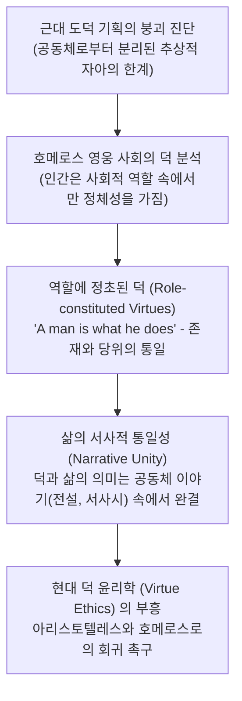

# 덕의 상실 — 제10장: 영웅 사회에서의 덕들 (*The Virtues in Heroic Societies*)

> [!NOTE] 학술사적 의의 및 총평
> 20세기 후반 현대 도덕철학의 지형을 뒤흔든 알래스데어 매킨타이어의 『덕의 상실』(1981) 제10장은 현대 덕 윤리학(Virtue Ethics)과 공동체주의(Communitarianism)의 기초를 놓은 기념비적 장입니다. 매킨타이어는 근대 계몽주의 도덕 기획(칸트의 보편주의, 공리주의, 이모티비즘)이 실패한 이유를 '공동체와 서사로부터 분리된 추상적 개인'을 전제했기 때문이라고 진단하고, **호메로스 영웅 사회를 분석하여 "인간의 덕(Virtue)은 언제나 사회적 역할(Role)의 충실한 수행과 삶의 서사적 통일성(Narrative Unity) 속에서만 성립한다"**는 혁명적 통찰을 제시했습니다.

---

## 1. 서지 정보 및 학술사적 맥락

- **저자**: 알래스데어 매킨타이어 (Alasdair Chalmers MacIntyre, 1929–2024) — 현대 서양 도덕철학의 거두, 아리스토텔레스-토마스주의 철학자.
- **출판 정보**: University of Notre Dame Press (1981, 286쪽; 제10장 pp. 121–130).
- **연구 목적**:
  - 도덕적 언어가 파편화되고 감정주의(Emotivism)의 혼란에 빠진 현대 사회를 구원하기 위해, 덕(Virtue)의 역사적 계보를 호메로스 영웅 사회 → 아리스토텔레스의 폴리스 → 중세 기독교로 이어지는 고전적 전통에서 복원.

---

## 2. 개념 전복 매트릭스 및 논증 계보도

### [근대 자유주의 도덕관 vs 매킨타이어의 호메로스 덕 모델]

| 비교 범주 | 근대 자유주의 도덕관 (Kant, Mill, Emotivism) | 매킨타이어의 고대 덕 윤리 모델 (*After Virtue*) |
|:---|:---|:---|
| **인간관** | 사회적 맥락과 무관한 '자율적이고 추상적인 개인' | 특정한 가문, 도시, **사회적 역할(Role)에 내장된 존재** |
| **덕([[concept-arete\|Arete]])의 정의** | 보편적인 도덕 법칙에 대한 내면적 의무 준수 | **주어진 역할(왕, 전사, 아내, 친구)을 탁월하게 수행하는 능력** |
| **존재와 당위 (Is vs Ought)** | 사실(Is)과 가치(Ought)는 논리적으로 완전히 단절됨 | **역할 개념 안에서 존재와 당위가 완벽히 일치함 (No gap)** |
| **삶의 구조** | 개별적이고 원자화된 행위들의 무작위적 나열 | 시작, 중간, 끝이 있는 **'삶의 서사적 통일성(Narrative Unity)'** |

### [Mermaid 논증 구조도]

---

## 3. 제10장 핵심 논지 정밀 분석

### 1.역할에 정초된 도덕적 정체성:
- 호메로스 사회에서 "나는 누구인가?"라는 질문은 언제나 "나는 누구의 아들이며, 어느 가문의 일원이고, 어떤 역할을 맡은 자인가?"로 답해집니다.
- 영웅에게 도덕적 의무는 추상적 인류애가 아니라, **'왕으로서, 전사로서, 동료로서 내게 요구되는 바를 행하는 것'**입니다.

### 2.'존재(Is)'와 '당위(Ought)'의 일치:
- 현대 윤리학(데이비드 흄 이래)은 "사실로부터 당위를 도출할 수 없다"고 주장하지만, 호메로스 사회에서는 그러한 분리가 존재하지 않습니다.
- 예: "그는 시계이다"라는 사실로부터 "그것은 시간을 잘 가리켜야 한다"는 당위가 바로 도출되듯, "그는 아가멤논의 군단장이다"라는 사실로부터 "그는 용감하게 싸워야 한다(Arete)"는 당위가 직접 규정됩니다.

### 3.삶의 서사적 통일성과 죽음의 의미:
- 영웅의 삶은 고립된 순간의 연속이 아니라, 탄생부터 전사(Death)에 이르는 하나의 완결된 드라마틱한 서사입니다.
- 영웅이 불멸의 명예([[concept-kleos|Kleos]])를 추구하는 것은 허영심 때문이 아니라, 자신의 삶이라는 이야기가 후대 시인들의 입을 통해 '하나의 완결된 영웅적 서사'로 기억되기를 열망하기 때문입니다.

---

## 4. 핵심 원문 인용 및 심층 주석

- *"In heroic society, a man is what he does. A man who does what is required of him is agathos; there is no gap between 'is' and 'ought', between what a man is and what he ought to do. Morality and social structure are in fact one and the same in heroic society."* (Chapter 10, p. 122)
- **[주석]**: 매킨타이어 도덕철학의 핵심 명제. 영웅 사회에서 도덕성은 추상적 이론이 아니라 사회적 역할 구조 그 자체임을 명쾌하게 규명함.

---

## 5. 서사시 전편 정밀 에피소드 매핑 테이블

| 서사시 권·행 번호 | 다루는 사건 및 인물 | 매킨타이어의 덕 윤리학적 해석 |
|:---|:---|:---|
| ***Il.* 9.318–345** | **아킬레우스의 역할 거부** | 아킬레우스가 참전을 거부하는 것은 단순한 고집이 아니라, 기성 영웅 사회의 역할 체계 전체에 의문을 제기하고 그로부터 이탈하려는 극적인 실존적 위기임. |
| ***Il.* 12.310–328** | **사르페돈의 노블레스 오블리주** | 사르페돈이 글라우코스에게 "우리가 뤼키아에서 가장 좋은 땅과 고기를 대접받으니, 마땅히 가장 앞장서 싸워야 한다"고 말하는 장면은 역할과 의무(Is-Ought)의 일치를 보여주는 교과서적 텍스트. |
| ***Il.* 24.503–518** | **프리아모스와 아킬레우스의 대면** | 늙은 아버지와 최고의 전사라는 각자의 서사적 역할을 인정하고 공유하며 함께 눈물을 흘림으로써 서사적 통일성을 완성함. |

---

## ## 관련 항목

- [[homeric-ethics-literature-review]]
- [[concept-arete|Arete]]
- [[concept-time|Timê]]
- [[concept-kleos|Kleos]]
- [[concept-moira|Moira]]
- [[williams-1993-shame-and-necessity]]
- [[adkins-1960-merit-and-responsibility]]
