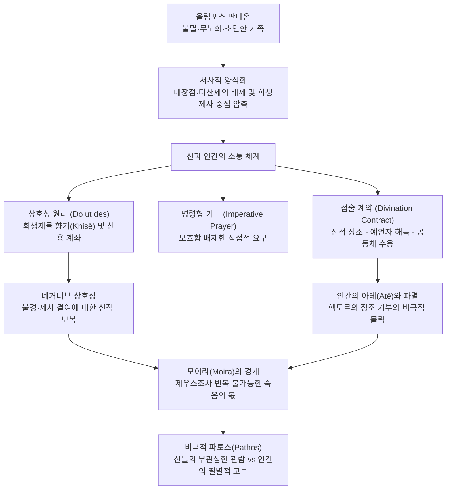

# 호메로스의 종교 (*Homeric Religion: The Gods and the Poet*)

> [!NOTE] 학술사적 의의 및 총평
> 엘리자베스 민친(Elizabeth Minchin)의 2019년 논문 「호메로스의 종교: 신들과 시인」(*Homeric Religion: The Gods and the Poet*)은 1950년대 미케네 선형 B 문자 해독과 고대 근동(서아시아) 비교 연구의 결실을 21세기 고전문헌학적 시각에서 집대성한 호메로스 종교 연구의 표준적 총론입니다. 민친은 호메로스 서사시의 종교 묘사가 실제 아르카익·고전기 그리스의 역사적 제의(내장 점술, 다산 제의, 신비 제의 등)를 전면 복원한 것이 아니라, 구술 서사시의 구성적 편의와 비극적 파토스 창출을 위해 고도로 '시학적으로 양식화(Poetic Stylization)'된 체계임을 규명했습니다. 신들을 단순한 신앙의 대상을 넘어 서사적 '구경꾼(Spectators)'이자 '행위자(Agents)'로 입체화함으로써, 시인이 인간의 비극적 운명을 어떻게 부각시키는지를 탁월하게 입증했습니다.

---

## 1. 서지 정보 및 학술사적 맥락

- **저자**: 엘리자베스 민친 (Elizabeth Minchin) — 호주국립대학교(ANU) 고전학 명예교수, 호메로스 구술 시학, 서사 기억 이론, 고대 그리스어 담화 분석의 세계적 석학.
- **출판 정보**: *Oxford Research Encyclopedia of Classics*, Oxford University Press, 2019 (online publication), pp. 1–23.
- **연구 방법론**:
  - 미케네 후기 청동기시대 선형 B(Linear B) 문서 판독 결과와 고대 근동(히타이트, 수메르, 셈족 문헌) 비교신화학의 통합.
  - 구술 서사시의 공식구 분석 및 서사 구성학(Narratology): 시인의 서사적 목표(Narrative goals)와 제의 묘사 축소(Economy of detail)의 상관성 규명.
  - 제사와 기도의 상호성(*do ut des*) 및 언어행위(Speech act) 분석.
- **학술사적 계보 및 세 가지 현대적 연구 경로**:
  - **1950년대의 분수령**: 선형 B 해독과 히타이트 문헌 판독으로 제르네(Louis Gernet)와 닐손(Martin Nilsson)의 진화론적·사변적 고대 종교 연구가 구식화됨.
  - **제1경로 (근동과의 영향사)**: 발크바로바(Bachvarova 2016), 마틴 웨스트(M. L. West 1997, 2007), 사라 모리스(Sarah Morris 1997) 등으로 이어지는 서아시아 판테온 수용 연구.
  - **제2경로 (제의와 상호성 연구)**: 수전 셰럿(Susan Sherratt 2004, 향연), 마고 키츠(Margo Kitts 2005, 맹세와 폭력), 사라 히치(Sarah Hitch 2009, 제사), 리처드 시포드(Richard Seaford 1994, 상호성), 사이먼 풀레인(Simon Pulleyn 1997, 기도), 케빈 크로티(Kevin Crotty 1994, 탄원).
  - **제3경로 (문학적·신학적 접근과 관람자로서의 신)**: 재스퍼 그리핀(Jasper Griffin 1980)의 선구적 연구 이래, 야마가타 나오코(Naoko Yamagata 1994, 도덕률), 데이비드 엘머(David Elmer 2013, 합의 시학), 피에트로 푸치(Pietro Pucci 2002), 루스 스코델(Ruth Scodel 2017, 모이라와 제우스의 계획)로 이어지는 신학-시학 융합 연구.

---

## 2. 핵심 테제 및 개념 체계도

### [핵심 테제 매트릭스]

| 분석 층위 | 전통적 제의 실재 (Historical Cult) | 호메로스 서사시의 양식화 (Poetic Reality) | 시학적·서사적 기능 |
|:---|:---|:---|:---|
| **제의적 행위** | 내장 점술, 다산 제의, 신비 제의, 정기 축제 성행 | 내장 점술·다산 제의 전면 배제, 동물 희생제사(Thysia)로 극단적 압축 | 서사 속도 유지, 청중의 몰입 유도 및 구술 구성의 경제성 |
| **신들의 성격** | 지역별 국지적 숭배 대상, 기능적 신격 | 올림포스 혈연 대가족, 강렬한 인간화 및 개별 성격 부여 | 부르케르트가 말한 '명쾌한 조직화', 서사 갈등 및 동맹 구조 창출 |
| **신-인간 관계** | 일방적 복종 또는 마술적 주술 | 엄격한 상호성(*do ut des*, 신용 계좌) 및 불경 시 가혹한 보복 | 영웅 행위의 동기 부여 및 비극적 좌절(배신감) 유발 |
| **운명과 정의** | 모이라와 신의 뜻 간의 혼란 | 모이라(Moira)는 불변, 제우스는 질서 집행자이나 한계 직면 | 사르페돈·헥토르의 죽음 앞 제우스의 고뇌와 파토스 극대화 |
| **서사적 위상** | 숭배받는 절대적 초월자 | 초연한 관객(Spectator)이자 편파적 개입자(Agent) | 인간의 비극을 '스펙터클'로 관람함으로써 필멸성의 비극성 부각 |

### [Mermaid 신-인간 상호작용 및 서사 구조도]

---

## 3. 섹션별 정밀 분석

### 제1절: 서사시의 신들과 역사적 배경 (pp. 1–3)
- **미케네 전통과 근동의 영향**:
  - 호메로스 판테온의 신들(포세이돈, 헤라, 아테나, 헤파이토스 등)은 그리스어파 선조 정착 이전 펠로폰네소스 원주민의 신들이었으며, 제우스는 인도유럽어족 하늘신(*Dyaus pīter*)에서 유래했습니다.
  - 하데스, 아프로디테, 아르테미스, 아폴론 등은 소아시아와 근동 문화와의 교류 속에서 유입되었습니다. 아프로디테를 제외한 거의 모든 주요 신의 이름이 미케네 선형 B 점토판에서 이미 확인됩니다.
- **가족 구조와 조직의 명쾌함**:
  - 메소포타미아(수메르 등) 신화의 영향을 받아 신들은 하나의 확대가족으로 재편되었으며, 발터 부르케르트(Walter Burkert)가 지적했듯 호메로스 신들의 본질적 특징은 '명쾌한 조직화(Clarity of organization)'에 있습니다.

### 제2절: 신들의 본성과 생리학적 초월성 (pp. 3–5)
- **신적 생리학(Divine Physiology)**:
  - 신들은 영원히 늙지 않고(ἀγήρως, *agērōs*), 죽지 않는(ἀθάνατος, *athanatos*) 존재입니다.
  - 혈관에는 인간의 피 대신 신적 유체인 **이코르**(ἰχώρ, *ichōr*, *Il.* 5.339–340)가 흐르며, 부패하는 인간의 음식 대신 **암브로시아**(ἀμβροσία, *ambrosia*)와 **넥타르**(νέκταρ, *nektar*)를 섭취합니다.
  - 인간이 바치는 제물의 고기를 직접 먹지 않고, 불에 타오르는 고기의 향기(κνίση, *knisē*, *Il.* 1.315–317)만을 향유함으로써 성장과 쇠락의 생물학적 순환에서 영구히 벗어나 있습니다.
- **초월적 공간과 국지적 숭배의 초월**:
  - 신들은 올림포스산 정상의 완벽하고 화려한 거처에 살며, 아르고스, 뮠케나이, 스파르타 등 지상의 주요 성소를 편애하지만, 서사시 안에서 이러한 국지적 숭배는 초월됩니다. 헤라는 트로이아를 멸망시킬 수만 있다면 자신이 아끼는 아르고스나 뮠케나이가 훗날 파괴되어도 상관없다고 선언합니다(*Il.* 4.51–54).

### 제3절: 신과 인간의 교섭, 우연, 이중 동기화 (pp. 5–6)
- **우연(Random chance)의 배제**:
  - 호메로스 서사 세계에서는 어떤 일도 우연이나 단순 사고로 일어나지 않습니다. 전사가 갑작스러운 힘이나 속도를 발휘하거나(*Il.* 23.770–772), 아이아스의 창끝이 부러지는 사건(*Il.* 16.114–121) 등 모든 비일상적 계기는 신의 직접적 개입으로 환원됩니다.
- **인간 심리의 신적 외화(이중 동기화, Double Motivation)**:
  - 판다로스가 휴전을 깨고 화살을 쏘는 충동(*Il.* 4.86–104)이나, 아킬레우스가 칼을 뽑으려다 분노를 거두는 망설임(*Il.* 1.188–205)은 인간의 심리적 충동과 반성이 아테나의 개입으로 외화된 것입니다. E. R. 도즈가 지적한 '이중 동기화'를 통해 시인은 결정적 심리 순간을 청중의 뇌리에 선명하게 각인시킵니다.

### 제4절: 신들과 운명(Moira), 그리고 제우스의 한계 (pp. 6–7)
- **모이라(Moira)와 제우스의 뜻(Dios boulē)**:
  - 서사시의 거대한 사건 흐름(트로이아 함락, 영웅들의 정해진 수명)은 제우스의 뜻이자 동시에 모이라(할당된 몫)입니다.
  - 제우스는 자신의 아들 사르페돈(*Il.* 16.431–461)이나 독실한 헥토르(*Il.* 22.168–185)를 구출하고 싶어 연민을 느끼지만, 헤라의 항의를 받고 즉각 포기합니다.
- **신들이 모이라를 수호하는 이유**:
  - 신들이 운명을 뒤흔들지 않는 이유는 모이라의 질서 체계 자체가 신들의 권위와 명예([[concept-time|Timê]])를 정당화하는 근본 규칙이기 때문입니다. 아테나가 텔레마코스에게 말하듯, 죽음은 신들조차 사랑하는 자에게서 물리쳐 줄 수 없는 보편적 몫입니다(*Od.* 3.236–238).

### 제5절: 인간 행동에 대한 신적 감시와 정의(Dike) (pp. 7–9)
- **제우스의 세 가지 규범 영역**:
  - (1) **환대의 수호자(Zeus Xeinios)**: 나그네와 손님을 보호하고 침해자를 처벌함. 파리스의 배신을 징벌해 달라는 메넬라오스의 기원(*Il.* 3.351–354)과 트로이아 원정의 도덕적 정당화 근거.
  - (2) **탄원자의 수호자(Zeus Hiketesios)**: 오디세우스가 폴리페모스에게 자신들이 탄원자임을 밝힐 때 언급됨(*Od.* 9.269–271). 단, 신들의 탄원 수호는 대체로 응답이 지연되는 경향이 있습니다. 유일한 즉각적 구원은 스케리아 섬 강 하구에서 오디세우스의 기도를 들은 강신의 즉각적 파도 진정(*Od.* 5.447–453)뿐입니다.
  - (3) **맹세의 수호자**: 판다로스의 휴전 서약 파기를 처벌하지만, 이 서약 파기조차 제우스 자신이 아테나를 보내 충동질한 모순을 내포합니다(*Il.* 4.70–72).
- **정의(Dike) 수호의 불확실성과 두 서사시의 차이**:
  - *일리아스*의 신들은 인간 사회의 도덕적 정의보다 자신들의 명예([[concept-time|Timê]]) 침해에 반응합니다. *일리아스*에서 제우스가 부정직한 판결에 분노하여 가을 폭우를 쏟아붓는다는 묘사는 오직 직유(*Il.* 16.384–388)에서만 단 1회 등장할 뿐입니다.
  - 반면 *오뒷세이아*에서는 악행에 대한 신적 징벌이라는 도덕화된 정의관(*Od.* 1.32–34, 3.130–136)이 중심축으로 확립됩니다.

### 제6절: 소통의 실제: 제사, 제주, 상호성, 기도 (pp. 9–13)
- **동물 제사(Thysia)와 향연(Dais)**:
  - 호메로스 세계의 제사는 거의 전적으로 동물(소, 양, 염소, 100마리 규모의 헤카톰베)로 이루어지며, 곡물이나 기름 제물은 없습니다.
  - 사제(Hiereus)는 크리세스나 테아노 같은 특수한 경우에만 등장하며, 통상적으로 아가멤논이나 네스토르 같은 공동체의 최고 남성 군주가 직접 집도합니다.
  - 제사는 신에게 넓적다리 뼈를 바친 뒤 고기를 분배하여 함께 나누는 향연으로 이어지며, 신적 호의 축적과 인간 사회 내부의 결속이라는 이중의 목적을 달성합니다.
- **상호성 원리(*do ut des*)와 네거티브 상호성**:
  - 제사와 기도는 '신적 신용 계좌(Credit account)'를 구축합니다. 크리세스는 과거 지어준 신전과 바친 제물을 상기시키며 기도를 올리고(*Il.* 1.39–42), 제우스는 헥토르가 제단을 비운 적이 없었음을 상기하며 시신 보존을 명합니다(*Il.* 24.68–70).
  - 반면 제사를 게을리한 자는 반드시 처벌받습니다. 테우크로스는 아폴론에게 첫 새끼 양을 바치겠다고 서원하지 않아 화살이 빗나갔으며(*Il.* 23.862–865), 아카이아군은 성대한 헤카톰베 없이 방벽을 쌓았기 때문에 훗날 신들에 의해 완전히 파괴됩니다(*Il.* 7.446–450, 12.1–35).
- **명령형 기도(Imperative Prayer)**:
  - 인간은 신과의 거대한 위계 차이에도 불구하고 완곡한 어법 대신 직접적인 명령형 동사(δός, ὄπασσον, προές)를 씁니다(*Il.* 7.203, 16.241, 24.309). 이는 종교적 건방짐이 아니라, 위급한 상황에서 의도의 혼선을 막기 위한 명확성(Clarity)의 추구입니다.
- **거절당한 기도의 서사적 기능**:
  - 트로이아 여인들의 아테나 신전 기도 거부(*Il.* 6.311: 여신이 고개를 위로 젖힘), 아가멤논의 기도에 대한 거부(*Il.* 2.412–420), 파트로클로스의 귀환을 바란 아킬레우스 기도의 반쪽 거부(*Il.* 16.249–252) 등은 비극적 전환점(Turning point)을 알리는 시인의 고도화된 복선 장치입니다.

### 제7절: 징조 해독과 점술 계약 (pp. 13–15)
- **점술의 삼자 계약 구조**:
  - 신의 징조 발신(새의 비행, 천둥, 뱀 등) → 예언자(Mantis)의 전문적 해독 → 공동체의 신뢰와 수용.
  - 고전기·로마기와 달리 동물의 내장 점술은 호메로스 텍스트에 완전히 부재합니다.
- **헥토르의 징조 거부와 아테([[concept-ate|Atē]])**:
  - 폴리다마스가 독수리가 뱀을 떨어뜨린 징조를 보고 진격을 멈추자고 간언했을 때, 헥토르는 "단 하나의 길조는 조국을 지키기 위해 싸우는 것(*heis oiōnos aristos amynesthai peri patrēs*)"이라며 새점을 무시합니다(*Il.* 12.237–243).
  - 이는 애국심의 숭고한 발로로 읽힐 수 있으나, 신학적·서사적 관점에서는 신의 경고를 걷어찬 치명적 망집이자 비극적 죽음을 부르는 아테의 표식입니다.

### 제8절: 시인과 신들: 관람자이자 매개자 (pp. 15–17)
- **신들의 '초연한 관람(Spectacle)'과 비극적 파토스**:
  - 신들은 지상의 살육전을 올림포스 정상에서 구경하며 오락거리(Entertainment)로 즐기기도 합니다. 신들에게 인간들의 전쟁은 결코 목숨을 걸 만큼 중대한 일이 아닙니다(*Il.* 1.573–576).
  - 그러나 시인은 바로 이 불멸하는 신들의 잔혹한 초연함과 가벼움을 필멸하는 인간들의 처절한 고투와 선명하게 대비시킴으로써, 역설적으로 인간 삶의 숭고함과 비극적 파토스(Pathos)를 최고조로 끌어올립니다.

---

## 4. 주요 원문 인용 및 정밀 주석

- "신들은 영원히 늙지 않고(ἀγήρως) 죽지 않는다(ἀθάνατος)."
  - *Il.* 12.323; 17.444; *Od.* 1.31.
  - **[주석]**: 신들의 불멸성은 단순한 시간적 지속이 아니라, 질병·노화·죽음이라는 인간적 조건(Condition)에서의 완전한 면제를 의미함.

- "신들의 혈관에는 피 대신 이코르(ἰχώρ)가 흐르니, 그들은 빵을 먹지 않고 빛나는 포도주를 마시지 않기 때문이라."
  - *Il.* 5.339–342.
  - **[주석]**: 디오메데스에게 상처 입은 아프로디테의 몸에서 흐른 신적 유체. 신들의 생리학이 필멸의 음식 섭취와 무관함을 증명함.

- **번역**: "단 하나의 길조는 조국을 위하여 싸우는 것뿐이다."
- **원문**: *εἷς οἰωνὸς ἄριστος ἀμύνεσθαι περὶ πάτρης*
- **학술 전사**: *heîs oiōnòs áristos amúnesthai perì pátrēs* (*Il.* 12.243)
- **[주석]**: 폴리다마스의 불길한 징조 경고를 묵살하는 헥토르의 단호한 선언. 애국적 의무와 신적 징조 무시라는 호메로스 영웅 윤리의 모순을 집약함.

- "그를 나 또한 사랑했노라. 그는 내가 좋아하는 선물을 거른 적이 없었지. 내 제단에는 결코 훌륭한 제물과 연기와 향기(knisē)가 부족한 적이 없었으니, 그것이 바로 우리의 명예의 몫(timê)이기 때문이다."
  - *Il.* 24.68–70.
  - **[주석]**: 제우스가 아폴론의 요청에 응하여 헥토르의 시신을 아킬레우스의 모욕으로부터 구출하도록 명하는 결정적 근거. 제사 행위가 신들에게 명예의 배당이자 보답 의무를 부과하는 상호성(*do ut des*)의 전형.

- "그러나 죽음이란 누구에게나 공통된 것. 신들조차 자신들이 사랑하는 인간이라 할지라도, 평등하게 눕히는 죽음의 파멸적 몫(moira)이 그를 덮칠 때는 막아낼 수 없나니."
  - *Od.* 3.236–238.
  - **[주석]**: 아테나가 텔레마코스에게 전하는 신적 권능의 한계 규정. 신들의 권능조차 모이라(운명)의 궁극적 분배선 앞에서는 정지됨.

---

## 5. 지식베이스 내 연관 개념 및 엔티티 교차 참조

- **[[concept-time|티메 (Timê)]]**: 제사를 통한 명예 배당과 '신적 신용 계좌' 형성, 불경에 대한 네거티브 상호성 보복.
- **[[concept-xenia|크세니아 (Xenia)]]**: 제우스 크세니오스(Zeus Xeinios)의 환대 질서 보증과 트로이아 원정의 정당화.
- **[[concept-hikesia|히케시아 (Hikesia)]]**: 탄원자 수호와 신적 응답의 지연성, 스케리아 강신의 예외적 즉각 응답.
- **[[concept-ate|아테 (Atē)]]**: 폴리다마스의 조언과 신적 징조를 무시한 헥토르의 파멸적 결단.
- **[[adkins-1960-merit-and-responsibility|애드킨스 (1960)]]**: 결과주의적 성공과 경쟁적 덕목에 대한 비판적 대조군.
- **[[dodds-1951-greeks-and-irrational|도즈 (1951)]]**: 인간 심리 동기화의 신적 외화(이중 동기화) 이론과의 연계.
- **[[lloyd-jones-1971-justice-of-zeus|로이드-존스 (1971)]]**: 제우스의 정의(Dike)와 도덕적 우주 질서 논쟁과의 대비.
- **[[kearns-2006-gods-in-homeric-epics|컨스 (2006)]]**: 제의 실재와 서사 판테온의 괴리, 신들의 당파성과 시학적 종속에 대한 상호보완적 연구.

---

## 관련 항목

- [[overview|서사시 개요]]
- [[wiki/index|위키 색인]]
- [[analysis-concept-source-matrix|개념과 문헌 매트릭스]]
- [[kearns-2006-gods-in-homeric-epics|호메로스 서사시의 신들 (Kearns 2006)]]
- [[concept-time|티메 (Time)]]
- [[concept-xenia|크세니아 (Xenia)]]
- [[concept-hikesia|히케시아 (Hikesia)]]
- [[concept-ate|아테 (Ate)]]
