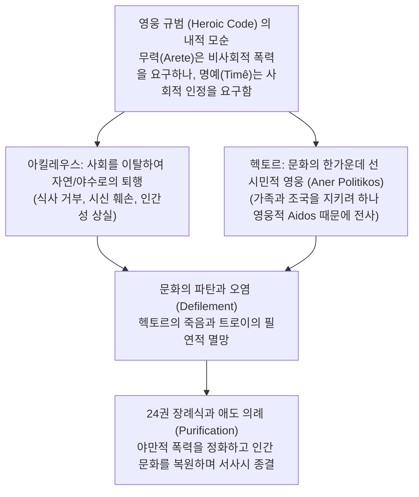

# 일리아스의 자연과 문화: 헥토르의 비극 (*Nature and Culture in the Iliad: The Tragedy of Hector*)

> [!NOTE] 학술사적 의의 및 총평
> 시카고 대학교 고전문헌학자이자 문화인류학자인 제임스 레드필드의 『일리아스의 자연과 문화』(1975)는 서양고전학계에 구조주의 인류학(클로드 레비-스트로스의 자연/문화 2분법)과 아리스토텔레스 시학을 탁월하게 융합한 불후의 고전입니다. 『일리아스』가 단순한 영웅 찬가가 아니라, **영웅 규범(Heroic Code) 자체가 내포한 파괴적 모순으로 인해 문명과 공동체가 붕괴하는 과정을 고발한 '문화의 비극(Tragedy of Culture)'**임을 규명하고, 트로이의 수호자 헥토르를 서사시의 진정한 비극적 주인공으로 재조명했습니다.

---

## 1. 서지 정보 및 학술사적 맥락

- **저자**: 제임스 M. 레드필드 (James M. Redfield, 1935– ) — 시카고 대학교 고전학 및 사회사상위원회(Committee on Social Thought) 명예교수.
- **출판 정보**: University of Chicago Press (1975, 확장판 Duke University Press, 1994, 280쪽).
- **연구 방법론**:
  - 구조주의 문화인류학(자연 vs 문화, 순수 vs 오염, 문명 vs 야만)과 문헌학적 정밀 독해의 결합.
  - 서사시의 사회적 기능과 공동체적 의례(장례식, 선물 교환, 스포츠 제전)의 인류학적 의미 분석.
- **핵심 문제의식**:
  - 왜 영웅 사회는 공동체를 지키기 위해 영웅의 무력([[concept-arete|Arete]])을 필요로 하면서도, 그 영웅의 명예욕([[concept-time|Timê]])에 의해 공동체 자체가 파멸하는 비극을 겪는가?

---

## 2. 개념 전복 매트릭스 및 논증 계보도

### [자연(Nature)과 문화(Culture)의 구조적 대립 체계]

| 영역 | 자연 (Nature / Physis / 야생) | 문화 (Culture / Nomos / 문명) |
|:---|:---|:---|
| **공간 및 제도** | 전장의 평원, 야생, 들개와 새의 영역 | 폴리스(트로이), 가정(Oikos), 성벽, 장례식 |
| **영웅 모델** | **아킬레우스 (Achilles)** — 문화를 거부하고 야수로 퇴행 | **헥토르 (Hector)** — 가족과 조국을 수호하는 시민적 영웅 |
| **행위 양식** | 비인간적 도륙, 살인, 시신 훼손(오염) | 식사, 대화, 부부애, 종교 제의, 애도(정화) |
| **윤리적 결과** | 영웅 규범의 파괴적 광기와 사회 해체 | 24권 화해와 장례식을 통한 인간 문화의 재건 |

### [Mermaid 논증 구조도]

---

## 3. 전 5개 장별 정밀 독해 및 논증 단계

### 제1장: 서사적 맥락과 영웅 사회 (*The Epic Context*)
- 호메로스 사회에서 영웅의 지위는 공동체에 의해 부여됩니다. 영웅은 사회적 의무를 다함으로써 칭찬을 얻지만, 그가 사용하는 수단(전쟁과 폭력)은 본질적으로 반사회적인 파괴성을 띱니다.

### 제2장: 영웅과 사회적 역할 (*The Hero*)
- 아레테([[concept-arete|Arete]])와 티메([[concept-time|Timê]])의 긴장 관계를 분석합니다. 영웅은 자신의 목숨을 바쳐 공동체를 지키지만, 공동체가 자신의 명예를 조금이라도 훼손할 경우(1권의 갈등) 즉각 공동체를 파멸로 몰고 가는 위험한 존재입니다.

### 제3장: 헥토르의 비극 (*The Tragedy of Hector*)
- **시민적 영웅(Aner Politikos)의 딜레마**:
  - 헥토르는 아킬레우스와 달리 가족(안드로마케, 아스티아낙스)과 시민들의 평화를 사랑하는 문명인입니다.
  - 그러나 그는 동료들에 대한 부끄러움([[concept-aidos|Aidos]])과 전사로서의 자존심 때문에 성벽 안으로 피신하라는 가족들의 애원을 뿌리치고 평원에서 홀로 싸우다 죽음을 맞이합니다.
  - 이로써 헥토르의 개인적 영웅주의는 그가 그토록 지키고자 했던 트로이아 문명 전체를 멸망시키는 비극적 결과를 낳습니다.

### 제4장: 반(反)영웅과 자연으로의 퇴행 (*The Anti-Hero*)
- 파트로클로스의 죽음 이후 아킬레우스의 변모를 분석합니다. 아킬레우스는 식사를 거부하고, 생명체로서의 자연적 한계를 부정하며, 적의 시신을 훼손하는 등 '문화'의 영역을 완전히 이탈하여 '야수와 신'의 혼돈 상태로 퇴행합니다.

### 제5장: 오염과 정화로서의 장례식 (*The Funeral and Redemption*)
- 시신을 훼손하여 들개에게 던지는 행위는 인간을 동물(자연)로 격하시키는 극도의 문화적 오염입니다.
- 서사시 24권에서 프리아모스가 아킬레우스를 찾아와 화해하고 헥토르의 시신을 수습하여 장례(Tarkhos)를 치르는 것은, 전쟁의 야만성을 극복하고 인간 문화의 규범을 재건하는 신성한 정화 의식입니다.

---

## 4. 핵심 원문 인용 및 심층 주석

### 인용 1: 문화의 비극으로서의 일리아스
- *"The Iliad is a poem of culture in tragedy. The heroic code, which is meant to secure order and honour for the community, ultimately isolates the hero and brings about the destruction of the very society he fights to protect."* (Chapter 3, p. 99)
- **[주석]**: 레드필드의 중심 테제. 영웅 규범의 본질적 자기모순을 명쾌하게 압축함.

### 인용 2: 헥토르의 이중적 지위에 대하여
- *"Hector is the tragic hero because he is fully embedded in human culture. He fights not for abstract personal glory, but for his city, his parents, his wife, and his child; yet it is precisely his commitment to the warrior code that destroys them all."* (Chapter 3, p. 128)
- **[주석]**: 헥토르가 아킬레우스보다 훨씬 더 깊은 인간적 비극성을 획득하는 이유를 해명함.

---

## 5. 서사시 전편 정밀 에피소드 매핑 테이블

| 서사시 권·행 번호 | 다루는 사건 및 인물 | 레드필드의 문화인류학적 해석 |
|:---|:---|:---|
| ***Il.* 6.390–502** | **헥토르와 안드로마케의 작별** | 투구를 쓴 전사의 모습에 아기가 겁을 먹고 울자 헥토르가 투구를 벗고 웃는 장면은, 전쟁의 야만적 무력(자연)과 가족의 평화(문화)가 양립할 수 없음을 보여주는 문학적 절정. |
| ***Il.* 22.99–130** | **성문 앞 헥토르의 고뇌** | 성안으로 들어가면 살 수 있으나 시민들의 비난([[concept-aidos\|Aidos]]) 때문에 성벽 밖에서 홀로 죽음을 맞는 헥토르의 시민적 딜레마. |
| ***Il.* 23.1–257** | **파트로클로스의 장례식과 경기** | 전우의 죽음을 문화적 의례(화장과 스포츠 제전)로 승화시켜 공동체의 질서를 회복하는 과정. |
| ***Il.* 24.718–804** | **헥토르의 장례식 (서사시의 종결)** | 세 여인(안드로마케, 헤카베, 헬레네)의 애가와 정중한 화장을 통해 전쟁의 폭력성을 극복하고 인간 문화의 규범을 재건하며 대단원의 막을 내림. |

---

## ## 관련 항목

- [[homeric-ethics-literature-review]]
- [[concept-arete|Arete]]
- [[concept-time|Timê]]
- [[concept-aidos|Aidos]]
- [[일리아스]]
- [[entity-hector|헥토르]]
- [[entity-achilles|아킬레우스]]
- [[vernant-1989-belle-mort]]
- [[zanker-1994-heart-of-achilles]]
- [[shay-1994-achilles-in-vietnam]]
