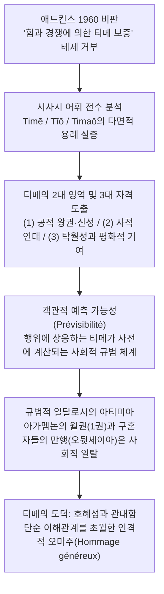

# 호메로스에게서의 티메 (*La τιμή chez Homère*)

> [!NOTE] 학술사적 의의 및 총평
> 프랑스 고전문헌학자 장클로드 리댕제(Jean-Claude Riedinger)의 1976년 논문 「호메로스에게서의 티메」(*La τιμή chez Homère*, *REG* 89)는 K. 라테(K. Latte 1946)와 A. W. H. 애드킨스(A. W. H. Adkins 1960)가 정립한 '폭력·무력 중심의 제로섬 경쟁 사회' 테제를 본문 내적 실증을 통해 전면적으로 뒤엎은 기념비적 논문입니다. 리댕제는 호메로스 사회가 각자가 가진 물리력에 의해서만 명예가 위태롭게 유지되는 정글이 아니라, 티메(timē)의 분배 규칙이 개인의 사고와 행동을 완벽히 규율하는 고도로 응집력 있는 '사회적 질서(ordre social)'임을 밝혔습니다. 특히 티메가 사회적으로 사전에 계산·예측 가능(prévisible)하며, 단순한 이해관계 교환을 넘어선 '호혜성과 계산 없는 관대함(réciprocité et générosité)'에 기반한 고유한 도덕 질서(morale de la timē)를 구축한다는 그의 논증은 고대 그리스 가치 연구사의 중대한 전환점이 되었습니다.

---

## 1. 서지 정보 및 학술사적 맥락

- **저자**: 장클로드 리댕제 (Jean-Claude Riedinger) — 프랑스의 고전문헌학자, 호메로스 서사시와 고대 그리스 제도·가치 어휘 연구자.
- **출판 정보**: *Revue des Études Grecques* (REG), tome 89, fascicule 426-427 (Juillet-décembre 1976), pp. 244–264 (DOI: 10.3406/reg.1976.4107).
- **연구 방법론**:
  - 서사시 전편에 걸친 명사 티메(τιμή) 및 동사 티오(τίω), 티마오(τιμάω), 복합어(ὁμότιμος 등)의 실제 화맥(Context) 전수 분석.
  - 사회학적·인류학적 제도 분석(에밀 벵베니스트와 루이 제르네의 선물 교환 이론 연계)과 정밀 문헌학의 결합.
- **핵심 문제의식**:
  - 호메로스 사회는 정말로 애드킨스의 주장처럼 오직 개인이 소유한 물리적 무력(force/biē)으로만 명예가 방어되는 방어적·경쟁적 사회인가?
  - 티메를 부여받는 자와 수여하는 자의 자격(qualifications)은 어떻게 구조화되어 있는가?
  - 서사시의 수많은 갈등(아킬레우스-아가멤논, 오디세우스-구혼자들)은 단순한 폭력의 충돌인가, 아니면 티메의 공유된 사회적 규칙을 둘러싼 규범적 논쟁인가?
  - 티메의 의무는 단순한 기브앤테이크(이해관계 교환)인가, 아니면 독자적인 도덕적 규범성을 지니는가?

---

## 2. 개념 전복 매트릭스 및 논증 계보도

### [애드킨스 모델 vs 리댕제 모델 비교 매트릭스]

| 분석 층위 | 애드킨스 (Adkins 1960) 모델 | 리댕제 (Riedinger 1976) 비판 및 대안 모델 |
|:---|:---|:---|
| **사회 질서의 성격** | 외부와 내부의 적을 항상 경계하는 방어적·적대적 경쟁 사회 | 티메의 원칙과 규칙이 고도로 공유되고 관철되는 안정된 사회 질서(ordre social) |
| **티메(Timē)의 보증 수단** | 개인이 가진 물리적 무력(force/biē)과 지위 방어 능력 | 사회 전체(dēmos) 및 타인의 승인, 확고한 규범적 자격 체계 |
| **티메의 성격** | 개인이 요구하고 힘으로 쟁취하는 주관적 자본 또는 재화 | 사회적 관계(relation) 그 자체이며, 개인이 사회에 깊이 편입되는 양식 |
| **수여의 예측 가능성** | 우연적이고 힘의 역학 변동에 따라 언제든 강탈당할 수 있음 | 행동과 자격에 상응하는 티메의 크기가 사전에 사회적으로 계산·예측 가능함(prévisible) |
| **티메 수여의 자격** | 주로 군사적 무공과 전장에서의 경쟁적 탁월성 | 군주권·신성, 사적 연대(가족/동료/환대), 평화적 분쟁 완화(*philophrosunē*)와 충실성(*pistos*) |
| **교환의 본질** | 이해관계의 상호 계산에 따른 서비스 교환(relation d'intérêt) | 계산을 초월하여 인격에 바치는 **관대한 헌정**(hommage généreux)과 호혜성의 도덕 |
| **전(前)법적 성격의 의미** | 법적 강제력이 없어 무력에 의존할 수밖에 없는 체계적 결함 | 법적 강제가 없기에 역설적으로 순수한 자발적·관대한 헌신을 가능하게 하는 활력의 원천 |

### [Mermaid 논증 구조도]

---

## 3. 논문의 핵심 테제 및 섹션별 정밀 분석

### 제1절: 티메의 다면성과 이중적 영역 (pp. 244–248)

- **다면적 현실로서의 티메**:
  - 티메는 한 인물 안에서도 단일하지 않고 여러 갈래로 분화되어 독립적으로 작동합니다.
  - 아이네이아스는 프리아모스로부터는 홀대받지만(*Il.* 13.461), 트로이아 백성들로부터는 '신처럼 존경받고'(*Il.* 11.58), 아카마스와 프리아모스의 아들들로부터는 헥토르와 동등하게 존중받습니다(*Il.* 5.467).
  - 아킬레우스 역시 아가멤논 한 사람에 의해 모욕당했을 뿐이지만 절대적 무자격자(ἄτιμος)를 선언하는 반면, 제우스가 부여하는 티메에 만족하며 아카이아인들의 인정은 없어도 무방하다고 선언합니다(*Il.* 9.607 sqq.).
- **(1) 공적·객관적 영역: 왕권과 신성 (la condition royale ou divine)**:
  - 군주의 티메(τιμή royale)는 왕의 통치 기능과 그에 주어지는 존경이 융합된 개념입니다.
  - 네스토르는 아킬레우스에게 아가멤논과 다투지 말라고 충고하며, 아가멤논의 티메가 우월한 이유는 그가 더 용감해서가 아니라 "더 많은 사람을 통치하기 때문"이라고 명시합니다(*Il.* 1.277 sqq.). 디오메데스 역시 아가멤논이 용기는 결여되었으나 왕홀(sceptre)로 인해 최고의 티메를 누린다고 지적합니다(*Il.* 9.38–39).
  - 신들의 세계에서도 포세이돈은 자신이 제우스와 동등한 권능과 영토 몫을 제비뽑아 나누어 가졌으므로 동등한 명예를 지닌 자(**호모티모스**, ὁμότιμος)라고 선언하며 굴종을 거부합니다(*Il.* 15.185 sqq.).
  - 아오이도스(aoidos, 시인) 역시 무사이의 가르침과 사랑으로 인해 티메와 아이도스의 몫을 가집니다(*Od.* 8.480).
- **(2) 사적 영역: 오이코스와 친구·동료·환대 (l'ordre privé)**:
  - 티메는 가정([[concept-oikos|Oikos]]) 내부에서 남편과 아내, 부모와 자식, 형제, 심지어 주인과 충직한 하인 사이에서 양방향으로 성립합니다(*Od.* 1.432, 16.306–307).
  - 또한 전우([[concept-hetairoi|Hetairoi]]) 사이, 그리고 손님([[concept-xenia|Xenia]])에 대한 존중에서도 티메가 중심을 이룹니다.
  - 리댕제는 사적 관계에서의 티메가 **필로테스**([[concept-philotes|Philotēs]]), **필로스**(philos)와 완벽히 상호 치환됨을 문헌학적으로 증명합니다(*Il.* 24.61–62, 22.233–235).

---

### 제2절: 티메 수여의 3대 자격과 평화적 미덕의 재발견 (pp. 248–253)

리댕제는 티메가 아무에게나 자의적으로 주어지는 것이 아니라 엄격한 세 가지 '자격(qualifications)'에 기초함을 도출합니다:
1. **신분적 자격**: 왕, 신, 종교적 직분자(사제, 시인).
2. **사적 연대 자격**: 가족, 동료, 손님 관계.
3. **개인의 탁월성(valeur)과 행동에 따른 자격**:

- **평화적 미덕과 분쟁 완화의 티메**:
  - 전통적 해석은 영웅의 티메를 오직 군사적 무공으로만 설명해왔습니다. 그러나 리댕제는 호메로스가 **평화적 행동, 분쟁 완화, 절제**에 대해서도 최고의 티메를 부여함을 밝혀냅니다.
  - 오디세우스가 전하는 펠레우스의 훈계(*Il.* 9.254–258)에서, 아버지는 아들에게 전장의 권능(kratos)은 신들이 주지만, 가슴속의 분노를 다스리고 친절하고 온화한 마음(**필로프로쉬네**, φιλοφροσύνη)을 지녀 분쟁을 그치는 자만이 "아카이아인들에게 더 큰 명예(티메)를 받는다"고 가르칩니다.
- **포이닉스의 9권 연설 분석 (*Il.* 9.602–605)**:
  - 포이닉스는 아킬레우스에게 아가멤논의 선물을 받고 출전하면 아카이아인들이 "신처럼 티메를 바칠 것"이지만, 선물을 거절하고 뒤늦게 참전하면 비록 적을 물리칠지라도 더 낮은 티메를 받게 될 것이라고 경고합니다.
  - 리댕제는 이 구절을 정밀 분석하여, 여기서 약속된 티메가 '전투 무공'에서 오는 것도 아니고, '아가멤논의 물질적 선물 그 자체'도 아니라고 논증합니다. 선물은 아가멤논 한 사람이 주는 것이지만 티메는 아카이아 군대 전체가 바치는 것입니다.
  - 따라서 아킬레우스가 받게 될 최고의 티메는 바로 **자신의 분노를 거두고 공동체를 파멸에서 구원하기로 결단하는 행위** 그 자체에 대한 집단적 경의입니다.
- **충실성(*pistos*)의 자격**:
  - 사적 관계에서도 신실함(*pistos*)과 충성심이야말로 동료 간의 티메를 비약적으로 증대시키는 결정적 자격으로 작동합니다(*Il.* 16.146, 5.325, *Od.* 19.247).

---

### 제3절: 티메의 객관적 예측 가능성(Prévisibilité)과 사회적 규범성 (pp. 253–261)

- **사전 계산 가능성(Prévisibilité) 테제**:
  - 리댕제의 가장 독창적인 통찰 중 하나는 호메로스 사회에서 티메가 **행위 이전에 미리 정확히 계산되고 예측될 수 있다**는 점입니다.
  - 특정 행위나 공헌에 어느 정도의 티메가 따를지는 사회 구성원 모두에게 명확한 규칙으로 공유되어 있습니다.
  - 『일리아스』 1권에서 테티스와 제우스의 계획(1.508–510), 9권 사절단의 연설, 16권 아킬레우스가 파트로클로스에게 함선 방어선까지만 싸우고 물러서라고 지시하는 정밀한 계산(16.83–90)은 모두 이 티메의 사전 예측 가능성에 바탕을 두고 있습니다.
- **규범적 일탈(Aberrant)로서의 아티미아**:
  - 따라서 아가멤논이 가장 뛰어난 장수인 아킬레우스를 모욕(ἠτίμησεν, *ētímēsen*)한 것은 단순한 개인적 힘자랑이 아니라, 호메로스 사회의 객관적 티메 분배 원칙에 정면으로 위배되는 비정상적이고 기형적인(aberrant) 폭거로 규탄받습니다.
- **네스토르의 노령과 티메의 배당**:
  - 『일리아스』 23권 전차 경기에서 아킬레우스는 나이 때문에 출전하지 못한 네스토르에게 경주 상을 수여합니다. 네스토르는 이를 당연한 것으로 기쁘게 받아들이며, 이것이 노령과 과거의 지혜에 합당한 티메(**에오이케**, ἔοικε)라고 화답합니다(*Il.* 23.649).

---

### 제4절: 티메의 도덕 — 호혜성과 계산 없는 관대함 (pp. 261–264)

- **단순 이해관계 교환(relation d'intérêt) 비판**:
  - 티메의 수여와 획득은 시장에서의 상품 매매나 상업적 기브앤테이크가 아닙니다. 만약 티메를 대가적 계산(calcul de contrepartie)에 종속시킨다면 명예의 본질 자체가 완전히 파괴됩니다.
- **인격에 대한 관대한 헌정 (Hommage généreux)**:
  - 탁월한 행위에 대한 사회의 응답으로서 티메는 상응하는 물질적 등가물로 환원될 수 없는, 상대방의 인격과 위상에 바치는 **관대한 헌정**입니다.
  - 테티스가 제우스에게 아킬레우스의 명예 증대를 청원할 때의 파격성, 영웅에게 주어지는 '신과 같은 존경' 등은 모두 타산적 계산을 초월한 관대함의 발현입니다.
- **티메가 창출하는 상호 의무**:
  - 아가멤논이 이도메네우스에게 "전투에서나 잔치에서나 가장 큰 티메를 그대에게 베풀었으니, 그대는 과거 약속했던 대로 용감하게 전장에 나서라"고 독려하는 장면(*Il.* 4.257 sqq.)은 티메가 수령자에게 동일한 관대한 헌신으로 보답해야 할 엄중한 도덕적 의무를 부과함을 보여줍니다.
- **루이 제르네(Louis Gernet)의 선물 교환론과의 조응**:
  - 리댕제는 고대 그리스의 선물 교환(*proaideisthai, eranos*)을 분석한 제르네의 법인류학을 인용하여, 티메 역시 **상대에게 의무를 창출하되 타산적 계산 없이 관대하게 응답하는 이중적 구조**를 지닌다고 설명합니다.
- **전(前)법적(pré-juridique) 성격의 역설적 힘**:
  - 호메로스 사회에는 티메의 침해를 구제해 줄 국가 권력이나 성문법이 없습니다. 그러나 리댕제는 이러한 법적 강제력의 결여야말로 티메를 자발적이고 관대한 헌정으로 유지시키는 본질적 조건이라고 역설합니다. 법적 강제가 없기에 그것은 진정한 '티메의 도덕(morale de la timē)'이 됩니다.

---

## 4. 문헌학적 어휘 사전 및 희랍어 개념 정밀 주해

1. **호모티모스** (ὁμότιμος, *homótimos*):
   - 동등한 명예와 지분을 지닌 자. 포세이돈이 제우스의 일방적 명령을 거부하며 자신과 제우스가 동등한 우주적 몫을 제비뽑아 가진 대등한 주권자임을 선언할 때 사용된 결정적 용어(*Il.* 15.186).
2. **필로프로쉬네** (φιλοφροσύνη, *philophrosúnē*):
   - 온화하고 친절한 마음, 호의와 화해의 품성. 펠레우스가 아킬레우스에게 전장에서의 무력(kratos)보다 분쟁을 그치게 하는 필로프로쉬네가 더 큰 티메를 가져다준다고 훈계한 핵심 어휘(*Il.* 9.256).
3. **피스토스** (πιστός, *pistós*):
   - 신실하고 충직한 품성. 전우(*hetairos*)들 사이에서 특별한 티메의 가산(加算)을 정당화하는 사적 윤리 자격(*Il.* 16.146, 15.437).
4. **에오이케** (ἔοικε, *éoike*):
   - 합당하다, 분수에 어울린다. 티메의 분배가 자의적 폭력이 아니라 사회적 규범과 적절성에 정확히 부합함을 나타내는 핵심 동사(*Il.* 23.649, *Od.* 7.159).
5. **오펠로** (ὀφέλλω, *ophéllō*):
   - 드높이다, 증대시키다. 테티스가 제우스에게 아킬레우스의 티메를 증대시켜 달라고 간청할 때 쓰인 동사(*Il.* 1.510).

---

## 5. 핵심 원문 인용 및 심층 주석

### 인용 1: 애드킨스의 힘 중심론 비판 및 사회적 질서 테제
- *"Or l'étude du rôle que joue timè dans la société décrite par l'épopée permet, nous semble-t-il, de modifier sensiblement ce tableau. Il nous semble possible de montrer l'existence d'un ordre dans la société homérique, de montrer que dans les cadres définis par timè cet ordre joue un rôle déterminant dans la pensée et le comportement de chacun..."* (p. 245)
- **[번역]**: "서사시가 묘사하는 사회 속에서 티메가 수행하는 역할을 살펴보면, 우리는 이러한 그림(애드킨스의 힘 중심 사회관)을 현저하게 수정할 수 있다. 호메로스 사회 안에 하나의 '질서'가 실재하며, 티메에 의해 규정된 틀 안에서 이 질서가 모든 이들의 사고와 행위에 결정적인 역할을 하고 있음을 보여주는 것은 충분히 가능하다."
- **[주석]**: 리댕제는 서두에서부터 애드킨스의 결함론을 정면으로 겨냥하며, 호메로스 사회가 폭력의 카오스가 아니라 티메라는 고도로 내면화되고 구조화된 질서 체계에 의해 지탱됨을 논문의 출발점으로 삼습니다.

### 인용 2: 티메의 객관적 예측 가능성(Prévisibilité)
- *"Si la τιμή peut être l'objet d'un concours, c'est la société qui en dicte les règles. Ce qui le montre, c'est que cet honneur est prévisible, c'est-à-dire qu'à tel acte, à tel comportement, correspond un degré de timè qui peut être calculé d'avance."* (pp. 256–257)
- **[번역]**: "티메가 경쟁의 대상이 될 수 있다 하더라도, 그 규칙을 구술하는 것은 사회다. 이를 증명하는 것은 이 명예가 '예측 가능하다'는 사실, 즉 특정한 행위와 행동에 상응하여 사전에 계산될 수 있는 일정한 수준의 티메가 대응한다는 사실이다."
- **[주석]**: 영웅들이 힘으로 명예를 강탈하는 것이 아니라, 사회가 이미 정해놓은 명확한 보상 환산표 안에서 움직이고 있음을 명쾌하게 논증한 핵심 대목입니다.

### 인용 3: 호혜성과 관대함 — 티메의 도덕
- *"Réciprocité et générosité : telles sont les deux composantes du lien de timè... Et dès lors on peut parler sans hésiter d'une morale de la timè. Et il est clair que c'est précisément le caractère non-juridique du lien de timè qui rend possible cette signification d'honneur. L'absence de toute obligation légale lui confère seule sa valeur de réponse généreuse."* (p. 264)
- **[번역]**: "'호혜성과 관대함', 이것이 바로 티메 유대의 두 가지 구성 요소다... 따라서 우리는 주저 없이 '티메의 도덕'에 관해 말할 수 있다. 그리고 바로 이 티메 유대의 비(非)법률적 성격이야말로 이러한 명예의 의미를 가능하게 한다는 점은 명백하다. 법적 의무의 부재만이 이 유대에 관대한 응답이라는 진정한 가치를 부여한다."
- **[주석]**: 논문의 결론부로서, 티메가 상업적 이해관계나 강제적 법 제도가 아니라, 자발적이고 관대한 상호 헌정이라는 도덕적 승인에 기반하고 있음을 정식화합니다.

---

## 6. 서사시 전편 정밀 에피소드 매핑 테이블

| 서사시 권·행 번호 | 다루는 사건 및 인물 | 리댕제의 문헌학적·사회학적 분석 |
|:---|:---|:---|
| ***Il.* 1.277–281** | **네스토르의 아가멤논 티메 옹호** | 군주의 티메는 무력이나 용기가 아니라 통치 권력(다스리는 백성의 수)에서 직결됨을 보여줌. |
| ***Il.* 1.508–516** | **테티스의 제우스 청원** | 티메의 가산과 박탈이 신적·사회적 차원에서 얼마나 정밀하게 예측·계산되는지를 입증함. |
| ***Il.* 4.257–264** | **아가멤논의 이도메네우스 독려** | 왕이 부여한 연회 상석과 잔의 특권적 티메가 장수에게 전장에서의 관대한 헌신이라는 상호 의무를 창출함을 증명함. |
| ***Il.* 5.464–467** | **아카마스의 프리아모스 아들들 독려** | 아이네이아스를 헥토르와 동등하게 존중(*homōs tetimenon*)하는 사적 전우 연대의 티메. |
| ***Il.* 9.254–258** | **펠레우스의 훈계 (필로프로쉬네)** | 전장의 힘(kratos)보다 분쟁을 그치는 온화한 마음(*philophrosunē*)이 더 큰 티메를 가져옴을 선언. |
| ***Il.* 9.602–605** | **포이닉스의 아킬레우스 충고** | 아킬레우스가 받게 될 신과 같은 티메는 단순 무공이 아니라 공동체를 위한 화해 결단에 대한 집단적 경의임. |
| ***Il.* 15.185–195** | **포세이돈의 호모티모스 선언** | 신들의 티메가 제비뽑기 분배에 따른 대등한 몫이며, 제우스의 일방적 강압에 복종할 수 없음을 천명. |
| ***Il.* 16.83–90** | **아킬레우스의 파트로클로스 훈계** | 자신의 위대한 티메(*timē megalē*)를 극대화하고 훼손되지 않도록 하기 위한 행동 통제와 사전 계산. |
| ***Il.* 23.647–650** | **네스토르의 아킬레우스 선물 수락** | 노령으로 인해 경기에 나서지 못했음에도 과거의 지혜와 위상에 합당한 티메(*eoike*)로서 상을 수령함. |
| ***Od.* 8.479–481** | **오디세우스의 아오이도스 찬양** | 무사이의 가르침과 사랑을 받은 시인이 데모스 전체로부터 티메와 아이도스의 몫을 향유함을 규명. |
| ***Od.* 14.56–58** | **에우마이오스의 나그네 환대** | 제우스 크세니오스의 법도에 따라 사회적 약자에게도 사적 환대의 티메가 종교적으로 보장됨. |

---

## 7. 학술 논쟁사 및 비판적 공방

> [!NOTE] 호메로스 윤리학사에서의 위치
> - **애드킨스(1960)에 대한 반격의 연대**:
>   - 리댕제(1976)의 논문은 A. A. 롱(Long 1970)의 논문과 정확히 같은 전선에서 애드킨스를 공략합니다. 롱이 가치 평가어의 다원성과 '적절성의 기준'을 입증했다면, 리댕제는 '티메'라는 핵심 제도가 힘의 각축이 아니라 객관적이고 관대한 사회 질서임을 실증했습니다.
> - **루이 제르네의 법인류학 수용**:
>   - 리댕제는 프랑스 고전학의 법인류학적 거두 루이 제르네(Louis Gernet)의 선물 교환 연구를 수용하여, 호메로스 영웅 사회를 단순한 원시적 힘의 사회가 아니라 전(前)법적 호혜성이 극도로 세련되게 작동하는 도덕 공동체로 재해석했습니다.
> - **더글러스 케언스(Cairns 1993) 및 마르갈리트 핑켈버그(Finkelberg 1998)로의 연결**:
>   - 케언스는 리댕제의 상호 인정 모델을 이어받아 아이도스와 티메의 심리적 결합을 완성했으며, 핑켈버그는 리댕제가 강조한 신적·왕권적 티메의 객관성을 정형구 `ἔμμορε τιμῆς` 연구로 언어학적으로 확증했습니다.

---

## 8. 연구 질문 및 세미나 토론 쟁점

1. **사전 예측 가능성(Prévisibilité)과 아킬레우스의 비극**: 리댕제는 티메가 사전에 계산 가능하다고 주장하지만, 아킬레우스가 9권에서 "겁쟁이나 용자나 똑같은 티메를 받는다"며 분노한 것은 이 사회적 계산 체계 자체가 현실에서 부패했다고 보았기 때문인가?
2. **필로프로쉬네(온화함)와 아레테(무공)의 위계**: 호메로스 영웅 윤리에서 전장의 파괴적 무공과 평화적 분쟁 완화 중 궁극적으로 어느 미덕이 공동체로부터 더 높은 티메를 부여받았는가?
3. **선물 교환과 티메의 관대함**: 아가멤논이 9권에서 제시한 막대한 선물(dōra)을 아킬레우스가 거부한 이유는, 그 선물이 리댕제가 말한 '계산 없는 관대한 헌정'이 아니라 상대방을 굴복시키려는 '위계적 계산의 산물'이었기 때문인가?

---

## 관련 항목

- [[analysis-homeric-ethics-literature-review]]
- [[analysis-concept-source-matrix]]
- [[adkins-1960-merit-and-responsibility]]
- [[long-1970-morals-and-values]]
- [[cairns-1993-aidos]]
- [[scott-1980-aidos-and-nemesis]]
- [[scott-1982-philos-philotes-xenia]]
- [[concept-time|티메 (Time)]]
- [[concept-arete|아레테 (Arete)]]
- [[concept-aidos|아이도스 (Aidos)]]
- [[concept-nemesis|네메시스 (Nemesis)]]
- [[concept-xenia|크세니아 (Xenia)]]
- [[concept-menis|메니스 (Menis)]]
- [[entity-achilles|아킬레우스]]
- [[entity-agamemnon|아가멤논]]
- [[entity-odysseus|오디세우스]]
