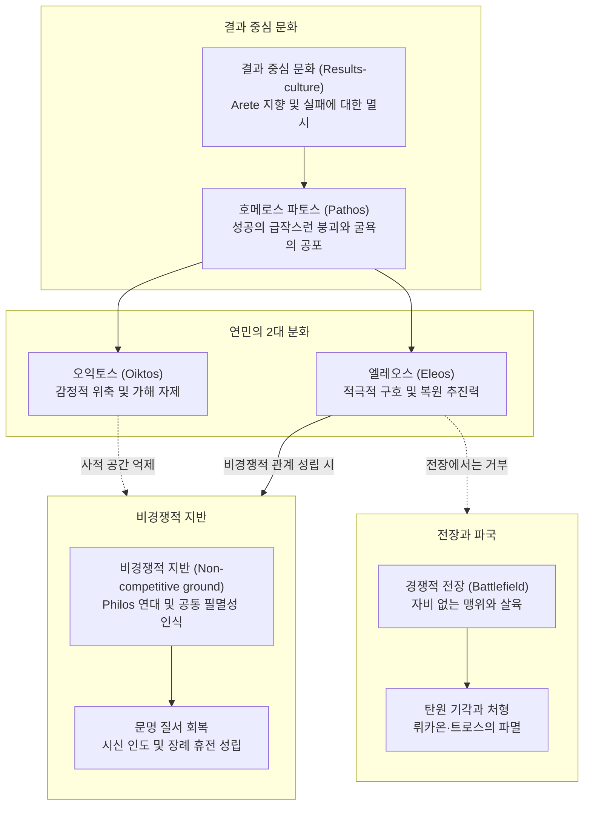

# 호메로스에서의 연민과 파토스 (Pity and Pathos in Homer, 1979)

> [!NOTE] 학술사적 의의 및 총평
> 메리 스콧(Mary Scott)의 1979년 논문 「호메로스에서의 연민과 파토스」(Pity and Pathos in Homer, Acta Classica 22)는 고대 그리스 영웅 서사시의 도덕 감정을 체계적으로 규명한 스콧의 도덕심리학 4부작(1979 연민과 파토스, 1980 아이도스와 네메시스, 1981 비경쟁적 태도 어휘, 1982 필로스와 크세니아)의 출발점인 연구입니다. 스콧은 현대 독자의 감상적·인도주의적 연민 투사를 비판하며, 호메로스 서사시의 파토스가 철저한 결과 중심 문화(Results-culture)와 아레테(Arete) 체계에서 '성공의 급작스러운 붕괴(Collapse of success)'와 '극심한 굴욕(Humiliation)'을 목격할 때 생기는 자기투영적 공포에 뿌리를 둔다고 논증했습니다. 나아가 호메로스 원전의 양대 연민 어휘인 오익토스(Oiktos — 가해와 조롱을 자제하는 감정적 위축/억제)와 엘레오스(Eleos — 불행을 적극적으로 시정하려는 추진력)의 개념적·기능적 차이를 문헌학적으로 엄밀히 구분하고, 엘레오스가 발동하는 데 필수적인 비경쟁적 관계(Non-competitive relationship)의 메커니즘을 규명했습니다.

---

## 1. 서지 정보 및 지성사적 맥락

- **저자**: 메리 스콧 (Mary Scott) — 남아프리카공화국 비트바테르스란트 대학교(University of the Witwatersrand)에서 고전학을 연구한 학자이자, 고대 그리스 서사시의 도덕 감정과 가치 체계 연구 권위자.
- **출판 정보**: *Acta Classica*, Vol. 22 (1979), pp. 1–14 (Classical Association of South Africa).
- **연구 방법**:
  - 『일리아스』와 『오뒷세이아』 전편에 등장하는 [[concept-oiktos|오익토스]](οἶκτος, *oîktos*)·[[concept-eleos|엘레오스]](ἔλεος, *éleos*) 계열 연민 어휘군(*oikteírein*, *oiktrós*, *oíktistos*, *eleeîn*, *eleaírein*, *eleeinós*)과 무자비(*nēleḗs*) 어휘를 문맥별로 전수 분석.
  - 서사시의 전장 전사 사망 장면, 자연 직유(동물 및 나무 비유), 가족 관계(미망인, 고아, 노부모), 탄원 의례([[concept-hikesia|히케시아]](ἱ케σία, *hikesía*)) 및 손님 환대([[concept-xenia|크세니아]](ξενία, *ksenía*)) 장면을 비교 분석.
  - 현대적 인도주의(존 던의 "어떤 사람의 죽음도 나를 감소시킨다" 식의 보편적 인류애)를 시대착오적으로 투사하지 않고, 아르카익 영웅 사회의 내부 가치 규범에 근거해 현상을 기술하는 현상학적 접근.
- **지성사적 논쟁과 대화**:
  - **A. W. H. 애드킨스** ([[adkins-1960-merit-and-responsibility|Adkins 1960]])의 수용과 비판적 보완: 애드킨스의 『공적과 책임』(*Merit and Responsibility*)에서 정립된 '결과 중심 문화(Results-culture)'와 아레테([[concept-arete|Arete]])/아가토스([[concept-agathos|Agathos]])/카코스([[concept-kakos|Kakos]]) 규범 모델을 수용하면서도, 협력적 가치가 완전히 배제된 것이 아니라 오익토스의 억제와 엘레오스의 비경쟁적 연대를 통해 실제로 기능했음을 입증함. 다만 스콧은 협력적 가치가 결과주의적 아레테를 대체하거나 전복한 것이 아니라, '비경쟁적 관계'라는 제한된 영역(Enclaves) 안에서만 예외적으로 유효했음을 엄격히 한정함.
  - **E. R. 도즈** ([[dodds-1951-greeks-and-irrational|Dodds 1951]])의 과잉결정론(Over-determination)과의 연계: 신들의 분노(*menos*)와 영웅의 분노, 그리고 신과 인간 양측을 향한 엘레오스 탄원의 상호 병행 구조를 규명함.

---

## 2. 개념 비교 매트릭스 및 논증 계보도

### [Oiktos와 Eleos의 도덕심리학적 2대 축 비교 매트릭스]

| 분석 층위 | 오익토스 (Oiktos) | 엘레오스 (Eleos) |
|:---|:---|:---|
| **표제형 및 주요 형태** | οἶκτος (*oîktos*), οἰκτρός (*oiktrós*), οἰκτείρειν (*oikteírein*) | ἔλεος (*éleos*), ἐλεαίρειν (*eleaírein*), ἐλεεῖν (*eleeîn*) |
| **심리적 본질** | 극심한 굴욕·실패를 볼 때의 **감정적 위축 및 억제** (Inhibition / Shrinking back) | 불행에 처한 대상을 돕고 시정하려는 **적극적 추진력** (Positive forward drive) |
| **행동적 귀결** | 상대의 불행을 추가로 착취·조롱하지 않고 **가해를 멈춤** (Refraining from triumphing) | 상황을 바로잡고 원조하기 위한 **실질적 구호 행동 실행** (Restorative action) |
| **주요 촉발 상황** | 아레테 기준에서의 치욕적 죽음, 헛된 대가 지불, 노인의 시신 훼손 | 전장에서의 전우 전사, 총애하는 인물의 곤경, 탄원자의 눈물과 비경쟁적 유대 호소 |
| **발동 주체** | 인간 관찰자 (『일리아스』에서는 아킬레우스가 유일한 주체) | 올림포스 신들(제우스, 아폴론, 포세이돈, 헤라) 및 인간 전사/주인 |
| **대립 감정/상태** | 승자의 조롱, 약탈, 짓밟기 (*triumphing over the defeated*) | 메네아이네인(*meneaínein*, 적을 향해 맹렬히 돌진하는 공격적 분노) |
| **발동 전제 조건** | 상대방의 명백한 무력화와 극단적 수치(*peculiar humiliation*) 목격 | **비경쟁적 관계** (Non-competitive / Philos relationship)의 형성 또는 환기 |
| **서사적 제도 연계** | 경기장(에우멜로스) 위로 상 배분, 사적 막사(프리아모스)에서의 가해 중단 | 손님 환대([[concept-xenia\|Xenia]]), 탄원([[concept-hikesia\|Hikesia]]), 상호부조([[concept-philotes\|Philotes]]) |

### [Mermaid 논증 구조도]

---

## 3. 논문의 핵심 테제 및 섹션별 정밀 분석

### 제1절: 호메로스 가치 체계와 파토스(Pathos)의 문화적 상대성 (pp. 1–2)
- **현대적 감상주의 비판**: 현대 독자가 서사시의 전쟁 묘사(피, 눈물, 파괴)나 미망인·고아의 처지에서 느끼는 파토스는 근대적 인도주의에 바탕을 둔 것임. 그러나 호메로스 텍스트에서 '피비린내 나는', '눈물겨운' 등의 수식어는 단순한 사실적 기술 표현에 불과함.
- **아레테 규범과 실패의 공포**: 호메로스 사회는 끊임없는 성공(*agathos*)을 요구하며, 실패한 자는 가차 없이 [[concept-kakos|카코스]](*kakos*)로 낙인찍힘. 전쟁은 성공한 자를 한순간에 실패자로 떨어뜨리는 '평준화 장치(The leveller)'임.
- **파토스의 진정한 근거**: 호메로스 청중이 느끼는 비애감(Pathos)은 보편적 인간애가 아니라, “**한때 빛나는 지위와 탁월성을 누리던 아가토스가 갑작스럽게 무력화되어 굴욕적으로 몰락하는 광경**”을 볼 때 일어나는 자기투영적 공포(Fear of suffering the same fate)에서 발생함.

### 제2절: 『일리아스』 속 전사자 묘사와 직유의 기능 (pp. 2–6)
- **전사자 계보와 묘사의 초점**: 시인은 전사자의 죽음을 묘사할 때 반드시 그의 고귀한 혈통(_Il._ 4.520), 막대한 부(_Il._ 5.541), 탁월한 무용(_Il._ 5.842)을 대조함. 이는 과거의 성공과 현재의 굴욕적 몰락을 극대화하기 위한 서사적 장치임.
- **상처 묘사의 비(非)감상성**: 신체 손상 묘사는 피해자의 고통에 머물지 않고 곧바로 승자의 승리 선언이나 무구 박탈로 전환됨. 이는 승자의 아레테와 무력을 찬양하기 위함임.
- **가족 관계와 보호의 실패**:
  - 호메로스 사회는 '인간 그 자체(qua human being)'의 권리를 인정하지 않음. 처자식은 아가토스가 보호할 소유물의 일부임.
  - [[entity-hector|헥토르]]와 안드로마케의 대화(_Il._ 6.456ff.) 및 안드로마케의 애가(_Il._ 22.490ff.)에서 파토스의 핵심은 유족의 고통 자체보다 “**가족을 보호하는 데 처절하게 실패한 아가토스의 무능과 좌절**”에 있음.
  - 시모에이시오스(_Il._ 4.477–489): 부모가 그를 기르는 데 들인 비용을 회수하지 못한 채 요절한 '투자 실패(Bad bargain)'로서의 파토스.
  - 이피다마스(_Il._ 11.241–244): 신부를 맞이하려고 막대한 지참금을 지불했지만 신혼의 기쁨을 누리지 못하고 죽은 불운(*oiktrós*).
  - 메롭스와 에우뤼다마스(_Il._ 5.148–151, 11.328–332): 예언술을 지녔지만 아들들의 죽음을 막지 못한 노부의 무력한 실패.
- **자연 직유의 이중성**:
  - 베어 넘겨진 포플러 나무 직유(_Il._ 4.482–489): 무의미한 파괴가 아니라 수레바퀴를 만드는 데 목적이 있듯이, 청년 전사의 죽음은 아이아스의 아레테를 증명하는 영웅적 목적에 이바지하면서도 절정에서 꺾인 생명의 낙차를 드러냄.
  - 어미 사슴과 사자 직유(_Il._ 11.113–121): 아가멤논의 압도적 무용을 찬양하는 것이 주된 목적이지만, 새끼의 무력함과 어미의 절망을 통해 청중에게 멸시와 두려움이 뒤섞인 비애감을 환기함.
  - 어미 새 직유(_Il._ 9.323–326): [[entity-achilles|아킬레우스]]가 자신을 어미 새에 비유한 것은 모성애의 헌신 때문이 아니라, 자신은 온갖 고생을 다하고도 아무런 보상을 얻지 못한 채 '모든 일이 나쁘게 돌아간(*kakōs*)' 굴욕과 헛수고를 한탄하기 위함임.

### 제3절: 오익토스(Oiktos)의 분석 — 굴욕 앞에서의 감정적 억제 (pp. 6–8)
- **용례 및 수치심과의 결합**:
  - *oiktrós*는 서사시에서 5회 쓰이며 통곡과 비탄의 문맥에 나타남. 최상급 *oíktistos*는 언제나 죽음과 결부됨.
  - 명예롭게 전사한 전사자에게는 결코 *oiktrós*가 쓰이지 않음. 오직 수치스러운 실패(이피다마스)나 극단적으로 치욕적인 죽음에만 한정됨.
  - [[entity-priam|프리아모스]]의 절규(_Il._ 22.71–76): 전장에서 젊은이가 죽어 누워 있는 것은 아름답고 합당하지만(*panta kala*), 늙은이의 백발과 성기가 개들에게 유린당하는 것은 인간에게 가장 비참하고 수치스러운 일(*oíktiston*)임.
- **오익토스의 심리적 메커니즘**:
  - 오익토스는 타인의 극단적인 굴욕과 무력함을 목격할 때 일어나는 ‘**감정적 위축** (Shrinking back / Inhibition)’임.
  - 승자는 아레테 규범상 패자를 마음껏 조롱하고 유린할 권리가 있지만, 오익토스는 그 권리 행사를 멈추고 ‘**상대의 불행을 추가로 착취하지 않도록 억제** (Refraining from taking advantage)’함.
- **서사시 속 오익토스의 결정적 사례**:
  - **에우멜로스의 전차경주** (_Il._ 23.534–548): 아킬레우스는 꼴찌로 들어온 [[entity-eumelos|에우멜로스]]의 본래 뛰어난 기량을 가엾게 여겨(534행: *ṓikteire*) 2등상을 주려 함. 안틸로코스는 아킬레우스가 에우멜로스를 '가엾게 여기고(*oikteírein*) 마음에 드는 친구(*philos*)로 여긴다면' 개인 막사에서 다른 상을 주라고 제안함.
  - **프리아모스의 탄원** (_Il._ 24.507–516): 아들의 살해자 발치에 엎드려 손에 입을 맞추는 노왕의 극단적 굴욕을 마주한 아킬레우스는 격정을 가라앉힌 뒤 비로소 오익토스(516행: *oiktírōn*)를 느끼고 노인을 손수 일으켜 세움.
  - **이타케 민회에서의 텔레마코스** (_Od._ 2.81–84): 젊은 텔레마코스가 무력함에 지팡이를 던지고 눈물을 흘리자 안티노오스를 제외한 온 민중이 오익토스에 사로잡혀 침묵함.

### 제4절: 엘레오스(Eleos)의 분석 — 적극적 구호 충동과 신들의 연민 (pp. 8–10)
- **엘레오스의 정의**: *éleos*는 곤경에 처한 대상을 돕고 상황을 바로잡으려는 ‘**적극적 추진력** (Positive forward drive)’임. 억제에 머무는 오익토스와는 근본적으로 대조됨.
- **신들의 엘레오스**:
  - 신들은 자신이 총애하는 아가토스가 전장에서 위기에 처했을 때 엘레오스를 느낌. [[entity-zeus|제우스]]가 피를 토하는 헥토르를 볼 때(_Il._ 15.12–13), 사르페돈의 죽음을 앞두고 [[concept-moira|모이라]](*moira*)의 질서 속에서 고뇌할 때(_Il._ 16.431), 파트로클로스의 시신을 애도하는 불사의 말들을 볼 때(_Il._ 17.441).
  - 포세이돈과 헤라도 자신들의 편인 아카이아군이 밀릴 때 엘레오스를 느끼고 적극적으로 전장에 개입함.
  - [[entity-apollo|아폴론]]은 아킬레우스의 시신 능욕으로부터 헥토르를 보호하려고 엘레오스를 발동함(_Il._ 24.19–20).
- **Meneainein vs Eleairein**:
  - 서사시에서 *meneaínein*(적을 향해 맹렬한 기세로 돌진하는 파괴적 분노)과 *eleaírein*(호의를 품고 상대를 향해 나아가는 적극적 충동)은 뚜렷이 대비됨.
  - 『오뒷세이아』 1권(1.19–21): 모든 신이 [[entity-odysseus|오디세우스]]를 가엾게 여겼지만(*eleaíron*), 포세이돈만 홀로 맹렬한 분노(*meneaínen*)를 품음.

### 제5절: 인간 관계에서의 엘레오스와 비경쟁적 지반(Non-competitive Ground) (pp. 10–13)
- **전장에서의 엘레오스 배제**:
  - 경쟁적 적대감이 극에 달한 전장에서는 적에게 자비를 베풀어 달라는 탄원이 철저히 기각됨.
  - 트로스(_Il._ 20.463–466)와 [[entity-lykaon|뤼카온]](_Il._ 21.74–114)의 탄원 실패: 뤼카온은 아킬레우스와 빵을 나눈 인연, 몸값을 치러 준 전력, 헥토르와 이복형제라는 점을 들어 '필로스(Philos) 관계'를 호소했으나 파트로클로스를 잃은 아킬레우스의 거대한 [[concept-menos|메노스]](*menos*)를 꺾지 못함. 아킬레우스는 그를 "친구여(*philos*)"라고 부르면서 공통의 필멸성을 살육의 정당화 근거로 삼아 처형함.
- **비경쟁적 지반의 형성과 성공적 엘레오스**:
  - 엘레오스가 적대적 타자에게 발동하려면 반드시 ‘**비경쟁적 관계** (Non-competitive relationship)’ 또는 공통의 지반이 먼저 형성되어야 함.
  - **프리아모스의 24권 탄원 성공 (2단계 감정 전개)**: 
    1. *1단계 (오익토스)*: 프리아모스가 아킬레우스의 발치에 엎드려 아들의 살해자 손에 입을 맞추는 극단적인 자기비하를 보이자 아킬레우스는 노인의 치욕과 무력함을 보고 연민을 품어(516행: *oiktírōn*) 손수 그를 일으켜 세우며 추가 가해를 자제함.
    2. *2단계 (엘레오스)*: 프리아모스가 아킬레우스의 늙은 아버지 펠레우스의 고독을 상기시켜 공통의 필멸성이라는 비경쟁적 지반을 마련하자, 아킬레우스는 비로소 프리아모스의 청원(503행: *eléēson*)을 받아들여 헥토르의 시신을 정성껏 씻겨 인도하고 12일간의 장례 휴전을 보장하는 적극적 구호(Eleos)를 실행함.
  - **페미오스의 사면** (_Od._ 22.344–356): 구혼자 학살 중 음유시인 페미오스는 강요로 노래했을 뿐이라는 결백이 텔레마코스의 증언으로 입증되어 비경쟁적 무해성이 인정되고 목숨을 건짐.

### 제6절: 크세니아(Xenia)와 사회적 협력의 제도화 (pp. 12–14)
- **보답 능력 없는 자에 대한 엘레오스**:
  - 전통적 손님 환대([[concept-xenia|Xenia]])는 상호 보답을 전제로 하는 동등한 아가토스 간의 계약이지만, 엘레오스는 “**환대를 되갚을 능력이 전혀 없는 극빈자나 거지**”에게도 환대를 베풀게 하는 도덕적 동기가 됨.
  - 거지로 변장한 오디세우스에게 구혼자들이 음식을 나누어 준 장면(_Od._ 17.367: *eleaírontes*).
  - 아스티아낙스의 미래(_Il._ 22.490ff.): 보호자를 잃은 고아가 아버지 친구들의 식탁에서 구걸해야 할 때 의지할 수 있는 유일한 힘은 그들의 일시적인 엘레오스(자비)뿐임.
- **결론 — 호메로스 윤리의 협력적 차원 복원**:
  - 호메로스 사회에서 엘레오스와 오익토스는 비경쟁적 사회 충동으로서 영웅들이 아레테 경쟁의 파괴적 귀결을 스스로 제한하고 [[concept-philotes|필로테스]](*philótēs*)와 크세니아(*xenia*)의 문명적 유대를 지탱하게 한 핵심 도덕심리학적 보루였음. 다만 이는 경쟁적 아레테를 대체하는 것이 아니라 비경쟁적 관계 안에서만 예외적으로 기능함.

---

## 4. 문헌학적 어휘 사전 및 희랍어 개념 주해

- **오익토스** (οἶκτος, *oîktos*; 관용명 Oiktos) / **오익테이레인** (οἰκτείρειν, *oikteírein*; 관용명 Oikteirein):
  - 명사 '비탄, 연민' 및 동사 '가엾게 여기다'. 타인의 수치스러운 몰락을 마주할 때 뒤로 물러나 조롱과 가해를 멈추게 하는 소극적 억제 감정.
- **오익트로스** (οἰκτρός, *oiktrós*; 관용명 Oiktros) / **오익티스토스** (οἴκτιστος, *oíktistos*; 관용명 Oiktistos):
  - 형용사 '비참한, 가련한' 및 최상급 '가장 비참한/수치스러운'. 영웅적 전사가 아니라 치욕적 실패나 시신 훼손을 겪는 자에게 적용됨.
- **엘레오스** (ἔλεος, *éleos*; 관용명 Eleos) / **엘레아이레인** (ἐλεαίρειν, *eleaírein*; 관용명 Eleairein) / **엘레에인** (ἐλεεῖν, *eleeîn*; 관용명 Eleein):
  - 명사 '연민, 자비' 및 동사 '동정하다, 구호하다'. 곤경에 처한 이의 고통을 덜어 주려고 행동에 나서게 하는 적극적 추진력.
- **엘레에이노스** (ἐλεεινός, *eleeinós*; 관용명 Eleeinos) / **엘레에이노테로스** (ἐλεεινότερος, *eleeinóteros*; 관용명 Eleeinoteros):
  - 형용사 '가엾은, 동정을 자아내는' 및 비교급 '더욱 가련한'. 프리아모스가 아킬레우스 앞에서 자신의 처지를 호소할 때 사용함(_Il._ 24.504).
- **넬레에스** (νηλεής, *nēleḗs*; 관용명 Nēleēs) / **넬레에스 에토르** (νηλεὲς ἦτορ, *nēleès ē̂tor*; 관용명 Nēlees ētor):
  - 형용사 '무자비한, 가차 없는'. 서사시에서 청동 무기(19회)나 죽음의 날(9회) 외에 인간이나 괴물에게 쓰일 때는 오직 아킬레우스와 퀴클롭스 폴리페모스에게만 적용됨. 이는 개인의 성격 결함보다는 전장의 맹위(*menos*)에 사로잡힌 경쟁적 아레테의 극단적 결과주의를 반영함.
- **메네아이네인** (μενεαίνειν, *meneaínein*; 관용명 Meneainein):
  - 동사 '맹렬히 격분하다, 공격적으로 돌진하다'. 메노스(*menos*)의 힘으로 적을 분쇄하려는 충동으로, 엘레아이레인(*eleaírein*)과 정반대임.

---

## 5. 핵심 원문 인용 및 심층 주석

- "전장에서 젊은이가 날카로운 청동 창에 찔려 죽어 누워있는 것은 모든 면에서 어울리고 아름답다. 그가 죽었을지라도 보이는 모든 것이 아름답기 때문이다. 그러나 개들이 죽임을 당한 노인의 센 머리와 센 수염과 치부를 더럽힐 때, 이것이야말로 가련한 필멸자들에게 가장 비참하고 수치스러운(*oíktiston*) 일이다."
  - **[원문]**:
    νέῳ δέ τε πάντ' ἐπέοικεν / ἀρηϊκταμένῳ, δεδαϊγμένῳ ὀξέϊ χαλκῷ, / κεῖσθαι· πάντα δὲ καλὰ θανόντι περ ὅττι φανήῃ· / ἀλλ' ὅτε δὴ πολιόν τε κάρη πολιόν τε γένειον / αἰδῶ τ' αἰσχύνωσι κύνες κταμένοιο γέροντος, / τοῦτο δὴ οἴκτιστον πέλεται δειλοῖσι βροτοῖσιν.
  - **[학술 전사]**:
    *néōi dé te pánt' epéoiken / arēïktaménōi, dedaïgménōi oxéï khalkôi, / keîsthai· pánta dè kalà thanónti per hótti phanḗēi· / all' hóte dḕ polión te kárē polión te géneion / aidô t' aiskhýnōsi kýnes ktaménoio gérontos, / toûto dḕ oíktiston péletai deiloîsi brotoîsin.*
  - **[출전]**: 호메로스, 『일리아스』 22권 71–76행 (프리아모스의 탄원)
  - **[주석]**: *oíktiston*은 단순한 슬픔이 아니라 신체적 치부(aidôs)의 노출과 유린을 포함하여 아레테 기준에서 영웅적 존엄이 완전히 붕괴된 최악의 굴욕을 가리킴.

- "그들은 그를 불쌍히 여겨(*eleaírontes*) 음식을 주며 놀라워했고, 그가 누구이며 어디서 왔는지 서로 물었다."
  - **[원문]**:
    οἱ δ' ἐλεαίροντες δίδοσαν, καὶ ἐθάμβεον αὐτόν, / ἔκ τ' ἐρέοντο μεταλλῶντες τίς καὶ πόθεν εἴη.
  - **[학술 전사]**:
    *hoi d' eleaírontes dídosan, kaì ethámbeon autón, / ék t' eréonto metallôntes tís kaì póthen eíē.*
  - **[출전]**: 호메로스, 『오뒷세이아』 17권 367–368행 (구혼자들과 거지 오디세우스)
  - **[주석]**: 엘레오스가 동등한 보답 능력이 없는 걸인에게도 작동해 손님 환대(Xenia)의 최소한의 자비를 실행하게 하는 능동적 동력임을 보여 줌.

- "신들을 두려워하십시오(*aideîo theoús*), 아킬레우스여! 그리고 당신 자신의 아버지를 생각하여 나를 불쌍히 여기십시오(*eléēson*). 나는 그보다 훨씬 더 가련합니다(*eleeinóteros*). 세상의 어떤 필멸자도 감당하지 못한 일을 나는 감내하여, 내 자식들을 죽인 자의 손에 입을 맞추고 있으니까요."
  - **[원문]**:
    ἀλλ' αἰδεῖο θεούς, Ἀχιλεῦ, αὐτόν τ' ἐλέησον / μνησάμενος σοῦ πατρός· ἐγὼ δ' ἐλεεινότερός περ, / ἔτλην δ' οἷ' οὔ πώ τις ἐπιχθόνιος βροτὸς ἄλλος, / ἀνδρὸς παιδοφόνοιο ποτὶ στόμα χεῖρ' ὀρέγεσθαι.
  - **[학술 전사]**:
    *all' aideîo theoús, Akhileû, autón t' eléēson / mnēsámenos soû patrós· egṑ d' eleeinóterós per, / étlēn d' hoî' oú pṓ tis epikhthónios brotòs állos, / andròs paidophónoio potì stóma kheῖr' orégesthai.*
  - **[출전]**: 호메로스, 『일리아스』 24권 503–506행 (프리아모스의 아킬레우스 면담)
  - **[주석]**: 아이도스(신들에 대한 경외)와 엘레오스(공통된 필멸성의 고통에 기반한 자비)가 결합해 가장 냉혹한 전사 아킬레우스의 적대적 긴장을 무너뜨리고 비경쟁적 화해를 이끌어 내는 결정적 장면.

- "친구여(*phílos*), 그대 또한 죽어야 한다. 왜 이리 비탄에 젖어 있는가? 파트로클로스 또한 죽었으니, 그는 그대보다 훨씬 뛰어난 사람이었다."
  - **[원문]**:
    ἀλλά, φίλος, θάνε καὶ σύ· τίη ὀλοφύρεαι οὕτως; / κάτθανε καὶ Πάτροκλος, ὅ περ σέο πολλὸν ἀμείνων.
  - **[학술 전사]**:
    *allá, phílos, tháne kaì sý· tíē olophýreai hoútōs; / kátthane kaì Pátroklos, hó per séo pollòn ameínōn.*
  - **[출전]**: 호메로스, 『일리아스』 21권 106–107행 (아킬레우스의 뤼카온 처형)
  - **[주석]**: 탄원자가 과거의 호의를 들어 필로스 관계를 호소해도 전장의 맹위(*menos*) 속에서는 공통의 필멸성마저 살육의 정당화로 전환되므로 엘레오스가 발동하지 않음을 보여 줌.

---

## 6. 서사시 전편 에피소드 정밀 매핑 테이블

| 구분 | 서사시 권·행 | 등장인물 및 사건 | 작동 개념 및 스콧(1979)의 분석 요지 |
|:---|:---|:---|:---|
| **일리아스** | 4.477–489 | 시모에이시오스의 전사 | 양육비 보상 실패라는 호메로스적 파토스 |
| **일리아스** | 5.148–158 | 에우뤼다마스와 페이놉스 아들들의 죽음 | 직계 상속 단절에 따른 노부의 파토스 |
| **일리아스** | 6.456–465 | 헥토르와 안드로마케의 작별 | 아가토스의 가족 보호 실패로서의 비극 |
| **일리아스** | 9.323–326 | 아킬레우스의 어미 새 직유 | 헌신의 배신과 노력의 헛된 귀결(*kakōs*) |
| **일리아스** | 11.113–121 | 아가멤논의 살육과 암사슴 직유 | 사자와 대비되는 사슴의 무력함 및 멸시와 비애 |
| **일리아스** | 11.241–244 | 이피다마스의 전사와 신부 지참금 | 지참금을 치르고 결실을 보지 못한 불운(*oiktrós*) |
| **일리아스** | 15.12–13 | 피 토하는 헥토르를 보는 제우스 | 총애 영웅의 위기에 대한 신들의 구호(*eleos*) |
| **일리아스** | 16.431–438 | 사르페돈의 운명을 고뇌하는 제우스 | 운명의 제약과 부성적 연민 사이의 신적 갈등 |
| **일리아스** | 17.441–444 | 파트로클로스를 애도하는 불사의 말들 | 불사의 존재에게 필멸자의 고통을 겪게 한 연민 |
| **일리아스** | 20.463–466 | 트로스의 아킬레우스 앞 목숨 탄원 | 전장의 적대성 속에서 탄원 기각 |
| **일리아스** | 21.74–114 | 뤼카온의 탄원과 아킬레우스의 처형 | 인연에도 불구하고 전장 맹위(*menos*)에 의한 처형 |
| **일리아스** | 22.71–76 | 프리아모스가 예견하는 노인의 치욕적 죽음 | 개들에게 유린당하는 노인의 시신 — 최악의 파멸 |
| **일리아스** | 22.490–506 | 안드로마케가 그리는 아스티아낙스의 고아 처지 | 고아가 의존해야 하는 불안정한 자비(*eleos*) |
| **일리아스** | 23.534–548 | 에우멜로스에 대한 2등상 수여 논쟁 | 실패한 강자에 대한 감정적 억제(*ṓikteire*) |
| **일리아스** | 24.19–20 | 헥토르 시신을 능욕에서 지키는 아폴론 | 사후 존엄을 수호하는 신들의 연민 |
| **일리아스** | 24.503–516 | 프리아모스의 탄원과 아킬레우스의 눈물 | 굴욕 목격 후의 억제 및 비경쟁적 구호 |
| **오뒷세이아** | 1.19–21 | 오디세우스에 대한 신들의 태도 | 분노(*meneaínein*) vs 자비(*eleaírein*) |
| **오뒷세이아** | 2.81–84 | 텔레마코스의 눈물과 이타케 민회 | 무력함에 직면한 민중의 오익토스 침묵 |
| **오뒷세이아** | 10.388–399 | 짐승에서 인간으로 풀려난 선원들과 키르케 | 여신이 눈물의 기쁨을 보고 연민(*eléaire*)으로 전환 |
| **오뒷세이아** | 11.55–58 | 저승에서 엘페노르의 혼을 만난 오디세우스 | 묻히지 못한 동료를 보고 장례를 약속하는 적극적 구호(*eleos*) |
| **오뒷세이아** | 14.278–280 | 이집트 왕의 무릎을 잡은 오디세우스 거짓 이야기 | 낯선 이국 왕이 무력한 패자에게 베푸는 자비(*eleos*) |
| **오뒷세이아** | 17.367–368 | 거지 오디세우스에게 음식을 주는 구혼자들 | 보답 불가능한 극빈자에게 작동하는 손님 환대(Xenia)의 자비(*eleaírontes*) |
| **오뒷세이아** | 22.344–356 | 음유시인 페미오스의 탄원과 사면 | 비경쟁적 무해성이 입증되어 학살 속에서 유일하게 사면 |
| **오뒷세이아** | 24.432–438 | 안티노오스 부친 에우페이테스의 애가 | 아들의 비참한 죽음과 시신 수습 실패에 대한 비탄(*oiktos* 명사 용례) |

---

## 7. 학술 논쟁사 및 비판적 공방

### 1) 애드킨스(Adkins 1960)의 '경쟁적 가치 독점론'과의 대화
- **애드킨스의 주장**: 호메로스 사회에서는 오직 군사적·물질적 성공만을 *agathos*와 *arete*로 칭송하며, 연민이나 정의 같은 협력적 가치는 이를 칭송하는 말이 없어 실질적인 도덕 규범으로 기능하지 못함.
- **스콧의 비판 및 보완**: 애드킨스의 가치 체계를 인정하면서도, 오익토스(*oiktos*)와 엘레오스(*eleos*)의 텍스트적 증거를 통해 호메로스 영웅들이 '비경쟁적 관계(Philos, Xenia, Hikesia)' 안에서 승자의 권리 행사를 자제하고 타인을 적극적으로 구호하는 사회적 메커니즘을 견고하게 유지했음을 보여 줌. 다만 이 협력적 가치는 결과주의적 아레테를 대체한 것이 아니라 비경쟁적 지반이라는 예외적 영역에서만 작동함.

### 2) 케언스(Cairns 1993) 및 잰커(Zanker 1994)로의 계승
- **더글러스 케언스**(Cairns 1993): 스콧의 '감정적 억제로서의 오익토스' 분석을 아이도스(Aidos) 연구의 핵심 기초로 계승해, 고대 수치심이 타인의 시선 앞에서 자신을 제어하는 억제 메커니즘이라는 점을 더욱 발전시킴.
- **그레이엄 잰커**(Zanker 1994): 『일리아스』 24권 아킬레우스의 행동을 분석하며, 스콧이 규명한 '비경쟁적 지반(공통의 필멸성)' 위에서 엘레오스가 단순한 규범 준수를 넘어 영웅 개인의 위대한 인간적 대도량(Magnanimity)으로 승화된다고 논증함.

> [!WARNING] 모순/이설 발견: 호메로스적 파토스와 고전기 비극론의 범주 차이
> 아리스토텔레스(『시학』 13장, 『수사학』 2권 8장)는 엘레오스(Eleos)를 "부당하게 불행을 겪는 자(anaxios)"를 볼 때 일어나는 윤리적 연민으로 정의합니다. 반면 호메로스 서사시의 파토스(Pathos)와 엘레오스는 도덕적 무고함이 아니라 탁월성(Arete)을 구가하던 아가토스가 급작스럽게 실패하고 몰락하는 광경에서 생기는 '자기투영적 공포'에 뿌리를 둡니다. 따라서 고전기 철학의 정의관·윤리관을 호메로스 텍스트에 소급해 적용하는 것은 중대한 범주 착오이며, 스콧의 연구는 이 둘 사이의 학설사적 단절을 분명히 의식해야 한다고 요구합니다.

---

## 관련 항목

- [[concept-eleos|엘레오스 (Eleos)]]
- [[concept-oiktos|오익토스 (Oiktos)]]
- [[concept-agathos|아가토스 (Agathos)]]
- [[concept-aidos|아이도스 (Aidos)]]
- [[concept-nemesis|네메시스 (Nemesis)]]
- [[concept-xenia|크세니아 (Xenia)]]
- [[concept-hikesia|히케시아 (Hikesia)]]
- [[entity-achilles|아킬레우스 (Achilles)]]
- [[scott-1980-aidos-and-nemesis|스콧 (1980) 아이도스와 네메시스]]
- [[scott-1981-some-greek-terms|스콧 (1981) 비경쟁적 태도 어휘]]
- [[scott-1982-philos-philotes-xenia|스콧 (1982) 필로스, 필로테스, 크세니아]]
- [[adkins-1960-merit-and-responsibility|애드킨스 (1960) 공적과 책임]]
- [[zanker-1994-heart-of-achilles|잰커 (1994) 아킬레우스의 마음]]
- [[word-eleos|Eleos (엘레오스)]]
- [[word-oiktos|Oiktos (오익토스)]]
- [[analysis-homeric-ethics-literature-review|호메로스 윤리학 종합 분석]]
