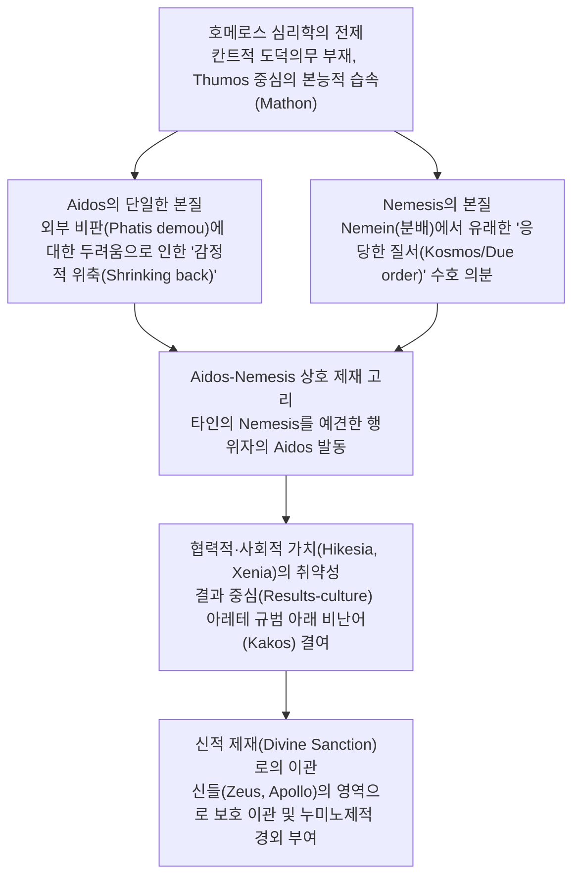

# 호메로스 저작에서의 아이도스와 네메시스 (*Aidos and Nemesis in the Works of Homer, and their Relevance to Social or Co-operative Values*)

> [!NOTE] 학술사적 의의 및 총평
> 메리 스콧(Mary Scott)의 1980년 논문 「호메로스 저작에서의 아이도스와 네메시스, 그리고 사회적·협력적 가치와의 연관성」(*Aidos and Nemesis in the Works of Homer, and their Relevance to Social or Co-operative Values*, *Acta Classica* 23)은 호메로스 도덕심리학의 양대 핵심 감정인 **아이도스(Aidos)**와 **네메시스(Nemesis)**의 상호 연동 메커니즘을 문헌학적·사회심리학적으로 규명한 고전적 연구입니다. 스콧은 폰 에르파(C. E. von Erffa, 1937)의 파편화된 의미 분절론을 비판하고 베르데니우스(W. J. Verdenius, 1945)의 직관을 확장하여, 아이도스의 본질을 외부 비판에 대한 두려움에서 비롯된 단일한 **'감정적 위축(Shrinking back / Pulling back / Non-moral inhibition)'**으로 정의했습니다. 나아가 호메로스 사회가 결과 중심의 아레테(Arete) 체계 속에서도 탄원(Hikesia), 손님 환대(Xenia), 가족 질서와 같은 협력적·비경쟁적 가치를 보호하기 위해 이 감정들을 어떻게 **신적 제재(Divine Sanction)**의 영역으로 이관하여 보완했는지를 명쾌하게 밝혔습니다.

---

## 1. 서지 정보 및 지성사적 맥락

- **저자**: 메리 스콧 (Mary Scott) — 남아프리카공화국 비트바테르스란트 대학교(University of the Witwatersrand) 고전학 연구자, 고대 그리스 도덕 감정 및 호메로스 [[concept-eleos|엘레오스]](ἔλεος, *éleos*) 연구 권위자.
- **출판 정보**: *Acta Classica*, Vol. 23 (1980), pp. 13–35. (Classical Association of South Africa).
- **연구 방법론**:
  - 서사시 전편에 나타난 명사 [[concept-aidos|아이도스]](αἰδώς, *aidṓs*), 동사 *aideîsthai*, 형용사 *aidoîos*, 부정형 *anaidḗs* 및 명사 [[concept-nemesis|네메시스]](νέμεσις, *némesis*), 동사 *nemesan*, 형용사 *nemesētós*의 문맥별 전수 분석.
  - 현대적 칸트주의 범주(의무, 도덕 법칙)를 배제하고, 아르카익 그리스 구술 텍스트의 내적 심리학(*thumos*, *mathon*, *phatis dēmou*)에 입각한 기술적(Descriptive) 현상학.
- **지성사적 대립 구도**:
  - **폰 에르파(C. E. von Erffa 1937)** 비판: 하나의 희랍어 단어를 '경외', '존경', '수치', '수줍음' 등 여러 의미로 쪼개어 분류하는 다의적 접근법을 거부하고, 모든 용례를 관통하는 단일한 심리적 공통 분모(*common element*) 도출.
  - **애드킨스(A. W. H. Adkins 1960)** 비판 및 보완: 애드킨스의 '경쟁적 가치 우선성'을 인정하면서도, 협력적 가치가 *aidos*와 *nemesis*, 그리고 신들의 개입을 통해 영웅 사회 속에서 실질적인 감정적 견제력을 행사했음을 실증.
  - **베르데니우스(W. J. Verdenius 1945) 및 도즈(E. R. Dodds 1951)**의 계승: 호메로스 양심의 본질을 개인의 내적 성찰이 아닌 **'공적 비판에 대한 민감성(Öffentlichkeit des Gewissens / Respect for public opinion)'**으로 규명.

---

## 2. 개념 비교 매트릭스 및 논증 계보도

### [Aidos와 Nemesis의 상호 연동 매트릭스]

| 분석 층위 | 아이도스 계열 그리스어 실제형 | 아이도스 계열 학술 전사 | 아이도스 계열 분석 | 네메시스 계열 그리스어 실제형 | 네메시스 계열 학술 전사 | 네메시스 계열 분석 |
|:---|:---|:---|:---|:---|:---|:---|
| **표제형** | αἰδώς | *aidṓs* | 아이도스 | νέμεσις | *némesis* | 네메시스 |
| **심리적 주체** |  |  | 행위자 본인 (Prospective / Actual Doer) |  |  | 관찰자 및 사회 공동체 (Onlooker / Community) |
| **핵심 메커니즘** |  |  | 타인의 비판과 비난을 예상하여 **내면에서 움츠러듦(Shrinking back)** |  |  | 부당한 일탈이나 과도함을 보고 느끼는 **공적 의분 및 정당한 분노(Indignation)** |
| **어원 및 발생** |  |  | 어원상 '두려움/경외'와 연결 (*aidoîos*, *aidéomai*) | νέμειν | *némein* | 분배를 뜻하는 동사에서 파생 (합당한 몫의 배분) |
| **작동 영역** |  |  | 전장에서의 용맹, 권력자/신에 대한 경외, 손님/탄원자 배려, 수줍음(*bashfulness*) |  |  | 신분 일탈 단죄, 오만(*hybris*) 규탄, 전우 유기 비난, 과도한 환대 억제 |
| **도덕적 성격** |  |  | **비도덕적(Non-moral) 감정**: 이익과 상황에 따라 *ouk agathē*(해로운 것)가 될 수 있음 |  |  | **상황 적응적(Adaptive) 감정**: 객관적 도덕 법칙이 아닌 관찰자의 정서적 감응에 의존 |
| **상호 관계** |  |  | Nemesis에 대한 두려움이 Aidos를 유발함 |  |  | Aidos의 결핍(*anaideia*)이 Nemesis를 촉발함 |
| **신적 보루** |  |  | 제우스 히케시오스/크세니오스, 아폴론의 수호 |  |  | 제우스의 섭리, 올림포스 신들의 질서 유지 |

### [Mermaid 논증 구조도]

---

## 3. 논문의 핵심 테제 및 섹션별 정밀 분석

### 제1절: 호메로스 사회의 도덕 양심과 아이도스의 정의 (pp. 13–16)
- **칸트적 도덕 명법의 부재**: 호메로스 영웅은 '내가 마땅히 해야 하는가(I ought)'라는 내적 도덕 갈등을 겪지 않음. 행동은 어릴 때부터 체화된 사회적 습속(*mathon*, _Il._ 6.444)과 정서적 충동의 좌소인 튀모스(*thumos*)에 의해 본능적이고 즉각적으로 결정됨.
- **공적 양심(Öffentlichkeit des Gewissens)**: 도덕적 판단이 요구될 때 영웅이 의지하는 것은 '사람들이 무엇이라 말할 것인가'라는 세간의 평판(**파티스 데모우, *phatis dēmou***)임.
- **아이도스의 어휘적 통합성**: 아이도스는 상황에 따라 '경외(Reverence)', '존경(Respect)', '수치(Shame)', '수줍음(Shyness)' 등으로 번역되지만, 그 근저에는 언제나 **'외부 비판에 직면하여 느끼는 감정적 위축(Shrinking feeling within)'**이라는 단일한 요소가 흐르고 있음.
- **전장에서의 아이도스**: 일리아스에서 *aidos*는 전사들을 격려하는 핵심 구호(*Aidos, Argeioi!*)로 쓰이며, 전우들 앞에서 비겁자로 낙인찍히는 것에 대한 두려움(*deos*)과 상호 감시를 통해 전열을 유지시킴(_Il._ 15.561–564, 15.656–662).

### 제2절: 권력, 위계 및 가족 관계에서의 아이도스 (pp. 16–18)
- **사회적 위계와 경외**: 아이도스는 더 강력한 권력자나 상급자를 마주할 때 느끼는 억제 감정임. 아가멤논의 사자들(탈튀비오스와 에우리바테스)이 아킬레우스 앞에서 느끼는 두려움과 침묵(_Il._ 1.331–332), 디오메데스가 아가멤논의 질책에 맞대응하지 않는 태도(_Il._ 4.401–402)는 권력자의 지위에 대한 존중에서 기인함.
- **물질적 힘과 아이도스**: 오디세우스가 풍성한 재물을 가지고 귀환해야 사람들에게 더 많은 존경(*aidoios*)을 받는다고 말하듯(_Od._ 11.360–361), 아이도스는 세속적 부와 힘이 주는 영향력과 불가분하게 결합되어 있음.
- **가족 관계의 정서적 상징**: 헥토르를 만류하는 헤카베가 가슴을 드러내며 "이 젖가슴에 아이도스를 품으라"고 호소하는 장면(_Il._ 22.82)이나, 텔레마코스가 어머니 페넬로페를 집 밖으로 쫓아내는 것을 두려워하는 장면(_Od._ 2.130–137, 20.343–344)에서 보듯, 아이도스는 가족 관계의 신성한 상징 앞에서의 억제력으로 작용함.

### 제3절: 탄원자([[concept-hikesia|히케시아]](ἱκεσία, *hikesía*))와 손님([[concept-xenia|크세니아]](ξενία, *ksenía*))에 대한 아이도스 및 신적 전이 (pp. 18–23)
- **탄원자 지위의 취약성**: 호메로스 사회는 '인간이라는 보편적 권리'를 알지 못함. 패배한 적(예: 뤼카온)은 전장에서 자비를 요구할 세속적 권리가 없음(_Il._ 21.74–114).
- **신적 제재로의 이관**: 세속적 무력자(탄원자, 이방인)에 대한 보호 규범이 결과 중심의 아레테 규범에서 자생할 수 없기 때문에, 사회는 이 취약한 자들을 **'제우스의 보호(Zeus Hikesios, Zeus Xenios)'** 아래 둠.
- **제우스와 신들의 아이도스**: 탄원자를 대접하는 것은 탄원자 그 자체보다 그를 보호하는 신들에 대한 아이도스(*aideisthai theous*)에서 비롯됨(_Od._ 7.165, 9.269). 프리아모스 역시 아킬레우스에게 신들을 두려워하여 헥토르의 시신을 돌려달라고 간청함(_Il._ 24.503–504).
- **시신 훼손과 대지의 수치**: 아킬레우스의 시신 능욕에 대해 아폴론이 격분하는 것은 그가 신들에 대한 아이도스를 잃고 "말 못 하는 대지를 능욕(*shaming the dumb earth*)"하고 있기 때문임(_Il._ 24.44–54).
- **환대 의례의 상징물**: 손님 환대 규범을 어길 때 두려워하는 것은 환대의 물리적 상징인 '지붕(Roof)'이나 '식탁(Table)'임(_Il._ 9.640, _Od._ 21.27–28).

### 제4절: 아이도스의 비도덕성과 수줍음(Shyness)으로의 확장 (pp. 23–25)
- **유익하지 않은 아이도스 (*Aidos ouk agathē*)**:
  - 아이도스가 절대적 칸트적 도덕 법칙이 아니라는 결정적 증거는 서사시에서 **"가난한 자나 거지에게 아이도스는 유익하지 않다(*ouk agathē*)"**고 명시되는 점임(_Od._ 17.345–352, 17.578).
  - 구걸을 해야 생존할 수 있는 상황에서 타인의 시선을 두려워하여 움츠러드는 아이도스는 오히려 생존과 성공을 가로막는 무능(*kakos*)의 원인이 됨.
- **수줍음과 사회적 에티켓**:
  - 오뒷세이아로 넘어가며 아이도스는 점차 개인의 내적 수줍음과 사회적 예절로 확장됨. 아레스와 아프로디테의 간통 현장을 보지 않고 집에 머무는 여신들(_Od._ 8.324), 결혼 이야기를 부끄러워하는 나우시카아(_Od._ 6.66–67), 남자들 앞에 혼자 나서길 꺼리는 페넬로페(_Od._ 18.184), 연장자 네스토르에게 말 걸기를 망설이는 텔레마코스(_Od._ 3.22–24), 나체로 처녀들 앞에 서길 부끄러워하는 오디세우스(_Od._ 6.220–222).
  - 이는 모두 '타인의 조롱과 비판을 두려워하여 뒤로 물러서는' 단일한 신체적·감정적 억제 반응임.

### 제5절: 네메시스(Nemesis)의 본질과 질서 수호 (pp. 25–28)
- **어원과 의미**: 네메시스는 '분배하다, 몫을 나누다'를 뜻하는 동사 **네메인(*nemein*)**에서 파생됨. 따라서 네메시스는 모든 사람과 사물이 자신의 마땅한 자리와 몫(**코스모스, *kosmos*** / **모이라, *moira***)을 지키도록 감시하는 정의로운 분노임.
- **위계 파괴에 대한 분노**: 테르시테스가 왕들을 비난할 때 온 아카이아 군대가 분노하는 것(_Il._ 2.222–223), 거지가 활을 쏘려 할 때 구혼자들이 격분하는 것(_Od._ 21.286)은 신분 질서의 파괴에 대한 네메시스임.
- **아가토스의 의무 불이행에 대한 분노**: 아가토스가 제 몫의 용기를 다하지 않고 나태할 때 동료들과 신들은 네메시스를 느낌(_Il._ 13.117–119, 16.543–547).
- **사리에 맞는 일에서의 네메시스 부재**: 합당한 이유가 있을 때는 네메시스가 생기지 않음(_ouk esti nemesis_). 헬레네의 아름다움을 본 트로이 원로들이 전쟁의 고통을 납득하는 장면(_Il._ 3.156–157), 9년간의 고통 끝에 귀향을 바라는 병사들을 이해하는 장면(_Il._ 2.296).

### 제6절: 네메시스와 사회적·협력적 가치 (pp. 28–31)
- **화해와 보상의 정당화**: 오디세우스가 아가멤논에게 "왕이 먼저 화를 낸 자에게 보상하여 마음을 달래는 것(*apareskein*)은 네메시스가 되지 않는다"고 설득할 때(_Il._ 19.182–183), 이는 왕의 위엄 손상보다 화해와 협력이 더 상위의 정당성을 가짐을 보여줌.
- **상호성의 황금률 맹아**: 아킬레우스가 아이아스와 이도메네우스의 말다툼을 말리며 "남이 그런 짓을 하면 너희도 네메시스를 느낄 터이니 너희도 다투지 말라"고 훈계하는 장면(_Il._ 23.492–494)은 **'자신이 비난할 행동을 스스로 행하지 않는다'**는 고도화된 상호적 협력 규범의 출현을 입증함.
- **손님 환대의 과도함 통제**: 메넬라오스가 텔레마코스에게 "지나치게 환대하거나 지나치게 박대한 주인 모두에게 네메시스를 느낀다"고 말하는 장면(_Od._ 15.68–71)은 네메시스가 '중용과 적절한 척도'를 유지하는 장치임을 보여줌.

---

## 4. 문헌학적 어휘 사전 및 희랍어 개념 주해

| 관용명·표기명 | 그리스어 실제형 | 학술 전사 | 문헌학적 정의 및 스콧의 재해석 | 서사시 주요 용례 |
|:---|:---|:---|:---|:---|
| **Aidos** | αἰδώς | *aidṓs* | 외부의 비판과 비난을 예견하여 내면에서 일어나는 본능적·감정적 위축(Shrinking back). | _Il._ 15.561, 22.82, _Od._ 17.347 |
| **Aideomai / Aideisthai** | αἰδέομαι / αἰδεῖσθαι | *aidéomai / aideîsthai* | 타인의 평판이나 신적 징벌을 두려워하여 행위를 자제하거나 공경하다. | _Il._ 1.23, 21.74, 24.503 |
| **Aidoios** | αἰδοῖος | *aidoîos* | 존경과 경외를 불러일으키는 성질. 사회적 지위, 부, 신적 가호에서 비롯됨. | _Il._ 1.331, _Od._ 7.165, 11.360 |
| **Anaidês** | ἀναιδής | *anaidḗs* | 아이도스가 결여된 뻔뻔한 상태. 도덕적 비난어이지만 *kakos*만큼 파멸적이지는 못함. | _Il._ 1.149, 1.158, _Od._ 20.171 |
| **Nemesis** | νέμεσις | *némesis* | *nemein*(분배하다)에서 유래. 각자의 마땅한 몫과 질서(*kosmos*)를 침범한 자에 대한 공적 의분. | _Il._ 2.223, 3.156, _Od._ 2.136 |
| **관용명 Nemesan / Nemesao** | νεμεσάω | *nemesáō* | 부당한 행위나 불균형에 대해 격분하거나 도덕적 혐오감을 표출하다. | _Il._ 13.119, _Od._ 1.158, 22.40 |
| **Nemesētos** | νεμεσητός | *nemesētós* | 네메시스를 받을 만한, 또는 타인의 부당함에 대해 깊은 의분을 품는 성품. | _Il._ 11.649 |
| **Phatis dēmou** | φῆτις δήμου | *phē̂tis dḗmou* | 대중의 평판, 세간의 소문. 호메로스 영웅의 행위를 통제하는 가장 강력한 외적 제재. | _Od._ 16.75, 2.137 |
| **Thumos** | θυμός | *thumós* | 본능적 충동, 정서, 정념이 일어나는 신체적·정신적 중심 기관. | _Il._ 6.444, 15.561, 2.223 |
| **Kosmos** | κόσμος | *kósmos* | 우주와 사회의 합당한 질서, 단정함, 정돈된 상태. | _Il._ 5.759, 14.333 |

---

## 5. 핵심 원문 인용 및 심층 주석

### 1) 전장에서의 상호 감시와 아이도스
- **번역**: "벗들이여, 대장부가 되어 가슴속(*thumos*)에 아이도스를 품으시오! 격렬한 격전 속에서 서로를 마주보며 아이도스를 느끼시오(*allēlous t' aideisthe*)! 아이도스를 느끼는 자들은 죽는 자보다 살아남는 자가 더 많으나, 도망치는 자들에게는 명성(*kleos*)도 무력의 구원도 없소."
- **원문**: *ὦ φίλοι, ἀνέρες ἔστε καὶ αἰδῶ θέσθ᾽ ἐνὶ θυμῷ,  ἀλλήλους τ᾽ αἰδεῖσθε κατὰ κρατερὰς ὑσμίνας·  αἰδομένων ἀνδρῶν πλέονες σόοι ἠὲ πέφανται,  φευγόντων δ᾽ οὔτ᾽ ἂρ κλέος ὄρνυται οὔτε τις ἀλκή.* (_Il._ 15.561–564)
- **학술 전사**: *ō̂ phíloi, anéres éste kaì aidō̂ thésth’ enì thumō̂i,  allḗlous t’ aideîsthe katà krateràs husmínas;  aidoménōn andrō̂n pléones sóoi ḕe péphantai,  pheugóntōn d’ oút’ àr kléos órnutai oúte tis alkḗ.*

- **스콧의 심층 주해**: 아이도스는 고립된 개인의 자율적 양심이 아니라 타인의 시선과 전우들 간의 상호 응시(*before other men*) 속에서 발생하는 감정입니다. 아가멤논과 아이아스는 영웅적 아레테뿐만 아니라 '살아남기 위한 합리적 자기 이익(Enlightened self-interest)'의 동기를 결합하여 전열을 유지시킵니다.

### 2) 아이도스의 비도덕적 성격 (거지의 아이도스)
- **번역**: "궁핍한 사람에게 곁에 있는 아이도스는 결코 좋은(유익한) 것이 아니오. ... 그분께서는 거지에겐 아이도스가 결코 좋지 않다고 말씀하셨소."
- **원문**: *αἰδὼς δ᾽ οὐκ ἀγαθὴ κεχρημένῳ ἀνδρὶ παρεῖναι. ... αἰδῶ φησὶν οὐκ ἀγαθὴν εἶναι πτωχῷ.* (_Od._ 17.347, 17.352)
- **학술 전사**: *aidṑs d’ ouk agathḕ kekhrēménōi andrì pareînai. ... aidō̂ phēsìn ouk agathḕn eînai ptōkhō̂i.*

- **스콧의 심층 주해**: 아이도스가 칸트적 정언명법과 같은 도덕적 당위라면 상황에 따라 '좋지 않다(*ouk agathē*)'고 규정될 수 없습니다. 생존을 위해 손을 벌려야 하는 궁핍자에게 타인의 거절을 두려워하여 움츠러드는 태도는 명백한 손해이자 실패(*kakos*)를 부르는 감정적 장애물입니다.

### 3) 네메시스의 상호성과 황금률의 맹아
- **번역**: "이제 더 이상 험악하고 수치스러운 말들을 서로 주고받지 마시오. 그것은 도리에 맞지 않소(*oude eoike*). 만일 다른 어떤 이가 그런 짓을 한다면 당신들도 그에게 네메시스를 느낄 것이 아니오!"
- **원문**: *μηκέτι νῦν χαλεποῖσιν ἀμείβεσθον ἐπέεσσιν  αἰσχροῖς, ἐπεὶ οὐδὲ ἔοικε· νεμεσσᾶτον δὲ καὶ ἄλλῳ,  ὅς τις τοιαῦτά γε ῥέζοι.* (_Il._ 23.492–494)
- **학술 전사**: *mēkéti nûn khalepoîsin ameíbethon epéessin  aiskhroîs, epeì oudè éoike; nemessâton dè kaì állōi,  hós tis toiaûtá ge rhézoi.*

- **스콧의 심층 주해**: 아킬레우스는 아이아스와 이도메네우스에게 '타인이 행했을 때 자신이 느낄 네메시스'를 역지사지로 고려하여 자신의 분노를 제어하라고 촉구합니다. 이는 결과 지향적 영웅 규범을 넘어 타자의 관점을 내면화하는 협력적 도덕 의식의 탁월한 발전을 보여줍니다.

---

## 6. 서사시 전편 에피소드 정밀 매핑 테이블

| 작품 및 권·행 | 등장인물 및 상황 | Aidos / Nemesis 작동 양상 | 스콧(1980)의 분석적 함의 |
|:---|:---|:---|:---|
| **_Il._ 1.22–23** | 크리세스의 사제 탄원 | 아가멤논에게 사제를 공경(*aideisthai*)하라는 군대의 요구 | 사제의 신성함에 대한 경외 요구. 아가멤논의 거부로 *anaidēs* 낙인 |
| **_Il._ 1.331–332** | 아킬레우스 앞의 전령들 | 아킬레우스의 위엄에 눌려 두려움(*deos*)과 *aidos*로 침묵 | 상급 권력자의 보복 능력과 지위에서 비롯된 위축 현상 |
| **_Il._ 2.222–223** | 테르시테스의 왕 비난 | 아카이아 군대 전체가 테르시테스에게 품는 *nemesis* | 신분제 질서(*kosmos*) 파괴에 대한 공동체 전체의 정당한 의분 |
| **_Il._ 3.156–157** | 헬레네를 본 트로이 원로들 | 아름다움의 마땅한 대가로 여겨 전쟁에 대해 *nemesis*가 없음 | 마땅한 척도와 비례(*due measure*)가 인정될 때 분노의 무효화 |
| **_Il._ 3.410–412** | 파리스 동침을 거부하는 헬레네 | 파리스에게 가면 트로이 여성들의 비난(*nemesis*)이 두려움 | 무능한 남편과의 동침으로 인한 명예 훼손 및 세간 평판 회피 |
| **_Il._ 4.401–402** | 아가멤논의 질책과 디오메데스 | 왕의 질책에 맞서지 않고 침묵하는 디오메데스의 *aidos* | 군주에 대한 존경과 위계 질서 복종의 도덕적 자제력 |
| **_Il._ 6.441–446** | 안드로마케와 헥토르 | 트로이 남녀들의 비난이 두려워 출전을 결심하는 헥토르 | 수치 문화(*phatis dēmou*)와 영웅적 아레테 습속(*mathon*)의 결합 |
| **_Il._ 9.639–640** | 사절단의 아킬레우스 설득 | 사절들이 머무는 '지붕(*melathron*)'에 대해 *aidos* 호소 | 손님 환대([[concept-xenia\|Xenia]])의 물리적 상징물에 대한 원초적 누미노제 투사 |
| **_Il._ 15.561–564** | 아르고스 군대의 전열 독려 | "가슴속에 아이도스를 품고 서로를 보며 아이도스를 느끼라" | 전열 붕괴 방지를 위한 집단 상호 감시와 공적 수치심 가동 |
| **_Il._ 19.182–183** | 아가멤논의 배상 권고 | 왕이 먼저 화해를 위해 보상하는 것은 *nemesis*가 아님 | 공동체 통합을 위해 왕의 위엄 손상보다 배상이 우선됨을 인정 |
| **_Il._ 21.74–114** | 뤼카온의 구명 탄원 | 빵을 나누어 먹은 인연을 내세우며 *aidos*를 요구 | 전장이라는 비상 상황에서 약자의 탄원이 지닌 세속적 무력함 실증 |
| **_Il._ 22.82** | 헤카베의 헥토르 만류 | 젖가슴을 드러내며 어머니의 양육에 대해 *aidos* 호소 | 모자 관계의 생물학적·정서적 신성함에 기초한 억제 요구 |
| **_Il._ 23.492–494** | 마차 경주 말다툼 중재 | "남이 하면 네메시스를 느낄 짓을 스스로 하지 말라" | 상호성의 원칙과 관찰자 시선의 내면화를 통한 갈등 억제 |
| **_Il._ 24.44–54** | 아폴론의 아킬레우스 규탄 | 시신을 능욕하여 신들의 *nemesis*를 사고 대지를 욕보임 | 사체 매장의 신성한 권리와 신적 제재의 궁극적 개입 |
| **_Il._ 24.503–504** | 프리아모스의 헥토르 시신 탄원 | "신들을 두려워하고(*aideio theous*) 나를 불쌍히 여기시오" | 신에 대한 경외와 부친 연상에 기초한 탄원([[concept-hikesia\|Hikesia]])의 완성 |
| **_Od._ 2.63–67** | 텔레마코스의 민회 연설 | 구혼자들의 만행에 대해 주민들의 *nemesis*와 *aidos* 촉구 | 공권력 부재 시 이웃의 도덕 감정에 호소하는 세속적 제재 시도 |
| **_Od._ 6.66–67** | 나우시카아의 빨래 청원 | 아버지 알키노오스에게 결혼 이야기를 꺼리는 *aidos* | 처녀의 성적 성숙과 혼담에 대한 사회적 수줍음(*shyness*) |
| **_Od._ 6.220–222** | 오디세우스의 나체 목욕 거부 | 나우시카아의 시녀들 앞에서 발가벗기를 꺼리는 *aidos* | 불결한 모습으로 이성 앞에 서는 것에 대한 신체적 부끄러움 |
| **_Od._ 7.165** | 알키노오스를 꾸짖는 아레테 | 제우스가 탄원자들(*aidoioisin*)을 지켜보고 있음을 경고 | 가정의 화덕 탄원에 대한 신성한 환대 의무 확인 |
| **_Od._ 15.68–71** | 메넬라오스의 환대 철학 | 과도한 환대와 과도한 홀대 모두에 대해 *nemesis*를 느낌 | 손님 대접에서의 중용과 절제 척도 수호 |
| **_Od._ 17.347** | 오디세우스에게 내린 충고 | "구걸하는 궁핍자에게 아이도스는 결코 유익하지 않다" | 생존과 실리 추구 앞에서 아이도스의 비도덕적 성격 규명 |
| **_Od._ 21.27–28** | 헤라클레스의 이피토스 살해 | 신들의 눈과 식탁(*trapeza*)에 대해 *aidos*를 품지 않음 | 식사를 나눈 손님 살해라는 최악의 오만(*hybris*) 규탄 |

---

## 7. 학술 논쟁사 및 비판적 공방

### 1) 폰 에르파(von Erffa 1937) vs 스콧(Scott 1980): 분절론 대 단일 본질론
- **폰 에르파의 입장**: 아이도스를 시기별·상황별로 쪼개어 종교적 경외(Ehrfurcht), 도덕적 수치(Scham), 사회적 존경(Achtung), 심리적 수줍음(Scheu) 등 다의적 개념으로 분류함.
- **스콧의 반박**: 서로 다른 번역어에 현혹되지 않고, 고대 그리스인이 단일한 어휘(*aidos*)를 사용했다면 그 뒤에 놓인 **단일한 심리적 공통 분모(타인의 시선에 직면한 정서적 위축)**를 포착해야 함.

### 2) 애드킨스(Adkins 1960) vs 스콧(Scott 1980): 협력적 가치의 위상
- **애드킨스의 한계**: 애드킨스는 호메로스 사회에서 경쟁적 가치만이 지배적이며 협력적 가치는 무력하다고 보았음.
- **스콧의 보완**: 협력적 가치가 군사적 결과 중심 사회에서 직접적 처벌어(*kakos*)를 갖지 못한 것은 사실이나, 인간들은 이를 **신들의 영역(Zeus, Apollo)**으로 승화시켜 신적 제재(*theous aideisthai*)라는 강력한 종교적·심리적 보호막을 구축했음.

### 3) 스콧(1980) vs 케언스(Cairns 1993): 감정의 도덕화 및 억제 대 긍정적 규범
- **스콧의 한계 (케언스의 비판)**: 스콧은 아이도스를 지나치게 '소극적 위축(Inhibition / Shrinking back)'이자 '비도덕적 감정'으로 환원하여, 아이도스가 품고 있는 '타인의 명예와 권리에 대한 긍정적 존중' 및 '자율적 내면화의 맹아'를 과소평가함.
- **스콧의 방어**: 호메로스 텍스트에서 아이도스가 *ouk agathē*(거지에게 해로움)로 불리는 생생한 용례들은 이 감정이 선험적 도덕 규범이 아닌 상황적 충동임을 보여주는 확고한 문헌학적 증거임.

---

## 8. 연구 질문 및 세미나 토론 쟁점

1. **아이도스의 신체성**: 호메로스 텍스트에서 아이도스는 왜 항상 심장/가슴(*thumos*)이나 얼굴을 가리는 신체적 동작(옷을 여밈, 고개를 숙임)과 직결되어 나타나는가?
2. **신적 제재와 세속 권력의 충돌**: 아가멤논은 크리세스의 탄원을 거부하면서도 신들의 징벌(역병)을 받기 전까지는 자신의 지위를 유지할 수 있었는가? 호메로스 서사시는 신적 개입 없이 순수한 세속적 도덕 감정만으로 악인을 처벌할 수 있는가?
3. **오뒷세이아에서의 감정 진화**: 일리아스의 전장 중심 아이도스에서 오뒷세이아의 가정적·예절적 수줍음(나우시카아, 페넬로페, 텔레마코스)으로의 변화는 아르카익 폴리스 사회의 성립과 어떤 상관관계를 가지는가?

---

## 관련 항목

- **소스 문서**:
  - [[adkins-1960-merit-and-responsibility]] (애드킨스의 경쟁적/협력적 가치 2분법)
  - [[long-1970-morals-and-values]] (롱의 적절성의 기준과 과도/결핍 통제)
  - [[cairns-1993-aidos]] (케언스의 아이도스 표준 연구)
  - [[dodds-1951-greeks-and-irrational]] (도즈의 수치 문화론)
- **개념 문서**:
  - [[concept-aidos|Aidos]] (아이도스: 수치심과 경외의 도덕 감정)
  - [[concept-nemesis|Nemesis]] (네메시스: 응당한 분배와 공적 의분)
  - [[concept-hikesia|Hikesia]] (탄원 의례와 경외)
  - [[concept-xenia|Xenia]] (손님 환대의 규범)
  - [[concept-arete|Arete]] (탁월성과 용맹)
  - [[concept-time|Timê]] (명예와 배상)
- **분석 문서**:
  - [[analysis-homeric-ethics-literature-review]] (호메로스 서사시 윤리학 연구사 종합 분석)
