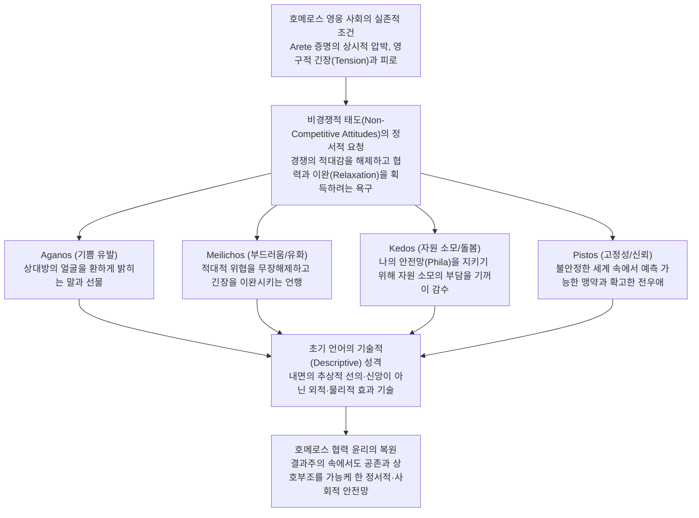

# 호메로스 저작에서의 비경쟁적 태도를 나타내는 희랍어 어휘 연구 (*Some Greek Terms in Homer Suggesting Non-Competitive Attitudes*)

> [!NOTE] 학술사적 의의 및 총평
> 메리 스콧(Mary Scott)의 1981년 논문 「호메로스 저작에서의 비경쟁적 태도를 나타내는 일부 희랍어 어휘들」(*Some Greek Terms in Homer Suggesting Non-Competitive Attitudes*, *Acta Classica* 24)은 결과 중심과 경쟁적 탁월성(Arete)이 지배하는 호메로스 영웅 사회 속에서 영웅들이 타인과 맺는 **비경쟁적(Non-competitive)·협력적(Cooperative)·유화적 태도**의 언어적·심리학적 실체를 규명한 결정적 연구입니다. 스콧은 **아가노스(Aganos)**, **메일리코스(Meilichos)**, **케도스(Kedos)**, **피스토스(Pistos)** 4대 어휘를 집중 분석하여, 초기 고대 그리스어가 행위자의 내면적 의도를 분석(Analytic)하기보다 **외부에 드러난 가시적 결과와 신체적 효과를 기술(Descriptive)**하는 방식으로 작동함을 밝혔습니다. 나아가 끊임없는 무용 증명과 지위 경쟁의 극단적 긴장(Tension) 속에서 살아가는 호메로스 영웅들에게 비경쟁적 관계와 휴식(Relaxation), 상호 신뢰와 돌봄이 얼마나 절실한 정서적 좌소였는지를 실증했습니다.

---

## 1. 서지 정보 및 지성사적 맥락

- **저자**: 메리 스콧 (Mary Scott) — 남아프리카공화국 비트바테르스란트 대학교(University of the Witwatersrand) 고전학 연구자, 고대 그리스 도덕 감정 및 호메로스 가치 체계 연구 권위자.
- **출판 정보**: *Acta Classica*, Vol. 24 (1981), pp. 1–16. (Classical Association of South Africa).
- **스콧의 호메로스 도덕심리학 4부작 중 제3부**:
  1. 1979년: 「호메로스에서의 연민과 파토스」(*Pity and Pathos in Homer*, *Acta Classica* 22) — `[[scott-1979-pity-and-pathos|Scott 1979]]`
  2. 1980년: 「호메로스 저작에서의 아이도스와 네메시스」(*Aidos and Nemesis in the Works of Homer*, *Acta Classica* 23) — `[[scott-1980-aidos-and-nemesis|Scott 1980]]`
  3. **1981년: 「호메로스 저작에서의 비경쟁적 태도를 나타내는 희랍어 어휘 연구」(*Some Greek Terms in Homer Suggesting Non-Competitive Attitudes*, *Acta Classica* 24)** — 본 문서
  4. 1982년: 「필로스, 필로테스, 크세니아」(*Philos, Philotes and Xenia*, *Acta Classica* 25) — `[[scott-1982-philos-philotes-xenia|Scott 1982]]`
- **연구 방법론**:
  - 서사시 전편(_일리아스_ 및 _오뒷세이아_)에 등장하는 형용사 *aganos*, 추상명사 *aganophrosunē*, 형용사 *meilichos* / *meilichios*, 부정형 *ameilikton*, 명사 *kēdos*, 동사 *kēdein* / *kēdesthai*, 파생어 *kēdeios* / *kēdistos* / *kēdemōn*, 형용사 *pistos* / *apistos*의 전수 문맥 분석.
  - **기술적 언어(Descriptive Language) 대 분석적 언어(Analytic Language)**의 방법론적 구분: 초기 언어 발달 단계에서는 주관적 내면 의도가 아니라 '외부에서 관찰되는 물리적 효과와 결과'를 기술하는 원리를 엄격히 적용.
- **지성사적 대립 및 보완 구도**:
  - **A. W. H. 애드킨스(Adkins 1960, 1972)**의 계승 및 심화: 애드킨스의 '경쟁적 가치(Competitive values) 우선성' 모델을 인정하면서도, 영웅 사회 내부에 비경쟁적 태도를 가리키는 정교한 어휘군이 존재하여 결과주의적 경쟁의 압박을 이완시키는 필수적 균형추 역할을 했음을 논증.
  - **브루노 스넬(Snell 1946)**의 고대인 심리학 연계: 보이지 않는 추상적 '신앙/믿음(Faith)'의 관념이 아니라 실체적이고 만질 수 있는 '단단한 고정성(Fixity/Reliability)'에 기초한 고대 그리스인의 세계관 실증.

---

## 2. 개념 비교 매트릭스 및 논증 계보도

### [4대 비경쟁적 어휘 비교 분석 매트릭스]

| 어휘 | 그리스어 | 학술 전사 | 기본 어원 및 의미 | 주요 대립축 | 작동 영역 | 기술적 효과 | 도덕적 성격 | 대표 인물/사례 |
|:---|:---|:---|:---|:---|:---|:---|:---|:---|
| 아가노스 | ἀγανός | *aganós* | `*gau- / *gaw-` (기쁨, 빛남) → **'기쁨을 주는, 얼굴을 밝히는'** | κακός, πικρός, 가혹한 질병 | 신들의 평화로운 급사 화살, 동료 설득, 칭찬, 온화한 통치 | 상대방의 얼굴을 환하게 밝히고 기쁨을 자아냄 | **비도덕적·상황적**: 동등자나 상급자 설득에 주로 사용 | 헥토르(헬레네 위로), 아테나/멘토르(오디세우스의 온화한 통치) |
| 메일리코스 | μείλιχος | *meílikhos* | '부드러움' → **'긴장을 완화하는, 부드러운'** | ἀμείλικτος, ἀπειλαί, 전쟁의 긴장 | 적대·위협의 해제(탄원, 외교), 아군 간 호의적 위로, 인물 성품 | 신체적·심리적 적대감과 경계심의 긴장을 눅누림 | **실리적 도구 가능**: 자신에게 유리한 이익 κέρδος 획득용 | 파트로클로스(만인에 대한 다정함), 오디세우스(나우시카아 회유) |
| 케도스 | κῆδος | *kē̂dos* | `*kād-` (슬픔, 소모, 적의) → **'자원과 힘의 고갈/소모'** | φιλεῖν, 번영과 자족 | 육체적 부상/재난, 적의 파괴 공작, 친족/손님/동료를 위한 부담 수용 | 자신의 자원이 깎여나가거나, 타인을 위해 자원 소모를 감내함 | **자기희생적 의무가 아닌 객관적 소모 기술**: 혈족·동맹의 보호 | 아킬레우스(펠레우스/프리아모스), 글라우코스(부상), 에우마이오스 |
| 피스토스 | πιστός | *pistós* | `*bheidh-` (결속) → **'단단히 고정된, 변함없는'** | ἄπιστος, 동요하는, 변덕스러운, 야만적인 | 맹약·조약 ὅρκια, 믿을 수 있는 전우(아우토메돈), 흔들리지 않는 확신 | 물리적으로 견고하게 고정되어 예측 가능성을 부여함 | **인격적 믿음 이전의 물리적 고정성**: 맹세와 약속의 불변성 | 아우토메돈(전차 마부), 아카이아-트로이 맹약 πίστα ὅρκια |

### [Mermaid 논증 구조도]

---

## 3. 논문의 핵심 테제 및 섹션별 정밀 분석

### 제1절: 언어의 기술적(Descriptive) 측면과 아가노스(*Aganos*)의 본질 (pp. 1–4)

- **기술적 언어와 분석적 언어의 준별**:
  - 언어 발달의 초기 단계에서 어휘는 인간의 내면적 동기나 도덕적 의도(Analytic)를 분석하기보다, 사태의 외적 현상과 관찰 가능한 결과(Descriptive)에 초점을 맞춤.
  - 따라서 호메로스 어휘를 해석할 때 현대 칸트주의적 '선의'나 '친절한 의도'를 소급 투사해서는 안 되며, 행위가 타인에게 미치는 물리적·정서적 효과로서 설명해야 함.
- **아가노스(*Aganos*)의 어원과 정의**:
  - 어원적으로 희랍어 어근 `*gau- / *gaw-` (기쁨, 빛남, *ganumai*, *ganos*, *gētheō*)에 비음 삽입과 강화 접두사 `a-`가 결합된 형태임.
  - 고대 그리스인에게 기쁨은 경험하는 사람의 신체와 얼굴을 환하게 밝혀주는(*lit up*) 물리적 현상이었음. 따라서 *aganos*의 근본 의미는 **'기쁨을 가져다주는(joy-bringing / bringing pleasure)'** 것임.
- **평화로운 죽음을 선사하는 신들의 부드러운 화살**:
  - *aganos*는 남성의 경우 아폴론(_Od._ 3.280), 여성의 경우 아르테미스(_Od._ 5.124, 11.199)가 쏘는 화살(*aganois belesin*)의 고정 수식어로 빈번히 등장함.
  - 끔찍한 기근이나 신체적 기능을 갉아먹는 만성 질병, 전장에서의 참혹한 살육과 달리, 노년에 이르러 고통 없이 순식간에 맞이하는 급사는 아레테를 훼손당하지 않고 인간적 존엄을 지키는 '기쁨을 주는 평화로운 죽음'으로 인식됨(_Od._ 11.171–173, 15.407–411).
- **지휘관을 설득하는 부드러운 말 (*Agana epea*)**:
  - 『일리아스』 2권에서 오디세우스는 도망치려는 군대를 수습할 때, 동등한 지위의 장수들에게는 기쁨을 주고 자존심을 세워주는 *aganois* 말로 설득하지만(_Il._ 2.189), 일반 병사들에게는 지팡이로 구타하고 고함을 지름(_Il._ 2.198–199).
  - 아가토스는 보복 능력이 없는 하급자의 불만은 무시할 수 있으나, 협력이 절대적으로 필요한 동료 장수들의 호의를 유지하기 위해 *aganos*한 어휘를 전략적으로 구사함.
- **아킬레우스 달래기와 헥토르의 친절**:
  - 사절단 파견 시 네스토르는 아킬레우스의 마음을 기쁘게 할 선물(*aganoisin dōroisin*)과 부드러운 말(*meilichioisin*)로 설득하자고 제안함(_Il._ 9.111–113).
  - 헬레네는 헥토르의 시신 앞에서 그가 자신에게 단 한 번도 거친 말을 하지 않고 온화한 태도(*aganophrosunē*)와 부드러운 말(*aganois epeessin*)로 궁정 사람들의 비난으로부터 감싸주었음을 눈물로 증언함(_Il._ 24.767–772).
  - 트로스의 탄원을 거부하고 무자비하게 살해하는 아킬레우스는 *glukuthumos*(달콤한 마음)도 *aganophrōn*(기쁨을 주는 마음)도 아닌 광란의 살육욕에 사로잡혀 있었음(_Il._ 20.466–468).
- **온화한 통치자**: 아테나와 멘토르는 오디세우스가 백성들에게 친절하고 온화한(*aganos kai ēpios*) 왕이었음에도 배신당했음을 개탄하며, 선정을 베풀어봤자 무슨 소용이 있느냐고 신들에게 항의함(_Od._ 5.7–10, 2.230–232).

---

### 제2절: 메일리코스(*Meilichos*)와 적대 해제 및 긴장 완화 (pp. 4–7)

- **메일리코스의 기본 개념: '부드러움(Softness)'**:
  - *meilichos* / *meilichios*는 기본적으로 신체적·언어적 '부드러움'을 지칭하며, 거칠고 위협적인 공격성(*apeilai*, *khalepos*)과 선명한 대조를 이룸(_Il._ 12.267–268, 17.431).
- **잠재적·현실적 적대의 무장해제 (Disarming Hostility)**:
  - 위협에 직면한 화자는 상대의 분노와 공격성을 가라앉히기 위해 *meilichia* 말을 사용함.
  - 전장에서 목숨을 탄원하는 아군/적군: 페이산드로스와 히폴로코스는 아가멤논에게 *meilichiois* 말로 목숨을 구걸했으나, 돌아온 것은 무자비한 거절(*ameilikton opa*)이었음(_Il._ 11.136–137).
  - 위험 행동의 만류: 오디세우스의 동료들이 키르케 궁전 진입을 거부하는 에우리로코스를 죽이려는 오디세우스를 말릴 때(_Od._ 10.442), 폴리페모스를 도발하는 오디세우스를 필사적으로 만류할 때(_Od._ 9.493) 모두 *meilichiois* 말이 쓰임.
- **실리적 이익(*Kerdos*)을 위한 전략적 유화책**:
  - 파이아케스 해변에 난파된 알몸의 오디세우스는 나우시카아의 방어적 공격성과 공포를 자극하지 않기 위해 무릎을 잡는 직접 탄원을 피하고 거리를 둔 채 '부드럽고도 약삭빠른 말(*meilichion kai kerdaleon mython*)'을 건넴(_Od._ 6.148–149).
  - 페넬로페는 구혼자들에게 마음을 열 생각이 전혀 없으면서도, 그들의 마음을 부드러운 말(*meilichiois epeessi*)로 홀려 값비싼 구혼 선물을 바치도록 유도함(_Od._ 18.282–283).
  - 디오메데스는 글라우코스와의 조부 대 크세니아 관계를 확인하자마자 창을 땅에 꽂고 *meilichioisi* 말로 화답하여 전장의 적대 상황을 우호적 환대로 전환함(_Il._ 6.214).
- **동료 간의 긴장 완화와 안도감**:
  - 상시적 긴장 상태에 놓인 전사들이 동료(*philos*)와 만날 때 *meilichos*한 어휘를 사용하는 것은, 상호 경쟁을 중단하고 경계를 풀어도 안전하다는 신호를 줌.
  - 아가멤논이 출전 준비에 열심인 이도메네우스를 보고 기뻐하며 *meilichioisin* 말로 명예를 약속하는 장면(_Il._ 4.256), 야간 정찰에서 개선한 디오메데스와 오디세우스를 그리스군이 기쁨으로 맞이하는 장면(_Il._ 10.541–542).
- **성품으로서의 메일리코스 (파트로클로스와 헥토르)**:
  - 브리세이스는 남편과 형제들을 잃고 포로가 된 자신을 다정하게 위로해주었던 파트로클로스를 "언제나 다정했던 분(*aiei meilichos*)"이라 부르며 애도함(_Il._ 19.300).
  - 메넬라오스 역시 파트로클로스의 시신을 수습하며 "그는 살아생전 만인에게 다정할 줄 알았던(*meilichos emmenai*) 영웅"이라고 증언함(_Il._ 17.671–672). 포로와 하급자에게까지 이완과 배려를 보인 파트로클로스의 태도는 영웅 사회에서 매우 드물고 고귀한 덕목이었음.
  - 반면 안드로마케는 어린 아스티아낙스에게 "네 아버지는 참혹한 전장에서 결코 부드러운(*meilichos*) 전사가 아니었다"고 말함(_Il._ 24.739). 전장에서는 살육과 긴장의 냉혹함이 요구되므로 *meilichos*는 철저히 배제됨(_Il._ 15.741).

---

### 제3절: 케도스(*Kedos*)와 자원 고갈 및 돌봄의 부담 수용 (pp. 7–12)

- **케도스의 다의성과 어원적 통합성**:
  - *kēdos*는 사전상 '슬픔/비탄(Grief)', '장례식(Burial)', '걱정/근심(Trouble)', '친족/인척 관계(Family alliance)', '돌봄/배려(Care/Solicitude)' 등 전혀 다른 의미로 다의 번역됨.
  - 어원적으로 오스카어 *cadeis*(적의/증오), 켈트어 *cas*, 고트어 *hatis*(증오), 중세 브르타뉴어 *cuez*(슬픔)와 연결됨.
  - 스콧은 이 모든 의미를 관통하는 단일한 심리적 원형을 **'자신의 자원, 활력, 힘이 깎여나가거나 고갈되는 감각(A sensation of being drained of one's resources, powers or strength / deprivation and loss)'**으로 규명함.
- **신체적 상처와 재난으로 인한 케도스**:
  - 하데스가 헤라클레스의 화살에 맞아 고통받을 때 튀모스 속에 *kēdos*를 느끼고(_Il._ 5.400), 오디세우스가 부상당했을 때도 동일한 표현이 쓰임(_Il._ 11.458).
  - 전사 글라우코스는 팔에 입은 상처로 피가 멈추지 않아 칼조차 쥘 수 없고 사르페돈의 시신을 지킬 수 없게 되자, 아폴론에게 "지금 제게 *kēdos*가 닥쳤나이다"라고 절규함(_Il._ 16.515–516). 힘의 완전성을 자랑하던 영웅이 무력하게 허물어지는 감각이 곧 *kedos*임.
  - 아폴론은 아이아스의 돌에 맞아 쓰러졌다 깨어난 헥토르에게 "무슨 *kēdos*가 네게 덮쳤느냐"고 묻는데, 이는 "어디서 기력이 쇠진했느냐"는 기술적 질문임(_Il._ 15.244–245).
- **타인의 자원을 고갈시키는 행위 (*Kēdein*)**:
  - 아킬레우스는 프리아모스에게 "나는 고향에 계신 늙은 아버지를 부양하지도 못한 채, 이곳 트로이에 머물며 당신과 당신 자식들에게 *kēdos*를 가져다주고(*kēdōn*) 있소"라고 한탄함(_Il._ 24.540–542). 아킬레우스는 프리아모스의 자식들을 죽임으로써 그의 가문 자원을 철저히 파괴·고갈시키고 있음을 자각함.
  - 에우리클레이아는 오디세우스가 그의 가옥 자원을 탕진하고 아들을 위협하던 구혼자들을 처단했음을 알리며, 구혼자들이 가문에 끊임없이 *kēdos*를 초래했음을 고발함(_Od._ 23.7–9).
  - 포이닉스의 설득에 분노한 아킬레우스: "내게 *kēdos*를 초래한 자(아가멤논)에게 나와 함께 *kēdos*를 되돌려주는 것이 그대에게 합당하다"(_Il._ 9.612–615).
- **협력적 영역에서의 케도스 (*Kēdesthai* — 돌봄의 수용)**:
  - 수동태/중간태 *kēdesthai*는 타인을 위해 **자신의 자원 소모와 수고의 부담을 기꺼이 짊어지는 것(Taking upon oneself the strain/trouble for someone)**을 의미함.
  - 이는 자주 *philein*(호의를 베풀다) 및 *eleairein*(불행에 연민을 느끼다)과 결합되어 나타남(_Il._ 1.196, 2.27, _Od._ 3.223, 14.146).
  - **친족과 인척 (*Kēdeioi, Kēdistoi*)**: 친족이나 혼인으로 맺어진 처가·시댁 식구는 나에게 지속적인 자원 투입과 방어의 부담을 안겨주는 존재들이므로 *kēdeioi* 또는 *kēdistoi*(가장 큰 수고를 끼치는 이들)라 불림(_Od._ 8.581–583, _Il._ 13.463–464).
  - **가솔과 손님 돌봄**: 아킬레우스가 포로인 브리세이스를 진심으로 아끼고 돌보았다고 항변할 때(_Il._ 9.340–343), 에우마이오스가 오디세우스의 은혜를 회상할 때(_Od._ 14.146) 모두 *kēdesthai*가 쓰임.
  - **사자(死者)의 매장 (*Kēdemōn*, *Akēdēs*)**: 망자를 위해 시간과 재물을 들여 화장하고 무덤을 만들어주는 사람을 *kēdemōn*(매장 책임자)이라 부르며(_Il._ 23.163), 방치되어 매장되지 못한 시신은 *akēdea*(돌봄 없는)라 칭함(_Od._ 24.187).
- **도덕적 동기 이전의 기술성**: 아가토스는 1인칭으로 "내가 너를 돕겠다"고 선언하기보다, 객관적으로 타인의 필요에 의해 자신의 자원이 소모되는 상태(*kedomenos*)로 묘사됨.

---

### 제4절: 피스토스(*Pistos*)와 흔들림 없는 고정성 (pp. 12–14)

- **피스토스의 어원과 기본 의미: '고정성(Fixity)'**:
  - *pistos*는 라틴어 *fido*, *fides*, 고대 슬라브어 *beda*(필연), *bezde*(강제)와 동원어로, **'단단히 묶여 고정되어 변하지 않는 것(Binding, fixed and solid)'**을 가리킴.
- **맹약과 조약의 불변성 (*Horkia pista*)**:
  - 서사시에서 *piston*은 맹세와 평화 조약(*horkia pista*)을 수식하는 가장 빈번한 관용어로 10회 이상 등장함(_Il._ 2.124, 3.73, 3.94, 4.157 등). 한 번 신들을 걸고 맺은 조약은 인간의 변덕으로 파기할 수 없는 절대적 고정성을 지녀야 함.
- **전장에서 자리를 지키는 전우**:
  - 파트로클로스는 아킬레우스 다음으로 아우토메돈을 가장 신임했는데, 그가 전장의 끔찍한 함성과 혼란 속에서도 진형을 이탈하지 않고 자리를 지키는 가장 확고한 마부(*pistotatos*)였기 때문임(_Il._ 16.146–147).
- **아피스토스(*Apistos*) — 동요와 예측 불가능성**:
  - 아가멤논의 망령은 오디세우스에게 클뤼타임네스트라의 배신을 경고하며 "여인들에게는 더 이상 확고함(*pista*)이 없다"고 한탄함(_Od._ 11.456).
  - 헬레네를 빼앗은 파리스 일족의 오만과 신뢰 불가능성(_Il._ 3.106), 헥토르의 시신을 찾으러 가려는 프리아모스를 만류하는 헤카베가 아킬레우스를 가리켜 "야만적이고 종잡을 수 없는 자(*apistos*)"라고 부르는 장면(_Il._ 24.206–208).
  - 오디세우스의 귀환을 의심하고 믿지 못하는 에우마이오스와 페넬로페의 마음은 *thumos apistos*(동요하는 마음)로 불림(_Od._ 14.150, 23.72).
- **호메로스 인식론과 신앙(Faith) 관념의 부재**:
  - 스넬(Snell)의 지적대로 호메로스 그리스인에게는 눈에 보이지 않는 초월적 대상을 믿는 근대적·기독교적 '신앙(Faith)' 개념이 없었음.
  - 신들은 물리적 현실만큼이나 명백하게 현존하는 실체였으므로 의심의 대상이 될 수 없었음.
  - 따라서 *pistos*는 주관적 신뢰 감정이 아니라, 사물이나 인물이 외적으로 보여주는 **'물리적 견고함과 변함없는 확실성(Solid reliability)'**을 기술하는 용어임.

---

### 제5절: 종합 — 비경쟁적 가치의 정서적 좌소와 영웅 심리학 (pp. 14–15)

- **경쟁적 사회의 긴장과 비경쟁적 안식처의 가치**:
  - 호메로스 영웅은 국가나 법률의 보호 없이 오직 자신의 아레테와 티메를 증명해야만 생존할 수 있는 극단적 경쟁 환경에 처해 있었음.
  - 그러나 인간은 24시간 경쟁과 적대의 긴장 속에서만 살아갈 수 없음. 따라서 경쟁을 중단하고 경계를 풀 수 있는 비경쟁적 상황은 영웅에게 엄청난 심리적 안도감과 기쁨을 선사함.
- **4대 어휘의 유기적 상호 보완성**:
  1. *Aganos*: 경쟁의 적의를 거두고 서로에게 기쁨을 선사하는 유화적 태도.
  2. *Meilichos*: 날카로운 대립을 누그러뜨리고 편안한 이완을 가져오는 부드러움.
  3. *Kedos*: 생존을 함께하는 공동체(가족, 전우, 손님)를 위해 자신의 자원을 기꺼이 소모하는 연대 책임.
  4. *Pistos*: 불확실한 세계에서 흔들림 없이 기댈 수 있는 예측 가능한 신뢰와 맹약.
- **애드킨스 패러다임의 극복**: 호메로스 사회가 결과 중심의 성공 윤리에 지배되었을지라도, 그 내면에는 인간 사회를 지탱하고 영웅의 고립된 자아를 위무하는 풍부하고 섬세한 비경쟁적 감정 체계가 견고하게 작동하고 있었음.

---

## 4. 문헌학적 어휘 사전 및 희랍어 개념 주해

### 1. 아가노스 계열 어휘군

| 그리스어형 | 학술 전사 | 표제형·형태론 | 한국어 풀이 | 근거 |
|:---|:---|:---|:---|:---|
| ἀγανός | *aganós* | 형용사 | '기쁨을 주는', '얼굴을 환하게 밝히는', '온화한' | PIE 어근 `*gau- / *gaw-` + 비음 `n` 삽입 + 강화 접두사 `ἀ-` |
| γάνος | *gános* | 명사 | 광채, 기쁨 | ἀγανός의 파생어 |
| γάνυμαι | *gánumai* | 동사 | 기뻐하다, 빛나다 | ἀγανός의 파생어 |
| γηθέω | *gēthéō* | 동사 | 환호하다 | ἀγανός의 파생어 |
| ἀγανοφροσύνη | *aganophrósúnē* | 추상명사 | 온화한 마음가짐, 타인을 기쁘게 배려하는 태도 | ἀγανός + φρήν, 마음/횡격막; _Il._ 24.772 |
| ἀγανόφρων | *aganóphrōn* | 형용사 | 온화한 마음을 지닌, 기쁨을 베푸는 성품의 | _Il._ 20.467 |

### 2. 메일리코스 계열 어휘군

| 그리스어형 | 학술 전사 | 표제형·형태론 | 한국어 풀이 | 근거 |
|:---|:---|:---|:---|:---|
| μείλιχος | *meílikhos* | 형용사 | 부드러운, 긴장을 푸는, 달래는, 다정한 | 라틴어 대역: *mitis, comis, lenis, mollis, placidus*; 독일어 대역: *freundlich, liebreich* |
| μειλίχιος | *meilíkhios* | 형용사 | 부드러운, 긴장을 푸는, 달래는, 다정한 | μείλιχος의 이형 |
| μειλιχίη | *meilikhíē* | 추상명사 | 부드러움, 긴장 완화, 유화적 태도 | _Il._ 15.741 |
| ἀμείλικτος | *ameíliktos* | 형용사 | 누그러지지 않는, 가혹한, 비정한 | 부정 접두사 `ἀ-` + μείλιχος; _Il._ 11.137 |

### 3. 케도스 계열 어휘군

| 그리스어형 | 학술 전사 | 표제형·형태론 | 한국어 풀이 | 근거 |
|:---|:---|:---|:---|:---|
| κῆδος | *kē̂dos* | 명사; 복수형 κήδεα | 자원/힘의 고갈, 재난, 고통, 장례, 돌봄/근심 | 오스카어 *cadeis*(적의), 고트어 *hatis*(증오), 중세 브르타뉴어 *cuez*(비탄) |
| κήδειν | *kḗdein* | 능동태 동사 | 타인의 자원을 갉아먹다, 고통/손실을 초래하다 | _Il._ 24.542, 9.615 |
| κήδεσθαι | *kḗdesthai* | 중간태/수동태 동사 | 자원 소모의 부담을 떠맡다, 보살피다, 마음을 쓰다 | φιλεῖν·ἐλεαίρειν과 연동 |
| κηδεῖοι | *kēdeîoi* | 형용사/명사 | 나에게 큰 수고와 자원 소모의 책임을 지우는 인척/친족 | _Il._ 13.464 |
| κήδιστοι | *kḗdistoi* | 형용사/명사 | 나에게 가장 큰 수고와 자원 소모의 책임을 지우는 인척/친족 | _Od._ 8.581 |
| κηδεμών | *kēdemṓn* | 명사 | 장례 책임을 지고 재물을 들여 매장하는 보호자 | _Il._ 23.163 |
| ἀκηδής | *akēdḗs* | 형용사 | 돌봄을 받지 못한 | _Od._ 24.187 |
| ἀκηδέα | *akēdéa* | 중성 복수형 | 매장되지 않고 방치된 | _Od._ 24.187 |

### 4. 피스토스 계열 어휘군

| 그리스어형 | 학술 전사 | 표제형·형태론 | 한국어 풀이 | 근거 |
|:---|:---|:---|:---|:---|
| πιστός | *pistós* | 형용사 | 단단히 고정된, 변함없는, 확실한, 충직한 | PIE `*bheidh-` (신뢰/결속), 라틴어 *fido*, *fides*, 고대 슬라브어 *beda* (필연) |
| ὅρκια πιστά | *hórkia pistá* | 고정식 | 신들을 걸고 단단히 묶은 불변의 맹약/조약 | 맹약·조약의 정형구 |
| ἄπιστος | *ápistos* | 형용사 | 흔들리는, 고정되지 않은, 신뢰할 수 없는, 야만적인 | _Il._ 24.208, _Od._ 11.456 |

---

## 5. 핵심 원문 인용 및 심층 주석

- **평화로운 급사를 내리는 아르테미스의 화살 (_Od._ 11.171–173)**
  - **번역**: 어떤 쓰라린 죽음의 운명이 그대를 쓰러뜨렸습니까? 길고 오랜 질병이었습니까, 아니면 화살을 즐기시는 아르테미스 여신께서 그대에게 다가와 당신의 온화한(ἀγανοῖς, *aganoîs*) 화살로 쓰러뜨리신 것입니까?
  - **원문**: *τίς νύ σε κὴρ ἐδάμασσε τανηλεγέος θανάτοιο; ἦ νοῦσος δολιχὴ ἦ Ἄρτεμις ἰοχέαιρα οἷς ἀγανοῖς βελέεσσιν ἐποιχομένη κατέπεφνεν;*
  - **학술 전사**: *tís nú se kḕr edámasse tanēlegéos thanátoio; ē̂ noûsos dolikhḕ ē̂ Ártemis iokhéaira hoîs aganoîs beléessin epoikhoménē katépephnen;*
  - **[주석]**: 오디세우스가 저승에서 어머니 안티클레이아에게 묻는 장면. 서사시에서 만성 질환에 의한 쇠약은 전사의 아레테와 존엄을 갉아먹는 치욕으로 여겨졌으나, 신들이 내리는 급사는 고통 없는 최상의 영예로운 죽음으로 *aganos*의 기쁨을 동반함.

- **장수들을 설득하는 오디세우스의 부드러운 말 (_Il._ 2.188–190)**
  - **번역**: 그는 왕이나 뛰어난 장수를 마주칠 때마다 그 곁으로 다가가 온화한(ἀγανοῖς, *aganoîs*) 말로 만류하곤 했다.
  - **원문**: *ὅν τινα μὲν βασιλῆα καὶ ἔξοχον ἄνδρα κιχείη τὸν δ' ἀγανοῖς ἐπέεσσιν ἐρητύσασκε παραστάς*
  - **학술 전사**: *hón tina mèn basilē̂a kaì éksokhon ándra kikhéē tòn d’ aganoîs epéessin erētúsaske parastás*
  - **[주석]**: 동등한 지위의 귀족 장수들에게는 자존심을 배려하고 기쁨을 주는 언어를 구사하는 반면, 일반 병사에게는 지팡이와 고함을 사용하는 대조를 통해 *aganos*가 아가토이 간의 전략적 협력 영역에서 작동함을 증명.

- **헬레네를 감싸주었던 헥토르의 인품 (_Il._ 24.771–772)**
  - **번역**: 오히려 당신은 그 사람을 타이르는 말로 만류해 주셨지요, 당신의 온화한 마음(ἀγανοφροσύνῃ, *aganophrósúnēi*)과 온화한(ἀγανοῖς, *aganoîs*) 말로써.
  - **원문**: *ἀλλὰ σὺ τόν γ' ἐπέεσσι παραιφάμενος κατέρυκες σῇ τ' ἀγανοφροσύνῃ καὶ σοῖς ἀγανοῖς ἐπέεσσι.*
  - **학술 전사**: *allà sú tón g’ epéessi paraiphámenos katérukes sē̂i t’ aganophrósúnēi kaì soîs aganoîs epéessi.*
  - **[주석]**: 전쟁의 원인이라며 온 트로이 궁정의 비난을 받던 헬레네를 유일하게 따뜻하게 품어준 헥토르의 비경쟁적 배려를 압축하는 대목.

- **파트로클로스의 다정함에 대한 브리세이스의 애도 (_Il._ 19.300)**
  - **번역**: 그렇기에 나는 언제나 다정하셨던(μείλιχον αἰεί, *meílikhon aieí*) 당신의 죽음을 끝없이 슬퍼하며 웁니다.
  - **원문**: *τῶ σ' ἄμοτον κλαίω τεθνηότα μείλιχον αἰεί.*
  - **학술 전사**: *tō̂ s’ ámoton klaíō tethnēóta meílikhon aieí.*
  - **[주석]**: 전쟁 포로라는 극도로 취약한 처지의 여성에게까지 군림하지 않고 긴장을 완화해주었던 파트로클로스의 *meilichos*한 성품이 불러일으킨 진정한 애도.

- **자신을 희생하며 트로이에 케도스를 초래하는 아킬레우스 (_Il._ 24.540–542)**
  - **번역**: 나는 늙어가는 아버지를 돌보지도 못한 채, 고국에서 아주 멀리 떨어진 트로이에 앉아 당신과 당신의 자식들에게 파멸의 고통(κήδων, *kḗdōn*)만을 안겨주고 있소.
  - **원문**: *οὐδέ νυ τόν γε γηράσκοντα κομίζω, ἐπεὶ μάλα τηλόθι πάτρης ἧμαι ἐνὶ Τροίῃ, σέ τε κήδων ἠδὲ σὰ τέκνα.*
  - **학술 전사**: *oudé nu tòn ge gēráskonta komízō, epeì mála tēlóthi pátrēs hē̂mai enì Troíēi, sé te kḗdōn ēdè sà tékna.*
  - **[주석]**: 자신의 아버지 펠레우스에 대한 부양 자원을 포기하고, 적국 트로이의 가장인 프리아모스의 인적·물적 자원을 고갈시키고 있는 비극적 영웅 실존의 자기 자각.

- **아우토메돈의 흔들림 없는 충직함 (_Il._ 16.146–147)**
  - **번역**: 파트로클로스는 적진을 뚫는 아킬레우스 다음으로 그를 가장 높이 대우했으니, 그는 전투의 함성 속에서도 자리를 지키는 가장 믿을 수 있는(πιστότατος, *pistótatos*) 전우였기 때문이다.
  - **원문**: *τὸν μετ' Ἀχιλλῆα ῥηξήνορα τῖε μάλιστα· πιστότατος δέ οἱ ἔσκε μάχῃ ἔνι μεῖναι ὁμοκλήν.*
  - **학술 전사**: *tòn met’ Akhillē̂a rhēksḗnora tîe málista; pistótatos dè hoi éske mákhē̂i éni meînai homoklḗn.*
  - **[주석]**: *pistos*가 내면의 심리적 믿음이 아니라 극한의 전장 소음 속에서도 요동하지 않고 물리적 위치를 사수하는 '외적 고정성'임을 명쾌히 보여주는 구절.

---

## 6. 서사시 에피소드 정밀 매핑 테이블 (Epic Passage Matrix)

| 서사시 출전 | 그리스어 실제형 | 학술 전사 | 등장 맥락 및 사건 | 메리 스콧(1981)의 문헌학적·심리학적 분석 |
|:---|:---|:---|:---|:---|
| _Il._ 2.164, 180, 189 | ἀγανοῖς ἐπέεσσιν | *aganoîs epéessin* | 아테나의 지시를 받아 도망치는 장수들을 설득하는 오디세우스 | 아가토이의 자존심을 꺾지 않고 '기쁨을 주는 말'로 설득하는 비경쟁적 화술 |
| _Il._ 2.198–199 | χαλεπὸν μῦθον | *khalepòn mûthon* | 소리 지르며 동요하는 평민 병사들을 구타하는 오디세우스 | 하급자에게는 아가노스가 필요 없음을 보여주는 귀족적 언어의 계급적 경계 |
| _Il._ 9.111–113 | δώροισίν τ' ἀγανοῖσιν ἔπεσσί τε μειλιχίοισι | *dṓroisín t’ aganoîsin épessí te meilikhíoisi* | 아킬레우스의 화해를 위해 선물과 부드러운 말을 제안하는 네스토르 | 분노를 누그러뜨리기 위해 기쁨을 주는 선물과 긴장을 푸는 말의 복합 처방 |
| _Il._ 9.340–343 | φιλέει καὶ κήδεται | *philéei kaì kḗdetai* | 포로 브리세이스를 아내처럼 아끼고 돌보았다고 항변하는 아킬레우스 | 포로에게도 자원 소모의 부담(κήδεσθαι, *kḗdesthai*)을 지는 아가토스의 보호 본능 |
| _Il._ 9.612–615 | κήδειν | *kḗdein* | 포이닉스에게 아가멤논과 타협하지 말고 함께 그에게 고통을 주자고 요구하는 아킬레우스 | 내 편(φίλος, *phílos*)은 같은 적에게 자원 손실(κῆδος, *kē̂dos*)을 입혀야 한다는 상호 연대 |
| _Il._ 11.136–137 | μειλιχίοισιν, ἀμείλικτον | *meilikhíoisin, ameílikton* | 목숨을 구걸하는 트로이 형제와 이를 단호히 거절하는 아가멤논 | 적대를 해제하려는 탄원자의 부드러운 말과 타협 없는 냉혹함의 충돌 |
| _Il._ 12.267–268 | μειλιχίοισι, χαλεποῖσι | *meilikhíoisi, khalepoîsi* | 전선을 독려하며 부드러운 말과 거친 말을 번갈아 쓰는 아이아스 형제 | 긴장 완화(μείλιχος, *meílikhos*)와 공격적 질책(χαλεπός, *khalepós*)의 물리적 대비 |
| _Il._ 15.244–245 | κῆδος | *kē̂dos* | 기절했다 깨어난 헥토르에게 기력의 쇠진을 묻는 아폴론 | 외상 없이 신체 내부의 활력이 깎여나간 상태를 기술하는 케도스 |
| _Il._ 15.741 | μειλιχίη | *meilikhíē* | 함선 방어전에서 오직 완력에 의지해야 한다고 외치는 대(大)아이아스 | 생사가 걸린 결전에서는 긴장 완화가 결코 허용될 수 없음 |
| _Il._ 16.146–147 | πιστότατος | *pistótatos* | 파트로클로스가 가장 신임하는 전차 마부 아우토메돈의 꿋꿋함 | 난전 속에서도 물리적 자리를 굳건히 지키는 '외적 고정성'으로서의 신뢰 |
| _Il._ 16.515–516 | κηδόμενος, κῆδος | *kēdómenos, kē̂dos* | 부상으로 사르페돈을 지키지 못해 절규하며 기도하는 글라우코스 | 신체적 무력화로 인해 영웅적 책임을 다하지 못하는 절망적 자원 고갈 |
| _Il._ 17.671–672 | μείλιχος | *meílikhos* | 파트로클로스의 시신을 수습하며 그의 성품을 증언하는 메넬라오스 | 만인에게 위협을 거두고 부드럽게 대할 줄 알았던 영웅적 품격 |
| _Il._ 19.300 | μείλιχον αἰεί | *meílikhon aieí* | 파트로클로스의 유해 앞에서 오열하는 포로 브리세이스 | 가혹한 노예 상태에서도 인간적 위안을 제공했던 인물의 부드러움 애도 |
| _Il._ 20.466–468 | οὐ γλυκύθυμος, ἀγανόφρων | *ou glukúthumos, aganóphrōn* | 무릎을 꿇고 탄원하는 소년 트로스를 단칼에 처형하는 아킬레우스 | 광란의 살육욕 속에서 비경쟁적 정서가 완전히 마비된 상태 |
| _Il._ 24.767–772 | ἀγανοφροσύνη, ἀγανοῖς | *aganophrósúnē, aganoîs* | 헥토르의 시신 앞에서 그의 관용과 보호를 애도하는 헬레네 | 공동체의 적의로부터 약자를 보호해준 헥토르의 온화한 비경쟁적 태도 |
| _Od._ 3.280, 5.124 | ἀγανοῖς βελέεσσιν | *aganoîs beléessin* | 아폴론과 아르테미스의 화살로 평화롭게 숨을 거두는 망자들 | 쇠약 질병이나 굶주림과 대비되는, 고통 없는 존엄한 '기쁨을 주는 죽음' |
| _Od._ 6.148–149 | μειλίχιον καὶ κερδαλέον | *meilíkhion kaì kerdaleon* | 나우시카아에게 다가가며 무릎 접촉 대신 부드러운 말을 건네는 오디세우스 | 공포와 적대감을 유발하지 않고 호의를 얻어내기 위한 실리적 유화 언어 |
| _Od._ 8.581–583 | κήδιστοι | *kḗdistoi* | 알키노오스가 혈육 다음으로 소중하다고 칭하는 처가/사위/인척 | 지속적인 상호 지원과 자원 투입 책임을 공유하는 혼인 동맹 관계 |
| _Od._ 11.456 | πίστα | *písta* | 아가멤논 망령의 여인들에 대한 극단적 불신 경고 | 배신과 변덕으로 인해 영구적 고정성을 상실한 관계의 위험성 |
| _Od._ 15.407–411 | ἀγανοῖς βελέεσσιν | *aganoîs beléessin* | 시리에 섬의 이상적 노년과 평화로운 죽음을 묘사하는 에우마이오스 | 질병과 쇠약의 굴욕이 배제된 완벽하게 행복하고 온화한 필멸의 종말 |
| _Od._ 18.282–283 | μειλιχίοισι ἐπέεσσι | *meilikhíoisi epéessi* | 구혼자들을 달콤한 말로 홀려 예물을 바치게 만드는 페넬로페 | 적대자를 무장해제시키고 이익을 극대화하는 부드러운 말의 전략적 사용 |
| _Od._ 23.7–9 | κῆδος | *kē̂dos* | 구혼자들이 오디세우스 가문에 가한 끊임없는 자원 탕진 | 오이코스의 물질적·인적 기반을 고갈시키는 적대적 침탈 행위 |

---

## 7. 학술 논쟁사 및 비판적 공방

### 1. 애드킨스(Adkins 1960)의 가치 2분법에 대한 비판적 정련

- **애드킨스의 원 테제**: 호메로스 사회는 오직 결과와 군사적 성공만을 긍정하는 '경쟁적 가치(Arete)'가 압도적 우위를 점하며, 협력적 가치(Quiet/Cooperative virtues)는 부차적이고 무력한 것으로 치부됨.
- **스콧의 비판 및 보완**:
  - 스콧은 영웅 사회에서 아레테 중심주의의 강력함을 인정하면서도, 영웅들의 삶이 영구적인 긴장(Tension)과 적대의 공포 속에 갇혀 있었음을 지적함.
  - *aganos*, *meilichos*, *kedos*, *pistos*와 같은 어휘들은 단순한 부차적 표현이 아니라, **경쟁의 극단적 긴장을 완화하고(Relaxation) 생존을 위한 상호부조망을 형성하기 위해 영웅들이 필사적으로 의지했던 핵심적인 정서적 안전판**이었음을 밝힘.

### 2. 초기 희랍어의 성격: 기술적(Descriptive)인가 분석적(Analytic)인가?

- **근대적 도덕 심리학의 투사 비판**: 19세기 및 20세기 초반 고전학자들은 *aganos*를 '친절한(Kindly)', *meilichos*를 '상냥한(Gentle)', *kedos*를 '사랑하는 돌봄(Loving care)', *pistos*를 '믿음직한(Faithful)' 등 근대적 내면 심리 용어로 환원하여 번역함.
- **스콧의 문헌학적 규명**:
  - 호메로스 그리스인은 내면의 추상적 선의나 신앙을 분석하는 어휘를 갖지 않았음.
  - 모든 용어는 **외부에서 관찰되는 물리적 현상(얼굴이 밝아짐, 신체적 긴장이 풀림, 자원이 소모됨, 물리적으로 고정됨)**을 기술함.
  - 내면적 의도가 전제되는 경우조차, 어휘 자체는 여전히 가시적인 외적 효과를 지시하고 있음.

---

## 8. 연구 질문 및 세미나 토론 쟁점

1. **아킬레우스의 정서적 전환과 비경쟁적 어휘의 부재/복원**:
   - 『일리아스』 20–21권에서 아킬레우스는 왜 *aganophrōn*이나 *meilichos*를 철저히 상실하고 야만적인 *ameiliktos*로 전락하는가?
   - 24권에서 프리아모스를 맞이할 때 아킬레우스가 아버지 펠레우스에 대한 *kēdos*를 자각하고 노왕을 일으켜 세우는 것은, 결과주의적 전사 규범에서 비경쟁적 필멸자 연대로의 복귀를 의미하는가?
2. **파트로클로스의 *Meilichos*와 호메로스적 영웅의 이상**:
   - 만인에게 *meilichos*했던 파트로클로스의 성품은 전장에서의 승리 중심 아레테 규범과 어떻게 양립할 수 있었는가?
   - 그의 온화함은 영웅적 탁월성의 결핍인가, 아니면 아킬레우스의 파괴적 분노를 제어하는 유일한 도덕적 보루였는가?
3. **손님 환대와 처가 동맹(*Kēdeioi*)에서의 자원 소모의 역설**:
   - 왜 호메로스 사회는 자신의 자원을 소모시키는 친족과 인척을 가장 고통스러운 존재(*kēdistoi*)라 부르면서도, 이를 가장 강력한 사회적 동맹의 기제로 삼았는가?

---

## 관련 항목

### 소스 문서 (Sources)
- [[scott-1979-pity-and-pathos]] — 메리 스콧 1979: 연민과 파토스
- [[scott-1980-aidos-and-nemesis]] — 메리 스콧 1980: 아이도스와 네메시스
- [[scott-1982-philos-philotes-xenia]] — 메리 스콧 1982: 필로스, 필로테스, 크세니아
- [[adkins-1960-merit-and-responsibility]] — A. W. H. 애드킨스 1960: 공적과 책임
- [[snell-1946-discovery-of-mind]] — 브루노 스넬 1946: 정신의 발견
- [[long-1970-morals-and-values]] — A. A. 롱 1970: 호메로스의 도덕과 가치

### 개념 문서 (Concepts)
- [[concept-agathos]] — 영웅적 탁월자와 결과주의 규범
- [[concept-arete]] — 탁월성과 경쟁적 무용
- [[concept-time]] — 명예와 사회적 보상
- [[concept-eleos]] — 연민과 비경쟁적 연대
- [[concept-aidos]] — 수치심과 감정적 억제
- [[concept-nemesis]] — 공적 의분과 마땅한 몫의 배분
- [[concept-xenia]] — 손님 환대와 긴장 완화

### 분석 문서 (Analyses)
- [[analysis-homeric-ethics-literature-review]] — 호메로스 윤리학 종합 분석
