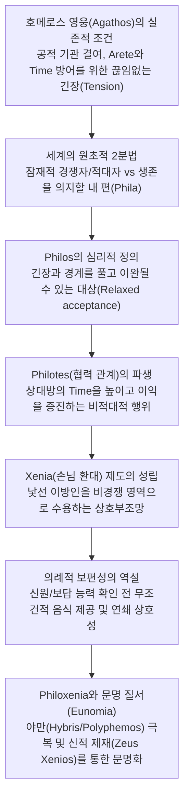

# 호메로스 저작에서의 필로스, 필로테스, 크세니아 (*Philos, Philotes and Xenia*)

> [!NOTE] 학술사적 의의 및 총평
> 메리 스콧(Mary Scott)의 1982년 논문 「필로스, 필로테스, 크세니아」(*Philos, Philotes and Xenia*, *Acta Classica* 25)는 호메로스 영웅 사회에서 **필로스(Philos)**, **필로테스(Philotes)**, **크세니아(Xenia)** 개념이 지닌 도덕심리학적·사회구조적 기능을 규명한 고전적 연구입니다. 스콧은 A. W. H. 애드킨스(A. W. H. Adkins 1963)의 선구적 연구를 확장하여, 필로스의 본질을 감상적 우정이 아닌 **'경쟁적 긴장으로부터 벗어나 이완될 수 있는 대상(That in the presence of which one is relaxed)'**으로 새롭게 정의했습니다. 나아가 호메로스 영웅들이 극단적 성공 중심의 아레테(Arete) 체계 속에서도 어떻게 손님 환대(Xenia)와 상호 협력 네트워크를 구축하고, 이를 통해 야만을 극복하고 문명적 법질서(Eunomia)의 기초를 놓았는지를 탁월하게 실증했습니다.

---

## 1. 서지 정보 및 지성사적 맥락

- **저자**: 메리 스콧 (Mary Scott) — 남아프리카공화국 비트바테르스란트 대학교(University of the Witwatersrand) 고전학 연구자, 고대 그리스 도덕 감정(*aidos*, *nemesis*, *philos*, *eleos*) 연구 권위자.
- **출판 정보**: *Acta Classica*, Vol. 25 (1982), pp. 1–19. (Classical Association of South Africa).
- **연구 방법론**:
  - 서사시 전편(일리아스 및 오뒷세이아)에 등장하는 형용사 *philos*, 명사 *philotes*, 동사 *philein*, 파생 복합어(*philoxenos*, *phileretmos*, *philophrosune*) 및 *xenos*, *xenia*, *xeneion*의 문맥별 전수 텍스트 분석.
  - 근대적 이타주의 범주(칸트적 의무론이나 기독교적 아가페)를 철저히 배제하고, 아르카익 그리스 영웅의 실존적 자기보존(*self-preservation*) 욕구와 사회심리적 긴장 완화 메커니즘에 기반한 기술적(Descriptive) 분석.
- **지성사적 대립 및 대화 구도**:
  - **A. W. H. 애드킨스 (Adkins 1960, 1963)**의 계승 및 확장: 애드킨스의 「호메로스와 아리스토텔레스에서의 우정과 자족성」(*Friendship and Self-Sufficiency in Homer and Aristotle*, 1963) 테제를 전폭적으로 수용하고 그 귀결을 서사시 텍스트 전반으로 확장 실증.
  - **브루노 스넬 (Bruno Snell 1946)**의 자아론 연계: 필로이(*philoi*)와 비(非)필로이(경쟁자) 간의 극단적으로 날카로운 외적 구획이 호메로스 인물들의 근대적 개인 자아 정체성(*sense of individuality*) 자각을 억제한 핵심 요인임을 규명.
  - **A. A. 롱 (A. A. Long 1970) 및 존 굴드 (John Gould 1973)**와의 대화: 탄원([[concept-hikesia|Hikesia]]) 및 손님 환대([[concept-xenia|Xenia]])가 결과 중심 영웅 규범 속에서 신적 제재(*Zeus Xenios, Zeus Hikesios*)를 통해 보완되는 메커니즘 확인.

---

## 2. 개념 비교 매트릭스 및 논증 계보도

### [Philos, Philotes, Xenia 3자 개념 비교 매트릭스]

| 분석 층위 | 필로스 (Philos, φίλος) | 필로테스 (Philotes, φιλότης) | 크세니아 (Xenia, ξενία) |
|:---|:---|:---|:---|
| **문법 범주** | 형용사 / 명사적 용법 (소유·속성) | 추상명사 (관계·상태) | 추상명사 (제도·규범) |
| **핵심 심리 메커니즘** | 경쟁과 경계의 긴장을 풀고 **내면에서 이완됨(Relaxation from tension)** | 적대 행위의 중단 및 **상호 협력·호의의 관계 상태** | 낯선 이방인을 비적대적 영역으로 수용하는 **환대 규범** |
| **적용 영역** | 신체 부위(*thumos, guia*), 소유물(*oikos*), 가족, 동료, 손님 | 우정, 전우애, 휴전 협정(*pista horkia*), 성적 결합 | 이방인 접대, 숙식 제공, 손님 선물(*xeneia*) 교환, 가문 간 동맹 |
| **도덕적/실리적 성격** | 자기보존을 위한 **소유적 애착(Possessive affection)** | 상호 이익을 증진하는 **비적대적 협력 행위** | **계발된 자기이익(Enlightened self-interest)**에 기초한 상호부조 |
| **티메(Timê)와의 관계** | *philon*을 보존하지 못하면 티메의 삭감 초래 | 누군가를 *philein*함은 곧 그에게 **티메를 부여함(*tiemen*)** | 손님 선물 교환을 통해 **양측의 티메를 물리적으로 증명** |
| **대립 개념** | *echthros* (적대자), *kaka* (해로운 계획) | *polemos* (전쟁), *neikos* (불화), *atimesis* (모욕) | *agrios* (야만), *hybris* (오만), *ou dikaios* (불의) |
| **신적 수호** | 신들의 총애(*Zeus philei*) | 신들을 건 맹세(*horkia*) | 제우스 크세니오스(*Zeus Xenios*), 에리뉘에스 |

### [Mermaid 논증 구조도]

---

## 3. 논문의 핵심 테제 및 섹션별 정밀 분석

### 제1절: 아가토스의 긴장과 필로스(Philos)의 정의 (pp. 1–3)
- **자율적 영웅과 적대적 세계**: 호메로스 사회에서 아가토스(*agathos*)는 법률이나 국가 조직의 보호 없이 오직 자신의 힘과 무력으로 지위와 소유물([[concept-time|Timê]])을 지켜야 함. 따라서 주변 세계는 본질적으로 무관심하거나 적대적인 경쟁자들로 가득 차 있음.
- **긴장의 상시성**: 영웅은 물리적 공격뿐만 아니라 사소한 무시나 모욕에도 즉각 대응해야 하므로 영구적인 경계와 긴장 상태(*permanent state of preparedness and tension*)에 갇혀 있음.
- **필로스의 정의**: 이러한 숨 막히는 긴장 속에서 영웅이 유일하게 경계를 풀고 안도할 수 있는 대상들이 바로 *phila*임. 스콧은 필로스를 **"그 앞에서는 긴장을 풀 수 있는 대상(That in the presence of which one is relaxed)"**으로 규정함.
- **적용 범위의 광범위성**: 필로스는 자신의 신체 부위(*philos thumos*, *phila guia*), 소유물(*philos oikos*), 가족(아내, 자식), 충직한 하인(유모), 동료 전우, 손님에게 무차별적으로 적용됨. 이는 '나의 생존을 의지할 수 있는 내 편'을 표시하는 객관적 범주임.

### 제2절: 필로이(Philoi)와 비(非)필로이의 객관적 2분법 및 자아 정체성 (pp. 3–6)
- **브루노 스넬(Snell)의 자아 정체성론과의 연계**: 호메로스 영웅에게 세계가 '필로이'와 '경쟁자'라는 날카로운 외적 2분법으로 분할되어 있었기 때문에, 고대 그리스인은 자신과 타자를 독립된 개별 인격으로 구분하는 근대적 자아의식(*sense of individuality*)을 발달시키기 어려웠음.
- **객관적 관계의 지속성**: 필로스의 관계는 주관적 감정이 아니라 객관적 신분과 상황에 의해 규정되므로, 배신이나 죽음의 순간에도 호칭이 기계적으로 유지됨.
  - 에리퓔레가 황금을 대가로 배신한 남편을 *philon andra*라 지칭하는 장면(_Od._ 11.326–327).
  - 아킬레우스가 자신에게 탄원하는 적군 포로 뤼카온을 처형 직전 "친구여(*philos*), 그대 또한 죽어야 한다"고 부르는 장면(_Il._ 21.106).
- **자연스러운 경향과 이완(*Philon kai hedu*)**: 필로스는 '자신의 본성에 맞아 힘들이지 않고 자연스럽게 행할 수 있는 행위'를 뜻하기도 함.
  - 디오메데스를 꾸짖는 아가멤논: "뒤로 물러서는 것은 네 아버지 튀데우스에게 결코 *philon*이 아니었다"(_Il._ 4.371–373).
  - 나우시카아와 에우마이오스: "이방인에게 주는 것은 작은 비용이며 자연스러운 기쁨(*phile*)이다"(_Od._ 6.208, 14.58).
- **생각의 대립 (*Phila phronein* vs *Kaka phronein*)**: 타인에게 호의적인 계획을 세우는 것은 *phila phronein*이며, 타인의 파멸을 획책하는 것은 *kaka phronein*임.

### 제3절: 크세니아(Xenia)와 손님 환대의 의례적 보편성 (pp. 6–9)
- **계발된 자기이익(Enlightened Self-interest)**: 영웅이 다른 지역을 여행하거나 재난을 당했을 때 생존하기 위해서는 낯선 땅에 비적대적 조력자 네트워크가 필수적임. 따라서 자신이 먼저 이방인을 환대하여 미래의 안전을 확보함.
- **의례적 보편성의 역설**: 크세니아가 실리적 동기에서 출발했음에도 불구하고, 실제 환대 의례는 극도로 비이기적인 외형을 띰.
  - **신원 확인 전 접대**: 호메로스 사회의 주인은 손님이 누구인지, 환대를 갚을 능력이 있는지 묻기 전에 **반드시 먼저 식사와 목욕, 잠자리를 제공함**.
  - 텔레마코스와 아테네-멘테스(_Od._ 1.158), 네스토르의 손님맞이(_Od._ 3.71–74: "손님들이여, 당신들은 장사꾼입니까, 아니면 남에게 재앙을 주는 해적입니까?"라고 묻기 전에 음식을 대접함).
- **연쇄 상호성(Chain Reaction)**: 환대의 빚은 반드시 베풀어준 원주인에게 1:1로 직접 갚지 않고, 다른 떠돌이 이방인에게 환대를 베풂으로써 사회 전체의 상호부조 고리를 유지함 (메넬라오스의 발언, _Od._ 4.33–34).

### 제4절: 손님 선물(Xeneia)과 상호성의 한계 (pp. 8–9)
- **티메(Timê)의 물적 증명**: 손님에게 주는 선물(*xeneia*)은 주인의 부와 권력을 증명하여 주인의 티메를 높이고, 선물을 받는 손님의 티메 또한 증대시킴 (_Od._ 10.38–41).
- **글라우코스와 디오메데스의 무구 교환 (_Il._ 6.234–236)**:
  - 전장에서 가문 간 크세니아 관계를 확인한 디오메데스와 글라우코스는 전투를 중단하고 무구를 교환함.
  - 호메로스는 글라우코스가 황금 무구(황소 100마리 값)를 디오메데스의 청동 무구(황소 9마리 값)와 바꾼 것을 두고 "제우스가 그의 넋(*phrenas*)을 빼앗았다"고 비판함. 크세니아의 우정 속에서도 일방적인 불균등 교환은 자신의 티메를 스스로 깎아먹는 어리석음으로 간주됨.
- **필로스와 크세노스의 차등**: 모든 손님은 크세노스(*xenos*)이지만, 오직 환대를 갚을 물질적 능력을 갖춘 동등한 계층의 인물만이 진정한 필로스(*philos*)로 불릴 수 있음. 거지나 가난한 자는 환대의 수혜자(*phileisthai*)는 될 수 있어도 상대를 *philein*할 수 없으므로 동등한 필로스가 되지 못함.

### 제5절: 필로테스(Philotes)와 티메(Timê, 명예)의 직접적 등가성 (pp. 9–13)
- **Philein = Tiemen**: 누군가를 친절히 대접하고 아끼는 것(*philein*)은 곧 그에게 명예를 부여하는 것(*tiemen*)과 완전히 동의어임. 반대로 대접을 거부하거나 홀대하는 것은 모욕(*atimazein*)임.
- **사절단의 아킬레우스 설득 (_Il._ 9)**:
  - 아이아스의 항의: "아킬레우스는 우리가 배 곁에서 그를 남달리 높여주었던(*etiomen*) 전우들의 필로테스(*philotes*)를 무시하고 있다"(_Il._ 9.630–631).
  - 오디세우스의 조언: 호의를 베푸는 마음(*philophrosune*)이 더 유익(*ameinon*)한 이유는 그것이 아르고스인들로부터 더 큰 티메를 가져다주기 때문임(_Il._ 9.256–258).
- **아킬레우스의 포이닉스 거절 (_Il._ 9.612–614)**:
  - "나의 원수인 아가멤논을 *philein*하지 마시오. 그를 편들면 나를 사랑하는(*philo*) 당신 또한 나의 원수(*echthros*)가 될 것이오." 필로이의 경계는 절대적이어서 중립이나 양다리가 허용되지 않음.
- **부모와 자식의 양육비 채무 (*Threptra*)**: 부모가 자식을 먹이고 기르는 것(*trephein*)은 자식에게 물질적 빚을 지우는 행위이며, 자식은 장성하여 부모를 공경하고 대접함으로써(*tiemen*) 양육비(*threptra*, _Il._ 4.478)를 상환해야 함.
- **신들의 필로테스**: 제우스가 왕을 *philei*한다는 것은 왕에게 승리와 영광, 막대한 부를 내려주어 그의 티메를 높여줌을 뜻함(_Il._ 9.116–118, 9.196–197).

### 제6절: 필록세니아(Philoxenia)와 문명적 법질서(에우노미아, Eunomia)의 태동 (pp. 13–15)
- **문명과 야만의 척도**: 『오뒷세이아』에서 미지의 땅에 도착한 오디세우스의 첫 번째 질문은 언제나 거주민들이 **'난폭하고 정의가 없는 야만인(*hybristes, agrios, ou dikaios*)'인가, 아니면 '이방인을 환대하고 신을 두려워하는 문명인(*philoxenos, theoudes*)'인가**임(_Od._ 6.119–121, 9.175–176).
- **폴리페모스의 야만성**: 퀴클롭스 폴리페모스가 야만의 극치로 규탄받는 이유는 식인 풍습 이전에 제우스 크세니오스를 모욕하고 손님 환대 규범을 거부했기 때문임.
- **구혼자들의 신적 공포와 네메시스 (_Od._ 17.483–487)**:
  - 안티노오스가 거지로 변장한 오디세우스를 의자로 내리쳤을 때, 동료 구혼자들은 네메시스를 느끼며 안티노오스를 준엄하게 꾸짖음.
  - "신들은 온갖 나그네의 모습으로 변장하여 인간들의 오만(*hybris*)과 질서(*eunomia*)를 감시한다."
  - 이 장면은 가장 타락한 구혼자들조차 크세니아 위반에 대한 종교적 공포를 공유하고 있었으며, 필록세니아가 사회 전체의 합법적 질서(**에우노미아, *Eunomia***)를 지탱하는 핵심 보루였음을 증명함.

### 제7절: 휴전(Truce)과 남녀 관계에서의 필로테스 (pp. 15–17)
- **휴전 협정으로서의 필로테스**: 전쟁 중 적대 행위를 일시적으로 멈추는 휴전 조약 또한 *philotes*라 불림(_Il._ 3.73, 4.82–84). 이는 필로테스가 감정적 친밀함이 아니라 '적대 행위의 부재 및 상호 비침해 상태'를 뜻함을 입증함.
- **굳은 맹세(*Pista horkia*)의 전제조건**: 아킬레우스는 헥토르와의 단독 결투 전 휴전과 시신 반환 맹세를 거부하며, "사자와 인간 사이에 굳은 맹세가 없듯, 늑대와 어린 양이 한마음이 될 수 없듯, 너와 나 사이에는 *philein*도 맹세도 있을 수 없다"고 선언함(_Il._ 22.262–267).
- **남녀 관계와 여성의 티메**:
  - *philein*은 남녀 간의 애정과 성적 결합, 그리고 아내나 첩을 부양하고 보호하는 행위 전체를 포괄함.
  - 아가멤논에게 브리세이스를 빼앗긴 아킬레우스의 절규: "아트레우스의 아들들만이 자기 아내를 *philousi*하는가? 분별 있는 영웅이라면 누구나 자신의 여인을 사랑하고 돌보는 법(*phileei kai kedetai*)"(_Il._ 9.340–343).
  - 포이닉스의 아버지가 첩을 총애하여 어머니를 모욕(*atimazein*)한 사건(_Il._ 9.449–451)에서 보듯, 여성을 *philein*하지 않고 방치하는 것은 그녀의 티메를 박탈하는 사회적 폭력임.

---

## 4. 문헌학적 어휘 사전 및 희랍어 개념 주해

| 희랍어 어휘 | 원어 표기 | 문헌학적 정의 및 스콧의 재해석 | 서사시 주요 용례 |
|:---|:---|:---|:---|
| **Philos** | φίλος | 경쟁의 긴장으로부터 벗어나 편안히 안도할 수 있는 대상(신체, 소유물, 가족, 동료). | _Il._ 4.371, 18.114, _Od._ 6.208 |
| **Philotes** | φιλότης | 비적대적 협력 관계, 우정, 동맹, 휴전 협정(*pista horkia*), 부부/성적 결합. | _Il._ 3.73, 9.630, _Od._ 15.55 |
| **Philein / Phileein** | φιλέω / φιλέειν | 상대를 긴장 없이 친절히 대우하다, 손님을 환대하다, 상대의 명예([[concept-time\|Timê]])를 높여주다. | _Il._ 6.15, 9.342, _Od._ 14.57 |
| **Xenos / Xeneios** | ξένος / ξένειος | 낯선 이방인, 손님, 환대를 베푸는 주인(Host & Guest 양방향 포괄). | _Il._ 6.224, _Od._ 1.158, 8.546 |
| **Xenia** | ξενία | 손님 환대 제도, 가문 간 대물림되는 상호 안전 보장 및 동맹 의례. | _Il._ 6.215, _Od._ 9.268 |
| **Xeneion / Xeneia** | ξένιον / ξένια | 주인이 손님에게 작별 시 증정하는 귀중한 손님 선물(티메의 물적 징표). | _Il._ 6.230, _Od._ 9.268, 10.40 |
| **Philoxenos** | φιλόξενος | 이방인을 기꺼이 환대하는 문명적 성품. *theoudes*(신을 두려워함)와 동의어. | _Od._ 6.121, 9.176, 19.109 |
| **Phileretmos** | φιλήρετμος | 노 젓기를 사랑하는 성향(파이아케스인의 선천적 해양 기질). | _Od._ 7.39, 8.386 |
| **Philophrosune** | φιλοφροσύνη | 친절하고 화해를 도모하는 마음가짐(*Il._ 9.256에서 티메 증대의 수단). | _Il._ 9.256 |
| **Eunomia** | εὐνομία | 법과 관습이 잘 지켜지는 문명화된 사회적 좋은 질서. | _Od._ 17.487 |
| **Threptra** | θρέπτρα | 부모가 자식을 양육하는 데 들인 비용(자식이 갚아야 할 도덕적·물적 채무). | _Il._ 4.478, 17.301 |
| **Kedesthai** | κήδεσθαι | 타인의 안녕과 보호를 위해 마음을 쓰고 노고를 감당하다. | _Il._ 9.342, 1.209 |

---

## 5. 핵심 원문 인용 및 심층 주석

### 1) 손님 환대와 보편적 인간성 의례
- **원문 (_Od._ 8.546–547)**:
  ἀντὶ κασιγνήτου ξεῖνός θ᾽ ἱκέτης τε τέτυκται / ἀνέρι, ὅς τ᾽ ὀλίγον περ ἐπιψαύῃ πραπίδεσσιν.

- **번역**: "지각이 조금이라도 있는 사람에게는 손님(*xenos*)과 탄원자(*hiketes*)가 형제의 자리에 있는 법이오."

- **스콧의 심층 주해**: 알키노오스 왕의 이 선언은 혈연적 보호망이 없는 이방인을 가족과 동등한 비경쟁적 협력 영역(*philos*) 내부로 수용하는 크세니아 제도의 궁극적 지향점을 명쾌하게 보여줍니다. 이방인은 경쟁자가 아니라 영웅이 보호하고 품어야 할 형제가 됩니다.

### 2) 신원 확인 이전의 무조건적 음식 제공
- **원문 (_Od._ 3.71–74)**:
  ὦ ξεῖνοι, τίνες ἐστέ; πόθεν πλεῖθ᾽ ὑγρὰ κέλευθα; / ἤ τι κατὰ πρῆξιν ἦ μαψιδίως ἀλάλησθε, / οἷά τε ληϊστῆρες, ὑπεὶρ ἅλα, τοί τ᾽ ἀλόωνται / ψυχὰς παρθέμενοι, κακὸν ἀλλοδαποῖσι φέροντες;

- **번역**: "이방인들이여, 당신들은 누구시오? 어디서부터 물길을 헤쳐 왔소? 무슨 장사 일 때문이오, 아니면 목숨을 내걸고 남들에게 해악(*kakon*)을 끼치며 바다 위를 떠도는 해적들처럼 정처 없이 헤매는 것이오?"

- **스콧의 심층 주해**: 네스토르는 손님들이 자신을 약탈하러 온 해적일 가능성을 명시적으로 인지하면서도, 그들에게 먼저 융숭한 고기와 포도주를 대접한 뒤에야 비로소 신원을 묻습니다. 이는 크세니아가 단순한 계산적 거래를 넘어 신성한 의례적 무차별성을 띠고 있음을 증명합니다.

### 3) 필로테스와 티메의 직접적 등가성
- **원문 (_Il._ 9.630–631)**:
  οὐδέ τι τῆς φιλότητος μετατρέπεται ἑταίρων / τῆς ᾗ μιν παρὰ νηυσὶν ἐτίομεν ἔξοχον ἄλλων.

- **번역**: "그는 배 곁에서 우리가 다른 모든 이들보다 그를 남달리 높여주었던(*etiomen*) 전우들의 필로테스(*philotes*)에는 전혀 마음을 쓰지 않는구나."

- **스콧의 심층 주해**: 대(大)아이아스는 아킬레우스가 동료들의 간청을 거절하는 행위를 규탄하며, 전우애(*philotes*)가 곧 그에게 최고의 명예(*time*)를 바친 행위였음을 상기시킵니다. 호메로스 사회에서 상대를 필로스로 대우하는 것은 그의 사회적 가치와 존엄을 공인해 주는 실질적 보상입니다.

### 4) 신들의 변장과 에우노미아 감시
- **원문 (_Od._ 17.485–487)**:
  καί τε θεοὶ ξείνοισιν ἐοικότες ἀλλοδαποῖσι, / παντοῖοι τελέθοντες, ἐπιστρωφῶσι πόληας, / ἀνθρώπων ὕβριν τε καὶ εὐνομίην ἐφορῶντες.

- **번역**: "신들께서도 이역의 낯선 나그네 모습으로 온갖 형상을 취하신 채, 인간들의 오만(*hybris*)과 훌륭한 법질서(*eunomia*)를 굽어살피러 도시들을 두루 찾아다니시는 법이오."

- **스콧의 심층 주해**: 안티노오스의 거지 폭행을 본 구혼자들의 이 경고는, 이방인 환대가 세속적 이해타산을 넘어 최고신들의 신성한 감시 아래 놓여 있음을 보여줍니다. 크세니아는 영웅들의 자의적 폭력을 억제하고 문명적 사회 질서(*eunomia*)를 지키는 종교적 마지노선입니다.

---

## 6. 서사시 전편 에피소드 정밀 매핑 테이블

| 작품 및 권·행 | 등장인물 및 상황 | Philos / Philotes / Xenia 작동 양상 | 스콧(1982)의 분석적 함의 |
|:---|:---|:---|:---|
| **_Il._ 3.73, 4.82–84** | 트로이와 아카이아의 휴전 | 휴전 조약 체결을 *philotes*와 *pista horkia*로 표현 | 필로테스가 감정적 친밀함이 아닌 '적대 행위의 중단'임을 실증 |
| **_Il._ 4.371–373** | 디오메데스를 꾸짖는 아가멤논 | "뒤로 물러서는 것은 튀데우스에게 *philon*이 아니었다" | *philon*이 본성에 부합하는 자연스러운 행위를 의미함을 규명 |
| **_Il._ 4.478** | 시모에이시오스의 전사 | 부모에게 양육비(*threptra*)를 갚지 못하고 죽음 | 부모-자식 관계가 일방적 애정이 아닌 상호 부양 채무 체계임을 실증 |
| **_Il._ 6.14–15** | 악실로스의 죽음 | 길가에 살며 모든 나그네를 환대하여(*phileein*) 필로스가 됨 | 환대를 베푸는 행위 자체가 세간의 존경과 필로스 지위를 획득함 |
| **_Il._ 6.215–236** | 글라우코스와 디오메데스 | 조부들의 크세니아를 확인하고 전투 중단 및 무구 교환 | 크세니아의 군사적 우위 및 불균등 무구 교환에 대한 비판적 평가 |
| **_Il._ 9.116–118** | 아킬레우스를 평하는 아가멤논 | 제우스가 마음으로 *philesei*하는 자는 수많은 군대와 맞먹음 | 신의 필로테스가 영웅에게 막대한 티메와 실질적 무력을 부여함 |
| **_Il._ 9.256–258** | 아킬레우스를 설득하는 오디세우스 | 화해의 친절(*philophrosune*)이 더 큰 티메를 가져옴 | 협력적 태도가 개인의 영웅적 명예를 증대시키는 수단임을 강조 |
| **_Il._ 9.340–343** | 브리세이스를 빼앗긴 아킬레우스 | 분별 있는 자는 누구나 자기 여인을 *phileei*하고 돌봄 | 아내/첩/전리품 여성을 보호하는 의무와 남성의 티메 직결 |
| **_Il._ 9.449–451** | 포이닉스 부모의 갈등 | 아버지가 첩을 *phile* 대접하여 어머니를 *atimesen*함 | 필로스의 배타성과 대접받지 못한 자의 티메 박탈 메커니즘 |
| **_Il._ 9.612–614** | 포이닉스를 제지하는 아킬레우스 | "아가멤논을 *philein*하여 나의 원수(*echthros*)가 되지 말라" | 필로이의 엄격한 2분법: 적을 돕는 자는 아군의 적대자가 됨 |
| **_Il._ 9.630–631** | 아이아스의 마지막 호소 | "우리가 그를 남달리 높여주었던(*etiomen*) 필로테스를 무시함" | 전우애의 본질이 공동체적 명예 증여(*tiemen*)에 있음을 확인 |
| **_Il._ 18.114–115** | 파트로클로스를 애도하는 아킬레우스 | 죽은 파트로클로스를 *phile kephale*(소중한 머리)라 칭함 | 신체 부위 표현이 동료에게 확장되어 소유적 애착을 표현함 |
| **_Il._ 21.106** | 뤼카온을 처형하는 아킬레우스 | 적군 포로를 처형하면서 "친구여(*philos*), 그대도 죽으라" | 상황이 역전되어도 객관적 관계 어휘가 관습적으로 잔존함 |
| **_Il._ 22.262–267** | 헥토르의 제안을 거절하는 아킬레우스 | 사자와 인간, 늑대와 양 사이에 맹세와 *philein*이 불가능함 | 공동의 이익(*phila*)이 없는 원수 간에는 협력 규범이 성립 불가함 |
| **_Od._ 1.158, 307–308** | 멘테스를 맞이하는 텔레마코스 | 식사 후 "아버지처럼 *phila*를 생각하며 조언해 주셨다" 화답 | 신원 확인 전 접대 및 유익한 조언(*phila phronein*)의 본질 |
| **_Od._ 3.71–74** | 손님을 맞는 네스토르 | 해적인지 묻기 전에 고기와 술을 먼저 대접함 | 크세니아 의례의 절대적 우선성과 보편적 환대 실천 |
| **_Od._ 4.33–34** | 피에 지친 나그네를 맞는 메넬라오스 | 자신도 남들의 환대를 먹고 살았으니 빚을 갚아야 함 | 환대 의무의 '연쇄 상호성(Chain reaction)' 원리 실증 |
| **_Od._ 6.119–121** | 파이아케스 땅의 오디세우스 | 야만인(*hybristai*)인가 이방인을 환대하는 자(*philoxenoi*)인가 | 문명과 야만을 가르는 절대적 분기점으로서의 필록세니아 |
| **_Od._ 6.208, 14.58** | 나우시카아와 에우마이오스 | "이방인에게 베푸는 것은 작은 것이며 자연스러운 기쁨(*phile*)" | 환대가 영웅적 긴장을 유발하지 않는 자연스러운 덕목임을 증명 |
| **_Od._ 8.208–211** | 파이아케스 경기에서의 오디세우스 | 자신을 대접해 준 주인 라오다마스와는 겨루기를 거부함 | 자신을 *philei*해 준 주인과 경쟁하여 그의 티메를 깎지 않음 |
| **_Od._ 8.546–547** | 알키노오스의 환대 선언 | "손님과 탄원자는 형제의 자리에 있다" | 이방인을 혈연적 필로스의 영역으로 편입시키는 제도의 정점 |
| **_Od._ 9.268–271** | 폴리페모스에게 선물을 청하는 오디세우스 | 손님 선물(*xeneion*)을 요구하며 제우스 크세니오스 경고 | 괴물의 크세니아 거부로 드러나는 극단적 야만성과 무법성 |
| **_Od._ 10.38–41** | 부하들의 질투 | 오디세우스가 이역만리에서 많은 선물을 받아 필로스가 됨 | 손님 선물이 영웅의 티메와 부를 증명하는 물리적 수단임 |
| **_Od._ 11.326–327** | 저승에서 본 에리퓔레 | 황금을 받고 *philon andra*(남편) 암피아라오스를 팔아넘김 | 배반 후에도 *philos* 호칭이 객관적 관계로서 잔존함 |
| **_Od._ 11.356–361** | 파이아케스 체류를 반기는 오디세우스 | 선물을 가득 싣고 귀향해야 사람들에게 더 *philos*가 됨 | 부와 선물이 사람들의 호의와 존경(*aidoios*)을 결정함을 실증 |
| **_Od._ 14.56–59** | 거지에게 음식을 주는 에우마이오스 | "손님을 모욕(*atimesai*)하는 것은 내 법도가 아니다" | 환대 거부가 모욕(*atimazein*)이며 제우스의 뜻을 어김임을 확인 |
| **_Od._ 17.483–487** | 안티노오스를 꾸짖는 구혼자들 | 신들이 나그네로 변장하여 인간의 오만과 에우노미아를 감시함 | 필록세니아가 문명적 사회 질서(*eunomia*)의 궁극적 수호벽임 |

---

## 7. 학술 논쟁사 및 비판적 공방

### 1) 애드킨스(Adkins 1963) vs 스콧(Scott 1982): 자기보존에서 사회 질서로의 도약
- **애드킨스의 한계**: 애드킨스는 필로스를 '철저히 자기보존을 위한 도구적 소유'로 파악하여, 그리스 영웅 사회가 근본적으로 파편화된 이기주의에 갇혀 있었다고 결론지음.
- **스콧의 심층화**: 스콧은 애드킨스의 '긴장 완화'와 '자기보존' 테제를 수용하면서도, **크세니아의 의례적 보편성(신원 확인 전 접대, 연쇄 상호성)**과 **구혼자들의 신적 감시 공포(*Od._ 17)**를 분석하여, 계발된 자기이익이 실제로 아르카익 그리스의 문명적 법질서(**에우노미아, *Eunomia***)를 낳는 진화적 교량 역할을 했음을 밝혀냄.

### 2) 브루노 스넬(Snell 1946) vs 스콧(Scott 1982): 자아 미분화의 사회적 기원
- **스넬의 신체론**: 스넬은 호메로스 언어에 단일한 '영혼(Soul)'이나 '육체(Body)'를 지칭하는 통합적 어휘가 없음을 들어 자아의식의 결여를 논증함.
- **스콧의 사회심리학적 설명**: 스콧은 언어학적 결여뿐만 아니라, **'필로이(나의 것)'와 '비필로이(경쟁자)' 간의 지나치게 날카로운 외적 2분법**이 개인을 독립된 자아로 인식하는 것을 방해하고 공동체적 집단 정체성에 묶어두었다는 사회관계적 설명을 추가함.

### 3) A. A. 롱(Long 1970) vs 스콧(Scott 1982): 적절성의 기준과 상호성
- **롱의 적절성 모델**: 롱은 호메로스 사회가 경쟁 속에서도 '상황에 부합하는 적절함(*appropriateness*)'의 규범을 가졌다고 봄.
- **스콧의 보완**: 스콧은 글라우코스와 디오메데스의 무구 교환 분석을 통해, 우정과 크세니아의 영역에서도 **'티메의 균형과 동등한 상호성'**이라는 엄격한 척도가 작동하고 있었음을 증명하여 롱의 논의를 구체화함.

---

## 8. 연구 질문 및 세미나 토론 쟁점

1. **필로스의 정서성과 도구주의**: 필로스가 '긴장을 풀 수 있는 대상'이라면, 호메로스 영웅에게 가족과 전우에 대한 사랑은 순수한 공리주의적 도구성에 불과한가, 아니면 심리적 안도감 자체가 깊은 정서적 유대를 형성하는가?
2. **크세니아와 신적 처벌의 한계**: 오디세우스의 집을 침탈한 구혼자들은 크세니아를 조직적으로 파괴하면서도 3년 넘게 처벌받지 않았다. 신들의 크세니아 감시는 물리적 무력(오디세우스의 활)이 뒷받침되기 전까지 실질적인 제재력을 행사하지 못하는가?
3. **일리아스에서 오뒷세이아로의 질서 이행**: 『일리아스』의 파괴적 전장 윤리에서 『오뒷세이아』의 필록세니아 중심 문명관으로의 이동은 호메로스 서사시가 단순한 전쟁 문학을 넘어 폴리스 문명의 윤리적 초석을 다지는 과정이었음을 시사하는가?

---

## 관련 항목

- **소스 문서**:
  - [[adkins-1960-merit-and-responsibility]] (애드킨스의 공적과 책임)
  - [[scott-1980-aidos-and-nemesis]] (스콧의 아이도스와 네메시스)
  - [[long-1970-morals-and-values]] (롱의 호메로스 도덕과 가치)
  - [[snell-1946-discovery-of-mind]] (스넬의 정신의 발견)
  - [[lee-junseok-2016-odyssey-humanity]] (이준석의 호메로스의 휴머니티: 구혼자 살육과 테미스)
  - [[lee-junseok-2018-wrath-and-pity]] (이준석의 분노와 연민의 서사시)
- **개념 문서**:
  - [[concept-xenia|Xenia]] (손님 환대와 크세노스 상호부조 규범)
  - [[concept-time|Timê]] (명예와 물질적 가치)
  - [[concept-arete|Arete]] (탁월성과 성공 규범)
  - [[concept-aidos|Aidos]] (수치심과 경외)
  - [[concept-nemesis|Nemesis]] (분배의 정의와 공적 의분)
  - [[concept-hikesia|Hikesia]] (신성한 탄원 의례)
  - [[concept-themis|Themis]] (관습적 정의와 환대의 법도)
  - [[concept-dike|Dike]] (우주적 질서와 정의)
- **분석 문서**:
  - [[analysis-homeric-ethics-literature-review]] (호메로스 서사시 윤리학 연구사 종합 분석)
