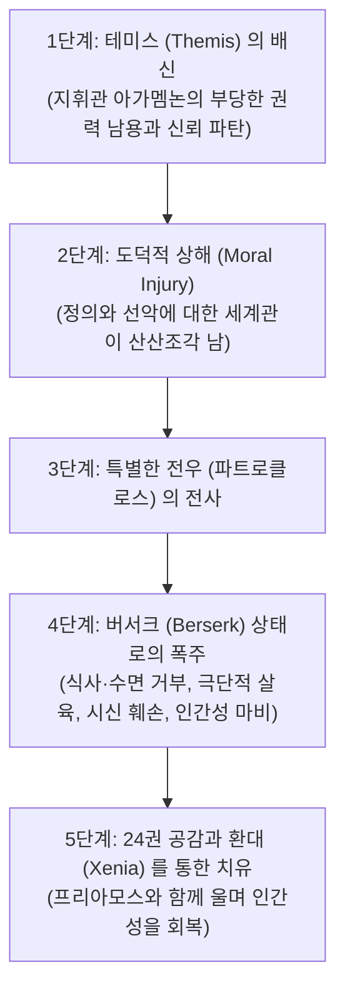

# 베트남의 아킬레우스 (*Achilles in Vietnam: Combat Trauma and the Undoing of Character*)

> [!NOTE] 학술사적 의의 및 총평
> 정신과의사이자 고전학자인 조너선 셰이의 『베트남의 아킬레우스』(1994)는 고대 서사시 텍스트와 현대 임상의학을 결합한 20세기 후반 서양 지성사의 획기적인 역작입니다. 베트남 참전 군인들의 심리 치료 임상 데이터와 『일리아스』를 1:1로 정밀 대조하여, **'도덕적 상해(Moral Injury)'**라는 혁신적 윤리-정신의학 개념을 창안했습니다. 전쟁터에서 인간성이 붕괴되는 5단계 메커니즘과, 파괴된 인격이 공동체적 애도와 환대(Xenia)를 통해 치유되는 과정을 밝혀냈습니다.

---

## 1. 서지 정보 및 학술사적 맥락

- **저자**: 조너선 셰이 (Jonathan Shay, M.D., Ph.D.) — 보스턴 보훈병원 정신과의사, 하버드 의과대학 임상교수, 맥아더 천재 펠로우(MacArthur Fellow).
- **출판 정보**: Scribner: New York (1994, 246쪽).
- **연구 방법론**:
  - 수백 명의 중증 전투 트라우마(PTSD) 베트남 참전 용사들과의 심층 임상 인터뷰.
  - 호메로스 『일리아스』 그리스어 원전의 심리적·군사적 세부 묘사에 대한 문헌학적 교차 검증.
- **핵심 문제의식**:
  - "왜 최정예 군인들은 전쟁터에서 이성을 잃고 광폭화(Berserk)하는가?"
  - "전투 트라우마의 근본 원인은 단순한 죽음의 공포인가, 아니면 도덕적 신뢰의 배신인가?"

---

## 2. 개념 전복 매트릭스 및 논증 계보도

### [전통적 PTSD 모델 vs 조너선 셰이의 '도덕적 상해' 모델]

| 비교 범주 | 전통적 외상후 스트레스 장애 (PTSD) 모델 | 조너선 셰이의 '도덕적 상해 (Moral Injury)' 모델 |
|:---|:---|:---|
| **발병의 핵심 원인** | 죽음의 공포와 생명 위협에 대한 본능적 공포 | **정당한 권위자에 의한 '테미스([[concept-themis|Themis]], 옳은 규칙)'의 배신** |
| **인격적 파괴 수준** | 신체적 신경계의 과민 반응 및 불안 장애 | **선악 체계의 붕괴, 자존감 상실, 인격의 해체(Undoing of Character)** |
| **광폭화 메커니즘** | 통제 불능의 분노 폭발 | **소중한 전우의 전사 이후 나타나는 '버서크(Berserk)' 상태** |
| **치유의 해법** | 개인적 약물 치료 및 인지행동치료 | **공동체적 슬픔의 공유, 공적 애도, 인간적 환대([[concept-xenia|Xenia]])의 회복** |

### [Mermaid 논증 구조도: 도덕적 상해의 5단계 연쇄]

---

## 3. 전 챕터별 정밀 독해 및 논증 단계

### 제1부: 테미스의 배신과 분노 (*Betrayal of 'What's Right'*)
- **테미스([[concept-themis|Themis]])의 붕괴**:
  - 군인이 목숨을 걸고 싸울 수 있는 유일한 전제는 지휘관이 공정하고 신성한 규칙(Themis)을 지킨다는 신뢰입니다.
  - 아가멤논이 자신의 지위를 남용하여 아킬레우스의 전리품 브리세이스를 강탈했을 때, 아킬레우스는 단순한 소유권 상실이 아니라 세계의 도덕적 질서 전체가 무너지는 '도덕적 상해'를 입었습니다.

### 제2부: 전우애의 상실과 버서크 상태 (*The Death of the Special Comrade and the Berserk State*)
- **버서크(Berserk, 광폭화)의 임상적 징후**:
  - 형제보다 소중한 전우 파트로클로스가 전사했을 때, 아킬레우스는 현대 군인들이 겪는 버서크 상태로 돌입합니다.
  - 특징: 신체적 고통에 대한 완전한 무감각, 식사와 수면의 거부, 적에 대한 자비 없는 학살, 강물(스카만드로스)을 시체로 메우는 맹목적 파괴욕, 적장의 시신(헥토르)을 전차에 묶어 끄는 잔혹성.

### 제3부: 인격의 회복과 치유 (*Restoration and Healing*)
- **24권 화해의 정신의학적 의미**:
  - 아킬레우스의 광기는 그 어떤 군사적 승리나 처벌로도 치유되지 않았습니다.
  - 적국의 늙은 왕 프리아모스가 목숨을 걸고 찾아와 자신의 손에 입을 맞추었을 때, 아킬레우스는 자신의 늙은 아버지를 떠올리며 프리아모스와 함께 통곡합니다.
  - 이 **공동체적 눈물(Communal Grief)**과 적을 손님으로 대접하는 **환대([[concept-xenia|Xenia]])**를 통해 비로소 닫혔던 인간성이 열리고 트라우마의 늪에서 벗어납니다.

---

## 4. 핵심 원문 인용 및 심층 주석

### 인용 1: 도덕적 상해의 본질
- *"Moral injury is an essential part of combat trauma. It begins with the betrayal of what's right (themis) by someone who holds legitimate authority in a high-stakes situation. When themis is betrayed, the social and moral world of the soldier collapses."* (Chapter 1, p. 6)
- **[주석]**: 현대 군사 윤리학과 PTSD 치료의 패러다임을 바꾼 역사적 정의.

### 인용 2: 버서크 상태의 파괴성
- *"In the berserk state, the warrior loses all fear, all restraint, and all connection to human culture. He feels like a god or a beast, and his capacity for social life is destroyed."* (Chapter 5, p. 98)
- **[주석]**: 아킬레우스가 파트로클로스 사후 보여준 비인간적 폭력의 임상적 실체를 규명함.

---

## 5. 서사시 전편 정밀 에피소드 매핑 테이블

| 서사시 권·행 번호 | 다루는 사건 및 인물 | 셰이의 정신의학·윤리학적 해석 |
|:---|:---|:---|
| ***Il.* 1.121–187** | **아가멤논의 전리품 강탈** | 리더의 부당한 권력 남용으로 인한 테미스의 배신. 아킬레우스에게 치유 불가능한 도덕적 상해를 입힘. |
| ***Il.* 18.22–35** | **파트로클로스 전사 소식과 절망** | 아킬레우스가 흙을 머리에 뿌리며 땅바닥에 쓰러지는 장면은 극심한 상실감으로 인한 인격 붕괴의 시작. |
| ***Il.* 21.1–135** | **스카만드로스 강의 학살** | 탄원하는 어린 왕자 뤼카온을 무참히 살해하는 장면은 도덕적 억제력([[concept-aidos|Aidos]])이 마비된 버서크 상태의 극치. |
| ***Il.* 22.395–404** | **헥토르 시신 훼손** | 전차 뒤에 시신을 매달고 달리는 행위는 전쟁의 야수화가 낳은 극한의 도덕적 파탄. |
| ***Il.* 24.507–512** | **프리아모스와 아킬레우스의 애도** | 적장과 마주 앉아 함께 울며 식사를 나누는 행위는 애도(Grief)를 통해 도덕적 상해를 치유하는 서양 문학사 최고의 치유 모델. |

---

## ## 관련 항목

- [[homeric-ethics-literature-review]]
- [[concept-themis|Themis]]
- [[concept-menis|Menis]]
- [[concept-ate|Ate]]
- [[concept-xenia|Xenia]]
- [[concept-aidos|Aidos]]
- [[일리아스]]
- [[entity-achilles|아킬레우스]]
- [[redfield-1975-nature-and-culture]]
- [[zanker-1994-heart-of-achilles]]
