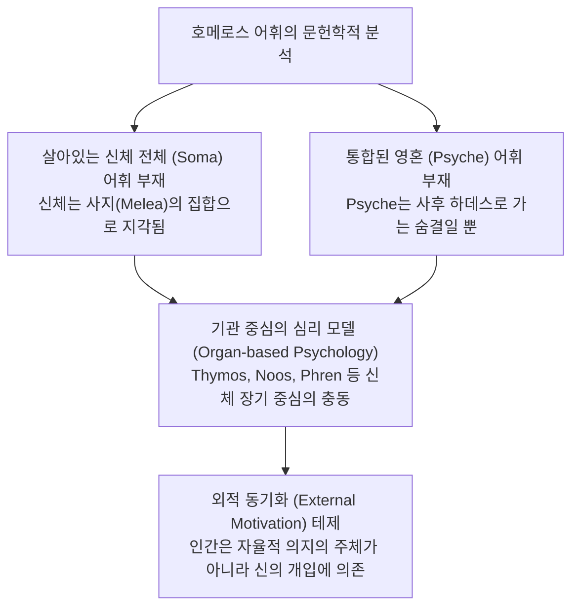

# 정신의 발견 (*Die Entdeckung des Geistes: Studien zur Entstehung des europäischen Denkens bei den Griechen*)

> [!NOTE] 학술사적 의의 및 총평
> 독일 고전문헌학자 브루노 스넬의 대표작 『정신의 발견』(1946)은 유럽적 '정신(Geist)'과 '자아' 개념의 형성을 언어학적으로 추적한 20세기 정신사(Geistesgeschichte)의 고전입니다. 호메로스 그리스어 어휘에 **'살아있는 육체 전체(Soma)'나 '비물질적 의식(Psyche)'을 지칭하는 통합적 어휘가 없었다는 사실**에 착안하여, 호메로스 시대 인간에게는 통일된 자아나 자유의지가 없었으며 신체 기관(Thymos, Phren, Noos)의 부분적 충동과 신적 개입에 의해 동기화되었다는 **'정신 발전론(Evolutionary view of mind)'**을 제창했습니다.

---

## 1. 서지 정보 및 학술사적 맥락

- **저자**: 브루노 스넬 (Bruno Snell, 1896–1986) — 함부르크 대학교 고전문헌학 석좌교수, 서양고전학 사상 최대의 사전 프로젝트인 『테자우루스 링구아이 그라이카이(Thesaurus Linguae Graecae)』 창설자.
- **출판 정보**: Claassen & Goverts: Hamburg (1946, 영어 번역본 *The Discovery of the Mind*, 1953, 324쪽).
- **연구 방법론**: 
  - 엄격한 독일 문헌학적 어원론(Etymology)과 역사적 의미론(Historical Semantics)을 기초로 사상사 추적.
  - 빌헬름 폰 훔볼트의 언어철학적 전통("언어의 한계가 곧 세계의 한계이다")을 계승하여 언어적 어휘 체계로부터 인간의 의식 구조를 재구성.

---

## 2. 개념 전복 매트릭스 및 논증 계보도

### [스넬의 호메로스 인체관 및 심리 모델]

| 어휘 범주 | 호메로스 그리스어 어휘 | 스넬의 문헌학적 의미 규정 | 현대적 통념과의 차이점 |
|:---|:---|:---|:---|
| **육체 개념** | **소마 (*soma*)** | **오직 '시신(Corpse)'만을 지칭** | 살아있는 몸 전체를 뜻하는 단어가 부재하며 사지(Melea, Gvia)의 집합으로 묘사됨 |
| **생명 개념** | **프쉬케 (*psyche*)** | **죽는 순간 육체를 떠나는 '숨/그림자'** | 살아있는 동안의 의식, 인격, 자아를 뜻하지 않음 |
| **감정 기관** | **티모스 (*thymos*)** | 호흡과 피의 순환이 일어나는 **격정의 자리** | 통일된 자아가 아닌 개별 장기에서 솟구치는 물리적 충동 |
| **지적 기관** | **노오스 (*noos*)** | 사물의 진실이나 시각적 형상을 포착하는 **지적 직관** | 추상적 사유 능력이 아닌 시각적 지각 능력에 결부됨 |
| **사유 기관** | **프렌 (*phren / phrenes*)** | 횡격막 부위로 **감정과 생각이 교차하는 신체 장기** | 비물질적 정신이 아닌 구체적 해부학적 신체 부위 |

### [Mermaid 논증 구조도]

---

## 3. 제1장 "호메로스의 인간관" 정밀 독해

### 1.신체 어휘의 분절성:
- 호메로스 서사시에서 살아있는 영웅의 몸은 언제나 "빛나는 팔다리(Gvia)", "유연한 무릎(Gouna)", "사지(Melea)" 등 부분들의 결합으로 묘사됩니다.
- 스넬은 초기 그리스 예술(기하학적 문양 토기)에 묘사된 인간 형태가 관절과 사지의 단순한 결합으로 그려진 것과 호메로스 언어의 일치성을 논증합니다.

### 2.기관 중심의 자아 모델:
- 호메로스 인간은 하나의 중심적 자아가 아니라, 독립적으로 작동하는 여러 신체 기관들의 연합체로 존재했습니다.
- 분노는 티모스에서 끓어오르고, 계획은 프레네스(횡격막)에 담기며, 상황의 인지는 노오스를 통해 일어납니다.

### 3.외적 동기화(External Motivation)의 필연성:
- 자율적인 의지(Will)의 중심이 없었기 때문에, 중대한 결단이나 행동의 변화는 언제나 올림포스 신들의 직접적인 개입(예: 아테나가 용기를 주입함)을 통해서만 촉발될 수 있었다고 주장합니다.

---

## 4. 핵심 원문 인용 및 심층 주석

> *"Homeric man does not yet regard himself as the source of his own decisions; when he acts with sudden resolve, it is a god who has put the idea into his mind. He has no awareness of a soul as an integrated inner self."* (Chapter 1, p. 20)  
> **[주석]**: 스넬 발전론의 핵심. 호메로스 인간에게는 근대적 자아의식이 결여되어 있었으며, 내적 의지가 아닌 신적 개입에 의해 행동이 동기화되었다는 테제.

---

## 5.️ 서사시 전편 정밀 에피소드 매핑 테이블

| 서사시 권·행 번호 | 다루는 사건 및 인물 | 스넬의 문헌학적 해석 |
|:---|:---|:---|
| ***Il.* 1.188–222** | **아킬레우스와 아테나** | 칼을 뽑으려는 아킬레우스의 머리채를 아테나가 잡는 장면을, 내적 자제력이 결여된 인간에게 가해진 신의 외적 개입으로 해석. |
| ***Il.* 11.403–410** | **오디세우스의 가슴과의 대화** | "내 티모스여, 어찌하여 번민하는가?"라는 독백을 자아가 파편화되어 자신의 신체 기관을 객체화하여 대화하는 원시적 심리의 증거로 봄. |
| ***Il.* 22.361–363** | **헥토르의 죽음과 프쉬케** | 헥토르가 죽을 때 "프쉬케가 사지에서 빠져나와 하데스로 날아갔다"는 구절은 프쉬케가 살아있는 동안의 의식이 아님을 증명. |
| ***Od.* 20.17–21** | **오디세우스의 심장(*Kradie*) 훈계** | 오디세우스가 가슴을 치며 "심장아, 참아라. 너는 퀴클롭스의 동굴에서도 더 끔찍한 것을 참지 않았더냐"라고 달래는 장면을 기관 중심 심리학의 증거로 분석. |

---

## 6.️ 학술 논쟁사 및 비판적 공방

> [!WARNING] 스넬 테제에 대한 현대 고전철학계의 결정적 비판
- **버나드 윌리엄스([[williams-1993-shame-and-necessity|Bernard Williams, 1993]])**:
  - 언어의 시적 표현 방식과 인간의 실제 인지 능력을 혼동한 오류라고 비판함. "몸 전체를 뜻하는 단어가 없다고 해서 몸 전체를 인식하지 못했다"는 주장은 언어결정론의 극단적 오류임.
- **크리스토퍼 길([[gill-1996-personality-in-greek-epic|Christopher Gill, 1996]])**:
  - 스넬이 데카르트적 고립된 자아를 유일한 '진정한 자아'로 전제하고 호메로스를 재단했음을 비판하며, '객관적-참여자적 자아' 모델을 대안으로 제시함.

---

## ## 관련 항목

- [[homeric-ethics-literature-review]]
- [[williams-1993-shame-and-necessity]]
- [[dodds-1951-greeks-and-irrational]]
- [[adkins-1960-merit-and-responsibility]]
- [[lesky-1961-gottliche-motivation]]
