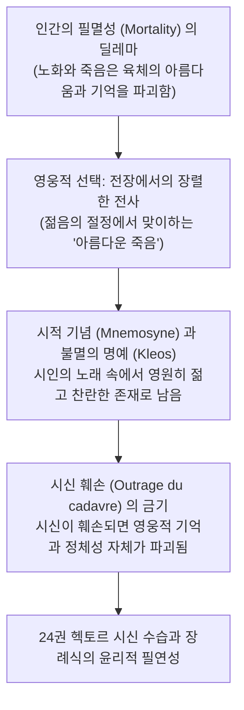

# 아름다운 죽음과 호메로스 영웅 윤리 (*La belle mort et le cadavre outragé*)

> [!NOTE] 학술사적 의의 및 총평
> 프랑스 역사심리학(Psychologie historique)과 파리 학파(École de Paris)의 거장 장-피에르 베르낭의 대표 논문 「아름다운 죽음과 훼손된 시신(La belle mort et le cadavre outragé)」은 고대 그리스 전사 문명에서 '죽음(Thanatos)'이 어떻게 영웅적 인격의 완성체이자 최고의 미학적·윤리적 승리로 변용되는지를 밝힌 불후의 명작입니다. 필멸의 인간이 노화에 따른 육체적 쇠락을 피하고 영원한 청춘과 불멸의 명예(Kleos)를 획득하기 위해 선택하는 **'아름다운 죽음(la belle mort, kalos thanatos)'**의 형이상학을 정밀하게 해명했습니다.

---

## 1. 서지 정보 및 학술사적 맥락

- **저자**: 장-피에르 베르낭 (Jean-Pierre Vernant, 1914–2007) — 콜레주 드 프랑스 명예교수, 프랑스 레지스탕스 영웅, 루이 제르네(Louis Gernet)의 수제자이자 프랑스 서양고전학의 최고봉.
- **출판 정보**: Gallimard: Paris (1989, 단행본 『개인, 죽음, 사랑: 고대 그리스에서의 자아와 타자』 제1부 수록).
- **연구 방법론**:
  - 역사심리학과 인류학적 구조주의 신화 분석의 결합.
  - 신체 표상(Body Representation), 장례 의례, 그리고 시적 불멸성의 메커니즘을 융합적으로 고찰.

---

## 2. 개념 전복 매트릭스 및 논증 계보도

### [자연적 죽음 vs 영웅적 '아름다운 죽음'의 대립 체계]

| 죽음의 유형 | 자연적 죽음 (노화, 질병) | 아름다운 죽음 (Kalos Thanatos / La belle mort) |
|:---|:---|:---|
| **육체적 상태** | 주름, 무력함, 쇠락, 추함(Aischron) | **가장 빛나는 젊음과 육체적 완벽성의 영구적 고정** |
| **사회적 기억** | 시간의 흐름 속에 잊힘 (망각, Lethe) | 시인의 찬미를 통한 **불멸의 명예([[concept-kleos|Kleos Aphthiton]])** |
| **최대의 공포** | 죽음 그 자체가 아니라 늙어서 비참해지는 것 | **시신 훼손(Outrage)으로 인한 영웅적 기억의 말살** |
| **완성의 의례** | 평범한 매장 | **무덤(Sema) 건립과 공동체의 성대한 장례 의식** |

### [Mermaid 논증 구조도]

---

## 3. 핵심 논지 정밀 분석

### 1.아름다운 죽음(Kalos Thanatos)의 형이상학:
- 고대 그리스인들에게 노화는 육체의 빛남(Aglaia)을 갉아먹는 비천한 저주였습니다.
- 전사의 삶에서 '아름다운 죽음'은 죽음이라는 생물학적 한계를, 자신의 가장 빛나는 순간을 영원히 박제하여 신들과 같은 불멸성을 얻는 **'도덕적·미학적 승리'**로 치환하는 장치였습니다.

### 2.시신 훼손(Outrage)과 존재론적 파멸:
- 시신이 적에 의해 훼손되어 들개와 새의 먹이가 되는 것은 단순히 육체의 파괴가 아닙니다.
- 그것은 무덤(Sema)을 갖지 못하고, 후대에 이름을 남기지 못하여 인간 세상에서 완전히 지워지는 **'제2의 죽음(존재론적 말살)'**이었습니다.
- 아킬레우스가 헥토르의 시신을 전차에 묶어 끈 행위는 단순한 분노의 표출을 넘어 헥토르의 영웅적 기억 전체를 지워버리려는 극단적 폭력이었습니다.

---

## 4. 핵심 원문 인용 및 심층 주석

- *"For the Homeric hero, the 'beautiful death' (la belle mort) is not merely a military end; it is the supreme moment of existence where youth and excellence are eternally crystallized in the collective memory of the song (kleos)."* (p. 45)
- **[주석]**: 전사의 죽음이 단순한 종말이 아니라 시적 찬미를 통해 영구화되는 최고의 미학적 순간임을 밝힘.

---

## 5. 서사시 전편 정밀 에피소드 매핑 테이블

| 서사시 권·행 번호 | 다루는 사건 및 인물 | 베르낭의 역사심리학적 해석 |
|:---|:---|:---|
| ***Il.* 22.71–76** | **프리아모스의 탄식** | 늙은 왕 프리아모스가 "젊은 전사가 전쟁터에서 무참히 찢겨 쓰러져 있는 것은 모든 것이 아름답지만, 늙은이의 회색 머리와 살점이 개들에게 뜯어먹히는 것은 가장 비참하다"고 절규하는 장면은 아름다운 죽음의 미학을 극적으로 웅변함. |
| ***Il.* 22.395–404** | **헥토르 시신 훼손** | 아킬레우스가 헥토르의 발뒤꿈치를 뚫고 가죽끈을 꿰어 전차에 묶어 끄는 행위는 영웅의 규범을 넘어 적의 존재론적 기억을 파괴하려는 극단적 시신 훼손의 전형. |
| ***Il.* 24.18–21** | **아폴론의 시신 보호** | 아폴론 신이 헥토르의 시신이 찢기지 않도록 황금 방패로 덮어 온전한 아름다움을 지켜주는 장면은 영웅의 시신이 지닌 신성함을 상징. |

---

## ## 관련 항목

- [[homeric-ethics-literature-review]]
- [[concept-kleos|Kleos]]
- [[concept-time|Timê]]
- [[concept-moira|Moira]]
- [[concept-arete|Arete]]
- [[일리아스]]
- [[redfield-1975-nature-and-culture]]
