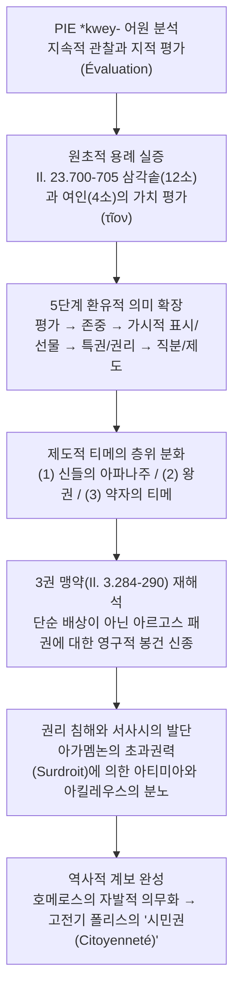

# 호메로스 티메의 제도적 측면 (*L'aspect institutionnel de la τιμή homérique à la lumière de l'étymologie*)

> [!NOTE] 학술사적 의의 및 총평
> 벨기에 리에주 대학교의 고전문헌학자 세르주 블레맹크(Serge Vleminck)의 1982년 논문 「어원학의 관점에서 본 호메로스적 τιμή의 제도적 측면」(*Živa Antika* 32)은 티메(timē)를 근대적 '명예(honneur/gloire)'의 주관적 자긍심으로 소급 투영하던 통념을 비판하고, 인도유럽조어(PIE) 어근 *kwey-와 동사 티오(tīō)의 의미론적 역사에서 출발하여 '평가(évaluation) → 권리/제도(institution)'로 진화하는 5단계 환유적(Metonymic) 메커니즘을 밝혀낸 고전기 제도언어학의 대표적 연구입니다. 장클로드 리댕제(Riedinger 1976)가 사회학적으로 규명한 '사회 질서로서의 티메'를 언어사적으로 정초하였으며, 일리아스 3권 파리스-메넬라오스 결투 맹약(3.284–290)의 '티멘 아포티네인(timēn apotinein)'을 단순 벌금이 아닌 트로이아의 '봉건적 신종(hommage féodal)이자 종주권 승인 조공'으로 획기적으로 재해석했습니다.

---

## 1. 서지 정보 및 학술사적 맥락

- **저자**: 세르주 블레맹크 (Serge Vleminck) — 벨기에 리에주 대학교(Université de Liège) 고전문헌학 연구원, 벨기에 국립과학연구재단(F.N.R.S.).
- **출판 정보**: *Živa Antika* (*Antiquité Vivante*), Vol. 32, No. 2 (1982), pp. 151–164 (UDC 807.5–541.2; 1982년 10월 29일 수락).
- **연구 방법론**:
  - 인도유럽조어(PIE) 어원 비교언어학(인도-이란어, 슬라브어, 발트어 대조).
  - 고대 그리스어 동사 **티오** (τίω) 및 명사 **티메** (τιμή)의 의미론적 변천사(évolution sémantique) 전수 추적.
  - 환유(métonymie)에 기초한 어의 확장 분석과 에밀 벵베니스트(Émile Benveniste) 및 루이 제르네(Louis Gernet)의 고대 제도사 결합.
- **핵심 문제의식**:
  - 전통적인 '명예(honneur)'나 '영광(gloire)'이라는 추상적 번역이 호메로스 서사시의 물질적이고 제도적인 역학을 어떻게 왜곡해왔는가?
  - '눈으로 사물을 관찰하고 가치를 매긴다'는 원초적 인지 행위(PIE `*kwey-`)가 어떻게 신들과 인간 사회의 항구적인 '직무와 권리'로 고착되었는가?
  - 아킬레우스와 아가멤논의 충돌, 트로이아 전쟁의 조약, 그리고 오뒷세이아 구혼자 살육은 단순한 감정적 분쟁인가, 아니면 엄밀한 제도적 권리 체계의 파열인가?

---

## 2. 개념 전복 매트릭스 및 논증 계보도

### [티메 이해의 3대 학설 비교 매트릭스]

| 분석 층위 | 애드킨스 (Adkins 1960) 모델 | 리댕제 (Riedinger 1976) 모델 | 블레맹크 (Vleminck 1982) 모델 |
|:---|:---|:---|:---|
| **티메의 본질** | 물리적 무력(biē)으로 쟁취하는 주관적 명예 | 사전에 계산되고 예측 가능한 사회적 질서 규범 | 평가(*tíō*)에서 권리·제도로 진화한 다층 체계 |
| **방법론적 기초** | 가치어 분석 및 제로섬 경쟁 사회론 | 텍스트 내 용례 전수 사회학적 분석 | 어원 비교언어학 및 환유적 의미 변천사 |
| **티메와 물질성** | 전리품 경쟁의 결과물이자 외적 표지 | 인격에 바치는 관대한 헌정의 상징적 매개체 | 가치 평가가 권리로서 물화(物化)된 가시적 표시 |
| **3권 맹약 (3.284–290)** | 단순한 전리품 또는 배상금 요구 | 공적 정의의 회복 | 트로이아의 봉건적 신종(hommage féodal) 조공 |
| **약자의 티메** | 무력이 없으므로 티메가 전무하거나 극소 | 애정과 호의(philos)에 기초한 상호 연대 | 제우스 에피티메토르(epitimētōr)가 보증하는 법적 권리 |
| **역사적 귀결** | 5세기 철학적 정의(dikaiosynē)로의 단절적 이행 | 상호 인정 질서의 지속 | 5세기 아테네 폴리스의 '시민권(citoyenneté)'으로 승화 |

### [Mermaid 논증 구조도]

---

## 3. 논문의 핵심 테제 및 섹션별 정밀 분석

### 제1절: 어원학적 출발점 — PIE *kwey-와 τίω의 의미론 (pp. 151–154)

- **인도유럽조어 비교언어학적 외연**:
  - 동사 **티오** (τίω)는 인도유럽조어(PIE) 어근 **\*kwey-**에서 유래합니다.
  - 이 어근의 원초적 가치는 “**지속적인 관찰, 주의 깊은 검토, 지적 작업과 결합된 시선(l'observation soutenue, l'examen attentif, un regard simultané à une opération intellectuelle)**”입니다.
  - 산스크리트어 어근 *ci-*, *cikéti* ("관찰하다, 지각하다, 주목하다") 및 *cit-*, *cétati*, 고대 교회 슬라브어 *čisti*, *čьtǫ* ("읽다, 존경하다"), 현대 러시아어 честь (*čest'*, "명예"), чту (*čtu*, "읽다, 헤아리다, 존경하다"), 리투아니아어 *skaityti* ("세다, 읽다") 등이 모두 이 계열에 속합니다.
- **원초적 기본 의미**: ‘**평가하다(évaluer)**’:
  - 서사시에서 문증된 동사 τίω의 가장 오래된 용례는 '시각을 통한 인지'와 결합된 ‘**평가하다(évaluer, estimer)**’입니다.
  - 『일리아스』 23.700–705 (파트로클로스 장례 경기 레슬링 상 수여):
    - **번역**: "펠레우스의 아들은 곧이어 다나오스인들에게 보여주며 고된 레슬링 경기의 세 번째 상들을 내놓았으니, 승자에게는 불 위에 얹는 큰 삼각솥이었고 아카이오이족은 마음속으로 그것을 열두 마리 소의 가치로 평가했다(τῖον). 패자에게는 한 여인을 가운데 세웠으니, 많은 일에 능숙한 여인이었고 그들은 그녀를 네 마리 소의 가치로 평가했다(τίον)."
    - **원문**: *Πηλεΐδης δ’ αἶψ’ ἄλλα κατὰ τρίτα θῆκεν ἄεθλα, / δεικνύμενος Δαναοῖσι, παλαισμοσύνης ἀλεγεινῆς, / τῷ μὲν νικήσαντι μέγαν τρίποδ’ ἐμπυριβήτην, / τὸν δὲ δυωδεκάβοιον ἐνὶ σφίσι τῖον Ἀχαιοί· / ἀνδρὶ δὲ νικηθέντι γυναῖκ’ ἐς μέσσον ἔθηκε, / πολλὰ δ’ ἐπίστα토 ἔργα, τίον δέ ἑ τεσσαράβοιον.*
    - **학술 전사**: *Pēleḯdēs d’ aîps’ álla katà tríta thêken áethla, / deiknúmenos Danaoîsi, palaismosúnēs alegeinê̄s, / tō̂i mèn nikḗsanti mégan trípod’ empuribḗtēn, / tòn dè duōdekáboion enì sphísi tîon Akhaioí; / andrì dè nikēthénti gunaîk’ es mésson éthēke, / pollà d’ epístato érga, tíon dé he tessaráboion.* (*Il.* 23.700–705)
  - 아킬레우스가 상을 눈앞에 보이고(δεικνύμενος), 아카이아인들이 삼각솥을 소 12마리(δυωδεκάβοιον), 여인을 소 4마리(τεσσαράβοιον)로 값을 매깁니다. 여기서 동사 τίω는 대상을 눈으로 보고 구체적 물질 가치를 산정하는 정량적 행위입니다.
- ‘**평가'에서 '도덕적 존경'으로의 전이**’:
  - 물질적 가치 산정에서 인간의 도덕적 행위나 품격을 높이 평가하는 '존경(estime)'으로 의미가 확장됩니다 (*Od.* 14.83–84):
    - **번역**: "복된 신들은 잔혹한 행위를 사랑하지 않으며, 도리어 인간들의 정의(디케)를 높이 평가하고 올바른 행위를 존중한다."
    - **원문**: *οὐ μὲν σχέτλια ἔργα θεοὶ μάκαρες φιλέουσιν, / ἀλλὰ δίκην τίουσι καὶ αἴσιμα ἔργ’ ἀνθρώπων.*
    - **학술 전사**: *ou mèn skhétlia érga theoì mákares philéousin, / allà díkēn tíousi kaì aísima érg’ anthrṓpōn.* (*Od.* 14.83–84)

---

### 제2절: 5단계 환유 연쇄와 '권리로서의 티메' 확립 (pp. 154–157)

블레맹크는 티메가 추상적 감정에서 객관적 제도로 굳어지는 과정을 5단계 환유 연쇄(Chaîne métonymique)로 정식화합니다:

| 단계 | 환유 층위 (프랑스어 원어) | 작동 방식 및 서사시 문헌적 증거 |
|:---|:---|:---|
| **1단계** | **평가 (Évaluation)** | 사물과 인간을 시선으로 관찰하고 가치를 매김 (*Il.* 23.700–705 삼각솥·여인 산정) |
| **2단계** | **존중 (Estime)** | 내면적 탁월성이나 의로운 행위를 높이 평가함 (*Od.* 14.83–84 신들의 디케 존중) |
| **3단계** | **가시적 표시 (Marque visible)** | 존경을 선물(dōra), 상석, 잔, 게라스(전리품)로 물화하여 표현 (*Il.* 23.648–649 네스토르의 잔) |
| **4단계** | **특권 및 권리 (Privilège / Droit)** | 영웅이 자신의 가치에 상응하는 표시를 정당하게 요구할 권리 (*Il.* 9.319 아킬레우스의 울분) |
| **5단계** | **직분 및 제도 (Charge / Institution)** | 원인과 결과의 완전한 환유: 신과 인간의 공식적 사회적 지위와 우주적 배당 (*Il.* 15.185–195) |

- **네스토르의 잔 (*Il.* 23.648–649)**:
  - 아킬레우스는 경주에 참가하지 못한 노장 네스토르에게 마지막 남은 술잔을 증정합니다. 네스토르는 "내가 아카이아인들 사이에서 마땅히 받아야 할(ἔοικε) 티메(τιμῆς)를 그대가 잊지 않았다"고 감격합니다.
  - 이 잔은 물질적 부 그 자체가 아니라, 네스토르의 연륜과 공적에 바치는 '공적 경의의 표시(témoignage public de déférence)'이자 상징적 훈장입니다.
- **아킬레우스의 항변과 권리로서의 티메 (*Il.* 9.319)**:
  - 아킬레우스는 아가멤논 휘하에서 싸우기를 거부하며 외칩니다:
    - **번역**: "머물러 있는 자에게도 같은 몫이 돌아오고, 격렬하게 싸운 자에게도 마찬가지로다. 겁쟁이나 용자나 똑같은 명예(티메)로 대우받으며..."
    - **원문**: *ἴση μοῖρα μένοντι, καὶ εἰ μάλα τις πολεμίζοι· / ἐν ἰῇ δὲ τιμῇ ἠμὲν κακὸς ἠδὲ καὶ ἐσθλός·*
    - **학술 전사**: *ísē moîra ménonti, kaì ei mála tis polemízoi; / en iē̂i dè timē̂i ēmèn kakòs ēdè kaì esthlós;* (*Il.* 9.318–319)
  - 아킬레우스의 분노는 단순한 탐욕이 아닙니다. 영웅은 사회적 평가에 비추어 ‘**가시적 예우와 혜택을 요구할 정당한 권리(droit à la τιμή)**’를 지닙니다. 군주가 이를 강탈한 것은 정당한 권리를 파괴하고 그를 무자격자로 격하시킨 중대한 범죄입니다.

---

### 제3절: 제도적 티메의 사회적 층위 (pp. 157–160)

티메는 사회의 모든 구성원에게 고유한 자리와 직무로 구체화됩니다:

1. **신들의 우주적 아파나주 (Il. 15.185–195)**:
   - 제우스, 포세이돈, 하데스 3형제는 제비를 뽑아 하늘, 바다, 명계를 나누어 가집니다.
   - 이 영역(μοῖρα)이 곧 각자의 아파나주(apanage)이자 티메입니다. 세 신은 대등한 티메를 지닌 *homótimoi* (*Il.* 15.186)이며, 누구도 타인에게 일방적으로 굴종하지 않습니다.
2. **왕의 티메 (La τιμή du roi)**:
   - 고대 주석가 아폴로니오스 소피스테스가 규정했듯, 티메는 왕권(*basileía*)의 동의어로 작동합니다 (*Od.* 11.495).
   - 왕의 티메는 신적 기원을 지니며, 통치 직무, 사회적 서열, 공공의 포도주를 마시고 군대를 호령하는 제도적 특권의 총체입니다 (*Il.* 17.248–251).
3. **시인(아오이도스)의 티메**:
   - 오뒷세우스가 데모도코스에게 고기를 떼어주며 선언하듯, 가인은 무사이의 영감으로 인해 지상 모든 인간 사이에서 '티메와 아이도스의 정당한 몫'(*timē̂s émmoroí eisi kaì aidoûs*, *Od.* 8.479–481)을 배당받습니다.
4. **사회적 약자와 보편적 인간의 티메**:
   - 블레맹크의 가장 핵심적인 통찰:
     "신들과 인간에게 버림받은 극소수의 추방자들을 제외하고, 모든 인간은 저마다의 고유한 티메, 즉 사회적 자리와 권리와 특권을 지닌다(Tout être humain... a sa τιμή particulière, i.e. sa place, ses droits, ses privilèges)."
   - 무력이 없는 이방인, 탄원자, 걸인의 티메는 최고신 제우스가 직접 감시자이자 보증인(*epitimētōr*, *Od.* 9.270)으로 개입함으로써 확고한 제도적 권리가 됩니다.
   - 에우마이오스가 누더기 거지를 환대하며 "손님을 홀대하는 것은 내게 법(테미스)이 아니다"라고 선언한 것(*Od.* 14.56–58)은 바로 이 약자의 티메를 일상적으로 집행한 것입니다.
5. **완전한 무권리자: 아티메토스 메타나스테스 (ἀτίμητος μετανάστης)**:
   - 아킬레우스가 아가멤논에게 격분하며 외친 표현(*Il.* 9.648, 16.59):
     "그는 나를 아르고스인들 가운데서 마치 권리 없는 떠돌이 망명객(*atímēton metanástēn*)처럼 대했다."
   - 걸인이나 손님조차 제우스의 보호를 받는데, 아가멤논은 그리스 최고의 영웅을 제우스의 법망조차 닿지 않는 극소수의 버림받은 자(paria)로 취급했다는 고발입니다.

---

### 제4절: Il. 3.284–290의 획기적 재해석 — 봉건적 신종으로서의 티메 (pp. 160–162)

아가멤논이 파리스-메넬라오스 결투 조약에서 트로이아 측에 요구한 티메 조항의 성격:

- **원문과 번역 (*Il.* 3.284–290)**:
  - **번역**: "만일 금발의 메넬라오스가 알렉산드로스를 죽인다면, 트로이아인들은 헬레네와 모든 재물을 돌려주고, 아르고스인들에게 마땅한 명예(티메)를 바쳐 만족시켜야 하되, 그 티메는 후대 인간들에게까지 영구히 남아야 하리라. 그러나 알렉산드로스가 쓰러진 뒤에도 프리아모스와 프리아모스의 아들들이 내게 그 티메를 바치지 않으려 한다면, 나는 그때 배상(포이네)을 받아내기 위해 다시 싸울 것이다."
  - **원문**: *εἰ δέ κ’ Ἀλέξανδρον κτείνῃ ξανθὸς Μενέλαος, / Τρῶας ἔπειθ’ Ἑλένην καὶ κτήματα πάντ’ ἀποδοῦναι, / τιμὴν δ’ Ἀργείοις ἀποτινέμεν ἥν τιν’ ἔοικεν, / ἥ τε καὶ ἐσσομένοισι μετ’ ἀνθρώποισι πέληται· / εἰ δ’ ἂν ἐμοὶ τιμὴν Πρίαμος Πριάμοιό τε παῖδες / τίνειν οὐκ ἐθέλωσιν Ἀλεξάν드로ιο pesóntos, / αὐτὰr ἐγὼ καὶ ἔπειτα μαχήσομαι εἵνεκα ποινῆς...*
  - **학술 전사**: *ei dé k’ Aléksandron kteínēi ksanthòs Menélaos, / Trō̂as épeith’ Helénēn kaì ktḗmata pánt’ apodoûnai, / timḕn d’ Argeíoisi apotinémen hḗn tin’ eoiken, / hḗ te kaì essoménoisi met’ anthrṓpoisi pélētai; / ei d’ àn emoì timḕn Príamos Priámoió te paîdes / tínein ouk ethélōsin Aleksándroio pesóntos, / autàr egṑ kaì épeita makhḗsomai heíneka poinē̂s...* (*Il.* 3.284–290)
- **블레맹크의 논박과 새로운 해석**:
  - 기존 주석가들은 여기서 τιμή와 ποινή를 동일한 '손해배상금'으로 간주했습니다.
  - 그러나 블레맹크는 두 단어가 엄격히 대립한다고 지적합니다:
    1. 287행의 "후대 인간들에게까지 영구히 지속될 것"이라는 규정은 일회성 보물이나 벌금으로는 성립할 수 없습니다.
    2. 피해자인 메넬라오스가 아닌 총사령관 아가멤논과 아르고스군 전체에 바쳐지는 몫입니다.
  - 따라서 여기서 `τιμὴν ἀποτινέμεν`은 트로이아가 아르고스 패권에 영구적으로 바쳐야 할 ‘**봉건적 신종(hommage féodal)이자 정치적 종주권 승인 조공(tribut)**’입니다. 만약 트로이아가 이 제도적 복속을 거부할 때 비로소 피의 징벌인 **포이네** (ποινή)를 위해 전쟁이 재개되는 것입니다.

---

### 제5절: 권리 침해와 아티미아, 그리고 아테네 시민권으로의 계보 (pp. 162–164)

- **아가멤논의 초과권력(Surdroit, Hybris)**:
  - 법제사가 루이 제르네(Louis Gernet 1955)의 분석을 인용하며, 아가멤논이 브리세이스를 빼앗은 것은 군주의 **초과권력(surdroit, ὕβρις)** 행사였습니다.
  - 호메로스 사회에서 공동체가 공인하여 분배한 소유권은 불변적(*Il.* 1.335: *émpeda keîtai*)이어야 합니다. 군주가 이를 독단적으로 뒤엎은 것은 아킬레우스의 존재론적 권리를 파괴하고 그를 무자격 상태(*atimía*)로 몰아넣은 불법입니다.
- **파트로클로스 출전과 아킬레우스의 계산 (*Il.* 16.89–90)**:
  - 아킬레우스는 파트로클로스에게 배 방어선 너머로 진격하지 말라고 경고합니다: "그대는 나를 더욱 티메 없는 자로 만들 것이기 때문이다"(*atimóteron dé me thḗseis*).
  - 아킬레우스 없이도 그리스군이 승리한다면 그의 대체 불가능성과 최고 티메의 권리는 완전히 소멸하기 때문입니다.
- **역사적 진화의 귀결**:
  - 호메로스 사회의 자발적 감정(찬탄, 관대함)에서 출발한 티메는 관습과 종교적 외경심을 거쳐 의무적인 사회 제도가 되었습니다.
  - 비록 영웅시대의 뜨거운 정서적 함의는 탈각되었으나, 5세기 고전기 아테네 폴리스에서 티메는 시민에게 가장 소중한 법적 자산인 ‘**시민권(citoyenneté)**’으로 승화되었으며, 그 박탈인 아티미아(*atimía*) 법제로 계승되었습니다.

---

## 4. 원전 핵심 인용구 및 학술 주해

- **Max Greindl (1938, p. 134)**:
  - *"Sans la τιμή, il n’y aurait jamais eu l'Iliade."*
  - **[주석]**: 티메가 없었더라면 『일리아스』는 결코 존재하지 않았을 것이라는 통찰. 서사시 전체의 갈등 축이 티메의 침해와 복원에 있음을 선언함.
- **Émile Benveniste (1969, II, pp. 53, 55)**:
  - *"Une dignité d’origine divine, conférée par le sort à un personnage royal, et qui comprend non seulement le pouvoir, mais des privilèges de respect et des redevances matérielles."*
  - **[주석]**: 왕의 티메는 신적 기원을 지니며 제비뽑기에 의해 왕적 인물에게 부여되는 품격으로, 권력뿐 아니라 존경의 특권들과 물질적 공납을 포괄함.
- **Louis Gernet (1955, p. 15)**:
  - *"Il y a de la part d’Agamemnon surdroit (ὕβρις), fait du prince... Le droit, c’est que la propriété en question est immuable."*
  - **[주석]**: 아가멤논의 처분은 군주의 자의적 월권이자 초과권력(hybris)이며, 공동체가 정당하게 수여한 게라스의 불변성을 침해한 범죄임.
- **Serge Vleminck (1982, p. 164)**:
  - *"La Grèce des cités saura réévaluer la τιμή: celle-ci, même si elle aura perdu ses connotations émotives, deviendra un des biens les plus précieux de l'Athénien du Ve siècle, sa citoyenneté."*
  - **[주석]**: 호메로스적 티메가 고전기 폴리스에서 아테네 시민의 최고 권리인 시민권(citoyenneté)으로 승화되는 계보학적 가교를 밝힘.

---

## 5. 지식베이스 내 연계 및 확장 지점

- **티메의 5단계 환유 연쇄 정초**: [[concept-time|티메]] 개념 문서에 '정량적 평가 → 존중 → 가시적 표시/선물 → 권리 → 공식적 직분/제도'로 이어지는 언어사적 구조를 확립.
- **게라스와의 관계 규명**: [[concept-geras|게라스]]는 5단계 직분을 증명하는 3단계의 필수적인 가시적 징표이며, 게라스의 박탈이 단순 재산 손실이 아니라 존재론적 아티미아로 비화하는 메커니즘 제공.
- **포이네와의 사법적 대조**: [[concept-poine|포이네]]가 유혈 응징이자 사적 복수라면, 티메는 지속적인 정치적 신종과 권리의 회복임을 3권 284–290행을 통해 입증.
- **영웅의 실존과 초과권력 비판**: [[entity-agamemnon|아가멤논]]의 군주적 폭력(surdroit)과 [[entity-achilles|아킬레우스]]의 실존적 분노(menis)의 법제사적 성격을 완결.

---

## 관련 항목

- [[concept-time|티메 (Time)]]
- [[concept-geras|게라스 (Geras)]]
- [[concept-poine|포이네 (Poine)]]
- [[concept-menis|메니스 (Menis)]]
- [[concept-hikesia|히케시아 (Hikesia)]]
- [[entity-achilles|아킬레우스 (Achilles)]]
- [[entity-agamemnon|아가멤논 (Agamemnon)]]
- [[word-time|Time (티메 어원 분석)]]
- [[riedinger-1976-la-time-chez-homere|장클로드 리댕제 (1976), 호메로스에게서의 티메]]
- [[finkelberg-1998-time-and-arete|마르갈리트 핀켈버그 (1998), 호메로스에게서의 티메와 아레테]]
