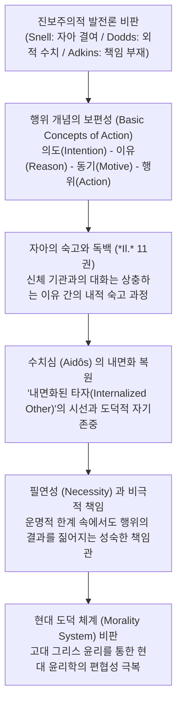

# 수치심과 필연성 (*Shame and Necessity*)

> [!NOTE] 학술사적 의의 및 총평
> 버나드 윌리엄스의 『수치심과 필연성』(1993)은 20세기 서양고전학과 도덕철학의 만남에서 가장 빛나는 금자탑입니다. 19세기 이래 고전학계를 지배하던 **스넬-도즈-애드킨스(Snell-Dodds-Adkins)의 '진보주의적 결핍 모델(Progressivist Deficiency Model)'**—호메로스 시대의 인간은 통합된 자아, 자유의지, 죄책감, 보편적 도덕 책임이 결여된 미성숙한 존재였다는 계몽주의적 가설—을 철저한 분석철학적 개념 분석과 문헌학적 텍스트 독해로 완전히 분쇄했습니다. 윌리엄스는 고대 그리스 비극과 서사시의 세계가 근대의 협소한 '도덕 체계(Morality System)'보다 인간 실존의 비극성, 필연성, 행위 주체성(Agency)을 훨씬 더 정직하고 심오하게 꿰뚫어 보고 있었음을 입증했습니다.

---

## 1. 서지 정보 및 학술사적 맥락

- **저자**: 버나드 윌리엄스 (Sir Bernard Arthur Owen Williams, 1929–2003) — 옥스퍼드 대학교 및 케임브리지 대학교 나이트브리지 철학 석좌교수, UC 버클리 철학 석좌교수를 역임한 20세기 영국의 대표적 도덕철학자.
- **출판 정보**: University of California Press (1993, Sather Classical Lectures 제57권, 254쪽).
- **연구 방법론**: 
  - 옥스퍼드 일상언어학파와 분석철학적 개념 해체 기법을 고대 그리스어 텍스트 문헌학에 결합.
  - 니체(Friedrich Nietzsche)의 『도덕의 계보학』적 통찰을 수용하여, 칸트주의와 공리주의 등 근대 서구 도덕 이론이 전제하는 '도덕적 행위자(Pure Moral Agent)'라는 허구를 고대 그리스 텍스트를 통해 비판.
- **출간 이전의 지배적 학설 (비판 대상)**:
  1. **브루노 스넬([[snell-1946-discovery-of-mind|Bruno Snell, 1946]])**: 호메로스 언어에는 살아있는 몸(Soma)이나 통합된 영혼(Psyche) 개념이 없었으며, 인간은 신체 기관(Thymos, Phren)의 충동에 지배당하는 파편화된 존재였다.
  2. **E. R. 도즈([[dodds-1951-greeks-and-irrational|E. R. Dodds, 1951]])**: 호메로스 사회는 타인의 외적 평판과 비난에만 휘둘리는 미성숙한 '수치 문화(Shame Culture)'였으며, 기독교적 '죄책 문화(Guilt Culture)'로 진화해야 했다.
  3. **A. W. H. 애드킨스([[adkins-1960-merit-and-responsibility|A. W. H. Adkins, 1960]])**: 호메로스 사회는 경쟁적 덕(Arete)이 협력적 가치(Dike)를 압도하여, 의도나 동기에 따른 근대적 '도덕적 책임(Moral Responsibility)' 개념이 결여되어 있었다.

---

## 2. 개념 전복 매트릭스 및 논증 계보도

### [기존 정설 vs 버나드 윌리엄스의 혁신적 전복]

| 비교 범주 | 기존 진보주의적 고전학 (Snell, Dodds, Adkins) | 버나드 윌리엄스의 전복적 테제 (*Shame and Necessity*) |
|:---|:---|:---|
| **행위 주체성 (Agency)** | 자아와 의지가 결여되어 신의 개입에 의존하는 수동적 존재 | 의도, 이유, 동기, 행위의 연쇄를 온전히 파악한 완전한 도덕적 주체 |
| **수치심 ([[concept-aidos|Aidos]])** | 타인의 시선과 사회적 평판에만 좌우되는 외적 체면 | **'내면화된 타자(Internalized Other)'**의 시선을 통한 자율적 도덕 감정 |
| **죄책감 vs 수치심** | 죄책감(Guilt)이 수치심(Shame)보다 진화된 윤리 형태 | 수치심은 전인격적 정체성("내가 누구인가")에 직결된 더 심오한 정서 |
| **운명 ([[concept-moira|Moira]])과 필연성** | 맹목적 운명론에 굴복하여 개인의 책임이 소멸됨 | 바꿀 수 없는 필연성(Ananke) 속에서도 결과에 대한 책임을 감당함 |
| **신적 개입 ([[concept-ate|Ate]])** | 책임을 회피하기 위해 신을 탓하는 비합리적 미신 | 일상적 인식을 넘어서는 파국적 착오를 설명하되 실질적 배상을 감당 |

### [Mermaid 논증 구조도]

---

## 3. 전 챕터별 정밀 독해 및 논증 단계

### 제1장: 해방된 과거 (*Liberating the Early Greek Mind*)
- **핵심 문제의식**: 근대인들은 왜 고대 그리스인을 '우리의 미숙한 유년기'로 취급하는가?
- **논증 내용**:
  - 19세기 진화론의 영향을 받은 고전학자들은 고대 텍스트를 읽을 때 "우리가 가진 칸트주의적 도덕 관념이 고대인에게도 있는가?"를 묻고, 없으면 '결핍(Deficiency)'으로 규정하는 진보주의적 오류(Progressivist Fallacy)를 범했다.
  - 윌리엄스는 고대 그리스 서사시와 비극이 근대 철학보다 인간의 도덕적 경험을 훨씬 덜 왜곡하며 다루고 있음을 선언하며, 고대 사상을 근대의 목적론적 잣대로부터 '해방'시킬 것을 촉구한다.

### 제2장: 자아의 중심 (*Centres of Agency*)
- **스넬의 파편화된 자아론 논박**:
  - 브루노 스넬은 호메로스 영웅들이 자신의 티모스(Thymos)나 프렌(Phren)에게 말을 거는 장면(*Il.* 11.404 등)을 두고 자아가 해체되어 있었다고 주장했다.
  - 윌리엄스는 이를 반박하며, 인간이 결단을 내릴 때 여러 상충하는 욕망과 이유들 사이에서 번민하는 것은 지극히 자연스러운 **'내적 숙고(Deliberation)'의 문학적 표현**이라고 밝힌다.
  - 호메로스 영웅들은 '내가 원하는 것(Desire)'과 '내가 해야 하는 것(Belief/Duty)'을 명확히 구분하고 있으며, 자신의 행동을 의도적 행위(Intended action)로 명확히 인지하고 있다.

### 제3장: 인정과 힘 (*Recognising Responsibilities*)
- **고대 그리스의 책임(Responsibility) 개념 재정립**:
  - 근대 형법과 칸트 윤리학은 오직 "순수한 자유의지로 통제할 수 있었던 행위"에만 책임을 한정한다.
  - 그러나 고대 그리스인들은 행위의 인과적 결과(Cause and Effect)에 주목했다. 설령 신의 개입([[concept-ate|Ate]])이나 불가항력적인 운명으로 인해 일어난 파국이라 할지라도, 자신이 그 사건의 원인이 되었다면 그 결과(피해, 오염, 불행)에 대해 사후적 보상과 배상(Apoina)을 제공하는 성숙한 **'상황적/인과적 책임'**을 졌다.

### 제4장: 수치심과 수치 (*Shame and Guilt*)
- **수치심([[concept-aidos|Aidos]])의 심오한 윤리적 차원 규명**:
  - 도즈의 '수치 문화' 테제를 정면 비판한다. 수치심은 단순한 군중의 비난에 대한 공포가 아니다.
  - 수치심을 느끼기 위해서는 내면에 **'존경할 만한 타자의 시선(An imagined, internalized other)'**이 전제되어야 한다. 영웅은 아무도 보지 않는 곳에서도 비열한 짓을 저질렀을 때 자기 내면의 이상적 관찰자 앞에서 부끄러움을 느낀다.
  - 죄책감(Guilt)이 외적 법률과 규칙 위반에 따른 '처벌'의 공포에 매몰되기 쉬운 반면, 수치심(Shame)은 **"내가 어떤 인격을 가진 인간인가(Who I am)"**라는 자기 정체성과 자존감의 총체적 파탄을 경계하는 훨씬 더 근본적인 윤리적 정서이다.

### 제5장: 필연성과 선택 (*Necessities*)
- **모이라([[concept-moira|Moira]])와 인간의 자유**:
  - 운명(Moira)과 아낭케(Ananke)는 인간의 모든 행동을 꼭두각시처럼 조종하는 기계론적 결정론이 아니다.
  - 그것은 인간이 '필멸자(Mortal)'라는 사실, 언젠가 죽는다는 한계, 자신이 통제할 수 없는 세상의 거대한 힘을 의미한다.
  - 호메로스의 영웅들은 바꿀 수 없는 필연성의 테두리를 정직하게 인정하면서, 그 제약 속에서 자신의 탁월성([[concept-arete|Arete]])과 성품(Character)을 증명하는 자유로운 도덕적 결단을 내린다.

### 제6장: 가능성들 (*Possibilities*)
- **현대 윤리학에 던지는 고대의 제언**:
  - 고대 그리스의 비극적 통찰을 복원함으로써, 근대 도덕철학이 맹신하는 '도덕적 정의의 궁극적 승리'나 '모든 도덕적 갈등의 완전한 해소'라는 환상을 걷어내고, 인간 삶의 본원적 취약성(Vulnerability)과 운의 역할(Moral Luck)을 직시할 것을 역설한다.

---

## 4. 문헌학적 어휘 사전 및 희랍어 개념 정밀 주해

1. **아이도스 (Aidōs, αἰδώς)**:
   - 어원적으로 '존경하다, 경외하다(aideomai)'와 연결됨. 단순한 굴욕감이 아니라 타인에 대한 경외와 자기 자신의 명예를 지키기 위한 내적 억제력. 윌리엄스는 이를 '내면화된 타자의 시선'으로 재정의함.
2. **아테 (Atē, ἄτη)**:
   - 일시적 광기, 판단력의 마비, 신이 내린 눈멂. 영웅이 자신의 평소 성품과 어긋나는 치명적 실수를 저질렀을 때 이를 설명하는 초자연적 원인이자, 결과에 대한 실질적 배상이 뒤따르는 인과적 계기.
3. **아낭케 (Anankê, ἀνάγκη)**:
   - 어찌할 수 없는 실존적 필연성, 구속력. 도덕적 행위자가 직면하는 불가피한 세계의 조건.
4. **티메 (Timê, τιμή)**:
   - 사회적 인정과 명예. 외적인 물질적 전리품(Geras)을 통해 가시화되지만, 궁극적으로는 공동체 안에서 개인의 인격적 가치를 확인하는 척도.

---

## 5. 핵심 원문 인용 및 심층 주석

### 인용 1: 고대인의 행위 주체성에 대하여
> *"The Greeks were not primitive beings waiting for Kant to give them a moral compass. They had a rich, coherent, and profound understanding of human agency, necessity, and character."* (Chapter 1, p. 15)  
> **[주석]**: 계몽주의적 목적론을 비판하는 윌리엄스의 가장 유명한 구절. 그리스인들이 현대 칸트주의 도덕론보다 인간 행위의 인과성과 한계를 훨씬 더 정직하게 통찰했음을 선언함.

### 인용 2: 내면화된 타자와 수치심에 대하여
> *"Shame requires an internalized other. The internalized other is not just any observer, but someone whose respect the agent values, someone who embodies the standards of character that the agent aspires to uphold."* (Chapter 4, p. 84)  
> **[주석]**: 도즈의 수치 문화론을 해체하는 결정적 논증. 수치심은 군중심리가 아니라, 자아 내부에 구축된 이상적 도덕 기준과의 대화임을 규명함.

### 인용 3: 필연성과 책임에 대하여
> *"To accept necessity is not to succumb to fatalism. It is to recognize the limits of human power, and within those limits, to bear the weight of what one has done."* (Chapter 5, p. 132)  
> **[주석]**: 호메로스 서사시와 그리스 비극에서 인물들이 운명 앞에서도 비겁하게 도망치지 않고 자신의 행위 결과를 자신의 몫으로 짊어지는 고귀함의 원천을 설명함.

---

## 6. 서사시 전편 정밀 에피소드 매핑 테이블

| 서사시 권·행 번호 | 다루는 사건 및 인물 | 윌리엄스의 윤리학적 분석 및 텍스트 증거 |
|:---|:---|:---|
| ***Il.* 1.188–222** | **아킬레우스의 칼과 아테나의 개입** | 아테나가 머리채를 잡는 것은 단순한 외적 조종이 아니라, 아킬레우스 자신의 내적 판단력과 분노의 제어라는 심리적 숙고 과정이 신화적 이미지로 동시 표출된 것임 (Lesky의 이중 동기화와 일치). |
| ***Il.* 11.403–410** | **오디세우스의 독백 (*Thymos*와의 대화)** | 포위된 오디세우스가 "내 가슴이여, 왜 번민하는가? 비겁자는 도망치지만 용사는 버텨야 한다"고 말하는 장면은, 파편화된 자아가 아니라 도덕적 의무와 생존 욕구 사이의 합리적 숙고(Deliberation)의 모범임. |
| ***Il.* 19.86–138** | **아가멤논의 공식 사과와 *Atē*** | 아가멤논은 자신의 잘못을 신적 눈멂(Atē) 탓으로 돌리지만, 즉각 막대한 배상(Apoina)을 아킬레우스에게 건넴으로써 자신이 초래한 인과적 결과에 대해 완벽한 책임을 짊어짐. |
| ***Il.* 22.99–130** | **성문 앞 헥토르의 고뇌와 *Aidōs*** | 헥토르가 성안으로 피신하지 못하는 것은 단순한 평판에 대한 두려움이 아니라, 자신의 오판으로 군대를 사지에 몰아넣었다는 도덕적 자책과 '내면화된 타자'에 대한 부끄러움 때문임. |
| ***Il.* 24.503–518** | **프리아모스와 아킬레우스의 화해** | 두 영웅이 신들이 내린 가혹한 필연성(Ananke)과 죽음의 보편성 앞에서 함께 울며 적대감을 초월한 연민(Eleos)과 환대([[concept-xenia|Xenia]])를 나눔으로써 호메로스 윤리의 정점에 도달함. |
| ***Od.* 22.411–418** | **오디세우스의 에우리클레이아 훈계** | 구혼자들을 처형한 뒤 기뻐 날뛰는 유모 에우리클레이아에게 "죽은 자들 앞에서 소리 내어 기뻐하는 것은 경건하지 못하다(Ouk hosie)"며 억제하는 장면은, 복수의 순간에도 지켜져야 할 엄격한 도덕적 선(Nemesis/Aidos)을 입증함. |

---

## 7. 학술 논쟁사 및 비판적 공방

> [!TIP] 학술적 수용 및 후속 논쟁 지형
- **전폭적 계승 및 입증**:
  - **더글러스 케언스([[cairns-1993-aidos|Douglas Cairns, 1993]])**: 케언스는 같은 해 출간된 명저 『아이도스』에서 호메로스 원전의 모든 aidōs 용례를 전수 조사하여 윌리엄스의 '내면화된 타자' 및 '사전 억제적 도덕 정서' 테제를 문헌학적으로 완벽히 증명함.
  - **크리스토퍼 길([[gill-1996-personality-in-greek-epic|Christopher Gill, 1996]])**: 윌리엄스의 논의를 확장하여 데카르트적 고립된 주체가 아닌 '객관적-참여자적 자아(Objective-participant self)' 개념을 정립.
- **문헌학계의 비판 및 반론**:
  - 일부 전통 문헌학자들은 윌리엄스가 현대 도덕철학의 개념(Agency, Internalized Other)을 고대 호메로스 텍스트에 다소 세련되게 소급 적용(Anachronism)했다는 비판을 제기함.
  - 그러나 윌리엄스의 저작 이후 고전학계에서 "호메로스 인간은 자아가 없었다"는 스넬식 테제는 완전히 학계에서 퇴출당함.

---

## 8. 연구 질문 및 세미나 토론 쟁점

1. **현대 도덕철학과의 대결**: 칸트의 '의무론(Deontology)'이 전제하는 순수한 자유의지 개념과 비교할 때, 호메로스 영웅들이 보여주는 '인과적 결과 책임'은 현대의 '도덕적 운(Moral Luck)' 문제를 해결하는 데 어떤 통찰을 주는가?
2. **수치심의 내면화 수준**: 『일리아스』 22권 헥토르의 독백에서 발현되는 아이도스는 시민들의 실제 비난(외적 평판)에 대한 공포인가, 아니면 자신의 도덕적 자아상(내면적 양심)에 대한 부끄러움인가? 두 요소는 어떻게 결합되어 있는가?
3. **신적 개입과 도덕적 주체성**: 신들이 인간의 마음에 아테(Atē)나 메노스(Menos)를 주입할 때, 인간 행위자의 도덕적 자율성은 훼손되는가, 아니면 레스키(Lesky)의 '이중 동기화'처럼 인간의 심리적 결단과 완벽히 중첩되는가?

---

## ## 관련 항목

- [[homeric-ethics-literature-review]]
- [[concept-aidos|Aidos]]
- [[concept-arete|Arete]]
- [[concept-ate|Ate]]
- [[concept-moira|Moira]]
- [[concept-time|Timê]]
- [[adkins-1960-merit-and-responsibility]]
- [[snell-1946-discovery-of-mind]]
- [[cairns-1993-aidos]]
- [[dodds-1951-greeks-and-irrational]]
- [[lloyd-jones-1971-justice-of-zeus]]
- [[shay-1994-achilles-in-vietnam]]
