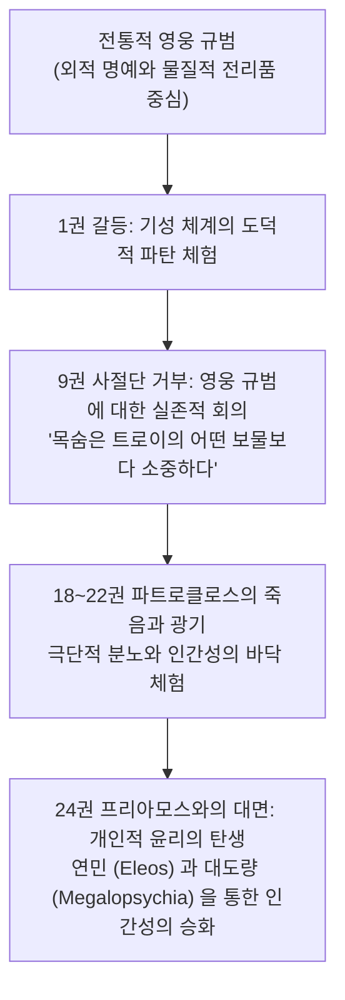

# 아킬레우스의 마음 (*The Heart of Achilles: Characterization and Personal Ethics in the Iliad*)

> [!NOTE] 학술사적 의의 및 총평
> 뉴질랜드 캔터베리 대학교 서양고전학 교수 그레이엄 잰커의 『아킬레우스의 마음』(1994)은 호메로스 서사시가 단순한 '외적 사회 규범(Shame/Honor Code)의 기계적 반영'에 그치지 않고, **주인공 아킬레우스의 실존적 고뇌와 내적 성숙을 통해 '개인적 윤리(Personal Ethics)'와 숭고한 대도량(Megalopsychia), 그리고 인간 보편에 대한 연민(Eleos)을 창조해 내는 심오한 인격 형성의 서사**임을 입증한 탁월한 문헌학적 연구입니다.

---

## 1. 서지 정보 및 학술사적 맥락

- **저자**: 그레이엄 잰커 (Graham Zanker) — 뉴질랜드 캔터베리 대학교 고전학 석좌교수, 호메로스 및 헬레니즘 문전문학 권위자.
- **출판 정보**: University of Michigan Press: Ann Arbor (1994, 184쪽).
- **연구 동기**: 
  - 애드킨스(Adkins) 이래 호메로스 영웅들을 '외적 명예와 전리품의 노예'로 취급하던 환원주의적 시각을 비판하고, 텍스트의 정밀한 문학적·수사학적 분석을 통해 아킬레우스의 내적 성숙 궤적을 복원하고자 함.

---

## 2. 개념 전복 매트릭스 및 논증 계보도

### [기존 사회 규범 모델 vs 잰커의 개인 윤리 모델]

| 분석 층위 | 전통적 외적 규범 모델 (Adkins 등) | 잰커의 개인 윤리 발전 모델 (*The Heart of Achilles*) |
|:---|:---|:---|
| **영웅의 동기** | 공동체의 물질적 인정(Geras)과 명예(Timê)에 종속 | 기성 보상 체계를 회의하고 **독자적 내적 가치 기준을 정립** |
| **9권의 사절단 거부** | 비이성적 고집이나 지나친 오만(Hybris) | **영웅 사회의 공허한 보상 체계에 대한 근본적이고 철학적인 거부** |
| **24권 화해의 본질** | 신들의 강압적 명령에 대한 수동적 굴복 | **보편적 인간 조건(필멸성)에 대한 깊은 공감(Eleos)과 자율적 용서** |
| **윤리의 성격** | 사회적 체면과 지위 중심의 외적 윤리 | 고통 속에서 형성된 **내면화된 '개인적 윤리(Personal Ethics)'** |

### [Mermaid 논증 구조도]

---

## 3. 핵심 논지 정밀 분석

### 1.9권의 실존적 전환 (The Crisis in Book 9):
- 아가멤논이 보낸 사절단(오디세우스, 아이아스, 포이닉스)이 거대한 물질적 배상을 제시했을 때 아킬레우스가 거부한 것은, 단순한 감정적 분노가 아니라 **"인간의 목숨은 그 어떤 물질적 전리품(Geras)으로도 대체될 수 없다"**는 실존적 깨달음 때문이었습니다.
- 아킬레우스는 영웅 사회 전체의 보상 체계를 넘어서는 독자적인 가치 기준을 요구하기 시작합니다.

### 2.24권의 연민(Eleos)과 대도량(Megalopsychia):
- 적의 왕 프리아모스가 찾아왔을 때, 아킬레우스는 신들의 명령 때문만이 아니라, 자신의 늙은 아버지 펠레우스의 운명과 프리아모스의 처지를 겹쳐 보며 깊은 눈물을 흘립니다.
- **제우스의 두 항아리 비유**(*Il.* 24.527–551)를 직접 들려주며 적장을 위로하고 음식을 대접하는 행위는, 서양 문학사에서 **사적 증오를 초월하여 인간 보편의 고통에 연대하는 '자율적이고 숭고한 개인적 윤리'**의 탄생을 알립니다.

---

## 4. 핵심 원문 인용 및 심층 주석

- *"Achilles moves beyond the traditional heroic code. In Book 24, his acceptance of Priam is not an act of mere resignation to the gods, but a triumph of personal magnanimity (megalopsychia) and pity (eleos), creating an ethical space grounded in shared human mortality."* (Chapter 5, p. 142)
- **[주석]**: 아킬레우스의 마지막 행동이 외적 사회 규범의 산물이 아니라, 고통을 통해 획득한 고결한 인격의 자율적 성취임을 규명함.

---

## 5. 서사시 전편 정밀 에피소드 매핑 테이블

| 서사시 권·행 번호 | 다루는 사건 및 인물 | 잰커의 개인 윤리학적 해석 |
|:---|:---|:---|
| ***Il.* 9.318–345** | **아킬레우스의 거부 연설** | "내 목숨은 트로이의 어떤 보물보다 소중하다"고 선언하며 영웅적 집단 규범과 결별하고 실존적 개인의 가치를 정립하는 장면. |
| ***Il.* 23.535–615** | **전차경기에서의 중재** | 장례 경기에서 아킬레우스가 갈등을 일으킨 영웅들을 대도량과 유머로 부드럽게 화해시키는 장면은 이미 분노를 극복하기 시작한 내적 성숙의 징표. |
| ***Il.* 24.518–551** | **제우스의 두 항아리 비유** | 아킬레우스가 프리아모스에게 제우스의 두 항아리(화와 복)를 설명하며 고통받는 인간 실존에 대한 철학적 통찰과 깊은 연민(Eleos)을 베푸는 절정. |

---

## 관련 항목
- [[analysis-homeric-ethics-literature-review]]
- [[concept-arete|Arete]]
- [[concept-aidos|Aidos]]
- [[concept-xenia|Xenia]]
- [[concept-time|Timê]]
- [[concept-philotes|Philotes]]
- [[일리아스]]
- [[entity-achilles|아킬레우스]]
- [[williams-1993-shame-and-necessity]]
- [[shay-1994-achilles-in-vietnam]]
- [[redfield-1975-nature-and-culture]]
