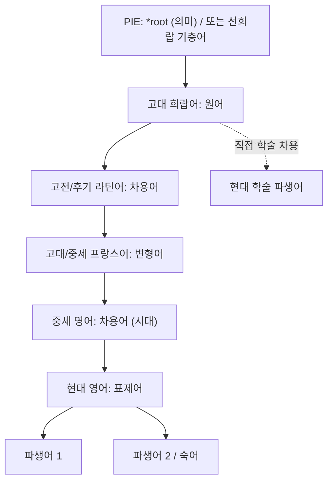

# English headword (한국어 표제어)

**[[greek-reading-guide|읽는 법]]**: 한국어 표제어 · **원어**: 그리스어 표제형 · **학술 전사**: *학술 전사*

<!-- 일반 산문에서는 위 읽는 법 행 뒤 한국어명을 기본으로 쓰고, 철자·방언·형태론 분석 또는 직접 인용에서만 원어와 학술 전사를 다시 제시합니다. -->

> **요약**: 현대 영어 단어의 핵심 정의, 원어 어원 및 전파 경로 요약 (1~2문장).

---

## 1. 어원 전파 계통도 (Etymological Transmission Tree)

---

## 2. 인구어(PIE) 및 희랍어 원어근 분석 (PIE & Proto-Greek Morphology)

> [!NOTE] 선희랍 기층어(Pre-Greek Substrate) 또는 어원 불명인 경우
> - 고대 희랍어 어휘 중 인도유럽어(PIE) 어근이 확인되지 않는 비-인도유럽어계 지중해 토착 기층어 기원인 경우, 무리하게 PIE 어근을 날조하지 않고 'Pre-Greek substrate (Beekes 2010)'로 정직하게 기술합니다.

- **PIE 조어 어근**: `*root-` (원초적 의미: ...) 또는 `Pre-Greek substrate (선희랍 기층어)`
- **음운 변화 및 법칙**:
  - PIE에서 고대 희랍어로의 음운 추이 (모음 교체 Ablaut, 자음 변화, 기식음화 등).
  - 게르만어군 동계어(Cognates: 고대 영어, 고대 고지독일어 등) 대조 (확인된 문헌 근거 필수).
- **고대 희랍어 형태론**:
  - 기본 어간, 접미사 결합 구조, 품사 변형 (명사/동사/형용사).

| 그리스어 실제형 | 학술 전사 | 표제형·형태론 | 한국어 풀이 | 근거 |
|:---|:---|:---|:---|:---|
| 실제형 | 같은 실제형의 전사 | 표제형, 격·수·성 또는 시제·태·법 | 문맥상 뜻 | 사전 또는 원전 위치 |

---

## 3. 호메로스 서사시 원전 용례 및 인명학 (Homeric Epic Context & Onomastics)

- **호메로스 텍스트 출전**:
  - _Il._ X.XXX / _Od._ Y.YYY (실제 검증된 권·행 번호 필수)
  - 긴 원문 인용 및 서사적 문맥 분석은 다음 순서를 사용합니다.
    - **번역**: 한국어 번역문
    - **원문**: *그리스어 실제 인용문*
    - **학술 전사**: *위 원문과 행 단위로 대응하는 실제형 전사*
- **정형구(Formula) 및 수식 칭호(Epithets)**:
  - 호메로스 시가 운율 내에서의 위치와 결합된 고유 수식어.
- **인명·신명 복합어 분석 (Onomastics, Eponym인 경우)**:
  - 인명의 어원적 구성 요소 합성 분석 (예: 어근 A + 어근 B).
  - 인물의 서사적 운명과 이름의 의미 간의 상징적 연관성.

---

## 4. 역사적 전파 및 수용사 경로 (Historical Transmission & Reception)

1. **고대 지중해 및 헬레니즘기**:
   - 고전 그리스어에서 코이네(Koine) 및 알렉산드리아 학파 용법.
2. **라틴어 수용 (Classical & Late Latin)**:
   - 로마 공화정/제정기 차용 및 음운/철자 적응 (문헌 확인된 라틴 어형).
3. **중세 및 노르만 프랑스어 경유 (Old/Middle French & Anglo-Norman)**:
   - 노르만 정복(1066) 이후 12~14세기 프랑스어 경유 차용 경로.
4. **초기 근대 영어 및 르네상스 학술 차용 (Early Modern English & Inkhorn Terms)**:
   - 16~17세기 르네상스 고전 부흥기 직수입 학술어 및 철자 재그리스화(Re-grecizing).

---

## 5. 음운 및 의미 변화사 (Phonological & Semantic Evolution)

### 5.1 음운 및 철자 변천
- 언어 단계별 음운 탈락, 약화, 강세 이동 및 철자 변화.

### 5.2 역사적 의미 전이 (Semantic Shifts)
- **원초적 물리 의미**: 고대 희랍어 단계에서의 구체적/물리적 의미.
- **의미 전이 메커니즘**:
  - 일반화(Generalization) / 특수화(Specialization).
  - 은유(Metaphor) / 환유(Metonymy).
  - 가치 상승(Amelioration) / 가치 하락(Pejoration).
- **현대적 추상화**: 현대 영어에 정착된 추상적·심리학적·철학적 개념화.

---

## 6. 현대 영어 파생어군 및 어휘 패밀리 (Modern English Cognates & Derivatives)

| 품사/형태 | 단어 (Word) | 의미 및 용법 | 최초 기록 (OED) | 확실성 |
|:---|:---|:---|:---|:---|
| 명사 (Noun) | *derivation* | ... | c. 1500 | 정설/문헌 입증 |
| 동사 (Verb) | *derivate* | ... | 16세기 | 정설/문헌 입증 |
| 형용사 (Adj) | *derivative* | ... | 14세기 | 정설/문헌 입증 |
| 부사 (Adv) | *derivatively*| ... | 17세기 | 정설/문헌 입증 |

- **주요 접두/접미 결합군**: (예: *anti-*, *syn-*, *-ic*, *-ism*, *-ology*)
- **전문 학술 용어(Terminology)**: 의학, 심리학, 문학비평, 자연과학 등에서의 용례.

---

## 7. 인명·신명 파생 고유명사 및 관용표현 (Eponymous Terms & Cultural Idioms)

  인명/신명 유래 단어(Eponym)인 경우 필수 작성, 일반 개념어인 경우 관련 관용표현 정리.

- **대표 관용구 및 숙어**:
  - *Idiom phrase*: 의미, 문화적 유래 및 현대적 용법.
- **보통명사화(Eponymization) 과정**:
  - 신화 속 인물의 고유한 성격이나 사건이 일반 명사/동사로 전환된 문화사적 계기.
- **문화적·문학적 인용 (Modern Reception)**:
  - 셰익스피어, 밀턴 등 근대 문학 및 대중문화에서의 수용.

---

## 8. 어원 증거 매트릭스 및 학술 출처 (Evidence Matrix & References)

| 어원 및 수용 명제 | 언어 층위 | 확실성 등급 | 출전 및 학술 문헌 근거 |
|:---|:---|:---|:---|
| PIE 조어 어근 재구 | PIE | 학술적 재구 | Beekes (2010), Pokorny (1959) |
| 선희랍 기층어 판정 | Pre-Greek | 선희랍 기층어 | Beekes (2010) EDG |
| 호메로스 원전 용례 | 고대 희랍어 | 정설/문헌 입증 | _Il._ X.XXX; Liddell-Scott-Jones (LSJ) |
| 라틴/노르만 전파 | 라틴/고대불어 | 정설/문헌 입증 | OED Online, Lewis & Short |
| 현대 의미 전이 | 현대 영어 | 정설/문헌 입증 | Oxford English Dictionary (OED) |
| 미해결/불확실 어원 | 고대/중세 | 근거 부족 (추가 조사 필요) | 학설 대립 중 (상세 사유 기술) |

> [!WARNING] 민간 어원(Folk Etymology) 및 주의 사항
> - 겉모습만 유사한 가짜 동계어나 대중적 오해에 대한 학술적 반박 서술.

> [!NOTE] 확실성 6대 등급 안내
> 1. **정설/문헌 입증(Established)**: OED, LSJ, Beekes 등에 명확히 입증된 사실.
> 2. **학술적 재구(Reconstructed)**: 비교언어학적 음운 법칙에 의해 널리 지지받는 PIE 형태.
> 3. **선희랍 기층어(Pre-Greek)**: 비-인도유럽어계 지중해 토착 기층어 기원 (Beekes 2010 등).
> 4. **논쟁적/이설 대립(Contested)**: 복수의 학설이 팽팽히 맞서는 경우 (양론 병기).
> 5. **근거 부족 / 추가 조사 필요(Pending)**: 문헌적 근거가 박약하거나 모르는 상태. 단정 서술 금지 및 status: review 유지.
> 6. **민간어원/허구(Spurious)**: 언어학적으로 허구인 대중적 오해.

---

## 관련 항목
- **호메로스 위키 연관 문서**:
  - [[entity-관련인물|관련 인물]]
  - [[concept-관련개념|관련 개념]]
- **동일 어원/동계어 단어 문서**:
  - [[word-동계어단어|동계어 표제어]]
  - [[words/index|호메로스 어원·영단어 사전 인덱스]]

