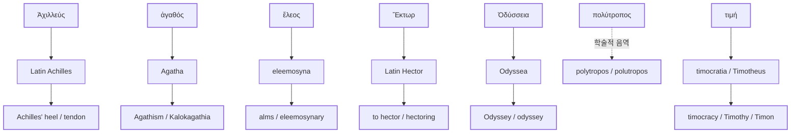

# 어원 사전

호메로스 서사시의 개념·인명이 고대 그리스어에서 현대 영어로 수용되는 실제 경로를 모은 사전입니다. 항목마다 직접 차용, 중간 언어 경유, 학술적 음역을 구분하며, 아래 링크는 작성된 문서만 가리킵니다.

각 정식 단어 페이지의 읽는 법 행과 표기 층위는 [[greek-reading-guide|그리스어 읽기 안내]] 및 `homeric-oriented-v1` 편집 규약에 맞춰 유지합니다.

---

## 작성된 수용 경로

현재 도식에는 작성된 단어 문서만 올립니다. Odyssey는 본문을 작성했지만 역사적 어원과 중세 전승 단계에 검토 상태가 남아 있으므로 문서 상태를 review로 유지합니다. Mentor, Siren, Nemesis, clue 등은 별도 문서가 생긴 뒤에 도식에 추가합니다.

---

## 현황

| 분류 | 문서 수 | 작성된 항목 |
|:---|:---:|:---|
| 개념·추상어 | 4 | [[word-agathos\|Agathos]], [[word-eleos\|Eleos]], [[word-polytropos\|Polytropos]], [[word-time\|Time]] |
| 인명·서명 유래어 | 3 | [[word-achilles\|Achilles]], [[word-hector\|Hector]], [[word-odyssey\|Odyssey]] |
| 총계 | 7 | — |

---

## 알파벳 색인

- [[word-achilles|Achilles]] — Ἀχιλλεύς. *Achilles' heel*, *Achilles tendon*, *Achillean*
- [[word-agathos|Agathos]] — ἀγαθός. *Agathism*, *Agatha*, *Kalokagathia*
- [[word-eleos|Eleos]] — ἔλεος. *alms*, *eleemosynary*, *Almoner*, *Kyrie eleison*
- [[word-hector|Hector]] — Ἕκτωρ. *to hector*, *hectoring*, *hectorism*
- [[word-odyssey|Odyssey]] — Ὀδύσσεια. *Odyssey*, *odyssey*, *Odyssean*
- [[word-polytropos|Polytropos]] — πολύτροπος. *polytropos*, *polutropos*; 번역어와 현대 학술 수용 검토
- [[word-time|Time]] — τιμή. *timocracy*, *timocratic*, *Timothy*, *Timon*, *timology*

---

## 관련 항목

- [[wiki/index|위키 색인]]
- [[overview|서사시 개요]]
- [[concept-time|티메]]
- [[concept-agathos|아가토스]]
- [[concept-eleos|엘레오스]]
- [[entity-achilles|아킬레우스]]
- [[entity-hector|헥토르]]
- [[entity-odysseus|오디세우스]]
