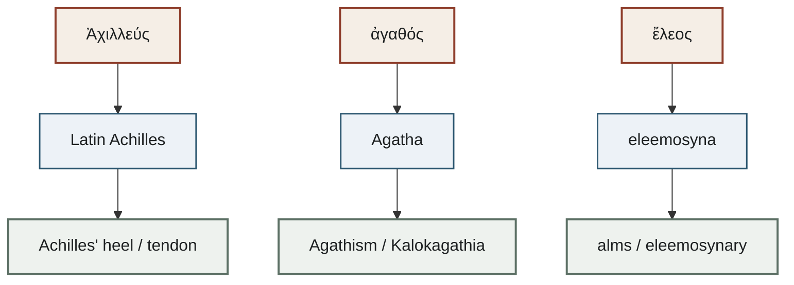

# 어원 사전

호메로스 서사시의 개념·인명이 그리스어에서 라틴어·프랑스어를 거쳐 현대 영어에 정착한 경로를 모은 사전입니다. 아래 링크는 작성된 항목만 가리킵니다.

---

## 작성된 수용 경로

아직 사전 본문이 없는 표제어(Mentor, Odyssey, Hector, Siren, Nemesis, clue 등)는 문서가 생긴 뒤에 도식에 올립니다.

---

## 현황

| 분류 | 문서 수 | 작성된 항목 |
|:---|:---:|:---|
| 개념·추상어 | 2 | [[word-agathos\|Agathos]], [[word-eleos\|Eleos]] |
| 인명 유래어 | 1 | [[word-achilles\|Achilles]] |
| 총계 | 3 | — |

---

## 알파벳 색인

- [[word-achilles|Achilles]] — Ἀχιλλεύς. *Achilles' heel*, *Achilles tendon*, *Achillean*
- [[word-agathos|Agathos]] — ἀγαθός. *Agathism*, *Agatha*, *Kalokagathia*
- [[word-eleos|Eleos]] — ἔλεος. *alms*, *eleemosynary*, *Almoner*, *Kyrie eleison*

---

## 관련 항목

- [[wiki/index|위키 색인]]
- [[wiki/overview|서사시 개요]]
- [[concept-agathos|아가토스]]
- [[concept-eleos|엘레오스]]
- [[entity-achilles|아킬레우스]]
