# 호메로스 어원·영단어 사전 인덱스 (Homer Word Index)

이 문서는 호메로스 서사시(_일리아스_, _오뒷세이아_)의 개념·어휘·인명(Eponym)이 고대 그리스어에서 라틴어, 프랑스어를 거쳐 현대 영어로 수용·정착된 어원 계보와 의미 변화를 집대성한 `words/` 사전의 전체 카탈로그입니다.

---

## 0. 호메로스 어원 및 어휘 수용사 계통도 (Etymology Graph)

```mermaid
graph TD
    classDef greek fill:#f5eee6,stroke:#8f3f2d,stroke-width:2px,color:#1d2021;
    classDef latin fill:#edf2f7,stroke:#2c5770,stroke-width:1.5px,color:#1d2021;
    classDef english fill:#eef2ee,stroke:#5c7065,stroke-width:2px,color:#1d2021;

    subgraph Homeric_Epic["호메로스 서사시 원전"]
        G_Achilles["Ἀχιλλεύ스 (Achilles)"]:::greek
        G_Mentor["Μέντωρ (Mentor)"]:::greek
        G_Odysseus["Ὀδυσσεύς (Odysseus)"]:::greek
        G_Hektor["Ἕκτωρ (Hector)"]:::greek
        G_Siren["Σειρήν (Seiren)"]:::greek
        G_Kleos["κλέος (Kleos: 명성/소문)"]:::greek
        G_Nemesis["Νέμεσις (Nemesis: 응징)"]:::greek
        G_Agathos["ἀγαθός (Agathos: 탁월함)"]:::greek
    end

    subgraph Classical_Transmission["고전 라틴어 / 불어 수용"]
        L_Achilles["Latin: Achilles"]:::latin
        L_Mentor["French: Télémaque (1699)"]:::latin
        L_Odyssea["Latin: Odyssea"]:::latin
        L_Hector["Middle French: Hector"]:::latin
        L_Sirena["Latin: Sirena"]:::latin
        L_Clew["Proto-Germanic: *kliwją"]:::latin
        L_Nemesis["Latin: Nemesis"]:::latin
        L_Agatha["Latin/French: Agatha"]:::latin
    end

    subgraph Modern_English["현대 영어 어휘 및 용법"]
        E_Achilles["[[word-achilles|Achilles]]<br/>(Achilles' heel / Achilles tendon)"]:::english
        E_Mentor["[[word-mentor|Mentor]]<br/>(Wise Counselor / Mentorship)"]:::english
        E_Odyssey["[[word-odyssey|Odyssey]]<br/>(Epic Journey / Spiritual Quest)"]:::english
        E_Hector["[[word-hector|Hector]]<br/>(Bully / Intimidate)"]:::english
        E_Siren["[[word-siren|Siren]]<br/>(Alarm device / Femme fatale)"]:::english
        E_Clue["[[word-clue|Clue]]<br/>(Ball of thread -> Key evidence)"]:::english
        E_Nemesis["[[word-nemesis|Nemesis]]<br/>(Archenemy / Inevitable downfall)"]:::english
        E_Agathos["[[word-agathos|Agathos]]<br/>(Agathism / Agatha / Kalokagathia)"]:::english
    end

    G_Achilles --> L_Achilles --> E_Achilles
    G_Mentor --> L_Mentor --> E_Mentor
    G_Odysseus --> L_Odyssea --> E_Odyssey
    G_Hektor --> L_Hector --> E_Hector
    G_Siren --> L_Sirena --> E_Siren
    G_Kleos --> L_Clew --> E_Clue
    G_Nemesis --> L_Nemesis --> E_Nemesis
    G_Agathos --> L_Agatha --> E_Agathos
```

---

## 1. 사전 통계 및 현황

| 분류 | 문서 수 | 대표 예시 |
|:---|:---:|:---|
| **개념·추상어 (Concept Words)** | **1** | [[word-agathos\|agathos]], _chaos, harmony, psyche, nemesis_ |
| **인명·신명 유래어 (Eponyms)** | **1** | [[word-achilles\|achilles]], _mentor, odyssey, hector, tantalus_ |
| **핵심 다중 어근 (Core Roots)** | 0 | _logos/logic, kleos/clue, physis/physics_ |
| **선희랍 기층어/어원 불명 (Pre-Greek Substrate)** | **1** | [[word-agathos\|agathos]], _labyrinth, hyacinth, narcissus_ |
| **총 단어 문서 수** | **2** | - |

---

## 2. 알파벳순 전체 색인 (Alphabetical Index)

### A

- [[word-achilles|achilles]] — 아킬레우스(Ἀχιλλεύς) 유래, _Achilles' heel_, _Achilles tendon_, _Achillean_ (인명 유래어)
- [[word-agathos|agathos]] — 아가토스(ἀγαθός) 유래, 선희랍 기층어, _Agathism_, _Agatha_, _Kalokagathia_, _Aristocracy_ (개념·추상어)

### C

- _(작성 대기)_

### H

- _(작성 대기)_

### L

- _(작성 대기)_

### M

- _(작성 대기)_

### N

- _(작성 대기)_

### O

- _(작성 대기)_

### P

- _(작성 대기)_

### T

- _(작성 대기)_

---

## 3. 어원 계통별 분류 (By Etymological Roots)

### 3.1 영웅 및 신명 파생 어휘 (Eponymous Vocabulary)

- [[word-achilles|achilles]] _(아킬레우스 유래: Achilles' heel, Achilles tendon, Achillean)_
- [[word-mentor|mentor]] _(예정: 멘토르 유래, 조언자/스승)_
- [[word-odyssey|odyssey]] _(예정: 오디세우스 유래, 장기간의 파란만장한 여정)_
- [[word-hector|hector]] _(예정: 헥토르 유래, 괴롭히다/위협하다)_
- [[word-tantalize|tantalize]] _(예정: 탄탈로스 유래, 감질나게 하다)_
- [[word-siren|siren]] _(예정: 세이렌 유래, 매혹적인 유혹자/경보장치)_

### 3.2 호메로스 핵심 윤리·철학 개념어 파생 (Ethical & Philosophical Concepts)

- [[word-chaos|chaos]] _(예정: 카오스 유래, 혼돈/무질서)_
- [[word-harmony|harmony]] _(예정: 하르모니아 유래, 조화/화음)_
- [[word-psyche|psyche]] _(예정: 프쉬케 유래, 정신/심리)_
- [[word-nemesis|nemesis]] _(예정: 네메시스 유래, 천벌/강적)_
- [[word-clue|clue]] _(예정: 클레오스(kleos) 및 clew 유래, 실마리/단서)_

### 3.3 선희랍 기층어 및 비-PIE 어원 어휘 (Pre-Greek Substrate & Non-IE Roots)

- [[word-labyrinth|labyrinth]] _(예정: 미노아/선희랍 기층어, 미궁)_
- [[word-ocean|ocean]] _(예정: 오케아노스(Ὠκεανός) 기층어 유래, 대양)_
- [[word-hyacinth|hyacinth]] _(예정: 히아킨토스(Ὑάκινθος) 기층어 접미사 -nth- 유래)_

---

## 4. 단어 추가 및 분석 워크플로

새로운 단어 문서를 분석·추가할 때는 `/homer-word <단어명>` 스킬을 실행합니다.

1. **표준 템플릿**: [`_template.md`](file:///c:/Vault/Homer_wiki/words/_template.md) 기반 작성.
2. **7인 적대적 평의회 검증**: 비교어원학, 고전문헌학, 라틴·불어수용사, 역사의미론, 사전편찬학, 실용회의론, 정합성검증관 공방.
3. **증거 원장 및 계통도**: Mermaid 어원 계통도 및 증거 매트릭스 필수 완비.
4. **엄격한 환각 차단 및 모름 처리**: 근거 없는 가짜 어근 날조 금지, 미확인 시 `근거 부족 / 추가 조사 필요`로 서술 유보 및 `status: review` 유지.
5. **동기화**: 문서 작성 후 본 인덱스와 `wiki/log.md`를 갱신.
