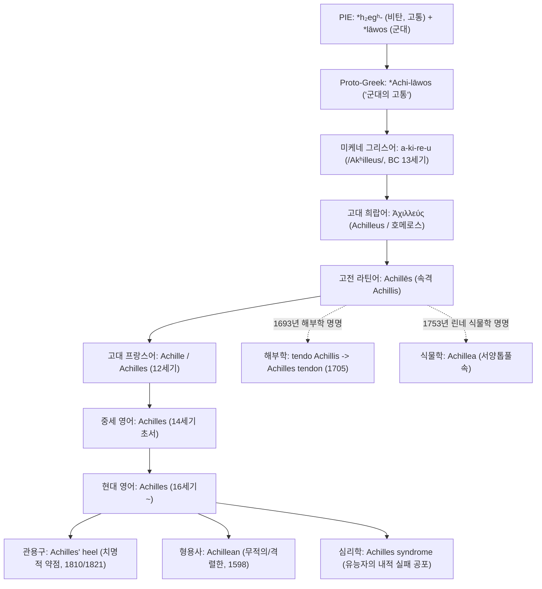
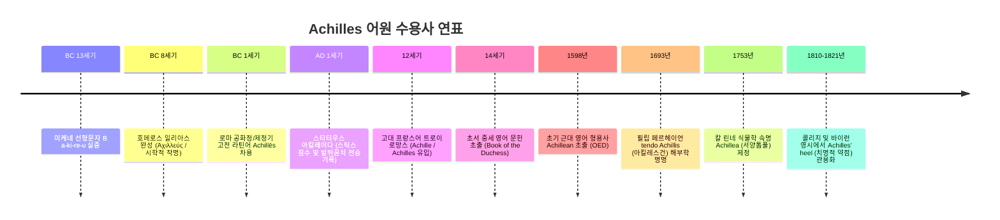
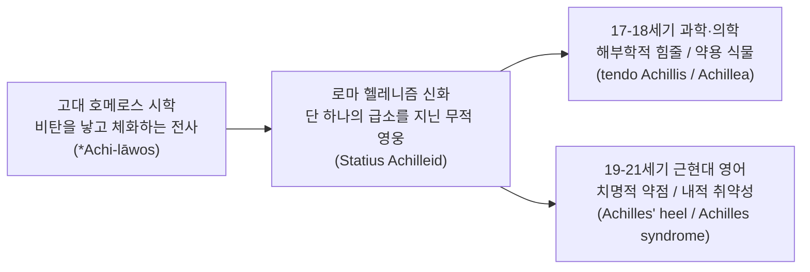

# Achilles (아킬레우스)

**[[greek-reading-guide|읽는 법]]**: 아킬레우스 · **원어**: Ἀχιλλεύς · **학술 전사**: *Akhilleús*

> **요약**: 호메로스 서사시 『일리아스』의 주인공 영웅 아킬레우스(Ἀχιλλεύς)의 이름에서 유래한 인명 유래어(Eponym)로, 고대 그리스어 시학의 "군대에게 비탄을 가져오는 자"(_Achi-lāwos_)에서 출발하여 라틴어와 중세 프랑스어를 거쳐 현대 영어의 고유명사, 문학적 형용사(_Achillean_), 해부학 전문어(_Achilles tendon_), 식물학 속명(_Achillea_), 그리고 치명적 취약점을 뜻하는 핵심 관용구(_Achilles' heel_)로 정착 및 다각화되었습니다.

---

## 1. 어원 전파 계통도 (Etymological Transmission Tree)

---

## 2. 인구어(PIE) 및 희랍어 원어근 분석 (PIE & Proto-Greek Morphology)

### 2.1 인도유럽조어(PIE) 어근 및 복합 형태론

- **전반부 어근**: 인도유럽조어 **`*h₂egʰ-`** (비탄, 고통, 괴로움, 두려움)
  - 고대 희랍어 중성 s-어간 명사 **ἄχος** (_achos_, 고통, 물리적·정신적 비탄)로 발전 (Pokorny IEW 7–8, Beekes EDG 183).
  - 게르만어군 동계어: 고대 영어 _ege_ (공포, 경외) → 현대 영어 **awe**, **awful**, **awesome**, 고대 노르드어 _uggr_ (두려움) → 현대 영어 **ugly**.
- **후반부 어근**: 원시 그리스어 **`*lāwos`** (전사 집단, 군대, 무장한 백성)
  - 고대 희랍어 **λαός** (_laos_, 군대, 백성; 아티카 방언 λεώς, 미케네 선형문자 B _ra-wo_). 히타이트어 _lahha-_ (원정, 군사 행동)와 비교됨.
- **합성어 원형 재구**: **_Achi-lāwos_ ("자신의 군대에게 비탄을 가져오는 자" 또는 "군대의 고통을 구현하는 자")**
  - 고전문헌학자 그레고리 나지(Gregory Nagy 1979) 및 레너드 파머(L. R. Palmer 1963)의 분석에 따르면, *Achi-lāwos*에서 반모음 _w_(디감마 ϝ)가 탈락하고 친애적/단축형 자음 중복(hypocoristic doubling)을 거쳐 호메로스 서사시의 **Ἀχιλλεύς** (_Achilleus_) 및 운율적 단축형 **Ἀχιλεύς** (_Achileus_)가 성립되었습니다.

### 2.2 미케네 그리스어(Linear B) 선행 증거

- 기원전 13세기 크노소스(Knossos, KN V 151) 및 필로스(Pylos, PY Fn 79, PY Aq 64) 점토판에서 인명 **`a-ki-re-u`** (/Akʰilleus/ 또는 /Akʰileus/)가 실증됩니다.
- 이는 아킬레우스라는 명칭이 호메로스 서사시 창작 이전 청동기 미케네 문명기부터 실존 인명으로 널리 사용되었음을 입증합니다.

> [!NOTE] 선희랍 기층어(Pre-Greek Substrate) 및 형태론적 논쟁
>
> - 로베르트 베이케스(Robert Beekes 2010, EDG 183)는 _achos_ + *laos*의 합성어 시학이 호메로스 텍스트 내부에서 완벽한 상징성을 지님을 인정하면서도, 미케네어 인명 중 접미사 **`-εύς`**(_-eus_)를 취하는 다수의 지소사/단축형 어휘가 비-인도유럽어계 선희랍 기층어의 영향을 받았을 가능성을 배제하지 않습니다.

---

## 3. 호메로스 서사시 원전 용례 및 인명학 (Homeric Epic Context & Onomastics)

### 3.1 서사시 텍스트와 시학적 명명 (*Achos*와 *Achilleus*의 조응)

호메로스 서사시에서 아킬레우스의 이름은 단순한 고유명사를 넘어, 작품 전체의 서사적 동력인 분노([[concept-menis|Menis]])와 고통(_achos_)의 연쇄를 암시하는 핵심 시학적 기제로 작동합니다:

1. **분노와 고통의 발단 (_Il._ 1.1–2, 1.188)**:
   - 서사시 서두에서 시인은 아킬레우스의 분노가 아카이아인들에게 안겨준 수많은 고통(_algea_, ἄλγεα)을 노래하며, 아가멤논에게 모욕당한 아킬레우스 가슴에 고통(_achos_)이 임함을 선언합니다:
     - "그러자 펠레우스의 아들에게 고통(_achos_)이 엄습했고, 털이 덥수룩한 가슴속 심장이 두 갈래로 나뉘어 흔들렸다." (_Il._ 1.188)
2. **군대 전체로의 비탄 확산 (_Il._ 1.240–244, 16.21–35)**:
   - 아킬레우스의 전선 이탈로 인해 아카이아 전사 집단(_laos_) 전체가 헥토르의 공격 앞에 파멸적 *achos*를 겪게 되며, 16권에서 파트로클로스는 아카이아 진영을 덮친 비탄을 호소하며 참전을 간청합니다.
3. **파트로클로스의 죽음과 검은 비탄 (_Il._ 18.22–64)**:
   - 파트로클로스의 전사 소식을 들은 아킬레우스를 "비탄의 검은 구름(_ton d' acheos nephelê ekalupse melaina_)"이 덮치며, 군대에게 안겨주었던 고통이 마침내 아킬레우스 자신에게 절대적 파멸의 슬픔으로 귀환합니다.
4. **24권 화해와 보편적 인간 조건의 수용 (_Il._ 24.507–551)**:
   - 프리아모스와 함께 울며 제우스의 두 항아리(Pithoi) 우화를 들려주는 장면에서, 아킬레우스는 사적 분노를 초월하여 유한한 필멸자의 보편적 실존적 비탄(_achos_)을 연민([[concept-eleos|Eleos]])으로 승화시킵니다.

### 3.2 고유 정형구(Formula) 및 운율 칭호

호메로스 육보격 운율 체계에서 아킬레우스는 시행 내 위치와 격 변화에 맞춰 결합된 고유 수식어를 갖습니다:

| 희랍어 정형구              | 학술 전사                 | 의미 및 운율적 배치                              |
| :------------------------- | :------------------------ | :----------------------------------------------- |
| **πόδας ὠκὺς Ἀχιλλεύς**    | *pódas ōkùs Akhilleús*    | 발이 빠른 아킬레우스 (시행 종결부 여성 쉼표 뒤)  |
| **ποδάρκης δῖος Ἀχιλλεύς** | *podárkēs dī̂os Akhilleús* | 발이 굳센 신 같은 아킬레우스 (육보격 종결부)     |
| **Πηληϊάδης / Πηλεΐδης**   | *Pēlēïádēs / Pēleḯdēs*    | 펠레우스의 아들 (부칭, 혈통과 필멸성 환기)       |
| **Αἰακίδης**               | *Aiakídēs*                | 아이아코스의 손자 (조부칭, 정의로운 신화적 혈통) |
| **ῥηξήνωρ**                | *rhēksḗnōr*              | 전열을 부수는 자 (압도적 전투 돌파력)            |

---

## 4. 역사적 전파 및 수용사 경로 (Historical Transmission & Reception)

1. **고대 그리스에서 로마 라틴어로의 차용**:
   - 희랍어 Ἀχιλλεύς는 로마 공화정 및 제정기 고전 라틴어 **`Achillēs`** (속격 _Achillis_)로 수용되었으며, 베르길리우스의 『아이네이스』와 오비디우스의 『변신이야기』를 통해 서구 문학의 표준 영웅상으로 정착되었습니다.
2. **중세 프랑스어 및 앵글로-노르만 유입 (12세기)**:
   - 노르만 정복 이후 중세 기사도 문학이 번성하면서, 브누아 드 생트-모르(Benoît de Sainte-Maure)의 『트로이 로망스』(_Roman de Troie_, c. 1160)를 통해 프랑스어 형태 **`Achille`** 및 **`Achilles`**가 널리 보급되었습니다.
3. **중세 영어 정착 (14세기)**:
   - 제프리 초서(Geoffrey Chaucer)가 『공작부인의 책』(_The Book of the Duchess_, c. 1369)과 『트로일루스와 크리세이드』(_Troilus and Criseyde_, c. 1385)에서 *Achilles*를 차용하여 영어 어휘 체계에 확고히 정착시켰습니다.
4. **초기 근대 및 학술 르네상스 (16~18세기)**:
   - 르네상스 고전 부흥기를 거치며 셰익스피어의 『트로일루스와 크레시다』(1602) 등에서 영웅적 무용과 파괴적 분노를 대변하는 상징어로 사용되었습니다.
   - 1693년 네덜란드의 해부학자 필립 페르헤이언(Philip Verheyen)이 자신의 다리를 절단 수술한 뒤 발꿈치 힘줄을 관찰하여 **`tendo Achillis`**로 명명하였고, 이것이 1705년경 영어 **`Achilles tendon`**으로 정착되었습니다.
   - 1753년 스웨덴의 박물학자 칼 린네(Carl Linnaeus)가 트로이 전쟁 당시 부상병을 치료했다는 전설(Pliny, _NH_ 25.42)에 기반하여 국화과 서양톱풀속의 학명을 **`Achillea`**로 공식 명명했습니다.

---

## 5. 음운 및 의미 변화사 (Phonological & Semantic Evolution)

### 5.1 음운 변천 단계

- **Proto-Greek**: `*Achi-lāwos` (어근 _achos_ + _lāwos_)
- **Archaic Greek**: 반모음 _w_(ϝ) 탈락 및 자음 중복 → `Ἀχιλλεύς` (_Akʰil-leus_)
- **Classical Latin**: 그리스어 이중모음 _-eus_ 및 유기음 _ch_ 수용 → `Achillēs` (/aˈkʰil.leːs/)
- **Old French**: 라틴어 곡용 탈락 및 모음화 → `Achille` (/a.ʃil/) / `Achilles`
- **Middle/Modern English**: 차용 및 강세 전방 이동 → `Achilles` (/əˈkɪliːz/)

### 5.2 역사적 의미 전이 (Semantic Shifts)

1. **원초적 시학적 의미 (Archaic Epic Context)**:
   - 전사 집단에게 고통과 비탄(_achos_)을 안기는 동시에 스스로도 비극적 죽음의 운명을 짊어진 영웅.
2. **신화적 변형과 물리적 무적성 (Hellenistic/Roman Shift)**:
   - 1세기 로마 시인 스타티우스의 서사시를 통해 "스틱스 강물에 담겨 칼과 창이 뚫지 못하는 육체를 얻었으나, 발뒤꿈치만은 젖지 않아 치명적 급소로 남은 영웅"이라는 전승이 대중화됨.
3. **보통명사화 및 은유적 추상화 (Modern Eponymization)**:
   - 19세기 영미 문학(바이런, 콜리지)을 통해 물리적 발뒤꿈치에서 **"아무리 강대하고 완벽해 보이는 사람, 조직, 국가, 군사 시스템이라도 붕괴로 이끌 수 있는 결정적이고 치명적인 단 하나의 취약점"**으로 은유적·환유적 확장이 완성됨.

---

## 6. 현대 영어 파생어군 및 어휘 패밀리 (Modern English Cognates & Derivatives)

### 6.1 파생 어휘 패밀리 (Word Family)

| 단어 (Word)         |   품사   | 현대적 의미 및 용법                                  |  최초 기록 (OED)   |  확실성 등급   |
| :------------------ | :------: | :--------------------------------------------------- | :----------------: | :------------: |
| **Achilles**        | 고유명사 | 아킬레우스; 영웅적 전사; (비유) 당대 최강의 용사     | c. 1369 (Chaucer)  | 정설/문헌 입증 |
| **Achillean**       |  형용사  | 아킬레우스의; 무적의, 맹렬한, 불굴의 용기를 지닌     |       1598년       | 정설/문헌 입증 |
| **Achilles' heel**  |  명사구  | (완벽한 구조 속의) 치명적인 약점이나 급소            | 1810년 (Coleridge) | 정설/문헌 입증 |
| **Achilles tendon** |  명사구  | (해부학) 아킬레스건, 종골건 (발꿈치뼈 힘줄)          |     c. 1705년      | 정설/문헌 입증 |
| **Achilles reflex** |  명사구  | (신경학) 아킬레스건 반사 (발목 반사, S1 신경근 검사) |      1880년대      | 정설/문헌 입증 |
| **Achillea**        | 고유명사 | (식물학) 서양톱풀속 (지혈 및 상처 치유 약용 식물)    | 1753년 (Linnaeus)  | 정설/문헌 입증 |
| **Achilleid**       | 고유명사 | 스타티우스가 지은 미완성 서사시 『아킬레이다』       |       17세기       | 정설/문헌 입증 |

### 6.2 PIE 어근 `*h₂egʰ-` 계통의 영어 동계어 (Cognate Family)

아킬레우스 이름의 어근 _achos_(ἄχος)와 동일한 인도유럽조어 뿌리 `*h₂egʰ-`에서 게르만어군을 거쳐 파생된 현대 영어 단어들:

- **awe**: 경외감, 두려움 (고대 영어 _ege_ → 중세 영어 _awe_)
- **awful**: 끔찍한, 대단한 (_awe_ + _-ful_)
- **awesome**: 경탄할 만한, 엄청난 (_awe_ + _-some_)
- **ugly**: 추악한, 험악한 (고대 노르드어 _uggr_ [공포] + _-ligr_ [~다운])

---

## 7. 인명·신명 파생 고유명사 및 관용표현 (Eponymous Terms & Cultural Idioms)

### 7.1 주요 관용구 및 문화적 숙어

- **Achilles' heel (아킬레스건 / 치명적 약점)**:
  - **정의**: 전체적으로는 강력하거나 완벽해 보이지만, 공격당할 경우 전체를 파멸에 이르게 할 수 있는 유일하고 치명적인 취약점.
  - **용례**: _"Cybersecurity is the digital economy's Achilles' heel."_ (사이버 보안은 디지털 경제의 아킬레스건이다.)
  - **문학적 초출**: 로드 바이런(Lord Byron)의 풍자시 『돈 주안』(_Don Juan_, 1821, Canto IV):
    - _"The Roman friend of Rome's great Achilles... his only vulnerable part."_

### 7.2 전문 학술 분야에서의 Eponymization

1. **의학 및 해부학 (_Achilles tendon & Achilles reflex_)**:
   - 인체에서 가장 크고 강력한 힘줄인 종골건(Calcaneal tendon)을 지칭하며, 파열 시 보행이 불가능해지는 치명성을 신화 속 급소와 결합.
2. **정신의학 및 심리학 (_Achilles Syndrome_)**:
   - 심리학자 페트루스카 클락슨(Petruska Clarkson 1994)이 명명한 개념으로, 외적으로는 높은 성취를 이루고 유능해 보이지만 내적으로는 자신의 결함이 탄로 날까 극심한 두려움과 불안을 겪는 상태(가면 증후군과 유사).

---

## 8. 어원 증거 매트릭스 및 학술 출처 (Evidence Matrix & References)

| 어원 및 수용 명제                      | 언어 층위       | 확실성 등급           | 출전 및 학술 문헌 근거                                                    |
| :------------------------------------- | :-------------- | :-------------------- | :------------------------------------------------------------------------ |
| PIE 어근 `*h₂egʰ-` 재구                | PIE             | 학술적 재구           | Beekes (2010) EDG 183; Pokorny (1959) IEW 7–8; Rix (2001) LIV 255         |
| Proto-Greek `*lāwos` 어원              | Proto-Greek     | 학술적 재구           | Beekes (2010) EDG 835; Chantraine (1968) DELG 619                         |
| 미케네 그리스어 `a-ki-re-u` 실증       | Linear B        | 정설/문헌 입증        | Knossos (KN V 151), Pylos (PY Fn 79, PY Aq 64); Ventris & Chadwick (1973) |
| 합성어 시학 _Achi-lāwos_               | 고대 희랍어     | 정설/문헌 입증        | Gregory Nagy (1979) _The Best of the Achaeans_, pp. 69–83                 |
| 호메로스 원전 내 _achos_ 연동 용례     | 고대 희랍어     | 정설/문헌 입증        | _Il._ 1.1–2, 1.188, 1.240–244, 16.21–35, 18.22–64, 24.507–551             |
| 고전 라틴어 _Achillēs_ 차용            | Classical Latin | 정설/문헌 입증        | Lewis & Short; Oxford Latin Dictionary (OLD)                              |
| 스타티우스 발뒤꿈치 전승 기록          | Roman Latin     | 후대 수용 (고대 문헌) | Statius, _Achilleid_ 1.133–134                                            |
| 중세 프랑스어 _Achille_ 경유           | Old French      | 정설/문헌 입증        | Benoît de Sainte-Maure (c. 1160) _Roman de Troie_; Godefroy               |
| 중세 영어 _Achilles_ 초출              | Middle English  | 정설/문헌 입증        | Chaucer (c. 1369) _Book of the Duchess_ 1081; MED                         |
| 해부학 _tendo Achillis_ 명명           | Modern Latin    | 정설/문헌 입증        | Philip Verheyen (1693) _Corporis Humani Anatomia_; OED Online             |
| 식물학 _Achillea_ 명명                 | Modern Latin    | 정설/문헌 입증        | Carl Linnaeus (1753) _Species Plantarum_ 2:896; Pliny _NH_ 25.42          |
| 관용구 _Achilles' heel_ 현대 영어 정착 | Modern English  | 정설/문헌 입증        | S. T. Coleridge (1810); Lord Byron (1821) _Don Juan_; OED Online          |

> [!WARNING] 민간 어원(Folk Etymology) 및 전승 차이 주의
>
> 1. **고대 민간 어원설(Folk Etymology) 기각**:
>    - 아폴로도로스(Apollodorus, _Bibliotheca_ 3.13.6)는 아킬레우스의 이름이 부정 접두사 _a-_(ἀ-)와 입술을 뜻하는 _cheilos_(χεῖλος)가 결합하여 "입술을 젖가슴에 대지 않은 자(젖을 빨지 않은 자)"에서 유래했다고 주장했으나, 이는 역사비교언어학 및 음운론적으로 명백히 허구인 사후적 민간 어원설입니다.
> 2. **호메로스 원전과 스타티우스 전승의 준별**:
>    - 호메로스의 『일리아스』에서 아킬레우스는 완전히 상처 입을 수 있고 피를 흘리며 전사할 운명을 지닌 필멸의 영웅입니다. 스틱스(Styx) 강물 침수와 발뒤꿈치 불사신 전승은 호메로스 텍스트에 일체 존재하지 않으며, 1세기 로마 시인 스타티우스의 『아킬레이다』에서 처음 확립된 후대 전승입니다.

---

## 관련 항목
- **호메로스 위키 연관 엔티티 및 개념 문서**:
  - [[entity-achilles|아킬레우스 (Achilles / Ἀχιλλεύς)]] — 일리아스의 주인공 엔티티 심층 문서
  - [[concept-menis|메니스 (Menis / μῆνις)]] — 아킬레우스의 신적 분노
  - [[concept-kleos|클레오스 (Kleos / κλέος)]] — 영원히 사라지지 않는 명성
  - [[concept-eleos|엘레오스 (Eleos / ἔλεος)]] — 24권 프리아모스와 나눈 비극적 연민
  - [[concept-hikesia|히케시아 (Hikesia / ἱκεσία)]] — 프리아모스의 거룩한 탄원 의례
  - [[concept-epic-cycle|서사시환 (Epic Cycle)]] — 트로이 전쟁 전승 및 아킬레우스의 사후 전승
- **단어 사전 색인 문서**:
  - [[words/index|호메로스 어원·영단어 사전 인덱스]]
