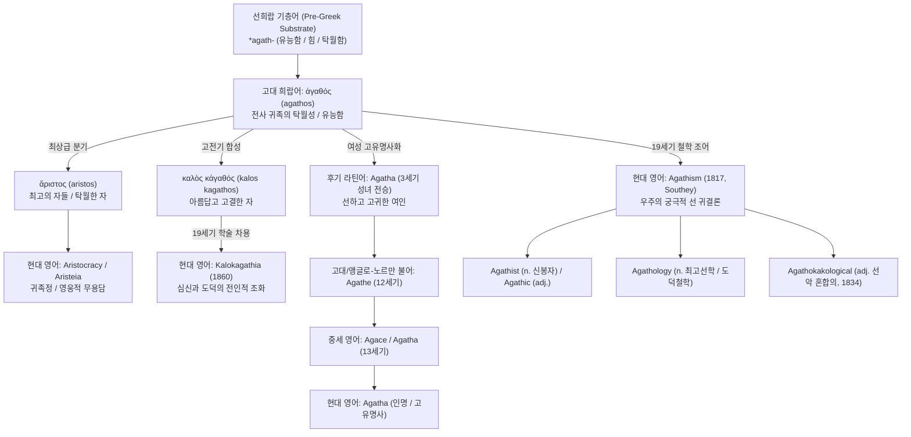
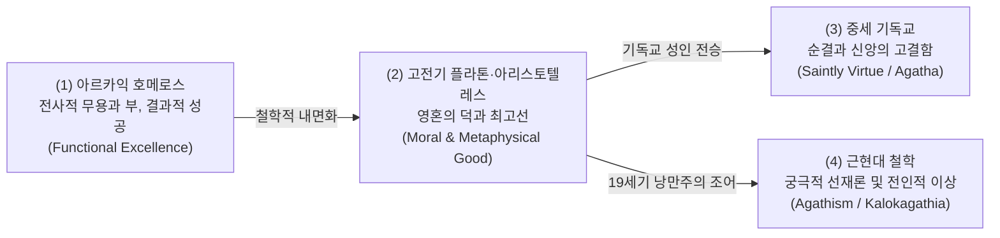

# Agathos (아가토스 / ἀγαθός)

> **요약**: 고대 그리스어의 핵심 가치 칭찬어 **아가토스(ἀγαθός, *agathos*)**는 전사 귀족의 기능적 탁월성과 결과주의적 성공을 뜻하는 선희랍 기층어 기원의 어휘로, 라틴어와 앵글로-노르만 프랑스어를 거쳐 여성 인명 **Agatha**로 수용되었으며, 19세기 근대 영어에서 철학적 신조어 **Agathism**(궁극적 선재론) 및 고전 이상 **Kalokagathia**(미와 선의 일치)로 학술 어휘화되었습니다.

---

## 1. 어원 전파 계통도 (Etymological Transmission Tree)

---

## 2. 인구어(PIE) 및 희랍어 원어근 분석 (PIE & Proto-Greek Morphology)

> [!NOTE] 선희랍 기층어(Pre-Greek Substrate) 판정
> - 고전학 및 비교언어학의 정설(Beekes 2010: 7–8, Chantraine 1968: 4–5, Frisk 1.5–6)에 따르면, ἀγαθός는 인도유럽조어(PIE) 어근으로 소급되지 않는 **비-인도유럽어계 지중해 토착 기층어(Pre-Greek substrate)** 기원입니다. 어간 구조(*-ath-*)와 불규칙 비교급 군(群)의 양상은 토착 지중해 언어에서 전사 계급의 찬사어로 차용되었음을 시사합니다.

> [!WARNING] 민간 어원(Folk Etymology) 및 가짜 동계어 주의
> - **영어 good (PIE *gʰedʰ-)과의 무관성**: 독일어 *gut*, 영어 *good*과 겉모습이 유사하여 동계어로 오인하기 쉬우나, 음운학적으로 완전히 무관한 가짜 동계어(False cognate)입니다.
> - **보석 아게이트(Agate)와의 무관성**: 보석 *agate*는 시칠리아의 아카테스 강(Ἀχάτης, Achates)에서 유래한 지명 어휘로, *agathos*와 어원적 연관이 없습니다.
> - **아가판서스(Agapanthus)와의 무관성**: 관상용 식물 *agapanthus*는 사랑을 뜻하는 *agape*(ἀγάπη)와 꽃을 뜻하는 *anthos*(ἄνθος)의 합성어로 전혀 다른 어근입니다.

- **원어 표기**: ἀγαθός (*agathos*, 남성), ἀγαθή (*agathe*, 여성), ἀγαθόν (*agathon*, 중성)
- **보충 비교급·최상급 어간 계통**:
  - 비교급: ἀμείνων (*ameinōn*, 더 유익한/뛰어난), κρείσσων (*kreissōn*, 더 강한/우월한), βελτίων (*beltiōn*, 더 나은)
  - 최상급: ἄριστος (*aristos*, 가장 뛰어난 전사 / *aristocracy*의 어원), κράτιστος (*kratistos*, 가장 강력한), βέλτιστος (*beltistos*, 최선의)

---

## 3. 호메로스 서사시 원전 용례 및 문맥 (Homeric Epic Context)

호메로스 서사시에서 *agathos*는 현대적 의미의 도덕적 선인이 아니라, **'전투에서 승리하고 가문과 공동체를 지켜내는 유능한 귀족 장수'**를 가리킵니다.

### 3.1 헥토르의 영웅적 아가토스 책무 (_Il._ 6.444–446)
- **원문**:
  ἀλλὰ μάλ᾽ αἰνῶς / αἰδέομαι Τρῶας καὶ Τρῳάδας ἑλκεσιπέπλους, / αἴ κε κακὸς ὣς νόσφιν ἀλυσκάζω πολέμοιο· / οὐδέ με θυμὸς ἄνωγεν, ἐπεὶ μάθον ἔμμεναι ἐσθλὸς / αἰεὶ καὶ πρώτοισι μετὰ Τρώεσσι μάχεσθαι.

- **번역**: "그러나 내가 만일 카코스(*kakos*, 무능한 비겁자)처럼 싸움터에서 물러선다면 트로이아의 남녀들을 뵙기에 너무나 부끄럽소(*aideomai*). 내 마음 또한 뒤로 물러서기를 허락지 않으니, 나는 언제나 트로이아인들의 맨 앞줄에서 싸우며, 부친의 큰 영예와 내 자신의 명예를 지키는 훌륭한 자(*esthlos / agathos*)가 되는 법을 배웠기 때문이오."

- **문전문맥 분석**: 헥토르는 아가토스가 단순히 선천적 혈통에 머무는 것이 아니라, 전열의 맨 앞에서 목숨을 걸고 싸우는 지속적인 훈련과 실천(*mathon*)을 통해 증명되는 결과주의적 규범임을 명확히 보여줍니다.

### 3.2 에우멜로스 전차 경주와 아리스토스 논쟁 (_Il._ 23.536–538)
- **원문**:
  κάλλιστος μὲν ἄριστος ἀνὴρ ἐλαύνει μώνυχας ἵππους· / ἀλλ᾽ ἄγε δή οἱ δῶμεν ἀέθλιον, ὡς ἐπιεικές, / δεύτερ᾽.

- **번역**: "가장 훌륭한 자(*aristos anēr*)가 말들을 꼴찌로 몰고 왔구나. 자, 순리에 맞게 그에게 2등 상을 주도록 하자."

- **문전문맥 분석**: 아킬레우스가 꼴찌로 들어온 에우멜로스를 '아리스토스(가장 뛰어난 아가토스)'라는 본질적 신분 지위에 근거해 포상하려 하자 안틸로코스가 반발하는 장면으로, 귀족의 내재적 지위와 실제 경기 결과 사이의 긴장을 극적으로 노출합니다.

---

## 4. 역사적 전파 및 수용사 경로 (Historical Transmission & Reception)

### 4.1 고전기 그리스 철학: 형이상학적 '최고선'과 '칼로카가티아'
- **플라톤의 이데아론**: 플라톤은 『국가』에서 아가토스를 전사적 무용에서 우주 만물의 궁극적 원리이자 태양에 비견되는 **'선의 이데아(Idea tou Agathou, To Agathon)'**로 형이상학화했습니다.
- **칼로카가티아(Kalokagathia)**: '아름다움(kalos)'과 '고결함(agathos)'이 완벽히 결합된 아테네 시민 귀족의 전인적 신체·도덕 이상으로 정착했습니다.

### 4.2 후기 라틴어 및 중세 기독교 성인명 (Agatha)
- 3세기 시칠리아 카타니아의 순교 성녀인 **성 아가타(Saint Agatha)**의 숭경과 함께 라틴 교회 전역으로 이름이 확산되었습니다.
- 1066년 노르만 정복 이후 12세기 앵글로-노르만 프랑스어(*Agathe*)를 거쳐 중세 영어에 여성 세례명 **Agatha**로 확고히 정착했습니다.

### 4.3 19세기 낭만주의 및 빅토리아조 철학 조어 (Agathism)
- **로버트 사우디의 조어 (1817)**: 영국의 낭만주의 계관시인 로버트 사우디(Robert Southey)는 1817년 서간집에서 **아가티즘(Agathism)**이라는 단어를 최초로 주조했습니다.
- 사우디는 이를 단순한 낙관주의(Optimism)와 구별하여, **"현재의 사건이나 수단에는 악과 고통이 존재할지라도, 우주의 섭리는 궁극적으로 선(Good)을 향해 귀결된다"**는 신정론적 철학 개념으로 정의했습니다 (OED 초출).

---

## 5. 음운 및 의미 변화사 (Phonological & Semantic Evolution)

### 5.1 음운 변천 단계
- **선희랍 기층어**: `*agath-` (유능한, 강력한)
- **고대 희랍어**: ἀγαθός (*agathós*, 어말 고조 악센트) -> ἄγαθος (*agathos*, 헬레니즘/비잔틴 코이네 악센트 평탄화)
- **라틴어**: *Agatha* (여성 인명화, [g] 발음 유지, [tʰ] -> [t] 무기음화)
- **고대/앵글로-노르만 불어**: *Agathe* ([θ] 탈락 및 철자 연문화)
- **현대 영어**: *Agatha* (/ˈæɡ.ə.θə/), *Agathism* (/ˈæɡ.ə.θɪ.zəm/, 19세기 고전 그리스어 어근 직수입 조어)

### 5.2 역사적 의미 전이 메커니즘 (Semantic Shifts)

---

## 6. 현대 영어 파생어군 및 어휘 패밀리 (Modern English Cognates & Derivatives)

| 품사/형태 | 단어 (Word) | 의미 및 용법 | 최초 기록 (OED) | 확실성 등급 |
|:---|:---|:---|:---|:---|
| **명사 (Noun)** | **Agathism** | **궁극적 선재론**: 모든 일은 궁극적으로 선을 향해 귀결된다는 철학적 신념. | 1817년 (R. Southey) | 정설/문헌 입증 |
| **명사 (Noun)** | **Agathist** | 궁극적 선재론을 신봉하는 철학자 또는 인물. | 1817년 | 정설/문헌 입증 |
| **형용사 (Adj.)** | **Agathic** | 도덕적 선(善)에 관한, 본질적으로 선한 성질의. | 19세기 중반 | 정설/문헌 입증 |
| **명사 (Noun)** | **Agathology** | **최고선학(最高善學)**: 도덕적 최고선(Summum Bonum)을 연구하는 윤리학 분과. | 1842년 | 정설/문헌 입증 |
| **명사 (Noun)** | **Kalokagathia** | **미와 선의 일치**: 신체적 아름다움과 도덕적 고결함의 이상적 조화. | 1860년 | 정설/문헌 입증 |
| **고유명사** | **Agatha** | 여성 인명 ('고결하고 선한 여인'). | 12~13세기 | 정설/문헌 입증 |
| **형용사 (Adj.)** | **Agathokakological** | **선악 혼합의**: 선(Good)과 악(Evil)이 뒤섞여 공존하는 상태. | 1834년 (R. Southey) | 정설/문헌 입증 |
| **명사 (Noun)** | **Aristocracy** | **귀족정 / 귀족 계급** (*aristos* '최고의 자들' + *kratos* '지배'). | 1561년 | 정설/문헌 입증 |
| **명사 (Noun)** | **Aristeia** | **영웅적 무용담**: 서사시에서 한 영웅이 전장을 독무대로 압도하는 대목. | 1888년 | 정설/문헌 입증 |

---

## 7. 현대 문화 및 관용 표현 (Cultural References & Idiomatic Usage)

### 7.1 아가티즘(Agathism) 대 낙관주의(Optimism)
- 단순한 낙관주의(Optimism, 라이프니츠식 "현재 세계가 최선의 세계이다")와 달리, **아가티즘(Agathism)**은 "현재의 수단과 과정에는 악과 고통이 명백히 존재함을 인정하되, 궁극적인 최종 귀결은 선으로 완성된다"는 성숙한 현실주의적 신정론을 대변합니다.

### 7.2 칼로카가티아(Kalokagathia)와 전인 교육
- 19세기 빅토리아조 영국 퍼블릭 스쿨과 옥스브리지 대학의 체육·인문 결합 교육(Muscular Christianity)은 그리스의 **칼로카가티아(Kalokagathia)** 이상을 모델로 삼아 현대 지식인 엘리트 교육관의 토대가 되었습니다.

### 7.3 추리 문학의 '아가사 크리스티(Agatha Christie)'
- 20세기 최고의 미스터리 작가 아가사 크리스티의 이름 역시 고대 그리스어 *agathos*의 여성형에서 기원한 것으로, '도덕적 고결함과 품위'를 상징하는 영미권 전통 인명입니다.

---

## 8. 어원 증거 매트릭스 (Etymology Evidence Matrix)

| 번호 | 분석 항목 (Claim) | 언어학적 층위 | 출전 문헌 및 권위 사전 근거 | 확실성 등급 |
|:---|:---|:---|:---|:---|
| **1** | 비-PIE 선희랍 기층어 기원 | Pre-Greek | Beekes (2010: 7–8), Chantraine (1968: 4–5) | **선희랍 기층어 (정설)** |
| **2** | 영어 *good* 및 *agate*와의 비동계성 | PIE / 고대 지명 | OED, Pokorny (IEW 423), Pliny (*Nat. Hist.* 37.54) | **민간어원/허구 (Spurious)** |
| **3** | *aristos* (ἄριστος)와의 동계성 | 호메로스 희랍어 | LSJ (s.v. ἄριστος), Chantraine (1968: 107) | **정설/문헌 입증** |
| **4** | 호메로스 헥토르 출전 용례 (_Il._ 6.444) | 호메로스 희랍어 | Homer, *Iliad* Book 6, lines 444–446 | **정설/문헌 입증** |
| **5** | *Agatha*의 앵글로-노르만 차용 | 앵글로-노르만/중세영어 | Hanks et al. (*Oxford Dictionary of First Names*) | **정설/문헌 입증** |
| **6** | Robert Southey의 *Agathism* (1817) 조어 | 근대 영어 | Oxford English Dictionary (OED s.v. *agathism*) | **정설/문헌 입증** |
| **7** | *Kalokagathia*의 19세기 학술 차용 (1860) | 근대 영어 | Oxford English Dictionary (OED s.v. *kalokagathia*) | **정설/문헌 입증** |

---

## 관련 항목
### 호메로스 위키 개념 및 인물
- [[concept-agathos|아가토스 (Agathos)]] — 영웅적 탁월성과 결과주의적 성공의 귀족 규범
- [[concept-arete|아레테 (Arete)]] — 전사로서의 기능적 탁월성과 무용
- [[concept-time|티메 (Timê)]] — 영웅의 존재 가치를 증명하는 명예와 전리품
- [[concept-xenia|크세니아 (Xenia)]] — 아가토스의 생존과 안도를 위한 손님 환대 제도
- [[concept-kakos|카코스 (Kakos)]] — 아가토스의 대척점에 있는 무능과 패배의 수치
- [[entity-achilles|아킬레우스 (Achilles)]] — 압도적 무력의 아리스토스
- [[entity-hector|헥토르 (Hector)]] — 공동체를 수호하는 시민적 아가토스

### 어원 지식베이스 색인
- [[words/index|어원 사전 전체 카탈로그 (Words Index)]]
- [[word-achilles|Achilles]] — 아킬레우스 어원 및 수용사 분석
