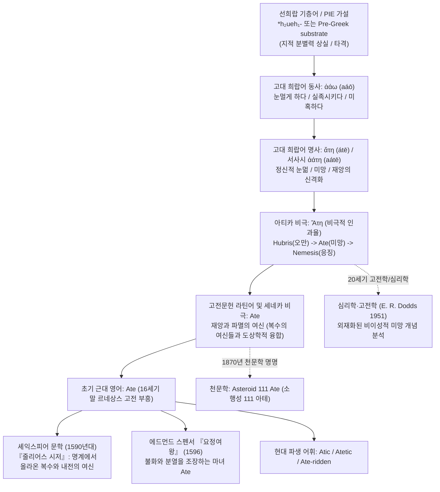

# Ate (아테)

**[[greek-reading-guide|읽는 법]]**: 아테 · **원어**: ἄτη · **학술 전사**: *átē*

> **요약**: 고대 그리스어 ἄτη(정신적 눈멂, 미망, 재앙)에서 유래하여 고전 라틴어를 거쳐 근대 영어로 유입된 고유명사 및 학술어로, 셰익스피어 비극의 복수의 여신 및 천문학, 심리학적 개념으로 수용되었습니다.

---

## 1. 어원 전파 계통도 (Etymological Transmission Tree)

---

## 2. 인구어(PIE) 및 희랍어 원어근 분석 (PIE & Proto-Greek Morphology)

> [!NOTE] 선희랍 기층어(Pre-Greek Substrate) 및 어원적 불확실성
> - 로베르트 베이케스(Beekes 2010: 17–18)에 따르면, ἄτη 및 서사시형 ἀάτη는 인도유럽조어(PIE) 어근으로의 직접 소급이 매우 불확실하며, 모음 접속(hiatus)과 불규칙한 형태론적 특성을 고려할 때 비-인도유럽어계 지중해 토착 기층어(Pre-Greek substrate) 기원일 가능성이 강력히 제기됩니다.
> - 전통 비교언어학(Chantraine 1968: 1–2, Pokorny IEW)에서는 히타이트어 *huwapp-*(해치다, 악행을 행하다) 또는 인도유럽조어 후두음 어근 *h₂ueh₁-(상처 입히다, 해를 끼치다)와의 연결을 시도했으나 단정적 정설로 확정되지 않았습니다.

### 2.1 고대 그리스어 주요 어형 및 형태론 분석표

| 그리스어 실제형 | 학술 전사 | 표제형·형태론 | 한국어 풀이 | 근거 |
|:---|:---|:---|:---|:---|
| **ἄτη** | *átē* | 명사, 주격 단수 여성 | 정신적 눈멂, 미망, 재앙, 신격화된 파멸의 여신 | LSJ, Beekes (2010: 17) |
| **ἀάτη** | *aátē* | 명사, 주격 단수 여성 (서사시 비축약형) | 미망, 치명적 과오, 판단력 마비 | Chantraine (1968: 1) |
| **ἀάω** | *aáō* | 동사, 현재 능동태 1인칭 단수 | 눈멀게 하다, 분별력을 빼앗다 | LSJ s.v. ἀάω |
| **ἄασεν** | *áasen* | 동사, 아오리스트 능동태 3인칭 단수 | (신이) 눈멀게 했다, 실족시켰다 | _Il._ 19.95; Chantraine DELG 1 |
| **ἀασάμην** | *aasámēn* | 동사, 아오리스트 중간태 1인칭 단수 | "내가 미망에 빠졌다, 내가 실책을 저질렀다" | _Il._ 9.116, 19.137 |
| **ἀάατος** | *aáatos* | 형용사, 주격 단수 남성/여성 (서사시형) | 침해할 수 없는, 파멸적인 | _Il._ 14.271; Chantraine DELG 1 |
| **ἀτηρός** | *atērós* | 형용사, 주격 단수 남성 (후대 비극형) | 파멸을 부르는, 재앙의, 눈이 먼 | Aeschylus *Pers.* 1007 |

---

## 3. 호메로스 서사시 원전 용례 및 인명학 (Homeric Epic Context & Onomastics)

호메로스 서사시에서 **아테**(ἄτη)는 단순한 불운이나 객관적 사고(accident)가 아니라, **신적 개입이나 격정에 의해 순간적으로 인간의 지적·도덕적 분별력([[concept-phren|프렌]])이 마비되어 돌이킬 수 없는 파멸적 결정을 내리는 정신적 눈멂**(infatuation/moral blindness)을 의미합니다 (상세한 철학적 분석은 [[concept-ate|아테 (Ate)]] 참조).

### 3.1 아가멤논의 자기변명과 아테의 신격화 (_Il._ 19.86–94)

[[entity-agamemnon|아가멤논]]은 [[entity-achilles|아킬레우스]]와의 화해 의식에서 자신의 치명적인 실책(브리세이스 강탈)을 자신의 본래 의도가 아닌 [[entity-zeus|제우스]]의 맏딸 아테의 탓으로 돌립니다:

- **번역**: "그러나 내가 그 원인이 아니었소. 오히려 제우스와 모이라(*Moira*)와 어둠 속을 거니는 에리뉘스(*Erinys*)가 모임에서 내 마음에 사나운 미망(*atē*)을 던져 넣었던 것이오, 바로 그날 내가 아킬레우스에게서 그의 명예의 몫을 빼앗았을 때 말이오. 하지만 내가 어찌할 수 있었겠소? 모든 것을 이루는 신이 바로 제우스의 맏딸 아테(*Atē*)이니, 저 파멸시키는 자, 그녀의 발은 부드러워 땅에 닿지 않고 사람들의 머리 위를 밟고 다니며 사람들을 해치고, 둘 중 한 사람을 옭아매는도다."
- **원문**: *ἐγὼ δ᾽ οὐκ αἴτιός εἰμι, / ἀλλὰ Ζεὺς καὶ Μοῖρα καὶ ἠεροφοῖτις Ἐρινύς, / οἵ τέ μοι εἰν ἀγορῇ φρεσὶν ἔμβαλον ἄγριον ἄτην, / ἤματι τῷ ὅτ᾽ Ἀχιλλῆος γέρας αὐτὸς ἀπηύρων. / ἀλλὰ τί κεν ῥέξαιμι; θεὸς διὰ πάντα τελευτᾷ, / πρέσβα Διὸς θυγάτηρ Ἄτη, ἣ πάντας ἀᾶται, / οὐλομένη· τῇ μέν θ᾽ ἁπαλοὶ πόδες· οὐ γὰρ ἐπ᾽ οὔδει / πίλναται, ἀλλ᾽ ἄρα ἥ γε κατ᾽ ἀνδρῶν κράατα βαίνει / βλάπτουσ᾽ ἀνθρώπους· κατὰ δ᾽ οὖν ἕτερόν γε πέδησεν.*
- **학술 전사**: *egṑ d’ ouk aítiós eimi, / allà Zeùs kaì Moîra kaì ēerophoîtis Erinús, / hoí té moi ein agorē̂i phresìn émbalon ágrion átēn, / ḗmati tôi hót’ Akhillêos géras autòs apēúrōn. / allà tí ken rhéxaimi? theòs dià pánta teleutâi, / présba Diòs thugátēr Átē, hḕ pántas aâtai, / ouloménē; têi mén th’ hapaloì pódes; ou gàr ep’ oúdei / pílnatai, all’ ára hḗ ge kat’ andrō̂n kráata baínei / bláptous’ anthrṓpous; katà d’ oûn héterón ge pédēsen.*

- **서사 문맥 분석**:
  - 호메로스는 아테의 발이 땅에 닿지 않고 인간들의 머리 위를 밟고 다닌다(*kat’ andrō̂n kráata baínei*)는 시적 형상화를 통해, 미망이 인간의 신체 외부가 아니라 뇌리와 지적 판단 체계를 직접 장악함을 묘사합니다.
  - 이어지는 대목(_Il._ 19.95–133)에서 아가멤논은 전능한 제우스조차 헤라클레스 탄생 시 [[entity-hera|헤라]]의 계략에 넘어가 아테에게 눈이 멀었던 신화를 인용하며, 분노한 제우스가 아테의 머리채를 잡고 올림포스 하늘에서 인간 세상으로 영원히 내던졌음을 서술합니다.

### 3.2 기도들(Litai)과 아테의 우화적 대립 (_Il._ 9.502–507)

『일리아스』 9권 사절단 장면에서 노장 [[entity-phoenix|포이닉스]]는 아킬레우스의 완고한 분노를 꺾기 위해 아테와 '기도의 여신들(Litai)'의 알레고리를 제시합니다:

- **번역**: "참으로 기도(*Litai*)들 역시 위대한 제우스의 딸들이니, 절름발이에 주름투성이요 눈을 흘뜨며 다니니, 그들은 미망(*Atē*)의 뒤를 쫓아 돌보는 데 근심하도다. 그러나 아테는 억세고 발이 빨라 모든 기도들을 훨씬 앞질러 달리며, 온 대지 위에서 인간들을 먼저 해치고, 기도들은 그 뒤에서 치유하도다."
- **원문**: *καὶ γάρ τε Λιταί εἰσι Διὸς κοῦραι μεγάλοιο / χωλαί τε ῥυσαί τε παραβλῶπές τ᾽ ὀφθαλμώ, / αἵ ῥά τε καὶ μετόπισθ᾽ Ἄτης ἀλέγουσι κιοῦσαι. / ἣ δ᾽ Ἄτη σθεναρή τε καὶ ἀρτίπος, οὕνεκα πάσας / πολλὸν ὑπεκπροθέει, φθάνει δέ τε πᾶσαν ἐπ᾽ αἶαν / βλάπτουσ᾽ ἀνθρώπους· αἳ δ᾽ ἐξακέονται ὀπίσω.*
- **학술 전사**: *kaì gár te Litaí eisi Diòs koûrai megáloio / khōlaí te rhusaí te parablō̂pés t’ ophthalmṓ, / haí rhá te kaì metópisth’ Átēs alégousi kioûsai. / hḕ d’ Átē sthenarḗ te kaì artípos, hoúneka pásas / pollòn hupekprothéei, phthánei dé te pâsan ep’ aîan / bláptous’ anthrṓpous; haì d’ eksakéontai opísō.*

- **서사 문맥 분석**:
  - **속도의 대조**: 아테는 건강하고 발이 빨라(*artípos*) 순식간에 인간을 파멸적 과오로 몰아넣는 반면, 참회와 사죄를 뜻하는 기도들(*Litai*)은 발을 절고 주름진 채 뒤늦게 따라옵니다.
  - **윤리적 징벌 연쇄** (_Il._ 9.508–514): 누군가 탄원([[concept-hikesia|히케시아]])과 사죄를 거절하고 오만을 고집하면, 리타이가 제우스에게 간청하여 아테가 다시 그 완고한 자에게 달라붙어 가혹한 자멸적 파국을 맞게 만듭니다. 이는 아킬레우스가 아가멤논의 탄원을 거절했을 때 전우 [[entity-patroklos|파트로클로스]]를 잃게 되는 복선으로 기능합니다.

---

## 4. 역사적 전파 및 수용사 경로 (Historical Transmission & Reception)

### 4.1 고전기 아티카 비극: 비극적 인과율의 축
- **헤시오도스 『신통기』 (Theogony 230)**: 호메로스의 제우스 혈통과 달리, 불화와 분쟁의 여신 [[entity-eris|에리스]](Eris)가 낳은 딸로 계보가 재편되었습니다.
- **아티카 3대 비극 시인 (아이스킬로스·소포클레스·에우리피데스)**:
  - 아테는 단순한 실책을 넘어 비극적 파멸의 4단계 연쇄 메커니즘(**오만**([[concept-hybris|히브리스]]) $
ightarrow$ **미망**([[concept-ate|아테]]) $
ightarrow$ **응징**([[concept-nemesis|네메시스]]) $
ightarrow$ **파멸**)의 핵심 고리로 체계화되었습니다.
  - 인간이 분수를 넘는 오만(Hubris)을 부릴 때, 신들은 그에게 아테(도덕적 눈멂과 광기)를 보내 스스로 파멸의 덫으로 걸어 들어가게 만듭니다.

### 4.2 헬레니즘 및 고전 라틴 문헌 수용
- 로마 공화정 및 제정기 문인들은 그리스 비극 및 신화집(아폴로도로스 『비블리오테케』 등)의 라틴어 번역을 통해 고유명사 **Ate**를 수용했습니다.
- 특히 **세네카 비극**(Senecan tragedy)의 복수극 전통에서 아테는 지하 명계의 복수의 여신들(Furies / Erinyes)과 도상학적으로 융합(syncretism)되어, 단순한 판단 착오가 아닌 피의 복수를 충동질하는 무자비한 신격으로 변모했습니다.
- 일리오스 건국 신화에서 트로이 성채가 세워진 장소가 올림포스에서 추락한 아테가 떨어진 '아테의 언덕(Lophos Ates)'이라는 전승이 라틴 신화 주석가들을 통해 서유럽 중세로 계승되었습니다.

### 4.3 르네상스 영국 문학의 극적 수용
- **학식 차용어(Learned Borrowing)의 성격**: *Ate*는 중세 프랑스어나 앵글로-노르만어의 통속적 구어 변천을 거치지 않고, 16세기 말 르네상스 인문주의 고전 부흥기에 라틴-그리스 고전문헌에서 직수입된 전형적인 학식 차용어입니다.
- **에드먼드 스펜서** 『**요정여왕**』 (1596, Book IV): 아테를 인간 사이의 우정과 평화를 파괴하는 추악한 불화의 마녀("the mother of debate and all dissension")로 묘사했습니다.
- **윌리엄 셰익스피어**: 세네카적 복수극 전통을 계승하여 『줄리어스 시저』(1599)에서는 내전과 유혈 복수의 화신으로, 『헛소동』(1598)에서는 신랄한 인물에 대한 희극적 과장(comic hyperbole)으로 다양하게 변주했습니다.

---

## 5. 음운 및 의미 변화사 (Phonological & Semantic Evolution)

### 5.1 음운 및 철자 변천 단계
- **서사시 그리스어**: ἀάτη (*aátē*, /a.áː.tɛː/, 3음절 모음 접속, 장모음 ā)
- **고전 아티카 그리스어**: ἄτη (*átē*, /áː.tɛː/, 축약 및 전치 억양 악센트)
- **고전 라틴어**: *Atē* / *Ate* (/ˈa.teː/, 그리스어 차용 표기)
- **초기 근대 영어**: *Ate* (/ˈeɪ.tiː/ 또는 문학적 전통 발음 /ˈɑː.teɪ/)

### 5.2 역사적 의미 전이 메커니즘 (Semantic Shifts)

- **인지적 침탈 은유 및 인과적 환유**:
  - 호메로스 서사시에서 아테는 신적 개입에 의해 인간의 인지 체계를 장악하는 '머리 짓밟기' 은유로 형상화되었으며, 주관적 인지 착란(원인)과 초래된 객관적 파멸 및 재앙(결과)이 단일 어휘 기호 *átē* 안에서 긴밀히 통합 작동했습니다.
- **4단계 역사적 의미 분기**:
  1. *호메로스 서사시*: 신적 개입에 의한 순간적 판단력 상실 및 미망 (Infatuation & Moral Blindness).
  2. *아티카 비극*: 오만(Hubris)에 뒤따르는 필연적 비극적 미망과 파멸 (Tragic Delusion & Ruin).
  3. *엘리자베스조 문학*: 세네카적 변용을 거친 복수신 및 내전·불화의 화신 (Goddess of Discord & Revenge).
  4. *근현대 학술·과학*: 비합리성 심리 분석 개념([[dodds-1951-greeks-and-irrational|Dodds 1951]]) 및 소행성 111 명칭.

---

## 6. 현대 영어 파생어군 및 어휘 패밀리 (Modern English Cognates & Derivatives)

| 품사/형태 | 단어 (Word) | 의미 및 용법 | 최초 기록 (OED) | 확실성 등급 |
|:---|:---|:---|:---|:---|
| **고유명사** (Proper Noun) | **Ate** | 고대 그리스의 파멸·미망의 여신; 복수와 유혈의 화신. | 1591년 (E. Spenser, *Ruines of Time*) | 정설/문헌 입증 |
| **형용사** (Adj.) | **Atic** / **Atetic** | 아테의, 미망에 사로잡힌, 비극적 파멸을 초래하는. | 19세기 고전학 문헌 | 학술적 차용 |
| **복합 형용사** (Adj.) | **Ate-ridden** / **Ate-driven** / **Ate-struck** | 미망에 눈이 먼, 재앙과 맹목적 광기에 사로잡힌. | 근현대 문학 비평 코퍼스 | 정설/문헌 입증 |
| **천문학 고유명사** | **111 Ate** | 화성과 목성 사이 소행성대에 위치한 C형 소행성. | 1870년 (C. H. F. Peters) | 정설/문헌 입증 |
| **학술 개념어** | **Hubris-Ate-Nemesis cycle** | 고전 비극의 핵심 인과율(오만-미망-응징)을 설명하는 학술 용어. | 20세기 고전학 (Dodds 1951) | 정설/문헌 입증 |

---

## 7. 인명·신명 파생 고유명사 및 관용표현 (Eponymous Terms & Cultural Idioms)

### 7.1 셰익스피어 비극 및 희극의 아테(Ate) 주석

셰익스피어는 세네카 비극의 복수극 전통을 수용하여 아테를 극적 긴장과 인물 성격 묘사의 핵심 알레고리로 활용했습니다.

#### 1. 『줄리어스 시저』 (Julius Caesar, 3막 1장 270–273행)
마크 안토니우스가 시저의 시신 앞에서 로마 내전의 참극을 예언하는 명대사입니다:

- **영어 원문**:
  - *"And Caesar's spirit, ranging for revenge,"*
  - *"With Ate by his side come hot from hell,"*
  - *"Shall in these confines with a monarch's voice"*
  - *"Cry 'Havoc!' and let slip the dogs of war"*
- **한국어 번역**: "그리고 복수를 찾아 헤매는 시저의 영혼이, 지옥에서 갓 올라와 뜨거운 아테(*Ate*)를 곁에 두고, 군주의 음성으로 이 국경 안에서 '약탈과 살육(*Havoc*)!'을 외치며 전쟁의 사냥개들을 풀어놓으리라."
- **주석**: 셰익스피어는 아테를 지하 명계(hell)에서 직송된 피비린내 나는 복수의 집행자로 형상화하여, 시저 암살파에 대한 무자비한 보복과 로마 전역의 궤멸적 내전을 암시합니다.

#### 2. 『존 왕』 (King John, 2막 1장 63행)
- 엘리너 왕비(Queen Elinor)가 아들의 호전성을 부추기는 모습을 가리켜 "An Ate, stirring him to blood and strife"(피와 투쟁을 부추기는 아테)로 비유합니다.

#### 3. 『헛소동』 (Much Ado About Nothing, 2막 1장 263행)
- 베네딕트(Benedick)가 베아트리체(Beatrice)의 신랄한 언변에 혀를 내두르며 "You shall find her the infernal Ate in good apparel"(그녀는 화려한 옷을 차려입은 지옥의 아테요)이라고 칭한 대목으로, 비극적 알레고리가 아닌 낭만 희극 특유의 과장된 언어유희(comic hyperbole)입니다.

### 7.2 천문학: 소행성 111 아테 (Asteroid 111 Ate)
- 1870년 8월 14일, 미국 클린턴의 리치필드 천문대에서 독일계 미국인 천문학자 크리스티안 H. F. 페터스(C. H. F. Peters)가 발견했습니다.
- **명명 배경**: 발견 당시 유럽 대륙에서 프로이센-프랑스 전쟁(보불전쟁)이 발발하여 수많은 인명이 살상되자, 페터스는 인류의 맹목적 광기와 파멸을 경고하는 의미에서 '재앙과 미망의 여신' 아테의 이름을 부여한 것으로 해석됩니다 (Schmadel 2003: 25).

---

## 8. 어원 증거 매트릭스 및 학술 출처 (Evidence Matrix & References)

| 어원 및 수용 명제 | 언어 층위 | 확실성 등급 | 출전 및 학술 문헌 근거 |
|:---|:---|:---|:---|
| **선희랍 기층어 기원 및 PIE 불확실성** | Pre-Greek / PIE | 선희랍 기층어 (유력) | Beekes (2010: 17–18 EDG), Chantraine (1968: 1–2 DELG) |
| **동사 ἀάω와의 형태론적 파생 관계** | 고대 희랍어 | 정설/문헌 입증 | Chantraine (1968: 1), LSJ (s.v. ἀάω, ἄτη) |
| **호메로스 『일리아스』 출전 용례 (_Il._ 19.91, 9.502)** | 호메로스 희랍어 | 정설/문헌 입증 | Homer, *Iliad* Books 9 & 19; Dodds (1951: 2–8) |
| **세네카 비극 매개 및 셰익스피어 수용 (1599)** | 초기 근대 영어 | 정설/문헌 입증 | Shakespeare, *Julius Caesar* 3.1.271; OED s.v. *Ate* |
| **소행성 111 Ate 명명 배경 (1870)** | 근대 천문학 | 학설/문헌 추정 | Schmadel, *Dictionary of Minor Planet Names* (2003: 25) |
| **영어 *eat* (PIE *h₁ed-)과의 동계설 오인** | PIE / 게르만어 | 민간어원/허구 (Spurious) | OED, Pokorny IEW (False Cognate) |

> [!NOTE] 확실성 6대 등급 안내
> - **직접 증거 (Direct)**: 당대 금석문·점토판 또는 고전 문헌에 명시적으로 확인되는 어형.
> - **정설/문헌 입증 (Established)**: 비교언어학적 음운 법칙과 고전 문헌 코퍼스에 의해 확립된 정설.
> - **학술적 차용 (Scholarly)**: 근현대 학술 용어로 재구되거나 문헌에서 직접 차용된 어휘.
> - **학설/문헌 추정 (Plausible)**: 사료적 정황과 어원적 타당성이 높으나 이설이 존재하는 가설.
> - **선희랍 기층어 (Pre-Greek)**: 인도유럽조어로 환원되지 않는 에게해·지중해 고유 기층어 기원.
> - **민간어원/허구 (Spurious)**: 형태적 유사성에 기인한 비학술적 민간 어원 또는 오류.

> [!WARNING] 민간 어원(Folk Etymology) 및 주의 사항
> - **영어 eat (PIE *h₁ed-)과의 무관성**: 영어의 먹다(eat, 고대 영어 etan)와 철자나 발음이 유사하여 '모든 것을 먹어치우는 파멸'로 해석하는 민간 어원이 있으나, 언어학적으로 완전히 무관한 허구(Spurious)입니다.
> - **라틴어 attero (마모시키다)와의 무관성**: 라틴어 동사 attero(부수다, 마모시키다) 역시 접두사 ad-와 tero(비비다)의 결합으로 그리스어 ἄτη와 어원적 연관이 없습니다.

---

## 관련 항목

### 상위 분류 및 색인
- [[overview|서사시 개요]] — 호메로스 서사시 세계관 및 핵심 개념 지도
- [[wiki/index|위키 색인]] — 인물, 개념, 분석, 학술 문헌 전체 목록
- [[words/index|어원 사전 색인]] — 고대 그리스어 어휘 및 영단어 수용사 사전

### 관련 개념 및 인물
- [[concept-ate|아테 (Ate)]] — 신들이 내린 일시적 판단 마비와 치명적 과오 및 파멸의 연쇄
- [[concept-menis|메니스 (Menis)]] — 아가멤논의 아테로 인해 촉발된 아킬레우스의 신적 분노
- [[concept-nemesis|네메시스 (Nemesis)]] — 마땅한 몫의 침해와 아테에 의한 탈선에 대한 공적 의분
- [[concept-aidos|아이도스 (Aidos)]] — 아테의 실족을 억제하는 수치심과 도덕적 자제
- [[concept-hybris|히브리스 (Hybris)]] — 아테와 결합하여 신적 질서를 유린하는 오만과 방자함
- [[concept-atasthalia|아타스탈리아 (Atasthalia)]] — 인간 자신의 무모함과 분수를 넘는 오만
- [[concept-hamartia|하마르티아 (Hamartia)]] — 아리스토텔레스 비극론의 비극적 결함 및 판단 착오
- [[concept-hikesia|히케시아 (Hikesia)]] — 리타이 여신들의 가호 아래 행해지는 탄원 의례
- [[concept-apoina|아포이나 (Apoina)]] — 아테로 초래된 과오를 보상하기 위해 제공하는 막대한 배상금
- [[concept-time|티메 (Time)]] — 아가멤논이 아테에 빠져 침해한 영웅의 명예
- [[entity-agamemnon|아가멤논 (Agamemnon)]] — 아테의 미망으로 재앙을 초래한 군주
- [[entity-achilles|아킬레우스 (Achilles)]] — 아가멤논의 아테로 인해 분노를 폭발시킨 영웅
- [[entity-hector|헥토르 (Hector)]] — 폴리다마스의 권고를 기각하는 아테에 빠져 자멸한 트로이아 총사령관
- [[entity-phoenix|포이닉스 (Phoenix)]] — 9권에서 아테와 리타이의 우화를 통해 화해를 설파한 노장
- [[entity-zeus|제우스 (Zeus)]] — 헤라의 계략으로 아테에 빠졌다가 아테를 올림포스에서 내던진 최고신
- [[entity-eris|에리스 (Eris)]] — 불화의 여신이자 헤시오도스 신통기에서 아테의 어머니로 묘사되는 신격
- [[entity-erinys|에리뉘스 (Erinys)]] — 인간의 마음에 사나운 아테를 던져 넣고 질서를 바로잡는 복수의 여신
- [[entity-patroklos|파트로클로스 (Patroklos)]] — 성벽 공격의 미망(*mega aasthe*)에 빠져 전사한 전우

### 관련 어원 사전 항목
- [[word-achilles|Achilles (아킬레우스)]] — [*Achilles' heel*, *Achilles tendon*, *Achillean*]
- [[word-agathos|Agathos (아가토스)]] — [*Agathism*, *Agatha*, *Kalokagathia*]
- [[word-hector|Hector (헥토르)]] — [*to hector*, *hectoring*, *hectorism*]

### 관련 분석 및 연구 문헌
- [[analysis-homeric-ethics-literature-review|호메로스 윤리학 문헌 고찰]] — 호메로스 윤리학 연구사 및 아테의 심리적 외주화 테제 분석
- [[analysis-concept-source-matrix|개념과 문헌]] — 핵심 개념과 학술 문헌 24종 간의 교차 매트릭스
- [[dodds-1951-greeks-and-irrational|도즈 (1951), 그리스인들과 비합리적인 것]] — 아테의 심리적 외주화 및 수치 문화 분석
