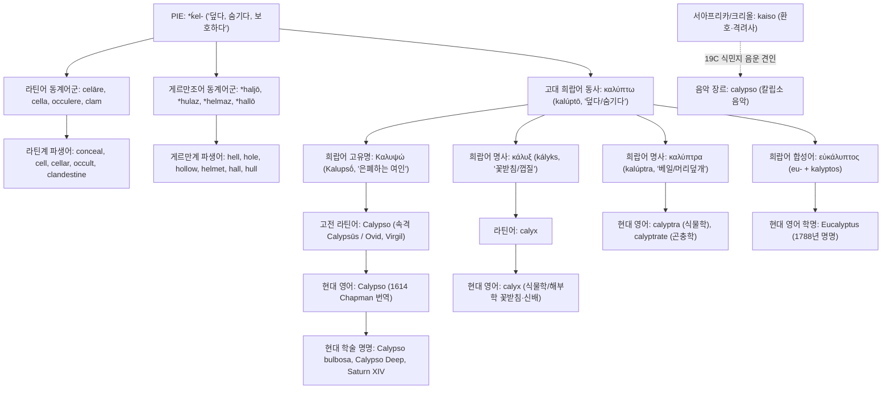

# Calypso (칼립소)

**[[greek-reading-guide|읽는 법]]**: 칼립소 · **원어**: Καλυψώ · **학술 전사**: *Kalupsṓ*

> **요약**: 호메로스 서사시 『오뒷세이아』의 오기기아 섬 님페 칼립소(Καλυψώ)의 이름에서 유래한 인명 유래어(Eponym)로, 인도유럽조어 *ḱel-(덮다, 감추다) 또는 선희랍 기층어에서 기원한 희랍어 동사 칼륍토(καλύπτω)를 모태로 하여, 라틴어를 거쳐 현대 영어의 신화적 고유명사, 식물학 속명(Calypso bulbosa), 천문학 위성명, 지중해 최심부 해양 지명(Calypso Deep) 및 광범위한 어휘 패밀리(calyx, calyptra, eucalyptus)로 분화되었습니다. 인물의 서사적 행적 및 종교·윤리학적 심화 분석은 칼립소 엔티티 문서를 참조하십시오.

---

## 1. 어원 전파 계통도 (Etymological Transmission Tree)

---

## 2. 인구어(PIE) 및 희랍어 원어근 분석 (PIE & Proto-Greek Morphology)

### 2.1 인도유럽조어(PIE) 어근 및 음운 대응
- **PIE 조어 어근**: `*ḱel-` ("덮다, 감추다, 감싸 보호하다"; Pokorny IEW 553–554, LIV 322).
- **음운 법칙(Grimm의 법칙 및 구개음 대응)**:
  - PIE 무성 구개파열음 `*ḱ`는 켄툼(Centum) 어파인 그리스어와 라틴어에서 각각 무성 연구개파열음 `κ`(*k*)와 `c`(*k*)로 보존되었습니다.
  - 게르만어파 역시 켄툼 어파에 속하지만 독자적인 제1차 자음 추이(그림의 법칙)를 거쳐 무성 마찰음 `*h`로 전환(`*ḱ` > `*k` > `*h`)되었습니다. 반면 사템(Satem) 어파에서는 치찰음화(`*ḱ` > *s/š*)를 겪었습니다.
- **학설 대립(PIE 어원설 vs 선희랍 기층설)**:
  - 전통적으로 포코르니(Pokorny)와 샹트렌(Chantraine DELG 488)은 희랍어 `καλύπτω`를 PIE `*ḱel-`의 순음 확장형으로 보았습니다.
  - 그러나 로베르트 비케스(Robert Beekes 2010 EDG 626)는 라틴어(*celāre*)나 게르만어(*hell*)와 달리 희랍어에만 나타나는 불규칙한 순음 확장(`-ub-` / `-up-`) 및 음운론적 난점을 들어 PIE 연결을 기각하고 **선희랍 기층어(Pre-Greek substrate)** 기원설을 제시했습니다.
- **게르만어군 동계어(Cognates)**:
  - 게르만조어 `*haljō` (은폐된 지하세계) → 고대 영어 *hell* → 현대 영어 **hell**(지옥, 저승).
  - 게르만조어 `*hulaz` (파인 곳, 가려진 공간) → 현대 영어 **hole**(구멍), **hollow**(속이 빈).
  - 게르만조어 `*helmaz` (머리를 덮는 보호구) → 고대 영어 *helm* → 현대 영어 **helmet**(투구).
  - 게르만조어 `*hallō` (지붕으로 덮인 큰 건물) → 현대 영어 **hall**(홀, 넓은 방).
  - 게르만조어 `*huljan` (덮다, 가리다) → 현대 영어 **hull**(배의 선체, 곡물의 껍질).
- **라틴어군 동계어(Cognates)**:
  - *celāre* (숨기다) → 고대 프랑스어 경유 현대 영어 **conceal**(숨기다).
  - *cella* (작은 방, 밀실) → 현대 영어 **cell**(세포, 감방), **cellar**(지하실).
  - *occulere* (덮어 가리다) → 현대 영어 **occult**(신비로운, 오컬트).
  - *clam* (비밀리에) → 현대 영어 **clandestine**(은밀한).
  - *supercilium* (눈꺼풀 덮개 위의 털) → 현대 영어 **supercilious**(거만한).

### 2.2 고대 희랍어 형태론 및 파생 접미사
- **동사 형성**: 희랍어 동사 **καλύπτω**(*kalúptō*)는 순음 어근 `καλυβ-` / `καλυπ-`에 현재시제 형성 접미사 `-yō`가 결합하여 자음군 동화(`*kalup-yō` → `καλύπτω`)를 거쳤습니다(Chantraine DELG 488).
- **고유명 형성 접미사**: 고유명 **Καλυψώ**(*Kalupsṓ*)는 고졸기 그리스어 인명학에서 널리 쓰이던 여성 접미사 `-ώ`(*-ṓ*)가 결합한 능동적 여성 행위자 명사(*nomen agentis*)입니다. 이는 수동적으로 '숨겨진 여인'이 아니라 대상을 적극적으로 '덮어 가리는 능동적 은폐자(The Concealer)'를 의미합니다(Peradotto 1990).
- **동원 명사군**:
  - `κάλυξ` (*kályks*, 속격 *kálykos*): 꽃을 덮어 감싸는 겉껍질을 가리키며, 현대 영어 **calyx**(꽃받침)의 원형입니다.
  - `καλύπτρα` (*kalúptra*): 머리를 덮는 여성의 너울(베일)을 뜻하며, 현대 식물학의 **calyptra**(모자)로 직수용되었습니다.

| 그리스어 실제형 | 학술 전사 | 표제형·형태론 | 한국어 풀이 | 문헌학적 근거 |
|:---|:---|:---|:---|:---|
| **καλύπτω** | *kalúptō* | 동사 현재 능동태 1인칭 단수 | 덮다, 가리다, 숨기다 | LSJ s.v. καλύπτω |
| **καλύψα토** | *kalúpsato* | 직설법 부정과거 중간태 3인칭 단수 | 스스로를 덮었다 | _Od._ 5.491 (불씨 직유) |
| **ἀμφικαλύψας** | *amphikalúpsas* | 분사 부정과거 능동태 남성 주격 단수 | 포근히 덮어주면서 | _Od._ 5.493 (잠의 의인화 주어) |
| **Καλυψώ** | *Kalupsṓ* | 고유명 여성 주격 단수 (행위자 명사) | 감추는 여인, 은폐자 | _Od._ 1.14; Chantraine DELG 488 |
| **κάλυξ** | *kályks* | 명사 여성 주격 단수 (꽃받침) | 꽃을 덮는 껍질 | Chantraine DELG 489 |
| **καλύπτρα** | *kalúptra* | 명사 여성 주격 단수 (너울/베일) | 머리를 덮어 가리는 천 | _Od._ 1.334; LSJ s.v. |

---

## 3. 호메로스 서사시 원전 용례 및 인명학 (Homeric Epic Context & Onomastics)

### 3.1 호메로스 서사시 핵심 출전
- 『오뒷세이아』 1권 14행: 최초 출현 및 정형구 결합(*númphē pótni’ éruke Kalupsṑ, dîa theáōn*).
- 『오뒷세이아』 5권 488–493행: 스케리아 해변 '불씨 직유'에서의 대칭적 동사 용례(*kalúpsato*).
- 『오뒷세이아』 7권 245행: 오뒷세우스의 1인칭 회고 한정 형용사 결합(*Átlantos thugátēr, dolóessa Kalupsṓ*).

### 3.2 인명학(Onomastics)과 호메로스 어휘 장 (Lexical Field)
고전문헌학자 존 페라도토(John Peradotto 1990)는 칼립소라는 이름이 호메로스 서사시에서 '이름이 곧 운명(Nomen-Omen)'인 가장 대표적인 사례임을 밝혔습니다:
- **호메로스 어휘 장과 전사의 죽음 정형구**: 호메로스 서사시 전통에서 동사 **καλύπτω**는 전사의 시야와 생명이 차단되는 최후를 묘사하는 정형구적 어휘장을 형성합니다: "그러자 어둠이 그의 두 눈을 덮었다"(*tòn dè skótos ósse kalúpse*, _Il._ 4.461), "죽음이 그를 감싸 덮었다"(*thánatos dé min amphékalupse*, _Il._ 5.68), "죽음의 검은 구름이 그를 감싸 덮었다"(*thanátou dè mélan néphos amphékalupsen*, _Il._ 16.350). 칼립소의 오기기아 은폐는 영웅을 물리적으로 살려두면서도 사회적 찬양인 [[concept-kleos|클레오스]](명성)를 차단하는 어휘적 고립이었습니다.
- **불씨 직유의 형태론적 전도 (5.488–493행)**: 5권 491행에서 [[entity-odysseus|오뒷세우스]]가 나뭇잎 속에 몸을 **덮었을 때**(*kalúpsato*), 시인은 능동태(외적 은폐)가 아닌 **중간태**(Middle Voice: 재귀적 자기 보호)를 구사하여, 타자에 의해 감추어지던 수동성에서 스스로 생명의 불씨를 지켜내는 주체적 행위로 문법적·형태론적 전도를 이룹니다.
- 서사시 내 상세한 7년 억류 줄거리, 항변 연설 수사학, 불사 제안 거절 및 [[concept-xenia|크세니아]]·[[concept-nostos|노스토스]]의 종교·윤리학적 해석은 [[entity-calypso|칼립소 (Calypso)]] 엔티티 문서를 참조하십시오.

---

## 4. 역사적 전파 및 수용사 경로 (Historical Transmission & Reception)

1. **고대 그리스에서 로마 라틴어로의 수용**:
   - 고대 그리스 서사시의 **Καλυψώ**는 헬레니즘기를 거쳐 로마 공화정 및 제정기 문학으로 직수용되었습니다.
   - 라틴어는 그리스어 3변화 단축 곡용을 보존한 **Calypso**(속격 *Calypsūs*)로 차용하였으며, 오비디우스(Ovid, *Ars Amatoria* 2.123)와 베르길리우스(Virgil, *Aeneid*)의 주요 텍스트에 정착되었습니다.
2. **초기 근대 영어로의 번역 수입**:
   - 르네상스 고전 부흥기, 조지 채프먼(George Chapman)의 『오뒷세이아』 완역(1614–1616)을 통해 라틴어 철자 **Calypso**가 현대 영어 어휘 체계로 직수입되었습니다.
3. **18~20세기 근대 과학 명명학(Taxonomy) 및 학술어 정착**:
   - 18세기 후반~19세기 초 근대 박물학은 미지의 심연이나 꽃잎 속에 기관이 감추어진 생물속에 라틴어 학명으로 칼립소를 채택했습니다.
   - 20세기 중반 이후 해양학 탐사선, 지중해 최심부 해연, 토성 위성 등 극한의 미개척 공간을 명명하는 표준 고유명사로 정착되었습니다.

---

## 5. 음운 및 의미 변화사 (Phonological & Semantic Evolution)

### 5.1 음운 및 철자 변천
- **희랍어 단계**: `Καλυψώ` (*Kalupsṓ*, 무성 양순파열음 p + 무성 치경마찰음 s의 이중자음 ψ 및 장모음 ō 보존).
- **라틴어 단계**: *Calypso* (그리스 문자 카파(κ)가 라틴 c로, 윕실론(υ)이 y로 정규 전사됨).
- **영어 단계**: *Calypso* (/kəˈlɪp.soʊ/, 2음절 단모음 /ɪ/ 및 강세 이동).

### 5.2 역사적 의미 전이 (Semantic Shifts)
1. **원초적 물리 의미**: "천이나 대지로 어떤 대상을 덮어 가리다" (PIE `*ḱel-` 또는 기층어 → 희랍어 *kalúptō*).
2. **서사적 인격화**: "영웅을 세상의 빛과 명성으로부터 격리하여 숨겨두는 외딴 섬의 요정" (호메로스 *Kalupsṓ*).
3. **문학적 은유**: "외부와 단절된 안락한 은둔처, 또는 벗어날 수 없는 감각적 구속" (페늘롱, 제임스 조이스).
4. **과학적 특수화**: "자연계에서 꽃잎 속으로 구조가 감추어져 있거나, 깊은 심연에 도달할 수 없는 미지의 대상" (식물학, 해양학, 천문학).

---

## 6. 현대 영어 파생어군 및 어휘 패밀리 (Modern English Cognates & Derivatives)

| 단어 (Word) | 품사 | 어원적 연계 및 명명 사유 | 최초 기록 (OED) | 확실성 |
|:---|:---|:---|:---|:---|
| **Calypso** | 고유명사 | 호메로스 신화 속의 님페 칼립소 | 16세기 말 (Chapman) | 정설/문헌 입증 |
| **Calypso** (*Calypso bulbosa*) | 명사 (식물학) | 서양요정난초속 (입술꽃잎 속에 암수술이 감추어진 난초) | 1806년 (Salisbury) | 정설/문헌 입증 |
| **Calypso Deep** | 고유명사 (지리) | 지중해 이오니아 해구 최심부 해연 (5,267m; 도달할 수 없는 심연) | 1965년 | 정설/문헌 입증 |
| **Saturn XIV Calypso** | 고유명사 (천문) | 토성의 제14위성 (테티스 궤도를 공유하는 트로이아 위성군) | 1980년 (Voyager 1) | 정설/문헌 입증 |
| **RV Calypso** | 고유명사 (선박) | 자크 쿠스토(Jacques Cousteau)의 해양 탐사선 | 1950년 | 정설/문헌 입증 |
| **calyx** | 명사 (식물학/해부학) | 꽃받침, 신우/신배 (동원 희랍어 κάλυξ 경유) | 17세기 초 | 정설/문헌 입증 |
| **calyptra** | 명사 (식물학) | 선태류의 포자낭을 덮는 모자 (동원 희랍어 καλύπτρα) | 18세기 중엽 | 정설/문헌 입증 |
| **calyptrate** | 형용사 (곤충학) | 날개 기부에 인편(calypter)이 있는 유판 파리류 | 19세기 후반 | 정설/문헌 입증 |
| **eucalyptus** | 명사 (식물학) | 유칼립투스 나무 (희랍어 εὐ- + καλυπτός; 덮개로 잘 덮인 꽃봉오리) | 1788년 (L'Héritier) | 정설/문헌 입증 |

---

## 7. 인명·신명 파생 고유명사 및 관용표현 (Eponymous Terms & Cultural Idioms)

### 7.1 문학적 수용 (Literary Reception)
- **제임스 조이스 『율리시스』 4장 ("Calypso")**:
  20세기 모더니즘 문학의 대표작에서 레오폴드 블룸의 가정적 안락과 감각적 구속을 나타내는 챕터 표제어로 차용되어, 호메로스적 은폐 모티프를 일상적 권태와 관능의 의미로 전이시켰습니다.

### 7.2 비유적 관용 표현 (Figurative Idioms)
- **Calypso-like**:
  영미 문학 및 비평 코퍼스에서 외부 사회와의 연결을 끊고 안락한 도피처에 칩거하는 상태를 비유적으로 "a Calypso-like existence(칼립소와 같은 은둔적 삶)"로 표현합니다.

---

## 8. 어원 증거 매트릭스 및 학술 출처 (Evidence Matrix & References)

| 어원 및 수용 명제 | 언어 층위 | 확실성 등급 | 출전 및 학술 문헌 근거 |
|:---|:---|:---|:---|
| PIE 조어 어근 `*ḱel-` 재구 | PIE | 학술적 재구 | Pokorny (1959) IEW 553–554; LIV 322 |
| 희랍어 καλύπτω 어원 | 고대 희랍어 | 논쟁적/이설 대립 (Contested) | 포코르니/샹트렌(PIE 설) vs 비케스(선희랍 기층설; Beekes 2010 EDG 626) |
| 호메로스 원전 용례 및 불씨 직유 (5.488–493) | 고대 희랍어 | 정설/문헌 입증 | _Od._ 1.14, 5.488–493, 7.245; Peradotto (1990) |
| 라틴어 Calypso 차용 | 라틴어 | 정설/문헌 입증 | Lewis & Short; Ovid, _Ars Amatoria_ 2.123 |
| 영어 번역본 직수입 | 초기 근대 영어 | 정설/문헌 입증 | Chapman (1614–1616); OED Online s.v. Calypso |
| 식물학속명 Calypso 명명 | 근대 라틴어 | 정설/문헌 입증 | Salisbury (1806); OED Online s.v. Calypso |
| 합성어 Eucalyptus 명명 | 근대 학명 | 정설/문헌 입증 | L'Héritier de Brutelle (1788); OED Online |
| 트리니다드 칼립소 음악의 그리스 신화 유래설 | 서아프리카 크리올 | 민간어원/허구 (Spurious connection) | Hill (1993); Warner (1982); OED Online (*kaiso* 기원) |

> [!WARNING] 민간 어원(Folk Etymology) 주의: 트리니다드 칼립소(Calypso) 음악
> 트리니다드 토바고의 민속 음악 장르인 **칼립소**(calypso)는 그리스 신화의 여신 칼립소와 어원적으로 무관하며, 서아프리카/크리올 감탄사 '카이소(*kaiso*)'가 19세기 말 영국 식민지기 지배층에 의해 'Calypso'로 왜곡·정착된 전형적인 음운 견인(Phonetic Attraction)이자 민간 어원입니다.

---

## 관련 항목
- **호메로스 위키 연관 문서**:
  - [[entity-calypso|칼립소 (Calypso)]] — 서사시 행적, 7년 억류 서사, 종교인류학 및 윤리학 심화 분석
  - [[entity-odysseus|오뒷세우스 (Odysseus)]] — 칼립소의 은폐를 거부하고 귀향을 완수한 영웅
  - [[concept-kleos|클레오스 (Kleos)]] — 은폐(Kalypsis)에 맞서 획득해야 할 불멸의 명성
  - [[concept-nostos|노스토스 (Nostos)]] — 오기기아 섬의 고립을 깨고 오이코스로 복귀하는 귀향
  - [[concept-xenia|크세니아 (Xenia)]] — 구원과 환대가 억류로 변질된 규범적 긴장
- **동계어 및 어원 사전 인덱스**:
  - [[word-odyssey|Odyssey (오디세이)]]
  - [[words/index|어원 사전 인덱스]]
