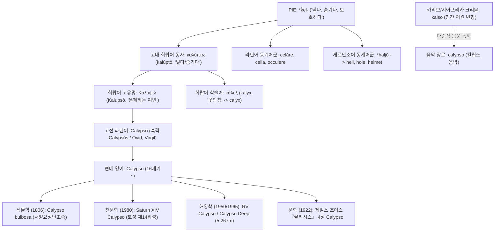

# Calypso (칼립소)

**[[greek-reading-guide|읽는 법]]**: 칼립소 · **원어**: Καλυψώ · **학술 전사**: *Kalupsṓ*

> **요약**: 호메로스 서사시 『오뒷세이아』의 오기기아 섬 님페 칼립소(Καλυψώ)의 이름에서 유래한 인명 유래어(Eponym)로, 인도유럽조어 *ḱel-(덮다, 감추다)에서 기원한 희랍어 동사 칼륍토(καλύπτω)를 모태로 하여, 라틴어를 거쳐 현대 영어의 신화적 고유명사, 식물학 속명(Calypso bulbosa), 천문학 위성명, 지중해 최심부 해양 지명(Calypso Deep) 및 문학적 은폐·고립 상징어로 분화되었습니다.

---

## 1. 어원 전파 계통도 (Etymological Transmission Tree)

---

## 2. 인구어(PIE) 및 희랍어 원어근 분석 (PIE & Proto-Greek Morphology)

### 2.1 인도유럽조어(PIE) 어근 및 음운 대응
- **PIE 조어 어근**: **`*ḱel-`** (덮다, 감추다, 보호하다; Pokorny IEW 553–554, LIV 322, Beekes EDG 626).
- **음운 법칙(Grimm의 법칙 및 구개음 대응)**:
  - PIE 무성 구개파열음 `*ḱ`는 켄툼(Centum) 어파인 그리스어와 라틴어에서 각각 무성 연구개파열음 `κ`(*k*)와 `c`(*k*)로 보존되었습니다.
  - 반면 사템(Satem) 어파 및 게르만어파에서는 자음 추이(그림의 법칙)에 따라 마찰음 `*h`로 전환되었습니다.
- **게르만어군 동계어(Cognates)**:
  - 게르만조어 `*haljō` (은폐된 지하세계) → 고대 영어 *hell* → 현대 영어 **hell**(지옥, 저승).
  - 게르만조어 `*hulaz` (파인 곳, 가려진 공간) → 현대 영어 **hole**(구멍), **hollow**(속이 빈), **hall**(홀).
  - 게르만조어 `*helmaz` (머리를 덮는 보호구) → 고대 영어 *helm* → 현대 영어 **helmet**(투구).
- **라틴어군 동계어(Cognates)**:
  - *celāre* (숨기다) → 고대 프랑스어 경유 현대 영어 **conceal**(숨기다).
  - *cella* (작은 방, 밀실) → 현대 영어 **cell**(세포, 감방).
  - *occulere* (덮어 가리다) → 현대 영어 **occult**(신비로운, 오컬트).
  - *clam* (비밀리에) → 현대 영어 **clandestine**(은밀한).

### 2.2 고대 희랍어 형태론 및 파생 접미사
희랍어 동사 **καλύπτω**(*kalúptō*)는 어근 `καλυβ-` / `καλυπ-`에 현재시제 형성 접미사 `-yō`가 결합하여 자음군 변화(`*kalup-yō` → `καλύπτω`)를 겪은 형태입니다(Chantraine DELG 488).

| 그리스어 실제형 | 학술 전사 | 표제형·형태론 | 한국어 풀이 | 근거 |
|:---|:---|:---|:---|:---|
| **καλύπτω** | *kalúptō* | 동사 현재 능동태 1인칭 단수 | 덮다, 가리다, 숨기다 | LSJ s.v. καλύπτω |
| **καλύψατο** | *kalúpsato* | 직설법 부정과거 중간태 3인칭 단수 | 스스로를 덮었다 | _Od._ 5.494 (불씨 직유) |
| **ἀμφικαλύψας** | *amphikalúpsas* | 분사 부정과거 능동태 남성 주격 단수 | 포근히 덮어주면서 | _Od._ 5.496 |
| **Καλυψώ** | *Kalupsṓ* | 고유명 여성 주격 단수 (단축/의인화) | 감추는 여인, 은폐자 | _Od._ 1.14; Peradotto (1990) |
| **κάλυξ** | *kályx* | 명사 여성 주격 단수 (꽃받침) | 꽃을 덮어 감싸는 껍질 | Chantraine DELG 489 (calyx) |

---

## 3. 호메로스 서사시 원전 용례 및 인명학 (Homeric Epic Context & Onomastics)

### 3.1 호메로스 텍스트 출전
- 『오뒷세이아』 1권 14행: 최초 출현 및 정형구 결합(*númphē pótni' éruke Kalupsṓ, dîa theáōn*).
- 『오뒷세이아』 5권 491–496행: 스케리아 해변 '불씨 직유'에서의 동사적 언어유희 (καλύψατο).
- 『오뒷세이아』 7권 245행: 오뒷세우스의 1인칭 초점화(*Átlantos thugátēr, dolóessa Kalupsṓ*).

### 3.2 인명학(Onomastics) 분석: Nomen-Omen과 서사적 기능
고전문헌학자 존 페라도토(John Peradotto 1990)는 칼립소라는 인명이 호메로스 서사시에서 '이름이 곧 운명(Nomen-Omen)'인 가장 대표적인 사례임을 밝혔습니다:
- **서사적 말살**: 칼립소의 은폐 행위는 영웅 오뒷세우스를 세상의 시선으로부터 덮어 가림으로써, 공동체의 찬양을 통해 불멸을 얻는 [[concept-kleos|클레오스]](명성)를 박탈하고 그를 "보이지도 않고 알려지지도 않은 존재(ἄιστος ἄπυστος, _Od._ 1.242)"로 만듭니다.
- **불씨 직유의 상징적 전도**: 5권 494행에서 오뒷세우스가 나뭇잎 속에 몸을 "덮는(καλύψατο)" 순간, 칼립소의 파괴적·타자적 은폐는 영웅 자신의 생명을 보존하기 위한 자발적 자기 은폐로 전환되며, 칼립소라는 이름의 부정적 마력이 극복됩니다.

---

## 4. 역사적 전파 및 수용사 경로 (Historical Transmission & Reception)

1. **고대 그리스에서 로마 라틴어로의 수용**:
   - 고대 그리스 서사시의 **Καλυψώ**는 헬레니즘기를 거쳐 로마 공화정 및 제정기 서사시로 직수용되었습니다.
   - 라틴어 형태는 그리스어 곡용을 보존한 3변화 명사 **Calypso**(속격 *Calypsūs*)로 정착되었으며, 오비디우스(Ovid)의 『사랑의 기술』 및 베르길리우스(Virgil)의 『아이네이스』에 깊은 영향을 미쳤습니다.
2. **초기 근대 영어로의 직수입**:
   - 16세기 르네상스 고전 부흥기, 조지 채프먼(George Chapman)의 호메로스 번역(1614–1616)을 통해 라틴어 철자 **Calypso**가 영어 어휘 체계로 직수입되었습니다.
3. **18~20세기 근현대 학술 명명 및 문화적 차용**:
   - 19세기 린네식 생물 분류학에서 꽃받침이나 포낭이 숨겨져 있는 식물속에 라틴어 학명으로 명명되었습니다(Salisbury 1806).
   - 20세기 중반 해양학 및 천문학 탐사에서 미지의 심해와 외계 위성을 명명하는 표준 학술 고유명사로 확장되었습니다.

---

## 5. 음운 및 의미 변화사 (Phonological & Semantic Evolution)

### 5.1 음운 및 철자 변천
- **희랍어 단계**: `Καλυψώ` (*Kalupsṓ*, 무성 양순파열음 p + 무성 치경마찰음 s의 이중자음 ψ 및 장모음 ō 보존).
- **라틴어 단계**: *Calypso* (그리스어 그리스문자 카파(κ)가 라틴 c로, 윕실론(υ)이 y로 정규 전사됨).
- **영어 단계**: *Calypso* (/kəˈlɪp.soʊ/, 2음절 단모음 /ɪ/ 및 강세 이동).

### 5.2 역사적 의미 전이 (Semantic Shifts)
- **원초적 물리 의미**: "천이나 대지로 어떤 대상을 덮어 가리다" (PIE `*ḱel-` → 희랍어 *kalýptō*).
- **신화적 인격화**: "영웅을 세상의 빛과 명성으로부터 격리하여 숨겨두는 외딴 섬의 요정" (호메로스 *Kalupsṓ*).
- **근대적 전유**: "외딴 낙원, 관능적 유혹, 또는 외부와 단절된 안락한 감옥" (페늘롱, 제임스 조이스).
- **현대 과학적 전문화**: "자연계에서 가려져 있거나 깊은 심연에 도달할 수 없는 미지의 대상" (식물학, 해양학, 천문학).

---

## 6. 현대 영어 파생어군 및 어휘 패밀리 (Modern English Cognates & Derivatives)

| 단어 (Word) | 품사 | 의미 및 용법 | 최초 기록 (OED) | 확실성 |
|:---|:---|:---|:---|:---|
| **Calypso** | 고유명사 | 호메로스 신화 속의 님페 칼립소 | 16세기 말 | 정설/문헌 입증 |
| **Calypso** (*Calypso bulbosa*) | 명사 (식물학) | 서양요정난초속 (Fairy slipper orchid) | 1806년 (Salisbury) | 정설/문헌 입증 |
| **Calypso Deep** | 고유명사 (지리) | 지중해 이오니아 해의 최심부 해연 (5,267m) | 1965년 | 정설/문헌 입증 |
| **Saturn XIV Calypso** | 고유명사 (천문) | 토성의 제14위성 (트로이아 위성군) | 1980년 (발견) | 정설/문헌 입증 |
| **RV Calypso** | 고유명사 (선박) | 자크 쿠스토(Jacques Cousteau)의 해양 탐사선 | 1950년 | 정설/문헌 입증 |
| **calyx** | 명사 (생물학) | 꽃받침 (동원 희랍어 κάλυξ 경유) | 17세기 | 정설/문헌 입증 |
| **calyptra** | 명사 (식물학) | 선태류의 포자낭을 덮는 모자 (칼립트라) | 18세기 | 정설/문헌 입증 |

---

## 7. 인명·신명 파생 고유명사 및 관용표현 (Eponymous Terms & Cultural Idioms)

### 7.1 전문 학술 명명 (Scientific Eponyms)
- **서양요정난초속 (Calypso bulbosa)**:
  1806년 식물학자 리처드 앤서니 솔즈베리(R. A. Salisbury)가 명명한 북반구 아한대 자생 난초로, 입술꽃잎(labellum)이 주머니 모양으로 깊숙이 가려져 있는 은폐 특성에서 착안하여 칼립소의 이름을 붙였습니다.
- **칼립소 해연 (Calypso Deep)**:
  그리스 펠로폰네소스 반도 남서쪽 이오니아 해구에 위치한 지중해의 가장 깊은 지점(수심 5,267m)으로, 도달할 수 없는 바다의 심연을 뜻하는 호메로스적 '바다의 배꼽' 은유에서 명명되었습니다.
- **토성 제14위성 칼립소 (Calypso)**:
  1980년 보이저 1호 관측을 통해 발견된 토성의 위성으로, 테티스(Tethys)의 궤도를 공유하는 트로이아 위성 중 하나입니다.

### 7.2 문학적 수용 (Literary Reception)
- **제임스 조이스 『율리시스』 4장 ("Calypso")**:
  주인공 레오폴드 블룸이 아침에 일어나 돼지 콩팥을 굽고 침대에 누워 있는 아내 몰리 블룸을 시중드는 에피소드로, 블룸을 가두는 몰리의 육체적 관능과 권태를 신화 속 칼립소의 오기기아 섬에 대입시켰습니다.

---

## 8. 어원 증거 매트릭스 및 학술 출처 (Evidence Matrix & References)

| 어원 및 수용 명제 | 언어 층위 | 확실성 등급 | 출전 및 학술 문헌 근거 |
|:---|:---|:---|:---|
| PIE 조어 어근 `*ḱel-` 재구 | PIE | 학술적 재구 | Pokorny (1959) IEW 553–554, LIV 322 |
| 고대 희랍어 동사 καλύπτω 파생 | 고대 희랍어 | 정설/문헌 입증 | Beekes (2010) EDG 626; Chantraine DELG 488 |
| 호메로스 원전 용례 및 불씨 직유 | 고대 희랍어 | 정설/문헌 입증 | _Od._ 1.14, 5.491–496; Peradotto (1990) |
| 라틴어 Calypso 차용 | 라틴어 | 정설/문헌 입증 | Lewis & Short; Ovid, _Ars Amatoria_ 2.123 |
| 식물학속명 Calypso 명명 | 근대 라틴어 | 정설/문헌 입증 | Salisbury (1806); OED Online s.v. Calypso |
| 트리니다드 칼립소 음악 유래 | 서아프리카 크리올 | 민간어원/허구 (Spurious) | Hill (1993); Warner (1982); OED Online |

> [!WARNING] 민간 어원(Folk Etymology) 주의: 트리니다드 칼립소(Calypso) 음악
> 트리니다드 토바고의 대표적인 카리브해 민속 음악 장르인 **칼립소**(calypso)는 그리스 신화의 여신 칼립소와 어원적으로 아무런 역사적 관련이 없습니다.
> 
> 음악학자 어롤 힐(Errol Hill 1993)과 옥스퍼드 영어사전(OED)의 정밀 고증에 따르면, 이 음악 용어는 서아프리카 어군(에웨어, 요루바어)의 격려성 감탄사이자 프랑스-크리올어 패트와(patois)에서 뛰어난 노래에 환호하던 단어인 **카이소**(*kaiso*)에서 출발했습니다. 19세기 말~20세기 초 영국 식민지 지배층의 음운적 동화 과정에서, 지배층에게 친숙했던 고전 그리스 신화의 고유명사 'Calypso'의 발음과 철자로 왜곡·정착된 전형적인 **민간 어원**(Folk Etymology)이자 음운적 견인(Phonetic Attraction)의 사례입니다.

---

## 관련 항목
- **호메로스 위키 연관 문서**:
  - [[entity-calypso|칼립소 (Calypso)]]
  - [[entity-odysseus|오디세우스 (Odysseus)]]
  - [[concept-kleos|클레오스 (Kleos)]]
  - [[concept-nostos|노스토스 (Nostos)]]
  - [[concept-xenia|크세니아 (Xenia)]]
- **동계어 및 어원 사전 인덱스**:
  - [[word-odyssey|Odyssey (오디세이)]]
  - [[words/index|어원 사전 인덱스]]
