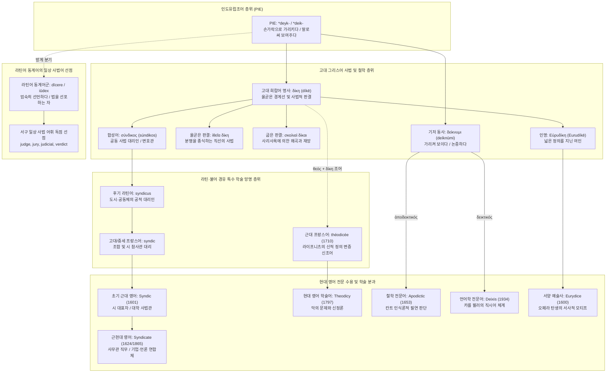

# Dike (디케)

**[[greek-reading-guide|읽는 법]]**: 디케 · **원어**: δίκη · **학술 전사**: *díkē*

> **요약**: 고대 그리스어 **디케**(δίκη, *díkē*, 사법적 판결·올곧은 경계 선언)와 기저 동사 **데이크뉘미**(δείκνυμι, *deíknūmi*, 가리켜 보이다)는 손가락이나 말로써 마땅한 한계를 가리키는 인도유럽조어 어근 `*deyḱ-`에서 기원하였습니다. 서구 일상 사법 어휘를 라틴어 동계어(*judge*, *verdict*)가 선점함에 따라, 그리스어 계통은 공동 권익을 옹호하는 자치 조직인 **Syndic** 및 **Syndicate**(1601/1624), 악의 문제 앞에서 신의 공의를 변증하는 **Theodicy**(1710/1797), 논리적 필연성을 뜻하는 **Apodictic**(1653), 현대 언어학의 직시어 체계인 **Deixis**(1934), 그리고 신화 인명 **Eurydice**를 통한 서양 오페라의 탄생으로 수용되었습니다.

---

## 1. 어원 전파 및 어휘적 분기 계통도 (Etymological Transmission Tree)



---

## 2. 인구어(PIE) 및 희랍어 원어근 분석 (PIE & Proto-Greek Morphology)

> [!NOTE] 순수 인도유럽어(PIE) 정통 어원 및 기층어 배제
> 고대 그리스어 **디케**(δίκη)와 **데이크뉘미**(δείκνυμι)는 비교언어학 공인 어원 사전(Beekes 2010 EDG I: 337–338; Chantraine DELG: 278–280; Frisk GEW I: 391–393; LIV²: 108–109)에서 의심의 여지 없이 정통 인도유럽조어(PIE) 어근 `*deyḱ-`에서 유래한 것으로 확증되었습니다. 비-인도유럽계 선희랍 기층어(Pre-Greek substrate) 혐의는 존재하지 않습니다.

### 2.1 PIE 어근 `*deyḱ-`와 모음 교체(Ablaut)의 3단계 체계

인도유럽조어 어근 `*deyḱ-`의 원초적 의미는 "손가락이나 말로써 가리키다, 마땅한 방향과 한계를 보여주다, 엄숙히 선포하다(to point out, show, pronounce solemnly)"입니다. 이 어근은 다음과 같은 3단계 모음 교체를 통해 다양한 어휘군으로 분기되었습니다:

1. **e-등급 (Full Grade: `*deyḱ-`)**:
   - **그리스어 동사**: 비음 접미사 결합형 `*deyk-nu-mi` > **δείκνυμι** (*deíknūmi*, 가리키다, 보여주다). 파생 명사 **δεῖξις** (*deîxis*, 지시, 직시), 합성 명사 **παράδειγμα** (*parádeigma*, 본보기, 패러다임).
   - **라틴어 동사**: 주제모음형 동사 `*deyk-e/o-` > 고전 라틴어 **dīcō, dīcere** (엄숙히 말하다, 선포하다). (*ei > 장모음 *ī 음운 전이).
   - **게르만 조어 1류 강변화 동사**: `*tīx-an-` > 고대 영어 **tēon** (기소하다, 고발하다; 현대 독일어 *zeihen*과 일치), 고트어 **ga-teihan** (알리다, 선언하다).
2. **o-등급 (o-Grade: `*doyḱ-`)**:
   - **게르만 조어 사동사**: `*doyḱ-eye/o-` > 게르만 조어 `*taikijaną` > 고대 영어 **tǣċan** (> 현대 영어 **teach**, 가르치다, 보여주어 알게 하다).
   - **게르만 조어 명사**: `*doyḱ-no-m` > 게르만 조어 `*taikną` > 고대 영어 **tācen** (> 현대 영어 **token**, 징표, 표식), 고대 고지독일어 **zeihhan** (> 현대 독일어 **Zeichen**, 부호, 기호).
3. **제로 등급 (Zero Grade: `*diḱ-`)**:
   - **원시 희랍어 명사**: 제로 등급 어근 `*diḱ-`에 집합·추상 명사 접미사 `*-eh₂` 결합:
     $$\text{PIE } *\text{diḱ-eh₂} \longrightarrow \text{원시 희랍어 } *\text{dik-ā́} \longrightarrow \text{도리아 } \delta\text{ί}\kappa\alpha \longrightarrow \text{이오니아-아티케 } \delta\text{ί}\kappa\eta \text{ (díkē)}$$
     기저 형태는 접미사 강세(산스크리트어 *diśā́-*와 대응)였으나, 희랍어 명사화 과정에서 파록시톤(`δίκη`)으로 열성 후퇴하여 고정되었습니다.
   - **산스크리트어**: 제로 등급 여성 어근 명사 **diś-** (가리킴, 방향, 방위) 및 ā-어간 명사 **diśā-** (방향, 방위).
   - **라틴어 복합어**: `*iowes-dik-s` (*ious '법' + zero-grade *-dik-s '선포하는 자') > **iūdex** (재판관, 판사), `*in-dik-s` > **index** (색인, 지표, 집게손가락).

### 2.2 핵심 형태론 4열 대조표

| 그리스어 실제형 | 학술 전사 | 표제형·형태론 | 한국어 풀이 | 문헌학적 맥락 및 근거 |
|:---|:---|:---|:---|:---|
| **δίκη** | *díkē* | 명사 여성 주격 단수 | 사법적 판결, 올곧은 경계선, 본성 | Zero-grade `*diḱ-eh₂`. (*Od.* 11.218; LSJ) |
| **δίκην** | *díkēn* | 명사 여성 대격 단수 | 판결을 선포하다 (*díkēn eipeîn*) | 대격 부사 용법: "~의 방식으로, 처럼" (*Il.* 18.508) |
| **δίκαι** | *díkai* | 명사 여성 복수 주격 | 판례 정형구들, 전승된 사법 규범 | 복수형은 대대로 전해진 판례의 총체 (*Il.* 1.542) |
| **δικασπόλος** | *dikaspólos* | 명사 남성 주격 단수 | 판례 정형구를 보존·집행하는 재판관 | *dikas* + *-polos* (`*kʷolos`, 파수꾼) 결합 (*Il.* 1.238) |
| **δίκαιος** | *díkaios* | 형용사 남성 주격 단수 | 의로운 자, 신을 두려워하는 자 | 디케의 선을 넘지 않는 이상적 품성 (*Od.* 9.175) |
| **δικάζω** | *dikázō* | 동사 현재 능동 1인칭 단수 | 판결을 내리다, 재판하다 | 치음 확대 분모동사 `*dikā-d-yō` (*Il.* 18.506) |
| **δείκνυμι** | *deíknūmi* | 동사 현재 능동 1인칭 단수 | 손가락이나 말로 가리켜 보이다 | e-grade 어근 `*deyk-` + 비음 접미사 *-nu-* (LIV²) |
| **σύνδικος** | *súndikos* | 명사 남성 주격 단수 | 공동 사법 대리인, 변호인 | 전치사 *sun* + zero-grade *-dik-os* 결합 |

> [!WARNING] 민간 어원(Folk Etymology) 및 동음이의어 주의
> 현대 영어 단어 **dike** 또는 **dyke**(제방, 둑, 도랑)는 고대 영어 *dīc*(도랑, 참호), 원시 게르만어 `*dīkaz` 및 인도유럽조어 어근 `*dʰeygʷ-`("찌르다, 파다, 흙을 쌓다", 현대 영어 *ditch*, *dig*와 직계 동근)에서 유래한 고유 게르만계 어휘입니다. 고대 그리스어의 사법적 경계 선언인 **dike**(δίκη, PIE `*deyḱ-` '가리키다, 말하다')와는 외형의 철자만 유사할 뿐 비교언어학적으로 아무런 역사적 관련성이 없는 전형적인 가짜 동계어(False Cognate)이므로 혼동에 각별히 유의해야 합니다.

> [!NOTE] 라틴어 digitus(손가락) 동계어설의 학술적 한계
> 전통적으로 라틴어 *digitus*(손가락, 숫자)를 `*deyḱ-`('가리키는 신체 부위')와 연결하려는 시도가 있었으나, 현대 비교음운론(de Vaan 2008)에서는 PIE 무성음 `*ḱ`가 라틴어 어중에서 유성음 *g*로 변화하는 과정 및 단모음 *i*의 음운 대응이 성립하지 않아 '논쟁적/불확실(Contested)'한 항목으로 분류합니다.

---

## 3. 호메로스 서사시 원전 용례 (Homeric Epic Context)

호메로스 서사시에서 **디케**(δίκη)는 추상적 도덕 관념 이전에 공론장(아고라)의 석조 원진에서 홀을 쥐고 구두 언어로 올곧은 경계를 선포하는 사법적 행위이자, 각 존재 조건에 부과된 숙명적 본성을 의미합니다. (상세 서사 및 제도 분석은 [[concept-dike|디케 (Dike)]] 참조)

### 3.1 판례 정형구의 파수꾼인 재판관 (*Il.* 1.238–239)
- **번역**: "이제는 아카이오이족의 아들들인 재판관(디카스폴로이)들이 손에 이를 쥐고 있으니, 그들은 제우스께로부터 전해진 규범(테미스테스)을 수호하는 자들이오."
- **원문**: *νῦν αὖτέ μιν υἷες Ἀχαιῶν / ἐν παλάμῃς φορέουσι δικασπόλοι, οἵ τε θέμιστας / πρὸς Διὸς εἰρύαται·*
- **학술 전사**: *nûn aûté min huîes Akhaiō̂n / en palámēis phoréousi dikaspóloi, hoí te thémistas / pròs Diòs eirúatai;*
- **[주석]**: 복합어 `δικασπόλος`는 판례 정형구 복수형 *dikas*와 파수꾼 *-polos*의 결합으로, 재판관이 법의 창작자가 아닌 전승된 구두 판결문의 수호자임을 나타냅니다. ([[concept-dike#3-호메로스-서사시-내-작동-메커니즘-operational-mechanism-in-homeric-epic|디케 개념 문서 3절]] 참조)

### 3.2 굽은 판결과 디케 추방에 대한 우주적 신벌 (*Il.* 16.387–388)
- **번역**: "그들이 공론장(아고라)에서 폭력으로 굽은 판결을 내리고, 신들의 감시를 아랑곳하지 않은 채 디케를 몰아낼 때라오."
- **원문**: *οἳ βίῃ εἰν ἀγορῇ σκολιὰς κρίνωσι θέμιστας, / ἐκ δὲ δίκην ἐλάσωσι θεῶν ὄπιν οὐκ ἀλέγοντες·*
- **학술 전사**: *hoì bíēi ein agorē̂i skoliàs krínōsi thémistas, / ek dè díkēn elásōsi theō̂n ópin ouk alégontes;*
- **[주석]**: 기하학적 굽은 판결(*skoliaì thémistas*) 대 디케의 충돌. 호메로스 서사시에서 디케가 추방당하는 주체로 의인화되며 제우스의 우주적 홍수 신벌을 부르는 유일한 대목입니다. ([[concept-dike#4-핵심-에피소드-및-원전-텍스트-정밀-독해-key-narrative-episodes--close-reading|디케 개념 문서 4.(2)절]] 참조)

### 3.3 아킬레우스 방패의 재판과 가장 올곧은 판결 (*Il.* 18.508)
- **번역**: "원로들 한가운데에 금 두 달란트가 놓여 있었으니, 그들 가운데 가장 올곧게 판결을 말한 자에게 주려는 것이었다."
- **원문**: *κεῖτο δ' ἄρ' ἐν μέσσοισι δύω χρυσοῖο τάλαντα, / τῷ δόμεν ὃς μετὰ τοῖσι δίκην ἰθύντατα εἴποι.*
- **학술 전사**: *keîto d' ár' en méssoisi dúō khrusoîo tálanta, / tō̂i dómen hòs metà toîsi díkēn ithúntata eípoi.*
- **[주석]**: 구두 사법 선포(*díkēn eipeîn*; 라틴어 *iūs dīcere*의 원형)와 직선 최상급 부사 *ithúntata*의 결합으로, 공평무사한 경계선을 구두로 그어준 판관에게 상금을 수여하는 장면입니다. ([[concept-dike#4-핵심-에피소드-및-원전-텍스트-정밀-독해-key-narrative-episodes--close-reading|디케 개념 문서 4.(1)절]] 참조)

### 3.4 피해자에 대한 마땅한 관습적 보상 몫 (*Il.* 19.180)
- **번역**: "그런 다음 그[아가멤논]가 자신의 막사에서 기름진 잔치로 그대[아킬레우스]를 달래도록 하시오, 그대가 마땅한 몫(디케)에서 조금의 결손도 없도록 말이오."
- **원문**: *αὐτὰρ ἔπειτά σε δαιτὶ ἐνὶ κλισίῃς ἀρεσάσθω / πιείρῃ, ἵνα μή τι δίκης ἐπιδευὲς ἔχῃσθα.*
- **학술 전사**: *autàr épeitá se daitì enì klisíēis aresásthō / pieírēi, hína mḗ ti díkēs epideuès ékhēistha.*
- **[주석]**: 2인칭 단수 접속법 *ékhēistha*의 청자는 아킬레우스입니다. 여기서의 *díkē*는 관념적 정의가 아니라 분쟁 해결 시 피해자에게 제공되는 '마땅한 관습적 보상 몫(due)'을 지칭합니다. ([[concept-dike#1-개념-정의-및-기본-성격-definition--core-nature|디케 개념 문서 1절]] 참조)

### 3.5 환대와 경신을 갖춘 의로운 자들 (*Od.* 9.175)
- **번역**: "과연 그들이 오만하고 거칠며 의롭지(디카이오이) 못한 자들인지, 아니면 나그네를 환대하며 신을 두려워하는 마음을 지녔는지."
- **원문**: *ἤ ῥ' οἵ γ' ὑβρισταί τε καὶ ἄγριοι οὐδὲ δίκαιοι, / ἦε φιλόξεινοι, καί σφιν νόος ἐστὶ θεουδής.*
- **학술 전사**: *ḗ rh' hoí g' hubristaí te kaì ágrioi oudè díkaioi, / ē̂e philóxeinoi, kaí sphin nóos estì theoudḗs.*
- **[주석]**: 서사시 고유의 대립 정형구로, *díkaios*는 단순한 준법자를 넘어 나그네 환대([[concept-xenia|크세니아]])와 경신(*theoudḗs*)을 체현한 문명인의 이상적 도덕성을 의미합니다. ([[concept-dike#4-핵심-에피소드-및-원전-텍스트-정밀-독해-key-narrative-episodes--close-reading|디케 개념 문서 4.(5)절]] 참조)

### 3.6 필멸자의 숙명적 존재 본성 (*Od.* 11.218)
- **번역**: "하지만 이것이 필멸자들의 정해진 본성(디케)이란다, 그들이 죽음을 맞이했을 때 말이니. 힘줄들이 더 이상 살점과 뼈들을 붙들지 못하고,"
- **원문**: *ἀλλ' αὕτη δίκη ἐστὶ βροτῶν, ὅτε κέν τε θάνωσιν· / οὐ γὰρ ἔτι σάρκας τε καὶ ὀστέα ἶνες ἔχουσιν,*
- **학술 전사**: *all' haútē díkē estì brotō̂n, hóte kén te thánōsin; / ou gàr éti sárkas te kaì ostéa înes ékhousin,*
- **[주석]**: 사법 이전의 원초적 질서로서 인간 육신이 소멸하고 그림자가 저승으로 날아가는 필멸성의 불가피한 본성을 뜻합니다. ([[concept-dike#4-핵심-에피소드-및-원전-텍스트-정밀-독해-key-narrative-episodes--close-reading|디케 개념 문서 4.(3)절]] 참조)

### 3.7 노예의 신분적 행동 양식과 처지 (*Od.* 14.59–60)
- **번역**: "늘 두려움에 떠는 것, 이것이 바로 새로운 주인들의 지배를 받는 노예들의 처지(디케)이지요."
- **원문**: *ἡ γὰρ δμώων δίκη ἐστὶν / αἰεὶ δειδιότων, οἵ τ' ἐπικρατέωσι νέοι.*
- **학술 전사**: *hē gàr dmṓōn díkē estìn / aieì deidiótōn, hoí t' epikratéōsi néoi.*
- **[주석]**: 노예라는 특수한 사회 집단에 부과된 행동 양식이자 숙명적 처지를 뜻하는 어휘적 용례입니다. ([[concept-dike#4-핵심-에피소드-및-원전-텍스트-정밀-독해-key-narrative-episodes--close-reading|디케 개념 문서 4.(4)절]] 참조)

### 3.8 올곧은 사법과 대지의 생태적 번영 (*Od.* 19.109–114)
- **번역**: "...신을 두려워하며 용맹한 수많은 백성을 다스리는 흠 없는 왕이 올곧은 재판(에우디키아이)을 굳게 지킬 때, 검은 대지는 밀과 보리를 내어주고..."
- **원문**: *...ὅς τε θεουδὴς / ἀνδράσιν ἐν πολλοῖσι καὶ ἰφθίμοισιν ἀνάσσων / εὐδικίας ἀνέχῃσι, φέρῃσι δὲ γαῖα μέλαινα / πυροὺς καὶ κριθάς...*
- **학술 전사**: *...hós te theoudḕs / andrásin en polloîsi kaì iphthímoisin anássōn / eudikías anékhēisi, phérēisi dè gaîa mélaina / puroùs kaì krithás...*
- **[주석]**: 합성어 `εὐδικία`(*eudikía*, 올곧은 사법)의 서사시 유일 용례(Hapax legomenon)로, 사법적 올바름이 생태적 결실로 이어지는 고졸기 왕권 신화의 정수입니다. ([[concept-dike#4-핵심-에피소드-및-원전-텍스트-정밀-독해-key-narrative-episodes--close-reading|디케 개념 문서 4.(5)절]] 참조)

---

## 4. 역사적 전파 및 수용사 경로 (Historical Transmission & Reception)

인도유럽조어 어근 `*deyḱ-`의 서구 수용사는 **라틴어 동계어의 일상 사법어 완전 선점**(Preemption)과 **그리스어 차용어의 특수 학술·제도적 망명**(Niche Migration)이라는 독특한 어휘적 분업을 형성하였습니다.

### 4.1 라틴어 동계어 선점과 어휘적 분할 메커니즘
- **라틴어의 사법 어휘 독점**: 로마 공화정과 제정의 사법 행정, 대륙법의 기반인 유스티니아누스 법전, 그리고 노르만 정복 이후 잉글랜드 사법부를 지배한 법률 불어(Law French)는 라틴어 동계어 어간 `*deik-`(*dīcere* '말하다', *iūdex* < `*iowes-dik-s` '법을 선포하는 자')을 통해 서구 사법 제도의 일상 어휘를 완전히 장악했습니다:
  - 재판관·사법: *judge*, *judgment*, *judiciary*, *judicial* (< *iūdex*)
  - 법적 선언·평결: *verdict* (< *vērē dictum*, '참되게 말해진 것')
  - 사법 관할권: *jurisdiction* (< *iūrisdictiō*, '법을 선언하는 권한')
  - 기소: *indictment* (< *indīcere*)
- **그리스어 δίκη의 특수화 망명**: 이로 인해 그리스어 *dike*는 서구 일상 법정의 보통명사로 직접 유입되지 못하고, 라틴계 법률어가 포괄할 수 없는 **자치적 결사 대의**, **형이상학적 우주 법정**, **인식론적 절대 증명**, **화용론적 지시**의 고유 영역으로 특수화되어 차용되었습니다.

### 4.2 4대 역사적 차용 층위
1. **16–17세기 르네상스 공공 행정 및 자치 대리인 층위**:
   - **syndic** (n., 1601 OED): 그리스어 σύνδικος (*súndikos*, σύν '함께' + δίκη '소송·권리' → 공동체의 법적 권익을 대변하는 자)에서 후기 라틴어 *syndicus*(지방 자치시 법률 대리인) 및 중세 프랑스어 *syndic*을 거쳐 초기 근대 영어로 차용되었습니다. 오늘날 케임브리지 대학 출판부의 운영 위원회(Syndics) 등 공공 조직의 감사·사무관 명칭으로 존속합니다.
   - **syndicate** (n., 1624; v., 1865 OED): *syndic*의 집무실과 권한(*syndicat*)을 뜻하던 명사에서 출발하여, 19세기 후반 자본주의 팽창기 금융 카르텔과 기업 연합, 신문 기사·방송 프로그램을 다수 매체에 일괄 배급하는 미디어 연합체로 의미가 폭발하였습니다.
2. **18세기 계몽주의 형이상학 신조어 층위**:
   - **theodicy** (n., 1710 프랑스어 저작 → 1797 영어 OED): 독일 철학자 라이프니츠(G. W. Leibniz)가 1710년 저서 『신정론(Essais de Théodicée)』에서 창안한 학술 신조어입니다. 그리스어 θεός (*theós*, 신)와 δίκη (*díkē*, 정의, 정당화)를 결합하여, 세상에 악과 고통이 실재함에도 불구하고 전능하고 선한 신의 공의를 이성적으로 변증하는 독립 철학 분과명으로 정착했습니다.
3. **17세기 인문주의 논리학 및 18세기 칸트 비판철학 층위**:
   - **apodictic / apodeictic** (adj., 1653 OED): 그리스어 ἀποδεικτικός (*apodeiktikós*, 명백히 증명하는 < ἀποδείκνυμι '명백히 보여주다')에서 유래하여 아리스토텔레스의 증명 삼단논법을 거쳐 17세기 학술 영어로 유입되었습니다. 임마누엘 칸트(I. Kant)의 『순수이성비판』(1781)에서 개연적·실연적 판단을 넘어서는 '선험적·논리적 필연성을 지닌 판단'으로 확립되었습니다.
4. **20세기 구조주의 및 기능언어학 층위**:
   - **deixis / deictic** (n., adj., 1934 OED): 그리스어 δεικτικός (*deiktikós*, 직접 가리키는)에서 유래하여 오스트리아 심리학자·언어학자 카를 뷜러(Karl Bühler, 1934)의 『언어이론』을 통해 화자의 발화 시공간 좌표(I-Here-Now)를 지시하는 핵심 개념어로 현대 언어학에 정착했습니다.

---

## 5. 음운 및 의미 변화사 (Phonological & Semantic Evolution)

### 5.1 인지언어학적 5단계 의미 전이 체계

```
[1단계: 공간적 신체 지시]  PIE *deyḱ- (손가락/말로써 마땅한 한계선을 가리키다)
         ↓
[2단계: 구두 발화와 정형구]  고대 그리스어 δίκην εἰπεῖν (권위 있는 자가 마땅한 몫을 구두로 선언하다)
         ↓
[3단계: 분쟁 사법과 경계선]  호메로스 ἰθεῖα δίκη (공론장에서 굽은 폭력을 배제하고 올곧은 직선을 긋다)
         ↓
[4단계: 우주적 실체화]      제우스의 딸이자 감시관 여신 Dike (자연재해 신벌과 우주적 질서 수호)
         ↓
[5단계: 근현대 전문 분과화]  syndicate (공동 대변) / theodicy (신정론) / apodictic (논리 필연) / deixis (직시)
```

1. **1단계 (물리적·공간적 기저)**: 손가락으로 마땅한 방향과 공간적 경계를 가리키는 원초적 신체 행위 (체화된 인지).
2. **2단계 (구두 발화와 관습적 규범)**: 손가락이 아니라 '말로써 보여주기(montrer par la parole)'로 매체 전이. 각 존재가 세계 안에서 차지하는 고유한 본성이자 정해진 몫으로 어휘화.
3. **3단계 (사법 절차와 분쟁 해결)**: 상이한 가문 간의 분쟁에서 혈복수를 중단시키고 올곧은 경계선을 구두로 공표하는 사법 제도 확립.
4. **4단계 (우주적·도덕적 실체화)**: 인간의 사법 불의가 자연 생태계 전체를 파괴한다는 우주론적 정의관 및 올림포스 인격신으로의 승화.
5. **5단계 (근현대 전문 어휘화)**: 공동체 권익 옹호, 신학적 변증, 형식논리학의 필연성, 언어학적 맥락 결속 등 현대 분과학문의 정밀한 전문어로 분화.

### 5.2 은유 및 환유 인지 메커니즘
- **개념적 은유 (Conceptual Metaphor)**:
  - **[도덕적 공평성은 기하학적 직선이다] (MORAL FAIRNESS IS A STRAIGHT LINE)**:
    공간 지각에서 경험하는 '똑바른 직선(ἰθύς, *ithús*)과 비틀린 곡선(σκολιός, *skoliós*)'의 물리적 대립이 사법적 공평무사(ἰθεῖα δίκη)와 뇌물·폭력에 의한 왜곡(σκολιαὶ δίκαι)이라는 도덕적 가치 체계로 투사되었습니다.
- **환유적 연쇄 (Metonymic Chaining)**:
  [신체적 가리킴(`*deyḱ-`)] $\rightarrow$ [말로써 선언하기(*díkēn eipeîn*)] $\rightarrow$ [선언된 개별 판례 정형구(*díkai*)] $\rightarrow$ [사법 제도 및 정의 전체(*díkē*)]로 이어지는 부분-전체 환유가 일어났습니다.

---

## 6. 현대 영어 파생어군 및 어휘 패밀리 (Modern English Family)

### 6.1 그리스 직수입 어군 (Direct Greek Borrowings)

| 품사/형태 | 단어 (Word) | 의미 및 용법 | 최초 기록 (OED) | 확실성 등급 |
|:---|:---|:---|:---:|:---|
| **명사 (Noun)** | **syndic** | 자치도시 행정관, 대학 출판부 평의원/사무관 (< Fr. *syndic* < Gr. *súndikos*) | 1601년 | 정설/문헌 입증 |
| **명사 (Noun)** | **syndicate** | 신디케이트, 기업 연합체, 카르텔, 기사 배급사 (< Fr. *syndicat*) | 1624년 | 정설/문헌 입증 |
| **동사 (Verb)** | **syndicate** | 신디케이트를 결성하다; 기사·방송을 여러 매체에 동시 배급하다 | 1865년 | 정설/문헌 입증 |
| **명사 (Noun)** | **syndication** | 연합 조직화, 기사·방송 프로그램의 동시 배급(신디케이션) | 1889년 | 정설/문헌 입증 |
| **명사 (Noun)** | **syndicalism** | 생디칼리슴, 혁명적 노동조합주의 (< Fr. *syndicalisme*) | 1907년 | 정설/문헌 입증 |
| **명사 (Noun)** | **theodicy** | 신정론(神正論), 악의 문제에 맞선 신의 공의 변증 (< Fr. *théodicée*) | 1797년 | 정설/문헌 입증 |
| **형용사 (Adj)** | **theodicean** | 신정론의, 신의 정의를 변호하는 | 1855년 | 정설/문헌 입증 |
| **형용사 (Adj)** | **apodictic** | 명증한, 필연적인, 반박 불가능한 (< Gr. *apodeiktikós*) | 1653년 | 정설/문헌 입증 |
| **부사 (Adv)** | **apodictically** | 명증적으로, 선험적 필연성으로 | 1656년 | 정설/문헌 입증 |
| **형용사 (Adj)** | **deictic** | 직시적인, 발화 맥락(나-여기-지금)에 결속된 (< Gr. *deiktikós*) | 1828년 (언어학 1934) | 정설/문헌 입증 |
| **명사 (Noun)** | **deixis** | 직시 작용, 직시소(空間·時間·人稱 直示) (< Gr. *deîxis*) | 1934년 | 정설/문헌 입증 |
| **명사 (Noun)** | **paradigm** | 패러다임, 본보기, 전형, 어형 변화표 (< Gr. *parádeigma*) | c. 1483년 | 정설/문헌 입증 |
| **형용사 (Adj)** | **paradigmatic** | 모범적인, 전형적인; (구조주의 언어학) 계열체적인 | 1867년 | 정설/문헌 입증 |
| **고유명사** | **Eurydice** | 에우리디케 (신화 인명; 최초의 오페라 표제) (< Gr. *Eurudíkē*) | 1590년대 | 정설/문헌 입증 |
| **고유명사** | **Dike** | 디케 (정의의 여신; 소행성 99 Dike) (< Gr. *Díkē*) | 16세기 (소행성 1868) | 정설/문헌 입증 |

### 6.2 라틴 및 게르만 방계 동계어군 (Cognates from PIE *deyḱ-) [참조 표기]

| 품사/형태 | 단어 (Word) | 어원 계통 및 의미 | 최초 기록 (OED) | 확실성 등급 |
|:---|:---|:---|:---:|:---|
| **명/동 (N/V)** | **judge** | 판사; 재판하다 (< Lat. *iūdex* < `*iowes-dik-s` 법을 말하는 자) | c. 1300년 | 정설/문헌 입증 |
| **명사 (Noun)** | **verdict** | 평결, 판결 (< Lat. *vērē dictum* 참되게 말해진 것) | c. 1297년 | 정설/문헌 입증 |
| **동사 (Verb)** | **indicate** | 가리키다, 나타내다 (< Lat. *indicāre* < *in-* + *dicāre*) | 1656년 | 정설/문헌 입증 |
| **명사 (Noun)** | **index** | 색인, 지표, 집게손가락 (< Lat. *index* 가리키는 것) | 1578년 | 정설/문헌 입증 |
| **동사 (Verb)** | **teach** | 가르치다 (< OE *tǣċan* < PGmc `*taikijaną` < PIE `*doyḱ-`) | c. 888년 | 정설/문헌 입증 |
| **명사 (Noun)** | **token** | 징표, 표식 (< OE *tācn* < PGmc `*taikną` < PIE `*doyḱ-`) | c. 897년 | 정설/문헌 입증 |

### 6.3 전문 학술 용어 및 관용표현
- `apodictic certainty` (명증적 확실성): 어떠한 반증도 불가능한 절대적 논리적 자명함.
- `theodicy problem` (신정론 문제): 악의 현존 앞에서 신의 전능함과 정의를 해명하는 종교철학적 난제.
- `deictic center / origo` (직시 중심점): 발화의 기준이 되는 '나-여기-지금'(I-Here-Now) 좌표계.
- `paradigm shift` (패러다임 전환): 토머스 쿤(T. Kuhn, 1962)의 과학혁명 이론 틀.
- `syndicated column` (신디케이트 칼럼): 복수의 언론사에 일괄 동시 판매되는 저작물.

---

## 7. 인명·신명 파생 고유명사 및 문화적 수용 (Onomastics & Cultural Reception)

### 7.1 에우리디케 (Εὐρυδίκη, Eurydice)와 서양 오페라의 탄생
- **인명학적 분석**: 형용사 어간 εὐρύς (*eurús*, '넓은, 광대한')와 명사 어간 δίκη (*díkē*, '판결, 정의')가 결합한 여성 인명으로, 본래 "**널리 판결하는 여인**" 또는 "광대한 사법적 권위를 행사하는 여인"을 뜻합니다 (*Od.* 3.452 네스토르의 아내).
- **서양 음악사적 수용**: 고졸기 지하세계의 주권적 여신 칭호에서 오르페우스 신화로 전승된 에우리디케는 르네상스 말기 피렌체 카메라타(Camerata)의 그리스 비극 부활 운동과 결합하여 **서양 최초의 오페라 탄생**을 이끌었습니다:
  - 야코포 페리(Jacopo Peri)의 『에우리디체』(*Euridice*, 1600년 — 현존 최고 오페라)
  - 클라우디오 몬테베르디(Claudio Monteverdi)의 『오르페오』(*L'Orfeo*, 1607년)
  - 크리스토프 글루크(C. W. Gluck)의 개혁 오페라 『오르페오와 에우리디체』(*Orfeo ed Euridice*, 1762년).

### 7.2 헤시오도스 원전의 여신 디케 (Δίκη) 신격화
- **호라이(Ὧραι) 삼자매**: 헤시오도스 『신통기』(Theog. 901–903)에서 디케는 최고신 제우스와 선조적 불문율의 여신 테미스(Themis) 사이에서 태어난 둘째 딸로 등장하며, 에우노미아(질서) 및 에이레네(평화)와 함께 공동체의 시간적·사회적 번영을 주관합니다.
- **하늘의 사법 감시관**: 『일과 날』(Op. 256–260)에서 여신 디케는 지상의 부패한 판관들이 굽은 판결로 그녀를 모욕할 때 눈물을 흘리며 아버지 제우스의 곁에 앉아 인간의 불의를 고발하는 감시자로 묘사됩니다.

---

## 8. 어원 증거 매트릭스 및 학술 출처 (Evidence Matrix & References)

| 어원 및 수용 명제 | 언어 층위 | 확실성 등급 | 출전 및 학술 문헌 근거 |
|:---|:---|:---|:---|
| PIE 조어 어근 `*deyḱ-` (가리키다, 선포하다) | PIE | 정설/문헌 입증 | LIV² (108–109), Pokorny IEW (188–189), Beekes EDG (337–338) |
| 제로 등급 명사 `*diḱ-eh₂` > 그리스어 `δίκη` | 원시 희랍어 | 정설/문헌 입증 | Beekes EDG (337), Chantraine DELG (279) |
| 비교언어학적 동계어 (산스크리트 *diśā-*, 라틴 *dīcere*) | 비교언어학 | 정설/문헌 입증 | Benveniste (1969, II: 107–114), Ernout-Meillet (173–175) |
| 게르만 동계어 (고대영어 *tǣċan* teach, *tācen* token) | 게르만어파 | 정설/문헌 입증 | OED Online (*teach*, *token*), Skeat (1882) |
| 호메로스 8대 핵심 사법 및 존재론 텍스트 | 고대 희랍어 | 정설/문헌 입증 | *Il.* 1.238, 16.387, 18.508, 19.180; *Od.* 9.175, 11.218, 14.59, 19.111 |
| 복합어 *syndic* (1601) / *syndicate* (1624/1865) 수용사 | 라틴·불어·영어 | 정설/문헌 입증 | OED Online (*syndic*, *syndicate*); Lewis & Short (1836) |
| 라이프니츠의 신정론 조어 *theodicy* (1710/1797) | 근대불어·영어 | 정설/문헌 입증 | G. W. Leibniz (1710), OED Online (*theodicy*) |
| 인식론적 필연 판단 *apodictic* (1653) | 학술 영어 | 정설/문헌 입증 | OED Online (*apodictic*), Kant (1781) |
| 카를 뷜러의 기능언어학 직시어 *deixis* (1934) | 현대 언어학 | 정설/문헌 입증 | Karl Bühler (1934), OED Online (*deixis*) |
| 인명학 *Eurydice* (Εὐρυδίκη) 및 오페라 탄생 | 인명학·음악사 | 정설/문헌 입증 | Homer *Od.* 3.452; Peri (1600), Monteverdi (1607) |
| 라틴어 *digitus* 손가락 동계어설 음운 불일치 | 라틴어 | 논쟁적/불확실 | de Vaan (2008), Ernout-Meillet |
| 영어 *dike/dyke*(제방, 도랑) 가짜 동계어 분쇄 | 비교언어학 | 민간어원/허구 (경고) | OED Online (*dike* < OE *dīc* < PGmc `*dīkaz` < PIE `*dʰeygʷ-`) |

---

## 관련 항목

- **호메로스 위키 연관 개념 및 엔티티**:
  - [[concept-dike|디케 (Dike) 개념 상세]]
  - [[concept-themis|테미스 (Themis)]]
  - [[concept-poine|포이네 (Poine)]]
  - [[concept-xenia|크세니아 (Xenia)]]
  - [[concept-hybris|휘브리스 (Hybris)]]
  - [[entity-zeus|제우스 (Zeus)]]
- **동일 어원 및 동계어 단어 문서**:
  - [[word-time|Time (티메)]]
  - [[words/index|어원 사전 인덱스]]
