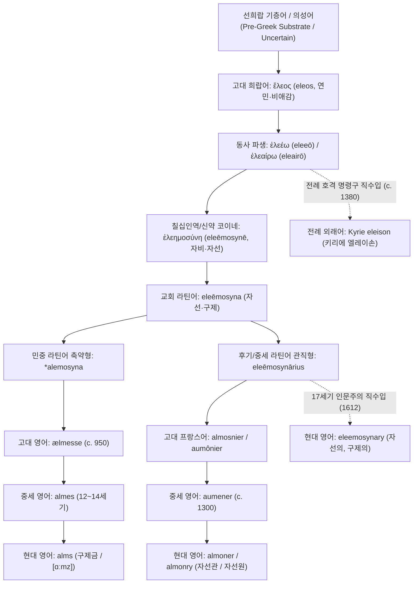

# Eleos (엘레오스)

**[[greek-reading-guide|읽는 법]]**: 엘레오스 · **원어**: ἔλεος · **학술 전사**: *éleos*

> **요약**: 고대 그리스어 **ἔλεος**(*eleos*, 연민·비애감) 및 2차 파생 명사 **ἐλεημοσύνη**(*eleēmosynē*, 자비·자선)는 칠십인역과 신약성서를 거쳐 교회 라틴어로 편입된 뒤, 세 갈래로 분기되어 현대 영어의 구제금(**Alms**), 자선관(**Almoner**), 법학적 자선 형용사(**Eleemosynary**), 그리고 전례 기도문(**Kyrie eleison**)으로 정착했습니다.

---

## 1. 어원 전파 계통도 (Etymological Transmission Tree)

---

## 2. 인구어(PIE) 및 희랍어 원어근 분석 (PIE & Proto-Greek Morphology)

> [!NOTE] 선희랍 기층어(Pre-Greek Substrate) 판정
> 로베르트 베이케스(R. Beekes 2010, *Etymological Dictionary of Greek*, p. 407-408) 및 피에르 샹트렌(P. Chantraine, *DELG*, p. 334)에 따르면, 고대 그리스어 ἔλεος는 확고한 인도유럽조어(PIE) 어근이나 어족 간 공통 동계어가 존재하지 않습니다. 포코르니(Pokorny, *IEW* 306) 등이 제안한 가설들은 역사음운론적 근거가 박약하므로, 비-인도유럽어계 선희랍 기층어(Pre-Greek substrate)에서 유입되었거나 고대 감탄사(ἐλελεῦ, eleleu)에 기인한 표현론적 의성어로 분류합니다.

- **PIE 조어 어근**: `Pre-Greek substrate / Uncertain (선희랍 기층어 또는 어원 불명)`
- **형태론적 파생 계보**:
  1. 명사 **ἔλεος**(*eleos*, 중성 s-어간 및 남성 o-어간: '연민, 비애감, 불행에 대한 전율')
  2. 1차 파생 동사 **ἐλεέω**(*eleeō*, '불쌍히 여기다') 및 고졸기 서사시 동사 **ἐλεαίρω**(*eleairō*)
  3. 2차 파생 형용사 **ἐλεήμων**(*eleēmōn*, '자비로운, 동정심 많은')
  4. 3차 파생 추상명사 **ἐλεημοσύνη**(*eleēmosynē*, '자비, 동정, 자선·구제 행위'): 형용사 어간에 복합 추상명사 접미사 `-μοσύνη`(*-mosynē*, PIE `*-men-` + `*-tu-` 계열)가 결합하여 형성됨.

---

## 3. 호메로스 서사시 원전 용례 및 문헌학 (Homeric Epic Context & Philology)

호메로스 서사시에서 연민의 표현은 고전기적 추상명사(ἔλεος)보다는 구체적인 비탄과 행동을 수반하는 동사형(`ἐλεαίρω`, `ἐλεέω`) 및 대조적 감정 억제 동사인 `οἰκτείρω`(*oikteirō*)를 통해 체현됩니다.

- 『**일리아스**』 **24권 503–506행, 516행** (프리아모스의 탄원과 아킬레우스의 화해):
  - **번역**: “신들을 두려워하십시오, 아킬레우스여! 그리고 당신 자신의 아버지를 생각하여 나를 불쌍히 여기십시오. 나는 그보다 훨씬 더 가련합니다.” (_Il._ 24.503–504)
  - **원문**: *ἀλλ’ αἰδεῖο θεούς ... αὐτόν τ’ ἐλέησον ...*
  - **학술 전사**: *all’ aideîo theoús ... autón t’ eléēson ...*
  - **번역**: “노인의 센 머리와 센 턱수염을 불쌍히 여겨 손으로 그를 일으켜 세우며...” (_Il._ 24.516)
  - **원문**: *οἰκτείρων πολιόν τε κάρη πολιόν τε γένειον*
  - **학술 전사**: *oikteírōn polión te kárē polión te géneion*
  - **[주석]**: 탄원자 프리아모스가 요구하는 부정과거 명령형 `ἐλέησον`이 시신 반환이라는 즉각적·능동적 구호 결단을 촉구한다면, 아킬레우스의 현재분사 `οἰκτείρων`은 노인의 참혹한 굴욕을 목격한 관찰자의 감정적 억제와 신체적 부축 행위를 지칭합니다 ([[concept-eleos|Eleos & Oiktos]]).

- 『**일리아스**』 **20권 463–472행** (트로스의 탄원 거절과 전장 자비의 부재):
  - *"동년배임을 불쌍히 여겨(ὁμηλικίην ἐλεήσας) 산 채로 놓아주기를 바랐으나, 그는 아킬레우스가 마음이 온유하거나 유순하지 않음을 알지 못하는 어리석은 자였다."* (_Il._ 20.465–467)
  - **[주석]**: 경쟁적 승패와 복수의 맹위([[concept-menos|Menos]])가 지배하는 전장에서는 `ἐλεέω`의 청원이 냉혹하게 기각됨을 보여줍니다.

- 『**일리아스**』 **23권 534–538행** (에우멜로스 위로와 오익토스의 발동):
  - **번역**: “발 빠른 고결한 아킬레우스가 그들을 보고 불쌍히 여겨 아카이오이족 가운데서 날개 돋친 말을 건넸다.” (_Il._ 23.534–535)
  - **원문**: *τοὺς δὲ ἰδὼν ᾤκτιρε*
  - **학술 전사**: *toùs dè idṑn ṓiktire*
  - **[주석]**: 평화로운 장례 경기라는 비경쟁적 맥락에서, 최고의 기량을 지닌 귀족 전사([[concept-agathos|Agathos]])가 불운으로 꼴찌가 된 굴욕을 목격했을 때 승자의 조롱을 멈추고 위로상을 수여하는 `οἶκτος`의 기능을 입증합니다.

- 『**오뒷세이아**』 **17권 367–368행** (구혼자들의 걸인 적선과 환대 규범):
  - *"그들은 불쌍히 여겨(οἱ δ’ ἐλεαίροντες) 음식을 나누어 주었다."* (_Od._ 17.367)
  - **[주석]**: 서사시 특유의 미완료/진행상 동사 `ἐλεαίρω`가 사용되어, 사회적 최약자인 걸인에게 베푸는 지속적 적선과 최소한의 손님 환대([[concept-xenia|Xenia]]) 태도를 묘사합니다.

---

## 4. 역사적 전파 및 수용사 경로 (Historical Transmission & Reception)

### 4.1 칠십인역(LXX) 및 신약 코이네 그리스어 (기원전 3세기 ~ 기원후 1세기)
- 호메로스의 비경쟁적 구호 충동이었던 `ἔλεος`와 `ἐλεημοσύνη`는 헬레니즘 칠십인역(LXX)에서 히브리어 *ḥesed*(자비) 및 *ṣədāqāh*(의로움/구제)의 번역어로 채택되었습니다.
- 신약성서(마태복음 6:1–4)에서 `ἐλεημοσύνη`는 '가난한 자를 구제하는 물질적 자선 행위 및 구제금'으로 완전히 제도화·특수화되었습니다.

### 4.2 교회 라틴어 및 민중 라틴어 수용 (4~6세기)
- 4세기 말 히에로니무스의 불가타(Vulgata) 성경 번역을 통해 교회 라틴어에 `eleēmosyna`[e.le.eˈmo.si.na]로 정규 차용되었습니다.
- 동시에 로마 제국 말기 서민층의 민중 라틴어(Vulgar Latin) 구어에서는 6음절의 긴 단어가 어두 약화와 중간 음절 탈락(*syncope*)을 겪으며 `*alemosyna` 또는 `*alimosina` 형태로 축약되었습니다.

### 4.3 게르만 고층 구어 차용: ælmesse -> almes -> alms (6~11세기)
- 6세기 말 앵글로-색슨 기독교화 시기, 민중 라틴어 `*alemosyna`가 고대 영어로 직수입되어 `ælmesse`[ˈæl.mes.se]로 정착했습니다.
- 12~14세기 중세 영어 시기에 어미 모음 약화로 `almes`[ˈal.məs]가 되었으며, 근대 영어에 이르러 [l] 자음이 후속 비음 [m] 앞에서 묵음화되고 모음이 장음화되어 단음절 표제어 **alms**[ɑːmz]로 완성되었습니다.

### 4.4 앵글로-노르만 프랑스어 경유 관직어 차용: almoner / almonry (12~14세기)
- 교회 라틴어 파생형인 `eleēmosynārius`(자선 담당관)는 고대 프랑스어에서 `almosnier`(현대 프랑스어 *aumônier*)로 변화했습니다.
- 1066년 노르만 정복 이후 13세기 앵글로-노르만어를 거쳐 중세 영어에 `aumener`로 유입되었고, 16세기 라틴어 원형을 의식한 철자 재정비(l 재삽입)를 거쳐 현대의 **almoner**(c. 1300) 및 **almonry**(c. 1325)로 정착했습니다.

### 4.5 르네상스 직접 학술 차용: eleemosynary (17세기)
- 17세기 초(1612년 OED 최초 기록) 르네상스 인문주의 지식인들은 중세의 음운 축약 경로를 우회하여 후기 라틴어 `eleēmosynārius`를 문헌 철자 그대로 직수입하여 법학·신학적 학술 형용사 **eleemosynary**[ˌɛlɪɪˈmɒsɪnəri]를 주조했습니다.

---

## 5. 음운 및 의미 변화사 (Phonological & Semantic Evolution)

### 5.1 음운 및 철자 변천 (6음절에서 1음절로의 축약)
- `ἐλεημοσύνη` (6음절: e-le-ē-mo-sy-nē) 
  -> 교회 라틴어 `eleēmosyna` (5음절) 
  -> 민중 라틴어 `*alemosyna` (4음절, 두음 변화) 
  -> 고대 영어 `ælmesse` (3음절) 
  -> 중세 영어 `almes` (2음절) 
  -> 현대 영어 `alms` (1음절: [ɑːmz], [l] 묵음화)

### 5.2 역사적 의미 전이 4단계 (Semantic Shifts)
1. **고졸기 호메로스** (신체적 비애감 및 비경쟁적 구호):
   - 영웅의 급작스러운 몰락에 대한 본능적 전율과 비경쟁적 유대 형성 (일반화 및 인지적 승화).
2. **고전기 비극 및 아리스토텔레스** (도덕적 공감과 카타르시스):
   - '부당한 불행을 겪는 자(anaxion dystychounta)'에 대한 도덕적 판단 프레임 범주화 (내면화).
3. **헬레니즘 및 기독교** (환유적 전이와 물질적 자선):
   - 내적 감정 상태에서 외적 종교 실천이자 구제 재화로의 환유적 전이(*Metonymy: Emotion for Action*) 및 특수화.
4. **근현대 영어** (가치 하락과 법학적 제도화의 분기):
   - **alms**: 구제금으로 물질화되면서 수혜자의 수치와 의존성을 연상시키는 가치 하락(*Pejoration*).
   - **eleemosynary**: 영미 보통법상 공익 목적의 비영리 자선 법인을 규정하는 고등 전문어로 제도화(*Specialization*).

---

## 6. 현대 영어 파생어군 및 어휘 패밀리 (Modern English Word Family)

| 표제어 / 파생어 | 품사 | 어원 경로 | OED 초출 연도 | 현대 주요 의미 및 핵심 콜로케이션 | 확실성 등급 |
|:---|:---|:---|:---:|:---|:---|
| **alms** | 명사 | 희랍어 -> 민중 라틴어 -> 고대 영어 | c. 950 | 가난한 사람에게 베푸는 구제금 (`ask for / distribute alms`) | 정설/문헌 입증 |
| **almsgiving** | 명사 | 고대 영어 합성 | c. 1000 | 자선 행위, 구제 실천 | 정설/문헌 입증 |
| **almsgiver** | 명사 | 중세 영어 파생 | c. 1382 | 자선가, 구제자 | 정설/문헌 입증 |
| **almshouse** | 명사 | 중세 영어 합성 | c. 1400 | (교구·자선재단이 운영하는) 빈민 구제원, 양로원 | 정설/문헌 입증 |
| **almsbox** | 명사 | 근대 영어 합성 | 1611 | 교회 자선 모금함, 헌금함 | 정설/문헌 입증 |
| **almoner** | 명사 | 라틴어 -> 고대 불어 -> 중세 영어 | c. 1300 | (왕실·수도원·병원의) 자선 배분관 (`Grand Almoner`) | 정설/문헌 입증 |
| **almonry** | 명사 | 고대 불어 경유 파생 | c. 1325 | 자선 배분소, 구제원 관저 | 정설/문헌 입증 |
| **eleemosynary** | 형용사 / 명사 | 후기 라틴어 직접 학술 차용 | 1612 | **자선의, 구제의** (`eleemosynary corporation / institution`) | 정설/문헌 입증 |
| **eleemosynarily** | 부사 | 근대 영어 접미 파생 | 1678 | 자선적으로, 구제 목적으로 | 정설/문헌 입증 |
| **Kyrie eleison** | 명사 / 외래어 | 전례 희랍어 고정구 직수입 | c. 1380 | "주여, 우리를 불쌍히 여기소서" (미사 시작 기도문) | 정설/문헌 입증 |

---

## 7. 관용표현 및 가짜 동계어 주의 (Idioms & Warning)

### 7.1 주요 관용구 및 법학 용례
- `eleemosynary corporation / institution`: 영미 보통법(Common Law) 체계에서 교육, 구제, 종교 등 공익 자선 목적을 위해 설립된 비영리 재단 및 법인을 지칭하는 핵심 법률 용어 (예: 미국 연방대법원 *Dartmouth College v. Woodward* 판례, 1819).
- `ask for / beg for alms`: 적선을 구하다, 자선을 간청하다.
- `High Almoner (Grand Almoner)`: 영국 및 유럽 왕실에서 왕실 자선 기금을 빈민에게 배분하던 수석 자선관 전통 직책.

> [!WARNING] 가짜 동계어(False Cognate) 주의: Pity 및 Piety
> 현대 영어에서 ἔλεος의 대표적인 번역어가 **pity**이기 때문에 두 단어를 어원적 동계어로 혼동하기 쉽습니다. 그러나 영어 *pity*와 *piety*는 라틴어 **pietas**[피에타스, '경건, 헌신, 효심']가 고대 프랑스어 *pite*를 거쳐 유입된 이중어(Doublet)이며, 그리스어 ἔλεος와는 역사음운론적으로 완전히 무관합니다. 또한 라틴어 성경 번역 대응어인 **misericordia**(miser '비참한' + cor '심장') 역시 개념적 번역 차용(Calque)일 뿐 어원적 동계어가 아닙니다.

---

## 8. 어원 증거 매트릭스 (Etymology Evidence Matrix)

| 주장 / 분석 명제 | 문헌 및 사전 근거 | 언어 층위 | 확실성 등급 | 적용 섹션 |
|:---|:---|:---|:---|:---|
| ἔλεος의 선희랍 기층어 판정 | Beekes (2010: 407-408), Chantraine (*DELG*: 334) | Pre-Greek / Greek | 선희랍 기층어 (Pre-Greek) | 2절 |
| 명사 ἔλεος -> 추상명사 ἐλεημοσύνη 파생 | Chantraine (*DELG*: 334), Frisk (*GEW*: 1:485) | Ancient Greek / Koine | 정설/문헌 입증 (Established) | 2절 |
| 프리아모스 탄원(_Il._ 24.503, 24.516) 인용 | 호메로스 원전 텍스트 (_Il._ 24.503, 516) | Epic Greek | 정설/문헌 입증 (Established) | 3절 |
| 에우멜로스 전차경주 위로(_Il._ 23.534) 인용 | 호메로스 원전 텍스트 (_Il._ 23.534) | Epic Greek | 정설/문헌 입증 (Established) | 3절 |
| 구혼자 적선 및 동사 형태론(_Od._ 17.367) | 호메로스 원전 텍스트 (_Od._ 17.367) | Epic Greek | 정설/문헌 입증 (Established) | 3절 |
| ἐλεημοσύνη -> *alemosyna -> ælmesse -> alms 축약 | OED (*alms, n.*), Sievers-Brunner | Vulgar Latin / Old English | 정설/문헌 입증 (Established) | 4절, 5절 |
| eleēmosynārius -> almosnier -> almoner 경로 | OED (*almoner, n.*), Godefroy | Old French / Middle English | 정설/문헌 입증 (Established) | 4절 |
| 17세기 라틴어 직수입 eleemosynary (1612) | OED (*eleemosynary, adj.*) | Early Modern English | 정설/문헌 입증 (Established) | 4절, 6절 |
| 전례 그리스어 직수입 Kyrie eleison (c. 1380) | OED (*Kyrie eleison, n.*) | Liturgical Greek / ME | 정설/문헌 입증 (Established) | 4절, 6절 |
| Pity / Piety (라틴어 pietas)와의 가짜 동계어 분리 | OED (*pity, n.* / *piety, n.*), Ernout-Meillet | Latin / Romance | 민간어원/허구 (Spurious) | 7절 |

---

## 관련 항목

### 호메로스 핵심 개념 및 위키 문서
- [[concept-eleos|엘레오스와 오익토스 (Eleos & Oiktos)]] — 호메로스 영웅 윤리의 연민, 비애감 및 비경쟁적 연대
- [[concept-agathos|아가토스 (Agathos)]] — 영웅적 탁월성의 귀족 규범 및 [[word-agathos|Agathos 어원 사전]]
- [[concept-aidos|아이도스 (Aidos)]] — 수치심과 경외, 오익토스와 짝을 이루는 내적 억제
- [[concept-xenia|크세니아 (Xenia)]] — 손님 환대와 사회적 자비의 신성한 규범
- [[concept-hikesia|히케시아 (Hikesia)]] — 신성 탄원 의례와 엘레오스의 발동
- [[concept-menos|메노스 (Menos)]] — 공격적 맹위와 엘레오스의 대척점
- [[entity-achilles|아킬레우스 (Achilles)]] — 24권에서 오익토스와 엘레오스를 회복하는 영웅
- [[entity-priam|프리아모스 (Priam)]] — 아들의 살해자 발치에서 엘레오스를 탄원한 노왕

### 어원 사전 및 참고 문헌
- [[words/index|호메로스 어원·영단어 사전 인덱스]]
- [[scott-1979-pity-and-pathos|메리 스콧 (1979) 호메로스에서의 연민과 파토스]]
- Robert Beekes (2010), *Etymological Dictionary of Greek*, Brill.
- Pierre Chantraine (1968), *Dictionnaire étymologique de la langue grecque* (DELG), Klincksieck.
- Hjalmar Frisk (1960–1972), *Griechisches etymologisches Wörterbuch* (GEW), Carl Winter.
- *Oxford English Dictionary* (OED Online), Oxford University Press.
