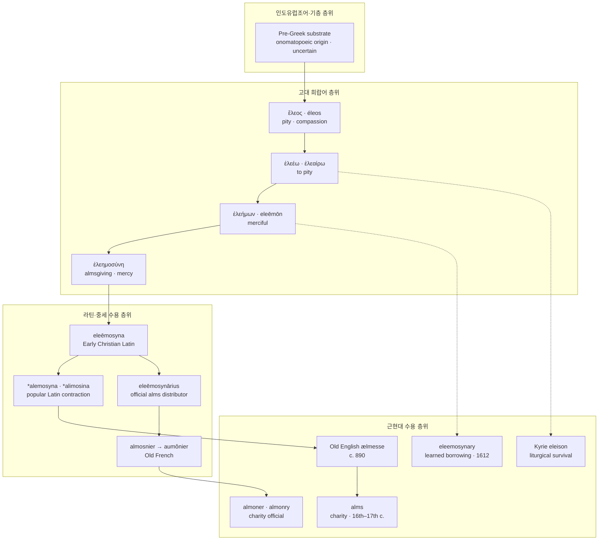

# Eleos (엘레오스)

**[[greek-reading-guide|읽는 법]]**: 엘레오스 · **원어**: ἔлеος · **학술 전사**: *éleos*

> **요약**: 고대 그리스어 **ἔлеος**(*éleos*, 신체적 비애감·연민) 및 2차 파생 명사 **ἐλεημοσύνη**(*eleēmosýnē*, 자비·자선)는 칠십인역과 신약성서를 거쳐 교회 라틴어로 편입된 뒤, 네 갈래로 분기되어 현대 영어의 구제금(**alms**), 자선관(**almoner**), 법학적 자선 형용사(**eleemosynary**), 그리고 전례 기도문(**Kyrie eleison**)으로 정착했습니다.

---

## 1. 어원 전파 계통도 (Etymological Transmission Tree)

---

## 2. 인구어(PIE) 및 희랍어 원어근 분석 (PIE & Proto-Greek Morphology)

> [!NOTE] 선희랍 기층어(Pre-Greek Substrate) 및 표현론적 의성어 판정
>
> - **포코르니(Pokorny, IEW 306) 가설의 기각**: 포코르니가 제안한 인도유럽조어 어근 `*el-` / `*elei-`('구부리다, 몸을 굽히다' -> '자비를 위해 굴복하다')는 후두음 이론과 접미사 형성 음운 규칙을 설명하지 못하는 사후적 유추로 판명되어 현대 비교언어학계에서 기각되었습니다.
> - **선희랍 기층어설 (Beekes 2010: 407–408)**: 중성 s-어간(`τὸ ἔлеος`)과 남성 o-어간(`ὁ ἔлеος`)의 변칙적 어간 혼재, 불규칙한 파생 접미사 형성을 근거로 비-인도유럽어계 에게해 토착 기층어로 분류합니다.
> - **표현론적 의성어설 (Chantraine DELG: 334; Frisk GEW 1:485)**: 비탄의 외침 구호인 그리스어 고유 감탄사 **ἐλεлеῦ**(*eleleû*)에서 유래한 음성상징적 의성어로 파악합니다.

- **고대 희랍어 형태론적 파생 계보**:
  1. 기본 명사 **ἔлеος**(*éleos*, s-어간 중성 명사: '연민, 비애감, 필멸자의 불행에 대한 전율').
  2. 계약동사 **ἐλεέω**(*eleéō*, *-e-yō* 파생: 일회적·능동적 구호 결단) 및 서사시 고졸 동사 **ἐλεαίρω**(*eleaírō*, *-ar-yō* 파생: 정서적 호의의 지속상).
  3. 속성 형용사 **ἐλεήμων**(*eleḗmōn*, *-mōn* 파생: '자비로운, 동정심 있는').
  4. 복합 추상명사 **ἐλεημοσύνη**(*eleēmosýnē*): 형용사 어간에 복합 접미사 `-μοσύνη`(*-mon-sū-nā*, 도덕적 품성 및 실천 양식 범주화)가 결합하여 형성됨. **호메로스 서사시에는 단 한 번도 등장하지 않으며**, 헬레니즘 코이네(칠십인역)에서 비로소 초출합니다.

| 그리스어 실제형 | 학술 전사 | 표제형·형태론 | 한국어 풀이 | 근거 |
| :--- | :--- | :--- | :--- | :--- |
| **ἔлеος** | *éleos* | 중성 명사 주격·대격 단수 (s-어간) | 연민, 비애감, 불행에 대한 전율 | Beekes EDG 407–408; Frisk GEW 1:485 |
| **ἐλεέω** | *eleéō* | 동사 능동태 현재 1인칭 단수 (계약동사) | 자비를 베풀다, 구제하다 | Chantraine DELG 334 |
| **ἐλεαίρω** | *eleaírō* | 동사 능동태 현재 1인칭 단수 (지속상) | 측은히 여기다 (호메로스 서사시 지속상) | LSJ 531; *Il.* 24.516 |
| **ἐλέησον** | *eléēson* | 동사 능동태 부정과거 명령법 2인칭 단수 | 불쌍히 여기소서 (즉각적 구호 결단 촉구) | *Il.* 21.74, 24.503 |
| **ἐλέησε(ν)** | *eléēse(n)* | 동사 능동태 부정과거 직설법 3인칭 단수 | 불쌍히 여겼다 (신/영웅의 구호 개입) | *Il.* 15.12, 17.441 |
| **ἐλεήσας** | *eleḗsas* | 동사 능동태 부정과거 분사 남성 주격 단수 | 불쌍히 여겨 (탄원자의 기대 행위) | *Il.* 20.465 |
| **ἐλέαιρον** | *ēléairon* | 동사 능동태 미완료 직설법 3인칭 복수 | 지속적으로 불쌍히 여겼다 | *Od.* 1.19 |
| **ἐλεαίρων** | *eleaírōn* | 동사 능동태 현재 분사 남성 주격 단수 | 측은히 여기며 (정서적 연민 상태) | *Il.* 24.516; *Od.* 17.367 |
| **ἐλεήμων** | *eleḗmōn* | 형용사 남성/여성 주격 단수 (속성형) | 자비로운, 동정심 있는 | *Od.* 5.191 (호메로스 하팍스) |
| **ἐλεεινός** | *eleeinós* | 형용사 남성 주격 단수 (운율 연장형) | 가련한, 비참한 (운율 연장형) | *Il.* 24.504; LSJ 531 |
| **νηлеής** | *nēleḗs* | 형용사 주격 단수 (부정 접두사 결합) | 무자비한, 냉혹한 | *Il.* 21.98, 22.123 |
| **ἐλεημοσύνη** | *eleēmosýnē* | 여성 명사 주격 단수 (추상 접미사) | 자선, 구제 행위 (호메로스 미출현, LXX 초출) | LXX Mt 6:1; OED *alms* |

---

## 3. 호메로스 서사시 원전 용례 및 문헌학 (Homeric Epic Context & Philology)

호메로스 서사시에서 엘레오스는 추상명사보다 구체적 행동을 결단하는 동사형(`ἐλεέω`, `ἐλεαίρω`)으로 구현되며, 관찰자의 감정적 억제를 뜻하는 [[concept-oiktos|오익토스]](*oiktos*) 및 경외심인 [[concept-aidos|아이도스]](*aidos*)와 긴밀한 상호작용을 이룹니다.

### 3.1 프리아모스의 탄원과 아킬레우스의 연민 (*Il.* 24.503–504, 516)

- **번역**: “신들을 두려워하십시오, 아킬레우스여! 그리고 당신 자신의 아버지를 생각하여 나를 불쌍히 여기십시오. 나는 그보다 훨씬 더 가련합니다.” (*Il.* 24.503–504)
- **원문**: *ἀλλ’ αἰδεῖο θεούς, Ἀχιλεῦ, αὐτόν τ’ ἐλέησον / μνησάμενος σοῦ πατρός· ἐγὼ δ’ ἐλεεινότερός περ,*
- **학술 전사**: *all’ aideîo theoús, Akhileû, autón t’ eléēson / mnēsámenos soû patrós; egṑ d’ eleeinóterós per,*
- **번역**: “노인의 센 머리와 센 턱수염을 불쌍히 여겨 손으로 그를 일으켜 세우며...” (*Il.* 24.516)
- **원문**: *οἰκτείρων πολιόν τε κάρη πολιόν τε γένειον·*
- **학술 전사**: *oikteírōn polión te kárē polión te géneion;*
- **[주석]**: 탄원자([[concept-hikesia|Hikesia]])의 부정과거 명령형 `ἐλέησον`이 시신 반환이라는 즉각적·능동적 구호 결단을 촉구하는 반면, 현재분사 `οἰκτείρων`은 가해 억제와 신체적 부축을 가리킵니다. (상세 서사 및 문맥 주해는 [[concept-eleos#5.1 프리아모스의 아킬레우스 탄원: 신성한 자비 간청 (*Il.* 24.503–506)|엘레오스 개념 문서 5.1절]] 참조)

### 3.2 뤼카온의 원형적 탄원 공식구 (*Il.* 21.74–75)

- **번역**: “무릎 꿇고 간청합니다, 아킬레우스여! 나를 존중하시고 나를 불쌍히 여겨주소서. 제우스의 보살핌을 받는 분이여, 나는 당신에게 존중받아야 마땅한 탄원자와 다름없습니다.” (*Il.* 21.74–75)
- **원문**: *γουνοῦμαί σ’, Ἀχιλεῦ· σὺ δέ μ’ αἴδεο καί μ’ ἐλέησον· / ἀντί τοί εἰμ’ ἱκέταο, διοτρεφές, αἰδοίοιο·*
- **학술 전사**: *gounoûmaí s’, Akhileû; sù dé m’ aídeo kaí m’ eléēson; / antí toí eim’ hikétao, diotrephés, aidoíoio;*
- **[주석]**: 호메로스 서사시에서 수치와 경외를 뜻하는 [[concept-aidos|아이도스]]와 능동적 구호를 청하는 엘레오스가 대등한 명령형으로 결합하는 원형적 탄원 공식구입니다. (상세 서사 및 문맥 주해는 [[concept-eleos#5.2 전장에서의 무자비(Nelees)와 뤼카온 탄원 거절 (*Il.* 21.74–75, 106–110)|엘레오스 개념 문서 5.2절]] 참조)

### 3.3 헥토르의 독백: 전장 자비의 원천 차단 직시 (*Il.* 22.123–124)

- **번역**: “내가 그에게 걸어가더라도, 그가 나를 불쌍히 여기지 않고 나를 존중하지도 않으며, 내가 무기를 벗은 채 무방비로 있을 때 나를 단숨에 죽여버리지나 않을까 두렵다.” (*Il.* 22.123–124)
- **원문**: *μή μιν ἐγὼ μὲν ἵκωμαι ἰών, ὁ δέ μ’ οὐκ ἐλεήσει / οὐδέ τί μ’ αἰδέσεται, κτενέει δέ με γυμνὸν ἐόντα*
- **학술 전사**: *mḗ min egṑ mèn híkōmai iṓn, ho dé m’ ouk eleḗsei / oudé tí m’ aidésetai, ktenéei dé me gumnòn eónta*
- **[주석]**: 헥토르 스스로 미래시제 부정형('불쌍히 여기지 않고 존중하지도 않으리라')의 대구를 사용하여, 전장에서 엘레오스가 원천 차단됨을 직시하는 어휘 용법입니다. (상세 서사 및 문맥 주해는 [[concept-eleos#3.2 『일리아스』에서의 용례 맥락: 경쟁적 전장의 거절과 비경쟁적 화해|엘레오스 개념 문서 3.2절]] 참조)

### 3.4 트로스의 헛된 탄원과 시인의 냉혹한 평가 (*Il.* 20.463–466)

- **번역**: “그는 알라스토르의 아들 트로스에게 다가갔는데, 트로스는 그의 무릎을 잡고 그가 동년배임을 불쌍히 여겨 산 채로 사로잡아 놓아주기를 바랐으나, 어리석게도 그가 설득되지 않으리라는 것을 알지 못했다.” (*Il.* 20.463–466)
- **원문**: *ὃ δὲ Τρῶ’ Ἀλάστορος υἱὸν / ἧλθε λαβεῖν γούνων, εἴ πώς μιν συμφείσαιτο / ζωγρῆσαι, καὶ ζωὸν ἀφείη, μηδὲ κατακτάνοι / ὁμηλικίēn ἐλεήσας, νήπιος, οὐδὲ τὸ ᾔδη,*
- **학술 전사**: *hò dè Trō̂’ Alástoros huiòn / hē̂lthe labeîn goúnōn, eí pṓs min sumpheísaito / zōgrê̂sai, kaì zōòn apheíē, mēdè kataktánoi / homēlikíēn eleḗsas, nḗpios, oudè tò ḗidē,*
- **[주석]**: 부정과거 능동태 분사 `ὁμηλικίēn ἐлеήσας`의 기대 행위와 시인의 평가 `νήπιος`의 대립을 통해, 전장 공격열([[concept-menos|Menos]]) 앞에서의 자비 탄원 거절을 증명합니다. (상세 서사 및 문맥 주해는 [[concept-eleos#3.2 『일리아스』에서의 용례 맥락: 경쟁적 전장의 거절과 비경쟁적 화해|엘레오스 개념 문서 3.2절]] 참조)

### 3.5 에우멜로스 전차경주 위로와 오익토스의 발동 (*Il.* 23.534–536)

- **번역**: “발 빠른 고결한 아킬레우스가 그들을 보고 불쌍히 여겨, 아르게이오이족 가운데 서서 날개 돋친 말을 건넸다. ‘가장 뛰어난 사내가 통발굽 말을 몰고 꼴찌로 들어오는구나!’” (*Il.* 23.534–536)
- **원문**: *τοὺς δὲ ἰδὼν ᾤκτιρε ποδάρκης δῖος Ἀχιλλεύς, / στὰς δ’ ἄρ’ ἐν Ἀργείοις ἔπεα πτερόεντ’ ἀγόρευεν· / "λοῖσθος ἀνὴρ ὤριστος ἐλαύνει μώνυχας ἵππους·"*
- **학술 전사**: *toùs dè idṑn ṓiktire podárkēs dîos Akhilleús, / stàs d’ ár’ en Argeíois épea pteróent’ agóreuen; / "loîsthos anḕr ṓristos elaúnei mṓnukhas híppous;"*
- **[주석]**: 비경쟁적 경기에서 최고의 기량을 지닌 귀족 전사([[concept-agathos|Agathos]])의 불운 굴욕을 목격했을 때 발동하는 `οἶκτος`의 정형적 장면입니다. (상세 서사 및 문맥 주해는 [[concept-oiktos#5.1 에우멜로스 위로와 오익토스의 발동 (*Il.* 23.534–538)|오익토스 개념 문서 5.1절]] 참조)

### 3.6 구혼자들의 걸인 적선과 지속적 자비 태도 (*Od.* 17.367–368)

- **번역**: “그들은 불쌍히 여겨 음식을 나누어 주었고, 마음에 경탄하며 그가 누구이며 어디서 왔는지 서로 물었다.” (*Od.* 17.367–368)
- **원문**: *οἱ δ’ ἐλεαίροντες δίδοσαν, καὶ ἐθαύμαζον κῆρ, / ἀλλήλους τ’ εἴροντο τίς εἴη καὶ πόθεν ἔλθοι.*
- **학술 전사**: *hoi d’ eleaírontes dídosan, kaì etháumazon kê̂r, / allḗlous t’ eíronto tís eíē kaì póthen élthoi.*
- **[주석]**: 고졸기 서사시 특유의 미완료 분사 `ἐлеαίροντες`와 미완료 동사 `δίδοσαν`이 결합하여, 사회적 약자에게 베푸는 지속적인 적선과 손님 환대([[concept-xenia|Xenia]]) 태도를 묘사합니다. (상세 서사 및 문맥 주해는 [[concept-eleos#3.3 『오뒷세이아』에서의 용례 맥락: 신정론, 환대(Xenia), 그리고 무해한 자의 사면|엘레오스 개념 문서 3.3절]] 참조)

---

## 4. 역사적 전파 및 수용사 경로 (Historical Transmission & Reception)

### 4.1 칠십인역(LXX) 및 신약 코이네: 어휘 번역 분기와 자선 제도화

- **히브리어 원어 대조 번역 분기**:
  - 히브리어 חֶסֶד (*ḥesed*, 언약적 인애·자비)는 LXX에서 일관되게 명사 **ἔлеος**(*éleos*, 200회 이상)로 번역되었습니다.
  - 반면 히브리어 צְדָקָה (*ṣədāqāh*, 본래 '의로움, 공의')는 제2성전기 유대교에서 '의로움의 구체적 실천 = 구제/자선'이라는 의미 전이를 겪으며 LXX 번역자들에 의해 **ἐλεημοσύνη**(*eleēmosýnē*)로 번역되었습니다 (신명기 6:25, 시편 23:5).
- **마태복음 6장의 사본학적 제도화**:
  - 알렉산드리아 사본군(NA28)의 마태복음 6:1 독법은 "너희 의(δικαιοσύνην)를 행하지 않도록 주의하라"이며, 이어지는 6:2에서 "그러므로 네가 구제할 때에(ὅταν οὖν ποιῇς ἐλεημοσύνην)..."로 구체화됩니다. 즉, 상위 개념인 '종교적 의'를 실천하는 제1의 물질적 구제 덕목으로 `ἐлеημοσύνη`가 확정되었습니다.

### 4.2 교회 라틴어 및 고대 라틴어(Vetus Latina) 수용 (2~4세기)

- 히에로니무스의 불가타(Vulgata) 이전에, 2~3세기 북아프리카 교부 문헌(테르툴리아누스, 키프리아누스) 및 고대 라틴어 역본(Vetus Latina)에서 이미 그리스어 차용어 **eleēmosyna**가 확립되어 있었습니다.
- 그리스어 6음절 `ἐ-ле-η-μο-σύ-νη`[e.le.ɛː.mo.sý.nɛː]는 라틴어로 편입되면서 장모음을 반영하여 5음절 `eleēmosyna`[e.le.eːˈmoː.sy.na]로 정착했습니다. 고전 라틴어 강세 법칙에 따라 뒤에서 두 번째 음절(penult)인 *mo*가 장모음이므로 강세가 [ˈmoː]에 위치하며, 이 강세 음절이 후속 게르만·로망스 축약의 음운적 핵(nucleus)이 되었습니다.

### 4.3 민중 라틴어 이화와 게르만 고층 구어 차용: ælmesse -> almes -> alms (6~17세기)

- **민중 라틴어 이화 및 축약**: 서민 구어인 민중 라틴어(Vulgar Latin)에서는 어두 전설모음 [e]가 유음 [l]의 영향으로 저모음 [a]로 이화(Dissimilation)되고 비강세 음절이 탈락(*syncope*)하여 `*alemosyna` / `*alimosina`가 형성되었습니다.
- **고대 영어 초출 (c. 890)**: 6세기 말 앵글로-색슨 기독교화 시기 구어로 유입되었으며, 문헌상으로는 9세기 말 알프레드 대왕의 『사목교본』(*Cura Pastoralis*, c. 897)에 **ælmesse**[ˈæl.mes.se]로 최초 기록되었습니다 (OED *alms, n.*).
- **중세에서 현대 영어 alms [ɑːmz]로의 음운 완성**:
  - 중세 영어 시기 어미 모음 약화로 `almes`[ˈal.məs]가 되었습니다.
  - 근대 초기 영어에서 후속 순음/비음 [m] 앞에서 **[l] 자음이 묵음화**(L-vocalization/loss)되고 보상적 장음화(Compensatory lengthening)를 겪으며 단음절 **alms**[ɑːmz]로 완성되었습니다 (*calm*, *palm*, *psalm*과 동일한 음운 변화).

### 4.4 앵글로-노르만 프랑스어 경유 관직어: almoner / almonry (12~16세기)

- 교회 라틴어 관직 명사 **eleēmosynārius**('자선 배분관')는 고대 프랑스어에서 자음 앞 [l]이 후설 반모음 [w]로 모음화되어 `almosnier` -> `aumônier`가 되었습니다.
- 1066년 노르만 정복 이후 중세 영어에 `aumener` (c. 1300, *Cursor Mundi*)로 유입되었습니다.
- 16세기 르네상스 시기, 학자들은 라틴어 원형 *eleēmosynārius*를 의식하여 문자 **l**을 다시 삽입하는 **어원적 철자 복원**(Etymological respelling)을 단행하여 현대의 **almoner**(c. 1300) 및 **almonry**(c. 1325)로 정착시켰습니다.

### 4.5 르네상스 직접 학술 차용: eleemosynary (1612)

- 17세기 초(1612년 존 던의 설교 및 법학 문헌) 르네상스 인문주의자들은 중세의 민간 구어 축약선을 우회하여, 후기 라틴어 문헌 철자 `eleēmosynārius`에 형용사 접미사 `-ary`를 결합하여 학술·법학 전문어 **eleemosynary**를 직접 주조했습니다.

### 4.6 전례 그리스어 직수입: Kyrie eleison (c. 1380)

- 6세기 교황 그레고리우스 1세에 의해 로마 미사 전례에 고정된 그리스어 기도문 **Kyrie eleison**(*Kýrie eléēson*, Κύριε ἐλέησον)은 번역되지 않고 음역 그대로 라틴 교회에 수용되었습니다.
- 중세 영어에 c. 1380년 기도서(*Prymer*)를 통해 직수입되었으며, 이 기도문의 `ἐλέησον`은 『일리아스』 24권 503행에서 프리아모스가 아킬레우스에게 외친 부정과거 능동태 명령형 바로 그 어형입니다.

---

## 5. 음운 및 의미 변화사 (Phonological & Semantic Evolution)

### 5.1 음운 및 철자 변천 (6음절에서 1음절로의 축약)

- `ἐλεημοσύνη` (6음절: e-le-ē-mo-sy-nē)
  -> 교회 라틴어 `eleēmosyna` (5음절)
  -> 민중 라틴어 `*alemosyna` (4음절, 모음 이화 e->a 및 syncope)
  -> 고대 영어 `ælmesse` (3음절, c. 890)
  -> 중세 영어 `almes` (2음절, 12~14세기)
  -> 현대 영어 `alms` (1음절: [ɑːmz], [l] 묵음화 및 장음화)

### 5.2 역사적 의미 전이 4단계 (Semantic Shifts)

1. **고졸기 호메로스 (필멸자의 취약성과 신체적 전율)**:
   - 타인의 참혹한 파멸을 볼 때 오장육부(thumos, ker, phren)가 뒤흔들리는 신체적 전율(Visceral Shudder)이자, 적대적 경쟁을 정지시키고 필멸자로서의 유한성(Mortal Solidarity)을 공유하는 비경쟁적 연대.
2. **고전기 비극 및 아리스토텔레스 (도덕적 공감과 카타르시스)**:
   - 아리스토텔레스는 『수사학』(2.8, 1385b)에서 엘레오스를 "**부당하게 고통받는 자**(anaxion dystychounta)를 목격할 때 일어나는 고통스러운 감정"으로 범주화했습니다. 도덕적 판단(Moral appraisal)과 자신에게도 닥칠 수 있다는 확률적 자아 투사(Egoistic vulnerability)가 결합되어 『시학』(1453a)의 카타르시스 이론으로 체계화되었습니다.
3. **헬레니즘 및 기독교 (인지적 환유와 사물화)**:
   - **EMOTION FOR PHYSICAL OBJECT (환유)**: 내적 비애감(Emotion: ἔлеος) -> 자비로운 품성(Trait: ἐλεήμων) -> 종교적 자선 실천(Action: ἐλεημοσύνη) -> **물질적 구제금 / 동전 / 빵**(Physical Cash / Goods)으로 사물화(Reification)되었습니다.
4. **근현대 영어 (가치 하락과 법학적 전문화의 분기)**:
   - **alms의 가치 하락 (Pejoration)**: 중세의 거룩한 구원 행위에서, 엘리자베스 구빈법(1597/1601) 이후 노동 기피자(sturdy beggars)에 대한 단속과 결부되면서 수치심(stigma)과 기생적 의존성을 연상시키는 어휘로 하락했습니다.
   - **eleemosynary의 법학적 전문화 (Specialization & Elevation)**: 윌리엄 블랙스톤의 법인 분류학을 거쳐, 미국 연방대법원 *Dartmouth College v. Woodward* (1819) 판례를 통해 공익 목적 사립 비영리 재단의 자율성을 수호하는 최고급 헌법·법학 용어로 승화되었습니다.

---

## 6. 현대 영어 파생어군 및 어휘 패밀리 (Modern English Word Family)

| 표제어 / 파생어 | 품사 | 어원 경로 | OED 초출 연도 | 1차 문헌 증거 및 핵심 콜로케이션 | 확실성 등급 |
| :--- | :--- | :--- | :---: | :--- | :--- |
| **alms** | 명사 | 희랍어 -> 민중 라틴어 -> 고대 영어 | c. 890 | Alfred, *Cura Pastoralis* (*ælmesse*); `ask for / distribute alms` | 정설/문헌 입증 |
| **almsgiving** | 명사 | 고대 영어 합성어 | c. 1000 | Ælfric, *Homilies* (*ælmes-georn*); 자선 행위, 구제 실천 | 정설/문헌 입증 |
| **almsgiver** | 명사 | 중세 영어 파생 | c. 1382 | Wyclif, *Bible* (Prov. xxi. 26); 자선가, 구제자 | 정설/문헌 입증 |
| **almsman** | 명사 | 중세 영어 합성어 | c. 1380 | Wyclif, *Works*; 구제금을 받고 사는 빈민 | 정설/문헌 입증 |
| **almshouse** | 명사 | 중세 영어 합성어 | c. 1400 | *Promptorium Parvulorum*; 빈민 구제원, 양로원 | 정설/문헌 입증 |
| **almsbox** | 명사 | 근대 영어 합성어 | 1611 | *King James Bible*; 교회 자선 모금함 | 정설/문헌 입증 |
| **alms-dish** | 명사 | 근대 영어 합성어 | c. 1633 | 교회 성찬례 구제금 수납 쟁반 (전례 기물) | 정설/문헌 입증 |
| **almoner** | 명사 | 라틴어 -> 고대 불어 -> 중세 영어 | c. 1300 | *Cursor Mundi* (*aumener*); 16세기 l 복원; `Lord High Almoner` | 정설/문헌 입증 |
| **almonry** | 명사 | 고대 불어 경유 파생 | c. 1325 | *Early English Alliterative Poems*; 자선원, 배분소 | 정설/문헌 입증 |
| **eleemosynary** | 형용사 / 명사 | 후기 라틴어 직접 학술 차용 | 1612 | Donne, *Sermons*; `eleemosynary corporation` (1819 Dartmouth) | 정설/문헌 입증 |
| **eleemosynarily** | 부사 | 근대 영어 접미 파생 | 1678 | Cudworth, *True Intellectual System*; 자선 목적으로 | 정설/문헌 입증 |
| **Kyrie eleison** | 명사 / 외래어 | 전례 희랍어 고정구 직수입 | c. 1380 | *Prymer* (*Kyrieleyson*); 미사 시작 참회 기도문 | 정설/문헌 입증 |

---

## 7. 보통법 판례 및 가짜 동계어 주의 (Legal Case & Warning)

### 7.1 보통법 최고 판례 실증: Dartmouth College v. Woodward (1819)

미국 연방대법원의 리딩 케이스인 『다트머스 대학 대 우드워드』(*Trustees of Dartmouth College v. Woodward*, 17 U.S. 518, 1819)에서, 조셉 스토리(Joseph Story) 대법관은 다트머스 대학을 사립 자선 법인(**private eleemosynary corporation**)으로 엄밀히 규정했습니다:

- **스토리 대법관의 법리**:
  - 자선 법인은 설립자의 기부금(alms and bounties)을 영구히 배분하기 위해 설립된 사법인(private corporation)입니다.
  - 비록 그 목적이 공공의 교육과 복지를 위한 것일지라도, 주정부나 의회가 임의로 이사회를 장악하거나 국유화할 수 없으며, 미합중국 헌법 제1조 제10절 계약 불가침 조항(Contract Clause)의 절대적 보호를 받습니다.
  - 이로써 고대 희랍어 ἔлеος에서 유래한 법학 어휘는 현대 사립 대학, 사립 연구소, 비영리 자선 재단의 자율성을 수호하는 헌법적 반석이 되었습니다.

### 7.2 주요 관용구 및 전통 직책

- `eleemosynary corporation / trust`: 영미 보통법상 공익 자선 목적의 비영리 법인 및 신탁.
- `ask for / beg for alms`: 적선을 구하다.
- `Lord High Almoner`: 영국 왕실에서 성목요일(Maundy Thursday) 왕실 자선금(Maundy money)을 빈민에게 배분하는 전통 수석 자선관 직책.

> [!WARNING] 4대 가짜 동계어(False Cognates) 및 번역차용 주의
> 현대 영어에서 ἔлеος의 번역어로 자주 쓰이는 다음 로망스계 어휘들은 역사음운론적으로 그리스어 ἔлеος와 완전히 무관합니다:
>
> 1. **pity / piety**: 라틴어 pietas(경건, 헌신, 어근 pius)가 고대 프랑스어 pite를 거쳐 중세 영어에 유입된 전형적인 어원적 이중어(Doublet)입니다. 그리스어 ἔлеος와 음운적 연계가 없습니다.
> 2. **mercy**: 라틴어 merces(대가, 임금, 보수; 어근 merk- '상품, 거래')에서 유래한 상업적 교환 어휘로, 기독교화되면서 '영적 은총'으로 의미가 전이되어 프랑스어 merci를 거쳐 정착했습니다. 비경쟁적 내면 감정인 ἔлеος와 계통상 정반대 출발점입니다.
> 3. **charity**: 라틴어 caritas(존귀함, 고결한 애정, 형용사 carus '값비싼')에서 유래하여 성경 불가타에서 그리스어 agape(사랑)의 번역어로 채택된 어휘입니다.
> 4. **misericordia**: 라틴어 miser(비참한)와 cor(심장)의 결합형으로, 그리스어 ἔлеος와 히브리어 ḥesed를 라틴어로 옮기기 위해 고안된 개념적 번역 차용(Calque)일 뿐 음운적 동계어가 아닙니다.

---

## 8. 어원 증거 매트릭스 (Etymology Evidence Matrix)

| 주장 / 분석 명제 | 문헌 및 사전 근거 | 언어 층위 | 확실성 등급 | 적용 섹션 |
| :--- | :--- | :--- | :--- | :--- |
| ἔлеος의 선희랍 기층어 판정 | Beekes (2010: 407–408), Chantraine (*DELG*: 334) | Pre-Greek / Greek | 선희랍 기층어 (Pre-Greek) | 2절 |
| ἐлеλεῦ 감탄사 기원의 표현론적 의성어설 | Chantraine (*DELG*: 334), Frisk (*GEW* 1:485) | Ancient Greek | 학술적 재구 (Reconstructed) | 2절 |
| Pokorny (IEW 306) PIE *el- 가설 기각 | Beekes (2010: 408), Chantraine (*DELG*: 334) | Indo-European | 학술적 기각 (Refuted) | 2절 |
| 명사 ἔлеος -> 헬레니즘 ἐлеημοσύνη 조어 | Chantraine (*DELG*: 334), LSJ (s.v. ἐлеημοσύνη) | Ancient Greek / Koine | 정설/문헌 입증 (Established) | 2절 |
| 프리아모스 탄원(*Il.* 24.503, 516) 인용 | 호메로스 원전 텍스트 (*Il.* 24.503, 516) | Epic Greek | 정설/문헌 입증 (Established) | 3.1절 |
| 뤼카온 탄원 공식구(*Il.* 21.74–75) 인용 | 호메로스 원전 텍스트 (*Il.* 21.74–75) | Epic Greek | 정설/문헌 입증 (Established) | 3.2절 |
| 헥토르 독백 전장 자비 부재(*Il.* 22.123–124) | 호메로스 원전 텍스트 (*Il.* 22.123–124) | Epic Greek | 정설/문헌 입증 (Established) | 3.3절 |
| 트로스 헛된 탄원(*Il.* 20.463–466) 인용 | 호메로스 원전 텍스트 (*Il.* 20.463–466) | Epic Greek | 정설/문헌 입증 (Established) | 3.4절 |
| 에우멜로스 위로와 오익토스(*Il.* 23.534–536) | 호메로스 원전 텍스트 (*Il.* 23.534–536) | Epic Greek | 정설/문헌 입증 (Established) | 3.5절 |
| 구혼자 적선 및 동사 형태론(*Od.* 17.367–368) | 호메로스 원전 텍스트 (*Od.* 17.367–368) | Epic Greek | 정설/문헌 입증 (Established) | 3.6절 |
| 히브리어 ṣədāqāh -> ἐлеημοσύνη 번역 분기 | Hatch & Redpath (1897), TDNT (*eleos*) | Hebrew / LXX Greek | 정설/문헌 입증 (Established) | 4.1절 |
| 마태복음 6:1-4 dikaiosýnē -> eleēmosýnē | NA28 본문 비평, Metzger (1994) | Koine Greek | 정설/문헌 입증 (Established) | 4.1절 |
| 고대 라틴어(Vetus Latina) eleēmosyna 선행 | Tertullian, Cyprian; Mohrmann (1961) | Early Christian Latin | 정설/문헌 입증 (Established) | 4.2절 |
| 민중 라틴어 이화 및 고대 영어 초출 (c. 890) | OED (*alms, n.*), Alfred (*Cura Pastoralis*) | Old English | 정설/문헌 입증 (Established) | 4.3절, 6절 |
| alms의 [l] 탈락 및 보상적 장음화 [ɑːmz] | Dobson (1968), Campbell (1959) | Early Modern English | 정설/문헌 입증 (Established) | 4.3절, 5.1절 |
| aumener -> almoner 16세기 l 철자 복원 | OED (*almoner, n.*), Jespersen | Middle/Modern English | 정설/문헌 입증 (Established) | 4.4절, 6절 |
| 17세기 라틴어 직수입 eleemosynary (1612) | OED (*eleemosynary, adj.*) | Early Modern English | 정설/문헌 입증 (Established) | 4.5절, 6절 |
| 전례 그리스어 직수입 Kyrie eleison (c. 1380) | OED (*Kyrie eleison, n.*), *Prymer* | Liturgical Greek / ME | 정설/문헌 입증 (Established) | 4.6절, 6절 |
| 아리스토텔레스 eleos의 anaxion dystychounta | Aristotle, *Rhetoric* 2.8, *Poetics* 1453a | Classical Greek | 정설/문헌 입증 (Established) | 5.2절 |
| 감정에서 물질적 화폐로의 환유 및 Reification | Lakoff & Johnson (1980), Kövecses (2000) | Cognitive Linguistics | 정설/문헌 입증 (Established) | 5.2절 |
| 구빈법 이후 alms의 Pejoration (수치/의존성) | Tawney (1926), Slack (1988) | Social Semantics | 정설/문헌 입증 (Established) | 5.2절 |
| 1819 Dartmouth College 사립 자선 법인 판례 | *Dartmouth College v. Woodward* (17 U.S. 518) | American Common Law | 정설/문헌 입증 (Established) | 4.5절, 7.1절 |
| pity, mercy, charity, misericordia 가짜 동계어 | OED (*pity*, *mercy*, *charity*), Ernout-Meillet | Latin / Romance | 민간어원/허구 (Spurious) | 7.3절 |

---

## 관련 항목

### 호메로스 핵심 개념 및 위키 문서

- [[concept-eleos|엘레오스 (Eleos)]] — 비경쟁적 지반에서 발동하는 적극적 구호 추진력과 필멸자 연대
- [[concept-oiktos|오익토스 (Oiktos)]] — 타인의 극단적 굴욕 목격 시 일어나는 감정적 억제와 가해 중단
- [[concept-agathos|아가토스 (Agathos)]] — 영웅적 탁월성의 귀족 규범 및 [[word-agathos|Agathos 어원 사전]]
- [[concept-aidos|아이도스 (Aidos)]] — 수치심과 경외, 오익토스와 짝을 이루는 내적 억제
- [[concept-xenia|크세니아 (Xenia)]] — 손님 환대와 사회적 자비의 신성한 규범
- [[concept-hikesia|히케시아 (Hikesia)]] — 신성 탄원 의례와 엘레오스의 발동
- [[concept-menos|메노스 (Menos)]] — 공격적 맹위와 엘레오스의 대척점
- [[entity-achilles|아킬레우스 (Achilles)]] — 24권에서 오익토스와 엘레오스를 회복하는 영웅
- [[entity-priam|프리아모스 (Priam)]] — 아들의 살해자 발치에서 엘레오스를 탄원한 노왕

### 어원 사전 및 참고 문헌

- [[words/index|호메로스 어원·영단어 사전 인덱스]]
- [[scott-1979-pity-and-pathos|메리 스콧 (1979) 호메로스에서의 연민과 파토스]]
- Robert Beekes (2010), *Etymological Dictionary of Greek*, Brill.
- Pierre Chantraine (1968), *Dictionnaire étymologique de la langue grecque* (DELG), Klincksieck.
- Hjalmar Frisk (1960–1972), *Griechisches etymologisches Wörterbuch* (GEW), Carl Winter.
- *Oxford English Dictionary* (OED Online), Oxford University Press.
