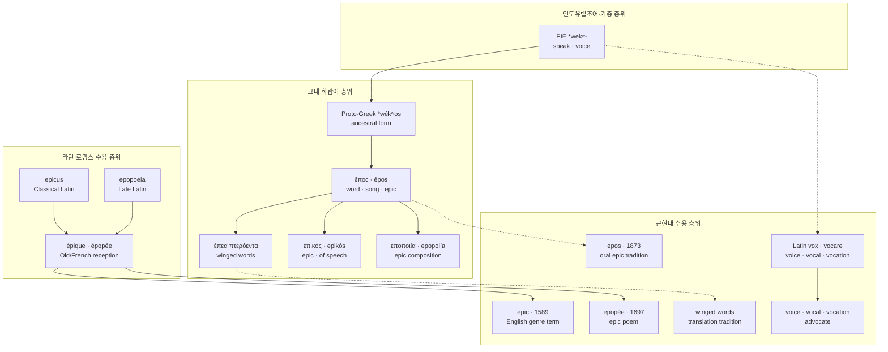

# Epos (에포스)

**[[greek-reading-guide|읽는 법]]**: 에포스 · **원어**: ἔπος · **학술 전사**: *épos*

> **요약**: 고대 그리스어 **ἔπος**(*épos*, 말·발화·시구)는 인도유럽조어 `*wekʷ-`(말하다)에서 기원하여, 호메로스 서사시에서 화자의 입술을 떠나 청자의 마음에 직격하는 정형구 '날개 돋친 말'(*épea pteróenta*)로 구체화되었으며, 이후 서사시 장르를 가리키는 **Epic**과 구비 서사 전통을 뜻하는 학술어 **Epos**, 서사시 창작물인 **Epopee**로 현대 영어에 정착했습니다.

---

## 1. 어원 전파 계통도 (Etymological Transmission Tree)

---

## 2. 인구어(PIE) 및 희랍어 원어근 분석 (PIE & Proto-Greek Morphology)

- **PIE 조어 어근**: `*wekʷ-` (말하다, 목소리를 내다; Pokorny *IEW* 1135, Rix *LIV* 673).
- **음운 변화 및 법칙**:
  - 인도유럽조어 중성 s-어간 명사 `*wékʷ-os`에서 출발했습니다.
  - 전설모음(`*e`) 앞의 순치음화 또는 순연구개음 법칙에 따라 조상 그리스어 단계에서 `*wépos`로 전환되었으며, 고졸기 서사시 방언에 존재하던 초기 반모음 디감마(**ϝ**, *w-*)는 호메로스 운율에서 모음 충돌(Hiatus)을 차단하고 선행 음절을 장음화(Positione longa)하는 흔적을 남겼습니다.
  - 아티케-이오니아 방언에서 디감마가 완전히 탈락하며 **ἔπος**(*épos*)로 정착했습니다.
- **인도유럽어족 동계어 대조**:
  - 라틴어: **vōx** (목소리, 소리), **vocāre** (부르다), **convocāre** (소집하다)
  - 산스크리트어: **vácas-** (말, 언명), **vakti** (말하다)
  - 아베스타어: **vacah-** (말, 말씀)
  - 고대 고지독일어: **giwāhan** (언급하다)

| 그리스어 실제형 | 학술 전사 | 표제형·형태론 | 한국어 풀이 | 근거 |
|:---|:---|:---|:---|:---|
| ἔπος | *épos* | 중성 단수 주격/대격 | 말, 발언, 시구, 신탁 | Chantraine DELG 354 |
| ἔπεα | *épea* | 중성 복수 주격/대격 (미축약) | 말들, 발화들, 시구들 | *Il.* 1.201; LSJ 676 |
| ἔπη | *épē* | 중성 복수 주격/대격 (아티카 축약) | 말들, 서사시 구절들 | 아리스토텔레스 『시학』 1447b |
| ἐπικός | *epikós* | 형용사 남성 단수 주격 | 서사시의, 헥사메테론 시가의 | Beekes EDG 437 |
| ἐποποιΐα | *epopoiḯa* | 여성 단수 주격 (ἔπος + ποιέω) | 서사시 창작, 영웅 서사시 | 플라톤 『국가』 379a |

---

## 3. 호메로스 서사시 원전 용례 및 문헌학 (Homeric Epic Context & Philology)

호메로스 텍스트에서 **ἔπος**(*épos*)는 단순히 사전에 등재된 추상적 낱말이 아니라, 입 밖으로 소리 내어 뱉어지는 **구체적인 발화 행위**(Speech-Act)이자 영웅들 간의 공적 소통 단위입니다.

### 3.1 호메로스 정형구: '날개 돋친 말'(*épea pteróenta*)의 시학

호메로스 양대 서사시에서 **ἔπεα πτερόεντα**(*épea pteróenta*, 날개 돋친 말)는 무려 **120회 이상** 등장하는 최고의 빈출 정형구(Formula)입니다. 고전문헌학(Parry 1971, Calhoun 1935, Martin 1989)에서는 이 정형구가 지닌 두 가지 핵심 은유를 규명합니다:

1. **깃 달린 화살의 비유**: 형용사 `πτερόεις`(*pteróeis*, 날개 달린/깃 달린)는 새의 날개뿐 아니라 전장에서 시위를 떠난 '깃 달린 화살'을 가리킵니다. 화자의 입을 떠난 말이 공기를 가르고 날아가 청자의 귀와 마음(Thumos)에 정확히 꽂히는 직선적 추진력을 형상화합니다.
2. **새의 비유와 발화의 비가역성‘**: 호메로스는 입술과 이를 가리켜 **’이빨의 울타리**'(ἕρκος ὀδόντων, *hérkos odóntōn*)라 불렀습니다. 이 울타리를 넘어 날아간 말은 새장에 갇힌 새가 날아가 버리듯 다시는 주워 담을 수 없는 공적 구속력과 생명력을 지닙니다.

### 3.2 『일리아스』 23권 534–538행 (에우멜로스 장면과 오익토스 발동)

파트로클로스 장례경기 전차경주에서 당대 최고 기수 에우멜로스가 불운으로 전차가 파손되어 꼴찌로 들어왔을 때, 아킬레우스가 군중의 조롱을 제어하고 그의 존엄을 지키기 위해 군중 한가운데 서서 선언하는 대목입니다:

- **번역**: "발 빠른 고귀한 아킬레우스는 그를 보고 가엾게 여겼으며, 아르고스인들 가운데 서서 날개 돋친 말을 건넸다."
- **원문**: τὸν δὲ ἰδὼν ᾤκτειρε ποδάρκης δῖος Ἀχιλλεύς, / στὰς δ᾽ ἄρ᾽ ἐν Ἀργείοις ἔπεα πτερόεντ᾽ ἀγόρευε·
- **학술 전사**: *tòn dè idṑn ṓikteire podárkēs dîos Akhilleús, / stàs d’ ár’ en Argeíois épea pteróent’ agóreue;* (_Il._ 23.534–535)
- **문헌학적 주석**: 아킬레우스의 발화는 사적인 귓속말이나 독백이 아니라, 군중의 잠재적 비웃음을 차단하고 패자의 체면을 세워주기 위해 청중 전체를 향해 의도적으로 쏘아 올린 공적 선언임을 나타냅니다 ([[concept-oiktos|Oiktos]]).

### 3.3 『일리아스』 1권 201행 (아킬레우스와 아테나의 대면)

분노로 칼을 뽑으려던 아킬레우스 곁에 여신 아테나가 나타났을 때 영웅이 놀라움 속에서 건넨 발화 도입구입니다:

- **번역**: "그는 놀라며 몸을 돌렸고, 곧바로 팔라스 아테나를 알아보았다. [...] 그리하여 그는 소리 내어 그녀에게 날개 돋친 말을 건넸다."
- **원문**: θάμβησεν δ᾽ Ἀχιλεύς, μετὰ δ᾽ ἐτράπετ᾽, αὐτίκα δ᾽ ἔγνω / Παλλάδ᾽ Ἀθηναίην· [...] / καί μιν φωνήσας ἔπεα πτερόεντα προσηύδα·
- **학술 전사**: *thámbēsen d’ Akhileús, metà d’ etrápet’, autíka d’ égnō / Pallád’ Athēnaíēn; [...] / kaí min phōnḗsas épea pteróenta prosēúda;* (_Il._ 1.199–201)

---

## 4. 역사적 전파 및 수용사 경로 (Historical Transmission & Reception)

1. **고전기 그리스 및 장르의 탄생 (B.C. 5~4세기)**:
   - 본래 개별 '낱말'이나 '시구'를 뜻하던 ἔπος는 헤로도토스와 플라톤, 아리스토텔레스에 이르러 서정시(Melos)나 비극·희곡(Drama)과 구별되는 **운문 서사 문학 장르 전체**를 지칭하는 학술 개념으로 범주화되었습니다.
   - 아리스토텔레스는 『시학』(1447b)에서 헥사메테론 운율로 구현되는 서사적 모방 예술을 `ἐποποιΐα`(*epopoiḯa*)로 정의했습니다.
2. **로마 제국의 라틴어 수용 (B.C. 1세기~A.D. 4세기)**:
   - 로마인들은 그리스 문학 장르를 흡수하면서 형용사 `ἐπικός`를 **epicus**로 차용했습니다. 키케로와 퀸틸리아누스는 호메로스와 베르길리우스의 헥사메테론 서사시를 *carmen epicum*(서사시)이라 불렀습니다.
3. **프랑스어 경유 및 근대 영어 정착 (16~17세기)**:
   - 라틴어 *epicus*는 고대 프랑스어 *épique*를 거쳐 엘리자베스 조 영국(1589)에 **epic**으로 유입되었습니다.
   - 17세기 후반(1697) 존 드라이든 등 신고전주의 문인들은 서사시 장르를 높여 부르며 프랑스어 *épopée*를 차용한 **epopee**를 도입했습니다.
4. **19세기 고전문헌학 부흥과 Epos의 학술적 부활**:
   - 19세기 독일 고전문헌학(Wolf, Lachmann)과 비교구비문학(Parry, Lord) 연구자들은 근대의 장르적 통속성을 탈피하여 고대 호메로스 음유시 전통 자체를 순수하게 가리키기 위해 원어 ἔπος를 라틴 문자 표기 그대로 옮겨온 학술어 **epos**를 확립했습니다 (OED 1873년 최초 기록).

---

## 5. 음운 및 의미 변화사 (Phonological & Semantic Evolution)

### 5.1 음운 및 형태 변천
- **PIE `*wekʷ-os` $\to$ 원시 그리스어 `*wepos`**: 순연구개음 `*kʷ`가 전설모음 앞 순음 `p`로 동화.
- **디감마(ϝ) 탈락**: 고졸기 서사시 운율에서는 `[w]` 음가가 살아있었으나 고전기 아티케 방언에서 완전히 무음화되어 단순 기모음 `ἔπος`(*épos*)로 변화.
- **라틴어 및 로망스어 차용**: 그리스어 형용사 접미사 `-ικός`(*-ikós*)가 라틴어 *-icus*, 프랑스어 *-ique*, 영어 *-ic*로 단계적 적응.

### 5.2 의미 전이 메커니즘 (Semantic Shifts)
- **개별 발화에서 서사 장르로의 환유 (Metonymy)**:
  - '입 밖으로 나온 한 마디 말/시구' $\to$ '헥사메테론 운율로 불리는 시구들의 총체' $\to$ '영웅의 위업을 노래하는 대서사시 장르'.
- **스케일의 극대화와 일상어화 (Modern Hyperbole)**:
  - 고대에는 엄격한 운율 형식(Dactylic Hexameter)을 갖춘 문학 장르만을 가리켰으나, 20세기 대중문화와 영화계(헐리우드 대작)를 거치며 "스케일이 거대하고 영웅적인 모든 사건·작품"을 수식하는 형용사(*epic battle*, *epic journey*)로 일반화(Generalization)되었습니다.

---

## 6. 현대 영어 파생어군 및 어휘 패밀리 (Modern English Cognates & Derivatives)

| 품사/형태 | 단어 (Word) | 의미 및 학술적 용법 | 최초 기록 (OED) | 확실성 |
|:---|:---|:---|:---|:---|
| 명사 | **epic** | 서사시, 영웅적 서사물, 서사 영화 | 1589년 | 정설/문헌 입증 |
| 형용사 | **epic** | 서사시의, 영웅적인, 대규모의 | 1589년 | 정설/문헌 입증 |
| 명사 | **epos** | (학술어) 구비 서사시, 민족 서사시 전통 | 1873년 | 정설/문헌 입증 |
| 명사 | **epopee** | 대서사시, 서사시 창작술 | 1697년 | 정설/문헌 입증 |
| 명사 | **epicist** | 서사시인 (서사시를 짓는 작가) | 1609년 | 정설/문헌 입증 |
| 형용사 | **epical** | 서사적인, 서사시풍의 | 1610년 | 정설/문헌 입증 |
| 부사 | **epically** | 서사시적으로, 웅대하게 | 1850년 | 정설/문헌 입증 |

- **PIE `*wekʷ-` 계열 라틴 직계 동계어 패밀리**:
  - *voice*, *vocal*, *vocation*, *avocation*, *advocate*, *provoke*, *revoke*, *invoke*, *equivocal*, *vocabulary*

---

## 7. 관용표현 및 문화사적 수용 (Cultural Idioms & Modern Reception)

### 7.1 '날개 돋친 말'(*Winged Words*)의 현대적 수용
- **호메로스 연구의 패러다임 전환**: 밀먼 패리(Milman Parry)와 앨버트 로드(Albert Lord)는 호메로스 서사시가 문자로 기록된 텍스트가 아니라 구비 구송(Oral-formulaic poetry)으로 전승된 것임을 증명하는 결정적 증거로 `ἔπεα πτερόεντα` 정형구를 제시했습니다.
- **문학적 인용**: 존 밀턴의 『실락원』, 낭만주의 시인 셸리와 바이런은 시적 영감이 화자의 입을 떠나 청자의 영혼으로 날아가는 고결한 언어적 순간을 표현할 때 호메로스의 'winged words'를 모티프로 즐겨 차용했습니다.

---

## 8. 어원 증거 매트릭스 및 학술 출처 (Evidence Matrix & References)

| 어원 및 수용 명제 | 언어 층위 | 확실성 등급 | 출전 및 학술 문헌 근거 |
|:---|:---|:---|:---|
| PIE `*wekʷ-` 조어 어근 재구 | 인도유럽조어 | 학술적 재구 | Pokorny (1959: 1135); Rix (2001: 673) |
| 고졸기 디감마(ϝ) 흔적 | 조상 그리스어 | 정설/문헌 입증 | Chantraine DELG 354; Beekes EDG 437 |
| '날개 돋친 말' 정형구 용례 | 고대 희랍어 | 원전 명시 | _Il._ 1.201, 23.535; _Od._ 1.122; Calhoun (1935) |
| 라틴어 epicus 전파 | 라틴어 | 정설/문헌 입증 | Cicero, *De Oratore*; Lewis & Short 656 |
| 프랑스어 경유 epic/epopee 차용 | 중세 불어/근대 영어 | 정설/문헌 입증 | Oxford English Dictionary (OED Online) |
| 19세기 epos 학술 차용 | 현대 영어 | 정설/문헌 입증 | OED s.v. *epos* (1873) |

---

## 관련 항목

### 호메로스 위키 연관 개념 및 문서
- [[concept-epic-cycle|서사시권 (Epic Cycle)]] — 헥사메테론 서사시 전통의 전체 체계
- [[concept-oiktos|오익토스 (Oiktos)]] — 에우멜로스 장면에서 아킬레우스가 날개 돋친 말을 건네며 발동한 도덕적 제동
- [[concept-eleos|엘레오스 (Eleos)]] — 오익토스를 거쳐 비경쟁적 지반에서 전개되는 실천적 구호
- [[concept-arete|아레테 (Arete)]] — 서사시 영웅들의 탁월성과 결과주의 규범

### 어원 사전 내 연관 표제어
- [[word-eleos|Eleos (엘레오스)]] — 비탄과 구호의 어원 및 영어 수용사
- [[word-polytropos|Polytropos (폴리트로포스)]] — 오디세우스 서사시 도입부의 수식어
- [[word-achilles|Achilles (아킬레우스)]] — 영웅 인명 및 서사시적 수용사
- [[words/index|호메로스 어원·영단어 사전 인덱스]]
