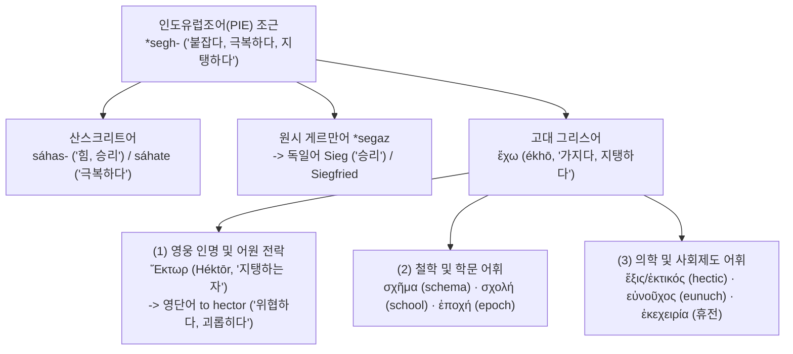
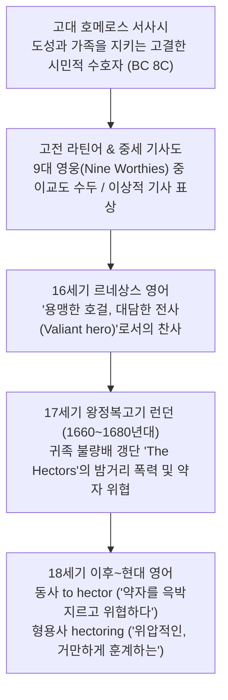

# Hector (헥토르)

**[[greek-reading-guide|읽는 법]]**: 헥토르 · **원어**: Ἕκτωρ · **학술 전사**: *Héktōr*

> **요약**: 호메로스 서사시 『일리아스』의 최고 수호 영웅 헥토르(Ἕκτωρ)의 이름에서 유래한 인명 유래어(Eponym)로, 인도유럽조어 `*segh-`("붙잡다, 굳건히 지탱하다")에서 출발하여 고대 그리스어의 '도성의 수호자' 및 중세 기사도의 '9대 영웅(Nine Worthies)'으로 칭송받았으나, 17세기 후반 왕정복고기 런던의 귀족 청년 불량배 갱단인 'The Hectors'의 폭력적 행태를 거치며 현대 영어에서 "약자를 거만하게 윽박지르고 위협하다(to hector)" 및 "위압적인(hectoring)"이라는 부정적 의미로 180도 전락(Pejoration)한 대표적인 역사언어학적 고유명사입니다.

---

## 1. 어원 전파 계통도 및 동족어 연계망 (Etymological Transmission & Cognate Tree)

인도유럽조어(PIE) 조근 `*segh-`는 고대 그리스어에서 기본 동사 ἔχω(*ékhō*, 가지다/지탱하다) 및 영웅의 이름 Ἕκτωρ(*Héktōr*)를 낳았을 뿐만 아니라, 철학·학문·의학·제도 전반에 걸친 방대한 현대 영단어군과 게르만어군 동족어를 파생시켰습니다.

---

## 2. 인도유럽조어(PIE) 및 고대 그리스어 원어근 형태론 (PIE & Proto-Greek Morphology)

### 2.1 PIE 조근 `*segh-`의 음운적 성격과 의미역

- **PIE 조근 재구**: **`*seɡʰ-`** (LIV² 515–516, IEW 888–889, Beekes EDG 491–492)
- **원초적 2대 의미역**:
  1. *군사적·물리적 장악 및 극복*: 'to overpower, conquer, overcome, prevail' (제압하다, 극복하다, 승리하다).
  2. *지속적 파지 및 지탱*: 'to hold in one's power, sustain, possess, keep' (장악하여 유지하다, 굳건히 지탱하다, 버티다).
- **행위자 명사 접미사 `*-tōr` 결합**:
  - 인도유럽조어 능동 행위자 형성 접미사 `*-tōr` (그리스어 `-τωρ`, 산스크리트어 `-tar-`, 라틴어 `-tor`)가 결합하여 `*seɡʰ-tōr` ("굳건히 붙잡고 있는 자", "도성을 지탱하는 자")가 형성되었습니다.

### 2.2 그라스만의 법칙(Grassmann's Law)과 Ἕκτωρ의 기식음 보존 메커니즘

그리스어 역사형태론에서 기본 현재형 동사는 순한숨표 **ἔχω**(*ékhō*)인데 반해, 행위자 명사는 거친숨표 **Ἕκτωρ**(*Héktōr*)이며 미래형은 **ἕξω**(*héksō*)인 이유는 기식음 이화 법칙인 **그라스만의 법칙**(Grassmann's Law)으로 엄밀하게 증명됩니다:

1. **현재형 ἔχω (*ékhō*)**:
   - `PIE *séɡʰ-ō` → 원시 그리스어 `*hékʰō` (어두 `*s-` > `*h-`, 어말 `*ɡʰ` > `*kʰ`).
   - 연속된 두 음절에 기식음(`/h-/`와 `/-kʰ-/`)이 충돌하자 그라스만의 법칙이 발동하여 선행 기식음 `*h-`가 탈락(순한숨표화)되어 **ἔχω**로 정착했습니다.
2. **미래형 ἕξω (*héksō*)**:
   - `PIE *séɡʰ-s-ō` → 원시 그리스어 `*hékʰ-s-ō`.
   - s-자음군 결합 규칙에 의해 유기음 `*kʰ` + `s`가 무기 파열음 `[ks]` (ξ)로 중화되어 후행 기식성이 소멸했습니다.
   - 따라서 그라스만의 법칙이 발동하지 않아 어두 거친숨표 `*h-`가 온전히 보존되어 **ἕξω**가 되었습니다.
3. **행위자 명사 Ἕκτωρ (*Héktōr*)**:
   - `PIE *séɡʰ-tōr` → 원시 그리스어 `*sekʰ-tōr`.
   - 파열음 결합 규칙에 의해 `*kʰ` + `t`가 무기 파열음 연쇄 `[kt]` (κτ)로 중화되면서 후행 음절의 기식성이 소멸했습니다.
   - 이에 따라 그라스만의 법칙이 작동하지 않고 어두 `*s-`의 기식음화(`*h-`)가 그대로 보존되어 거친숨표 **Ἕκτωρ**가 완성되었습니다.

### 2.3 미케네 선문자 B(Linear B) 청동기 문헌 증거

기원전 14~13세기 미케네 점토판 문서는 `*segh-` 어근이 호메로스 서사시 이전부터 지배적 고유 인명 및 토지 보유 행정 어휘로 실재했음을 입증합니다:
- **`e-ko`** (/ekhōn/): '소유하는 자' (현재 능동 분사).
- **`e-ke`** (/ekhei/): '가지고 있다, 보유하다' (필로스 토지 문서 PY Eb 297의 상투구 *o-na-to e-ke*, "보유지를 가지고 있다").
- **`e-ko-to`** (/Héktōr/): 크노소스 점토판(KN As 1516, KN Fh 348)에 실존 인명으로 기록됨. 서사시 형성 이전 청동기 미케네 사회에서 이미 귀족·전사의 고유 인명으로 확립되어 있었습니다.

| 그리스어 실제형 | 학술 전사 | 표제형·형태론 | 한국어 풀이 | 근거 |
|:---|:---|:---|:---|:---|
| **Ἕκτωρ** | *Héktōr* | Ἕκτωρ, 남성 단수 주격 (3변화) | 지탱하는 자, 수호자, 헥토르 | _Il._ 1.242; Beekes EDG 408 |
| **ἔχω** | *ékhō* | ἔχω, 1인칭 단수 현재 능동 직설법 | 가지다, 붙잡다, 지탱하다 | _Il._ 1.137; Chantraine DELG 391 |
| **ἕξω** | *héksō* | ἔχω, 1인칭 단수 미래 능동 직설법 | 가질 것이다, 지킬 것이다 | _Il._ 5.474; LSJ 750 |
| **ἔσχον** | *éskhon* | ἔχω, 1인칭 단수 아오리스트 능동 | 붙잡았다, 억제했다 | _Il._ 5.473; Rix LIV² 515 |
| **σχῆμα** | *skhēma* | σχῆμα, 중성 단수 주격/대격 | 자세, 외형, 도식 | 플라톤 『국가』; LSJ 1745 |
| **σχολή** | *skholē* | σχολή, 여성 단수 주격 | 여가, 학문적 몰입, 배움터 | 아리스토텔레스 『정치학』; LSJ 1747 |

---

## 3. 호메로스 서사시 원전 시학과 인명학 (Homeric Epic Context & Onomastics)

### 3.1 그레고리 나지(Gregory Nagy)의 서사시 발화명(Speaking Name) 테제

하버드 고전문헌학파의 그레고리 나지(Gregory Nagy, 1979)는 호메로스 영웅들의 이름이 서사 전체의 기능과 운명을 집약하는 **시학적 발화명**(Speaking Name)임을 입증하였습니다:
- **아킬레우스**([[word-achilles|아킬레우스]]): `*Achi-lāwos` ("자신의 군대에게 비탄을 가져오는 자").
- **헥토르**([[entity-hector|헥토르]]): `*seɡʰ-tōr` ("도성과 백성을 굳건히 붙잡아 지탱하는 자").
- 헥토르는 트로이아라는 공동체 질서의 **유일한 버팀목이자 수호자**(ἔρυμα / ἕκτωρ)이며, 그의 전사는 곧 트로이아 도성의 물리적 함락과 서사적으로 완전한 등가물(*narrative equivalent*)을 이룹니다.

### 3.2 헥토르와 아스티아낙스의 시학적 상징 조응

호메로스는 헥토르의 아들 **아스티아낙스**(Ἀστυάναξ, "도성의 군주")의 명명 과정을 통해 헥토르 이름의 본질을 텍스트 안에서 직접 해설합니다(_Il._ 6.402–403):
- 아이의 본명은 스카만드리우스였으나, 트로이아인들은 오직 “**헥토르 홀로 일리온 도성을 지키고 있었기 때문**”에 아이를 아스티아낙스라 불렀습니다.
- 아버지가 도성을 지탱하는 자(*Héktōr*)이기에 아들은 도성의 군주(*Asty-anax*)가 되며, 헥토르가 쓰러지는 순간 도성의 지탱이 끝나 아스티아낙스 역시 성벽에서 내던져져 살해당해야 하는 비극적 숙명에 놓입니다.

---

### 3.3 호메로스 원전 3대 핵심 텍스트 정밀 주해

#### (1) _Il._ 5.473–475 (사르페돈의 견책과 `*segh-` 어근의 다의적 어간 변용)
- **번역**: "헥토르여, 그대 일찍이 지녔던 그 기백은 도대체 어디로 가버렸는가? 그대는 백성들도 동맹군도 없이 오직 매제들과 형제들만 데리고 홀로 도성을 지켜낼(붙잡아 유지할) 수 있다고 장담하더니."
- **원문**: *Ἕκτορ, πῇ δή τοι μένος ἔσχεθεν ὃ πρὶν ἔχεσκες; / φῆς που ἄτερ λαῶν πόλιν ἑξέμεν ἠδ᾽ ἐπικούρων / οἶος σὺν γαμβροῖσι κασιγνήτοισί τε σοῖσι·*
- **학술 전사**: *Héktor, pêi dḗ toi ménos éskhethen hò prìn ékheskes; / phē̂s pou áter laō̂n pólin heksémen ēd' epikoúrōn / oîos sùn gambroîsi kasignḗtoisí te soîsi;*
- **[주석]**: 호격 **Ἕκτορ**(*Héktor*) 바로 뒤에 **ἔσχεθεν**(*éskhethen*, 아오리스트), **ἔχεσκες**(*ékheskes*, 미완료 반복형), **ἑξέμεν**(*heksémen*, 미래 부정사)이 연속 배치되는 고도의 수사적 기법(Polyptoton)이 적용되었습니다. 사르페돈은 헥토르에게 "이름 그대로 도성을 지켜내는 자답게 처신하라"고 어원론적 질타를 가하는 것입니다.

#### (2) _Il._ 6.402–403 (스카이아이 성문 앞 아스티아낙스의 명명)
- **번역**: "헥토르는 아이를 스카만드리우스라 불렀으나, 다른 이들은 아스티아낙스라 불렀으니, 헥토르 홀로 일리온을 지키고 있었기 때문이다."
- **원문**: *τόν ῥ᾽ Ἕκτωρ καλέεσκε Σκαμάνδριον, αὐτὰρ οἱ ἄλλοι / Ἀστυάνακτ᾽· οἶος γὰρ ἐρύετο Ἴλιον Ἕκτωρ.*
- **학술 전사**: *tón rh' Héktōr kaléeske Skamándrion, autàr hoi álloi / Astuánakt'; oîos gàr erúeto Ílion Héktōr.*
- **[주석]**: 시행 종결부의 **ἐρύε토 Ἴλιον Ἕκτωρ**는 동사 *erúesthai*(지키다/구출하다)와 주어 *Héktōr*를 결합시켜, 영웅의 이름 자체가 도성의 보루임을 선언합니다.

#### (3) _Il._ 24.729–730 (안드로마케의 마지막 애가)
- **번역**: "정녕 그대, 도성의 수호자이시여, 그대는 전사하셨나이다, 도성을 손수 지키시며 존귀한 아내들과 어린아이들을 붙들어 보호하시던 이여."
- **원문**: *ἦ γὰρ ὄλωλας / ἐπίσκοπος, ὅς τέ μιν αὐτὴν / ῥύσκου, ἔχες δ᾽ ἀλόχους κεδνὰς καὶ νήπια τέκνα,*
- **학술 전사**: *ē̂ gàr ólōlas / epískopos, hós té min autḕn / rhúskou, ékhes d' alókhous kednàs kaì nḗpia tékna,*
- **[주석]**: 안드로마케는 헥토르를 도성의 감독관(*epískopos*)으로 부르며, 그가 행한 핵심 행위로 **ἔχες**(*ékhes*, '붙잡아 지키다' < *ékhō*)를 명시합니다. 헥토르라는 이름의 어원적 행위가 서사시의 마지막 애가에서 완결됩니다.

---

## 4. 고전 라틴어 및 중세 기사도 수용사 (Classical & Medieval Reception)

### 4.1 베르길리우스 『아이네이스』의 로마 성물 수호자
고전 라틴어에서 헥토르는 제3변화 명사 **Hectōr**(속격 *Hectoris*)로 수용되었습니다. 베르길리우스의 라틴 서사시 『아이네이스』(*Aeneid*, 2.289–293)에서 헥토르는 아이네이아스의 꿈에 나타나 로마 건국의 신성한 불씨와 성물(Penates)을 위탁하는 거룩한 수호자이자 로마 제국의 정신적 선조로 격상됩니다:
- *"sacra suosque tibi commendat Troia penatis;"* ("트로이가 그대에게 자신의 성물과 수호신들을 맡기나니;")

### 4.2 중세 9대 영웅(Nine Worthies) 중 이교도 수두(首頭)
12세기 프랑스 트로이 소설 전통(Benoît de Sainte-Maure)과 자크 드 롱기용의 『공작의 서약』(*Les Vœux du paon*, 1312)을 거치며, 헥토르는 인류 역사상 최고의 기사도를 구현한 **9대 영웅(Nine Worthies / Les Neuf Preux)** 중 **이교도 3영웅(헥토르, 알렉산드로스, 카이사르)의 수두**로 공인되었습니다:
- 존 리드게이트(John Lydgate, 1412)의 『트로이 서』: *"Hector the worthy, patroun of chyvalrie."* (기사도의 귀감이요 당당한 헥토르).

### 4.3 초기 근대 영어: "용맹한 호걸(A Valiant Hero)"
16세기 르네상스기 영어에서 명사 `Hector`는 "대담한 전사, 용기 있는 챔피언"을 뜻하는 최상의 남성적 찬사로 사용되었습니다. 셰익스피어는 『사랑의 헛수고』(5막 2장) 및 『헨리 4세 2부』(2막 4장)에서 *"as valorous as Hector of Troy"*라는 대사를 통해 무흠의 용맹을 칭송했습니다.

---

## 5. 17세기 런던 갱단 'The Hectors'와 의미 악화사 (17th-Century Pejoration)

### 5.1 왕정복고기 런던의 폭력 갱단과 어의의 타락
청교도 혁명 이후 1660년대 왕정복고기(Restoration)에 이르러, 런던의 방탕한 귀족·신사 청년들이 코번트 가든과 스트랜드의 밤거리에서 무리를 지어 행인을 습격하고 야경꾼을 폭행하는 폭력 조직을 결성했습니다. 이들은 자신들을 고대 최고의 전사에 빗대어 ‘**The Hectors**’라 자칭했습니다.

그러나 이들의 실제 행태는 만취 상태에서 약자를 위협하고, 가짜 결투(False challenge)를 남발하며 고함을 지르고 으스대는 비열한 난동이었습니다. 이에 따라 시민들과 문인들은 'Hector'라는 이름을 "영웅을 참칭하며 큰소리로 남을 위협하는 골목 불량배, 허풍쟁이 건달"로 조롱조로 부르기 시작했고, 단어의 의미는 '**최고의 영웅**'(Valiant hero)에서 '**비열한 가해자**'(Street bully)로 180도 전락(**Pejoration**)하였습니다.

---

### 5.2 1차 역사 사료 실증

#### (1) 새뮤얼 피프스의 일기 (The Diary of Samuel Pepys, 1660년대)
런던의 고위 관료 피프스는 일기에서 런던 밤거리를 어지럽히는 Hectors의 난동을 직접 기록했습니다:
- **1666년 8월 14일 일기**:
  - *"we had a great many hectors in the same box with us... where they drank wine, and raged, and swore..."*
  - (우리와 같은 특별석에 수많은 헥터스[Hectors, 방탕한 불량배들]가 함께 있었는데... 그곳에서 그들은 포도주를 마시고, 날뛰며 난동을 부리고, 욕설을 퍼부었다.)
- **1667년 6월 30일 일기**:
  - *"the Duke of Monmouth... with a great many young hectors, the greatest ruffians and debauchees about town..."*
  - (몬머스 공작은 도시에서 가장 악명 높은 난봉꾼이자 폭력배들인 수많은 젊은 헥터스[Hectors]를 거느리고 다녔다.)

#### (2) 토머스 섀드웰의 희곡 『The Scowrers』 (1691)
- **1막 1장 Sir Tope의 회고**:
  - *"I knew the Hectors, and before them the Muns, and the Tityre Tus; they were brave fellows indeed! In those days, a man could not go from the Rose Tavern to the Piazza once, but he must venture his life twice, my dear Jacks."*
  - (나는 헥터스[Hectors]를 알았고, 그 이전에는 먼스[Muns]와 티티레 투스[Tityre Tus]를 알았지. 그 시절에는 로즈 터번에서 피아차 광장까지 단 한 번을 가려 해도 목숨을 두 번은 걸어야 했단 말일세.)

---

### 5.3 OED(Oxford English Dictionary) 최초 출현 및 편찬학적 기록

| 표제어 (Entry) | 품사 | OED 최초 출현 연도 및 1차 출처 | OED 정의 및 의미 변천 |
|:---|:---|:---|:---|
| **hector** (1차 의미) | 명사 | c. 1385 (Chaucer) | 고대 트로이아의 영웅; 무용과 충성을 지닌 이상적 전사. |
| **hector** (2차 의미) | 명사 | **1655/1656년** (Prestwich), **1675년경** 일반화 | A blustering, turbulent, noisy fellow; a swaggering bully; a street-ruffian (소란스럽고 위압적인 자; 밤거리 깡패, 허풍쟁이). |
| **to hector** | 동사 | **1674/1680년** (Eachard; L'Estrange) | 명사에서 품사 전성(Zero-derivation). To play the hector; to bully, browbeat, bluster, intimidate (위압적으로 굴다, 거만하게 윽박지르다). |
| **hectoring** | 형용사/명사 | **1670년대 후반** | Given to bullying; insolently threatening, blustering (위압적인 어조나 태도로 으스대는). |
| **hectorism** | 명사 | **1670~1680년대** | The practice or disposition of a hector; blustering insolence (위압적 거드름, 헥터식 난동). |

---

## 6. 현대 영어 파생어 및 유의어 의미장 분석 (Modern Derivatives & Semantic Field)

### 6.1 현대 통사 구문론 (Syntactic Patterns)
1. **결과 유발 강압 구문**: `hector someone into [doing] something`
   - 상대방을 큰소리로 윽박지르고 몰아붙여 강제로 특정 행위를 하게 만들다.
   - 예: *They were hectoring the committee into adopting the new regulations.*
2. **주제적 몰아세움 구문**: `hector someone about / over something`
   - 특정 문제를 두고 상대방에게 도덕적 설교나 위압적 질책을 쏟아붓다.
   - 예: *He constantly hectors his staff about their minor administrative oversights.*
3. **태도 및 양태 수식구**: `in a hectoring tone / a hectoring lecture`
   - 거만하고 시끄럽게 훈계하는 억양이나 태도.

---

### 6.2 5대 위압·괴롭힘 유의어 정밀 변별 매트릭스

| 단어 (Lexeme) | 어원적 근원 및 핵심 이미지 | 행동 양식 및 주요 수단 | 권력 역학 (Power Dynamic) | 고유 뉘앙스 (Distinct Nuance) |
|:---|:---|:---|:---|:---|
| **hector** | 17세기 런던 갱단 'The Hectors' (트로이 영웅 Ἕκτωρ의 참칭) | **시끄러운 고함(bluster), 거만한 설교조(moralizing), 위압적 훈계**로 상대를 몰아세움. | 도덕적·지적 우월감을 과시하며 언어적으로 압박. | **목소리가 크고 장황하며, 훈계하듯 윽박질러** 상대의 기를 꺾고 강요함. |
| **browbeat** | 고유어 **brow**(눈썹) + **beat**(치다) (눈썹을 찡그리고 내려다봄) | **냉혹한 눈빛, 위압적 표정, 가혹한 질문 공세, 오만한 지위 과시**로 굴복시킴. | 공식적 권위자(판사, 검사, 상사)가 부하/증인을 압도. | **권위와 위압적인 태도로 기를 팍 죽여** 말을 못 하거나 자백하게 만듦. |
| **bully** | 중세 네덜란드어 *boele*(연인/친구)의 17세기 의미 악화 | **물리적 폭력(physical force), 집단 위력, 지속적인 협박과 괴롭힘**. | 강자/다수가 취약한 약자(vulnerable target)를 착취. | **신체적·구조적 힘의 비대칭**을 이용한 잔혹하고 지속적인 가해. |
| **swagger** | 스칸디나비아 북유럽어 *svagga*(비틀거리다, 흔들거리며 걷다) | **거들먹거리는 걸음걸이, 과장된 몸짓, 허풍(boasting), 불손한 태도**. | 자신의 힘이나 매력을 과시하려는 허세적 우위. | 괴롭힘 자체보다 ‘**자신만만하게 뽐내고 으스대는 꼴**’에 초점. |
| **badger** | 명사 **badger**(오소리) (18-19세기 잔혹한 오소리 사냥 스포츠 *badger-baiting*) | **끈질긴 요구, 집요한 질문 세례, 쉬지 않고 물고 늘어짐(pestering)**. | 지치게 만들려는 자와 시달리는 자. | 물리적 위압보다는 **끝없이 귀찮게 졸라대고 캐물어** 진을 빼놓음. |

---

### 6.3 현대 권위지 코퍼스 실례

1. 『**이코노미스트**』 **(*The Economist*)**:
   - *"Authoritarian leaders routinely **hector** their citizens into ideological conformity, deploying state media to drown out dissent with a relentless barrage of moralizing rhetoric."*
   - (권위주의 지도자들은 가차 없이 쏟아지는 훈계조의 수사로 반대 의견을 압살하기 위해 관영 언론을 동원하며, 시민들을 이념적 순응으로 윽박질러 몰아세운다.)
2. 『**뉴욕 타임스**』 **(*The New York Times*)**:
   - *"The prosecutor sought to **hector** the witness into changing her testimony, but the defense counsel immediately objected to the aggressively badgering tone."*
   - (검사는 증인을 윽박질러 진술을 바꾸도록 몰아세우려 했으나, 변호인은 공격적으로 괴롭히는 어조에 대해 즉각 이의를 제기했다.)
3. 『**가디언**』 **(*The Guardian*)**:
   - *"Ministers should stop **hectoring** local councils over housing targets and instead provide the necessary infrastructural funding."*
   - (각료들은 주택 공급 목표를 두고 지방 의회를 윽박지르고 압박하는 행태를 멈추고, 대신 필요한 인프라 자금을 지원해야 한다.)

---

## 7. 인도유럽어족 동족어(Cognates) 연계망

인도유럽조어 `*segh-`의 기본 동사 ἔχω는 서양의 지성사 및 과학 어휘에 결정적인 동족어들을 남겼습니다:

1. **schema / scheme (도식, 외형, 체계)**:
   - 그리스어 **σχῆμα** (*skhēma*, 태도/형태 < `*sgʰ-ē-ma`).
   - '몸을 유지하는 방식'에서 출발하여 플라톤과 아리스토텔레스의 '논리적 형식과 구조'를 거쳐 현대의 개념적 도식(**schema**)과 계획(**scheme**)으로 정착.
2. **school / scholar (학교, 학파, 학자)**:
   - 그리스어 **σχολή** (*skholē*, 여가/학문적 몰입 < `*sgʰ-ol-ā`).
   - 동사 ἔχω의 '붙잡아 멈춤(holding back)'에서 유래하여 “**생업 노동의 중단, 자유 시간, 여가(leisure)**”를 의미하다가, 자유 시간에 모여 학문을 토론하는 배움터(**school**)로 전화.
3. **epoch (시대, 신기원, 에포케)**:
   - 그리스어 **ἐποχή** (*epokhē*, 정지/판단유보 < ἐπί + ἔχω).
   - 천문학의 궤도 정지점 및 헬레니즘 회의주의 철학의 '판단 유보(에포케)'를 거쳐 역사적 연대 계산의 새로운 기준 시점(**epoch**)으로 발전.
4. **hectic (소모성의, 열광적인, 눈코 뜰 새 없이 바쁜)**:
   - 그리스어 **ἑκτικός** (*hektikos* < ἕξις, 체질/습관 < `*sekʰ-tis`).
   - 고대 의학의 만성 소모열(**ἑκτικὸς πυρετός**, *febris hectica*) 및 결핵 환자의 홍조(*hectic flush*)에서 유래하여, 현대의 '극도로 분주하고 과열된 상태'를 지칭.
5. **eunuch (환관, 내시)**:
   - 그리스어 **εὐνοῦχος** (*eunoûkhos* < εὐνή '침상' + ἔχω '지키다').
   - 왕실 규수들의 처소와 침실을 경비하도록 배치된 관리.
6. **ekekheiria (올림픽 신성 휴전)**:
   - 그리스어 **ἐκεχειρία** (*ekekheiría* < ἔχω '멈추다' + χείρ '손/무기').
   - 올림픽 기간 중 일체의 무력 행위를 중단한 신성 휴전(Sacred Truce).
7. **게르만어군 동족어 (Sieg, Siegfried)**:
   - 원시 게르만어 `*segaz` / `*sigis-` ('승리, 정복') -> 현대 독일어 **Sieg** ('승리'), **Siegfried** ("승리의 평화").

---

## 8. 학술 쟁점 및 어원 증거 매트릭스 (Evidence Matrix & References)

### 8.1 어원학적 학설 쟁점: 선희랍 기층어설 비판 및 순수 PIE 어원 확립
일부 통속적 가설에서는 트로이아 인명들의 상당수가 아나톨리아/루위아어 계통이나 비-인도유럽어계 선희랍 기층어(Pre-Greek Substrate)일 가능성을 제기하지만, 로버트 베이커스(Beekes 2010)와 피에르 샹트렌(Chantraine DELG)은 Ἕκτωρ가 PIE `*seɡʰ-`에서 완벽한 규칙적 음운 변천(자음군 무기화에 따른 그라스만 법칙 비작동)을 통해 도출되는 **가장 순수한 인도유럽어계 고유 어휘**임을 명확히 규정합니다.

### 8.2 어원 증거 매트릭스

| 어원 및 수용 명제 | 언어 층위 | 확실성 등급 | 출전 및 학술 문헌 근거 |
|:---|:---|:---|:---|
| **PIE 조근 `*segh-` 재구** | 인도유럽조어 | 학술적 재구 | Pokorny IEW 888–889; Rix LIV² 515–516 |
| **Ἕκτωρ의 행위자 형태론** | 고대 그리스어 | 정설/문헌 입증 | Beekes EDG 408; Chantraine DELG 336 |
| **그라스만의 법칙 기식 대립** | 역사음운론 | 정설/문헌 입증 | Chantraine DELG 391–393; Smyth Greek Grammar §125 |
| **미케네 선문자 B 실증 (`e-ko-to`)** | 미케네 그리스어 | 정설/문헌 입증 | Knossos 점토판 KN As 1516; DMic I, 218 |
| **호메로스 시학의 발화명 테제** | 호메로스 시학 | 정설/문헌 입증 | Gregory Nagy (1979) *The Best of the Achaeans* |
| **중세 9대 영웅(Nine Worthies) 수두** | 중세 기사도 | 정설/문헌 입증 | Jacques de Longuyon (1312); John Lydgate (1412) |
| **17세기 런던 'The Hectors' 갱단** | 17C 영국사 | 정설/문헌 입증 | Samuel Pepys Diary (1666/1667); Thomas Shadwell (1691) |
| **동사 to hector 어의 전락(Pejoration)** | 사전편찬학 | 정설/문헌 입증 | Oxford English Dictionary (OED Online) |
| **동족어 (schema, school, epoch 등)** | 비교어원학 | 정설/문헌 입증 | LSJ; Chantraine DELG; Beekes EDG |

---

## 관련 항목
- **호메로스 위키 연관 문서**:
  - [[entity-hector|헥토르 (Hector)]]
  - [[entity-achilles|아킬레우스 (Achilles)]]
  - [[entity-andromache|안드로마케 (Andromache)]]
  - [[concept-aidos|아이도스 (Aidos)]]
  - [[concept-kleos|클레오스 (Kleos)]]
- **동일 어원/동계어 단어 문서**:
  - [[word-achilles|Achilles (아킬레우스)]]
  - [[words/index|호메로스 어원·영단어 사전 인덱스]]
