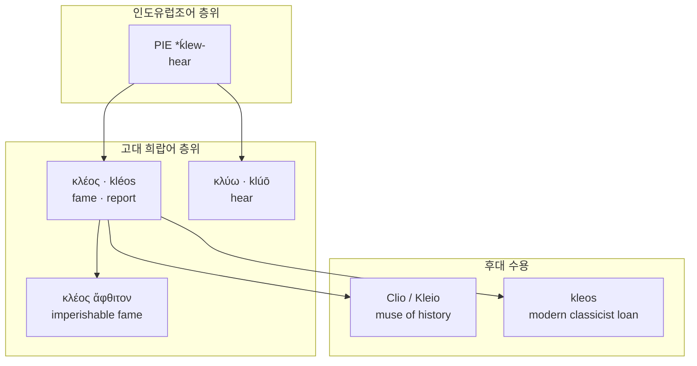

# Kleos (클레오스)

**[[greek-reading-guide|읽는 법]]**: 클레오스 · **원어**: κλέος · **학술 전사**: *kléos*

**요약**: **클레오스**(κλέος, *kléos*)는 “들리는 명성”이다. 인도유럽조어 *ḱlew-*(듣다) 계열과 연결되며, 호메로스에서는 시가·입소문으로 남는 영웅의 공적 이름을 가리킨다. 개념 독해는 [[concept-kleos|클레오스 (Kleos)]]를 본다.

---

## 1. 어원 전파 계통도 (Etymological Transmission Tree)

---

## 2. 인구어(PIE) 및 희랍어 원어근 분석 (PIE & Proto-Greek Morphology)

| 형태 | 학술 전사 | 층위 | 메모 |
|:---|:---|:---|:---|
| *ḱlew- | — | PIE | “듣다” 계열 재구 (표준 비교언어학 요약; 세부는 Chantraine *DELG* 등 사전 항목) |
| κλέος | *kléos* | 호메로스 희랍어 | 중성 명사; 명성·소문·영광 |
| κλύω | *klúō* | 희랍어 동사 | 듣다 — 동일 청각 어근의 동사 쌍 |
| κλέος ἄφθιτον | *kléos áphthiton* | 공식구 | “시들지 않는 명성” — 시가적 불멸 함의([[nagy-1979-best-of-achaeans\|Nagy 1979]]) |

개념 페이지에 형태론 에세이를 중복하지 않는다. 제도 어휘 전반의 비교는 [[benveniste-1969-vocabulaire-institutions-2|Benveniste 1969]]의 명예·왕권 장과 교차 참조하되, κλέος 전용 장은 word·concept가 분담한다.

---

## 3. 호메로스 서사시 원전 용례 및 인명학 (Homeric Epic Context & Onomastics)

- **핵심 용례**: _Il._ 9.410–416 — 아킬레우스의 이중 운명 발화에서 κλέος가 수명과 대비된다. 상세 서사 해제는 [[concept-kleos]].
- **공식구**: κλέος ἄφθιτον(*kléos áphthiton*)은 “불멸의 명성”으로 읽히는 대표 결합이다(나기 전통의 중심 증거; 원전 분포·이본은 후속 보강).
- **인명·무사이**: 후대 전승에서 역사의 무사 **Clio**(Κλειώ, *Kleiṓ*)는 같은 “들림/명성” 계열의 문화적 수용으로 자주 연결된다(후대 수용 — 호메로스 본문 등치는 아님).

---

## 4. 역사적 전파 및 수용사 경로 (Historical Transmission & Reception)

1. **고졸·고전 희랍**: 서사·비가·비문에서 영웅·폴리스의 공적 이름을 κλέος 어휘장으로 서술.
2. **헬레니즘·로마 수용**: 그리스어 교양 어휘로 유지; 라틴 문예는 *glōria* / *fāma* 등 대응어와 병치·번역.
3. **근현대**: 고전학 대출어 *kleos*; 무사 이름 **Clio**를 통한 서양 문예·역사 상징.
4. **현대 한국 수용**: 본 위키의 [[concept-kleos|클레오스]] 항목 — 티메·노스토스·아레테 그물 안의 윤리·서사 개념으로 재기술.

---

## 8. 어원 증거 매트릭스 및 학술 출처 (Evidence Matrix & References)

| 주장 | 근거 | 등급 |
|:---|:---|:---|
| κλέος는 청각(“들림”)과 결부된 명성 어휘다 | PIE *ḱlew- 재구; κλύω 동계 | 강한 학술 추론 |
| *Il.* 9에서 κλέος가 수명과 교환 구도로 등장한다 | _Il._ 9.410–416 | 원전 명시 |
| κλέος ἄφθιτον은 시가적 불멸 함의의 공식구다 | Nagy 1979 | 강한 학술 추론 |
| Clio 등 후대 이름은 동일 어휘장의 수용이다 | 후대 전승·온마스티콘 | 후대 수용 |
| 제도 명예 어휘 전반과의 비교 프레임 | Benveniste 1969 | 논쟁적·보조 |

---

## 관련 항목

- [[concept-kleos|클레오스 (Kleos)]]
- [[concept-time|티메 (Time)]]
- [[concept-arete|아레테 (Arete)]]
- [[word-arete|Arete (아레테)]]
- [[words/index|어원 사전]]
