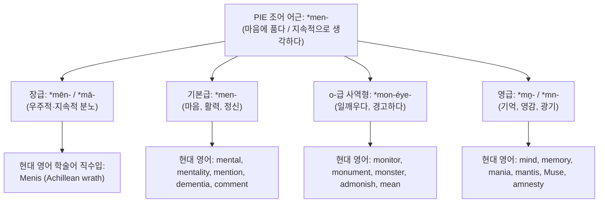
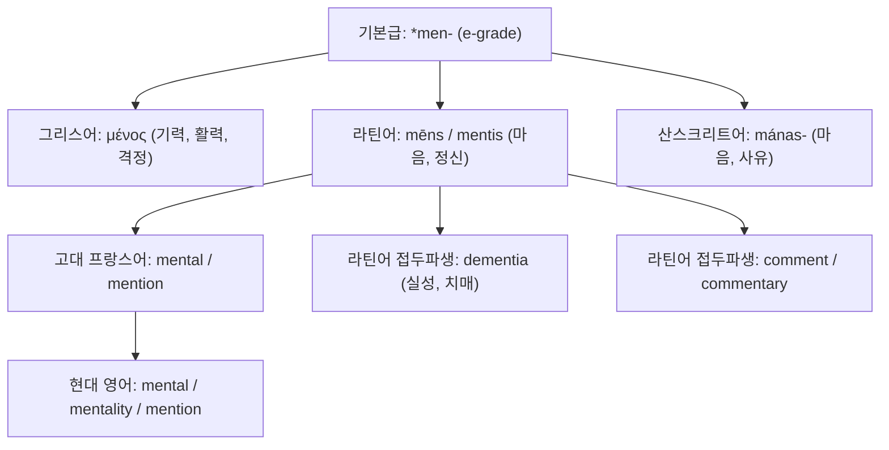
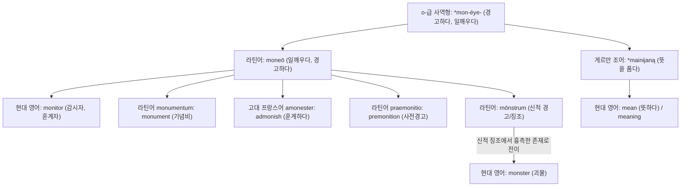
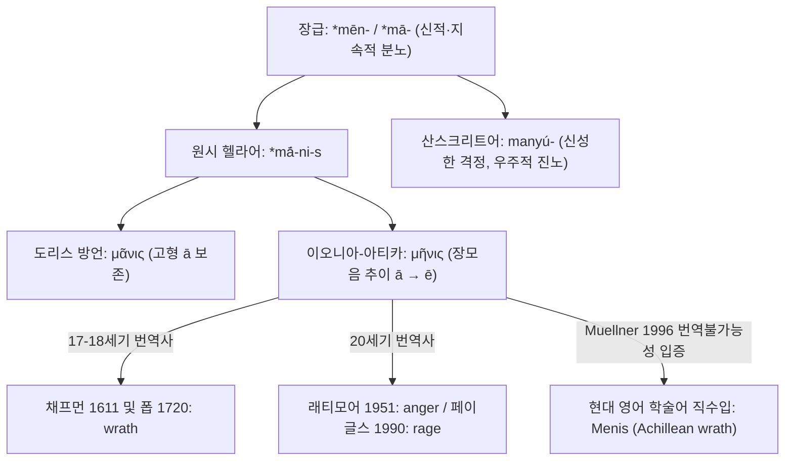
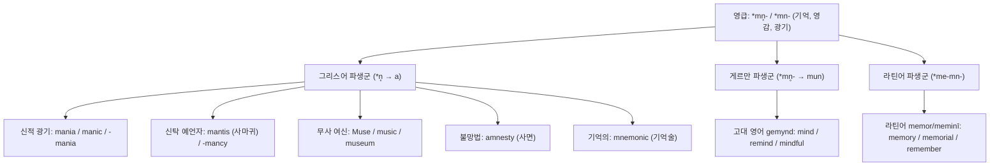

# Menis (메니스)

**[[greek-reading-guide|읽는 법]]**: 메니스 · **원어**: μῆνις · **학술 전사**: *mē̂nis*

> **요약**: 고대 그리스어 μῆνις(우주적 질서 침해에 대한 신적 분노)는 인도유럽조어 *men-(마음에 품다, 사유하다)의 장급 어형에서 유래하여, 현대 영어에서 서양고전학 및 문학비평의 전문 학식 차용어(Menis)이자 아킬레우스의 분노(Achillean wrath)를 지칭하는 특수 개념어로 수용되었으며, 동일 어근에서 파생된 mind, mean, mental, monitor, monument, monster, mania, mantis, Muse, amnesty 등의 방대한 영단어 패밀리를 형성합니다.

---

## 1. 어원 전파 총괄 계통도 (Etymological Transmission Overview)

---

## 2. 인구어(PIE) 및 희랍어 원어근 분석 (PIE & Proto-Greek Morphology)

고대 그리스어 **메니스**(μῆνις, *mē̂nis*)는 인도유럽조어(PIE) 어근 `*men-`("마음에 품다, 지속적으로 생각하다, 정신적 격정이 솟구치다")에서 유래한 고졸기 종교·우주론적 전문 명사입니다 (Pokorny 1959: 726–728, LIV²: 435–437).

### 2.1 비교언어학적 음운 변화와 4대 모음 교체 (Ablaut) 체계

어근 `*men-`은 인도유럽어족의 음운론적 환경과 형태론적 기능에 따라 네 가지 모음 교체 층위로 분화되었습니다:

#### 1. 기본급 (Full-grade / e-grade, `*men-`)
- **그리스어**: 중성 s-어간 명사 **μένος**(*ménos*, 기력, 활력, 투지, 맹렬한 기세). 전사의 신체와 가슴에 깃드는 능동적 에너지를 뜻합니다.
- **라틴어**: 여성 명사 **mēns**(속격 *mentis*, 마음, 정신, 지성). 현대 영어 *mental*, *mention*의 어원입니다.
- **베다 산스크리트어**: 중성 명사 **mánas-**(마음, 사유, 정신). 제의와 찬가를 구성하는 신성한 지성을 지칭합니다.

#### 2. o-급 사역·반복형 (o-grade / Causative-Iterative, `*mon-éye-`)
- **라틴어 동사 moneō** (*moneō, monēre, monuī, monitum*): "생각나게 하다, 일깨우다, 경고하다, 훈계하다" (< PIE `*mon-éye-ti`). 마음속에 경각심을 능동적으로 환기시키는 사역적 행위입니다.
  - 현대 영어 **monitor**(감시자, 훈계자), **monument**(기억을 일깨우는 기념비), **admonish**(훈계하다), **premonition**(사전 경고)의 모태가 되었습니다.
  - 특히 신이 인간에게 내린 경고의 징조인 **mōnstrum**을 거쳐 현대 영어 **monster**(괴물)로 발전했습니다 (de Vaan 2008: 387).
- **게르만 조어 `*mainijaną`**: 마음에 뜻을 품고 외부로 표명하다 (> 고대 영어 *mænan* > 현대 영어 **mean**, 의도하다/뜻하다).

#### 3. 장급 (Lengthened-grade, `*mēn-` / `*mā-`)
- 원시 헬라어 단계에서 장모음 어간에 추상·행위 명사 접미사 `*-i-`가 결합하여 `*mā́-ni-s`가 형성되었습니다 (Beekes 2010: 947, Chantraine 1968: 699).
  - **도리스 방언**: 고형 장모음 `*ā`를 보존하여 **μᾶνις**(*mā̂nis*)로 잔존.
  - **이오니아-아티카 방언**: 규칙적인 장모음 추이(`*ā > η`)를 거쳐 호메로스 서사시의 표준 어형인 **μῆνις**(*mē̂nis*) 성립.
  - **의미론적 특성**: 단순한 일시적 흥분이 아니라, 마음에 깊이 새겨져 우주적 균형이 회복될 때까지 사그라지지 않고 응축되는 "지속적이고 영속적인 신적 분노"를 표상합니다.
- **인도-이란어파 동계어**: 베다 산스크리트어 **manyú-**(신성한 격정, 우주적 진노). 『리그베다』에서 인드라와 루드라 신이 코스모스를 침해한 적들을 파멸시킬 때 발동하는 초월적 분노로, 호메로스의 μῆνις와 완벽한 신화·어원적 일치를 이룹니다 (Watkins 1977, Muellner 1996).
- *[학술적 이설]*: 라틴어 **mānēs**(지하의 망령, 조상신)를 `*men-`의 장급으로 보는 견해가 과거에 제기되었으나, 최신 비교언어학에서는 "선한 자들"을 뜻하는 고대 라틴어 형용사 *mānus*의 완곡어법적 파생(`*mā-ni-`)으로 보는 견해가 우세하여 이설로 분류됩니다 (de Vaan 2008: 363).

#### 4. 영급 (Zero-grade, `*mn̥-` / `*mn-`)
- 모음이 탈락하고 비음 음절주음 `*n̥`가 각 언어의 음운 법칙에 따라 실현된 형태입니다:
  - **그리스어 (`*n̥ > a`)**: 접미사 `*-ti-`가 결합한 `*mn̥-ti-s` → **μάντις**(*mántis*, 영감을 받아 진실을 투시하는 예언자); `*mn̥-y-h₂` → **μανία**(*manía*, 신적 광기, 격정); `*Mont-ya` → **Μοῦσα**(*Moûsa*, 무사 여신); `*n̥-mnā-ti-` → **ἀμνηστία**(*amnēstía*, 망각, 사면).
  - **게르만 조어 (`*mn̥- > -mun-`)**: 접두사 `*ga-` + 영급 `*mn̥-ti-` → 게르만 조어 **`*gamundiz`** → 고대 영어 **gemynd** → 현대 영어 **mind** (Kroonen 2013: 167).
  - **라틴어 (`*me-mn-`)**: 중복 완료 어간 `*me-mn-` → **meminī**(기억하다), **memor**(기억하는 > 영어 *memory*, *remember*); 영급 접두파생 **comminīscor**(마음속으로 고안하다 > *commentum* > 영어 *comment*).

### 2.2 고대 그리스어 형태론 및 곡용 분석표

| 그리스어 실제형 | 학술 전사 | 표제형·형태론 | 한국어 풀이 | 근거 |
|:---|:---|:---|:---|:---|
| **μῆνις** | *mē̂nis* | 명사, 여성 주격 단수 | 신적 분노, 우주적 제재 장치 | _Il._ 1.75, 15.122; LSJ |
| **μῆνιν** | *mē̂nin* | 명사, 여성 대격 단수 | 신적 분노를 (서사시 제1목적어) | _Il._ 1.1 |
| **μήνιος** | *mḗnios* | 명사, 여성 속격 단수 | 신적 분노의 (i-어간 속격) | _Il._ 5.444, 16.711 |
| **μήνιδι** | *mḗnidi* | 명사, 여성 여격 단수 | 신적 분노로 (치음 -ιδ- 굴절) | _Il._ 13.460 |
| **μηνίω** | *mēníō* | 동사, 현재 능동 직설 1인칭 단수 | 신적 분노를 지속적으로 품다 | Chantraine DELG 699 |
| **μηνίων** | *mēníōn* | 동사, 현재 능동 분사 남성 주격 단수 | 분노를 품고 진영에 머무는 | _Il._ 1.488, 9.426, 15.72 |
| **ἐμήνιε** | *emḗnie* | 동사, 미완료 능동 직설 3인칭 단수 | 분노를 삭이지 않고 지속하고 있었다 | _Il._ 2.769 |
| **μηνίσῃ** | *mēnísēi* | 동사, 아오리스트 능동 가정 3인칭 단수 | 신적 분노에 휩싸이게 되다 | _Il._ 16.32 |
| **ἀπομηνίσας** | *apomēnísas* | 동사, 접두사 결합 분사 남성 주격 단수 | 분노를 끝까지 고집하며 완고해진 | _Il._ 2.772 |
| **ἀποειπὼν μῆνιν** | *apoeipṑn mē̂nin* | 분사 + 명사 대격 (정형구) | 분노의 종결을 공식 선언하고 | _Il._ 19.35, 19.75 |

---

## 3. 호메로스 서사시 문헌학 및 코퍼스 계량 분석 (Homeric Philology & Corpus Linguistics)

> [!NOTE] 서사적·신학적 분석 위임 안내
> 메니스(Menis)의 종교·신학적 본질(우주적 질서 수호 및 신성 제재 장치), 아가멤논과 아킬레우스 간의 제도적 충돌(바실레이아 대 아레테), 서사시 3단계 전개 궤적 및 비극적 연민(Eleos)으로의 승화에 관한 종합적 인문학·윤리학 분석은 개념 문서 메니스(Menis)에 전면 위임되어 있습니다. 본 단어 사전에서는 다크틸로스 6보격 운율 상의 특권적 위치, 서사시 코퍼스 내 계량언어학적 분포, 그리고 400년에 걸친 영미권 번역사의 낱말 선택 딜레마를 집중 분석합니다.

- **심화 개념 문서 연계 안내**:
  - 종교신학적 정의 및 제재 메커니즘: [[concept-menis#1-정의와-핵심-테제-definition--core-thesis|메니스: 1. 정의와 핵심 테제]]
  - 분노 3대 어휘의 존재론적 위계 비교: [[concept-menis#23-분노의-어휘-체계-menis-vs-cholos-vs-kotos|메니스: 2.3 분노의 어휘 체계]]
  - 서사시 3단계 전개 궤적 및 연민 승화: [[concept-menis#4-개념-상호작용과-가치망-conceptual-network--polarity|메니스: 4. 개념 상호작용과 가치망]]
  - 기성 전사 윤리와 제도사적 충돌: [[concept-menis#6-역사적제도적-맥락-historical--institutional-context|메니스: 6. 역사적·제도적 맥락]]

### 3.1 다크틸로스 6보격 운율과 통사론적 배치 (Metrical & Syntactic Architecture)

호메로스 서사시 전통에서 **메니스**(μῆνις)는 단순한 어휘적 선택을 넘어, 다크틸로스 6보격(Dactylic Hexameter)의 운율 구조와 통사적 결합을 통해 서사시 전체의 주제의식을 압도적으로 선포하는 음운·시학적 장치입니다.

#### 1. 서시 제1음보 행두 배치와 대격 목적어 (_Il._ 1.1–2)

- **번역**: "노래하소서, 여신이여! 펠레우스의 아들 아킬레우스의 파멸적인 분노를, / 아카이아인들에게 헤아릴 수 없이 수많은 고통을 안겨주었으며,"
- **원문**: *Μῆνιν ἄειδε θεὰ Πηληϊάδεω Ἀχιλῆος / οὐλομένην, ἣ μυρί’ Ἀχαιοῖς ἄλγε’ ἔθηκε,*
- **학술 전사**: *Mē̂nin áeide theà Pēlēïádeō Akhilē̂os / ouloménēn, hḕ murí’ Akhaioîs álge’ éthēke,*
- **[주석]**:
  - **행두(Verse-initial) 절대 배치**: 서사시 1만 5,693행의 제1행 첫 단어로 대격 명사 **메닌**(Μῆνιν)이 등장합니다. 그리스 서사시 전통(『오뒷세이아』의 *Ἄνδρα*, 헤시오도스 『신통기』의 *Μουσάων*)에서 제1행의 첫 낱말은 작품 전체의 존재 이유이자 통사적 목적어를 선언합니다.
  - **운율적 충격과 강세**: 제1각(Foot 1)은 장-단-단 다크틸로스(*Mē̂-nin ă-*)로 시작하며, 첫 음절 장모음 `Μη-`에 곡절 악센트(Circumflex)와 운율적 악센트(Ictus)가 중첩되어 청중의 청각을 단숨에 사로잡는 강력한 음운적 타격을 형성합니다.
  - **강한 행간걸침(Run-over Enjambment)**: 수식 분사인 **울로메넨**(οὐλομένην, *ouloménēn*, '파멸적인')은 1행에 배치되지 않고 운율적 경계를 넘어 제2행 첫머리로 밀려납니다. 이 행간걸침은 분노의 파괴적 결과가 통사적 경계를 파열시키며 쏟아져 나오는 시적 긴장을 물리적으로 체현합니다 (Bakker 1997, Kirk 1985).

#### 2. 진영 내 고립의 지속상과 분사 결합 정형구 (_Il._ 1.488, 19.34–35)

- **번역**: "하지만 그대는 아카이아인 영웅들을 민회로 불러 모아, / 군대의 목자 아가멤논을 향해 분노의 종결을 선언하시오."
- **원문**: *ἀλλὰ σύ γ’ εἰς ἀγορὴν καλέσας ἥρωας Ἀχαιούς, / μῆνιν ἀποειπὼν Ἀγαμέμνονι ποιμένι λαῶν*
- **학술 전사**: *allà sú g’ eis agorḕn kalésas hḗrōas Akhaioús, / mē̂nin apoeipṑn Agamémnoni poiméni laō̂n*
- **[주석]**:
  - **동사 및 분사 지속상**: 아킬레우스의 분노 상태를 기술할 때 호메로스는 현재 분사 **메니온**(μηνίων, _Il._ 1.488)과 복합 분사 **아포메니사스**(ἀ포μηνίσας, _Il._ 2.772)를 사용하여, 분노가 일시적 감정 분출이 아니라 진영에 머물며 장기간 고착된 존재론적 거부 상태임을 문법적 상(Aspect)으로 구현합니다.
  - **공식 종결 정형구**: 19권 35행 및 75행의 **메닌 아포에이폰**(μῆνιν ἀποειπών, *mē̂nin apoeipṓn*)은 6보격의 여성 휴지(Feminine Caesura, 제3보격 트로카이오스 분절) 직전에 정확히 걸치며, 공식적인 분노 해제를 선언하는 법적·제의적 정형구로 기능합니다.

### 3.2 호메로스 코퍼스 계량언어학 분석 (Corpus Frequency & Distribution)

호메로스 서사시 및 초기 서사시 코퍼스 전체에서 **메니스**(μῆνις) 어근의 출현 양상은 극단적인 어휘적 희소성과 신성 전유성을 보여줍니다.

#### 1. 작품별 전수 출현 빈도 및 텍스트 분포

| 서사 텍스트 코퍼스 | 명사형 출현 | 동사형 출현 | 총계 | 텍스트 내 주요 주체 및 특징 |
|:---|:---:|:---:|:---:|:---|
| 『**일리아스**』 **(Iliad)** | 15회 | 7회 | **22회** | **신격**(아폴론, 제우스) 10회, **아킬레우스** 11회, 아이네이아스(동사) 1회 |
| 『**오뒷세이아**』 **(Odyssey)** | 5회 | 1회 | **6회** | **신격 전유**(아테네, 제우스, 사후 영혼의 복수 경고); 오디세우스에게 부여 전무 |
| 『**호메로스 찬가**』 **(Homeric Hymns)** | 5회 | 1회 | **6회** | **신격 전유**(데메테르의 분노 _h.Cer._ 350, 410, 헤라의 진노 _h.Ap._ 307) |
| **초기 서사시 코퍼스 총계** | **25회** | **9회** | **34회** | 일상 회화체가 배제된 고도의 **신성 전문어**(Hieratic Vocabulary) |

#### 2. 문법적 격(Case) 및 통사론적 기능 분포

| 문법적 격·형태 | 출현 횟수 | 비율 (%) | 주요 문법 기능 및 시학적 용법 |
|:---|:---:|:---:|:---|
| **단수 대격** (μῆνιν) | 11회 | 44.0% | 서사시 전체의 제1목적어 선언(_Il._ 1.1), 신적 보복의 직접 대상, 분노 종결의 목적어 |
| **단수 속격** (μήνιος) | 5회 | 20.0% | 신적 분노의 기원 규정, 파멸적 회피 경고 문맥(_Il._ 5.444, 16.711) |
| **단수 주격** (μῆνις) | 4회 | 16.0% | 신의 질서 수호 의지 본질 선언(_Il._ 15.122), 우주적 제재의 주어 |
| **단수 여격** (μήνιδι) | 2회 | 8.0% | 치음 어간(-ιδ-) 확장형; 억눌린 분노의 수단 및 내적 상태(_Il._ 13.460) |
| **복합·동사 파생형** | 3회 | 12.0% | 분노의 서사적 완결 선언 및 정형구적 결합 |

#### 3. 호메로스 분노 3대 어휘군 코퍼스 빈도 비교

- **콜로스 (χόλος, *khólos*)**: 『일리아스』에서만 60회 이상, 코퍼스 전체 80회 이상 출현. 인간과 신 모두에게 보편적으로 발생하는 생리적·급성 울분.
- **코토스 (κότος, *kótos*)**: 코퍼스 전체 5회 미만 출현. 군주가 내면에 삼켜 숨겨둔 잠복적 원한.
- **메니스 (μῆνις, *mē̂nis*)**: 코퍼스 전체 25회(동사 포함 34회)로 엄격히 제한. 물질적 보상으로 풀리지 않는 우주 질서 파괴에 대한 초개인적 신성 제재.
- **상세 서사·윤리학적 비교**: 세 어휘의 존재론적 위계, 신체적 기원 좌소 및 서사적 완결 방식의 정밀 대조는 [[concept-menis#23-분노의-어휘-체계-menis-vs-cholos-vs-kotos|메니스: 2.3 분노의 어휘 체계]]를 참조하십시오.

---

### 3.3 영미권 번역사 및 번역학적 딜레마 (English Translation History & The Dilemma of *Menis*)

『일리아스』 제1행의 첫 단어 **메닌**(Μῆνιν)을 영어로 번역하는 문제는 17세기 이래 서양 고전학과 문학 번역사에서 가장 치열한 신학적·문체론적 논쟁거리였습니다. '신성 제재 장치'라는 그리스 원어의 복합적 무게감을 단일 영단어로 포착할 수 있는가에 대한 4대 번역 전략이 대립해 왔습니다.

| 번역어 (Term) | 대표 번역가 및 연도 | 시학적 운율 및 문체 | 번역학적 성취와 텍스트 효과 | 내재적 한계 및 비판적 결함 |
|:---|:---|:---|:---|:---|
| **Wrath** | George Chapman (1611) Alexander Pope (1720) Caroline Alexander (2015) Emily Wilson (2023) | 14음절 운문(Chapman) 영웅대구(Pope) 약강 5보격(Wilson) | 구약성서적 '신의 진노(God's wrath)'를 연상시키는 초월적 장엄함 부여. 아킬레우스의 분노가 지닌 우주적 파괴력 보존. | 현대 영어 독자에게 고졸하고 둔중한 어감(Archaism)을 줌. 원문의 통사적 첫머리 배치가 종종 붕괴됨. |
| **Rage** | Robert Fagles (1990) Stanley Lombardo (1997) Stephen Mitchell (2011) Barry B. Powell (2014) | 자유 강약격 운문(Fagles) 구어체 파격(Lombardo) | 첫 단어 행두 배치("Rage — Sing, Goddess")를 복원하여 원초적 에너지와 폭발적인 정서적 타격을 전달. | 생리적 혈기인 *cholos*나 맹목적 광기(*frenzy*)로 격하되어, '우주 질서 수호 메커니즘'이라는 신성성이 탈색됨. |
| **Anger** | E. V. Rieu (1950) Richmond Lattimore (1951) Robert Fitzgerald (1974) | 산문체(Rieu) 6보격 자유시(Lattimore) | 호메로스 텍스트의 투명성과 현대적 가독성 확보. 원문의 행 대 행(line-for-line) 대응 유지. | 평범하고 세속적인 일상 감정으로 환원됨. 아카이아 군단을 파멸로 몰고 간 신적 제재의 무게감이 거세됨. |
| **Menis / Mênis** (음역 직수입) | Gregory Nagy (1979) Leonard Muellner (1996) Peter Green (2015) | 학술 번역 및 주해본 | 번역 불가능한 고유 종교·우주론 개념어로 규정하여 원전의 어원적 순수성과 학술적 엄밀성을 100% 보존. | 일반 독자의 접근성을 저해하고 전문 학술 텍스트로 고립될 위험. |

#### 번역사적 쟁점의 종합 테제

- **포프(Pope)의 고전적 장엄성 대 패글스(Fagles)의 감각적 분출**:
  - 알렉산더 포프는 1720년 번역에서 "Achilles' wrath, to Greece the direful spring / Of woes unnumber'd, heavenly goddess, sing!"으로 옮겨 18세기 신고전주의적 숭고미를 극대화했으나, 그리스어 원문의 제1단어 배치(Verse-initial)를 지키지 못했습니다.
  - 반면 로버트 패글스는 1990년 "Rage — Goddess, sing the rage of Peleus' son Achilles"로 시작하여 첫 단어 충격을 복원했으나, 뮐너(Muellner 1996)가 지적했듯 분노의 '신성 제재적 성격'을 개인의 심리적 격정으로 축소시켰다는 구조적 한계를 안게 되었습니다.
- **에밀리 윌슨(Emily Wilson 2023)의 절충적 복귀**:
  - 가장 최근의 기념비적 번역인 에밀리 윌슨은 약강 5보격(Iambic Pentameter)의 리듬 속에서 "Goddess, sing of the cataclysmic wrath / of Peleus' son Achilles"를 선택했습니다. 형용사 *cataclysmic*(파멸적인, 격변의)을 *wrath*와 결합함으로써, *rage*의 피상성을 극복하고 2행의 *ouloménēn*이 지닌 우주적 파괴력을 현대 영어 운율 안에서 성공적으로 재현했습니다.
- **비교문헌학의 음역 채택 (Nagy 1979, Muellner 1996)**:
  - 서양고전학계에서는 *wrath*, *rage*, *anger* 그 어떤 현대 영단어도 그리스어 *mē̂nis*가 담지한 '금기 침해에 대한 우주적 복원력'을 온전히 담아낼 수 없다고 결론짓고, 학술 문헌에서 **Menis**를 번역하지 않는 전문 용어로 직수입하여 정착시켰습니다.

---

## 4. 역사적 전파 및 수용사 경로 (Historical Transmission & Reception)

### 4.1 고대 지중해와 헬레니즘기
- 고졸기 및 고전기 그리스에서 μῆνις는 서사시 전통의 엄격한 운율과 제의적 맥락에 묶여 있었으며, 일상 회화체에서는 거의 사용되지 않는 신성어(Hieratic vocabulary)로 유지되었습니다.
- 헤시오도스와 서정시인들, 아티카 비극 시인들은 신들의 침해할 수 없는 권능과 신벌을 묘사할 때 서사시적 전통을 계승하여 이 어휘를 차용했습니다.

### 4.2 근현대 서양고전학을 통한 직접 학식 차용 (Learned Borrowing)
- 현대 영어에서 **Menis**는 라틴어나 중세 프랑스어 구어를 경유하지 않고, 19~20세기 서양고전학, 비교신화학 및 문학비평의 전문 학술 용어로 원형 그대로 직수입되었습니다.
- **레너드 뮐너 (Leonard Muellner 1996, *The Anger of Achilles: Mênis in Greek Epic*)**:
  - 호메로스 서사시 코퍼스 전체를 전수 조사하여, *menis*가 사적 분노가 아닌 인도유럽어족 공통의 '신성한 우주 제재 장치'임을 비교언어학적으로 완벽히 입증했습니다.
- **그레고리 나기 (Gregory Nagy 1979, *The Best of the Achaeans*)**:
  - 아킬레우스의 *menis*가 아카이아 군단에 비탄(*akhos*)을 초래하고 궁극적으로 영웅의 시들지 않는 영예([[concept-kleos|클레오스]])를 완성하는 핵심 제의적 동인임을 밝혔습니다.

### 4.3 동일 PIE 어근(`*men-`) 파생 어휘군의 3대 수용 경로
호메로스의 *menis* 자체는 학술 차용어로 정착한 반면, 그 기저 어근인 PIE `*men-`은 서구 언어사에서 세 갈래의 거대한 경로를 통해 현대 영어 어휘의 근간을 형성했습니다:
1. **그리스어 직수입 및 학술어**: μανία → *mania*, μάντις → *mantis*, Μοῦσα → *music* / *museum*, μνημονικός → *mnemonic*, ἀμνηστία → *amnesty*.
2. **라틴-노르만 프랑스어 경유어**: *mēns* → *mental*, *moneō* → *monitor* / *monument* / *monster* / *admonish*, *memor* → *memory* / *remember*.
3. **고유 게르만 동계어**: 게르만 조어 `*gamundiz` → 고대 영어 *gemynd* → 현대 영어 **mind**; 고대 영어 *mænan* → 현대 영어 **mean**.

---

## 5. 음운 및 의미 변화사 (Phonological & Semantic Evolution)

### 5.1 음운 및 철자 변천 단계

- **PIE 조어**: `*men-` (어근) → 장급 명사형 `*mān-i-s` 또는 `*mēn-i-s`
- **고대 도리스 방언**: **μᾶνις** (*mā̂nis*, /maː.nis/, 장모음 ā 보존)
- **고대 이오니아-아티카 방언**: **μῆνις** (*mē̂nis*, /mɛː.nis/, 모음 추이 ā > η 및 전치 억양 악센트)
- **현대 고전학 학술 영어**: **Menis** / **Mênis** (/ˈmeɪ.nɪs/ 또는 /ˈmiː.nɪs/)

### 5.2 역사적 의미 전이 메커니즘 (Semantic Shifts)

1. **원초적 인지 의미 (PIE `*men-`)**:
   - '어떤 생각이나 기억을 마음에 지속적으로 간직하다', '정신적 에너지를 한곳에 응축하다'.
2. **신학적·종교적 특수화 (고졸기 그리스어)**:
   - 우주적 질서([[concept-themis|테미스]])와 신성한 경계가 유린당했을 때, 그 질서가 회복될 때까지 사그라지지 않고 응축되어 지속되는 **초개인적 신벌과 보복 의지**로 의미가 집중되었습니다.
3. **서사시적 영웅화 (호메로스 『일리아스』)**:
   - 본래 신들에게만 국한되던 우주적 제재 장치가 인간 영웅 아킬레우스에게 전이됨으로써, 기성 군주정의 부당한 질서(아가멤논의 전횡)에 맞서는 실존적이고 절대적인 저항의 표상이 되었습니다.
4. **근현대 학술 및 문학적 개념화**:
   - 현대 비평 이론에서 타협할 수 없는 궁극적 원칙에 대한 고집, 실존적 분노와 영웅적 고립을 나타내는 문학적 상징어로 정착했습니다.

---

## 6. 현대 영어 파생어군 및 3대 어휘 패밀리 (Modern English Cognates & Derivatives)

동일한 인도유럽조어 어근 `*men-`에서 분기한 현대 영어 어휘군은 전파 경로에 따라 **게르만 고유 동계어**, **라틴-불어 경유어**, **그리스계 학술 차용어**의 3대 거대 패밀리를 형성하며, 인간의 인지, 감정, 종교, 사회 제도의 전 영역을 관통합니다.

### 6.1 게르만 고유 직계 어휘군 (Germanic Native Cognates)

- **mind** (명사: 정신, 마음, 기억):
  - 어원: 고대 영어 *gemynd* < 게르만 조어 `*gamundiz` < PIE 영급 `*mn̥-ti-s` (c. 900 OED).
  - 문화의미론: 본래 '기억(memory)'과 '마음에 둔 생각(thought)'을 뜻했으나, 14세기를 거치며 라틴어 *animus*와 *mēns*를 포괄하는 광범위한 인간의 '사유 및 의식 능력' 전체를 가리키는 고유어로 확립되었습니다.
- **mean** (동사: 의미하다, 의도하다):
  - 어원: 고대 영어 *mænan* < 게르만 조어 `*mainijaną` < PIE o-급 `*mon-` (c. 900 OED).
  - 문화의미론: 어떤 생각이나 의도를 마음속에 품고(*men-*) 이를 타인에게 언어나 표상으로 전달하려 함을 뜻합니다.
- **remind** (동사: 상기시키다, 일깨우다):
  - 접두사 *re-*(다시) + *mind*(마음). 망각의 심연으로 가라앉은 생각을 다시 의식의 표면으로 끌어올리는 행위입니다 (1658 OED).
- **mindful** (형용사: 주의 깊은, 염두에 두는):
  - 고대 영어 *gemyndful*. 현대에는 고대 불교 심리학의 '사티(sati)'를 번역하는 학술·명상 용어로 채택되어 '마음챙김(mindfulness)'이라는 현대 인지과학의 핵심 개념으로 재탄생했습니다.

### 6.2 라틴-노르만 프랑스어 경유 어휘군 (Latin-French Transmissions)

- **mental** (정신의, 마음의) / **mentality** (사고방식, 심성):
  - 후기 라틴어 *mentālis* < 고전 라틴어 *mēns*(속격 *mentis*, 마음) (c. 1425 OED).
- **mention** (명사/동사: 언급하다, 거론하다):
  - 라틴어 *mentiō*(마음에 떠올려 말함, 기억의 환기) < `*men-ti-` (c. 1380 OED).
- **comment** (논평, 주석) / **commentary** (해설서):
  - 라틴어 *commentum*(마음속으로 깊이 생각하여 창안한 것, 해석) < 동사 *comminīscor* (*com-* 완전히 + *men-* 마음에 두다) (c. 1400 OED).
- **dementia** (치매, 실성):
  - 라틴어 *dēmentia* < *dēmēns* (*de-* 벗어나다 + *mēns* 정신). 이성과 제정신의 궤도를 이탈한 병리적 인지 결손을 가리킵니다 (1806 OED).
- **admonish** (훈계하다, 타이르다) / **admonition** (권고, 경고):
  - 라틴어 *admoneō* (*ad-* 향하여 + *moneō* 일깨우다) > 고대 프랑스어 *amonester* (c. 1330 OED).
- **monitor** (감시자, 조언자, 모니터):
  - 라틴어 *monitor*(마음에 주의를 환기시키는 자, 경고자) < *moneō* (1546 OED).
- **monument** (기념비, 기념물):
  - 라틴어 *monumentum*(과거의 위업이나 역사적 교훈을 영원히 기억하도록 상기시키는 석조 건축물) (c. 1300 OED).
- **monster (괴물, 기형적 존재) — 심층 문화의미론적 전이**:
  - 어원: 라틴어 **mōnstrum** < *moneō*(일깨우다, 경고하다) + 도구 접미사 `*-trom` (c. 1300 OED).
  - **의미 전이 메커니즘 (Portent → Creature)**:
    1. *고대 로마 종교*: *mōnstrum*은 신들이 인간의 불경이나 우주적 질서의 교란을 경고하기 위해 하늘이나 자연계에 보낸 **초자연적 징조, 불길한 전조**(divine portent, prodigy)를 의미했습니다.
    2. *기독교 및 중세 수용*: 신의 노여움을 경고하는 비정상적인 탄생(기형아, 머리가 둘 달린 동물)이나 전설 속의 흉측한 생명체 자체가 *monstrum*이라 불리게 되면서, 추상적 '신적 경고'에서 구체적인 '흉악한 괴물'로 의미가 물질화·악마화(Pejoration & Concretization)되었습니다.
- **premonition** (예감, 사전 경고):
  - 후기 라틴어 *praemonitiō* (*prae-* 미리 + *moneō* 경고하다) (1579 OED).
- **memory** (기억) / **memorial** (기념의) / **remember** (기억하다):
  - 라틴어 *memor*(마음에 품고 있는) → *memoria* → 앵글로-노르만어 *memorie* / 고대 프랑스어 *remembrer* (c. 1330 OED).

### 6.3 그리스계 직수입 및 학술 어휘군 (Greek Learned Borrowings)

- **mania** (광기, 열광) / **manic** (조증의):
  - 그리스어 **μανία**(*manía*, 격정, 신적 영감에 의한 열광) < PIE 영급 `*mn̥-y-h₂` (c. 1400 OED).
  - 문화의미론: 플라톤 『파이드로스』에서 단순한 정신병(질병적 광기)과 구별되는 '신이 내린 4대 거룩한 광기(예언적, 제의적, 시적, 에로스적 광기)'로 상찬되었으며, 근대 정신의학에서 '조증(mania)'으로 임상화되었습니다.
- **mantis (사마귀) 및 -mancy (점술) — 신탁 예언자에서 곤충으로의 전이**:
  - 어원: 그리스어 **μάντις**(*mántis*, 신탁 예언자, 영매) < PIE 영급 `*mn̥-ti-s` (마음이 영적 격정으로 고양된 자).
  - 문화의미론: 델포이나 올림피아에서 신의 영감을 받아 미래를 투시하던 사제를 가리켰으나, 17세기 근대 박물학자(Thomas Browne 1658)들이 앞다리를 경건하게 모으고 먹이를 기다리는 사마귀의 독특한 자세가 '신에게 기도하는 예언자'를 연상시킨다 하여 곤충의 학명(**Mantis religiosa**)으로 차용했습니다.
  - 접미사 **-mancy**: 그리스어 *-manteía*(점술 기예)에서 유래하여 *necromancy*(강령술), *pyromancy*(화염점), *geomancy*(풍수점) 등의 전문어를 형성했습니다.
- **Muse (무사 여신) / music (음악) / museum (박물관)**:
  - 어원: 그리스어 **Μοῦσα**(*Moûsa* < `*Mont-ya`, 기억을 일깨우는 신적 존재).
  - 문화의미론: 호메로스 서사시에서 기억의 여신 므네모시네(Mnemosyne)의 딸이자 시인에게 노래를 불어넣는 무사 여신은, '무사의 예술'을 뜻하는 **μουσική**(*mousikḗ* > *music*)와 '무사의 신전이자 학예의 전당'을 뜻하는 **μουσεῖον**(*mouseîon* > *museum*)의 어원이 되었습니다.
- **mnemonic** (기억을 돕는, 연상 기호):
  - 그리스어 **μνημονικός**(*mnēmonikós* < μνήμων *mnḗmōn*, 기억력이 좋은) (1753 OED).
- **amnesty (사면, 대사령) — 아테네 민주정의 역사적** ‘**불망법**’:
  - 어원: 그리스어 **ἀμνηστία**(*amnēstía* < `ἀ-` 부정 접두사 + `μνῆστις` *mnē̂stis* 기억 = '기억의 부재, 망각') (1580 OED).
  - 문화의미론: 기원전 403년 펠로폰네소스 전쟁 직후, 30인 참주정을 몰아낸 아테네 민주파 지도자들은 내전의 피비린내 나는 보복 순환을 끊기 위해 "과거의 불의를 기억하지 않는다(**μὴ μνησικακεῖν**)"는 국가적 맹세를 선포했습니다 (Aristotle, *Ath. Pol.* 39). 이 역사적 조약에서 '과거의 정치적 과오를 공식적으로 잊어버리는 사면(amnesty)'의 법제사적 개념이 탄생했습니다.
- **Menis (메니스)**:
  - 19~20세기 서양고전학 및 문학비평에서 호메로스 서사시의 절대적 주제이자 우주적 질서 제재 장치인 아킬레우스의 분노를 지칭하는 전문 학술어로 직수입되었습니다.

### 6.4 현대 영어 어휘 요약표

| 품사 분류 | 단어 (Word) | 어원 계통 및 의미 | 최초 기록 (OED) | 확실성 등급 |
|:---|:---|:---|:---|:---|
| **학식 명사** | **Menis** / **Mênis** | 그리스어 장급 μῆνις (호메로스적 신적 분노, 아킬레우스의 진노) | 19세기 고전학 문헌 | 정설/문헌 입증 |
| **명사 (Noun)** | **mind** | 게르만 조어 `*gamundiz` < 영급 `*mn̥-ti-s` (정신, 기억, 지성) | c. 900 | 정설/문헌 입증 |
| **명사 (Noun)** | **mania** | 그리스어 영급 μανία (신적 광기, 열광) → 라틴어 경유 | c. 1400 | 정설/문헌 입증 |
| **명사 (Noun)** | **mantis** | 그리스어 영급 μάντις (신탁 예언자 → 기도하는 사마귀) | 1658 | 정설/문헌 입증 |
| **명사 (Noun)** | **memory** | 라틴어 중복완료 *memoria* (기억) → 앵글로-노르만어 경유 | c. 1330 | 정설/문헌 입증 |
| **명사 (Noun)** | **monster** | 라틴어 *mōnstrum* (신적 경고/징조) → 괴물로 의미 전이 | c. 1300 | 정설/문헌 입증 |
| **명사 (Noun)** | **monitor** | 라틴어 o-급 사역 *moneō* (일깨우다, 경고하다)에서 유래한 감시자 | 1546 | 정설/문헌 입증 |
| **명사 (Noun)** | **monument** | 라틴어 *monumentum* (기억을 일깨우는 기념비) | c. 1300 | 정설/문헌 입증 |
| **명사 (Noun)** | **amnesty** | 그리스어 ἀ-μνηστία (아테네 403 BC 불망법 → 공식 사면) | 1580 | 정설/문헌 입증 |
| **명사 (Noun)** | **Muse** / **music** | 그리스어 Μοῦ사 (*Mont-ya, 무사 여신 및 학예) | c. 1300 | 정설/문헌 입증 |
| **동사 (Verb)** | **mean** | 게르만 조어 `*mainijaną` < o-급 `*mon-` (의도하다, 뜻을 품다) | c. 900 | 정설/문헌 입증 |
| **동사 (Verb)** | **admonish** | 라틴어 *admoneō* (훈계하다, 타이르다) | c. 1330 | 정설/문헌 입증 |
| **동사 (Verb)** | **remind** | 접두사 *re-* + *mind* (상기시키다) | 1658 | 정설/문헌 입증 |
| **형용사 (Adj.)** | **mental** | 후기 라틴어 *mentālis* (마음의, 정신적인) | c. 1425 | 정설/문헌 입증 |
| **형용사 (Adj.)** | **mnemonic** | 그리스어 μνημονικός (기억을 돕는) | 1753 | 정설/문헌 입증 |
| **형용사 (Adj.)** | **mindful** | 고대 영어 *gemyndful* (주의 깊은, 염두에 두는) | OE | 정설/문헌 입증 |

---

## 7. 인명·신명 파생 고유명사 및 관용표현 (Eponymous Terms & Cultural Idioms)

### 7.1 대표 관용표현과 문학적 모티프

- **Achillean wrath (아킬레우스의 분노)**:
  - 타협 불가능한 절대적 원칙의 고수, 존재론적 모욕에 대한 비타협적 저항, 그리고 공동체 전체의 파멸적 희생을 동반하는 영웅의 고립을 상징하는 영미 문학의 대표적 관용 표현입니다.
- **The wrath of Apollo (아폴론의 진노)**:
  - 인간의 오만과 신성 모독(Sacrilege)에 대해 신들이 내리는 가혹하고 불가항력적인 재앙이나 전염병을 비유하는 고전적 숙어입니다.
- **밀턴 『실낙원』 서시의 호메로스적 변용**:
  - 존 밀턴은 『실낙원』(Paradise Lost, 1667) 제1권 서시("Of Man's First Disobedience... Sing, Heavenly Muse")에서 호메로스 『일리아스』의 메니스 서시 구조를 의도적으로 모방하여, 인간의 원죄와 신의 섭리라는 기독교 구속사 서사시로 승화시켰습니다.

---

## 8. 어원 증거 매트릭스 및 학술 출처 (Evidence Matrix & References)

| 어원 및 수용 명제 | 언어 층위 | 확실성 등급 | 출전 및 학술 문헌 근거 |
|:---|:---|:---|:---|
| **PIE 조어 어근 `*men-` 4대 모음교체 재구** | PIE | 학술적 재구 | Beekes (2010: 947 EDG), Pokorny (1959: 726 IEW), LIV² (435–437) |
| **도리스 μᾶνις 대 이오니아 μῆνις 음운 추이** | 고대 그리스어 | 정설/문헌 입증 | Chantraine (1968: 699 DELG), Frisk (GEW 2: 232) |
| **산스크리트어 *manyú-* 동계 대응 및 신학적 일치** | 인도-이란어 | 정설/문헌 입증 | Watkins (1977), Muellner (1996: 8–12), Rigveda |
| **다크틸로스 6보격 제1음보 행두 배치 및 행간걸침** | 고전문헌학 | 정설/문헌 입증 | Bakker (1997), Kirk (1985), Homer *Il.* 1.1–2 |
| **호메로스 코퍼스 전수 빈도(일리아스 22, 오뒷세이아 6)** | 계량언어학 | 정설/문헌 입증 | TLG(Thesaurus Linguae Graecae), LSJ s.v. μῆνις |
| **영미권 번역사(wrath vs rage vs anger) 딜레마** | 수용사·번역학 | 정설/문헌 입증 | Chapman (1611), Pope (1720), Lattimore (1951), Fagles (1990), Wilson (2023) |
| **라틴어 *mōnstrum*에서 영어 *monster*로의 의미 전이** | 라틴어/고대불어 | 정설/문헌 입증 | de Vaan (2008: 387 EDL), OED Online s.v. *monster* |
| **그리스어 μάντις에서 곤충 *mantis* 및 접미사 *-mancy* 파생** | 고대그리스/영어 | 정설/문헌 입증 | Chantraine DELG 667, OED s.v. *mantis*, Browne (1658) |
| **그리스어 ἀμνηστία(아테네 403 BC 불망법)에서 영어 *amnesty* 정착** | 고대그리스/영어 | 정설/문헌 입증 | LSJ s.v. ἀμνηστία, OED s.v. *amnesty*, Aristotle *Ath. Pol.* 39 |
| **그리스어 Μοῦσα에서 영어 *Muse*, *music*, *museum* 파생** | 고대그리스/영어 | 정설/문헌 입증 | Chantraine DELG 716, Beekes EDG 972, OED s.v. *music* |
| **게르만 조어 `*gamundiz`에서 영어 *mind*, *mindful* 파생** | 게르만어파 | 정설/문헌 입증 | Kroonen (2013: 167 EDPG), OED Online s.v. *mind* |
| **라틴어 *mānēs*의 `*men-` 장급 귀속설** | 고대 라틴어 | 논쟁적/이설 대립 (Contested) | de Vaan (2008: 363, 완곡어법 *mānus* 지지 대 전통적 *men-설 대립) |
| **영어 *menace*(위협)와의 동계설 오인** | PIE / 라틴어 | 민간어원/허구 (Spurious) | OED, Pokorny IEW (PIE `*men-` (2) 돌출하다 기원) |
| **영어 *month* / *moon*과의 동계설 오인** | PIE / 게르만어 | 민간어원/허구 (Spurious) | Beekes, Pokorny IEW (PIE `*meh₁-` 측량하다 기원) |
| **영어 *man*(인간)과의 동계설 오인** | PIE / 게르만어 | 민간어원/허구 (Spurious) | Kroonen EDPG, OED s.v. *man* |

> [!WARNING] 민간 어원(Folk Etymology) 및 가짜 동계어 주의
> - **영어 menace (위협, 협박)와의 무관성**: 영어 menace는 고대 프랑스어 menace, 라틴어 minacia/minor(협박하다, 소를 몰다)에서 유래했으며, 이는 "돌출하다, 솟아나다"를 뜻하는 인도유럽조어 어근 *men- (2)(영어 mount, prominent, eminent의 어근)에서 비롯되었습니다. 이는 "생각하다, 마음에 품다"를 뜻하는 PIE *men- (1) 기원의 그리스어 μῆνις와는 우연한 발음 유사성에 불과한 전형적인 가짜 동계어(False Cognate)입니다.
> - **영어 month / moon (달)과의 무관성**: 그리스어 μήν(달, month)과 영어 month, moon은 시간과 주기를 헤아리는 인도유럽조어 어근 *meh₁-(측량하다, 영어 measure, meter의 어원)에서 파생된 것으로, μῆνις와 어원적 친족 관계가 전혀 없습니다.
> - **영어 man (인간)과의 무관성**: 영어 man(고대 영어 mann, 게르만 조어 *manwaz)을 '사유하는 존재'로 해석하여 *men-에 결부시키는 민간 어원설이 있으나, 현대 비교언어학에서는 음운론적 근거가 박약한 허구로 규정합니다.

---

## 관련 항목

### 상위 분류 및 색인
- [[overview|서사시 개요]] — 호메로스 서사시 세계관 및 핵심 개념 지도
- [[wiki/index|위키 색인]] — 인물, 개념, 분석, 학술 문헌 전체 목록
- [[words/index|어원 사전]] — 호메로스 어휘·인명이 현대 영어에 정착한 경로

### 관련 개념 및 인물
- [[concept-menis|메니스 (Menis)]] — 우주적 질서 파괴에 대응하는 신적 분노와 아킬레우스의 실존적 저항 (서사 및 신학 총람)
- [[concept-time|티메 (Time)]] — 아킬레우스의 분노를 촉발시킨 영웅적 가치와 인정 체계
- [[concept-themis|테미스 (Themis)]] — 메니스가 복원하고자 하는 신성한 선례이자 우주적 질서
- [[concept-eleos|엘레오스와 오익토스 (Eleos & Oiktos)]] — 메니스의 파괴적 순환을 종결짓는 비극적 연민
- [[concept-ate|아테 (Ate)]] — 아가멤논을 미망에 빠뜨려 메니스를 촉발한 신적 눈멂
- [[concept-geras|게라스 (Geras)]] — 아가멤논이 강탈하여 메니스의 도화선이 된 물질적 명예 선물
- [[concept-cholos|콜로스 (Cholos)]] — 신체적이고 즉각적인 감정 분출로서 메니스와 대조되는 울분
- [[concept-kotos|코토스 (Kotos)]] — 군주가 내면에 품고 기회를 노리는 음험한 보복 의지
- [[entity-achilles|아킬레우스 (Achilles)]] — 메니스를 체현하여 서사시의 비극적 궤적을 완성하는 중심 영웅
- [[entity-agamemnon|아가멤논 (Agamemnon)]] — 아킬레우스의 메니스를 격발시킨 아카이아 군단의 총사령관
- [[entity-apollo|아폴론 (Apollo)]] — 서사시 1권에서 사제의 모욕에 응답하여 역병의 메니스를 내린 신격
- [[entity-zeus|제우스 (Zeus)]] — 올림포스의 코스모스를 메니스로 수호하는 최고신
- [[entity-patroklos|파트로클로스 (Patroklos)]] — 메니스의 고립 속에서 전사하여 분노의 전환을 낳은 맹우
- [[entity-hector|헥토르 (Hector)]] — 아킬레우스의 전환된 복수의 메니스에 희생된 트로이아 총사령관

### 관련 어원 사전 항목
- [[word-achilles|Achilles (아킬레우스)]] — [*Achilles' heel*, *Achilles tendon*, *Achillean*]
- [[word-ate|Ate (아테)]] — [*Ate*, *Atic*, *Atetic*, *Ate-ridden*, *111 Ate*]
- [[word-eleos|Eleos (엘레오스)]] — [*alms*, *eleemosynary*, *Almoner*, *Kyrie eleison*]
- [[word-time|Time (티메)]] — [*timocracy*, *timocratic*, *Timothy*, *Timon*, *timology*]

### 관련 분석 및 연구 문헌
- [[lee-junseok-2024-iliad-jeongam|이준석 (2024), 정암학당 『일리아스』 해제]] — 메니스에서 엘레오스로의 서사적 전환 분석
- [[lee-junseok-2018-wrath-and-pity|이준석 (2018), 분노의 서사시, 연민의 서사시]] — 1권 메니스와 24권 엘레오스의 구조적 조응
- [[zanker-1994-heart-of-achilles|그레이엄 잰커 (1994), 아킬레우스의 마음]] — 영웅의 분노와 개인적 연민의 윤리 탐구
- [[shay-1994-achilles-in-vietnam|조너선 셰이 (1994), 베트남의 아킬레우스]] — 전사의 도덕적 상해와 분노의 참전 트라우마 분석
- [[analysis-concept-source-matrix|개념과 문헌]] — 호메로스 핵심 개념과 학술 문헌 36종 간의 교차 매트릭스
