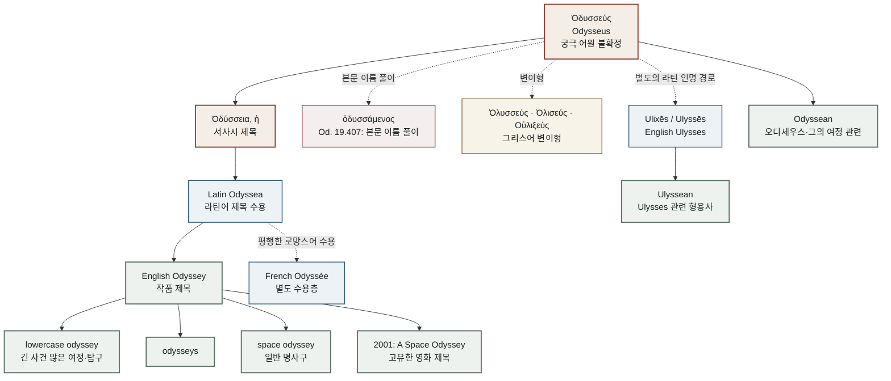

# Odyssey (오뒷세이아 / Ὀδύσσεια)

> **요약**: 영어 *odyssey*는 처음부터 ‘모험 여행’을 뜻한 보통명사가 아니었다. 오디세우스의 귀환을 노래한 서사시 제목 *Odyssey*가 먼저 있었고, 그 제목이 한 사람의 이름에서 경험의 형식으로 확장되면서 오늘날의 ‘길고 사건 많은 여행’과 ‘지적·영적 탐구’를 뜻하는 소문자 명사가 되었다.

---

## 1. 어원 전파 계통도 (Etymological Transmission Tree)

이 도식에서 실선은 이름에서 제목을 거쳐 영어 표제어로 이어지는 확인 가능한 어휘 관계를, 점선은 평행 수용 또는 별도의 인명 경로를 나타낸다. 영어 *odyssey*와 *Ulysses*는 서로 다른 가지다. 전자는 서사시 제목의 보통명사화이고, 후자는 오디세우스 이름의 라틴계 변형이다. 프랑스어 *Odyssée*가 영어의 필수 중간 단계였다고 이 도식은 주장하지 않는다.

---

## 2. 인구어(PIE) 및 희랍어 원어근 분석 (PIE & Proto-Greek Morphology)

### 2.1 PIE 어근을 확정할 수 없는 이름

- **PIE 조어 어근**: Uncertain / Pending. 이름 Ὀδυσσεύς에 대해 확정된 PIE 어근은 채택하지 않는다.
- **가장 신중한 분류**: 선희랍 기층어(Pre-Greek substrate) 가능성이 제기된 고대 희랍 인명. Robert Beekes는 d/l 및 u/i 변이와 여러 희랍어형을 근거로 이 가설을 제안한다.
- **학설의 지위**: 베케스가 잠정적으로 제시한 *Od/luky(e)u-*와 비슷한 형태는 저자 특정적 선희랍 재구이며 확정된 PIE 어근이 아니다. 이 문서의 역사적 어원 상태는 Uncertain / Pending으로 유지한다.

### 2.2 LSJ가 보존하는 희랍어형

Liddell–Scott–Jones(LSJ)의 Ὀδυσσεύς 항목은 다음과 같은 인명 변이군과 관련 파생형을 함께 기록한다. 이 목록은 고대 문헌에 나타난 형태의 범위를 보여주지만, 각 형태가 서로 어떤 역사적 순서로 이어졌는지를 단독으로 증명하지는 않는다.

| 형태 | 전사·기능 | 문헌적 의미 |
|:---|:---|:---|
| Ὀδυσσεύς | *Odysseus* | 호메로스의 인명형 |
| Ὀδυσεύς | *Odyseus* | 자음 중복이 다른 변이형 |
| Οὐλιξεύς, Οὐλίξης | *Oulixeus, Oulixēs* | 라틴계 이름과 연결되는 희랍 변이형 |
| Ὀλυσεύς, Ὀλυσσεύς | *Olyseus, Olysseus* | `l`을 보이는 변이형 |
| Ὀλυτεύς, Ὀλυττεύς, Ὀλισεύς, Ὠλυσσεύς | *Olyteus, Olytteus, Oliseus, Ōlysseus* | LSJ가 열거하는 추가 변이형 |
| Ὀδύσσεια, Ὀδύσσειος | *Odysseia, Odysseios* | 서사시 제목 및 관련 파생형 |

LSJ는 ὀδύσσομαι와 이름을 연결하는 설명을 **신화적 어원(mythic etymology)**으로 다룬다. 그러므로 ‘오디세우스라는 이름의 역사적 기원이 분노를 뜻하는 동사에서 확정되었다’고 쓰는 대신, 호메로스 서사가 이름을 분노·적대의 말놀이로 설명했다는 사실과 역사언어학적 어원은 분리해야 한다.

『오뒷세이아』 19.407의 실제 형태는 **ὀδυσσάμενος**다. 이 형태는 ὀδύσσομαι의 아오리스트 중간태 분사로, “많은 이에게 분노한·그들을 미워한”이라는 능동·중간적 읽기와 “많은 이에게 미움을 받은”이라는 수동적 읽기를 함께 열어 둔다. ὀδύσσομαι의 직접 의미를 ὀδύνη(신체적 고통)나 ὀδύρομαι(탄식하다, 애도하다)와 합쳐 ‘고통받는 자’로 고정하지 않는다. 고통은 오디세우스의 서사에서 파생되는 해석이지 이 구절의 직접 어휘 의미가 아니다.

이름과 동사의 관계를 설명할 때 일반적인 로마자 표기 *odussasthai*를 19.407의 실제 활용형처럼 제시하지 않는다. 부정사나 표제형을 언급할 때는 ὀδύσσομαι, 해당 본문을 인용할 때는 ὀδυσσάμενος라고 구분한다.

### 2.3 실제 본문형과 표제형

이 항목은 사전의 표제형과 호메로스 본문에 실제로 찍힌 굴절형을 구분한다.

| 실제 형태 | 표제형 또는 관련어 | 형태론 | 검증 위치 |
|:---|:---|:---|:---|
| `πολύτροπον` | `πολύτροπος` | 남성 대격 단수 형용사; `ἄνδρα`와 일치 | _Od._ 1.1, [Scaife](https://atlas.perseus.tufts.edu/library/passage/urn%3Acts%3AgreekLit%3Atlg0012.tlg002.perseus-grc2%3A1.1-1.6/) |
| `ὠδύσαο` | `ὀδύσσομαι` | 2인칭 단수 부정과거 중간태 직설법; `οἱ`는 여격 단수 | _Od._ 1.62, [Furman](https://folio.furman.edu/dramaturg/Homer/Odyssey/pages/chunk_003.html) |
| `πολύμητις` | `πολύμητις` | 남성 주격 단수; `Ὀδυσσεύς`와 함께 발화 도입 | _Od._ 9.1, [DCC](https://dcc.dickinson.edu/homer-odyssey/ix-1-46) |
| `Ὀδυσεὺς` / `Ὀδυσσεύς` | `Ὀδυσσεύς` | 남성 고유명사 주격 단수; 판본별 단일·이중 sigma | _Od._ 9.19, [DCC](https://dcc.dickinson.edu/homer-odyssey/ix-1-46) |
| `ὀδυσσάμενος` | `ὀδύσσομαι` | 부정과거 중간태 남성 주격 단수 분사 | _Od._ 19.407, [DCC](https://dcc.dickinson.edu/homer-odyssey/xix-405%E2%80%93454) |
| `ὀδύσασθαι` | `ὀδύσσομαι` | 부정과거 중간태 부정사; 19.407의 실제 형태가 아님 | [LSJ](https://atlas.perseus.tufts.edu/dictionaries/entry/urn%3Acite2%3Ascaife-viewer%3Adictionaries.v1%3Alsj-n72123/) |
| `Ὀδύσσεια, ἡ` | `Ὀδύσσεια` | 여성 명사 주격형; 작품 제목 | [LSJ](https://atlas.perseus.tufts.edu/dictionaries/entry/urn%3Acite2%3Ascaife-viewer%3Adictionaries.v1%3Alsj-n72120/) |

따라서 영어식 *odussasthai*를 남겨야 할 경우에는 그리스어 **ὀδύσασθαι**의 부정사 음역이라고 명시해야 한다. 19.407의 본문형은 **ὀδυσσάμενος**이며, 두 형태를 합쳐 “실제 원문에 *odussasthai*가 있다”고 쓰는 것은 형태론적 오류이다.

---

## 3. 호메로스 서사시 원전 용례 및 인명학 (Homeric Epic Context & Onomastics)

오뒷세이아의 이름은 한 번에 “뜻이 공개되는” 표제어가 아니다. 시는 먼저 이름 없는 **ἄνδρα**, 즉 “한 남자”를 내세우고, 이방인의 자기소개와 가짜 이름, 흉터의 기억을 차례로 통과시킨 뒤에야 이름을 사회적·신체적 현실로 되돌려 놓는다. 현대 영어 *odyssey*가 인물명을 지우며 일반적인 여정으로 확장된 것과 달리, 호메로스의 서사는 이름을 숨기고 다시 돌려주는 방식으로 귀환을 만든다.

### 3.1 이름보다 먼저 오는 사람: _Od._ 1.1

서사시의 첫 행은 다음과 같다.

- *“ἄνδρα μοι ἔννεπε, μοῦσα, πολύτροπον”* — “그 많은 길을 겪은 남자를 내게 말해다오.” (_Od._ 1.1, [Scaife 원문](https://atlas.perseus.tufts.edu/library/passage/urn%3Acts%3AgreekLit%3Atlg0012.tlg002.perseus-grc2%3A1.1-1.6/))

여기서 실제 인용형은 표제형 **πολύτροπος**가 아니라 **πολύτροπον**이다. **πολύτροπον**은 `ἄνδρα`와 일치하는 남성 대격 단수 형용사이며, 뒤따르는 1.2–5행의 방랑, 도시와 인간의 마음을 봄, 고통, 동료들의 귀향을 한꺼번에 예고한다([Furman Greek Reader 1.1–1.30](https://folio.furman.edu/dramaturg/Homer/Odyssey/pages/chunk_001.html)).

그러므로 **πολύτροπος가 Ὀδυσσεύς의 어원이라는 주장은 성립하지 않는다.** 이 형용사는 이름을 직접 풀어 주는 낱말이 아니라, 이름을 지연한 채 서사의 주제를 여는 프로그램적 수식이다. “교활한 사람” 하나로 번역해 버리면 다중의 길, 전환, 고통과 인식의 폭이 좁아진다.

### 3.2 신들의 질문 속 동사: _Od._ 1.62

아테나가 제우스에게 묻는다.

- *“Τροίῃ ἐν εὐρείῃ· τί νύ οἱ τόσον ὠδύσαο, Ζεῦ;”* — “넓은 트로이에서, 제우스여, 어찌하여 그를 그토록 미워하셨습니까?” (_Od._ 1.62, [Furman Greek Reader 1.60–1.93](https://folio.furman.edu/dramaturg/Homer/Odyssey/pages/chunk_003.html))

**ὠδύσαο**는 `ὀδύσσομαι`의 2인칭 단수 부정과거 중간태 직설법이고, **οἱ**는 그 대상인 오디세우스를 가리키는 여격 단수 대명사이다. 이 질문은 이름과 동사의 소리·의미 공명을 만들어 내며, LSJ도 1.62를 Ὀδυσσεύς의 “신화적 기원”과 연결해 인용한다([LSJ `ὀδύσσομαι`](https://atlas.perseus.tufts.edu/dictionaries/entry/urn%3Acite2%3Ascaife-viewer%3Adictionaries.v1%3Alsj-n72123/)). 그러나 그것은 시 안에서 이름을 다시 읽게 만드는 내부 에티몰로지이며, 실제 이름이 역사적으로 “미움받는 자”에서 파생되었다는 증명은 아니다.

### 3.3 이름을 말하는 순간: _Od._ 9.1, 9.19–20

9권의 첫 행은 말하기의 장면을 **πολύμητις Ὀδυσσεύς**로 연다.

- *“τὸν δ᾽ ἀπαμειβόμενος προσέφη πολύμητις Ὀδυσσεύς”* — “그러자 많은 계책을 아는 오디세우스가 대답하여 말했다.” (_Od._ 9.1, [DCC 9.1–46](https://dcc.dickinson.edu/homer-odyssey/ix-1-46))

여기서 **πολύμητις**는 남성 주격 단수이고, 이 표현은 반복되는 발화 도입 정형구이다. 1.1의 희귀하고 프로그램적인 **πολύτροπον**과 달리, **πολύμητις Ὀδυσσεύς**는 오디세우스가 이제 자신의 목소리로 과거를 말하는 장면을 배치한다. 정형구의 기능은 심리 특성의 단순 반복이라기보다, 영웅을 서사 내부의 화자이자 자기 평판의 제작자로 무대에 세우는 데 있다.

그는 곧 자신의 이름과 혈통을 공개한다.

- *“εἴμ᾽ Ὀδυσεὺς Λαερτιάδης, ὃς πᾶσι δόλοισιν / ἀνθρώποισι μέλω, καί μευ κλέος οὐρανὸν ἵκει.”* (_Od._ 9.19–20, [DCC 9.1–46](https://dcc.dickinson.edu/homer-odyssey/ix-1-46))

**Λαερτιάδης**는 성격을 나타내는 별칭이 아니라 라에르테스의 아들이라는 부칭·계보 표지이다. 이 판본의 9.19에는 **Ὀδυσεὺς**가 보이고, 다른 판본과 표제형에는 **Ὀδυσσεύς**가 보인다. 단일 sigma와 이중 sigma의 차이를 서로 다른 인물명이나 어원으로 읽어서는 안 된다. 이 자기소개에서 `δόλοι`와 `κλέος`는 독립적인 역사 증언이라기보다, 파이아케스인들 앞에서 낯선 이가 사회적으로 읽힐 수 있는 영웅 화자로 자신을 연출하는 언어 행위이다.

### 3.4 이름으로 사라지기: _Od._ 9.406–414

폴뤼페모스 장면에서 오디세우스는 이름을 말하지 않음으로써 살아남는다.

- *“ἦ μή τίς σ᾽ αὐτὸν κτείνει δόλῳ ἠὲ βίηφιν;”* (_Od._ 9.406)
- *“ὦ φίλοι, Οὖτίς με κτείνει δόλῳ οὐδὲ βίηφιν.”* (_Od._ 9.408)
- *“εἰ μὲν δὴ μή τίς σε βιάζεται οἶον ἐόντα”* (_Od._ 9.410)
- *“ὡς ὄνομ᾽ ἐξαπάτησεν ἐμὸν καὶ μῆτις ἀμύμων.”* (_Od._ 9.414, [Scaife 9.406–10.160](https://atlas.perseus.tufts.edu/library/passage/urn%3Acts%3AgreekLit%3Atlg0012.tlg002.perseus-grc2%3A9.406-10.160); [DCC 9.409–460](https://dcc.dickinson.edu/homer-odyssey/ix-409-460))

**Οὖτίς**는 이 장면에서 사용하는 전술적 가명이다. 키클롭스들은 그것을 “아무도”라는 부정적 표현으로 알아듣고, 오디세우스는 바로 그 오해 때문에 도움을 차단한다. `μή τίς`와 `Οὖτίς`의 분절·질문 응답 관계, 그리고 9.414의 `ὄνομα`와 `μῆτις`의 결합은 텍스트에 분명한 말장난의 효과를 준다. 다만 이것을 **Οὖτίς = Ὀδυσσεύς**, 또는 **μῆτις가 μή τίς에서 파생되었다**는 형태론적 등식으로 바꾸어서는 안 된다. 본문이 명시하는 것은 이름과 훌륭한 계책이 키클롭스를 속였다는 사실이며, 더 강한 어원적 등식은 문학적 추론의 영역이다.

### 3.5 흉터에서 이름으로: _Od._ 19.392–412, 19.474–475

19.392–404에서 에우리클레이아는 씻김 도중 흉터를 알아본다. 흉터는 기억을 촉발하지만, 그 구간 자체가 완성된 음성 인식을 담고 있는 것은 아니다([DCC 19.361–404](https://dcc.dickinson.edu/homer-odyssey/xix-361%E2%80%93404)). 이어서 외조부 아우톨리코스가 아기의 이름을 설명한다.

- *“πολλοῖσιν γὰρ ἐγώ γε ὀδυσσάμενος ... / τῷ δ᾽ Ὀδυσεὺς ὄνομ᾽ ἔστω ἐπώνυμον”* (_Od._ 19.407–409, [DCC 19.405–454](https://dcc.dickinson.edu/homer-odyssey/xix-405%E2%80%93454))

**ὀδυσσάμενος**는 `ὀδύσσομαι`의 부정과거 중간태 남성 주격 단수 분사이다. 문맥상 “많은 사람들에게 화를 내며” 또는 “많은 사람들에게 미움받으며”라는 두 방향의 해석이 가능하다는 주석 전통이 있다. 이어지는 **ὄνομ᾽ ... ἐπώνυμον**은 이름을 의미 있게 부여하는 본문 내 명명 설화를 만든다. 이것은 오디세우스라는 인물의 후대적 기억을 이름의 사건으로 되감는 **호메로스 내부의 민간어원적·서사적 재분석**이지, 이름의 선사시대 기원을 입증하는 자료가 아니다.

19.410–412는 파르나소스에서 줄 선물을 약속하는 장면으로 명명 단위를 이어 가지만, 에우리클레이아의 말로 완성되는 인식은 다음 구간에 있다.

- *“ἦ μάλ᾽ Ὀδυσσεύς ἐσσι, φίλον τέκος”* (_Od._ 19.474–475, [DCC 19.455–498](https://dcc.dickinson.edu/homer-odyssey/xix-455%E2%80%93498))

따라서 19.392–412는 **흉터가 인식을 시작하고 이름의 설화가 그 기억을 되받는 단위**라고 말할 수 있지만, 그 범위 안에서 이미 구두 인식이 완료되었다고 말해서는 안 된다.

### 3.6 정형구와 이름 기능의 분리

| 실제 인용형 | 표제형·형태 | 서사적 기능 | 어원 주장과의 거리 |
|:---|:---|:---|:---|
| **πολύτροπον** (_Od._ 1.1) | 표제형 `πολύτροπος`; 남성 대격 단수 | 이름을 늦추고 방랑·다중성의 서사 전체를 여는 프로그램적 형용사 | Ὀδυσσεύς의 직접 어원이 아님 |
| **πολύμητις Ὀδυσσεύς** (_Od._ 9.1) | `πολύμητις`; 남성 주격 단수 | 오디세우스를 말하는 영웅, 자기 서사의 화자로 도입하는 반복 정형구 | 이름의 형태론과 무관한 서사적 수식 |
| **πολυμήχαν᾽** (_Il._ 2.173) | `πολυμήχανος`; 남성 호격 단수, 시적 탈락형 | 직접 호명 속에서 다수의 계책을 가진 인물이라는 역할을 호출 | 이름의 어원이 아니라 호명 공식 |
| **πτολίπορθος Ὀδυσσεύς** (_Od._ 8.3) | `πτολίπορθος`; 남성 주격 단수 | 트로이 함락의 전사적 공적을 전경화 | `Ὀδυσσεύς`의 어원을 설명하지 않음 |
| **Οὖτίς** (_Od._ 9.408) | 전술적 가명·고유명사적 사용 | 이름을 지워 감시와 공동체의 응답을 우회 | Ὀδυσσεύς와 형태론적으로 동일하지 않음 |

이 표에서 **형태**는 실제 본문에 나온 표면형을, **표제형**은 사전에서 찾는 기본형을 뜻한다. 특히 `πολύτροπος`, `πολύμητις`, `πολυμήχανος`, `πτολίπορθος`를 모두 “오디세우스의 어원”으로 읽으면, 정형구의 운율·발화·호명 기능과 인명학을 한 층위로 납작하게 만든다. _Il._ 2.173의 호격형은 [Scaife 해당 행](https://atlas.perseus.tufts.edu/nodes/urn%3Acts%3AgreekLit%3Atlg0012.tlg001.perseus-grc2%3A2.173/), _Od._ 8.3의 주격형은 [Scaife 해당 행](https://atlas.perseus.tufts.edu/nodes/urn%3Acts%3AgreekLit%3Atlg0012.tlg002.perseus-grc2%3A8.3/)에서 확인할 수 있다.

---

## 4. 역사적 전파 및 수용사 경로 (Historical Transmission & Reception)

### 4.1 희랍어 이름군과 라틴어 이중형

LSJ가 열거한 Οὐλιξεύς·Οὐλίξης 같은 희랍어형은 라틴어 **Ulixēs / Ulyssēs**와 연결되는 이름의 변이 공간을 보여준다. Lewis–Short는 라틴어 **Ulixes**와 **Ulysses**를 고전 문헌의 용례와 함께 기록한다. 베케스는 서부 그리스어·도리스 계열을 통한 전승 가능성을 논의하면서 라틴어 *-x-*의 기원을 해결하지 않으며, 밀러는 아이올리스·코린토스·도리스 계열의 매개형을 별도로 검토한다. 그러므로 *Ulysses*를 호메로스형의 단순한 직접 음역으로 쓰지 않는다.

다만 라틴어 경로는 닫힌 문제가 아니다. Lewis–Short가 보존하는 오래된 설명은 에트루리아어 *Uluxe* 또는 시켈리아 희랍어 Οὐλίξης를 후보로 들고, Beekes는 남부 이탈리아의 서부 희랍어·도리아계 형태를 더 개연적인 경로로 본다. 밀러가 제시하는 비선형적 방언 매개와의 관계도 학설로 분리한다. 이 문서는 어느 한 경로를 확정하지 않는다. [Miller, *The Roman Odysseus*](https://dash.harvard.edu/server/api/core/bitstreams/eeba8c85-1834-4767-ba37-1e5064832ac4/content)

프랑스어 *odyssée*는 그리스어 작품명에서 온 평행한 로망스어 수용층으로 기록할 수 있다. 아카데미 프랑세즈는 이 말을 고유한 서사시명으로 제시한 뒤, 18세기부터 긴 모험·여정이라는 일반 의미가 생겼다고 설명한다([Académie française, *odyssée*](https://www.dictionnaire-academie.fr/article/A9O0213)). 이는 영어 *odyssey*가 반드시 프랑스어를 거쳐 왔다는 증거가 아니라, 같은 고전 제목이 서로 다른 언어에서 보통명사화된 사례다.

이 계열 전체를 그리스어에서 라틴어, 고대 프랑스어, 중세 영어, 현대 영어로 이어지는 자동 계단으로 그리지 않는다. 각 중간 단계는 실제 표제형·문헌 연대·차용 방향이 확인될 때만 추가할 수 있으며, 현재 문서에서는 고대 프랑스어·중세 영어의 보편적 매개 경로를 Pending으로 남긴다.

### 4.2 영어 표제어와 최초 기록 날짜

아래 날짜는 **Merriam-Webster의 First Known Use 표지**다. 이는 해당 사전 편집자가 확인한 가장 이른 기록이지, OED의 첫 인용문이나 단어의 실제 창안 시점과 동일하지 않다.

| 영어형 | 품사·기능 | Merriam-Webster 표지 | 확실성 및 주의 |
|:---|:---|:---|:---|
| *Odyssey* | 작품명; 호메로스 서사시 제목 | circa 1600 | Etymonline의 표지; OED 최초 인용으로 전용하지 않음 |
| *Ulysses* | 명사; 오디세우스의 라틴계 이름 | circa 1530 | MW First Known Use; Joyce의 소설 제목·미국식 남성 이름 용법은 별도 수용 |
| *Odyssean* | 형용사; 오디세우스 또는 그의 여정에 관련됨 | circa 1614 | MW First Known Use; 일반화된 여정 용법은 대문자 여부가 다름 |
| *Odysseus* | 명사; 이타카의 왕이자 트로이 전쟁의 희랍 지도자 | 1616 | 고유명사; MW First Known Use |
| *odyssey* | 명사; 긴 방랑·여정, 지적·영적 탐구 | 1886 | MW First Known Use; OED 날짜로 전용할 수 없음 |
| *Ulyssean* | 형용사; Ulysses에 관련되거나 닮음 | 별도 날짜 없음 | MW 표제어는 확인되지만 First Known Use 표지는 없음 |

OED의 관련 항목(`odyssey`, `Odyssean`, `Odysseus`, `Ulysses`)은 이번 조사 환경에서 직접 열람할 때 403으로 차단되었다. 따라서 OED의 정확한 최초 인용문·표제어별 날짜·대문자 변천은 **Pending**으로 남긴다.

---

## 5. 음운 및 의미 변화사 (Phonological & Semantic Evolution)

### 5.1 음운·철자 변이와 대문자

이 계열의 핵심 변화는 규칙적인 한 줄의 음운 변천이라기보다, 고대 희랍어 인명 자체가 여러 형태로 전승된 뒤 서로 다른 문화권에서 다른 이름으로 정착한 현상이다. LSJ의 `d/l`, 모음, 자음 중복 변이와 라틴어 *Ulixēs / Ulyssēs*는 그 갈라짐을 문헌적으로 보여준다. 그러나 이 자료만으로 모든 변이형의 계보를 일렬로 배열할 수는 없다.

현대 영어에서는 **대문자와 소문자가 의미 층위를 가른다**.

- *the Odyssey* 또는 *Odyssey*: 호메로스의 서사시 제목. 문장부호·기울임꼴은 편집 규정에 따르지만, 고유한 작품명이라는 점은 유지된다.
- *an odyssey*, *odysseys*: 긴 사건 많은 여행 또는 지적·영적 탐구를 뜻하는 소문자 보통명사.
- *Odysseus*: 신화적 인물의 고유명사.
- *Ulysses*: Odysseus의 라틴계·영어 이름 및 후대 작품명·인명 용법.
- *Odyssean*: 사전 표제어는 대문자이지만, Collins는 ‘긴 사건 많은 여정’이라는 일반화된 형용사 용법을 **often not capital**로 표시한다. 직접적인 오디세우스·호메로스 암시에는 대문자 *Odyssean*을 우선하고, 일반화된 용법의 소문자 *odyssean*은 문맥과 편집 규정에 따라 허용하는 것이 안전하다.

### 5.2 제목의 보통명사화

의미 변화는 세 단계로 정리할 수 있다.

1. **작품명**: *Odyssey*는 오디세우스의 방랑과 귀환을 다룬 서사시를 가리킨다.
2. **사건 많은 여정**: 서사의 구조가 인물의 고유한 이름을 벗어나, 긴 시간과 여러 전환을 겪는 여행을 가리키는 보통명사로 일반화된다.
3. **내적 탐구**: Merriam-Webster가 별도 의미로 기록하는 지적·영적 방랑/탐구로 확장된다. 현대 사전과 코퍼스형 예시는 *personal*, *spiritual*, *experimental*, *legal*, *continuing* 같은 수식과 복수형을 허용한다.

이 과정은 단순한 ‘유명한 이름에서 나온 단어’보다 정교하다. 한 인물의 **귀환 서사 전체가 경험을 해석하는 은유적 틀**이 되었고, 그 틀이 다시 일반 여정과 내면의 탐구를 명명하는 생산적 명사가 된 것이다. ‘인생의 여정’은 이 후대 보통명사를 삶에 적용한 현대적 은유이지, Ὀδυσσεύς 또는 *Odyssey*의 원래 어원적 의미가 아니다.

---

## 6. 현대 영어 파생어군 및 어휘 패밀리 (Modern English Derivatives)

| 품사·형태 | 단어 | 의미 및 용법 | 최초 기록 | 확실성 |
|:---|:---|:---|:---|:---|
| 작품명 | *Odyssey* | 호메로스의 서사시 제목 | 정확한 OED 최초 인용 보류 | 문헌·사전 입증 |
| 명사 | *odyssey* | 길고 사건 많은 방랑·여정; 지적·영적 탐구 | MW First Known Use 1886 | 문헌·사전 입증 |
| 복수명사 | *odysseys* | *odyssey*의 규칙적 복수형 | 별도 날짜 없음 | 생산적 현대 용법 |
| 형용사 | *Odyssean* | 오디세우스 또는 그의 여정에 관련되거나 특징적인 | MW First Known Use circa 1614 | 문헌·사전 입증 |
| 형용사 | *odyssean* | 일반화된 의미의 길고 사건 많은 여정에 관한 | 별도 날짜 없음 | 대문자 문맥 의존 |
| 고유명사 | *Odysseus* | 이타카의 왕이자 트로이 전쟁의 희랍 지도자 | MW First Known Use 1616 | 고유명사·문헌 입증 |
| 고유명사·작품명 | *Ulysses* | Odysseus의 라틴계 이름; Joyce의 1922년 소설 제목; 미국식 남성 이름 | MW First Known Use circa 1530 | 이름 가지는 입증, 세부 용법은 분리 |
| 형용사 | *Ulyssean* | Ulysses에 관련되거나 닮은 | MW 표제어, 날짜 없음 | 파생형 입증 |

여기서 *Odysseus*와 *Ulysses*는 *odyssey*의 동의어·파생 보통명사가 아니다. 이들은 같은 신화적 인물과 그 수용사를 추적하는 **인명 가지**이며, 핵심 표제어 *odyssey*는 작품 제목에서 일반명사로 확장된 **서사·경험 가지**다.

---

## 7. 인명·신명 파생 고유명사 및 관용표현 (Eponymous Terms & Cultural Usage)

### 7.1 관용구가 아니라 생산적인 연어

현대 영어에서 *odyssey*는 사전이 인정하는 보통명사이며, 다양한 수식어와 결합한다. Merriam-Webster의 현재 문장 자료는 자동 수집된 예문 모음이므로 개별 문장의 문체적 대표성을 보장하지 않지만, 관사·소유격·복수형·기간·영역 수식어가 자유롭게 결합한다는 사실은 확인해 준다.

| 표현 | 분류 | 문서화 판단 |
|:---|:---|:---|
| *a personal odyssey*, *a spiritual odyssey* | 생산적 명사구 | 여행·탐구라는 은유가 투명하게 해석됨 |
| *a space odyssey* | 일반 명사구·콜로케이션 | ‘우주에서의/우주를 다루는 사건 많은 여정’으로 조합 가능; 고정 숙어 아님 |
| *space odysseys* | 생산적 복수형 | 복수화가 가능하므로 관용구보다 보통명사구에 가까움 |
| *Odyssean journey* | 문학적 암시를 담은 형용사구 | 오디세우스·호메로스의 여정을 직접 환기할 때 대문자 표기 우선 |
| *2001: A Space Odyssey* | 고유한 영화 제목 | 1968년 영화의 공식 제목; 일반 명사구와 분리해 대문자 유지 |

Collins의 *space odyssey* 구문 페이지는 *dystopian space odyssey*처럼 수식어가 붙은 예와 복수형을 보여주며, Oxford는 *2001: A Space Odyssey*를 별도의 영화 제목 항목으로 제시한다. 따라서 **일반적인 *space odyssey*는 관용구가 아니라 생산적인 명사구**이고, 특정 영화·작품·임무의 이름일 때만 고유명사적 대문자화를 적용한다.

### 7.2 인문학적 통찰: 여행의 이름이 된 귀환

오디세우스의 여정은 단순히 ‘오래 걸린 여행’이 아니다. 사전의 “many changes of fortune”와 “intellectual or spiritual quest”라는 두 층위는, *odyssey*가 공간적 이동을 시간·정체성·귀환의 문제로 넓혔음을 보여준다. 그래서 *odyssey*라고 부르는 순간 우리는 거리뿐 아니라 우회, 상실, 변신, 그리고 끝내 돌아갈 곳을 상상하게 된다.

이 해석은 사전 정의에서 직접 추론한 문화적 독해이며, 모든 현대 용례가 반드시 오디세우스 신화를 의식한다는 뜻은 아니다. 소문자 *odyssey*가 널리 일반화된 뒤에는 신화적 암시가 약해진 문장도 많지만, 그 일반화 자체가 고전 서사의 형식을 일상 경험의 이름으로 바꾼 흔적이다.

### 7.3 후대 수용과 이름의 분기

*Ulysses*는 라틴계 이름으로서 별도의 문화적 생을 얻었다. Collins와 Oxford가 기록하는 James Joyce의 1922년 소설 제목은 신화적 이름을 근대 도시의 의식 흐름과 일상 경험에 겹쳐 놓은 사례지만, 그 작품 제목을 *odyssey*의 보통명사 용례와 합치해서는 안 된다. 하나는 인명·작품명 가지이고, 다른 하나는 여정의 일반명사 가지다.

*Odyssean*은 오디세우스 또는 그의 여정과 관련되거나 그것을 닮았다는 뜻이다. 성장·자기발견·치유는 특정 문맥에서 생기는 해석이지 필수적인 사전 의미가 아니다. *Ulysses*는 오디세우스의 라틴·영어 이름이며 ‘여정’을 뜻하는 일반명사가 아니므로 *odyssey*와 동의어로 취급하지 않는다.

> [!NOTE] 용법 판정 원칙
> 이름·작품·영화 제목을 직접 가리키면 대문자와 기울임꼴을 보존한다. 일반화된 여정·탐구를 가리키면 소문자 보통명사로 기록한다. 대문자 *Odyssean*과 소문자 *odyssean*은 사전과 편집 관행이 완전히 일치하지 않으므로 문맥을 함께 기록한다.

---

## 8. 어원 증거 매트릭스 및 학술 출처 (Evidence Matrix & References)

| 어원 및 수용 명제 | 언어 층위 | 확실성 등급 | 출전 및 학술 문헌 근거 |
|:---|:---|:---|:---|
| `Ὀδύσσεια, ἡ`가 오디세우스 서사시의 희랍어 여성 제목이라는 사실 | 고대 희랍어·작품명 | 문헌 입증 (Established) | [LSJ `Ὀδύσσεια`](https://atlas.perseus.tufts.edu/dictionaries/entry/urn%3Acite2%3Ascaife-viewer%3Adictionaries.v1%3Alsj-n72120/); [LSJ `Ὀδυσσεύς`](https://atlas.perseus.tufts.edu/dictionaries/entry/urn%3Acite2%3Ascaife-viewer%3Adictionaries.v1%3Alsj-n72122/) |
| `Ὀδυσσεύς`가 남성 고유명사이고 `Ὀδυσεύς`, `Οὐλιξεύς`, `Ὀλυσσεύς` 등 변이형이 문헌에 보인다는 사실 | 고대 희랍어 인명 | 문헌 입증 (Established) | [LSJ `Ὀδυσσεύς`](https://atlas.perseus.tufts.edu/dictionaries/entry/urn%3Acite2%3Ascaife-viewer%3Adictionaries.v1%3Alsj-n72122/) |
| `Ὀδυσσεύς`를 `ὀδύσσομαι`와 `-εύς`로 형태론적으로 분해할 수 있다는 주장 | 고대 희랍어 형태론 | 근거 없음 (Spurious) | LSJ는 관련 신화적 설명을 전하지만, 이 문서는 해당 분해를 역사적 형태론으로 승인하지 않음 |
| 이름의 궁극적 기원이 확정된 PIE 어근이라는 주장 | 비교언어학 | 보류 (Pending) | 확정된 PIE 대응어를 채택하지 않음; [Beekes, “Pre-Greek Names,” pp. 194–195](https://www.robertbeekes.nl/wp-content/uploads/2019/08/b124.pdf) |
| `d/l`, `u/i` 변이와 선희랍 기층 가설 | 선희랍 기층 | 논쟁적 가설 (Contested) | [Beekes, “Pre-Greek Names,” pp. 194–195](https://www.robertbeekes.nl/wp-content/uploads/2019/08/b124.pdf) |
| _Od._ 1.1의 실제형 `πολύτροπον`이 `ἄνδρα`와 일치하는 남성 대격 단수라는 사실 | 호메로스 희랍어 문법 | 문헌·형태 입증 (Established) | [Scaife _Od._ 1.1–1.6](https://atlas.perseus.tufts.edu/library/passage/urn%3Acts%3AgreekLit%3Atlg0012.tlg002.perseus-grc2%3A1.1-1.6/); [Furman Greek Reader](https://folio.furman.edu/dramaturg/Homer/Odyssey/pages/chunk_001.html) |
| `πολύτροπον`이 `Ὀδυσσεύς`의 직접 어원이라는 주장 | 호메로스 어휘·인명학 | 부정 (Spurious) | _Od._ 1.1은 이름을 지연한 서사적 수식을 제공할 뿐이며, 이름 유래를 말하지 않음 |
| _Od._ 1.62의 `ὠδύσαο`가 `ὀδύσσομαι`의 2인칭 단수 아오리스트 중간태 직설법이라는 사실 | 호메로스 희랍어 문법 | 문헌·형태 입증 (Established) | [Furman Greek Reader, _Od._ 1.60–1.93](https://folio.furman.edu/dramaturg/Homer/Odyssey/pages/chunk_003.html); [LSJ `ὀδύσσομαι`](https://atlas.perseus.tufts.edu/dictionaries/entry/urn%3Acite2%3Ascaife-viewer%3Adictionaries.v1%3Alsj-n72123/) |
| `ὠδύσαο`와 이름 사이의 내부적 소리·의미 공명 | 호메로스 서사·명명 | 강한 텍스트 추론 (Strong inference) | _Od._ 1.62; _Od._ 19.407–409; [LSJ `ὀδύσσομαι`](https://atlas.perseus.tufts.edu/dictionaries/entry/urn%3Acite2%3Ascaife-viewer%3Adictionaries.v1%3Alsj-n72123/) |
| _Od._ 9.1의 `πολύμητις Ὀδυσσεύς`가 오디세우스의 발화를 여는 반복 정형구라는 해석 | 호메로스 정형구·서사 기능 | 강한 텍스트 추론 (Strong inference) | [DCC _Od._ 9.1–46](https://dcc.dickinson.edu/homer-odyssey/ix-1-46) |
| _Od._ 9.19–20의 `εἴμ᾽ Ὀδυσεὺς/Ὀδυσσεύς Λαερτιάδης`가 자기소개·부칭·명성의 장면이라는 사실 | 호메로스 인명·서사 | 문헌 입증 및 해석 분리 (Established + Strong inference) | [DCC _Od._ 9.1–46](https://dcc.dickinson.edu/homer-odyssey/ix-1-46) |
| _Od._ 9.406–414의 `Οὖτίς`가 키클롭스를 속이기 위한 전술적 가명이고, 9.414가 `ὄνομα`와 `μῆτις`의 효과를 서술한다는 사실 | 호메로스 명명·화용론 | 문헌 입증 (Established) | [Scaife _Od._ 9.406–10.160](https://atlas.perseus.tufts.edu/library/passage/urn%3Acts%3AgreekLit%3Atlg0012.tlg002.perseus-grc2%3A9.406-10.160/); [DCC _Od._ 9.409–460](https://dcc.dickinson.edu/homer-odyssey/ix-409-460) |
| `μή τίς`·`Οὖτίς`·`μῆτις` 사이의 단어 경계·음성적 공명 | 호메로스 말장난 | 문학적 추론 (Strong inference; 형태론적 등식은 부정) | _Od._ 9.406, 9.408, 9.410, 9.414; [Scaife](https://atlas.perseus.tufts.edu/library/passage/urn%3Acts%3AgreekLit%3Atlg0012.tlg002.perseus-grc2%3A9.406-10.160/) |
| `μῆτις`가 `μή τίς`에서 역사적으로 파생되었다는 주장 | 고대 희랍어 형태론 | 근거 없음 (Spurious) | 본문은 속임수의 효과를 보여 주지만 두 표현의 형태론적 동일성을 주장하지 않음 |
| _Od._ 19.392–412에서 흉터가 인식을 촉발하고 19.407–409에서 아우톨뤼코스의 명명 설명이 삽입된다는 사실 | 호메로스 인식·명명 설화 | 문헌 입증 (Established) | [DCC _Od._ 19.361–404](https://dcc.dickinson.edu/homer-odyssey/xix-361%E2%80%93404); [DCC _Od._ 19.405–454](https://dcc.dickinson.edu/homer-odyssey/xix-405%E2%80%93454) |
| 19.407의 실제형 `ὀδυσσάμενος`가 `ὀδύσσομαι`의 남성 주격 단수 아오리스트 중간태 분사라는 사실 | 호메로스 희랍어 문법 | 문헌·형태 입증 (Established) | [DCC _Od._ 19.405–454](https://dcc.dickinson.edu/homer-odyssey/xix-405%E2%80%93454) |
| `ὀδυσσάμενος ... Ὀδυσεὺς ὄνομ᾽ ἔστω ἐπώνυμον`이 역사적 어원이 아니라 호메로스 내부의 명명 설화라는 판정 | 호메로스 민간어원·인명학 | 고대 설명은 Established, 역사적 어원은 Pending | _Od._ 19.407–409; [DCC _Od._ 19.405–454](https://dcc.dickinson.edu/homer-odyssey/xix-405%E2%80%93454); [LSJ `Ὀδυσσεύς`](https://atlas.perseus.tufts.edu/dictionaries/entry/urn%3Acite2%3Ascaife-viewer%3Adictionaries.v1%3Alsj-n72122/) |
| _Od._ 19.474–475의 `ἦ μάλ᾽ Ὀδυσσεύς ἐσσι`가 요청 범위 밖의 구두 인식을 완성한다는 사실 | 호메로스 인식 장면 | 문헌 입증 (Established) | [DCC _Od._ 19.455–498](https://dcc.dickinson.edu/homer-odyssey/xix-455%E2%80%93498) |
| `odussasthai`를 19.407의 실제형으로 제시하는 주장 | 그리스어 형태론·음역 | 부정 (Spurious) | 해당 부정사는 `ὀδύσασθαι`; 19.407의 본문형은 `ὀδυσσάμενος`임 ([LSJ `ὀδύσσομαι`](https://atlas.perseus.tufts.edu/dictionaries/entry/urn%3Acite2%3Ascaife-viewer%3Adictionaries.v1%3Alsj-n72123/)) |
| 라틴어 *Ulixes / Ulysses*의 존재와 고전 용례 | 라틴어 인명 | 문헌 입증 (Established) | [Lewis–Short, `Ulixes`](https://cld.bbaw.de/lemma/lat/Ulixes) |
| 라틴어 인명의 세부 경로를 에트루리아어·시켈리아 희랍어·서부 희랍어 중 하나로 확정하는 주장 | 라틴·서부 희랍어 접촉 | 논쟁적 가설 (Contested) | [Lewis–Short, `Ulixes`](https://cld.bbaw.de/lemma/lat/Ulixes); [Beekes, pp. 194–195](https://www.robertbeekes.nl/wp-content/uploads/2019/08/b124.pdf) |
| 프랑스어 *odyssée*의 18세기 일반명사화와 영어 전파 경로의 비동일성 | 프랑스어·영어 수용사 | 평행 수용은 문헌 입증, 영어 중간 단계 주장은 Pending | [Académie française, *odyssée*](https://www.dictionnaire-academie.fr/article/A9O0213) |
| 희랍어 제목 → 라틴어 *Odyssea* → 영어 작품명 *Odyssey*라는 표제 수용 관계 | 라틴·영어 수용사 | 문헌·사전 입증 (Established) | [LSJ `Ὀδύσσεια`](https://atlas.perseus.tufts.edu/dictionaries/entry/urn%3Acite2%3Ascaife-viewer%3Adictionaries.v1%3Alsj-n72120/); [Collins, `odyssey`](https://www.collinsdictionary.com/us/dictionary/english/odyssey) |
| 작품 제목에서 소문자 *odyssey*가 긴 여정·탐구를 뜻하는 보통명사로 일반화됨 | 현대 영어 의미사 | 문헌·사전 입증 (Established) | [Merriam-Webster, `odyssey`](https://www.merriam-webster.com/dictionary/odyssey); [Collins, `odyssey`](https://www.collinsdictionary.com/dictionary/english/odyssey) |
| 영어 작품명 *Odyssey*의 약 1600년 표지와 소문자 보통명사 *odyssey*의 MW 1886 표지 | 근대·현대 영어 | 사전별 표지 (Established, 사전 한정) | [Etymonline, `odyssey`](https://www.etymonline.com/word/odyssey); [Merriam-Webster, `odyssey`](https://www.merriam-webster.com/dictionary/odyssey) |
| *Odyssean*, *Odysseus*, *Ulysses*의 품사와 MW First Known Use 표지 | 현대 영어 인명·파생어 | 사전 입증 (Established, MW 한정) | [MW `Odyssean`](https://www.merriam-webster.com/dictionary/Odyssean); [MW `Odysseus`](https://www.merriam-webster.com/dictionary/Odysseus); [MW `Ulysses`](https://www.merriam-webster.com/dictionary/Ulysses) |
| *space odyssey*가 생산적 명사구이고 *2001: A Space Odyssey*가 고유 제목이라는 구분 | 현대 영어·대중문화 | 사용·사전 입증 (Established) | [Collins, `space odyssey`](https://www.collinsdictionary.com/us/dictionary/english/space-odyssey); [Oxford, `2001: A Space Odyssey`](https://www.oxfordlearnersdictionaries.com/definition/english/2001-a-space-odyssey) |
| OED의 정확한 최초 인용문·날짜·철자 변천 | 영어 역사사전 | 추가 조사 필요 (Pending) | [OED `odyssey`](https://www.oed.com/dictionary/odyssey_n), [OED `Odyssean`](https://www.oed.com/dictionary/odyssean_adj), [OED `Odysseus`](https://www.oed.com/dictionary/odysseus_n), [OED `Ulysses`](https://www.oed.com/dictionary/ulysses_n); 이번 환경에서 직접 열람 불가 |

> [!WARNING] 민간 어원 및 과잉 확정 주의
> ὀδύσσομαι와의 연결은 호메로스 내부의 신화적 어원 설명으로는 중요하지만, 역사언어학적으로 확정된 어원이라고 단정하지 않는다. Beekes의 선희랍 기층 재구와 라틴어 전파 경로도 학술적 가설 또는 이설 대립으로 표시한다. Merriam-Webster의 First Known Use 날짜를 OED의 최초 용례로 바꾸어 쓰지 않는다.

> [!NOTE] 확실성 요약
> 확립된 층위는 LSJ·Lewis–Short의 고대 형태 목록, 현대 사전의 품사·정의·대문자 구분, 그리고 생산적인 현대 명사구 용법이다. 선희랍 가설, 라틴어의 세부 전파 경로, OED의 정확한 역사 연대는 각각 Contested 또는 Pending으로 남겨 두며, 이 때문에 문서 상태를 `review`로 유지한다.

---

## 관련 항목

- [[entity-odysseus|오디세우스]]
- [[concept-xenia|크세니아]]
- [[concept-menis|메니스]]
- [[concept-nemesis|네메시스]]
- [[concept-aidos|아이도스]]
- [[word-achilles|Achilles]]
- [[words/index|호메로스 어원·영단어 사전 인덱스]]
